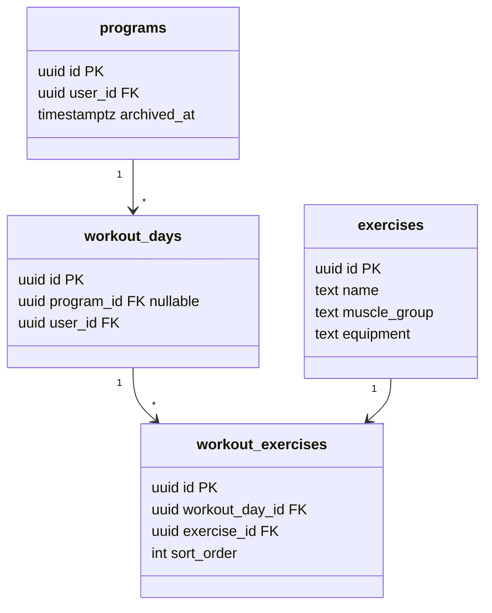
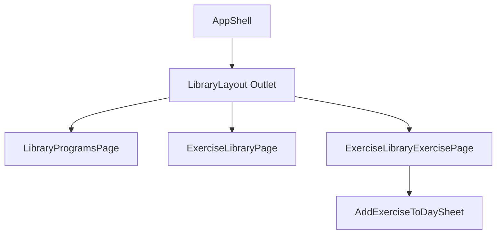

# Tech Plan — Exercise Library Browse & Add to Session (#196)

## Architectural Approach

### Key Decisions

| Decision | Choice | Rationale |
|---|---|---|
| **URL structure** | Nested routes under `/library`: index **redirect** → `/library/programs`; children `/library/programs`, `/library/exercises`, `/library/exercises/:exerciseId` | Matches Epic Brief; deep-linkable; aligns with React Router `Outlet` layout pattern used elsewhere in the app. |
| **Layout shell** | New `LibraryLayout` component wrapping `<Outlet />` + shared chrome (optional back/title region per child) | Single place for consistent padding/scroll; avoids duplicating `AppShell` children structure. |
| **Programs page** | Extract current `LibraryPage` body into `LibraryProgramsPage` (or rename move); **`LibraryPage` removed as route element** in favor of layout + child | Preserves `SavedWorkoutsSection` + `MyWorkoutsTab` behavior verbatim; `/library` redirect keeps bookmarks valid. |
| **Exercise browse UI** | New page composing **`useExerciseLibraryPaginated`** + **`useExerciseFilterOptions`** + list rows; reuse filter UX from **`ExerciseLibraryPicker`** / **`ExerciseFilterPanel`** patterns (debounced search, sheet for filters) | No new API; proven at scale (~600 rows via pagination). |
| **Exercise detail** | Route-level page using **`useExerciseFromLibrary`** / **`useExerciseById`**; embed **`ExerciseInstructionsPanel`** and shared metadata (emoji, muscle, equipment); **expand** collapsed instructions **default open** on this page if product prefers | Reuses content model; detail is not a second “panel-only” context. |
| **Add to session (v1)** | **Sheet or dialog**: pick **program** → pick **day** → **`useAddExerciseToDay`** with `sortOrder = maxExisting + 1` from **`useWorkoutExercises(dayId)`** | Epic Brief minimum: attach to **template** `workout_day`; same mutation as builder; RLS already covers `workout_exercises` insert. |
| **Program/day pickers** | **`useUserPrograms`** (filter `archived_at === null` for default list; optional “show archived” later) + **`useWorkoutDays(programId)`** | Existing queries; no schema change. |
| **Stretch: quick-create / in-session add** | **Out of v1** unless scope is trivial; document as **follow-up** ticket | Keeps mutation matrix small; pre-session patch on `WorkoutPage` duplicates scope from Pre-session epic. |
| **Drawer IA** | **`Collapsible`** mirroring **Admin** (`file:src/components/SideDrawer.tsx`): trigger label **Library** + chevron; children **Programs** → `/library/programs`, **Exercises** → `/library/exercises` | Matches approved IA; `defaultOpen` **true** so both links are discoverable; close drawer on navigate (existing `closeDrawer` pattern). |
| **Deep link `/library`** | **`<Navigate to="/library/programs" replace />`** on index route | Epic assumption: program-centric landing for legacy “Library” bookmarks. |
| **i18n** | Extend **`library`** (and **`common`** for drawer subsection labels if needed) FR/EN | Namespace already registered in `file:src/lib/i18n.ts`. |
| **Duplicate exercise on same day** | **Allow** (builder allows multiple rows); optional toast “already in this day” is **nice-to-have**, not blocking | Avoids extra queries on every open; Tech Plan notes UX polish ticket. |

### Critical Constraints

**No backend migration for v1** — `search_exercises` (`file:supabase/migrations/20260326120000_search_exercises.sql`) already returns `SETOF exercises` for `authenticated` with filters; `useExerciseLibraryPaginated` (`file:src/hooks/useExerciseLibraryPaginated.ts`) matches that contract.

**Mutation coupling** — `useAddExerciseToDay` (`file:src/hooks/useBuilderMutations.ts`) invalidates `["workout-exercises", dayId]` only. After add, **WorkoutPage** / builder views that show that day refresh correctly. **`useUserPrograms`** does not need invalidation for this insert.

**Program-scoped days** — `useWorkoutDays(programId)` requires **`program_id` not null**. **Saved drafts** (`workout_days` with `program_id` null) are **not** attach targets in v1; users attach to **program template days** only. If product later wants “add to my saved draft,” that is a separate flow (likely `useCreateQuickWorkout` / saved workout model).

**In-flight session** — Adding a **template** row does not switch programs or touch `sessionAtom`; no conflict with active workout. **Program activation** from Library remains governed by existing guards (`sessionAtom.isActive`) in `MyWorkoutsTab` / `ProgramCard` — unchanged.

**Navigation updates** — Any **`Link to="/library"`** (e.g. `file:src/pages/BuilderPage.tsx` “go to Library”) should target **`/library/programs`** so users land on the migrated content. Grep for `/library` when implementing.

**E2E** — `file:e2e/onboarding.spec.ts` (or similar) references “Library”; update selectors if the drawer structure changes from a single link to a collapsible with two links.

---

## Data Model

No new tables. The add flow only inserts into existing **`workout_exercises`** (same shape as builder).

### Table Notes

- **Attach target** for v1: `workout_days` where `program_id` is set and the program is user-owned (RLS). **Sort order** for new row: `MAX(sort_order) + 1` among rows for that `workout_day_id`, consistent with `useAddExerciseToDay` usage in builder.
- **`search_exercises`** scans **`exercises`** with optional filters; empty search returns a deterministic **muscle_group, name** ordering (see migration). This is the **full catalog** surface for browse, not “exercises already in my program.”

---

## Component Architecture

### Layer Overview

### New Files & Responsibilities

| File | Purpose |
|---|---|
| `file:src/pages/library/LibraryLayout.tsx` | Renders `<Outlet />`; optional shared wrapper (e.g. min-h, scroll). |
| `file:src/pages/library/LibraryProgramsPage.tsx` | **Current** Library content: header + `SavedWorkoutsSection` + `MyWorkoutsTab` (lifted from `LibraryPage`). |
| `file:src/pages/library/ExerciseLibraryPage.tsx` | Search + filters + infinite list; navigates to `/library/exercises/:id` on row tap. |
| `file:src/pages/library/ExerciseLibraryExercisePage.tsx` | Detail route; instructions + media; primary CTA opens add flow. |
| `file:src/components/library/AddExerciseToDaySheet.tsx` (or `Dialog`) | Program list → day list → confirm; calls `useAddExerciseToDay` + toast. |
| `file:src/components/library/ExerciseLibraryList.tsx` (optional) | Presentational list + “load more” to keep page component thin. |

### Modified Files

| File | Change |
|---|---|
| `file:src/router/index.tsx` | Replace flat `/library` with nested `LibraryLayout` children + index `Navigate`. |
| `file:src/pages/LibraryPage.tsx` | **Delete** or re-export shim — prefer **removing** route-only file after moving body to `LibraryProgramsPage`. |
| `file:src/components/SideDrawer.tsx` | Replace single Library `Link` with **Collapsible** + two links. |
| `file:src/pages/BuilderPage.tsx` | `Link` to `/library/programs` (if currently `/library`). |
| `file:src/locales/en/library.json`, `file:src/locales/fr/library.json` | New strings: subsection labels, browse empty states, add-to-session CTA, errors. |
| `file:src/locales/en/common.json`, `file:src/locales/fr/common.json` | Drawer labels if not placed under `library`. |
| `file:e2e/*.spec.ts` | Update navigation to Library subsection as needed. |

### Component Responsibilities

**`LibraryLayout`**
- Renders **only** `Outlet` (and minimal wrapper). No duplicate `AppShell`.

**`LibraryProgramsPage`**
- Same behavior as today’s `LibraryPage`: back to `/`, title, saved workouts, separator, `MyWorkoutsTab`.

**`ExerciseLibraryPage`**
- Local state: debounced search, muscle/equipment/difficulty (mirror picker).
- Data: `useExerciseLibraryPaginated`, `useExerciseFilterOptions`.
- Infinite scroll: `fetchNextPage` when sentinel visible or “Load more” button (match mobile UX from picker).

**`ExerciseLibraryExercisePage`**
- `useParams()` → `exerciseId`; invalid UUID → not found UI or redirect.
- `useExerciseFromLibrary(exerciseId)` for body; reuse `ExerciseInstructionsPanel`; show youtube/illustration consistent with workout detail.
- CTA **Add to session** → opens `AddExerciseToDaySheet` with `exercise` entity.

**`AddExerciseToDaySheet`**
- Step 1: programs from `useUserPrograms` (exclude archived by default).
- Step 2: `useWorkoutDays(selectedProgramId)`.
- Submit: `useWorkoutExercises(dayId)` to compute next `sortOrder`; `useAddExerciseToDay.mutateAsync({ dayId, exercise, sortOrder })`; `toast.success` / `toast.error`; on success close sheet (optional `navigate` to `/builder/:programId` **out of scope** unless product wants it — default stay on detail).

### Failure Mode Analysis

| Failure | Behavior |
|---|---|
| **Supabase error** on insert | `toast.error` with generic or mapped message; sheet stays open for retry. |
| **No programs** | Empty state: CTA to **`/create-program`** (or onboarding path); disable add CTA or explain. |
| **Program has no days** | Rare; show message “Add a day in the builder first” + link to **`/builder/:programId`**. |
| **Network error** loading exercise | Detail page error boundary or inline retry; list page skeleton from React Query. |
| **Invalid `exerciseId` in URL** | 404-style message + link back to `/library/exercises`. |
| **RLS denial** | Surfaced as mutation error; user should rarely see if only own data. |

---

## Testing

### Existing tests to update

| File | What breaks or becomes stale | Action |
|---|---|---|
| `file:e2e/onboarding.spec.ts` | Test **"change program flow from side drawer"** uses `getByRole("link", { name: /Library/i })` and expects `toHaveURL(/\/library/)`. The drawer will expose **Library** as a **collapsible** with nested links (**Programs** / **Exercises**), not a single top-level `Link` named "Library". | Open the drawer → expand **Library** (if collapsed) → click **Programs** (or equivalent i18n string) → assert **`/library/programs`** (or `/library` if it redirects before assert). Adjust timeouts/selectors if the flow gains one click. |
| `file:src/components/create-program/AIProgramPreviewStep.test.tsx` | **`navigates to /library by default after create`** expects `mockNavigate("/library", { replace: true })`. | If product code changes the default **`successReplacePath`** to **`/library/programs`** (recommended consistency), update the assertion to match. If navigation stays **`/library`** (index route that redirects), the test can stay as-is. |
| `file:src/components/SideDrawer.test.tsx` | Currently only covers **sign-out** flows; **no** assertion on Library links. | **Optional:** add coverage when Library IA lands (see below) so regressions are caught without relying only on E2E. |

**Grep hygiene (not always tests):** after implementation, run `rg '/library|"/library"'` across `file:e2e/`, `file:src/**/*.test.*` — any new hard-coded expectations on URLs or link names should be updated in lockstep.

**Likely unchanged (verify after implementation):**

| File | Reason |
|---|---|
| `file:src/components/builder/ExerciseLibraryPicker.test.tsx` | Mocks `useExerciseLibraryPaginated`; **no** route change. Update only if the hook contract changes. |
| `file:e2e/builder-crud.spec.ts`, `file:e2e/in-session-editing.spec.ts`, `file:e2e/pre-session-editing.spec.ts` | **"Browse full library"** refers to the **picker** inside builder/session, **not** the new `/library/exercises` route — expect **no** change unless copy is unified. |

### New tests to add

| Target | Suggested coverage | Framework |
|---|---|---|
| **`AddExerciseToDaySheet`** (or extracted **`getNextSortOrder`**) | Happy path: `useAddExerciseToDay` called with **`sortOrder = max + 1`** when `useWorkoutExercises` returns N rows; error path: toast on mutation failure. | Vitest + Testing Library; mock Supabase or mutations. |
| **`ExerciseLibraryPage`** (list) | Renders list from mocked `useExerciseLibraryPaginated`; **Load more** / infinite scroll calls `fetchNextPage` at least once. | Vitest |
| **`ExerciseLibraryExercisePage`** (detail) | Missing id / invalid UUID shows recovery UI; valid id renders title + CTA (mock exercise). | Vitest |
| **`LibraryLayout` + router** | Child routes render under `Outlet` (smoke with **`createMemoryRouter`** or **`renderWithProviders`** + route). | Vitest |
| **`SideDrawer`** — Library subsection | **Programs** link has **`href="/library/programs"`**; **Exercises** has **`href="/library/exercises"`** (or role + accessible name match). | Vitest (recommended **new** `describe` block). |
| **E2E — new spec or extend onboarding** | **Smoke:** drawer → **Exercises** → URL `/library/exercises` → open first exercise → `/library/exercises/:id` → optional **Add to session** confirm (requires seeded program/day in test env). | Playwright; keep **fast** path if Supabase seeding is heavy — or mark `@slow`. |

---

## Implementation Notes

1. **Order of work:** router + layout + programs page move (no UX regression) → drawer links → exercise list → detail → add sheet → i18n → **unit tests** → **e2e** updates.
2. **Follow-up tickets (not blocking):** in-session add from detail; duplicate-warning; default **open** instructions on detail; template catalog under `/library/programs` (product call).

When ready, say **split into tickets** to break this plan into implementation tasks.
