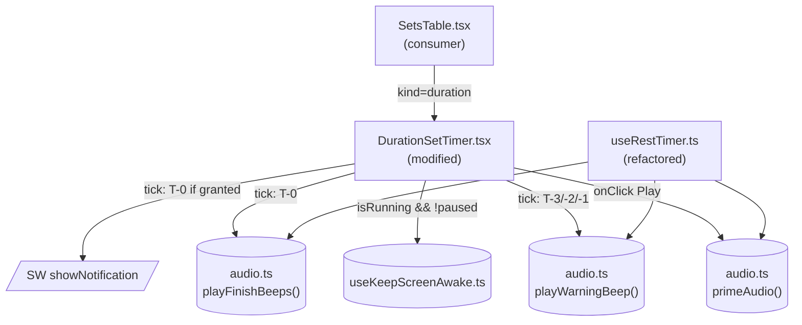

# Tech Plan — Eyes-off Hold Timer Feedback

Tracks GitHub issue **#374** — *"hold timer needs eyes-off feedback — pre-end audio cues + screen wake lock"*. No Epic Brief was written; the issue body, the [grilling decisions](./CONTEXT.md#workout-execution), and [ADR 0006](./adr/0006-shared-timer-utilities.md) are the inputs.

## Architectural Approach

### Key Decisions

| Decision | Choice | Rationale |
|---|---|---|
| Audio strategy | Singleton `AudioContext` shared via `src/lib/audio.ts` | iOS Safari concurrent-context cap; sequenced T-3..T-0 churns the existing fresh-per-fire pattern in `DurationSetTimer.tsx`. ADR 0006. |
| iOS gesture-unlock | `primeAudio()` called from Play / set-log handlers | iOS Safari requires a transient user activation for the first context creation; `setInterval`-driven beeps fail otherwise. |
| Wake lock encapsulation | `useKeepScreenAwake(active: boolean)` hook | Centralizes request/release/visibilitychange/feature-detection; testable in isolation; future `useRestTimer` adoption is a one-line opt-in. |
| Wake lock + workout pause | Release on pause, re-acquire on resume | Mirrors interval gating; paused = phone-in-pocket = screen can sleep. |
| Pre-end beep schedule | Clamp by fire-offset, not by target value | `if (offset > 0)`: target=3 → no T-3; target=2 → T-1+T-0; target=1 → T-0. |
| Pause/throttle salvo guard | 1500 ms stale-fire window per warning beep | Pre-existing pause-elapsed bug means a long pause/resume can otherwise produce a "BEEP-BEEP-BEEP-CHIME" salvo. Cheap defensive heuristic; doesn't block the proper `accumulatedPause` fix later. |
| T-0 finish chime | Unify both timers on `playFinishBeeps` (two-note 880→1100 Hz) | Cohesion; clearly distinct from T-1 warning; zero cost via shared helper. |
| SW notification at T-0 | Mirror `useRestTimer.ts:173-181` best-effort path | Permission already elicited at `AuthGuard.tsx:32`; reuses pattern, no new infra. |
| i18n keys | `holdOverNotif` / `holdOverBody` | Symmetric with `restOverNotif`; reads naturally in FR (loanword); generic naming is YAGNI. |
| Pause-elapsed bug (true fix) | Out of scope; follow-up issue | `DurationSetTimer.elapsedSec` not pause-aware (raw wall-clock); fixing properly mirrors `useRestTimer`'s `accumulatedPause` machinery — separate ticket. |
| Voice countdown ("3, 2, 1") | Out of scope; follow-up | Beeps are 90% of value; voice adds bundle weight + i18n cost. |

### Critical Constraints

**iOS gesture chain.** Both `navigator.wakeLock.request("screen")` and `AudioContext` construction require a transient user activation on iOS Safari 16.4+. The Play button at `file:src/components/workout/DurationSetTimer.tsx:140` is the only safe entry — `primeAudio()` and the wake-lock acquisition both originate there. The `visibilitychange` re-acquire path may silently reject on iOS (transient activation isn't typically granted to that event); we swallow the rejection without logging. Audio `setInterval` callbacks are non-gestures, but the singleton context is unlocked once by `primeAudio()` and remains so for the page lifetime.

**Hidden-tab JS throttling.** `setInterval` is heavily throttled in backgrounded tabs on iOS Safari and modern Chrome. If the timer elapses while hidden, T-0 chime, SW notification, and auto-log won't fire until the tab becomes visible again. The wake lock re-acquire path on `visibilitychange` is gated by the consumer's `active` boolean — when `remaining` drops to 0 and `onLog` runs, `active` flips to false and we never re-acquire for a finished hold.

**Pause-elapsed bug inheritance.** `file:src/components/workout/DurationSetTimer.tsx:58-61` computes `elapsedSec` off raw wall-clock, not pause-aware. Pausing for 5 minutes mid-hold then resuming will jump `elapsedSec` past the entire schedule on a single tick. **Mitigation in this ticket:** each warning beep is guarded by a 1500 ms stale-fire window — if the current tick is more than 1500 ms past the scheduled offset, the beep is silently marked fired without playing. T-0 chime always fires. The user gets a clean chime, not a salvo. **Proper fix:** mirror `useRestTimer`'s `getEffectiveElapsed` + `accumulatedPause` machinery — tracked separately as the ticket would otherwise double in scope.

**Bundle impact.** Two new modules (~80 LOC across `src/lib/audio.ts`, `src/lib/buildBeepSchedule.ts`, `src/hooks/useKeepScreenAwake.ts`). No new dependencies. `audio.ts` consolidates code already shipped in `useRestTimer`, just relocated.

---

## Data Model

No database, schema, or persistence changes. The feature is purely client-side runtime behavior on top of existing `workout_exercises.duration_seconds` data.

### Module Surface (TypeScript)

#### `src/lib/audio.ts`

```ts
function getAudioCtx(): AudioContext

/** Call from a user-gesture handler before any non-gesture playback path. */
export function primeAudio(): void

export function playBeep(
  frequency: number,
  durationMs: number,
  volume?: number,
): void

/** Pre-end warning cue: 660 Hz, 150 ms, volume 0.2. */
export function playWarningBeep(): void

/** Finish chime: 880 Hz then 1100 Hz, 200 ms / 300 ms, volume 0.5. */
export function playFinishBeeps(): void
```

#### `src/lib/buildBeepSchedule.ts`

```ts
export type BeepFireSpec = {
  atMsFromStart: number
  kind: "warning" | "finish"
}

/** Suppresses any pre-end beep whose fire offset would coincide with start. */
export function buildBeepSchedule(targetSeconds: number): BeepFireSpec[]
```

**Clamp matrix:**

| `targetSeconds` | Schedule (kind @ offset ms) |
|---|---|
| ≥ 4 | warning@(t-3)·1000, warning@(t-2)·1000, warning@(t-1)·1000, finish@t·1000 |
| 3 | warning@1000, warning@2000, finish@3000 *(T-3 offset = 0, suppressed)* |
| 2 | warning@1000, finish@2000 |
| 1 | finish@1000 |
| 0 | `[]` (defensive — input layer rejects via `n > 0` check) |

#### `src/hooks/useKeepScreenAwake.ts`

```ts
/**
 * Acquires `navigator.wakeLock.request("screen")` while `active` is true.
 * Re-acquires on visibilitychange→visible if still active. Releases on
 * unmount, on `active` flipping to false, and on browser auto-release when
 * the tab is hidden. No-op when `navigator.wakeLock` is undefined.
 */
export function useKeepScreenAwake(active: boolean): void
```

---

## Component Architecture

### Layer Overview



### New Files & Responsibilities

| File | Status | Purpose |
|---|---|---|
| `src/lib/audio.ts` | Create | Shared singleton `AudioContext` + named cue functions. Hosts `getAudioCtx`, `primeAudio`, `playBeep`, `playWarningBeep`, `playFinishBeeps`. Lifted from `useRestTimer.ts:13-48`. |
| `src/lib/audio.test.ts` | Create | Vitest. Stubs `AudioContext` via `vi.stubGlobal`. Asserts singleton (two `getAudioCtx()` calls return same ref), `primeAudio` resumes a suspended context, `playFinishBeeps` schedules two oscillators 250 ms apart. |
| `src/lib/buildBeepSchedule.ts` | Create | Pure function — clamp matrix. Exported separately for testability without React. |
| `src/lib/buildBeepSchedule.test.ts` | Create | Vitest. Covers `targetSeconds` 0/1/2/3/4/10. |
| `src/hooks/useKeepScreenAwake.ts` | Create | Wake lock encapsulation — request/release/visibilitychange/feature-detection. |
| `src/hooks/useKeepScreenAwake.test.ts` | Create | Vitest + `renderHookWithProviders`. Stubs `navigator.wakeLock`. Covers active-toggle, visibilitychange re-acquire, unmount release, missing API graceful no-op, request rejection silent swallow. |

### Modified Files & Responsibilities

| File | Change |
|---|---|
| `src/components/workout/DurationSetTimer.tsx` | Drop the inline `AudioContext` + oscillator code (`DurationSetTimer.tsx:72-86`). Compute `schedule = buildBeepSchedule(targetSeconds)` at start. Track fired indices via a `Set<number>` ref keyed by schedule position. In the existing tick effect, for each unfired entry: (a) if `elapsedMs >= atMsFromStart` AND `(elapsedMs - atMsFromStart) < 1500` → play it; (b) else if `elapsedMs >= atMsFromStart + 1500` → mark fired without playing (stale-fire window). T-0 (`kind === "finish"`) bypasses the stale-fire window — always plays. Call `primeAudio()` at the top of the Play button `onClick`. Wrap with `useKeepScreenAwake(isRunning && !isWorkoutPaused)`. Mirror `useRestTimer`'s SW notification block at T-0 with the new i18n keys. |
| `src/hooks/useRestTimer.ts` | Replace local `audioCtx` / `getAudioCtx` / `playBeep` / `playWarningBeep` / `playFinishBeeps` (lines 13-48) with imports from `src/lib/audio.ts`. No behavioral changes. |
| `src/components/workout/SetsTable.tsx` | Add `primeAudio()` call to the set-log click handler (the gesture that starts a rest timer). Single import + single function call; ~2 lines. |
| `src/hooks/useRestTimer.test.ts` | Update import path if any audio assertions exist; otherwise unchanged. |
| `src/locales/en/workout.json` | Add `holdOverNotif: "Hold complete!"`, `holdOverBody: "Time to log your set"`. |
| `src/locales/fr/workout.json` | Add `holdOverNotif: "Hold terminé !"`, `holdOverBody: "Log ta série"`. |

### Component Responsibilities

**`DurationSetTimer.tsx` (modified)**
- Owns `targetSeconds`, `timerStartedAt`, `alarmFiredRef`, new `firedBeepIndicesRef: Set<number>`, computed `schedule` from `buildBeepSchedule(targetSeconds)`.
- Renders the live MM:SS countdown + Play/Stop button (unchanged structure).
- Play `onClick`: `primeAudio()` → `onStart()`.
- Subscribes to `useKeepScreenAwake(isRunning && !isWorkoutPaused)`.
- Tick effect (modified): iterates `schedule`; for each unfired entry, applies the stale-fire window rule; on `finish` fire, also vibrates, fires SW notif if granted, and calls `onLog(targetSeconds)`.
- On `timerStartedAt` / `targetSeconds` change: clears `alarmFiredRef` (existing) AND `firedBeepIndicesRef` (new).

**`src/lib/audio.ts` (new)**
- Pure module, no React.
- Singleton `AudioContext` at module scope; `getAudioCtx()` is internal.
- `primeAudio()` is the public unlock call: creates the context if absent, calls `resume()` if suspended.
- All API calls are `try/catch`-wrapped — silent fallback if Web Audio is unavailable.

**`useKeepScreenAwake.ts` (new)**
- Single boolean argument: `active`.
- Holds the sentinel in a ref.
- `useEffect([active])`: when `active === true` and no sentinel, request and store; when `active === false` and sentinel held, release explicitly.
- `useEffect([])` (mount-only): attaches `visibilitychange` listener that calls `requestIfNeeded()` (re-reads `active` via ref) on `document.visibilityState === "visible"`.
- Cleanup: release sentinel + remove listener.
- All API calls `try`-wrapped; rejections swallowed.

### Failure Mode Analysis

| Failure | Behavior |
|---|---|
| `navigator.wakeLock` undefined (older iOS, Firefox before 126) | `useKeepScreenAwake` no-ops; timer runs normally; user must keep phone awake manually. |
| `wakeLock.request()` rejects (denied, secure-context issue) | Silent swallow; ref stays null; no retry; timer continues. |
| `visibilitychange` re-acquire rejects on iOS | Silent swallow; user must tap Stop or wait — visual countdown is already stale until they re-engage. |
| `AudioContext` constructor throws (no Web Audio) | `primeAudio` and `playBeep` no-op; timer fires only vibrate + SW notif at T-0. |
| `Notification.permission !== "granted"` | SW notification block skipped (existing pattern); audio + vibration still fire. |
| User backgrounds the tab mid-hold | Wake lock auto-released; `setInterval` throttled — beeps and T-0 fire late or after return. SW notif fires only if JS happens to tick at T-0 during throttling (best-effort). |
| User pauses mid-hold and resumes after a long delay | `elapsedMs` jumps past one or more scheduled offsets in a single tick. Each warning beep guarded by the 1500 ms stale-fire window — silently marked fired without playing. T-0 chime fires (always-on). User gets a clean chime, not a salvo. |
| `targetSeconds ≤ 0` | Input layer rejects (`DurationSetTimer.tsx:113-119`); `buildBeepSchedule(0)` returns `[]` defensively. Unreachable in practice. |
| Two `DurationSetTimer` instances mounted | `disabled` prop ensures only one is `isRunning`; the other passes `active=false` to `useKeepScreenAwake` — no double-acquire. Singleton audio context is shared. |
| User Stops early before T-0 | `onLog(elapsed)` fires; `isRunning` flips false; `useKeepScreenAwake(false)` releases lock; remaining schedule entries unreachable on next tick. |

---

## Test Plan

| Layer | Tool | Coverage |
|---|---|---|
| `buildBeepSchedule` | vitest (pure unit) | Clamp matrix: target 0/1/2/3/4/10. Asserts ordering + offset values. |
| `audio.ts` | vitest + `vi.stubGlobal("AudioContext", ...)` | Singleton (two `getAudioCtx()` calls return same instance), `primeAudio` calls `resume()` on suspended context, `playFinishBeeps` schedules two oscillators 250 ms apart, all helpers swallow exceptions. |
| `useKeepScreenAwake` | vitest + `renderHookWithProviders` + stubbed `navigator.wakeLock` | active=true → `request` called once; active flips false → `release` called; unmount while active → release; visibilitychange→visible while active → `request` called again; missing API → no calls/no throws; `request` rejection → no throws/no logs. |
| `DurationSetTimer` integration | vitest + RTL + `vi.useFakeTimers({ shouldAdvanceTime: true })` (mirror `useRestTimer.test.ts:9-15`) | Tap Play → `primeAudio` called. Advance to T-3/-2/-1 → `playWarningBeep` called 3×. T-0 → `playFinishBeeps` + `onLog(targetSeconds)` + vibrate. Stop early → `onLog(elapsed)`. Stale-fire window: jump `elapsedMs` past T-2 by 2000ms → no beep, marked fired. Pause then resume after 5min → no warning salvo, T-0 chime fires. |
| Manual QA per AC | iOS Safari 16.4+ + Android Chrome (real devices) | Wake lock observed (screen stays on for full hold with auto-lock at 30 s); pre-end beeps audible; T-0 chime audible; SW notification visible if tab backgrounded. |

No Playwright e2e — wake lock + real audio in headless are more cost than signal.

---

## Out of Scope (intentional)

- TTS / pre-recorded "3, 2, 1" voice clips → follow-up if there's demand.
- Same eyes-off treatment for `useRestTimer` → already partially handled (10s warning + finish chime + SW notif); revisit only if users complain.
- Background-tab timer accuracy → not a hold-timer concern (durations are short; we self-correct from `Date.now()`).
- **`DurationSetTimer` pause-elapsed bug (true fix)** → tracked separately. This ticket masks the worst symptom (salvo) via the stale-fire window but does not fix the underlying `accumulatedPause` deficit.

## References

- GitHub issue #374
- ADR 0006 — Shared Timer Utilities (`docs/adr/0006-shared-timer-utilities.md`)
- Glossary: **Duration Set Timer**, **Eyes-off Feedback** (`docs/CONTEXT.md` → Workout execution)
- Existing patterns: `src/hooks/useRestTimer.ts`, `src/hooks/useNotificationPermission.ts`, `src/components/workout/SetsTable.tsx`
