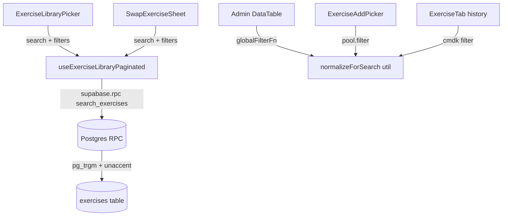

# Tech Plan — Fuzzy & Diacritic-Insensitive Exercise Search

## Architectural Approach

### Key Decisions

| Decision | Choice | Rationale |
|---|---|---|
| Fuzzy engine | Postgres `pg_trgm` extension | Native, zero infra cost, trigram similarity is well-suited for short exercise names. Rejected: `fuzzystrmatch` (levenshtein — worse for partial matches), client-side fuse.js (bundle weight, issue explicitly forbids new frontend deps) |
| Diacritic handling | Postgres `unaccent` extension | Built-in, transforms `développé` → `developpe` at query time. Rejected: manual `translate()` (fragile), ICU collation (overkill) |
| Search entry point | New RPC `search_exercises` | Encapsulates scoring, filtering, and pagination. Rejected: Postgres View (can't parameterize threshold/filters), PostgREST computed column (awkward for multi-column scoring) |
| Scoring strategy | Hybrid: `ilike` substring boost + `similarity()` ranking | Pure `similarity()` can miss exact substring matches (e.g., "bench" in "Bench Press" gets a low trigram score). Hybrid ensures zero regressions on current behavior while adding fuzzy tolerance |
| Search columns | `name`, `name_en`, `muscle_group` | `muscle_group` included so typing "pec" surfaces pectoraux exercises. Slightly de-weighted vs name matches in scoring |
| Indexing | GIN trigram indexes on `name` and `name_en` | Cheap (KB-scale), makes `%` operator and `similarity()` use index scans. Exercise table is small today but indexes are the right thing to do |
| Client-side search spots | `normalizeForSearch()` utility for diacritic-insensitive matching | Admin DataTable and ExerciseAddPicker filter pre-fetched pools — routing every keystroke through an RPC would break their component contracts. A shared utility gives diacritic-insensitivity without a library. True fuzzy matching stays server-side via the RPC |

### Critical Constraints

- **`unaccent` lives in the `extensions` schema on Supabase.** The RPC must reference `extensions.unaccent()` explicitly. `file:supabase/config.toml` has `extra_search_path = ["public", "extensions"]` which helps, but explicit qualification is safer and works in both local dev and hosted.
- **Similarity threshold tuning.** `pg_trgm` default threshold is 0.3. For short exercise names with typos (e.g., "cruch" vs "crunch" → similarity ~0.25), we need a lower threshold (~0.15). The RPC hardcodes this; we can expose it as a param later if needed.
- **Infinite scroll compatibility.** `file:src/hooks/useExerciseLibraryPaginated.ts` uses `useInfiniteQuery` with `range(from, to)`. The RPC uses `OFFSET`/`LIMIT` — functionally equivalent. The hook's `getNextPageParam` logic remains unchanged since the RPC returns the same `Exercise` row shape.
- **PostgREST RPC + array params.** Supabase JS `rpc()` serializes arrays as Postgres `text[]` literals. The RPC signature uses `text[]` for `filter_equipment` and `filter_difficulty` — no special encoding needed on the frontend.
- **Admin table refactoring is minimal.** The `globalFilterFn` in `file:src/components/admin/exercises-table/DataTable.tsx` stays client-side but swaps `includes()` for the new `normalizeForSearch()` utility. TanStack Table sorting/pagination/column filters are untouched.

---

## Data Model

No new tables. Changes are:

1. **Extensions** — enable `pg_trgm` and `unaccent`
2. **Indexes** — GIN trigram on `exercises.name` and `exercises.name_en`
3. **Function** — `search_exercises` RPC

### RPC Signature

```sql
CREATE OR REPLACE FUNCTION search_exercises(
  search_term       text    DEFAULT '',
  filter_muscle_group text  DEFAULT NULL,
  filter_equipment  text[]  DEFAULT NULL,
  filter_difficulty text[]  DEFAULT NULL,
  page_offset       int     DEFAULT 0,
  page_limit        int     DEFAULT 20
)
RETURNS SETOF exercises
LANGUAGE plpgsql STABLE SECURITY INVOKER
```

**Behavior:**
- **Empty `search_term`**: returns all exercises matching filters, ordered by `muscle_group`, `name`. Equivalent to current no-search behavior.
- **Non-empty `search_term`**: normalizes via `extensions.unaccent(lower(...))`, then includes exercises where:
  - `unaccent(lower(name))` or `unaccent(lower(name_en))` contains the term as substring (ilike), **OR**
  - `similarity(unaccent(lower(name)), term)` > 0.15, **OR**
  - `similarity(unaccent(lower(name_en)), term)` > 0.15, **OR**
  - `similarity(unaccent(lower(muscle_group)), term)` > 0.15
- **Ordering** (when search active): exact substring matches first, then by `GREATEST(similarity(...))` descending, then `name` alphabetically.
- **Pagination**: standard `OFFSET` / `LIMIT`.

### GIN Indexes

```sql
CREATE INDEX idx_exercises_name_trgm
  ON exercises USING gin (name gin_trgm_ops);

CREATE INDEX idx_exercises_name_en_trgm
  ON exercises USING gin (name_en gin_trgm_ops);
```

---

## Component Architecture

### Layer Overview



### Files Changed

| File | Change |
|---|---|
| `supabase/migrations/2026XXXX_search_exercises.sql` (new) | Enable extensions, create indexes, create `search_exercises` RPC |
| `file:src/hooks/useExerciseLibraryPaginated.ts` | Replace `ilike` query builder with `supabase.rpc("search_exercises", ...)` call |
| `src/lib/search.ts` (new) | `normalizeForSearch()` utility — strips diacritics via `String.normalize('NFD')`, lowercases |
| `file:src/components/admin/exercises-table/DataTable.tsx` | Update `globalFilterFn` to use `normalizeForSearch()` |
| `file:src/components/generator/ExerciseAddPicker.tsx` | Update `candidates` filter to use `normalizeForSearch()` |
| `file:src/components/history/ExerciseTab.tsx` | Set `shouldFilter={false}`, add manual filtering with `normalizeForSearch()` |

### Component Responsibilities

**`search_exercises` (Postgres RPC)**
- Receives search term + optional filters + pagination params
- Normalizes input via `unaccent(lower(...))`
- Computes hybrid score (ilike boost + trigram similarity) across `name`, `name_en`, `muscle_group`
- Returns `SETOF exercises` — same row shape, no API contract change

**`useExerciseLibraryPaginated` (refactored)**
- Replaces `.from("exercises").select("*").or(ilike...)` with `.rpc("search_exercises", { ... })`
- Hook signature and return type unchanged — `ExerciseLibraryPicker` and `SwapExerciseSheet` are unaffected
- `useInfiniteQuery` stays; `pageParam * PAGE_SIZE` maps to `page_offset`

**`normalizeForSearch` (new utility)**
- `text.normalize('NFD').replace(/[\u0300-\u036f]/g, '').toLowerCase()`
- Gives diacritic-insensitive substring matching for client-side spots
- Does NOT add fuzzy/typo tolerance (that's server-side only via RPC)

### Failure Mode Analysis

| Failure | Behavior |
|---|---|
| `pg_trgm` or `unaccent` extension not available | Migration fails loudly — `CREATE EXTENSION` errors. Supabase supports both on all tiers, so this is a deployment-time catch only |
| Search term is all diacritics (e.g., "éèê") | `unaccent` strips them all → empty normalized term → treated as no-search, returns all exercises. Acceptable |
| Very short search term (1-2 chars) | Trigram similarity is low for short strings. `ilike` substring match kicks in as fallback — "ab" still matches "Abduction" via `ILIKE '%ab%'` |
| `name_en` is NULL | `COALESCE(name_en, '')` → empty string → similarity is 0 → gracefully skipped |
| No results from RPC | Frontend already handles empty state ("No exercises found") |
| RPC timeout on large dataset | Exercises table is ~hundreds of rows with GIN indexes — sub-millisecond. Not a real concern at this scale |
| Client-side normalize doesn't catch typos | Expected. Typo tolerance is server-side only. Admin/generator pickers gain diacritic-insensitivity but not fuzziness — acceptable trade-off vs. adding a client-side library |
