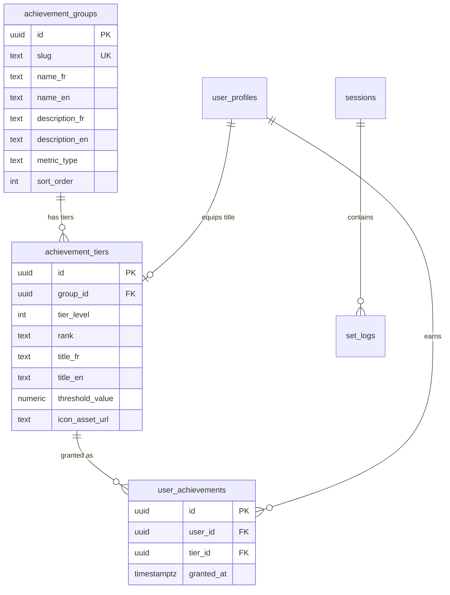
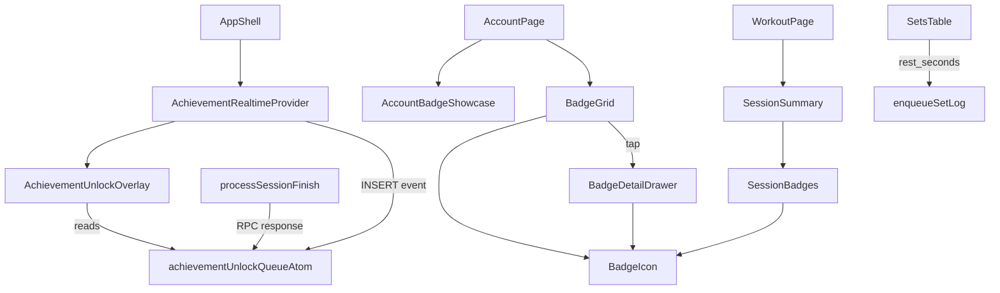

# Tech Plan — Gamification Achievement Badge System #129

## Architectural Approach

### Key Decisions

| Decision | Choice | Rationale |
|---|---|---|
| RPC invocation point | Inside `processSessionFinish` in `file:src/lib/syncService.ts` | Centralized, works with offline queue, fires after session row is committed — no frontend coordination needed |
| `rest_seconds` capture | Export `getRestElapsedSeconds()` from `file:src/hooks/useRestTimer.ts`, compute in `file:src/components/workout/SetsTable.tsx` | Avoids race condition: `SetsTable` resets `restAtom` immediately after enqueue — must read elapsed BEFORE reset |
| Overlay component | Radix Dialog at `AppShell` level + Jotai queue atom | Survives route changes, writable from both React (Realtime) and non-React (syncService via `store.set`) |
| Realtime subscription | `AchievementRealtimeProvider` inside `AppShell` | Auth-gated, cleanup on unmount/logout. New pattern in codebase — no prior Realtime usage |
| Badge detail component | Drawer (vaul) | Dominant mobile-first pattern (`RestTimerDrawer`, `QuickWorkoutSheet`) |
| Rank frame rendering | CSS custom properties + utility classes in `file:src/styles/globals.css` | Zero bundle cost, hot-swappable via class, matches Tailwind patterns |
| Title ownership validation | `BEFORE UPDATE` trigger on `user_profiles.active_title_tier_id` | Surgical — only fires on column change. Avoids splitting the existing `FOR ALL` RLS policy. This is a data validation trigger (like a CHECK constraint), not the business logic trigger we rejected for badge granting. |
| Auto-equip Diamond | Frontend-driven (overlay queue handler) | Keeps RPC single-responsibility; same write path as manual equip |
| `get_badge_status` RPC | `SECURITY DEFINER` + `SET search_path = public` | Consistent with `check_and_grant_achievements`; avoids RLS join complexity across 5 tables |
| PR strategy | 4 PRs: DB → Frontend core → UI surfaces → Assets | Each independently deployable and reviewable |

### Critical Constraints

**Sync queue ordering.** `processSessionFinish` must complete the session upsert before calling the achievement RPC. If the upsert fails, the RPC must not fire. If the RPC fails, the session result must not be affected. This is already the natural flow since `processSessionFinish` returns `false` on upsert failure (short-circuits before the RPC call), and the RPC is wrapped in a separate try/catch.

**`restAtom` reset timing.** In `file:src/components/workout/SetsTable.tsx`, the sequence after a set is logged is: `enqueueSetLog(...)` → `setRest({ startedAt: Date.now(), ... })`. The atom is overwritten synchronously. Any `rest_seconds` computation must happen _before_ `enqueueSetLog` is called, using the current atom value. The exported utility reads from the atom snapshot passed as argument — it does not read the atom itself.

**Existing `user_profiles` RLS.** The current policy is `FOR ALL USING (auth.uid() = user_id) WITH CHECK (auth.uid() = user_id)` (in `file:supabase/migrations/20260314000003_create_user_profiles.sql`). We do NOT split this policy. Instead, title ownership is enforced via a `BEFORE UPDATE` trigger that only fires when `active_title_tier_id` changes. All existing profile update flows are unaffected.

**No existing Realtime usage.** The `AchievementRealtimeProvider` introduces the first Supabase Realtime subscription in the codebase. It must handle: auth state changes (unsubscribe on logout), component unmount, automatic reconnection (handled by Supabase client), and channel cleanup via `.removeChannel()`.

**`select("*")` in `useUserProfile`.** The existing hook (`file:src/hooks/useUserProfile.ts`) uses `select("*")`, so the new `active_title_tier_id` column is returned automatically. But the `UserProfile` TypeScript type (`file:src/types/onboarding.ts`) must be updated to include the field, or it will be silently present without type safety.

---

## Data Model

### ER Diagram



### New Tables

```sql
-- achievement_groups
CREATE TABLE achievement_groups (
  id uuid PRIMARY KEY DEFAULT gen_random_uuid(),
  slug text UNIQUE NOT NULL,
  name_fr text NOT NULL,
  name_en text NOT NULL,
  description_fr text,
  description_en text,
  metric_type text NOT NULL,
  sort_order int NOT NULL DEFAULT 0
);

ALTER TABLE achievement_groups ENABLE ROW LEVEL SECURITY;
CREATE POLICY "Anyone can read achievement groups"
  ON achievement_groups FOR SELECT USING (true);

-- achievement_tiers
CREATE TABLE achievement_tiers (
  id uuid PRIMARY KEY DEFAULT gen_random_uuid(),
  group_id uuid NOT NULL REFERENCES achievement_groups(id) ON DELETE CASCADE,
  tier_level int NOT NULL,
  rank text NOT NULL,
  title_fr text NOT NULL,
  title_en text NOT NULL,
  threshold_value numeric NOT NULL,
  icon_asset_url text,
  UNIQUE(group_id, tier_level)
);

ALTER TABLE achievement_tiers ENABLE ROW LEVEL SECURITY;
CREATE POLICY "Anyone can read achievement tiers"
  ON achievement_tiers FOR SELECT USING (true);

-- user_achievements
CREATE TABLE user_achievements (
  id uuid PRIMARY KEY DEFAULT gen_random_uuid(),
  user_id uuid NOT NULL REFERENCES auth.users(id) ON DELETE CASCADE,
  tier_id uuid NOT NULL REFERENCES achievement_tiers(id) ON DELETE CASCADE,
  granted_at timestamptz NOT NULL DEFAULT now(),
  UNIQUE(user_id, tier_id)
);

ALTER TABLE user_achievements ENABLE ROW LEVEL SECURITY;
CREATE POLICY "Users can read own achievements"
  ON user_achievements FOR SELECT USING (auth.uid() = user_id);
```

### Schema Changes

```sql
-- set_logs: rest duration tracking
ALTER TABLE set_logs ADD COLUMN rest_seconds integer;

-- user_profiles: equipped title
ALTER TABLE user_profiles
  ADD COLUMN active_title_tier_id uuid
  REFERENCES achievement_tiers(id) ON DELETE SET NULL;
```

### Title Ownership Validation Trigger

```sql
CREATE OR REPLACE FUNCTION validate_title_ownership()
RETURNS TRIGGER
LANGUAGE plpgsql
SECURITY DEFINER
SET search_path = public
AS $$
BEGIN
  IF NEW.active_title_tier_id IS DISTINCT FROM OLD.active_title_tier_id
     AND NEW.active_title_tier_id IS NOT NULL
  THEN
    IF NOT EXISTS (
      SELECT 1 FROM user_achievements
      WHERE user_id = NEW.user_id AND tier_id = NEW.active_title_tier_id
    ) THEN
      RAISE EXCEPTION 'User does not own this achievement tier'
        USING ERRCODE = 'check_violation';
    END IF;
  END IF;
  RETURN NEW;
END;
$$;

CREATE TRIGGER trg_validate_title_ownership
  BEFORE UPDATE OF active_title_tier_id ON user_profiles
  FOR EACH ROW
  EXECUTE FUNCTION validate_title_ownership();
```

### Indexes

```sql
CREATE INDEX IF NOT EXISTS idx_sessions_user_finished
  ON sessions (user_id, finished_at) WHERE finished_at IS NOT NULL;

CREATE INDEX IF NOT EXISTS idx_set_logs_session_id
  ON set_logs (session_id);

CREATE INDEX IF NOT EXISTS idx_set_logs_was_pr
  ON set_logs (was_pr) WHERE was_pr = true;

CREATE INDEX IF NOT EXISTS idx_set_logs_rest_seconds
  ON set_logs (rest_seconds) WHERE rest_seconds IS NOT NULL;
```

### RPCs

**`check_and_grant_achievements`** — core badge engine, called from `processSessionFinish`:

```sql
CREATE OR REPLACE FUNCTION check_and_grant_achievements(p_user_id uuid)
RETURNS TABLE (
  tier_id uuid, group_slug text, rank text,
  title_en text, title_fr text, icon_asset_url text
)
LANGUAGE plpgsql
SECURITY DEFINER
SET search_path = public
AS $$
BEGIN
  RETURN QUERY
  WITH user_sessions AS (
    SELECT s.id, s.workout_day_id
    FROM sessions s
    WHERE s.user_id = p_user_id AND s.finished_at IS NOT NULL
  ),
  metrics AS (
    SELECT 'session_count' AS metric_type, COUNT(*)::numeric AS value
      FROM user_sessions
    UNION ALL
    SELECT 'total_volume_kg', COALESCE(SUM(sl.weight_logged * sl.reps_logged::int), 0)
      FROM set_logs sl JOIN user_sessions us ON us.id = sl.session_id
      WHERE sl.reps_logged IS NOT NULL
    UNION ALL
    SELECT 'pr_count', COUNT(*)::numeric
      FROM set_logs sl JOIN user_sessions us ON us.id = sl.session_id
      WHERE sl.was_pr = true
    UNION ALL
    SELECT 'unique_exercises', COUNT(DISTINCT sl.exercise_id)::numeric
      FROM set_logs sl JOIN user_sessions us ON us.id = sl.session_id
    UNION ALL
    SELECT 'respected_rest_count', COUNT(*)::numeric
      FROM set_logs sl
      JOIN user_sessions us ON us.id = sl.session_id
      JOIN workout_exercises we
        ON we.exercise_id = sl.exercise_id
        AND we.workout_day_id = us.workout_day_id
      WHERE us.workout_day_id IS NOT NULL
        AND sl.rest_seconds IS NOT NULL
        AND we.rest_seconds > 0
        AND sl.rest_seconds >= we.rest_seconds * 0.8
  ),
  eligible AS (
    SELECT at.id, ag.slug, at.rank AS r, at.title_en, at.title_fr, at.icon_asset_url
    FROM metrics m
    JOIN achievement_groups ag ON ag.metric_type = m.metric_type
    JOIN achievement_tiers at ON at.group_id = ag.id
    WHERE at.threshold_value <= m.value
      AND NOT EXISTS (
        SELECT 1 FROM user_achievements ua
        WHERE ua.user_id = p_user_id AND ua.tier_id = at.id
      )
  ),
  granted AS (
    INSERT INTO user_achievements (user_id, tier_id)
    SELECT p_user_id, e.id FROM eligible e
    ON CONFLICT (user_id, tier_id) DO NOTHING
    RETURNING user_achievements.tier_id
  )
  SELECT e.id, e.slug, e.r, e.title_en, e.title_fr, e.icon_asset_url
  FROM eligible e
  JOIN granted g ON g.tier_id = e.id;
END;
$$;

GRANT EXECUTE ON FUNCTION check_and_grant_achievements(uuid) TO authenticated;
```

**`get_badge_status`** — serves BadgeGrid with full progress info:

```sql
CREATE OR REPLACE FUNCTION get_badge_status(p_user_id uuid)
RETURNS TABLE (
  group_id uuid, group_slug text, group_name_en text, group_name_fr text,
  tier_id uuid, tier_level int, rank text,
  title_en text, title_fr text,
  threshold_value numeric, icon_asset_url text,
  is_unlocked boolean, granted_at timestamptz,
  current_value numeric, progress_pct numeric
)
LANGUAGE plpgsql
STABLE
SECURITY DEFINER
SET search_path = public
AS $$
BEGIN
  RETURN QUERY
  WITH user_sessions AS (
    SELECT s.id, s.workout_day_id
    FROM sessions s
    WHERE s.user_id = p_user_id AND s.finished_at IS NOT NULL
  ),
  metrics AS (
    SELECT 'session_count' AS metric_type, COUNT(*)::numeric AS value
      FROM user_sessions
    UNION ALL
    SELECT 'total_volume_kg', COALESCE(SUM(sl.weight_logged * sl.reps_logged::int), 0)
      FROM set_logs sl JOIN user_sessions us ON us.id = sl.session_id
      WHERE sl.reps_logged IS NOT NULL
    UNION ALL
    SELECT 'pr_count', COUNT(*)::numeric
      FROM set_logs sl JOIN user_sessions us ON us.id = sl.session_id
      WHERE sl.was_pr = true
    UNION ALL
    SELECT 'unique_exercises', COUNT(DISTINCT sl.exercise_id)::numeric
      FROM set_logs sl JOIN user_sessions us ON us.id = sl.session_id
    UNION ALL
    SELECT 'respected_rest_count', COUNT(*)::numeric
      FROM set_logs sl
      JOIN user_sessions us ON us.id = sl.session_id
      JOIN workout_exercises we
        ON we.exercise_id = sl.exercise_id
        AND we.workout_day_id = us.workout_day_id
      WHERE us.workout_day_id IS NOT NULL
        AND sl.rest_seconds IS NOT NULL
        AND we.rest_seconds > 0
        AND sl.rest_seconds >= we.rest_seconds * 0.8
  )
  SELECT
    ag.id, ag.slug, ag.name_en, ag.name_fr,
    at.id, at.tier_level, at.rank,
    at.title_en, at.title_fr,
    at.threshold_value, at.icon_asset_url,
    (ua.id IS NOT NULL), ua.granted_at,
    COALESCE(m.value, 0),
    LEAST(COALESCE(m.value, 0) / NULLIF(at.threshold_value, 0) * 100, 100)
  FROM achievement_groups ag
  JOIN achievement_tiers at ON at.group_id = ag.id
  LEFT JOIN user_achievements ua ON ua.tier_id = at.id AND ua.user_id = p_user_id
  LEFT JOIN metrics m ON m.metric_type = ag.metric_type
  ORDER BY ag.sort_order, at.tier_level;
END;
$$;

GRANT EXECUTE ON FUNCTION get_badge_status(uuid) TO authenticated;
```

### Table Notes

- **`achievement_groups.metric_type`** is a free-text string that maps to a CTE alias in the RPCs. Adding a new group means: INSERT a row with a new `metric_type`, add a matching CTE in both RPCs. No frontend changes.
- **`achievement_tiers.rank`** is one of `bronze`, `silver`, `gold`, `platinum`, `diamond`. Used to select the CSS frame class.
- **`user_achievements`** has a `UNIQUE(user_id, tier_id)` constraint. The RPC's `ON CONFLICT DO NOTHING` makes badge granting idempotent.
- **`set_logs.rest_seconds`** is nullable. `NULL` means: first set of session, no rest timer active, or duration exercise (no rest phase). Only non-null values count toward Rhythm Master.
- **`user_profiles.active_title_tier_id`** is nullable (`ON DELETE SET NULL`). When the referenced tier is deleted (e.g., during a schema migration), the title is silently unequipped.

---

## Component Architecture

### Layer Overview



### New Files & Responsibilities

| File | Purpose |
|---|---|
| `supabase/migrations/20260401000001_create_achievement_tables.sql` | 3 tables + RLS + indexes |
| `supabase/migrations/20260401000002_add_rest_seconds_to_set_logs.sql` | `ALTER TABLE set_logs ADD COLUMN rest_seconds integer` |
| `supabase/migrations/20260401000003_add_active_title_to_user_profiles.sql` | `ALTER TABLE user_profiles ADD COLUMN active_title_tier_id ...` + validation trigger |
| `supabase/migrations/20260401000004_create_check_and_grant_achievements.sql` | Badge granting RPC |
| `supabase/migrations/20260401000005_create_get_badge_status.sql` | Badge status/progress RPC |
| `supabase/migrations/20260401000006_seed_achievement_data.sql` | INSERT 5 groups + 25 tiers |
| `src/types/achievements.ts` | `AchievementGroup`, `AchievementTier`, `UserAchievement`, `BadgeStatusRow`, `UnlockedAchievement` types |
| `src/hooks/useBadgeStatus.ts` | React Query hook wrapping `get_badge_status` RPC |
| `src/components/achievements/AchievementRealtimeProvider.tsx` | Global Realtime subscription + queue push |
| `src/components/achievements/AchievementUnlockOverlay.tsx` | Full-screen unlock modal with animations |
| `src/components/achievements/BadgeGrid.tsx` | Account page — groups × ranks grid with progress |
| `src/components/achievements/BadgeDetailDrawer.tsx` | Bottom drawer — badge info + equip/unequip title |
| `src/components/achievements/BadgeIcon.tsx` | Composited rendering: CSS rank frame + icon PNG overlay |
| `src/components/achievements/SessionBadges.tsx` | Session summary — newly unlocked badges strip |
| `src/components/achievements/AccountBadgeShowcase.tsx` | Account header — title + X/25 counter + top-rank icons |
| `src/locales/en/achievements.json` | English i18n keys |
| `src/locales/fr/achievements.json` | French i18n keys |

### Modified Files

| File | Change |
|---|---|
| `file:src/lib/syncService.ts` | Add `restSeconds` to `SetLogPayloadReps` / `SetLogPayloadDuration`; add `rest_seconds` to upsert row; call `check_and_grant_achievements` RPC after session finish and push result into queue atom |
| `file:src/hooks/useRestTimer.ts` | Export `getRestElapsedSeconds(rest: RestState, sessionPausedAt: number \| null): number \| null` utility |
| `file:src/components/workout/SetsTable.tsx` | Compute `restSeconds` from current `restAtom` before enqueue; pass to `enqueueSetLog` |
| `file:src/components/AppShell.tsx` | Wrap content with `AchievementRealtimeProvider` + render `AchievementUnlockOverlay` |
| `file:src/pages/AccountPage.tsx` | Add `AccountBadgeShowcase` in header area + `BadgeGrid` section before danger zone |
| `file:src/components/workout/SessionSummary.tsx` | Add `SessionBadges` section (reads from queue atom or prop) |
| `file:src/types/onboarding.ts` | Add `active_title_tier_id?: string \| null` to `UserProfile` |
| `file:src/types/database.ts` | Add `rest_seconds?: number \| null` to `SetLog` |
| `file:src/store/atoms.ts` | Add 3 atoms: `achievementUnlockQueueAtom: atom<UnlockedAchievement[]>` (overlay queue, consumed on display), `achievementShownIdsAtom: atom<Set<string>>` (tier_ids already shown this session, prevents re-display from Realtime + RPC overlap, in-memory only — reset on reload), `lastSessionBadgesAtom: atom<UnlockedAchievement[]>` (populated by processSessionFinish, read by SessionBadges, cleared on next session start) |
| `file:src/lib/i18n.ts` | Register `achievements` namespace |
| `file:src/styles/globals.css` | Badge frame CSS classes + overlay keyframe animations |

### Component Responsibilities

**`AchievementRealtimeProvider`**
- Subscribes to `user_achievements` INSERT events via `supabase.channel('achievements').on('postgres_changes', ...)`
- On INSERT: enriches event with tier/group data from `useBadgeStatus` query cache
- Pushes enriched unlock into `achievementUnlockQueueAtom` (dedup by `tier_id`)
- Auth-gated: subscribes only when `authAtom` is non-null, unsubscribes on logout
- Cleanup: `channel.unsubscribe()` + `supabase.removeChannel()` on unmount

**`AchievementUnlockOverlay`**
- Reads `achievementUnlockQueueAtom`; when non-empty, opens Radix Dialog for first item
- Renders: CSS scale-in badge animation → rank glow → particle burst → staggered title/description text
- **Haptic feedback** on reveal: `navigator.vibrate([100, 50, 200])` (heavier pattern than rest timer finish)
- **Audio chime** on reveal: two-tone ascending via Web Audio (523 Hz → 784 Hz, C5 → G5) — reuse `playBeep` oscillator+gain pattern from `file:src/hooks/useRestTimer.ts`
- Auto-dismisses after 4s or on tap; accessible via Escape key (`role="alertdialog"`, `aria-label` with achievement title)
- On dismiss: shifts queue, records `tier_id` in `achievementShownIdsAtom`, shows next after 500ms
- If dismissed item is Diamond rank + `active_title_tier_id` is null: fires auto-equip update

**`BadgeGrid`**
- Calls `useBadgeStatus()` for data
- Renders 5 group sections, each with 5 `BadgeIcon` slots (locked = grayscale + opacity)
- Progress bar under each group showing current_value / next_threshold
- Tap on any badge opens `BadgeDetailDrawer`

**`BadgeDetailDrawer`**
- Vaul drawer with: large `BadgeIcon`, title (localized), description, unlock date or "X more to go"
- "Equip title" / "Unequip" button for unlocked badges
- Equip: `supabase.from('user_profiles').update({ active_title_tier_id })` → invalidate `["user-profile", userId]` → `toast.success()`

**`BadgeIcon`**
- Pure presentational: CSS frame class (`badge-frame-bronze` through `badge-frame-diamond`) + `` for icon PNG
- Props: `rank`, `iconUrl`, `size`, `locked`
- Locked state: grayscale filter + reduced opacity

**`SessionBadges`**
- Reads from `lastSessionBadgesAtom` — a separate atom populated by `processSessionFinish` when the RPC returns newly-unlocked achievements. This is NOT the overlay queue (those items are consumed on display). The atom is cleared on next session start (`handleFinish` → `store.set(lastSessionBadgesAtom, [])` before `setFinished(true)`, then populated asynchronously when the drain completes and the RPC responds).
- **Timing:** `SessionSummary` renders immediately when `finished=true` — before the drain completes. `SessionBadges` initially shows nothing, then reactively updates when `lastSessionBadgesAtom` is populated. Use a subtle entrance animation to avoid a layout shift.
- Renders horizontal strip of `BadgeIcon` components with unlock animation
- If empty after RPC returns: renders nothing (no section)

**`AccountBadgeShowcase`**
- Reads from `useBadgeStatus()` cache + `useUserProfile()` for `active_title_tier_id`
- Displays: active title (styled with rank color) under display_name, "X/25 unlocked" counter, top-rank badge icons
- Tappable → scrolls to `BadgeGrid`

### Interaction Flows

**Flow 1: Set logged with rest tracking**

```
SetsTable                    restAtom              syncService              DB
   |                            |                      |                    |
   |-- read restAtom value ---->|                      |                    |
   |<-- RestState (elapsed) ----|                      |                    |
   |                            |                      |                    |
   |-- getRestElapsedSeconds ---|                      |                    |
   |   (pure function)          |                      |                    |
   |                            |                      |                    |
   |-- enqueueSetLog({          |                      |                    |
   |     restSeconds: 92        |                      |                    |
   |   }) ----------------------|--------------------->|                    |
   |                            |                      |                    |
   |-- setRest(new rest) ------>|                      |                    |
   |   (atom overwritten)       |                      |                    |
   |                            |                      |-- upsert set_log ->|
   |                            |                      |   rest_seconds: 92 |
```

**Flow 2: Session finish → achievement check → overlay**

```
WorkoutPage        syncService              DB                 queueAtom        Overlay
   |                   |                     |                    |               |
   |-- handleFinish -->|                     |                    |               |
   |   enqueueFinish   |                     |                    |               |
   |   scheduleDrain   |                     |                    |               |
   |                   |-- session upsert -->|                    |               |
   |                   |<-- OK --------------|                    |               |
   |                   |                     |                    |               |
   |                   |-- RPC: check_and_  |                    |               |
   |                   |   grant_achievements|                    |               |
   |                   |<-- [tier1, tier2] --|                    |               |
   |                   |                     |                    |               |
   |                   |-- store.set --------|------------------>|               |
   |                   |   (push to overlay  |                    |-- read ------>|
   |                   |    queue + write to  |                    |   queue[0]    |
   |                   |    lastSessionBadges)|                    |               |
   |                   |                     |                    |  [OVERLAY]    |
   |                   |                     |                    |               |
   |                   |                     |   lastSessionBadgesAtom            |
   |                   |                     |        |                           |
   |                   |                     |        v                           |
   |                   |                     |   [SessionBadges renders]          |
```

**Flow 3: Title equip**

```
BadgeDetailDrawer     Supabase          DB trigger          useUserProfile
   |                     |                  |                    |
   |-- update            |                  |                    |
   |   active_title_     |                  |                    |
   |   tier_id --------->|                  |                    |
   |                     |-- UPDATE row --->|                    |
   |                     |                  |-- validate         |
   |                     |                  |   ownership ✓      |
   |                     |<-- OK ----------|                    |
   |<-- OK --------------|                  |                    |
   |                     |                  |                    |
   |-- invalidate -------|------------------|------------------>|
   |   ["user-profile"]  |                  |                    |
   |                     |                  |                    |
   |-- toast.success ----|                  |                    |
```

### Failure Mode Analysis

| Failure | Behavior |
|---|---|
| `check_and_grant_achievements` RPC fails | Logged to console, swallowed. Session is already saved. Badges not granted this time; will be granted on next session finish (idempotent). |
| Realtime subscription drops | Supabase client auto-reconnects. During gap, no overlay from Realtime — but primary path (RPC response) is unaffected. |
| User closes app during overlay | Queue atom is in-memory (not persisted). Badge is in DB. User sees it in BadgeGrid on next visit. No data loss. |
| Title equip for unowned tier | `trg_validate_title_ownership` raises `check_violation`. Frontend catches error, shows toast. |
| Two sessions drain in quick succession | Each calls the RPC. Second call returns empty (tiers already granted via `ON CONFLICT DO NOTHING`). No duplicates. |
| `rest_seconds` is 0 or negative | Clamped to `Math.max(0, ...)` in the utility. A 0-second rest does not satisfy the 80% threshold — excluded from Rhythm count. |
| Offline session finish | Session + set_logs are queued. On drain: session upserted, then RPC fires. User is likely on a different screen — no overlay (queue atom was empty at drain time). Badge appears in grid on next `useBadgeStatus` fetch. |
| `icon_asset_url` is null (during dev) | `BadgeIcon` renders the CSS frame with a placeholder icon or empty center. Graceful degradation. |

---

## PR Breakdown

### PR 1: DB Foundation

**Scope:** All Supabase migrations — tables, schema changes, indexes, RPCs, seed data, retroactive grant script.

| Task | File | Effort |
|---|---|---|
| Achievement tables + RLS | `supabase/migrations/20260401000001_create_achievement_tables.sql` | S |
| `rest_seconds` column | `supabase/migrations/20260401000002_add_rest_seconds_to_set_logs.sql` | XS |
| `active_title_tier_id` + trigger | `supabase/migrations/20260401000003_add_active_title_to_user_profiles.sql` | S |
| `check_and_grant_achievements` RPC | `supabase/migrations/20260401000004_create_check_and_grant_achievements.sql` | M |
| `get_badge_status` RPC | `supabase/migrations/20260401000005_create_get_badge_status.sql` | S |
| Seed 5 groups + 25 tiers | `supabase/migrations/20260401000006_seed_achievement_data.sql` | S |
| Retroactive grant script | `scripts/retroactive-badge-grant.sql` | XS |
| Enable Realtime on `user_achievements` | Supabase dashboard toggle | XS |

**Tests:** RPC SQL tests — metric correctness (5 metrics × multiple edge cases), idempotency, trigger validation. Run against local Supabase with test seed.

**Dependencies:** None — purely backend.

---

### PR 2: Frontend Core

**Scope:** Types, atoms, rest_seconds instrumentation, syncService RPC call, Realtime provider, overlay.

| Task | File | Effort |
|---|---|---|
| Achievement TypeScript types | `src/types/achievements.ts` | S |
| Update `SetLog` type | `src/types/database.ts` | XS |
| Update `UserProfile` type | `src/types/onboarding.ts` | XS |
| Queue + shown-IDs atoms | `src/store/atoms.ts` | XS |
| Export `getRestElapsedSeconds` | `src/hooks/useRestTimer.ts` | S |
| Compute `rest_seconds` in SetsTable | `src/components/workout/SetsTable.tsx` | S |
| Add `rest_seconds` to syncService payload + upsert | `src/lib/syncService.ts` | S |
| Call RPC after session finish + push to queue | `src/lib/syncService.ts` | M |
| `useBadgeStatus` hook | `src/hooks/useBadgeStatus.ts` | S |
| `AchievementRealtimeProvider` | `src/components/achievements/AchievementRealtimeProvider.tsx` | M |
| `AchievementUnlockOverlay` + CSS keyframes | `src/components/achievements/AchievementUnlockOverlay.tsx` + `src/styles/globals.css` | M |
| Wire provider + overlay into AppShell | `src/components/AppShell.tsx` | XS |

**Tests:** Extend `syncService.test.ts` (rest_seconds + RPC call), `SetsTable.test.tsx` (rest_seconds computation), `useRestTimer.test.ts` (exported utility), `atoms.test.ts` (queue dedup). New: `AchievementRealtimeProvider.test.tsx`, `AchievementUnlockOverlay.test.tsx`, `useBadgeStatus.test.ts`.

**Dependencies:** PR 1 (DB tables + RPCs must exist).

---

### PR 3: UI Surfaces

**Scope:** Badge grid, detail drawer, title system, session summary, account showcase, i18n.

| Task | File | Effort |
|---|---|---|
| `BadgeIcon` component | `src/components/achievements/BadgeIcon.tsx` | S |
| CSS badge frames (5 ranks) | `src/styles/globals.css` | S |
| `BadgeGrid` on Account page | `src/components/achievements/BadgeGrid.tsx` | M |
| `BadgeDetailDrawer` + equip/unequip | `src/components/achievements/BadgeDetailDrawer.tsx` | S |
| `AccountBadgeShowcase` | `src/components/achievements/AccountBadgeShowcase.tsx` | S |
| `SessionBadges` in summary | `src/components/achievements/SessionBadges.tsx` | S |
| Wire into AccountPage | `src/pages/AccountPage.tsx` | S |
| Wire into SessionSummary | `src/components/workout/SessionSummary.tsx` | S |
| i18n: achievements namespace (FR + EN) | `src/locales/{en,fr}/achievements.json` + `src/lib/i18n.ts` | S |

**Tests:** New: `BadgeGrid.test.tsx`, `BadgeDetailDrawer.test.tsx`, `SessionBadges.test.tsx`. Extend: `AccountPage.test.tsx`.

**Dependencies:** PR 2 (hooks, atoms, types, overlay must exist).

---

### PR 4: Assets & Polish

**Scope:** AI-generated icons, Storage upload, seed data update, retroactive grant execution.

| Task | File | Effort |
|---|---|---|
| Generate 25 icon PNGs (AI) | External (Midjourney/DALL-E) | M |
| Upload to Supabase Storage | `badge-icons` bucket | S |
| Update seed migration with `icon_asset_url` | `supabase/migrations/20260401000007_update_icon_urls.sql` | XS |
| Run retroactive badge grant | `scripts/retroactive-badge-grant.sql` against prod | XS |
**Tests:** Manual visual verification only — CSS frames + icon rendering, retroactive grant spot-check.

**Dependencies:** PR 3 (UI must be in place to verify visual output).

---

## Test Strategy

The codebase has 95 existing test files using **Vitest** + **@testing-library/react** + **jotai `createStore`** for atom tests. Tests follow a consistent pattern: co-located `*.test.ts(x)` files, `vi.mock` for module isolation, `renderHookWithProviders` / `renderWithProviders` test utilities, and `vi.useFakeTimers` for time-dependent logic.

### Unit Tests (pure functions, no Supabase)

| Test file | What it covers | Key scenarios |
|---|---|---|
| `src/hooks/useRestTimer.test.ts` | **Extend existing file** — add tests for exported `getRestElapsedSeconds` | Returns `null` when no rest active; returns correct elapsed excluding pauses; clamps to 0 when pause > total; handles `sessionPausedAt` freeze |
| `src/store/atoms.test.ts` | **Extend existing file** — add tests for `achievementUnlockQueueAtom` + `achievementShownIdsAtom` | Dedup by `tier_id` on push; shown IDs prevent re-display; queue shifts correctly on dismiss |
| `src/types/achievements.test.ts` | Type guard / factory helpers if any | Verify `BadgeStatusRow` shape matches RPC return |

### Integration Tests (mocked Supabase, real component logic)

| Test file | What it covers | Key scenarios |
|---|---|---|
| `src/lib/syncService.test.ts` | **Extend existing file** — `processSetLog` sends `rest_seconds`; `processSessionFinish` calls `check_and_grant_achievements` RPC after upsert | `rest_seconds` included in upsert row when present; `rest_seconds` omitted (null) for first set; RPC called after successful session upsert; RPC failure is swallowed (returns true); RPC response pushed into queue atom; RPC not called when session upsert fails |
| `src/components/workout/SetsTable.test.tsx` | **Extend existing file** — `rest_seconds` passed to `enqueueSetLog` | When rest timer is active: `restSeconds` computed from `getRestElapsedSeconds` and included in payload; when rest timer is null (first set): `restSeconds` is `null`; when rest timer was paused: accumulated pause excluded from elapsed |
| `src/components/achievements/AchievementRealtimeProvider.test.tsx` | Realtime subscription lifecycle | Subscribes on mount when auth present; unsubscribes on unmount; unsubscribes on auth logout; INSERT event pushes into queue atom with dedup; does not push if `tier_id` already in shown IDs |
| `src/components/achievements/AchievementUnlockOverlay.test.tsx` | Overlay display + queue processing | Renders when queue non-empty; shows correct badge info (title, rank, icon); auto-dismisses after timeout; shifts queue on dismiss; fires auto-equip on Diamond + null title; does NOT render when queue empty |
| `src/hooks/useBadgeStatus.test.ts` | React Query hook | Calls `get_badge_status` RPC with correct params; returns typed `BadgeStatusRow[]`; `enabled: false` when no auth; invalidation on query key |
| `src/components/achievements/BadgeDetailDrawer.test.tsx` | Title equip/unequip flow | "Equip" button calls `user_profiles.update` with correct `tier_id`; "Unequip" sets `tier_id` to `null`; invalidates `["user-profile", userId]` on success; shows toast on success; handles ownership rejection error |
| `src/components/achievements/BadgeGrid.test.tsx` | Grid rendering | Renders 5 groups × 5 tiers; locked badges show grayscale; progress bars reflect `progress_pct`; tap fires `onSelect` with correct tier |
| `src/components/achievements/SessionBadges.test.tsx` | Session summary integration | Renders strip of badges when unlocks present; renders nothing when no unlocks |
| `src/pages/AccountPage.test.tsx` | **Extend existing file** — BadgeGrid + showcase integration | Badge showcase renders title + counter; BadgeGrid section present |

### RPC Tests (SQL-level, run against local Supabase)

These tests use `supabase db reset` + a test seed, then call RPCs via the Supabase client. They can be structured as Vitest tests that connect to the local Supabase instance, or as raw SQL scripts.

| Test | What it covers | Key scenarios |
|---|---|---|
| `check_and_grant_achievements` correctness | Metric computation + grant logic | User with 5 sessions → grants Bronze consistency; user with 0 sessions → grants nothing; user who already has Bronze → calling again doesn't duplicate (idempotent); user who qualifies for Bronze + Silver in same call → both granted; Rhythm Master: 80% tolerance threshold respected; Quick sessions excluded from Rhythm metric |
| `check_and_grant_achievements` return value | Only newly-granted tiers returned | Second call for same user → empty result; call after new qualifying session → returns only new tier |
| `get_badge_status` correctness | Progress computation | Returns all 25 tiers with correct `is_unlocked` / `progress_pct`; progress_pct capped at 100 for exceeded thresholds; `current_value` reflects aggregate across all sessions |
| `validate_title_ownership` trigger | Ownership enforcement | Equip owned tier → success; equip unowned tier → `check_violation` error; unequip (set null) → success; update other fields without touching title → no trigger fire |

### Test Data Fixtures

Reuse the existing mock patterns from `file:src/lib/syncService.test.ts`:

```typescript
const MOCK_ACHIEVEMENT_UNLOCK = {
  tier_id: "tier-uuid-1",
  group_slug: "consistency_streak",
  rank: "bronze",
  title_en: "The Sore Apprentice",
  title_fr: "Apprenti Courbaturé",
  icon_asset_url: null,
}
```

For RPC tests, a SQL seed fixture that inserts: 1 test user, 5 sessions, ~20 set_logs (mix of PR and non-PR, some with `rest_seconds`), and the standard 5 groups + 25 tiers.

### What NOT to unit test

- **CSS keyframe animations** — visual verification only; testing animation timing in JSDOM is brittle and low-value
- **Radix Dialog open/close mechanics** — already tested by the library; test our overlay queue logic instead
- **AI-generated icons** — asset quality is validated by human review, not automation
- **Supabase Realtime reconnection** — handled by the Supabase client library; we test subscribe/unsubscribe lifecycle only

### Coverage Targets per PR

| PR | New test files | Extended test files | Focus |
|---|---|---|---|
| PR 1 (DB) | RPC SQL tests | — | Metric correctness, idempotency, trigger validation |
| PR 2 (Frontend core) | `AchievementRealtimeProvider`, `AchievementUnlockOverlay`, `useBadgeStatus` | `syncService.test.ts`, `SetsTable.test.tsx`, `useRestTimer.test.ts`, `atoms.test.ts` | `rest_seconds` flow, RPC call from syncService, queue dedup, overlay display |
| PR 3 (UI surfaces) | `BadgeGrid`, `BadgeDetailDrawer`, `SessionBadges` | `AccountPage.test.tsx` | Grid rendering, equip flow, session summary |
| PR 4 (Assets) | — | — | Manual visual verification only |

---

## Stress Test

1. **What if `processSessionFinish` is called twice for the same session (retry)?** The session upsert uses `ON CONFLICT id DO UPDATE` — safe. The RPC is idempotent (`ON CONFLICT DO NOTHING`) — second call returns empty. Queue dedup prevents double overlay. No issue.

2. **What if the Realtime event arrives before the RPC response?** Possible on fast networks. The overlay queue deduplicates by `tier_id` — whichever arrives first gets displayed, the second is silently dropped. Tested by checking `achievementShownIdsAtom`.

3. **What if someone manipulates `rest_seconds` on the client to inflate Rhythm Master?** Low-impact: cosmetic achievement, not a leaderboard. Server can't independently validate rest timing. Acceptable risk for MVP. If it becomes a problem, a server-side sanity check (`rest_seconds <= prescribed * 1.5`) can be added to the RPC later.

4. **What if the validation trigger blocks a legitimate profile update?** The trigger only fires on `UPDATE OF active_title_tier_id`. Updates to `display_name`, `avatar_url`, or training fields don't touch that column — trigger doesn't fire. If `active_title_tier_id` is included in a bulk update but unchanged (`IS NOT DISTINCT FROM OLD`), trigger passes through.

5. **What if the `achievementUnlockQueueAtom` grows unbounded (e.g., 15 badges unlocked at once during retroactive grant)?** Retroactive grants happen server-side before the frontend subscribes — no Realtime events, no queue growth. The only scenario for a large queue is a session that unlocks many badges simultaneously (e.g., first session after a long break). The overlay processes them sequentially with 500ms gaps — 15 badges = ~70s of overlays. Consider adding a "skip all" button for queues > 3.

6. **Migration rollback path.** All migrations are additive (new tables, new columns, new functions). Rollback: `DROP FUNCTION`, `DROP TABLE`, `ALTER TABLE DROP COLUMN`. No data in existing tables is modified. The only irreversible action is the retroactive grant (INSERTs into `user_achievements`), which can be rolled back with `DELETE FROM user_achievements`.

7. **CTE performance at scale.** The `user_sessions` CTE scans `sessions` filtered by `user_id` + `finished_at IS NOT NULL` — hits the composite index. Each metric CTE joins `set_logs` via `session_id` — hits the `idx_set_logs_session_id` index. For a user with 500 sessions and 10,000 set_logs, estimated execution: <100ms. If a user reaches 10,000+ sessions, introduce `user_lifetime_stats` materialized table (Phase 2 in discovery).
