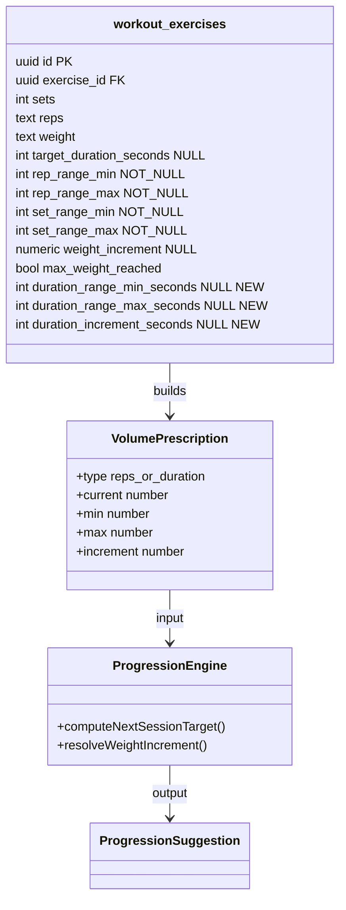
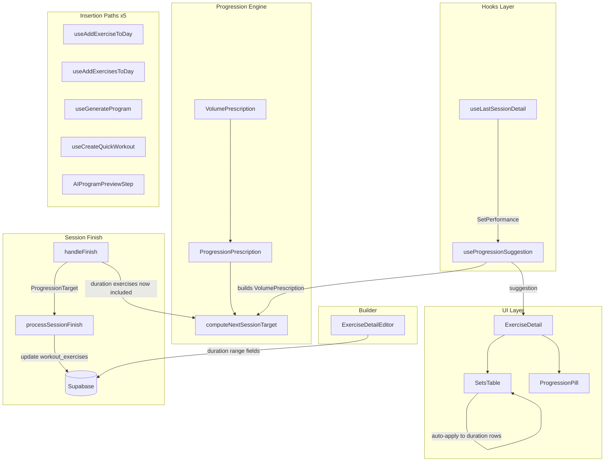
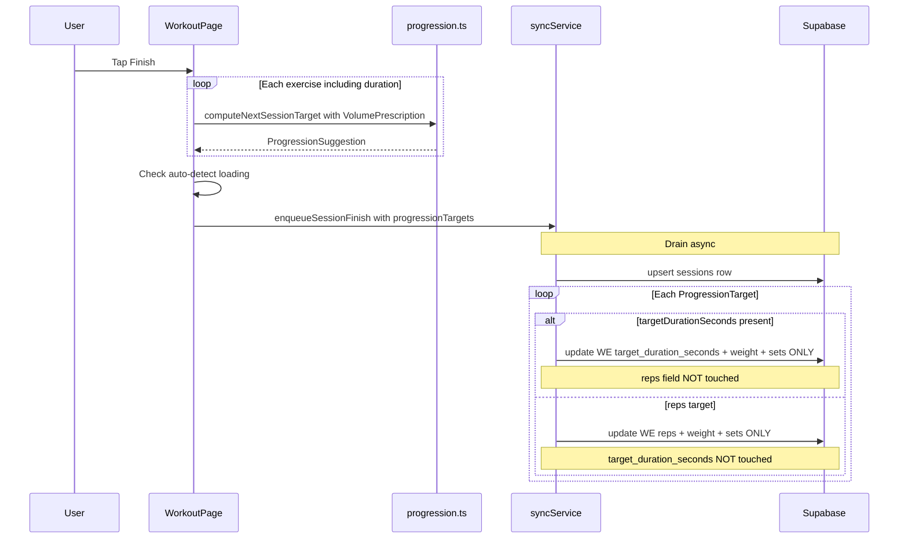

# Tech Plan — Generalized Progression Engine

## Architectural Approach

### Key Decisions

- **Decision:** Engine abstraction | **Choice:** Embed `VolumePrescription` inside `ProgressionPrescription` | **Rationale:** Core ladder operates on `volume.current / min / max / increment` with zero type branching. `volume.type` only consulted at the output stage to pick `REPS_UP` vs `DURATION_UP`. Rejected: separate engine functions per type (code duplication, drift risk).

- **Decision:** Output rule semantics | **Choice:** Separate `REPS_UP` / `DURATION_UP` enum values | **Rationale:** Decoupled for maintainability — each rule gets its own i18n, icon, delta format. Rejected: single `VOLUME_UP` (simpler but couples future behavior changes across types).

- **Decision:** `ProgressionSuggestion` shape | **Choice:** Add optional `duration: number` + `volumeType: 'reps' | 'duration'` to existing type | **Rationale:** Zero breakage on existing consumers. Reps code paths keep reading `suggestion.reps`; duration code paths check `volumeType` and read `suggestion.duration`. Rejected: renaming `reps` to `volume` (breaks every consumer).

- **Decision:** `useLastSessionDetail` parameterization | **Choice:** Accept `measurementType` parameter, branch filtering logic | **Rationale:** Currently hard-filters out duration rows. For duration exercises, must do the opposite — keep duration rows and map to `SetPerformance.durationSeconds`. Default behavior (omitted or `'reps'`) unchanged. Rejected: separate hook (unnecessary duplication).

- **Decision:** Auto-detect loading UX | **Choice:** Toast at session finish | **Rationale:** Non-intrusive, contextually appropriate — user is in review mode. Rejected: inline pill prompt (adds UI complexity to the next session when the user may have already forgotten).

- **Decision:** Template duration ranges | **Choice:** Defer `'30-60s'` parsing in `adaptForExperience`; use catalog defaults at insert time | **Rationale:** Few templates, easy backfill. No need to extend the parser now. Duration exercises get `default_duration_seconds ± band` ranges.

- **Decision:** Migration columns | **Choice:** 3 new nullable columns on `workout_exercises` (`duration_range_min_seconds`, `duration_range_max_seconds`, `duration_increment_seconds`) | **Rationale:** Nullable (not NOT NULL) because reps exercises don't need them. Avoids polluting reps rows. Engine only reads these when `measurementType === 'duration'`. Backfill via JOIN with `exercises.measurement_type`.

- **Decision:** Progression persistence | **Choice:** Extend `ProgressionTarget` with optional `targetDurationSeconds`; `processSessionFinish` writes it when present | **Rationale:** Backwards compatible — old queue items without `targetDurationSeconds` work unchanged. New duration targets update `target_duration_seconds` on the `workout_exercises` row.

### Critical Constraints

**`ProgressionPrescription` gains `volume: VolumePrescription`.** The old scalar fields (`currentReps`, `repRangeMin`, `repRangeMax`) stay in the type for backward compat but are deprecated — `useProgressionSuggestion` populates `volume` from whichever source (reps or duration). The engine reads only `volume`. This avoids a big-bang refactor: existing test cases keep working, new tests use the `volume` path.

**`useLastSessionDetail` currently filters out duration rows.** For duration exercises, this filter must invert. The hook already selects `duration_seconds` from the query. Adding a `measurementType` parameter and branching the filter is minimal.

**5 insertion paths must be updated**, not 4:
1. `useAddExerciseToDay` (`src/hooks/useBuilderMutations.ts`)
2. `useAddExercisesToDay` (same file)
3. `useGenerateProgram` (`src/hooks/useGenerateProgram.ts`)
4. `useCreateQuickWorkout` (`src/hooks/useCreateQuickWorkout.ts`)
5. `AIProgramPreviewStep` (`src/components/create-program/AIProgramPreviewStep.tsx`)

Each needs: (a) detect if exercise is duration-type, (b) populate `duration_range_min/max_seconds` from catalog defaults, (c) set `max_weight_reached: true` when `equipment === 'bodyweight'`.

**`processSessionFinish` must enforce strict mutual exclusivity** between reps and duration updates on `workout_exercises`. When `targetDurationSeconds` is present in a `ProgressionTarget`: write `target_duration_seconds`, `weight`, `sets` — **do not touch `reps`**. When absent: write `reps`, `weight`, `sets` — **do not touch `target_duration_seconds`**. No hybrid updates, ever.

**Memoization contract unchanged.** `useProgressionSuggestion` already memoizes via `useMemo` keyed on `[exercise, lastPerformance, measurementType, equipment]`. Adding `measurementType` to the dep array is already done. The only new cost is computing `VolumePrescription` from duration fields — trivial.

---

## Data Model

### Migration

Single migration file: `supabase/migrations/20260327120000_add_duration_progression_columns.sql`

```sql
ALTER TABLE workout_exercises
  ADD COLUMN duration_range_min_seconds integer,
  ADD COLUMN duration_range_max_seconds integer,
  ADD COLUMN duration_increment_seconds integer;

-- Backfill duration exercises from catalog defaults
UPDATE workout_exercises we SET
  duration_range_min_seconds = GREATEST(5, COALESCE(we.target_duration_seconds, e.default_duration_seconds, 30) - 10),
  duration_range_max_seconds = COALESCE(we.target_duration_seconds, e.default_duration_seconds, 30) + 15,
  duration_increment_seconds = 5
FROM exercises e
WHERE we.exercise_id = e.id
  AND e.measurement_type = 'duration';

-- Constraints
ALTER TABLE workout_exercises
  ADD CONSTRAINT we_duration_range_chk
    CHECK (duration_range_min_seconds IS NULL OR duration_range_min_seconds > 0),
  ADD CONSTRAINT we_duration_range_order_chk
    CHECK (duration_range_min_seconds IS NULL OR duration_range_max_seconds IS NULL
           OR duration_range_min_seconds <= duration_range_max_seconds),
  ADD CONSTRAINT we_duration_increment_chk
    CHECK (duration_increment_seconds IS NULL OR duration_increment_seconds > 0);
```

### Backfill Examples

- target 30s, no override → range 20-45s, increment 5s
- target 60s → range 50-75s, increment 5s
- target 10s → range 5-25s, increment 5s (floor at 5)
- no target, catalog default 30s → range 20-45s, increment 5s

### TypeScript Type Updates

In `src/types/database.ts`, extend `WorkoutExercise`:
```typescript
duration_range_min_seconds?: number | null
duration_range_max_seconds?: number | null
duration_increment_seconds?: number | null
```

In `src/lib/progression.ts`, new and modified types:
```typescript
export type ProgressionRule =
  | "HOLD_INCOMPLETE"
  | "HOLD_NEAR_FAILURE"
  | "REPS_UP"
  | "DURATION_UP"
  | "WEIGHT_UP"
  | "SETS_UP"
  | "PLATEAU"

export interface VolumePrescription {
  type: 'reps' | 'duration'
  current: number
  min: number
  max: number
  increment: number
}

export interface ProgressionPrescription {
  volume: VolumePrescription
  currentWeight: number
  currentSets: number
  setRangeMin: number
  setRangeMax: number
  weightIncrement: number
  maxWeightReached: boolean
  currentReps: number   // deprecated
  repRangeMin: number   // deprecated
  repRangeMax: number   // deprecated
}

export interface SetPerformance {
  reps: number
  weight: number
  completed: boolean
  rir: number | null
  durationSeconds?: number
}

export interface ProgressionSuggestion {
  rule: ProgressionRule
  reps: number
  weight: number
  sets: number
  reasonKey: string
  delta: string
  volumeType: 'reps' | 'duration'
  duration?: number
}
```

In `src/lib/syncService.ts`, extend `ProgressionTarget`:
```typescript
export interface ProgressionTarget {
  workoutExerciseId: string
  reps: number
  weight: number
  sets: number
  targetDurationSeconds?: number
}
```

### Entity Diagram



---

## Component Architecture

### Layer Overview



### Modified Files and Responsibilities

- `src/lib/progression.ts` — Add `VolumePrescription`, `DURATION_UP` rule. Refactor `computeNextSessionTarget()` to use `volume` instead of raw reps fields. Keep deprecated scalar fields for backward compat.

- `src/lib/progression.test.ts` — Add 6+ test cases for duration: DURATION_UP +5s, HOLD on incomplete duration, WEIGHT_UP after max duration (loadable exercise), SETS_UP after max duration (bodyweight), PLATEAU, first session null. Keep all existing reps tests passing.

- `src/hooks/useLastSessionDetail.ts` — Accept optional `measurementType` param. When `'duration'`: invert filter to keep duration rows, map `duration_seconds` to `SetPerformance.durationSeconds`. Default behavior unchanged.

- `src/hooks/useProgressionSuggestion.ts` — Remove `if (measurementType === "duration") return null`. Build `VolumePrescription` from duration range fields when duration. Pass `measurementType` to `useLastSessionDetail`.

- `src/components/workout/ProgressionPill.tsx` — Add `DURATION_UP` to `ICON_MAP` (Clock icon) and `COLOR_MAP`. Update `shortLabel` for duration delta (`+5s`). Add new popover detail using `volumeType` to pick reps vs duration interpolation.

- `src/components/workout/SetsTable.tsx` — Remove `isDurationExercise` guard in auto-apply `useEffect`. Handle `SessionSetRowDuration` rows: update `targetSeconds`. For SETS_UP, create `kind: "duration"` rows (not `kind: "reps"`). Key the `appliedProgressionRef` on duration-relevant fields.

- `src/pages/WorkoutPage.tsx` — Remove `if (lib?.measurement_type === "duration") continue` in `handleFinish`. Build duration `VolumePrescription` from `workout_exercises` duration range fields. Map duration session data to `SetPerformance`. Extend `ProgressionTarget` with `targetDurationSeconds`. Add auto-detect loading toast.

- `src/lib/syncService.ts` — Extend `ProgressionTarget` with optional `targetDurationSeconds`. In `processSessionFinish`, enforce mutual exclusivity: if `targetDurationSeconds` is present, write `{ target_duration_seconds, weight, sets }` (no `reps`); otherwise write `{ reps, weight, sets }` (no `target_duration_seconds`). No hybrid updates.

- `src/types/database.ts` — Add 3 new optional fields to `WorkoutExercise`.

- `src/hooks/useBuilderMutations.ts` — In `useAddExerciseToDay` and `useAddExercisesToDay`: detect duration-type, populate duration range defaults from catalog, set `max_weight_reached: true` when `equipment === 'bodyweight'`. In `useUpdateExercise`: accept duration range fields.

- `src/hooks/useGenerateProgram.ts` — Populate duration range columns for duration exercises using catalog defaults.

- `src/hooks/useCreateQuickWorkout.ts` — Same duration range population.

- `src/components/create-program/AIProgramPreviewStep.tsx` — Same duration range population.

- `src/components/builder/ExerciseDetailEditor.tsx` — When `isDuration`: show duration range inputs (min/max seconds, increment) in the Progression Settings collapsible. Hide rep range inputs. Extend `flush` with the 3 new fields.

- `src/locales/en/workout.json` + `src/locales/fr/workout.json` — Add `progression.durationUp`, `progression.durationUpDetail`, `autoDetectLoading` toast keys.

- `src/locales/en/builder.json` + `src/locales/fr/builder.json` — Add `durationRangeMin`, `durationRangeMax`, `durationIncrement` labels.

### Engine Refactoring Detail

The core of `computeNextSessionTarget()` changes from reps-specific logic to volume-generic logic:

```typescript
// Before (reps-specific):
const allHitTargetReps = completedSets.every((s) => s.reps >= currentReps)
const allAtMaxReps = completedSets.every((s) => s.reps >= repRangeMax)
const nextReps = Math.min(currentReps + 1, repRangeMax)

// After (volume-generic):
const volumeValue = (s: SetPerformance) =>
  prescription.volume.type === 'duration'
    ? (s.durationSeconds ?? 0)
    : s.reps
const allHitTarget = completedSets.every((s) => volumeValue(s) >= prescription.volume.current)
const allAtMax = completedSets.every((s) => volumeValue(s) >= prescription.volume.max)
const nextVolume = Math.min(prescription.volume.current + prescription.volume.increment, prescription.volume.max)
const volumeRule = prescription.volume.type === 'duration' ? 'DURATION_UP' : 'REPS_UP'
```

The `volumeValue` helper is the **only place** where `volume.type` affects ladder logic (to pick the right field from `SetPerformance`). The `volumeRule` mapping is at the output stage.

### Session Finish — Duration Progression Persistence



### Auto-Detect Loading Flow

In `handleFinish`, after computing progression targets:

```typescript
for (const ex of exercises) {
  if (ex.max_weight_reached !== true) continue
  const rows = session.setsData[ex.id] ?? []
  const hasWeight = rows.some(r => Number(r.weight) > 0)
  if (hasWeight) {
    autoDetectLoadingExercises.push(ex)
  }
}
// After session summary renders, show toast per exercise
```

The toast includes an action button that updates `max_weight_reached: false` via Supabase.

### Failure Mode Analysis

- **First session for duration exercise (no history):** `useLastSessionDetail` returns null → `useProgressionSuggestion` returns null → no Pill rendered. Sets use template defaults. Same as reps.
- **Duration exercise with no range columns (legacy row):** `useProgressionSuggestion` falls back to catalog defaults (`exercise.default_duration_seconds ± band`). Migration backfill should have caught these, but the hook is defensive.
- **Old queue items without `targetDurationSeconds`:** `processSessionFinish` checks `if (t.targetDurationSeconds != null)` to branch. Old items always take the reps path. No hybrid writes possible.
- **User swaps a duration exercise for a reps exercise (or vice versa):** New exercise has no history → no suggestion → clean. Ranges from the new exercise's type apply on next insert.
- **`max_weight_reached` auto-detect false positive:** User added weight by accident, dismiss the toast. Flag stays `true`. No harm done.
- **SetsTable auto-apply creates wrong row kind:** Guarded by checking `volumeType` when creating extra rows for SETS_UP. If duration, creates `kind: "duration"` with `targetSeconds` from suggestion.
- **Migration applies before client deploy:** Old clients only insert reps rows — OK. New nullable columns accept NULL. No breakage.
- **Offline progression for duration:** Same queue mechanism as reps. `ProgressionTarget` with `targetDurationSeconds` survives in localStorage and retries on reconnect.

### Test Plan

**`src/lib/progression.test.ts`** — new test cases:

- DURATION_UP: 3×30s all completed at target, range 20-45s, increment 5s → `DURATION_UP`, duration 35s
- HOLD_INCOMPLETE duration: 3 sets prescribed, only 2 completed → `HOLD_INCOMPLETE`
- HOLD_INCOMPLETE duration: completed but some below target → `HOLD_INCOMPLETE`
- WEIGHT_UP after max duration: all sets at 45s (max), `maxWeightReached: false` → `WEIGHT_UP`, duration resets to 20s (min)
- SETS_UP bodyweight: all at max duration, `maxWeightReached: true`, sets < setRangeMax → `SETS_UP`
- PLATEAU duration: all dimensions maxed → `PLATEAU`
- First session null → returns null
- Existing reps tests unchanged (verify no regression)

---

## References

- Epic Brief: `docs/Epic_Brief_—_Generalized_Progression_Engine.md`
- [GitHub Issue #156](https://github.com/PierreTsia/workout-app/issues/156)
- Prior art: `docs/Tech_Plan_—_Triple_Progression_Logic.md`
- Prior art: `docs/Tech_Plan_—_Duration-Based_Exercises_&_Set_Timer.md`
