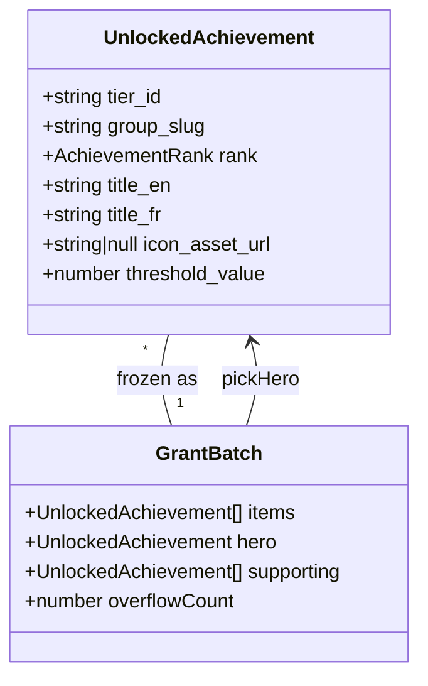
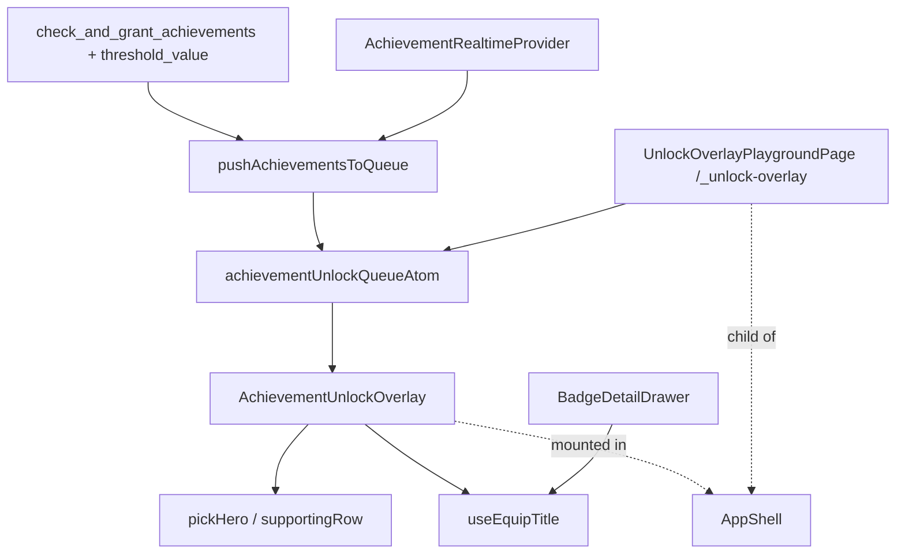

# Tech Plan — Grant Overlay — One Ceremony per Batch #491

## Architectural Approach

### Key Decisions

| Decision | Choice | Rationale |
|---|---|---|
| Ceremony unit | Snapshot the Jotai queue into a **Grant Batch** on first paint of a non-empty queue; render the snapshot, not the live atom | Late Realtime extras must not pop into an open overlay. Clearing-on-open is worse: it races with in-flight pushes. Snapshot + dismiss-filter is the freeze. |
| Snapshot without `useEffect` | `setBatch(queue)` during render when `batch === null && queue.length > 0` (React “adjusting state when props change”) | Overlay is always mounted in `AppShell`. An effect that copies the queue is the exact `setState`-in-effect antipattern. |
| Hero pick | Pure `pickHero(batch)` in `file:src/lib/achievementUtils.ts`: `diamond > platinum > gold > silver > bronze`; ties keep first-in-queue | Overlay stays dumb. Tests cover rank order without RTL. |
| Supporting overflow | Max 3 visible supporting medals; if more, last slot is `+N` with `N = supporting.length - 3` | 4-grant burst PNG is hero + 3. 5+ never paginates. |
| Queue atom | Keep `achievementUnlockQueueAtom` as a flat `UnlockedAchievement[]` inbox | Issue forbids a serial player. Do not introduce a batch atom. |
| `threshold_value` | Add to `check_and_grant_achievements` `RETURNS TABLE` + `eligible`/`SELECT`; Realtime mapper copies it from `BadgeStatusRow` (already has it) | Overlay must not invent marketing copy. `get_badge_status` already returns the column — grant was the gap. |
| Equip | Extract `useEquipTitle` from `BadgeDetailDrawer`; overlay + drawer both call it | Issue: don’t fork the mutation. Drawer unequip stays drawer-only (ceremony never unequips). |
| Chrome | shadcn `Dialog` (already Radix), `Button` default (primary ≈ `#00c9a7`), `Badge` for metal chip + track | Prefer shadcn. Rank metal owns glow/particles/chip; primary is Equip only. |
| Backdrop | `#0f0f13` / 70% + `backdrop-blur-sm` over the dimmed session summary | Matches v2. Do not recolor the page gold/purple. |
| FX | Keep existing `.achievement-glow-*` tokens; hero-only radial glow; CSS scale `0 → 1.15 → 1`; Diamond-only canvas/DOM squares, one burst, `z-index` behind type | Stitch “Diamond Drama” 300-particle rain is the ceiling, not the default. |
| Reduced motion | `useMediaQuery("(prefers-reduced-motion: reduce)")` — skip scale, burst, rain | Existing hook. Static medals still hierarchy-correct. |
| Playground | New route `/_unlock-overlay` under `AppShell` (overlay already mounted). Not in the drawer. No design-system route exists. | HITL must fire Bronze→Diamond and batch cases without farming sessions. |
| Pixel-perfect | Implement against gist `*-v2.png`. HITL T218 compares playground vs PNGs. | User-locked: not “inspired by.” |

### Critical Constraints

- **Do not rewrite `check_and_grant_achievements` metrics.** Copy the effective body from `file:supabase/migrations/20260819114837_quick_sessions_exclude_detached_days.sql`. Only add `threshold_value` to `RETURNS TABLE`, the `eligible` SELECT (`at.threshold_value`), and the final SELECT. Keep `SECURITY DEFINER`, `search_path = public`, and the `auth.uid()` / `is_trusted_backend_caller()` guard. Arch tests in `file:src/test/circuitAchievementTracks.arch.test.ts` require `qualifying_runs` to stay identical to `get_badge_status`.
- **Freeze is a snapshot, not a second queue.** `pushAchievementsToQueue` stays an append+dedup. Overlay ignores atom growth while `batch !== null`. On dismiss: mark batch `tier_id`s in `achievementShownIdsAtom`, `setQueue(prev => prev.filter(not in batch))`, `setBatch(null)`. Remaining inbox items open the next ceremony on the following render.
- **Dismiss clears the batch, not `queue[0]`.** Today `dismiss` does `prev.slice(1)` — that is the slot machine. Kill `AUTO_DISMISS_MS`.
- **Do not special-case Diamond for Equip.** Any rank is a title (`validate_title_ownership` already allows it).
- **Overlay click vs Equip click.** Equip `stopPropagation`. Overlay tap / overlay backdrop / Escape dismisses without equipping.
- **i18n.** Do not reuse `unlocked: "Unlocked!"` / `"Débloqué !"` for the eyebrow (bang). New keys: `ceremonyEyebrow`, `ceremonyEyebrowCount`, `ceremonyOverflow`, `ceremonyTapToContinue`. Threshold copy is `thresholdHint.{group_slug}` + `formatCompactNumber(threshold_value)`. Track name is `groups.{group_slug}`. Rank chip is `ranks.{rank}` with metal color, not `"GOLD RANK"`.
- **No overlay tests today.** Add `file:src/components/achievements/AchievementUnlockOverlay.test.tsx` using `renderWithProviders`. Mock `@/lib/supabase`. Drive the queue via the Jotai store passed into the provider. Do not `getByTestId`.
- **BadgeIcon sizes.** `lg` is already `h-28` (112px) — use it for the single/3+ hero. Overlap supporting ~72px and row ~56px via `className` (twMerge). Do not add a 2×2 grid “because four icons fit.”
- **Type casts.** Realtime mapper currently builds `UnlockedAchievement` field-by-field — keep that. Do not `as UnlockedAchievement` on the RPC row; type `supabase.rpc(...).returns<UnlockedAchievement[]>()`.

---

## Data Model



No new tables. `user_achievements` and `user_profiles.active_title_tier_id` unchanged.

### `check_and_grant_achievements` return (additive)

```sql
RETURNS TABLE (
  tier_id uuid, group_slug text, rank text,
  title_en text, title_fr text, icon_asset_url text,
  threshold_value numeric
)
```

`eligible` gains `at.threshold_value`. Final `SELECT` projects it.

### Table Notes

- **Grant Batch is not persisted.** It is a UI snapshot of the in-memory inbox.
- **`threshold_value` on `UnlockedAchievement`** is the tier’s requirement (e.g. 27 Cindy rounds), not current progress. The overlay never shows a progress bar.
- **Overflow `+N`** is computed, not a fake `UnlockedAchievement`.

### Inbox freeze (runtime)

```
queue atom: [A, B, C]     batch: null     → render sets batch = [A,B,C]
queue atom: [A, B, C, D]  batch: [A,B,C]  → D waits (Realtime extra)
dismiss                    batch: null, queue: [D] → next ceremony is [D]
```

---

## Component Architecture

### Layer Overview



### New Files & Responsibilities

| File | Purpose |
|---|---|
| `file:supabase/migrations/YYYYMMDDHHMMSS_grant_achievements_threshold_value.sql` | Replace grant RPC; add `threshold_value` only |
| `file:src/lib/achievementUtils.ts` | Add `pickHero`, `supportingMedals`, `supportingOverflow` (keep `rankColorText` / `resolveActiveTitle`) |
| `file:src/hooks/useEquipTitle.ts` | Shared mutation + toasts |
| `file:src/hooks/useEquipTitle.test.ts` | Equip success/error/invalidate |
| `file:src/components/achievements/AchievementUnlockOverlay.test.tsx` | 1 / 2 / 4 / overflow, hero, Equip vs dismiss, reduced-motion |
| `file:src/pages/UnlockOverlayPlaygroundPage.tsx` | Hidden playground (buttons push fixtures onto the atom) |
| `file:src/pages/UnlockOverlayPlaygroundPage.test.tsx` | Buttons exist; clicking seeds a batch |

### Component Responsibilities

**`pickHero` / `supportingMedals` / `supportingOverflow`** (`achievementUtils`)
- Rank order table; first-wins on tie
- Supporting = batch minus hero (identity `tier_id`)
- Visible supporting = first 3; `overflowCount = max(0, supporting.length - 3)`

**`AchievementUnlockOverlay`**
- Snapshot batch during render; never read live queue for medals/copy while open
- Layouts: 1 hero; 2 overlap; 3+ under-row; 5+ row with `+N`
- Chrome: eyebrow, `headline` title, metal `Badge` chip + track `Badge`, threshold line, Equip, tap-to-continue
- Dismiss: Escape / overlay click / “tap to continue” → clear batch from inbox, no equip
- Equip: `stopPropagation`, toast, stay open
- Hide Equip when `profile.active_title_tier_id === hero.tier_id`
- FX: hero glow only; scale unless reduced-motion; Diamond-only particle burst behind type
- Kill `AUTO_DISMISS_MS` and `queue[0]` player

**`useEquipTitle`**
- `supabase.from("user_profiles").update({ active_title_tier_id }).eq("user_id", user.id)`
- Invalidate `["user-profile", user.id]`
- Toasts: `titleEquipped` / `titleError` (overlay never calls unequip)

**`BadgeDetailDrawer`**
- Replace inlined mutation with the hook; keep unequip UI

**`AchievementRealtimeProvider`**
- Pass `threshold_value: match.threshold_value` into `UnlockedAchievement`

**`UnlockOverlayPlaygroundPage`**
- Auth-gated via `AppShell`. No nav link.
- Buttons: Bronze, Silver, Gold, Platinum, Diamond (singles); 2-overlap (Silver+Bronze); 4-burst (Diamond hero + 3); 5+ (Diamond + 4 supporting → `+1`)
- Each click `pushAchievementsToQueue` with distinct fake `tier_id`s and real-looking titles/slugs/`threshold_value`

### Failure Mode Analysis (if applicable)

| Failure | Behavior |
|---|---|
| RPC returns new column, old client | Old overlay ignores extra JSON field (harmless). New overlay on old RPC: `threshold_value` missing — show rank+track without the hint line (don’t crash, don’t invent copy). Mapper: treat missing as `undefined`, hide the line. |
| Realtime extra mid-ceremony | Stays in inbox; next ceremony after dismiss |
| Equip network error | `titleError` toast; overlay stays; batch still dismissible |
| Hero already equipped | No Equip button |
| Empty queue | Overlay unmounts content (`batch === null`) |
| Reduced motion | No scale / burst / rain; layout and copy unchanged |
| Duplicate tier in RPC + Realtime | `pushAchievementsToQueue` dedup via shown+queued ids; snapshot won’t contain dupes |
| Playground clicked twice | Dedup may swallow second click — buttons should use fresh `tier_id`s (e.g. `crypto.randomUUID()`) so re-trigger works after dismiss |
