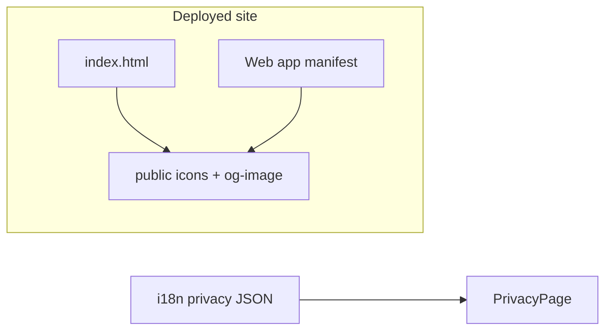
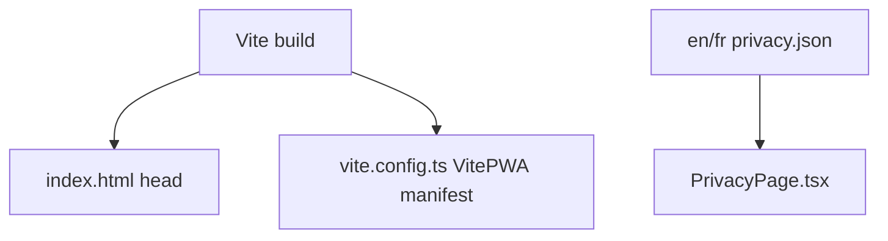

# Tech Plan — GymLogic.me Launch Branding

## Architectural Approach

Ship **GymLogic**-aligned branding without introducing a second “source of truth” for strings: keep **one** HTML shell ([`file:index.html`](index.html)) for default `<title>`, **all** social meta tags, and favicon links; keep **one** PWA manifest definition in [`file:vite.config.ts`](vite.config.ts) (vite-plugin-pwa) in sync with those names and icons. **Replace** raster/SVG assets under [`file:public/`](public/) as a set so favicon, install icons, and maskable icon stay visually consistent. **Privacy** updates are **i18n-only** ([`file:src/locales/en/privacy.json`](src/locales/en/privacy.json), [`file:src/locales/fr/privacy.json`](src/locales/fr/privacy.json))—no router or React changes unless copy length forces layout tweaks (unlikely).

**Canonical URL:** Use **`https://gymlogic.me`** (no path) for `og:url` and absolute `og:image` / `twitter:image` hrefs. Do **not** parameterize via `import.meta.env` in `index.html` unless you add a small Vite HTML transform—the default SPA setup does **not** substitute env vars into `index.html` automatically. Hardcoding the production URL is normal: crawlers and chat apps fetch the **deployed** page, not `localhost`.

**Favicon direction** ([issue #115](https://github.com/PierreTsia/workout-app/issues/115)): implement **either** Option A (legible dumbbell) **or** Option B (**GL** monogram)—design choice is binary; export all required sizes from the same master (Figma/pen tool) to avoid drift.

### Key Decisions

| Decision | Choice | Rationale |
|---|---|---|
| Meta & title placement | Static tags in [`file:index.html`](index.html) | No `react-helmet-async` dependency; one place for OG/Twitter; matches current app (no per-route titles today). |
| Canonical & OG image URLs | Literal `https://gymlogic.me/...` | Share validators need absolute URLs; avoids env injection complexity in HTML. |
| PWA manifest copy | Edit `manifest` block in [`file:vite.config.ts`](vite.config.ts) | Single generator for `manifest.webmanifest`; keeps `name` / `short_name` / `description` aligned with `<title>`. |
| `short_name` | **`GymLogic`** (9 chars) | Fits common launcher limits; avoids truncating “GymLogic …”. |
| Default `<title>` | **`GymLogic`** or **`GymLogic — Workouts`** | Epic preferred short brand; optional suffix if you want tab text to hint at category—pick one and use consistently in `og:title`. |
| OG image | New raster **`public/og-image.png`**, 1200×630 | Industry default aspect for Facebook/Slack/LinkedIn; keep important content in **center safe zone** (~text won’t be cropped on some crops). |
| Icon pipeline | Replace **all** of: `pwa-192x192.svg`, `favicon-32x32.png`, `pwa-192x192.png`, `pwa-512x512.png`, `pwa-maskable-512x512.png`, `apple-touch-icon-180x180.png` | [`file:index.html`](index.html) and manifest reference these paths; partial updates leave stale install tiles on some devices. |
| Maskable icon | Keep **`purpose: "maskable"`** entry on 512 maskable asset | Android adaptive icons need padding; don’t put critical strokes at the edge. |
| Privacy | Add **one** sentence naming the public site in EN + FR | Satisfies “where is this?” without rewriting the compliance epic; place in **Who we are** ([`s1Body`](src/locales/en/privacy.json)) or **Where processed** ([`s3Body`](src/locales/en/privacy.json))—prefer **s1** so “who + where” stay together. |
| SW cache of new assets | Rely on existing Workbox `globPatterns` | PNG/SVG already precached; after deploy, `registerType: "autoUpdate"` picks up new hashed build—users may need one refresh for **favicon** in an already-open tab (browser cache). |

### Critical Constraints

- **Theme boot script** in [`file:index.html`](index.html) must stay **untouched** above `
`—only edit `<head>` for meta/title/links. Keep the comment about [`file:src/lib/themeStorage.ts`](src/lib/themeStorage.ts) in sync if keys ever change (out of scope here).
- **vite-plugin-pwa** [`includeAssets`](vite.config.ts) currently lists `pwa-192x192.svg`; if the favicon filename stays the same, no change. If you **rename** assets, update `includeAssets`, `manifest.icons`, and [`file:index.html`](index.html) `<link>` hrefs together.
- **PNG vs SVG:** Browsers use SVG for `rel="icon"` where supported; **PWA manifest** still lists PNGs for install—both must match the new identity.
- **Compliance alignment:** New privacy sentences must **not** contradict [`file:docs/Epic_Brief_—_Compliance_Legal_Privacy_and_Account_Deletion.md`](Epic_Brief_—_Compliance_Legal_Privacy_and_Account_Deletion.md) (sub-processors, deletion, etc.). Naming the domain is factual, not a new legal entity.
- **Build sandbox:** Full `npm run build` needs unsandboxed run per workspace rule; validating types with `npx tsc --noEmit` is enough for this epic (no TS changes expected unless you add a tiny helper—prefer not to).

---

## Data Model

No database, API, or client storage schema changes. Branding is **static assets + copy**.

### Table notes

- **Og metadata** is not stored in Supabase; crawlers read the **initial HTML** response from Vercel. The SPA does not need to hydrate meta for this epic.
- If you later add **per-route** SEO, that would be a separate ticket (e.g. Helmet + SSR or pre-render)—out of scope.

---

## Component Architecture

### Layer Overview

### New files & responsibilities

| File | Purpose |
|---|---|
| [`file:public/og-image.png`](public/og-image.png) | **New** — 1200×630 (or 1200×600) share image; referenced by `og:image` and `twitter:image` with absolute `https://gymlogic.me/og-image.png`. |
| [`file:public/pwa-192x192.svg`](public/pwa-192x192.svg) (and sibling PNGs) | **Replaced** — new art; same filenames to minimize config churn. |

No new TypeScript/React files required for OG/title/manifest.

### Component responsibilities

**[`file:index.html`](index.html)**  
- Set `<title>…</title>` to the chosen branded string.  
- Add: `meta property="og:title"`, `og:description`, `og:url`, `og:type` (`website`), `og:site_name`, `og:image`, `og:image:width`, `og:image:height`, `og:locale` (and `og:locale:alternate` for `fr_FR` if you want parity).  
- Add: `meta name="twitter:card"` (`summary_large_image`), matching `twitter:title`, `twitter:description`, `twitter:image`.  
- Optional: `<link rel="canonical" href="https://gymlogic.me/" />` for search consistency.  
- Keep existing favicon `<link>` rows; update **files** on disk, not necessarily the paths.

**[`file:vite.config.ts`](vite.config.ts)**  
- Update `manifest.name`, `manifest.short_name`, `manifest.description` to GymLogic-aligned copy (EN is fine for manifest; PWA name is not localized today).  
- Confirm `icons` array still points at existing paths after asset swap.

**[`file:src/pages/PrivacyPage.tsx`](src/pages/PrivacyPage.tsx)**  
- No change expected—uses `useTranslation("privacy")` only.

**EN/FR privacy JSON**  
- Extend `s1Body` (recommended) with a short clause: public web app available at **https://gymlogic.me** (and French equivalent).

### Failure mode analysis

| Failure | Behavior |
|---|---|
| User has old SW/cache | vite-plugin-pwa `autoUpdate` fetches new precache on next visit; **tab favicon** may cache aggressively—acceptable; hard refresh clears. |
| Share debugger shows old image | Facebook/Twitter cache OG URLs; use each platform’s debugger “scrape again” after deploy. |
| `og:image` 404 | Validator shows broken preview—verify file is under `public/` and path matches **absolute** URL including `https://`. |
| Maskable icon clipped | If logo touches edges, Android circle masks crop it—keep **padding** inside `pwa-maskable-512x512.png` safe zone. |
| Mismatch title vs manifest | User sees different strings in **browser tab** vs **installed app name**—mitigation: same copy in `index.html` and `manifest.name` / `short_name`. |

---

## Implementation checklist (for tickets)

1. **Design** — Lock Option A vs B from #115; export master asset.  
2. **Rasterize** — Generate listed PNG sizes + maskable variant; replace SVG favicon.  
3. **HTML** — Title + full OG/Twitter block + optional canonical.  
4. **Manifest** — Strings in [`file:vite.config.ts`](vite.config.ts).  
5. **Privacy** — EN + FR string update; quick read of policy for flow.  
6. **Verify** — Deploy preview or production: [Facebook Sharing Debugger](https://developers.facebook.com/tools/debug/), Twitter Card Validator (or X equivalent), install PWA on Android + iOS smoke check for icon.

---

## References

- Epic: **GymLogic.me Launch Branding** (companion doc: `docs/Epic_Brief_—_GymLogic.me_Launch_Branding.md` — restore if missing locally).  
- [GitHub #115 — favicon redesign](https://github.com/PierreTsia/workout-app/issues/115)  
- [GitHub #44 — Go Live checklist](https://github.com/PierreTsia/workout-app/issues/44)  
- [`file:.cursor/rules/docs-format.mdc`](.cursor/rules/docs-format.mdc)

---

When you're ready, say **split into tickets** to continue.
