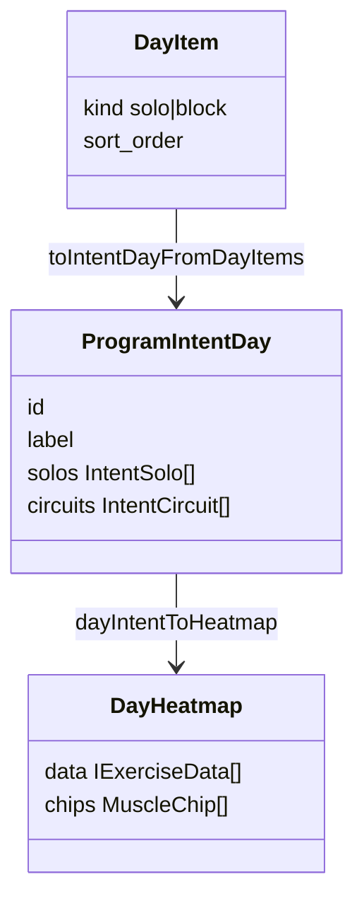
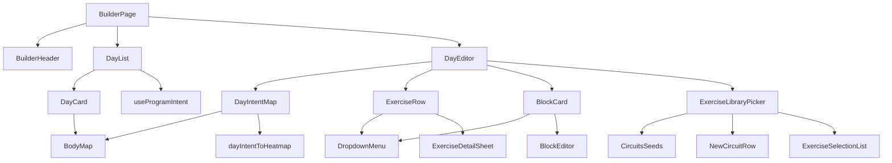

# Tech Plan — Hevy-class Program Builder (#503)

> Implements `file:docs/Epic_Brief_—_Hevy-class_Program_Builder_#503.md`. Glossary: `file:docs/CONTEXT.md` (**Builder**, **Template Prescription**, **Exercise Slot**, **Exercise Block**, **Meet Cindy**, **Unified Day Sequence**, **Circuit in Program Scores**). ADR `file:docs/adr/0021-builder-one-add-picker.md`. Visual floor: `file:web/stitch/builder-503/`. Sibling: `file:docs/Tech_Plan_—_Program_Identity_+_Scoring_#504.md` — scores stay on the **Program Page**.

---

## Architectural Approach

### Key Decisions

| Decision | Choice | Rationale |
|---|---|---|
| Schema | None | **Template Prescription** and **Exercise Blocks** already exist. This is a write-surface restyle. |
| `BuilderView` | `"list" \| "editor"` only | Kill `"detail"`. Solo 4-field edits stay on the row. Leftover fields open from `⋯`. |
| Overflow | shadcn **DropdownMenu** → **Sheet** (mobile) / **Dialog** (desktop) wrapping leftover `ExerciseDetailForm` | Same Dialog/Drawer split as the picker and **BlockEditor**. No third stack view. |
| Inline save | Existing `useUpdateExercise` + **500ms** debounce, lifted onto the row | Do not invent a second write path. `template_updated_at` still comes from the Postgres trigger (not `rest_seconds`). |
| Day heatmap | Pure `dayIntentToHeatmap(day: ProgramIntentDay)` → `bodyMapFromIntent({ programId, days: [day] })` | Same credits as **Program Balance** / Library cards. Never `useAggregatedMuscles` (`rounds ×`). |
| Volume chips | Same `dayBalanceCredits` as the map: zeros omitted, sorted descending | One grain. A Cindy day lights the map *and* the chips. Hypertrophy-only chips would go blank while the silhouette lit up. |
| Solo row layout | Two-line below `md`; Stitch 7-column grid from `md` up | Product is mobile. A 7-cell grid on 375px overflows or squints. |
| Editor data | Derive `ProgramIntentDay` from `useDayItems` already on **DayEditor** | Map updates when the query cache updates after mutations. No extra fetch. |
| Week minis | `useProgramIntent(programId)` → one heatmap per `ProgramIntentDay` | Query already exists and is invalidated by Builder writes (#504). `size="sm"`. |
| One picker | Single `ExerciseLibraryPicker` with `kind`: Exercises \| Circuits, and Circuits sub-mode `seeds` \| `create` | ADR 0021. Kill the second picker instance and page-level **Create circuit**. |
| Jetable create | Pinned **New circuit** row on Circuits → existing ≥2 multi-select + `useCreateBlock` | Seeds stay tap-to-drop (`instantiateBenchmark`). No checkboxes on Cindy. |
| Picker add | **Add-only.** Already-on-day = badge, not selectable, not a delete. | Uncheck-to-remove is CMS leftover. Delete lives on row `⋯`. Constraint is **Exercises tab only** — **New circuit** may pick a movement that is already a solo (it becomes a station). |
| **BlockCard** | Same `⋯` (Edit circuit / Remove) as solos | Stitch. Pencil + trash go. **BlockEditor** drill-in unchanged. |
| Admin catalog link | Overflow item, `AdminOnly` | Do not keep a pencil on the athlete row. |
| i18n | Extend `builder` | No new namespace. |

### Critical Constraints

**Do not score the Builder.** No **Goal Track** bands, no **Program Balance** 0–100, no #519 banner. The map is a muscle heatmap of *this day*, not a character sheet.

**Do not use Home’s heatmap grain.** `file:src/hooks/useAggregatedMuscles.ts` and Quick Workout `PreviewStep` weight **Circuit** stations by `rounds`. That would make Cindy look like a 50-set pec day. Builder uses `intentBalanceCredits` (solo `sets` / `sets × 0.5`; station `1` / `0.5` once). Chips use that same map.

**`LABEL_EXERCISE_SELECT` is the wrong embed** if we ever go through slim rows — same trap as #504. The `useDayItems` path must feed `toSolo` / `toStation` with `secondary_muscles` + `measurement_type` (live catalog, snapshot fallback). Prefer extending `file:src/lib/programScore/toIntent.ts` over a second mapper that drifts.

**One primary Add.** `file:src/components/builder/DayEditor.tsx` currently mounts two pickers. After this epic: one button, one picker. e2e `file:e2e/builder-crud.spec.ts` clicks **Create circuit** — rewrite it or CI dies.

**Add-only is a behavior break.** Today Apply can delete solos by unchecking. Tests in `file:src/components/builder/ExerciseLibraryPicker.test.tsx` assert that. Rewrite them. `applyChanges` stops being the Exercises footer; reuse `addSelectedCount` (rewritten to “Add {{count}}”).

**`rest_seconds` does not bump `template_updated_at`.** Inline rest edits must keep that. Do not start writing the timestamp from the client. Rest cell stores seconds (existing field), not a `mm:ss` parser. Stitch’s `2:00` is visual floor, not a new format.

**Unknown muscles are dropped**, not invented — same as the scorer.

**Copy law.** Values say **Circuit**, never “block”. Never **Exercise Slot** / **Template Prescription**. FR builder is **tu**. `noExercises` currently uses *vous* — rewrite that key because we touch the empty state; do not rewrite untouched *vous* leftovers (`offlineDescription`).

**Prefer shadcn.** `Input`, `Button`, `Badge`, `DropdownMenu`, `Sheet`, `Dialog`, `Drawer`, `ToggleGroup`. No raw overflow `<button>`.

**Functional style.** Heatmap and intent mapping are pure. No `useEffect` to sync form state into the map.

---

## Data Model

No new tables. Derived document (already shipped for #504):

### Table Notes

- **`workout_exercises`** — still the **Template Prescription**. Inline fields: `sets`, `reps` *or* `target_duration_seconds`, `weight`, `rest_seconds`. Overflow: ranges, increment, `max_weight_reached`, instructions (read from catalog, not a new column).
- **`exercise_blocks` / `block_exercises`** — unchanged. Jetable create still `useCreateBlock` (two-step insert). Seeds still `instantiateBenchmark`.
- **`MuscleChip`** — `{ muscle: MuscleTaxonomy, credit: number }` from `dayBalanceCredits`, zeros omitted, sorted descending. Display label via `useCatalogLabels().muscleLabel`. Value is the credit (integer if whole, else one decimal). **Not** a **Goal Track**.
- **Picker mode** — React state only: `kind: "exercises" | "circuits"`, `circuitMode: "seeds" | "create"`. Not persisted.

---

## Component Architecture

### Layer Overview

### New Files & Responsibilities

| File | Purpose |
|---|---|
| `file:src/lib/programScore/dayIntentToHeatmap.ts` | `dayIntentToHeatmap(day)` + `dayBalanceCredits` (or wrap `bodyMapFromIntent` with a one-day intent). Returns `{ data, chips }`. Golden tests: Cindy-only day, PPL push day, empty day. |
| `file:src/lib/programScore/toIntentDayFromDayItems.ts` | `DayItem[]` → `ProgramIntentDay`. Reuse `toSolo` / `toStation` / `toCircuit` guts — do not fork credit math. |
| `file:src/components/builder/DayIntentMap.tsx` | Always-visible **Body Map** (`size="md"`, `BODY_MAP_INTENSITY_COLORS`) + horizontal credit chips. Hidden only when both data and chips are empty (empty day). |
| `file:src/components/builder/ExerciseOverflowMenu.tsx` | `DropdownMenu`: details, remove, admin catalog link. |
| `file:src/components/builder/ExerciseDetailSheet.tsx` | Sheet/Dialog host for leftover `ExerciseDetailForm` fields (no sets/reps/weight/rest duplication). |
| `file:src/components/builder/NewCircuitRow.tsx` | Pinned Circuits row. Sets `circuitMode` to `create`. |

### Component Responsibilities

**`BuilderPage`**
- Drop `view === "detail"` and `selectedExerciseId`. Back stack: `editor → list → from`.
- Keep offline gate, `SaveIndicator`, rename, Activate.

**`DayEditor`**
- One `Add` CTA. One picker.
- Hero: day name, `DayIntentMap`, then the **Unified Day Sequence**.
- Empty: map hidden, empty copy, same Add.
- Reorder unchanged (`reorderDayItems`).

**`ExerciseRow`**
- Grip + thumb + name.
- Four compact `Input`s: sets, reps-or-hold, weight (display unit via `useWeightUnit`), rest (seconds, stored as today). Duration slots swap reps → hold via `measurement_type`.
- Layout: below `md`, two-line (line 1 grip + thumb + name + `⋯`; line 2 four Inputs). From `md` up, Stitch 7-column grid.
- `⋯` instead of trash. Row tap does **not** navigate.
- Debounced `useUpdateExercise` (copy the 500ms `flush` from `ExerciseDetailForm`). Flush on unmount if a timer is pending.

**`ExerciseDetailSheet`**
- Ranges, increment, `max_weight_reached`, `ExerciseInstructionsPanel`.
- Does not re-edit the four inline fields (single source on the row).
- Unmounting with a pending debounce: flush immediately (same as today’s form).

**`BlockCard`**
- Mint left rail (Stitch). `⋯` → Edit circuit (`BlockEditor`) / Remove (existing confirm).
- Stations stay a preview, not inline **Per-round Prescription**.

**`ExerciseLibraryPicker`**
- Title: **Add to {{day}}**.
- Exercises: multi-select add-only; already-on-day badge; footer **Add {{count}}**; Cindy search punch-through stays.
- Circuits / seeds: seed cards tap → `instantiateBenchmark` → close. Pinned **New circuit** row.
- Circuits / create: back to seeds; catalog multi-select; `createBlockCta` (≥2); `useCreateBlock`; then close. Already-on-day does **not** block station picks.
- Kill `onCreateBlock` as the thing that hides the kind toggle. One instance, internal mode.

**`DayList` / `DayCard`**
- Mini `BodyMap` `size="sm"` from `useProgramIntent`. Grey “N exercises” subtitle goes away (it also ignored **Circuits**).
- Add day, reorder, delete day: keep. Day-card trash may move to `⋯` if the week-list Stitch is followed; delete confirm stays.

### Failure Mode Analysis

| Failure | Behavior |
|---|---|
| Mutation error on inline edit | Existing `onMutationStateChange("error")` → **Syncing failed**. Local input keeps the typed value. |
| Offline | Existing `OfflineBlock`. No optimistic local authoring. |
| `instantiateBenchmark` fails | Existing `instantiateError`; picker stays open. |
| `useCreateBlock` second insert fails | Existing two-step risk; surface `syncFailed`. Do not invent a transaction in this epic. |
| New circuit with &lt; 2 selected | CTA disabled (today’s rule). |
| Add with 0 selected | Footer disabled. |
| Duplicate add of an already-on-day solo | Impossible on Exercises tab (disabled). |
| Empty day | Map + chips hidden. Empty copy + Add. |
| Week list with 7 days × 2 SVG models | Acceptable. `size="sm"`. No virtualize in v1. |
| `BuilderView = "detail"` deep link | None exists (React state only). Safe to delete. |
| Duration exercise | Reps column becomes hold (seconds). Overflow shows duration ranges, not rep ranges. |

---

## i18n contract

**Namespace:** `builder`
**Surfaces:** DayEditor, DayList, picker, row overflow, empty state

| Key | EN | FR | Why this wording |
|---|---|---|---|
| `addToDay` | Add to {{label}} | Ajouter à {{label}} | Picker title; names the day so you don’t drop on the wrong one. |
| `newCircuit` | New circuit | Nouveau circuit | Pinned Circuits row. **Circuit**, not “block”. |
| `newCircuitHint` | Pick at least two exercises. | Choisis au moins deux exercices. | Teaches the ≥2 rule. FR **tu**. |
| `pickerBack` | Back | Retour | Returns from create-mode to seeds. |
| `moreAria` | More actions | Plus d'actions | `⋯` has no visible label. |
| `editDetails` | Ranges and instructions | Plages et consignes | What the overflow sheet actually holds. Not “details”. |
| `alreadyInDay` | On day | Sur ce jour | Replaces unused “In day” / “Dans le jour”. Stitch badge. |
| `addSelectedCount_one` | Add {{count}} | Ajouter {{count}} | Stitch footer. Drops “selected” / “Apply changes”. |
| `addSelectedCount_other` | Add {{count}} | Ajouter {{count}} | Same. |
| `addExercise` | Add exercise | Ajouter un exercice | Sentence case. The one day CTA. |
| `noExercises` | Nothing on this day yet. | Rien sur ce jour pour l'instant. | Empty state. FR **tu** (old string was *vous*). |
| `restColumn` | Rest | Repos | Dense header. Full `restSeconds` stays for the sheet. |
| `holdColumn` | Hold | Tenue | Duration column. Glossary Hold / Tenue. |
| `newDay` | New day | Nouveau jour | Sentence case while we touch the week list. |

Reuse as-is: `sets`, `reps`, `kindExercises`, `kindCircuits`, `createBlockCta_*`, `editBlock`, `remove`, `removeExerciseTitle`, `removeBlockTitle`, `saved`, `syncFailed`, `instantiateError`.

Chip labels are **not** `builder` keys — use `muscleLabel` from `file:src/lib/catalogLabels.ts`.

### Rejected

- `Add Exercise` (title case) → `Add exercise` — sentence-case law
- `Apply changes` as the add footer → add-only is not a diff
- `Create circuit` as a page button → ADR 0021; key `createBlock` may remain unused
- `In day` → too CMS; Stitch is “On day”
- `New block` / `Nouveau bloc` — forbidden
- `WOD` on the New circuit row — catalog object is **Benchmark Circuit**; this row is jetable
- Chip labels in `builder.json` — use `muscleLabel`, do not fork taxonomy copy
- `Please try again` on instantiate — keep existing specific `instantiateError`
- Hypertrophy-only chip numbers — would blank a Cindy day
- `mm:ss` rest parser — Stitch chrome, not a new field format

### Open

None. Chip grain and row layout locked in refinement.
