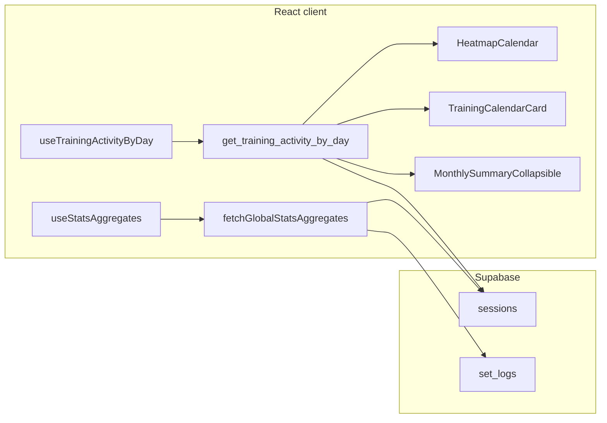
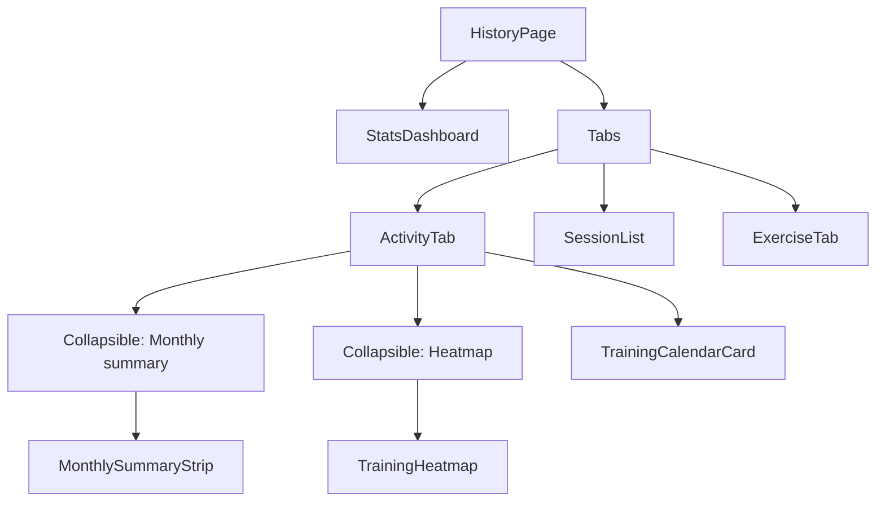

# Tech Plan — History Revamp (Drawer, Calendar, Analytics)

## Architectural Approach

Ship **Activity** as the default History tab: a **Calendar 11–style** card ([shadcn/studio “Calendar with event list”](https://shadcnstudio.com/docs/components/calendar)) adapted to **workout sessions** (no “add event” affordance), plus **Collapsible** sections for **monthly summary** and **[HeatmapCalendar](https://heatmap-shadcn.vercel.app/#docs)** fed by a **single Supabase RPC** for **per-day buckets** (minutes + session count) in the user’s **IANA timezone**. **Global** stats for [`file:src/components/history/StatsDashboard.tsx`](file:src/components/history/StatsDashboard.tsx) move behind **one shared client module** so we never duplicate the three `count` queries. **Sessions** and **By exercise** tabs stay as today with new tab order. **Drawer** History row gains a **lucide** icon + `gap` like other links.

**Accepted debt (v1):** The **Sessions** tab keeps [`file:src/hooks/useSessionHistory.ts`](src/hooks/useSessionHistory.ts) as its **unbounded** fetch; only **Activity** moves to RPC + bounded month query for the calendar footer. Follow-up: paginate or date-range **SessionList** if large histories hurt UX.

**Stack reality:** App is **Vite + React** (not Next.js). Strip `'use client'` from copied snippets; align imports with [`file:components.json`](components.json) aliases.

### Key Decisions

| Decision | Choice | Rationale |
|---|---|---|
| Calendar UI shell | **shadcn/studio Calendar 11** via `npx shadcn@latest add @ss-components/calendar-11` (then adapt) | Matches requested layout: **Card** + **Calendar** + **CardFooter** list under a **date header** ([reference](https://shadcnstudio.com/docs/components/calendar)). |
| Calendar primitives | Whatever the block pulls in (typically **react-day-picker** + [`file:src/components/ui/calendar.tsx`](src/components/ui/calendar.tsx) if not present) | Project currently has **no** `calendar.tsx`; install is required. |
| Demo dependencies | **Do not** add `little-date` unless the block hard-requires it; prefer [`file:src/lib/formatters.ts`](file:src/lib/formatters.ts) + **`Intl`** (no `date-fns` in repo today). The calendar block **may** add `date-fns` as a transitive dependency—acceptable. | Fewer deps; Vite-friendly; accurate stack. |
| “Plus” / Add Event | **Remove** | History is browse-only per Epic Brief; no fake CTA. |
| Heatmap component | **Copy-paste** [`HeatmapCalendar`](https://heatmap-shadcn.vercel.app/#docs) into `file:src/components/heatmap-calendar.tsx` (or `file:src/components/history/heatmap-calendar.tsx`) per upstream docs | User-selected component; theme via CSS variables like other shadcn pieces. |
| Heatmap data | **Supabase RPC** `get_training_activity_by_day(p_from date, p_to date, p_tz text)` → rows `(day date, session_count int, minutes int)` | Avoids loading **all** sessions on the client ([`file:src/hooks/useSessionHistory.ts`](src/hooks/useSessionHistory.ts) is unbounded today—bad for 3-year history). |
| Day bucketing timezone | **Client sends `Intl.DateTimeFormat().resolvedOptions().timeZone`** (IANA string) into RPC; Postgres buckets `finished_at` with `AT TIME ZONE p_tz` for **local calendar date**. **Validate** `p_tz` in the app (try/catch or allowlist); if missing/invalid, pass **`UTC`** and avoid calling RPC with garbage (Postgres errors on bad zone names). | One rule for **calendar modifiers**, **heatmap cells**, and **monthly summary** derived from the same RPC payload. |
| Monthly summary metrics | **Derive from the same RPC** rows filtered to **`visibleMonth`** (calendar nav: year + month), same filter as month-scoped totals in the metrics contract | Single SQL definition of “what happened on day D”; no second aggregation path for the same facts. |
| Global StatsDashboard | **Keep [`file:src/components/history/StatsDashboard.tsx`](file:src/components/history/StatsDashboard.tsx) above tabs** for v1; label scopes in UI (“All time” vs “This month” inside Activity) | Lowest layout churn; Epic allows this option. **Refactor** [`file:src/hooks/useStatsAggregates.ts`](file:src/hooks/useStatsAggregates.ts) to call a **shared** `fetchGlobalStatsAggregates(supabase)` so logic is not duplicated when touching stats. |
| Optional: global counts via RPC later | **Defer** unless we want one round-trip for everything | Nice-to-have: `get_global_training_stats()` mirroring current three counts—only if we unify further. |
| Default selected day | **(B)** Last day in **visible month** with ≥1 finished session; else **today** (if today lies in visible month) else **first day of visible month** with empty-state footer. | Epic Brief recommendation; avoids selecting a date outside the grid when browsing past months. |
| Month navigation + selection | When **`visibleMonth`** changes (prev/next month), **re-apply (B)** inside that month so `selectedDate` is always **in** `visibleMonth`. User’s explicit tap on a day overrides until month changes again. | Prevents footer listing sessions for a day that isn’t in the displayed grid. |
| Activity list under calendar | Reuse **SessionRow** pattern from [`file:src/components/history/SessionList.tsx`](file:src/components/history/SessionList.tsx) (extract shared **SessionCard** / pass `sessions: Session[]` for one day) | One visual language; consider extracting `SessionRow` to `file:src/components/history/SessionRow.tsx` to avoid circular imports. |
| Collapsible defaults | **Mobile:** Monthly summary + Heatmap **closed**; **Desktop:** **open**. Use **controlled** `open` + `window.matchMedia` (or small hook) so crossing a breakpoint updates state—`defaultOpen` alone **does not** fix resize. Optional: remount with `key={breakpoint}` if simpler. | Matches Epic; avoids stuck open/closed after rotate or resize. |
| Drawer icon | **`History` from `lucide-react`** (or `CalendarDays` if you prefer visual metaphor—pick one in implementation) + `className` with `gap-2` on the `Link` inner layout | Matches [`file:src/components/SideDrawer.tsx`](file:src/components/SideDrawer.tsx) Library / Quick workout pattern. |
| Volume in monthly summary | **v1:** Omit **total volume** unless we add an efficient RPC line item (join `set_logs` aggregated by day) | `sessions` has no volume column; naive client sum over all logs for a month is heavy—defer or add second RPC column in a follow-up migration. |

### Critical Constraints

- **RLS:** New RPCs must run as **SECURITY INVOKER** (default) so `auth.uid()` filters `sessions` / `set_logs` like existing policies on [`file:supabase/migrations/20240101000004_create_sessions.sql`](supabase/migrations/20240101000004_create_sessions.sql).
- **Finished-only:** `WHERE finished_at IS NOT NULL` everywhere we count training days—aligned with [`file:src/hooks/useSessionHistory.ts`](src/hooks/useSessionHistory.ts).
- **SSOT:** **Global** totals (sessions / sets / PRs) = **only** the code path in `fetchGlobalStatsAggregates` used by `useStatsAggregates`. **Per-day** series = **only** `get_training_activity_by_day`. Monthly tiles that reuse “session count” semantics must **sum from day rows** or document a different definition.
- **HeatmapCalendar input:** Map RPC rows to `{ date: 'YYYY-MM-DD', value: number }` (value = **minutes** or **session count** per metrics contract—**minutes** preferred). The RPC returns **sparse** rows (days with activity only); **`TrainingHeatmap` must gap-fill** every day in `[p_from, p_to]` with `value: 0` before passing to `HeatmapCalendar`, **unless** the migration uses `generate_series` + `LEFT JOIN` to return dense rows (either approach is fine—pick one and stick to it).
- **Calendar modifiers:** Use react-day-picker **modifiers** for “has session” (any day with `session_count > 0` from a **month-scoped** query or from in-memory map built from RPC range covering the displayed month).
- **i18n:** [`file:package.json`](package.json) (`react-i18next`) — pass `i18n.language` into Calendar `locale` prop; weekday row must follow **locale first day of week** (react-day-picker locale objects).

---

## Metrics contract (v1)

| Metric | UI surface | Definition | Source | Empty / edge |
|---|---|---|---|---|
| All-time finished sessions | StatsDashboard | Count rows `sessions` where `finished_at IS NOT NULL` | `fetchGlobalStatsAggregates` (same as today) | 0 |
| All-time sets / PRs | StatsDashboard | Unchanged from current hook | Same | 0 |
| Day has activity | Calendar cell (dot / modifier) | `session_count > 0` for that local date | RPC range covering visible month ± padding | No dot |
| Heatmap cell intensity | HeatmapCalendar | **Minutes trained** that local day: `sum(extract(epoch from (finished_at - started_at))/60)` floored, or 0 | RPC | 0 = rest day |
| Tooltip | Heatmap | Show minutes + formatted date from `cell.label` / i18n | Component `renderTooltip` | — |
| Month: total sessions | Monthly summary (Collapsible) | Sum of `session_count` for days in **`visibleMonth`** (calendar nav), not “month of selectedDate” if they diverged | Filter dense or gap-filled bucket map to YYYY-MM of `visibleMonth` | 0 |
| Month: total minutes | Monthly summary | Sum of `minutes` for days in **`visibleMonth`** | Same | 0 |
| Month: avg session length | Monthly summary | `total_minutes / month_session_total` if `month_session_total` (sum of session counts in month) > 0 | Derived | Show “—” if 0 sessions |
| Month: workouts per week | Monthly summary | **`month_session_total / W`** where **`W`** = count of **distinct ISO week identifiers** (ISO year + ISO week number) that intersect any calendar date in `visibleMonth` (typically 4–5). Label tile so copy implies “≈ per week in this month,” not a literal calendar-week sum. | Derived from same bucket filter | “—” if `W === 0` (should not happen) |
| Volume (kg) | Monthly summary | **Deferred v1** (see Key Decisions) | N/A | Omit tile or “—” |

**Muscle / distribution charts (discovery-only v1):** Document in the same PR or appendix: dimensions available from `exercises.muscle_group`, `exercises.secondary_muscles`, `set_logs` + snapshots; proposed charts (e.g. volume by muscle for last 28 days); **no** chart until query cost and honesty are validated.

---

## Data Model

No new tables. **New RPC** (migration file under `file:supabase/migrations/`).

**Sparse vs dense (pick one in implementation):**

- **Sparse (simpler SQL):** Return one row per day that has ≥1 session; client **gap-fills** missing dates with `session_count: 0`, `minutes: 0` for heatmap + consistent month sums.
- **Dense (SQL-heavy):** `generate_series(p_from, p_to, '1 day')` **LEFT JOIN** aggregated sessions so every day in range appears once—no client fill.

```sql
-- Pseudocode shape — final SQL in migration (SPARSE variant)
CREATE OR REPLACE FUNCTION public.get_training_activity_by_day(
  p_from date,
  p_to date,
  p_tz text
)
RETURNS TABLE (
  day date,
  session_count bigint,
  minutes bigint
)
LANGUAGE sql
STABLE
SECURITY INVOKER
SET search_path = public
AS $$
  SELECT
    (s.finished_at AT TIME ZONE p_tz)::date AS day,
    COUNT(*)::bigint AS session_count,
    COALESCE(
      SUM(
        GREATEST(
          0,
          EXTRACT(EPOCH FROM (s.finished_at - s.started_at)) / 60
        )::bigint
      ),
      0
    ) AS minutes
  FROM sessions s
  WHERE s.user_id = auth.uid()
    AND s.finished_at IS NOT NULL
    AND (s.finished_at AT TIME ZONE p_tz)::date >= p_from
    AND (s.finished_at AT TIME ZONE p_tz)::date <= p_to
  GROUP BY 1
  ORDER BY 1;
$$;
```

**DENSE variant (sketch):** `FROM generate_series(p_from, p_to, interval '1 day') AS d(day)` **LEFT JOIN** `(SELECT day_local, count, minutes FROM ... grouped subquery)` **ON** … **COALESCE** counts to 0.

**Types:** After migration, regenerate app types (`supabase gen types typescript` or project script) so the RPC is typed on the client. Add a narrow `TrainingDayBucket` in `file:src/types/history.ts` if the generated shape is awkward.



### Table Notes

- **Minutes:** Uses session duration `finished_at - started_at`. If `started_at` can equal `finished_at`, minutes = 0 still counts as a session (session_count ≥ 1) — dot/heatmap may show “activity” with 0 minutes; tooltip can say “Session logged” if needed (copy decision).
- **Index:** If queries slow down, add index on `(user_id, finished_at)` — evaluate after `EXPLAIN` on realistic data.
- **VOLATILE vs STABLE:** If `auth.uid()` or planner quirks cause issues, switch the function to **`VOLATILE`**; default **STABLE** is acceptable for typical PostgREST use.

---

## Component Architecture

### Layer Overview



### New Files & Responsibilities

| File | Purpose |
|---|---|
| `src/components/history/ActivityTab.tsx` | Composes calendar card, collapsibles, wires hooks + i18n. |
| `src/components/history/TrainingCalendarCard.tsx` | **Calendar 11** layout: `Card` / `Calendar` / `CardFooter` with **session list** for `selectedDate`; modifiers for days-with-sessions. |
| `src/components/history/TrainingHeatmap.tsx` | Wraps `HeatmapCalendar`, `title` + `legend` i18n, `renderTooltip`, maps RPC data → `data` prop. |
| `src/components/history/MonthlySummaryStrip.tsx` | Renders contract-backed tiles from **bucket filter** + derived averages. |
| `src/components/heatmap-calendar.tsx` | Upstream **HeatmapCalendar** component (path per install instructions from [heatmap-shadcn](https://heatmap-shadcn.vercel.app/#docs)). |
| `src/components/ui/calendar.tsx` | Added by shadcn block if missing. |
| `src/hooks/useTrainingActivityByDay.ts` | `useQuery` keyed by `[from,to,tz]` calling RPC; `enabled` when user logged in. |
| `src/lib/fetchGlobalStatsAggregates.ts` | Extracted logic from `useStatsAggregates` (three parallel head counts). |
| `supabase/migrations/YYYYMMDDHHMMSS_get_training_activity_by_day.sql` | RPC definition + `GRANT EXECUTE` to `authenticated`. |

**Refactors**

| File | Change |
|---|---|
| [`file:src/hooks/useStatsAggregates.ts`](src/hooks/useStatsAggregates.ts) | Call `fetchGlobalStatsAggregates`; no logic duplication elsewhere. |
| [`file:src/components/history/SessionList.tsx`](file:src/components/history/SessionList.tsx) | Extract `SessionRow` (+ helpers) to shared module for reuse in `TrainingCalendarCard` footer list. |
| [`file:src/pages/HistoryPage.tsx`](file:src/pages/HistoryPage.tsx) | Tabs: **Activity** default; labels from `history` namespace. |
| [`file:src/components/SideDrawer.tsx`](file:src/components/SideDrawer.tsx) | History `Link` + icon + `gap-2`. |

### Component Responsibilities

**`ActivityTab`**
- Owns **`visibleMonth`** (calendar page) and **`selectedDate`**; **monthly summary** always uses **`visibleMonth`** (year + month), never an inferred month from a stale selection.
- On **`visibleMonth` change:** re-apply default **(B)**—last day in that month with a session (from buckets or month query), else first day of month with empty footer; reset after user picks a day only until the next month change.
- Calls `useTrainingActivityByDay` with range: e.g. **heatmap** = last **371** days (~53 weeks) or **365** days per [Fitness demo](https://heatmap-shadcn.vercel.app/#docs); ensure range **covers** `visibleMonth`.
- Derives **monthly summary** from buckets filtered to **`visibleMonth`**.
- **Collapsibles:** **controlled** `open` state synced to `matchMedia('(max-width: …)')` (breakpoint aligned with Tailwind `md` or `lg`) so resize/rotate updates correctly; see Key Decisions.

**`TrainingCalendarCard`**
- Renders **Calendar** with `mode="single"`, `selected`, `onSelect`, `month` controlled for prev/next if needed.
- **Footer:** formatted full date (i18n), list of **Session** for that day (filter from **bounded** `useSessionHistoryForMonth` or filter from RPC + fetch session details—see Failure Modes).
- **Modifiers:** `hasTraining` from map built from RPC.

**`TrainingHeatmap`**
- If RPC is **sparse:** build a **dense** array for `[p_from, p_to]` then `data={...}` with `value` = minutes (or session count if we pivot).
- `title`, `legend.lessText` / `moreText` from `history.json`.
- **Compact** variant on mobile if prop supported by component.

**`MonthlySummaryStrip`**
- Pure presentation; receives **pre-computed** numbers or “—”.

### Failure Mode Analysis

| Failure | Behavior |
|---|---|
| RPC error | Toast or inline error in Activity; heatmap + monthly show empty state + retry. |
| RPC empty | Heatmap all neutral; calendar shows no dots; copy for “no training in range”. |
| Timezone invalid / null | App passes **`UTC`** to RPC only after validation failure; **never** pass arbitrary strings from storage without validation. Log once in dev. |
| `useSessionHistory` still loads all rows | **Do not** use full list for heatmap; for **day footer**, either **lazy** `useQuery` sessions-for-day (new hook with `.gte` / `.lte` on `started_at` or `finished_at`) or filter client-side only if we keep a **month-scoped** fetch. **Recommendation:** add `useSessionsForDateRange(fromIso, toIso)` with `.not('finished_at','is',null)` bounded to **visible month ± 1 day** for calendar list detail. |
| User offline | Match existing History behavior; show loading/error from React Query. |
| Calendar block incompatible with Vite | Fall back: hand-build Card + [`file:src/components/ui/calendar.tsx`](src/components/ui/calendar.tsx) from official `shadcn add calendar` and replicate Calendar 11 layout manually. |

---

## Implementation sequence (suggested tickets)

1. **DB:** Migration `get_training_activity_by_day` + **`supabase gen types typescript`** (or repo script) + `useTrainingActivityByDay`.
2. **Refactor:** `fetchGlobalStatsAggregates` + thin `useStatsAggregates`.
3. **UI deps:** Install **calendar-11** block + **heatmap-calendar** files; fix imports / remove `use client` / remove Plus button.
4. **History layout:** `HistoryPage` tabs + `ActivityTab` shell + Collapsibles.
5. **`TrainingCalendarCard`** + session list + modifiers + default day (B).
6. **`TrainingHeatmap`** + wire data; mobile collapsed sections.
7. **`MonthlySummaryStrip`** + i18n EN/FR.
8. **Drawer** icon.
9. **Tests:** Component test calendar select + empty day; optional hook test with mocked Supabase.
10. **Discovery doc:** Muscle chart plan markdown snippet in `docs/` or issue #107 comment.

---

## Testing strategy

- **Unit / component:** `TrainingCalendarCard` — change day, empty list, keyboard focus on calendar (if exposed by react-day-picker).
- **Hook:** Mock Supabase client returns fixed RPC rows; assert heatmap `data` mapping.
- **SQL:** Local `supabase db reset` + seed script or manual inserts; `EXPLAIN ANALYZE` RPC.
- **A11y:** VoiceOver: rest vs training day labels; visible focus on day cells.

---

## References

- Epic Brief: [`file:docs/Epic_Brief_—_History_Revamp_Drawer_Calendar_Analytics.md`](docs/Epic_Brief_—_History_Revamp_Drawer_Calendar_Analytics.md)
- [GitHub #107](https://github.com/PierreTsia/workout-app/issues/107)
- [Shadcn Studio — Calendar (Calendar 11)](https://shadcnstudio.com/docs/components/calendar)
- [React Heatmap Calendar — Docs / Fitness example](https://heatmap-shadcn.vercel.app/#docs)

---

When you are ready, say **split into tickets** to generate implementation tickets from this plan.
