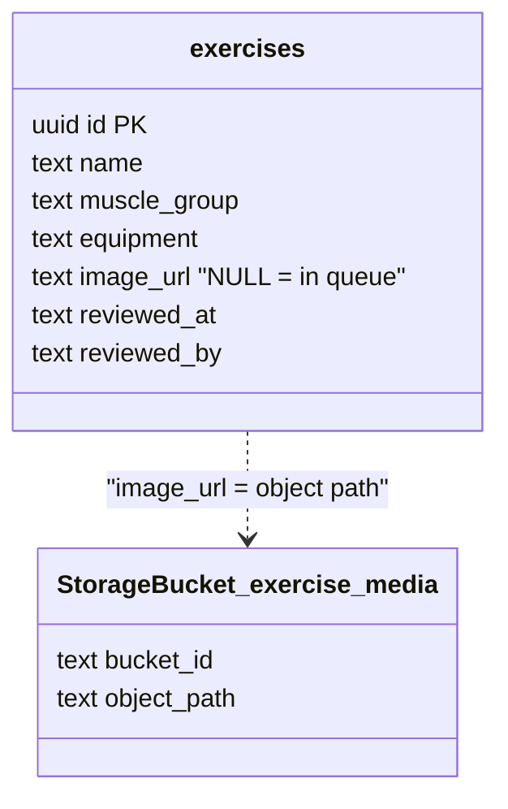
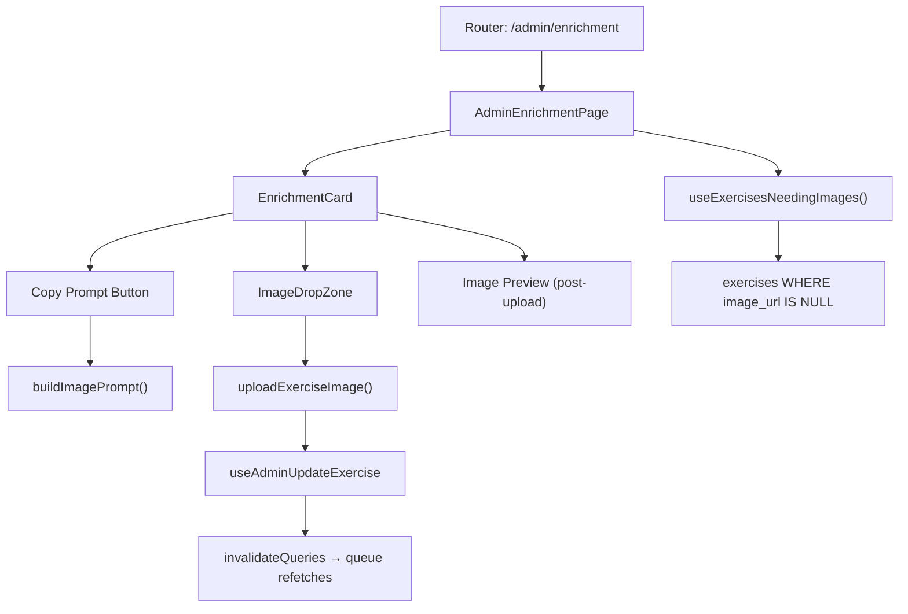

# Tech Plan — Image Enrichment Pipeline

## Architectural Approach

### Key Decisions

| Decision | Choice | Rationale |
|---|---|---|
| UX pattern | Single-card queue — always show the first exercise where `image_url IS NULL` | Focused, linear workflow; no cognitive overhead of a table. Uploading an image removes it from the result set, naturally advancing the queue. |
| Filter mechanism | PostgREST `WHERE image_url IS NULL ORDER BY muscle_group, name` | No new column, no RPC. `image_url IS NULL` *is* the queue. Simple, zero state to sync. |
| Upload | Reuse `uploadExerciseImage` from `file:src/lib/imageUpload.ts` | Already handles WebP conversion, 512px resize, kebab naming, `exercise-media` upsert. Zero new storage code. |
| Mutation | Reuse `useAdminUpdateExercise` pattern from `file:src/hooks/useAdminUpdateExercise.ts` | Sets `image_url` + `reviewed_at`/`reviewed_by`, invalidates cache. After mutation, the queue query refetches and the processed exercise disappears. |
| Prompt template | Pure function `buildImagePrompt(name: string): string` in `file:src/lib/imagePrompt.ts` | Easy to tweak without touching UI code. Deterministic output from exercise name. |
| Drag & drop | Native HTML5 drag & drop + `<input type="file">` fallback, auto-upload on drop | No extra dependency. Drop zone is ~40 lines; auto-upload minimizes friction for bulk work. |
| Queue advancement | Always render exercise at index 0 of the query result | On successful upload, mutation invalidates `exercises-needing-images` query key → refetch → previously-first exercise now has an image → new first exercise is the "next" one. No explicit index state needed. |
| Loading all ~520 | Single query, no pagination | ~520 rows × ~10 columns is <100KB. Admin-only, not performance-sensitive. A remaining count provides progress feedback. |

### Critical Constraints

**No schema changes.** The queue is derived from `image_url IS NULL` — no new columns, no flags. Every exercise stays in the queue until it gets an image.

**Prompt is in French.** The template mirrors the existing workflow: `"Crée une illustration simple style SVG d'un exercice de fitness {name}. No text, only the illustration."` Images are generated externally; prompt language doesn't affect the app.

**Image processing happens client-side** via the existing `optimizeImage()` in `file:src/lib/imageUpload.ts` (OffscreenCanvas → WebP, max 512px, 82% quality). The admin generates images externally (ChatGPT/Midjourney/etc.), downloads them, and drops them here.

**Cache coherence.** The mutation invalidates `["exercises-needing-images"]`, `["admin-exercises"]`, and `["exercise-library-paginated"]`. The card queue is driven by the first query key; the other two keep the admin exercises table and public library in sync.

---

## Data Model

No schema changes. The pipeline reads and writes existing columns on the `exercises` table.



### Table Notes

**exercises.image_url** — relative path in the `exercise-media` bucket (e.g. `alternating-biceps-curls-with-dumbbell.webp`). `NULL` means the exercise is in the enrichment queue. `getExerciseImageUrl()` in `file:src/lib/storage.ts` builds the full public URL.

---

## Component Architecture

### Layer Overview



### New Files & Responsibilities

| File | Purpose |
|---|---|
| `src/pages/AdminEnrichmentPage.tsx` | Page shell: title, progress counter ("X remaining"), renders `EnrichmentCard` for the first exercise in the queue, empty state when done. |
| `src/components/admin/enrichment/EnrichmentCard.tsx` | Card displaying exercise name, muscle group, equipment, emoji. Contains copy-prompt button + `ImageDropZone`. Handles the upload→mutation flow. |
| `src/components/admin/enrichment/ImageDropZone.tsx` | Drag & drop target + file input fallback. Accepts image files, auto-uploads on drop. Visual states: idle, drag-over, uploading, success. |
| `src/hooks/useExercisesNeedingImages.ts` | React Query hook: `SELECT * FROM exercises WHERE image_url IS NULL ORDER BY muscle_group, name`. Query key: `["exercises-needing-images"]`. |
| `src/lib/imagePrompt.ts` | `buildImagePrompt(name: string): string` — returns the standardized French prompt for AI image generation. |

### Component Responsibilities

**`AdminEnrichmentPage`**
- Calls `useExercisesNeedingImages()` to get the queue.
- Renders a progress counter: `{total - remaining} / {total}` (total captured on first load via `useRef`).
- Passes `exercises[0]` to `EnrichmentCard`.
- Shows an empty/done state when the queue is empty.
- Linked from `AdminHomePage` and `SideDrawer`.

**`EnrichmentCard`**
- Displays exercise metadata: emoji, name, muscle group, equipment.
- "Copy Prompt" button: calls `buildImagePrompt(exercise.name)`, writes to clipboard via `navigator.clipboard.writeText()`, shows toast via sonner.
- Contains `ImageDropZone`; on file drop, calls `uploadExerciseImage(file, exercise.name)` then `useAdminUpdateExercise` to set `image_url` to the returned filename.
- Shows a brief success toast before the queue auto-advances (query invalidation replaces the card content).
- Loading/spinner state during upload + mutation.

**`ImageDropZone`**
- Renders a dashed-border drop target with icon + label.
- Handles `onDragOver`, `onDragLeave`, `onDrop` for visual feedback.
- Hidden `<input type="file" accept="image/*">` triggered on click.
- Auto-uploads immediately on file selection (no preview/confirm step).
- Exposes `onFileSelected(file: File)` callback.

**`buildImagePrompt(name: string)`**
- Returns: `"Crée une illustration simple style SVG d'un exercice de fitness ${name}. No text, only the illustration. Le résultat doit être optimisé pour le web (webp et moins de 500 kb)."`

### Wiring: Router + Navigation

**Router** — add to the existing `AdminGuard` children in `file:src/router/index.tsx`:

```typescript
{ path: "/admin/enrichment", element: <AdminEnrichmentPage /> }
```

**AdminHomePage** — add a button linking to `/admin/enrichment` alongside the existing exercises/feedback links in `file:src/pages/AdminHomePage.tsx`.

**SideDrawer** — add a link under the Admin collapsible in `file:src/components/SideDrawer.tsx`.

**i18n** — add keys to `file:src/locales/en/admin.json` and `file:src/locales/fr/admin.json` for the page title, descriptions, button labels, empty state, and toast messages.

### Failure Mode Analysis

| Failure | Behavior |
|---|---|
| Upload fails (Supabase Storage error) | Toast error, card stays on current exercise, user can retry. No state change. |
| Mutation fails (DB update error) | Toast error, uploaded file is orphaned in storage (acceptable — next upload upserts same filename). Card stays. |
| Clipboard write fails (permissions) | Fallback: show the prompt text in a toast so it's at least visible and selectable. |
| User drops non-image file | `ImageDropZone` validates `file.type.startsWith("image/")`, rejects with toast. |
| Queue is empty on first load | Empty state: "All exercises have images" with a link back to `/admin`. |
| Two tabs open on same page | Both show same first exercise. If tab A uploads, tab B refetches on window focus (React Query default). `upsert: true` prevents storage conflicts. |
| Filename collision (same slug from different names) | `exercises.name` has UNIQUE constraint, so `toKebabCase(name)` produces unique slugs. Safe. |
