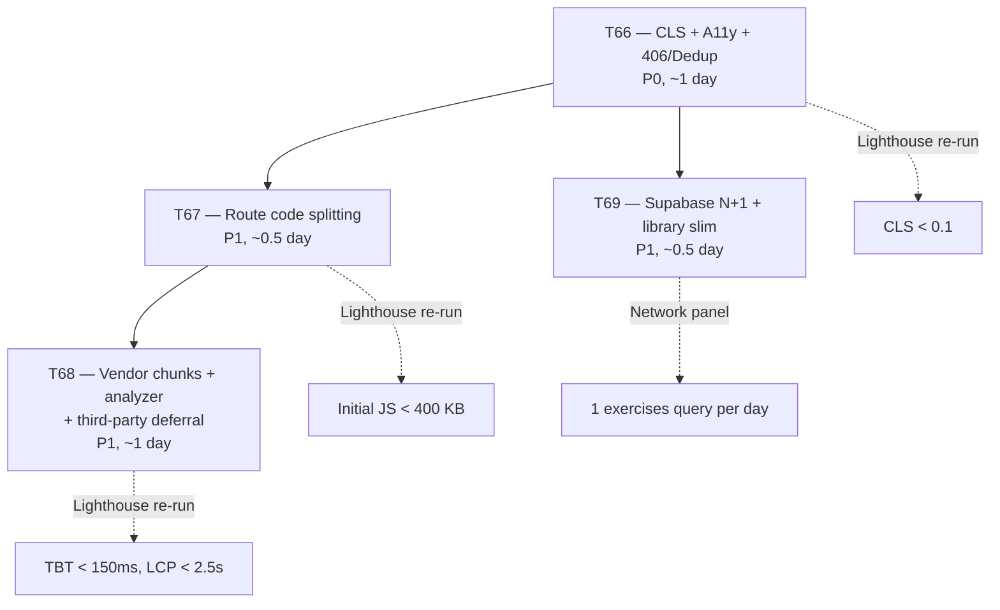
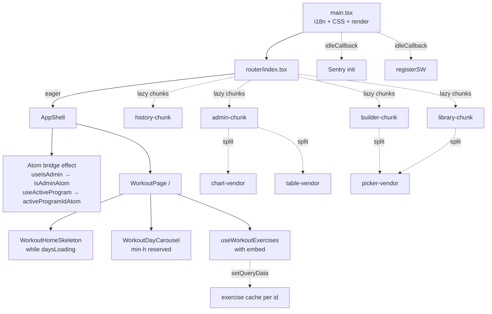

# Tech Plan — Lighthouse: CLS, LCP, Supabase payload & 406 errors (#104)

## Architectural Approach

Systematically attack four independent bottlenecks revealed by Lighthouse (mobile, simulated 3G) on production (`workout-app-ypsilon.vercel.app`): **layout stability**, **first-load JS**, **Supabase network chatter**, and **auth-bootstrap correctness**. Four sequential sub-tickets, each one PR, each independently shippable and verifiable via a Lighthouse re-run.

Baseline (from the issue): FCP ~3.5s, LCP ~5.4s, **CLS 0.84**, TBT ~160ms, Performance score ~0.46.
Targets: **CLS < 0.1**, **LCP < 2.5s**, no console errors (including Supabase 406s), reduced first-load JS, reduced Supabase round-trips.

### Key Decisions

| Decision | Choice | Rationale |
|---|---|---|
| Rollout structure | 4 sub-tickets (T66–T69), one PR each, priority order | Shipping the full scope as one PR is unreviewable; each ticket targets a different metric so verification is clean. |
| Ordering | T66 CLS → T67 splitting → T68 vendor chunks + deferral → T69 Supabase N+1 | CLS first because it's the smallest, safest, most visible improvement. Route splitting next — it's the largest LCP lever. Vendor chunking after because it depends on lazy boundaries existing. |
| CLS fix strategy | Full layout skeleton matching carousel + exercise list + cycle progress header; measured `min-h-*` on carousel root and card's BodyMap slot | Spinner-to-layout swap in `file:src/pages/WorkoutPage.tsx` is the primary shift source. Matching skeleton + reserved heights eliminates ~0.82 of the 0.84 CLS. |
| Pager dots animation | Replace width animation with `transform: scaleX` indicator inside `min-w-6 min-h-6` tap target + `aria-label` | Non-composited → GPU-composited. Fixes a11y (tap target + accessible name) in one change. |
| Card shadow animation | Replace `transition-shadow` on `box-shadow` with pre-painted `ring-2` + opacity transition | `box-shadow` is non-composited; `opacity` is. Zero visual regression. |
| 406 / duplicate auth fix | Delete imperative `checkAdminStatus` + `checkProgramStatus` from `file:src/lib/supabase.ts`; use TanStack Query hooks (`useIsAdmin`, existing `useActiveProgram`) | React Query dedupes, retries, and respects `gcTime`. Eliminates the `getSession + SIGNED_IN` double-fire. `.maybeSingle()` removes 406s for zero-row cases. |
| Atom migration approach | Bridge hooks → existing atoms (`isAdminAtom`, `activeProgramIdAtom`) via a small `AppShell` effect. Delete atoms in a follow-up pass | Minimum diff for T66; full atom deletion touches too many readers and belongs to its own refactor. |
| Route-level code splitting | `React.lazy` for `/admin/*`, `/history`, `/library/*`, `/builder/*`, `/cycle-summary`, `/achievements`, `/account`, `/about`, `/privacy`, `/oauth/consent`. Keep eager: `/`, `/login`, `/onboarding`, `/create-program` + `AppShell` + guards | Preserves fast first paint on the logged-in home. Admin pays chunk cost on first nav (acceptable — single admin user). |
| Vendor chunk splitting | Manual `rollupOptions.output.manualChunks` grouping: `recharts` → chart-vendor; `cmdk + vaul` → picker-vendor; `@tanstack/react-table` → table-vendor; `@radix-ui/*` → radix-vendor; `@supabase/*` → supabase-vendor | Prevents lazy chunks from duplicating vendor code; keeps cold cache shareable across routes. |
| Bundle analyzer | Add `rollup-plugin-visualizer` gated behind `ANALYZE=true` env + `build:analyze` script | Zero cost in normal builds (plugin only loaded under the flag). Gives reviewers concrete before/after evidence. |
| Third-party deferral | Move `initSentry()` and `listenForSwUpdate()` into `requestIdleCallback` (with `setTimeout(2000)` fallback for Safari) after `createRoot().render()` | Sentry + SW register currently block module-top pre-render. Moving to idle reclaims ~100–200ms TBT. |
| Supabase N+1 | Add `exercise:exercises(...)` embed to `useWorkoutExercises`; seed per-id cache via `queryClient.setQueryData`; keep snapshot fields as fallback | One round-trip per day, RLS-safe (exercises is user-readable). Eliminates parallel `id=eq…` storm. |
| `useExerciseLibrary` payload | Slim `select('*')` to enumerated columns (no `instructions`, `youtube_url`, `secondary_muscles`, `source`, `reviewed_*`). Rich fields land via `useExerciseById` on detail open | Cuts the 161 KB catalog fetch by ~60% with zero regression — callers needing rich fields already use `useExerciseById`. |
| PWA `registerSW` | Change `immediate: true` → `immediate: false`; call inside `requestIdleCallback` | SW no longer blocks critical path; existing users keep offline shell from prior cache. `handleVersionUpgrade` keeps forced reload on version mismatch. |

### Critical Constraints

**`file:src/pages/WorkoutPage.tsx` is the LCP-defining surface and lives on the eager `/` route.** Nothing in T67's route-splitting work can introduce a `Suspense` boundary between `AppShell` and `WorkoutPage`, or first paint regresses. Splitting targets only non-root routes.

**The `exercises` table is user-readable** (confirmed via current `useExerciseLibrary` and per-id hooks). Adding `exercise:exercises(*)` embed on `workout_exercises` relies on existing RLS — do not introduce new policies without verification. Fallback: `workout_exercises` rows already carry `name_snapshot` and `emoji_snapshot`.

**`file:src/lib/supabase.ts` lines 38-43 and 59-64** imperatively populate `isAdminAtom` and `activeProgramIdAtom`. Deleting them means every atom reader must either (a) read from the new TanStack hooks directly or (b) keep atoms but hydrate from React Query via an `AppShell` effect. The plan picks (b) for T66 to minimize diff. Known readers: `file:src/components/admin/AdminOnly.tsx`, `file:src/router/AdminGuard.tsx`, `file:src/hooks/useIsAdmin.ts` (becomes the source of truth), `file:src/pages/WorkoutPage.tsx` (reads `activeProgramIdAtom`).

**`WorkoutDayCarousel` content height is not stable today** because each `WorkoutDayCard` fetches its own exercises via `useWorkoutExercises(day.id)` and renders `BodyMap` only after data arrives (`file:src/components/workout/WorkoutDayCard.tsx` lines 78–87). A skeleton on the page-level spinner alone won't fix CLS — the carousel root AND each card's BodyMap slot must both reserve vertical space.

**`file:src/main.tsx` globally imports `react-day-picker/style.css`.** Eligible for scoping to `calendar.tsx`, but non-trivial in Vite. Out of scope for this plan; noted as future optimization.

**`file:src/lib/i18n.ts` bundles all locales at entry.** Deferred optimization; would require react-i18next lazy namespaces. Out of scope.

**Lazy admin routes** change admin UX: first admin nav pays chunk fetch. User is the only admin → acceptable. No prefetch recommended.

---

## Data Model

No schema changes. Query-shape changes only.

### Query shape changes

**Before** — `file:src/hooks/useWorkoutExercises.ts`:

```sql
SELECT * FROM workout_exercises WHERE workout_day_id = :dayId
```

Followed by N parallel `SELECT * FROM exercises WHERE id = :id` via `useExerciseFromLibrary` in each row component.

**After**:

```sql
SELECT *, exercise:exercises(id, name, name_en, emoji, muscle_group, equipment, image_url, instructions, secondary_muscles, difficulty_level)
FROM workout_exercises
WHERE workout_day_id = :dayId
```

One round-trip, embedded join. `instructions` JSONB is kept on this embed because the in-session Instructions panel needs it.

**Before** — `file:src/hooks/useExerciseLibrary.ts`:

```sql
SELECT * FROM exercises ORDER BY muscle_group, name  -- ~161 KB wire
```

**After**:

```sql
SELECT id, name, name_en, emoji, muscle_group, equipment, image_url, difficulty_level, is_system
FROM exercises
ORDER BY muscle_group, name  -- ~60 KB wire
```

Rich fields land via `useExerciseById` on detail open (already existing pattern).

### Type model addition

```typescript
// src/types/exercise.ts (new or existing — confirm)
export type ExerciseListItem = Pick<
  Exercise,
  "id" | "name" | "name_en" | "emoji" | "muscle_group" | "equipment" | "image_url" | "difficulty_level" | "is_system"
>
```

`useExerciseLibrary` returns `ExerciseListItem[]`. Callers needing the rich shape must switch to `useExerciseById`. TypeScript enforces migration.

### Jotai / LocalStorage

No structural changes. `isAdminAtom` and `activeProgramIdAtom` continue to exist but are hydrated by React Query in an `AppShell` effect rather than imperative calls in `file:src/lib/supabase.ts`. Atom deletion deferred to a follow-up.

---

## Component Architecture

### Ticket graph



T66 and T69 are independent; T67 unblocks T68's `manualChunks` config (which assumes lazy routes). T69 can ship parallel to T67/T68 since it only touches hooks.

### Layer Overview (post-refactor)



### New Files & Responsibilities

| File | Purpose | Ticket |
|---|---|---|
| `file:src/components/workout/WorkoutHomeSkeleton.tsx` | Full-page skeleton matching `/` layout: cycle progress bar, carousel placeholders, exercise list rows. Replaces the page-level `Loader2` spinner. | T66 |
| `file:src/components/RouteSkeleton.tsx` | Generic between-route suspense fallback. Minimal loader within `AppShell`'s `<main>`. | T67 |
| `file:src/hooks/useIsAdmin.ts` (rewrite) | TanStack Query hook: `['is-admin', userId]`, `.maybeSingle()`, `staleTime: Infinity`, `refetchOnWindowFocus: false`. | T66 |
| `file:src/types/exercise.ts` (extend) | Add `ExerciseListItem` narrow type. | T69 |

### Modified Files

**T66 — CLS + A11y + 406/Dedup**

| File | Change |
|---|---|
| `file:src/components/workout/WorkoutDayCarousel.tsx` | Add `min-h-[Xpx]` on root `div.space-y-3` (measured from rendered card). Replace pager dots: `<button>` with `min-w-6 min-h-6` wrapper + inner `transform: scaleX` indicator. Add `aria-label="Go to slide {N}"`. |
| `file:src/components/workout/WorkoutDayCard.tsx` | Replace `transition-shadow` + `shadow-lg` active with `ring-2 ring-primary/0` → `ring-primary/60` (opacity transition). Reserve BodyMap slot via fixed `min-h-*` or `aspect-ratio`. |
| `file:src/components/workout/CycleProgressHeader.tsx` | Convert `transition-all` on width to `transform: scaleX` with `transform-origin: left`. |
| `file:src/pages/WorkoutPage.tsx` (~line 923) | Replace spinner with `<WorkoutHomeSkeleton />`. Keep existing `daysLoading` gate. |
| `file:src/lib/supabase.ts` (lines 30–80 region) | **Delete** imperative `checkAdminStatus` + `checkProgramStatus` + the `getSession`/`onAuthStateChange` wiring that calls them. Keep auth subscription that updates Supabase's own state. |
| `file:src/hooks/useIsAdmin.ts` | Rewrite as TanStack Query hook (see above). |
| `file:src/hooks/useActiveProgram.ts` | Swap `.single()` → `.maybeSingle()`; remove PGRST116 branch since `maybeSingle` returns `null`. |
| `file:src/components/AppShell.tsx` | Add effect: `useEffect(() => { setIsAdmin(isAdminQuery.data ?? false); setActiveProgramId(activeProgramQuery.data?.id ?? null) }, [...])`. |
| `file:src/components/workout/ExerciseListPreview.tsx`, `ExerciseEditRowControls.tsx` | Optional: add `content-visibility: auto` with intrinsic size hints (bonus, low risk). |

**T67 — Route Code Splitting**

| File | Change |
|---|---|
| `file:src/router/index.tsx` | Convert static imports → `React.lazy(() => import(...))` for: `HistoryPage`, `BuilderPage`, `LibraryProgramsPage`, `ExerciseLibraryPage`, `ExerciseLibraryExercisePage`, `AccountPage`, `AchievementsPage`, `CycleSummaryPage`, `AdminHomePage`, `AdminExercisesPage`, `AdminExerciseEditPage`, `AdminReviewPage`, `AdminEnrichmentPage`, `AdminFeedbackPage`, `OAuthConsentPage`, `PrivacyPage`, `AboutPage`. Keep eager: `WorkoutPage`, `LoginPage`, `OnboardingPage`, `CreateProgramPage`, `AppShell`, all guards. Wrap lazy routes with `<Suspense fallback={<RouteSkeleton />}>`. |
| `file:src/components/RouteSkeleton.tsx` (new) | Minimal loader state. |

**T68 — Vendor Chunks + Analyzer + Third-party Deferral**

| File | Change |
|---|---|
| `file:vite.config.ts` | Add `build.rollupOptions.output.manualChunks` function grouping recharts, cmdk+vaul, react-table, radix, supabase. Conditionally load `rollup-plugin-visualizer` when `process.env.ANALYZE === 'true'`. |
| `file:package.json` | Add `"build:analyze": "ANALYZE=true vite build"`. Add `rollup-plugin-visualizer` to `devDependencies`. |
| `file:src/main.tsx` | Move `initSentry()` and `listenForSwUpdate()` out of module-top. Call them from a `requestIdleCallback` after `createRoot().render()` (with `setTimeout(2000)` fallback). |
| `file:src/lib/swReloadOnUpdate.ts` | Change `registerSW({ immediate: true, ... })` → `registerSW({ immediate: false, ... })`. |

**T69 — Supabase N+1 + Library Slim**

| File | Change |
|---|---|
| `file:src/hooks/useWorkoutExercises.ts` | Change select to `"*, exercise:exercises(id, name, name_en, emoji, muscle_group, equipment, image_url, instructions, secondary_muscles, difficulty_level)"`. Update return type. After fetch, call `queryClient.setQueryData(['exercise', id], exercise)` for each row so downstream `useExerciseById` hits cache. |
| `file:src/hooks/useExerciseLibrary.ts` | Slim `select('*')` to enumerated columns. Keep `staleTime: 30min` and `queryKey: ['exercise-library']`. Update return type to `ExerciseListItem[]`. |
| `file:src/hooks/useExerciseFromLibrary.ts` | Audit callers. For session/day rows now carrying embedded `exercise`, stop using this hook. For admin/library detail pages (where per-id is legit), keep. |
| `file:src/components/create-program/AIGeneratingStep.tsx` | If generation prompt needs `instructions` / `secondary_muscles`, switch to a dedicated query with the richer shape. Do NOT re-widen the shared library hook. |
| `file:src/hooks/useGenerateProgram.ts` (line ~89) | Replace the loop's per-id `.single()` with a one-shot `.in('id', resolvedIds)` batch via existing `fetchExercisesByIds`. |

### Failure Mode Analysis

| Failure | Behavior | Mitigation |
|---|---|---|
| Skeleton renders but real data is faster than paint | Flash-of-skeleton | Gate skeleton behind 100ms `setTimeout` or accept the brief flash (UX team call) |
| `exercise:exercises(*)` embed fails RLS for a user | Row returns `exercise: null` | Fallback to `name_snapshot`, `emoji_snapshot` already on `workout_exercises` |
| Lazy admin chunk fetch fails (network error) | Route shows error boundary | Existing `ErrorBoundary` in `main.tsx` catches it; user can retry nav |
| `useIsAdmin` re-fetches on window focus | Extra admin probe | Already mitigated: `refetchOnWindowFocus: false` in new hook |
| `manualChunks` groups `recharts` into `chart-vendor` but `WorkoutPage` transitively imports `chart.tsx` | Recharts leaks into main chunk | Lint: `WorkoutPage` and imports must NOT reference `@/components/ui/chart`. Add ESLint rule if leak re-appears |
| Deleting imperative admin/program checks breaks some atom reader | UI shows stale `false` | `AppShell` bridge effect covers the atoms; verify all readers get value from React Query-sourced atom |
| `immediate: false` on SW means tab-for-hours users miss updates | Known existing behavior | `handleVersionUpgrade` in `main.tsx` forces reload on version mismatch — unchanged |
| Third-party deferral skips Sentry init before an early error | Error not captured | Accept: errors in first ~2s are rare; optional `window.addEventListener('error', queueForSentry)` during the gap |
| Slimmer `useExerciseLibrary` breaks a consumer expecting `instructions` | Runtime `undefined` access | TypeScript narrow type (`ExerciseListItem`) flags all offenders at compile time |
| Session-view row loses `instructions` when `exercise` embed is null | Instructions panel empty | `ExerciseInstructionsPanel` already calls `useExerciseById` independently — unchanged |

---

## Stress-Test List

1. **`WorkoutPage` renders before `useActiveProgram` resolves.** Post-T66, the atom is populated via React Query, so there's a first-paint window where `activeProgramId` is `undefined`. `WorkoutPage` must tolerate this — it already does, because program switching clears the atom. Verified in current code.
2. **Wrong `min-h` measurement on `WorkoutDayCarousel`.** Too low → residual CLS; too high → visible gap. Mitigation: put measurement in a CSS custom property (`--card-min-h`) and re-measure after shipping a preview build. Acceptance requires Lighthouse CLS < 0.1.
3. **`exercise:exercises(*)` embed increases per-row payload.** For a 10-exercise day, ~10 KB added to single query vs 10 parallel 1 KB requests. Net win on mobile where TCP setup dominates. Verify on throttled 3G in Lighthouse.
4. **First `/history` visit pays recharts fetch on top of data fetch.** Consumer perception: "slow first time, fast after." Acceptable — history isn't critical path. Optional: hover-prefetch on nav icon if complaints.
5. **Inconsistency with issue body:** issue lists both CLS and fat `select=*` as P0. The plan reorders: CLS → route splitting → vendor → Supabase. Rationale: route splitting is the biggest LCP lever and needs T66's stability work (skeletons) to not introduce new shifts. Called out explicitly.
6. **`manualChunks` over-splitting on HTTP/2.** Too many parallel chunks can hurt on slow networks. Revert path: delete `manualChunks` function, keep analyzer. Two-line revert. Will verify via Lighthouse after T68.
7. **PostHog session replay flag sneaks in later.** Instantly regresses TBT + bundle. Add a PR-reviewer note / CODEOWNERS line on `main.tsx` PostHog config. Out of scope for this plan but worth a follow-up task.
8. **Atom bridge pattern could hide late hydration bugs.** Effect runs after hook resolves; readers observing `isAdmin === false` before hydration could flicker. Mitigation: `isAdminAtom` starts as `undefined` (loading state); readers must treat `undefined` as "not known yet" rather than "not admin". Follow-up deletion will remove the ambiguity.

---

## Acceptance Criteria (plan-level)

- [ ] T66 ships with Lighthouse CLS < 0.1 on `/` mobile (clean profile / incognito).
- [ ] T67 ships with initial JS transfer < 400 KB on `/` mobile.
- [ ] T68 ships with TBT < 150ms and Lighthouse LCP < 2.5s on `/` mobile.
- [ ] T69 ships with at most one `exercises?id=in.(...)` request per day load (verified in DevTools network panel).
- [ ] No Supabase 406 errors in console on cold load after T66.
- [ ] No duplicate `admin_users` or `programs?…is_active=eq.true` requests on login after T66.
- [ ] Follow-up noted: delete `isAdminAtom` and `activeProgramIdAtom`, migrate readers to hooks directly.
- [ ] Follow-up noted: defer i18n locale loading and `react-day-picker` CSS import.

---

## References

- Issue: [#104 — Improve Lighthouse: CLS, LCP, Supabase payload & 406 errors](https://github.com/PierreTsia/workout-app/issues/104)
- Baseline Lighthouse report: attached to issue (mobile, simulated 3G, production URL)
- `file:docs/PRD.md` — tech stack and data model reference
