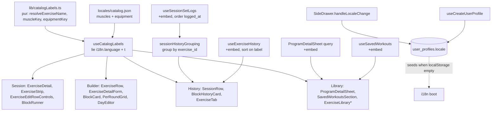
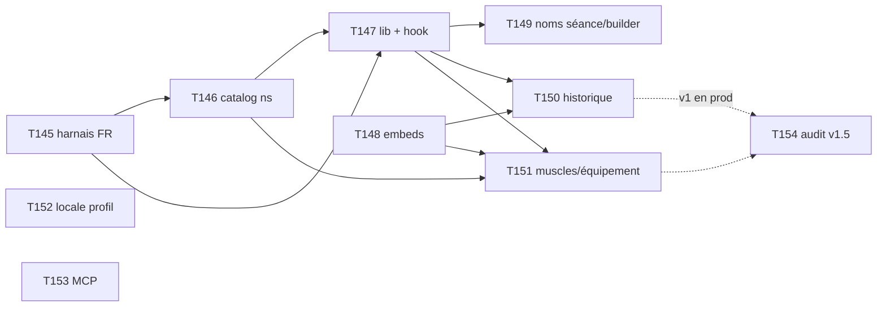

# Tech Plan — Localized Exercise Catalog (#415)

## Architectural Approach

Tout est **résolu à l'affichage** (ADR 0010) : aucune écriture, aucune migration de données, aucun des six chemins de **Catalog Snapshot** n'est touché. La donnée anglaise est déjà sur le fil — `SLIM_EXERCISE_SELECT` et `FULL_EXERCISE_SELECT` embarquent `name_en` (`file:src/lib/exerciseSelects.ts`) et `useWorkoutExercises` joint la ligne catalogue dans la même requête PostgREST que les lignes de séance. La très grande majorité des surfaces est donc **gratuite** : il suffit de lire `row.exercise` au lieu de `row.name_snapshot`.

Le sel vit dans une **lib pure** (`catalogLabels.ts`) enveloppée d'un hook mince, exactement le pattern de `blockCompletionHistory.ts` + `useBlockCompletionHistory` (#396). La logique est testable dans les deux locales sans rendu.

Deux chantiers non-évidents portent le vrai risque : **quatre requêtes** n'ont pas d'embed catalogue et doivent en gagner un, et le **nom snapshoté est porteur de logique** à six endroits (tri SQL, tri client, filtre de recherche, clés React, agrégation body-map, regroupement d'historique) — le remplacer naïvement casserait ces comportements.

### Key Decisions

| Decision | Choice | Rationale |
|---|---|---|
| Moment de résolution | **Affichage**, jamais l'écriture | ADR 0010 — le serveur ignore la locale du lecteur au moment d'écrire un snapshot |
| Forme du helper | Lib pure `file:src/lib/catalogLabels.ts` + hook `useCatalogLabels()` | Mirror de `blockCompletionHistory` / #396 ; cœur testable hors rendu, ergonomie au call site |
| Chaîne de fallback (nom) | `name_en` (si EN et non vide) → `name` → `name_snapshot` | Le snapshot redevient un filet, pas une source |
| Représentation `muscle_group` | **FR canonique inchangé**, traduction à l'affichage | Migration slugs = RPC `get_volume_by_muscle_group`, `TAXONOMY_TO_SLUGS`, `MAJOR_MUSCLE_GROUPS`, alias MCP, scripts d'import, SQL achievements, 20+ fixtures, plus tous les `muscle_snapshot`. Dette tracée en issue séparée |
| Namespace i18n | **Nouveau `catalog.json`** portant `muscles.*` (13) et `equipment.*` (10) | `history:balance.muscles` est history-scoped par accident ; `common` est du chrome, pas de la taxonomie métier |
| Fallback de traduction | **Supprimer `defaultValue: key`** au profit d'un test d'exhaustivité | Le fallback silencieux rend une localisation incomplète invisible à un relecteur francophone |
| Ordre de l'historique | Grouper les solos par `exercise_id`, les ordonner par **premier `logged_at`** | L'ordre réel de la séance, indépendant de la langue ; remplace `ORDER BY exercise_name_snapshot`. Les blocs gardent leur tri par `sortOrder` et la composition « circuits d'abord » de T143 |
| Tri du picker d'historique | `localeCompare` sur le **label résolu**, avec la locale courante | Un combobox alphabétique doit l'être dans la langue du lecteur |
| Persistance de la locale | Colonne `user_profiles.locale` + CHECK, **`localStorage` prioritaire au rendu** | **Display Locale** — boot synchrone préservé, zéro flash sauf appareil neuf |
| Harnais de test | `createTestI18n({ lng })` + ressources FR — **prérequis** | Aujourd'hui EN-only : la story 4 (non-régression FR) est structurellement invérifiable |
| MCP | Les deux noms, **aucune locale** | Pas de lecture de profil, donc pas de nouvelle surface d'auth en v1 |

### Critical Constraints

**Quatre requêtes n'ont pas d'embed catalogue.** Elles portent `exercise_id` mais pas la ligne `exercises`, donc résoudre y coûte un changement de requête :

| Requête | Select actuel |
|---|---|
| `file:src/hooks/useSessionSetLogs.ts` | `select("*")` sur `set_logs` |
| `file:src/hooks/useExerciseHistory.ts` | `select("exercise_id, exercise_name_snapshot")` |
| `file:src/components/library/ProgramDetailSheet.tsx` | `select("*, workout_exercises(*)")` — pas de join `exercises` |
| `file:src/hooks/useSavedWorkouts.ts` | `select("*, workout_exercises(id, name_snapshot, emoji_snapshot, sets, reps, muscle_snapshot)")` |

**Le nom et le muscle snapshotés portent de la logique.** Chacun de ces sites doit basculer sur une clé stable (`exercise_id` ou la valeur canonique FR), **pas** sur le label localisé :

- `file:src/lib/sessionHistoryGrouping.ts` — clé de regroupement (106), `key` React (114), champ `name` (115, 144)
- `file:src/hooks/useSessionSetLogs.ts` — `ORDER BY exercise_name_snapshot` en SQL (13)
- `file:src/hooks/useExerciseHistory.ts` — `a.name.localeCompare(b.name)` (31-32)
- `file:src/components/history/ExerciseTab.tsx` — filtre de recherche sur le nom (32)
- `file:src/components/library/SavedWorkoutsSection.tsx` — `key={m}` sur les badges muscle (103)
- `file:src/lib/muscleMapping.ts` — agrège `ex.name` pour les tooltips body-map (86-108)
- `file:src/components/workout/ExerciseSwapInlinePanel.tsx` — filtre le picker sur `muscle_snapshot` (45)

**La base contient des valeurs de muscle hors taxonomie.** `"Ischios / Bas du dos"`, `"Deltoïdes post."` existent en prod (visibles dans les alias de `file:supabase/functions/mcp/tools/searchExercises.ts`) et `mapMuscleToSlugs` leur renvoie déjà `[]`. Le helper de label doit donc **retomber sur la valeur brute** pour toute clé absente de `MUSCLE_TAXONOMY` — le test d'exhaustivité couvre les 13 valeurs canoniques, pas la totalité de la colonne.

**L'amorçage depuis le profil est asynchrone, le boot i18n est synchrone.** `file:src/lib/i18n.ts` (113-118) lit `localStorage` au chargement du module, avant toute authentification. Le profil ne peut être lu qu'après résolution de l'auth. Sur un appareil **sans** valeur locale, l'app rend donc brièvement en langue navigateur avant bascule. Accepté : c'est exactement le cas où l'on n'a aucune meilleure information, et il ne survient qu'une fois par appareil.

**`MUSCLE_TAXONOMY` est dupliqué.** `file:src/lib/trainingBalance.ts` (6-20) et `file:scripts/audit-muscle-tags.ts` (62-76) définissent les mêmes 13 valeurs. Le test d'exhaustivité s'ancre sur la lib ; le script devrait l'importer plutôt que redéclarer.

---

## Data Model

**Un seul changement de schéma** : une colonne nullable sur `user_profiles`, calquée sur `gender` (CHECK inline) et sur `embedded_agent_threads.locale` (même vocabulaire).

```sql
-- supabase/migrations/<timestamp>_add_locale_to_user_profiles.sql
ALTER TABLE user_profiles
  ADD COLUMN locale text CHECK (locale IN ('en', 'fr'));
```

Nullable et sans défaut **volontairement** : `NULL` signifie « cet utilisateur n'a jamais exprimé de choix », ce qui est distinct de « il a choisi le français ». Un défaut `'fr'` détruirait cette information et ferait basculer en français des anglophones qui n'ont rien demandé. Aucun changement de RLS : la policy `"Users manage own profile"` est `FOR ALL` et couvre déjà toutes les colonnes.

```mermaid
classDiagram
    class UserProfile {
        +string user_id
        +string|null locale
        +string|null timezone
    }
    class CatalogLabelInput {
        +string|null name_en
        +string name
        +string muscle_group
        +string equipment
    }
    class ResolvedLabels {
        +string name
        +string muscle
        +string equipment
    }
    class DisplayLocale {
        +en|fr value
    }
    CatalogLabelInput --> ResolvedLabels : resolveExerciseName()
    DisplayLocale --> ResolvedLabels : t(catalog:muscles.*)
    UserProfile --> DisplayLocale : seeds when localStorage empty
```

### Table Notes

- **`user_profiles.locale`** — écrite à chaque bascule dans `SideDrawer.handleLocaleChange` et amorcée à l'onboarding depuis `i18n.language` (même précédent que `timezone`, capturé silencieusement dans `useCreateUserProfile`). Jamais lue au rendu : elle ne sert qu'à amorcer un appareil dont `readPersistedLocale()` retourne `null`.
- **`catalog.json`** — nouveau namespace, deux tables :

```json
{
  "muscles": { "Pectoraux": "Chest", "Dos": "Back", "…": "…" },
  "equipment": { "barbell": "Barbell", "dumbbell": "Dumbbell", "…": "…" }
}
```

Les clés muscle restent les **chaînes françaises canoniques** (identité en FR, traduction en EN) ; les clés équipement restent les **slugs anglais** de la colonne DB. On déplace `history:balance.muscles` (13 clés) et `builder:equipment` (10 clés) tels quels — trois consommateurs à repointer, aucune valeur modifiée.

- **Aucun snapshot n'est réécrit.** `name_snapshot`, `muscle_snapshot`, `emoji_snapshot`, `exercise_name_snapshot` gardent leur contenu et leur sémantique de filet.

---

## Component Architecture

### Layer Overview



### New Files & Responsibilities

| File | Purpose |
|---|---|
| `src/lib/catalogLabels.ts` | Pur : `resolveExerciseName(source, locale)` appliquant `name_en → name → name_snapshot` ; `muscleLabelKey(value)` et `equipmentLabelKey(slug)` renvoyant la clé i18n ou `null` si hors taxonomie. Aucune dépendance React. |
| `src/lib/catalogLabels.test.ts` | Vitest : chaîne de fallback complète (`name_en` présent / vide / blanc / `null` / ligne catalogue absente), locale FR renvoie toujours `name`, valeur muscle hors taxonomie renvoie la valeur brute. |
| `src/hooks/useCatalogLabels.ts` | Lit `i18n.language` + `t("catalog")` une fois, renvoie `{ exerciseName(row), muscleLabel(value), equipmentLabel(slug) }` liés à la locale courante. |
| `src/locales/en/catalog.json` · `src/locales/fr/catalog.json` | Tables `muscles` (13) et `equipment` (10), déplacées depuis `history` et `builder`. |
| `src/locales/catalogParity.test.ts` | Assère que chaque valeur de `MUSCLE_TAXONOMY` et chaque slug d'équipement possède une clé en **`en` et `fr`**. Fait échouer la CI sur une localisation incomplète. |
| `supabase/migrations/<ts>_add_locale_to_user_profiles.sql` | `ALTER TABLE user_profiles ADD COLUMN locale text CHECK (locale IN ('en','fr'));` |

### Modified Files

| File | Change |
|---|---|
| `src/test/utils.tsx` | `createTestI18n({ lng })` + import des 20 namespaces FR — **prérequis de tout le reste** |
| `src/hooks/useSessionSetLogs.ts` | Embed `exercise:exercises(...)` ; `.order("logged_at").order("set_number")` remplace `.order("exercise_name_snapshot")` |
| `src/lib/sessionHistoryGrouping.ts` | Solos regroupés sur `exercise_id` (plus sur le nom consécutif) ; `key` React sur `exercise_id` ; solos ordonnés par premier `logged_at`. Blocs et composition « circuits d'abord » inchangés |
| `src/hooks/useExerciseHistory.ts` | Embed catalogue ; dédoublonne sur `exercise_id` ; trie sur le **label résolu** avec la locale |
| `src/components/library/ProgramDetailSheet.tsx` | `workout_exercises(*, exercise:exercises(...))` |
| `src/hooks/useSavedWorkouts.ts` | Ajoute `exercise:exercises(...)` à la projection imbriquée |
| `src/components/library/SavedWorkoutsSection.tsx` | `key` sur la valeur canonique, label traduit à l'affichage |
| `src/components/history/balance/MuscleBreakdownTable.tsx` · `BalanceInsights.tsx` | Repointés sur `catalog:muscles`, `defaultValue: key` retiré |
| `src/components/builder/ExerciseFilterPanel.tsx` | `equipment.*` → `catalog:equipment` ; les pills muscle passent de brut à traduit |
| `src/components/SideDrawer.tsx` | `handleLocaleChange` persiste aussi vers `user_profiles.locale` |
| `src/hooks/useCreateUserProfile.ts` | Amorce `locale` depuis `i18n.language` (parallèle exact de `timezone`) |
| `src/types/onboarding.ts` | `UserProfile.locale: "en" \| "fr" \| null` |
| `src/store/atoms.ts` · `src/lib/i18n.ts` | Réconciliation des défauts contradictoires (`localeAtom` `"fr"` vs `fallbackLng` `"en"`) |
| ~25 surfaces d'affichage | `row.name_snapshot` → `exerciseName(row)` ; `muscle_snapshot` → `muscleLabel(...)` |
| `supabase/functions/mcp/tools/getProgramDetails.ts` · `getUpcomingWorkouts.ts` | Format `**name** (name_en)`, aligné sur `searchExercises` / `resolveExercises` |

### Component Responsibilities

**`catalogLabels.ts`** (pur)
- Ne connaît ni React, ni i18next, ni `localeAtom` — reçoit la locale en paramètre.
- `resolveExerciseName` accepte une forme laxiste (`{ exercise?, name_snapshot? }`) pour servir aussi bien une ligne `workout_exercises` embarquée qu'un `set_log` enrichi.
- Trim systématique : `name_en` vaut `""` ou `"   "` aussi souvent que `null` dans un catalogue édité à la main.

**`useCatalogLabels`**
- Lit `i18n.language` une seule fois par rendu, borne les trois helpers, les mémoïse sur `[language]`.
- Ne déclenche aucune requête : toute la donnée arrive du hook de données appelant.

**`sessionHistoryGrouping`**
- Passe de « groupes consécutifs par nom » à « groupes par `exercise_id` », ordonnés par le premier `logged_at` du groupe. Comportement identique dans le cas courant (le tri SQL par nom fusionnait déjà les répétitions du même exercice) et strictement plus correct quand le catalogue a été renommé entre deux séances.
- **La branche bloc ne bouge pas.** Les groupes de circuit sont déjà triés par `blockSortOrder` — une clé indépendante de la langue — et la fonction rend toujours `[...blocs, ...solos]` (T143). Seul l'ordre *interne* aux solos change ; ne pas en profiter pour fusionner les deux listes par `logged_at`.
- Le `reduce` actuel mute (`last.sets.push`) : la réécriture doit être déclarative, conformément à la règle de style du repo.
- Le commentaire de tête (88-89) affirme que « les logs arrivent triés par `exercise_name_snapshot` » — à réécrire en même temps que le `ORDER BY`.
- Ne résout aucun label : elle expose `exercise` (la ligne jointe) et laisse la couche de rendu appeler `exerciseName`.

**`useCatalogLabels` côté historique**
- `ExerciseTab` filtre et trie sur le label résolu ; le picker doit être alphabétique **dans la langue du lecteur**, contrairement à l'ordre d'une séance qui doit être chronologique.

### Failure Mode Analysis

| Failure | Behavior |
|---|---|
| `name_en` `null`, `""` ou `"   "` | Retombe sur `name` ; invisible pour l'utilisateur |
| Ligne catalogue supprimée (embed `null`) | Retombe sur le **Catalog Snapshot** ; l'historique ne perd jamais son libellé |
| Valeur `muscle_group` hors taxonomie (`"Deltoïdes post."`) | Aucune clé i18n → affichage de la valeur brute ; le test d'exhaustivité ne couvre que les 13 canoniques |
| Clé de traduction manquante pour une valeur canonique | **La CI échoue** (test de parité) — plus de fallback silencieux |
| Appareil neuf, `localStorage` vide, profil `locale = NULL` | Langue navigateur, comme aujourd'hui ; aucune régression |
| Appareil neuf, `localStorage` vide, profil renseigné | Bref rendu en langue navigateur puis bascule ; une fois par appareil, accepté |
| Deux appareils en désaccord | Chacun garde sa langue ; assumé (**Display Locale**) |
| Session hors ligne | Aucune requête supplémentaire : `name_en` voyage déjà dans le payload de `useWorkoutExercises` |
| Historique hors ligne après reload | Déjà non fonctionnel aujourd'hui (pas de persistance React Query) — l'embed ne dégrade rien |
| Écriture profil échoue à la bascule de langue | `localStorage` a déjà gagné : l'UI est correcte, seule la synchro cross-device est perdue. Échec silencieux volontaire, pas de toast |

---

## Migration Path (slugs anglais, plus tard)

Si la dette est un jour payée, `catalogLabels.ts` absorbe le changement sans réécriture des surfaces : `muscleLabelKey` passe de « clé = valeur FR » à « clé = slug », et la table `catalog:muscles` change de clés. Le vrai coût reste ailleurs — migration de `exercises.muscle_group` et de tous les `muscle_snapshot`, réécriture de `TAXONOMY_TO_SLUGS`, des listes SQL de la RPC `get_volume_by_muscle_group`, des alias MCP, des scripts d'import et des fixtures. C'est précisément parce que le helper isole les surfaces que cette migration devient un chantier back-end pur.

---

## Ticket Breakdown

| # | Ticket | Dépend de | Mode |
|---|---|---|---|
| T145 | Dual-locale test harness | — | AFK |
| T146 | `catalog` i18n namespace | T145 | AFK |
| T147 | `catalogLabels` lib + hook | T145, T146 | AFK |
| T148 | Catalog embeds on lagging queries | — | AFK |
| T149 | Exercise names on session & builder | T147 | AFK |
| T150 | History grouping on `exercise_id` | T147, T148 | AFK |
| T151 | Muscle & equipment labels | T146, T147, T148 | **HITL** |
| T152 | Persist locale on user profile | — | AFK |
| T153 | MCP bilingual exercise names | — | AFK |
| T154 | *(v1.5)* English resolution audit script | v1 en production | AFK |



**Trois chantiers indépendants** démarrent en parallèle : T145 (qui débloque tout l'axe affichage), T148 (données) et T152/T153 (persistance et MCP, sans intersection avec le reste). Le chemin critique est **T145 → T146 → T147 → T151**.

T145 est le seul goulot réel : tant qu'il n'est pas livré, aucun ticket ne peut prouver la story 4 (non-régression FR), qui est la condition de sécurité de l'epic entier.

---

## References

- Epic Brief : `file:docs/Epic_Brief_—_Localized_Exercise_Catalog_#415.md`
- ADR : `file:docs/adr/0010-localize-catalog-at-display-time.md`
- Glossaire (**Catalog Snapshot**, **Display Locale**) : `file:docs/CONTEXT.md`
- Issue epic : [#422](https://github.com/PierreTsia/workout-app/issues/422) ; sources : [#415](https://github.com/PierreTsia/workout-app/issues/415), [#417](https://github.com/PierreTsia/workout-app/issues/417) ; PR rejetée : [#416](https://github.com/PierreTsia/workout-app/pull/416)
- Pattern à mirror (lib pure + hook) : `file:src/lib/blockCompletionHistory.ts`, `file:src/hooks/useBlockCompletionHistory.ts`
- Données déjà bilingues : `file:src/lib/exerciseSelects.ts`, `file:src/hooks/useWorkoutExercises.ts`
- Contraintes à ne pas casser : `file:src/lib/muscleMapping.ts`, `file:src/lib/trainingBalance.ts`, `file:src/lib/generatorConfig.ts`
- Précédents de migration : `file:supabase/migrations/20260314000010_add_gender_to_user_profiles.sql`, `file:supabase/migrations/20260508155713_create_embedded_agent_threads.sql`
- Harnais de test : `file:src/test/utils.tsx`
