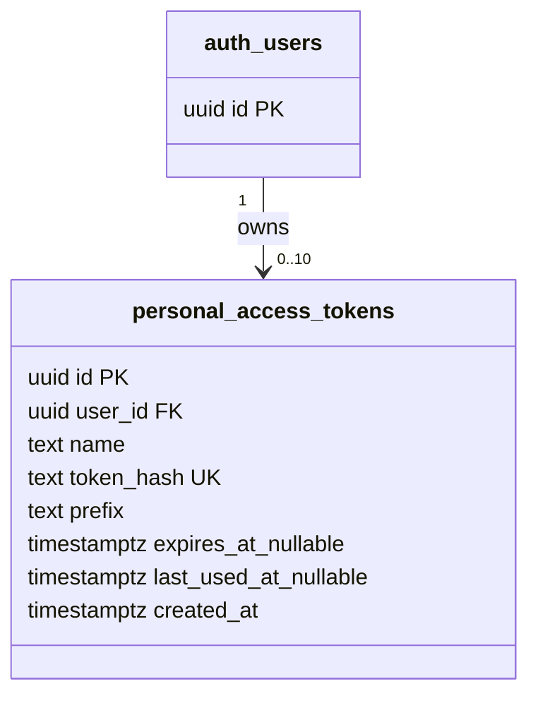
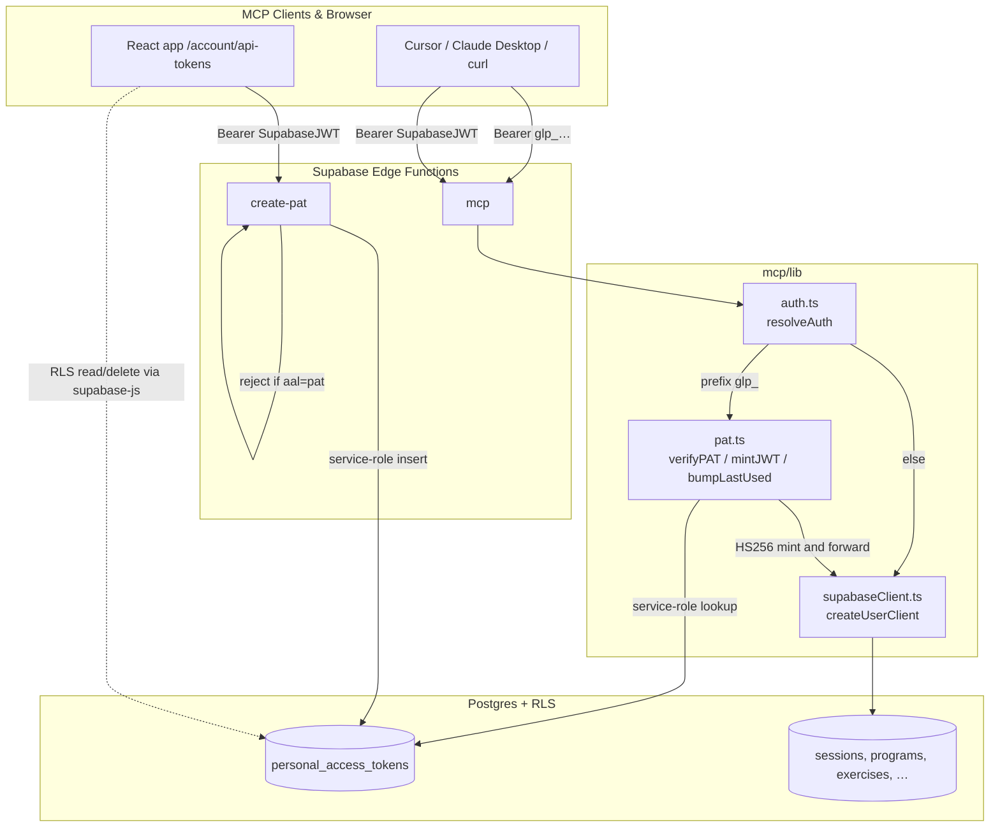

# Tech Plan — Long-Lived MCP Auth via Personal Access Tokens

> Source brief: `file:docs/Epic_Brief_—_Long-Lived_MCP_Auth_via_Personal_Access_Tokens.md`. This plan resolves the open RLS-strategy and Settings-UI questions left open by the brief, with one explicit veto (see Key Decisions, "PAT → Supabase context").

## Architectural Approach

### Key Decisions

| Decision | Choice | Rationale |
|---|---|---|
| **Auth resolution** | New `file:supabase/functions/mcp/lib/auth.ts` with `resolveAuth(authHeader)` that branches on `glp_` prefix | Single point of branching. PAT path → service-role lookup + JWT mint; OAuth path → unchanged. Tools never see the difference. |
| **PAT → Supabase context** | Edge Function mints a 5-min HS256 JWT signed with **the project's JWT signing secret** (same value Supabase Auth uses), exposed to the function via the `PAT_JWT_SECRET` env var | **Vetoes the brief's "dedicated `MCP_PAT_JWT_SECRET`" leaning.** PostgREST validates incoming JWTs with the project signing key — a separately-keyed JWT cannot be validated without JWKS, which we don't run. The "dedicated secret = isolated blast radius" framing was security theater: the Edge Function already holds `SUPABASE_SERVICE_ROLE_KEY` (full RLS bypass), so the ability to forge user JWTs adds no real privilege. We use the env var name `PAT_JWT_SECRET` (not `SUPABASE_JWT_SECRET`) because the Supabase CLI rejects any custom secret prefixed `SUPABASE_`; the value is identical, only the handle differs. |
| **AAL claim on internal JWT** | Internal mint adds `aal: 'pat'` claim | Lets `create-pat` reject PAT-authenticated callers (defends against PAT-from-PAT escalation as a static property of the code, not just of the call graph). |
| **Token format** | `glp_` + 32 chars from base58 alphabet (excludes `0/O/1/l/I`) | ~187 bits entropy. Copy-paste-safe. Prefix `glp_` is the discriminator for the auth router. |
| **Hashing** | HMAC-SHA-256 with a server-side pepper (env var `PAT_PEPPER`) | Constant-time, no lib needed (Web Crypto API). Mirrors the HMAC pattern in `file:supabase/functions/_shared/unsubscribeToken.ts`. Pepper is mostly belt-and-suspenders given 187-bit entropy. |
| **Hash storage** | Single `token_hash text not null unique` column, hex-encoded (64 chars) | Indexed unique. Lookup by `token_hash` directly — no prefix matching needed at the auth path. |
| **Prefix UX column** | `prefix text not null` stores first 8 chars of plaintext (e.g. `glp_4Hxz`) | UI displays "starts with `glp_4Hxz…`" so the user can correlate after the one-time secret display. Not part of any lookup. |
| **Revocation** | Hard delete (already locked in the brief) | No `revoked_at` column — kills the `WHERE revoked_at IS NULL` footgun class. |
| **`last_used_at` debounce** | Stateless write-if-stale: `UPDATE … WHERE last_used_at IS NULL OR last_used_at < now() - interval '1 minute'` | No in-memory state, no Redis, no cold-start data loss. Fire-and-forget; failure logged but doesn't block auth. |
| **JWT signing lib** | `npm:jose@5` | Battle-tested, types, supports HS256 trivially. ~5 KB gzip. First npm dep on the MCP function (currently only `esm.sh/@supabase/supabase-js@2`). If cold start regresses past `< 3s p95`, fall back to manual HS256 with Web Crypto. |
| **Token gen + hashing primitives** | Web Crypto API directly (`crypto.subtle.sign`, `crypto.getRandomValues`) | Already-Deno-native, no dep. |
| **Create flow** | New Edge Function `file:supabase/functions/create-pat/index.ts` (not a Postgres RPC) | The pepper lives only in Edge Function env. Putting it in DB defeats the purpose of peppering; putting it in the browser leaks it. RPC ruled out for the same reason. |
| **Read / list / revoke** | Direct Supabase queries from the browser (RLS enforces) | No Edge Function needed for these — the browser-session JWT is sufficient and RLS does the right thing. |
| **Settings UI placement** | `/account/api-tokens` sub-route under existing `/account` | The codebase has no `/settings/*` route precedent (single `/account` page in `file:src/pages/AccountPage.tsx`). Extending the `/account` IA avoids inventing a new top-level structure. |
| **Quota enforcement** | App-level in `create-pat`: `select count(*) … >= 10` reject | Cap = 10 active PATs / user. Easy to relax. Non-transactional check accepted (race could allow 11-12 — soft cap, not a security boundary). |
| **Mandatory naming** | `name text NOT NULL` + `unique (user_id, name)` | Listing stays readable; prevents accidental "untitled" rows. |
| **Lifetimes** | App-level in `create-pat`: pick from `30 / 90 / 365 / null`, default 90; UI warns on `null` | DB stores `expires_at timestamptz NULL`. |

### Critical Constraints

**The MCP function does not change tool signatures.** All five existing tools and `create_program` (six total) keep receiving a `SupabaseClient` from `createUserClient(authHeader)`. The auth refactor is hidden behind `resolveAuth` — tool code in `file:supabase/functions/mcp/tools/*.ts` is untouched. See `file:supabase/functions/mcp/index.ts:62-69` for the dispatch site.

**`PAT_JWT_SECRET` must be set on the MCP and `create-pat` Edge Function envs.** Its value is the project's JWT secret (Dashboard > Project Settings > API > JWT Settings > JWT Secret). It is **not** auto-injected — `SUPABASE_JWT_SECRET` is not part of the Supabase Edge runtime defaults, and the CLI blocks the `SUPABASE_` prefix on custom secrets, hence the renamed handle.

**`PAT_PEPPER` is treated as immutable for the life of v0.** Rotating it invalidates every existing PAT (every stored hash becomes unverifiable). This is by design but must be documented; equivalent to "rotate the JWT secret = log everyone out". v1 may add a per-token salt if rotation becomes a real need.

**`create-pat` rejects PAT-authenticated callers via `aal: 'pat'` check.** No current code path forwards a PAT-derived JWT to `create-pat`, but the static check makes the no-escalation invariant a property of the code rather than the call graph.

**Cold-start budget.** Adding `npm:jose@5` brings the first npm dep onto MCP. Acceptable risk: if the `< 3s p95` target from Epic #231 regresses in production, swap to a ~60-line manual HS256 implementation using `crypto.subtle.sign(HMAC)` (same crypto, worse DX).

**Postgres timestamp comparison drift is a non-issue.** All time checks (`expires_at > now()`, `last_used_at < now() - interval '1 minute'`) evaluate server-side. The 5-min internal JWT TTL is generous (typical clock drift < 5s) — no clock-sync gymnastics required.

---

## Data Model

### Schema

```sql
-- supabase/migrations/2026MMDDHHMMSS_create_personal_access_tokens.sql

-- !! IMPORTANT — OPERATIONAL INVARIANTS
--
-- 1. PAT_PEPPER (env var on the mcp + create-pat Edge Functions) is the HMAC
--    key used to hash every plaintext token. It is treated as IMMUTABLE for
--    the life of v0. Rotating PAT_PEPPER invalidates every existing token
--    in this table (every stored hash becomes unverifiable). Equivalent to
--    a mass revoke. Do not rotate without preparing users via comms.
--
-- 2. last_used_at is updated by the mcp Edge Function via SERVICE-ROLE
--    client only — there is intentionally NO UPDATE RLS policy below. The
--    `authenticated` role has no UPDATE path on this table. This prevents
--    users from tampering with their own activity timestamps.

create table personal_access_tokens (
  id uuid primary key default gen_random_uuid(),
  user_id uuid not null references auth.users(id) on delete cascade,
  name text not null,
  token_hash text not null,
  prefix text not null,
  expires_at timestamptz,
  last_used_at timestamptz,
  created_at timestamptz not null default now(),

  unique (token_hash),
  unique (user_id, name)
);

create index idx_pat_user_id on personal_access_tokens (user_id);

alter table personal_access_tokens enable row level security;

create policy "users read own tokens"
  on personal_access_tokens for select
  using (auth.uid() = user_id);

create policy "users insert own tokens"
  on personal_access_tokens for insert
  with check (auth.uid() = user_id);

create policy "users delete own tokens"
  on personal_access_tokens for delete
  using (auth.uid() = user_id);

-- Intentionally no UPDATE policy. See invariant (2) above.
```

### Mermaid ER



### Table Notes

- **`token_hash` unique globally**, not just per user. Collision probability with 256-bit HMAC is cryptographically zero — the constraint doubles as a sanity check + lookup index.
- **`(user_id, name)` unique** prevents naming collisions for the same user. Cross-user collisions are fine. Hard delete frees the constraint immediately, so revoke + re-create with the same name (e.g. "Cursor laptop") works as expected.
- **No UPDATE RLS policy by design — service-role bypass is the only write path for `last_used_at`.** `authenticated` role has zero UPDATE permission on this table. The MCP function's `bumpLastUsedIfStale` call uses `SUPABASE_SERVICE_ROLE_KEY` (which bypasses RLS) for that single column update. Users can't tamper with their own activity timestamps — relevant if we ever add anomaly detection. **If you ever need a user-writable column on this table, add an explicit UPDATE policy with a `WITH CHECK` constraint scoped to that column only — don't open the door wider than necessary.**
- **`ON DELETE CASCADE` from `auth.users`.** Account deletion automatically purges all PATs.
- **`PAT_PEPPER` is operationally immutable.** See the inline migration comment. Rotating it invalidates every row's `token_hash`. v0 ships with this as a documented constraint, not a code-level enforcement.

### Token Format

| Component | Example | Notes |
|---|---|---|
| Plaintext (shown once) | `glp_4HxzKj7nMqRtY2Wp8VbN3CdFgHj5SkLm` | 4-char prefix + 32-char base58 body, alphabet `123456789ABCDEFGHJKLMNPQRSTUVWXYZabcdefghijkmnopqrstuvwxyz` |
| Stored `prefix` | `glp_4Hxz` | First 8 chars only, for UI display |
| Stored `token_hash` | `a3f5…` (64 hex chars) | `HMAC-SHA-256(plaintext, PAT_PEPPER)` over the **full plaintext including the `glp_` prefix** — what the user pastes in their MCP client config is exactly what gets hashed at verify time. No stripping, no canonicalization. |
| Entropy | ~187 bits in body | 32 × log₂(58). Per-user prefix collision (only 4 base58 chars in `prefix` after `glp_`, so 58⁴ ≈ 11M space; with 10 tokens/user, P(collision) ≈ 0). Even if it happens, `name` (mandatory, unique per user) and `created_at` are the real differentiators in the UI. |

### Internal JWT Claims (5-min, signed with `PAT_JWT_SECRET` — value = project JWT secret)

```json
{
  "sub": "<user_id>",
  "role": "authenticated",
  "aud": "authenticated",
  "iss": "<SUPABASE_URL>/auth/v1",
  "iat": 1714200000,
  "exp": 1714200300,
  "aal": "pat"
}
```

The `aal: 'pat'` claim is the only non-standard addition; everything else mirrors a real Supabase Auth token so PostgREST + RLS treat it identically.

---

## Component Architecture

### Layer Overview



### New Files & Responsibilities

| File | Purpose |
|---|---|
| `supabase/functions/mcp/lib/auth.ts` | **New.** `resolveAuth(authHeader)` returns a Supabase client correctly scoped to the user, regardless of bearer flavor. |
| `supabase/functions/mcp/lib/pat.ts` | **New.** `verifyPAT(token)`, `mintInternalJWT(userId)`, `bumpLastUsedIfStale(patId)`. |
| `supabase/functions/_shared/patFormat.ts` | **New.** Shared between `mcp` and `create-pat`: `generatePAT()`, `hashPAT(plaintext, pepper)`, `extractPrefix(plaintext)`. |
| `supabase/functions/create-pat/index.ts` | **New Edge Function.** `POST { name, lifetime_days }` with browser-session JWT → returns `{ token: "glp_…" }` once. Validates `aal !== 'pat'` and quota (≤ 10). |
| `supabase/migrations/2026MMDDHHMMSS_create_personal_access_tokens.sql` | **New migration.** Table + RLS + indexes. |
| `src/pages/AccountApiTokensPage.tsx` | **New page.** List + create + revoke. |
| `src/components/account/CreatePATDialog.tsx` | **New.** Modal: name + lifetime + one-time plaintext display. |
| `src/components/account/PATListItem.tsx` | **New.** Row: name, prefix, created, last used, expires, revoke. |
| `src/lib/api/personalAccessTokens.ts` | **New.** TanStack Query hooks: `useListPATs` (RLS-direct select), `useCreatePAT` (calls `create-pat`), `useRevokePAT` (RLS-direct delete). |
| `src/router/index.tsx` | **Modify.** Add lazy `/account/api-tokens` route. |
| `src/pages/AccountPage.tsx` | **Modify.** Add an "API Tokens" entry pointing to `/account/api-tokens`. |
| `src/locales/{en,fr}/account.json` | **Modify.** New i18n keys. |

### Component Responsibilities

**`resolveAuth(authHeader)` — `mcp/lib/auth.ts`**
- Extracts the bearer string. If it starts with `glp_`, calls `verifyPAT`; on success, mints the internal JWT and returns `createUserClient("Bearer " + jwt)`. Fires `bumpLastUsedIfStale` non-blocking.
- Otherwise, returns `createUserClient(authHeader)` unchanged (existing OAuth path).
- On verification failure: throws an error mapped to `-32000 / 401` in `index.ts`. Zero behavioral change for clients with valid OAuth tokens.

**`verifyPAT(token)` — `mcp/lib/pat.ts`**
- Computes `hashPAT(token, PAT_PEPPER)` over **the full bearer string the client pasted**, including the `glp_` prefix. Same input as at create time → same output. No stripping, no normalization. The function should defensively reject inputs that don't start with `glp_` (return `null` immediately) so that an OAuth JWT misrouted into this function can't be cross-checked against the hash table.
- Service-role: `select id, user_id from personal_access_tokens where token_hash = $1 and (expires_at is null or expires_at > now()) limit 1`.
- Returns `{ patId, userId } | null`.
- **Source-level reminder**: a top-of-file comment in `pat.ts` must restate that `PAT_PEPPER` is operationally immutable and that any rotation invalidates every existing PAT. The migration carries the same warning, but the reminder belongs at the consumer site too — devs reading `pat.ts` to debug a "why is verify failing" issue need to see it.

**`mintInternalJWT(userId)` — `mcp/lib/pat.ts`**
- Web Crypto HS256 + `PAT_JWT_SECRET` (env var holds the project's JWT secret value).
- Sets `sub`, `role`, `aud`, `iss`, `iat`, `exp = iat + 300`, `aal: 'pat'`.
- Returns the compact JWT string.

**`bumpLastUsedIfStale(patId)` — `mcp/lib/pat.ts`**
- Service-role: `update personal_access_tokens set last_used_at = now() where id = $1 and (last_used_at is null or last_used_at < now() - interval '1 minute')`.
- Called without `await` from `resolveAuth` — auth response is not gated on it. Errors are logged via `console.warn`, never rethrown.

**`functions/create-pat/index.ts`**
- POST only; CORS mirrors `mcp/index.ts`.
- **JWT verification — two explicit steps:**
  1. **Signature + expiry**: call `supabase.auth.getUser(jwt)` (this hits GoTrue, which validates the signature against the project signing key and rejects expired tokens). On failure → 401. This step alone proves the JWT is real and current; we never trust raw decode for the signature.
  2. **AAL check**: decode the JWT claims (no need to re-verify the signature, step 1 did) and reject with 403 if `aal === 'pat'`. This blocks any PAT-derived JWT (which our internal `mintInternalJWT` always tags) from minting more PATs.
- Body: `{ name: string, lifetime_days: number | null }`. Validate: `name` 1-64 chars, trimmed; `lifetime_days ∈ {30, 90, 365, null}`.
- Quota: `select count(*) from personal_access_tokens where user_id = $userId` — reject 409 if `>= 10`.
- Generate plaintext, hash with `PAT_PEPPER` over the **full plaintext including the `glp_` prefix**, derive `prefix = plaintext.slice(0, 8)`, compute `expires_at`.
- Insert via user-context client (RLS enforces `auth.uid() = user_id`).
- Return `200 { token, prefix, expires_at }`. Plaintext is never logged anywhere — neither in `console.log`, request logs, nor error traces. Errors that would otherwise embed the token must redact it explicitly.
- Unique-name conflict → 409 with a clear error code.

**`AccountApiTokensPage.tsx`**
- Fetches via `useListPATs`. Empty state: "Create your first token" CTA + link to `docs/mcp-connect/api-tokens.md`.
- Lists `PATListItem` rows.
- "Create new token" button opens `CreatePATDialog`.

**`CreatePATDialog.tsx`**
- Form: name (required, validated), lifetime select (30/90/365/never), submit.
- On submit: `useCreatePAT`. Disable form while in flight.
- On success: switch to "one-time display" mode — large monospace block with the plaintext, copy-to-clipboard, unmissable warning ("This is the only time you will see this token. Copy it now.").
- On `never` selection: warn ("Non-expiring tokens are harder to audit. Revisit every 6 months and revoke unused ones.").

**`PATListItem.tsx`**
- Displays: name (primary identifier — mandatory and unique per user), prefix ("starts with `glp_4Hxz…`" — visual confirmation aid, not a unique identifier), created (absolute date, secondary differentiator on the off chance two tokens share a prefix), last-used relative ("Used 3 minutes ago" or "Never used"), expires relative ("Expires in 87 days" or "Never expires"), revoke.
- Revoke: confirm dialog → hard delete via `useRevokePAT`.

### Failure Mode Analysis

| Failure | Behavior |
|---|---|
| User pastes an expired PAT in MCP client | `verifyPAT` returns null → 401 with `WWW-Authenticate` → existing client retry surfaces the error |
| User pastes a revoked (deleted) PAT | Same as above (row gone, lookup misses) |
| User pastes a PAT from a different account | Same as above (hash mismatch) |
| User pastes a malformed `glp_` token | Same as above |
| User pastes an OAuth JWT (existing path) | `resolveAuth` doesn't see `glp_` prefix, falls through to existing JWT path. **Zero change in behavior.** |
| `PAT_JWT_SECRET` env var missing | `mintInternalJWT` throws via `requireEnv`. PAT path 500s. OAuth path unaffected. Caught by deploy smoke tests. |
| `PAT_PEPPER` env var missing | `verifyPAT` throws on hashing. Same blast radius. |
| `bumpLastUsedIfStale` fails (DB blip) | Logged, swallowed. Auth still succeeds. `last_used_at` becomes stale, not catastrophic. |
| Two requests within the same minute | Only the first triggers a write. The second's `WHERE last_used_at < now() - 1 min` predicate evaluates false. Zero contention. |
| User exceeds 10 PATs (race) | Quota check is non-transactional, two concurrent creates *could* squeeze through. Acceptable: cap is product-soft, not security-critical. If we ever care, wrap in `SERIALIZABLE` or use an advisory lock. |
| Authenticated user spams `create-pat` (delete + recreate loop, or quota-bounded create + revoke + create churn) | No app-level rate limit in v0. Mitigations in place: (1) cap of 10 active rows is enforced — the user can only churn within their own quota, no impact on others; (2) Supabase platform applies its default per-IP / per-JWT rate limits at the gateway; (3) each create is a single INSERT + one HMAC compute, no expensive work. If abuse appears in production, add a per-user "create within last minute" check (counts created_at) — defer to v1. |
| Pepper rotated | Every existing PAT becomes unverifiable. Documented as "mass revoke equivalent". v0 ships with the operational note "do not rotate without preparing users". |
| Edge Function compromised | Attacker can mint user JWTs **and** call DB with service-role. The PAT system doesn't widen this — already true today. |
| Postgres compromised (read-only dump) | Attacker has hashes only. With 187-bit entropy + pepper not in the dump, brute force is infeasible. Pepper compromise on top changes nothing — brute force is still infeasible. |
| Internal JWT TTL elapses mid-request | A single MCP request never spans 5 minutes. `resolveAuth` re-mints on every request. |
| `aal: 'pat'` JWT replayed against `create-pat` | Rejected with 403 on every request. |

---

## Implementation Phases

Suggested order for ticket breakdown (final shape decided in `split into tickets`):

1. **Schema + crypto primitives** — migration, `_shared/patFormat.ts`, unit tests for `generatePAT`/`hashPAT`/`extractPrefix`.
2. **PAT auth path in MCP** — `mcp/lib/pat.ts` + `mcp/lib/auth.ts`, swap the call site in `mcp/index.ts`. Manual test with curl + a hand-inserted hash row.
3. **`create-pat` Edge Function** — full create flow, quota check, `aal` rejection, browser-context insert.
4. **Settings UI** — `AccountApiTokensPage` + dialog + list item + i18n + route + entry point in `AccountPage`.
5. **Docs refresh** — new `api-tokens.md` + `headless.md`; rewrite `cursor.md`; update `claude-desktop.md`, `le-chat.md`, Epic Brief #231 Risks row, Tech Plan #231 Auth note.

---

## References

- Source brief: `file:docs/Epic_Brief_—_Long-Lived_MCP_Auth_via_Personal_Access_Tokens.md`
- GitHub issue: [#259](https://github.com/PierreTsia/workout-app/issues/259)
- Epic Brief #231 (the Risks row this work closes): `file:docs/Epic_Brief_—_MCP-First_Architecture_#231.md`
- Tech Plan #231 (current MCP architecture): `file:docs/Tech_Plan_—_MCP-First_Architecture_#231.md`
- HMAC pattern reference (Deno + Web Crypto): `file:supabase/functions/_shared/unsubscribeToken.ts`
- Existing service-role client factory: `file:supabase/functions/_shared/supabase.ts`
- MCP entry point: `file:supabase/functions/mcp/index.ts`
- MCP user-context factory (current): `file:supabase/functions/mcp/lib/supabaseClient.ts`
- Settings IA: `file:src/pages/AccountPage.tsx`, `file:src/router/index.tsx`
- OAuth consent (auth context): `file:src/pages/OAuthConsentPage.tsx`, `file:src/lib/supabase-oauth.ts`
- Migration RLS pattern reference: `file:supabase/migrations/20260314000003_create_user_profiles.sql`
- Supabase auth config: `file:supabase/config.toml` `[auth.oauth_server]`
