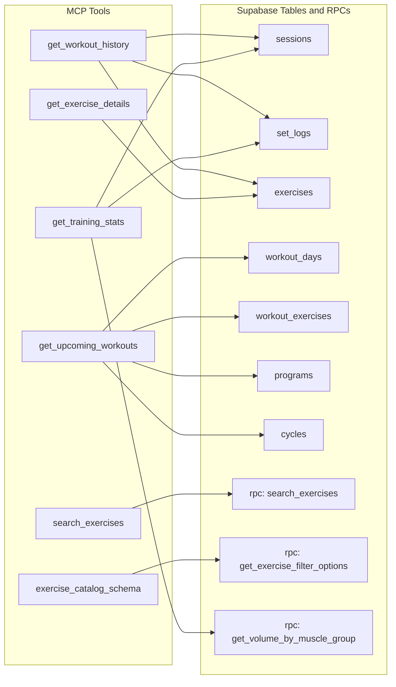
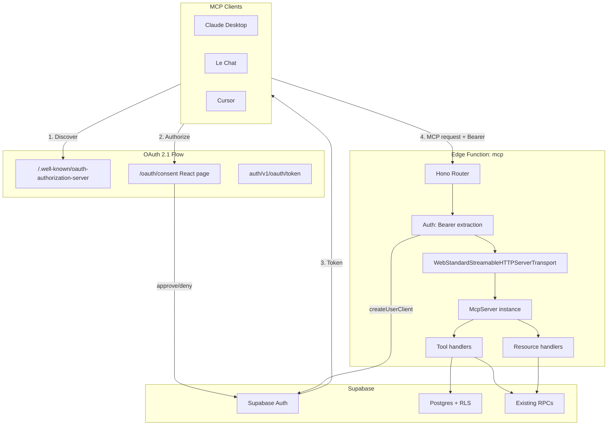

# Tech Plan — MCP-First Architecture (#231)

## Architectural Approach

### Key Decisions

| Decision | Choice | Rationale |
|---|---|---|
| **HTTP framework** | Hono (`npm:hono@^4.9.7`) | Supabase's official MCP guide uses it; handles routing, CORS middleware, and base path cleanly. New dep for functions but justified by the MCP function's complexity. |
| **MCP SDK** | `npm:@modelcontextprotocol/sdk@1.25.3` | Official SDK, Supabase-documented version. `WebStandardStreamableHTTPServerTransport` in **stateless mode** (Edge Functions are stateless). |
| **Input validation** | `npm:zod` | MCP SDK uses Zod natively for `inputSchema` in `registerTool()`. Same library the frontend uses. |
| **Auth** | **Supabase OAuth 2.1 + PKCE** with consent page | MCP clients (Claude Desktop, Le Chat) expect OAuth discovery + authorization flow. Supabase provides this as a built-in Auth feature (beta, free). Requires a consent page in the React app. |
| **Data access** | Reuse existing RPCs + direct Supabase client queries | `search_exercises`, `get_exercise_filter_options`, `get_volume_by_muscle_group` already exist. Direct queries for simple lookups (`exercises` by ID, `sessions` + `set_logs`). All through `createUserClient(authHeader)` for RLS. |
| **Tool output format** | Structured text | LLMs reason better with narrative summaries than raw JSON arrays. Keeps token count manageable, maximizes agent reasoning quality. Can add optional JSON mode later. |
| **Function JWT verification** | `verify_jwt = false` in `config.toml` | Consistent with all existing functions. OAuth 2.1 tokens are validated by the Supabase client when calling `auth.getUser()` or through RLS. |

### Critical Constraints

**OAuth 2.1 is the critical path.** Unlike a simple Bearer-token function, OAuth 2.1 requires: (1) enabling `[auth.oauth_server]` in `config.toml` + Supabase dashboard, (2) building a `/oauth/consent` route in the React app with approve/deny UI, (3) enabling dynamic client registration for MCP clients to self-register. Without this, Claude Desktop and Le Chat cannot connect.

**Consent page is a frontend feature.** The Supabase docs show the consent page lives at `Site URL + authorization_url_path`. For us that's `https://workout-app.vercel.app/oauth/consent`. It uses `supabase.auth.oauth.getAuthorizationDetails()`, `.approveAuthorization()`, and `.denyAuthorization()` — methods available in `@supabase/supabase-js@^2.103.3` (our current version).

**Edge Function import weight.** The MCP function imports Hono + MCP SDK + Zod — heavier than existing functions (which are plain `Deno.serve` + `fetch`). Cold start latency needs monitoring against the `< 3s p95` success criterion. Mitigation: stateless transport (no session state), single function (one cold start).

**Supabase client import pattern.** Existing `file:supabase/functions/_shared/supabase.ts` uses `esm.sh/@supabase/supabase-js@2`. The MCP function can import the same shared module. Hono and MCP SDK use `npm:` prefix imports (Deno's npm compat). Mixing `esm.sh` and `npm:` is fine in Deno.

**RLS applies to all tool queries.** Every query goes through `createUserClient(authHeader)` — the user can only see their own data. Tool outputs must handle "no data" gracefully (new user, no sessions yet, no active program).

---

## Data Model

No new tables. The MCP server reads from existing tables via RLS-scoped queries.



### Tool-to-Query Mapping

| Tool | Data source | Notes |
|---|---|---|
| `get_workout_history` | Direct: `sessions` + `set_logs` + `exercises` join | Filter by date range, optional exercise IDs. Group by session, include exercise names and PR flags. |
| `search_exercises` | RPC: `search_exercises` (pg_trgm + unaccent) | Pass-through with MCP-friendly output formatting. Existing RPC handles fuzzy French/English search. |
| `get_training_stats` | RPC: `get_volume_by_muscle_group` + direct: `sessions`, `set_logs` | Combine volume breakdown, session count, PR detection. Period-scoped. |
| `get_upcoming_workouts` | Direct: `programs` → `cycles` → `workout_days` → `workout_exercises` → `exercises` | Find active program/cycle, determine next workout day, list exercises with prescriptions. |
| `get_exercise_details` | Direct: `exercises` by ID or name lookup | Single row, full metadata including instructions JSONB, media URLs. |
| `exercise_catalog_schema` | RPC: `get_exercise_filter_options` | Muscle groups, equipment types, difficulty levels. Static reference data exposed as MCP Resource. |

---

## Component Architecture

### Layer Overview



### New Files & Responsibilities

| File | Purpose |
|---|---|
| `supabase/functions/mcp/index.ts` | Hono app, McpServer instantiation, tool/resource registration, `Deno.serve` entry |
| `supabase/functions/mcp/tools/getWorkoutHistory.ts` | Tool: query sessions + sets, format as structured text |
| `supabase/functions/mcp/tools/searchExercises.ts` | Tool: wrap `search_exercises` RPC, format results |
| `supabase/functions/mcp/tools/getTrainingStats.ts` | Tool: combine volume RPC + session/PR queries |
| `supabase/functions/mcp/tools/getUpcomingWorkouts.ts` | Tool: active program → next day → exercises |
| `supabase/functions/mcp/tools/getExerciseDetails.ts` | Tool: exercise by ID/name, full metadata |
| `supabase/functions/mcp/resources/exerciseCatalogSchema.ts` | Resource: muscle groups, equipment, difficulty taxonomy |
| `supabase/functions/mcp/lib/supabaseClient.ts` | Extract user Supabase client from Bearer header |
| `supabase/functions/mcp/lib/format.ts` | Shared formatters: dates, weights (kg), sets, session summaries |
| `src/pages/OAuthConsentPage.tsx` | OAuth consent screen: client info, approve/deny |
| `src/router/` (edit existing) | Add `/oauth/consent` route |

### Component Responsibilities

**`mcp/index.ts`**
- Creates Hono app with CORS middleware (reuse `corsHeaders` pattern from `file:supabase/functions/_shared/cors.ts`)
- Instantiates `McpServer({ name: "workout-app", version: "0.1.0" })`
- Imports and calls registration functions from each tool/resource module
- Catch-all route: creates `WebStandardStreamableHTTPServerTransport()` (stateless), connects server, delegates to `transport.handleRequest(c.req.raw)`
- `Deno.serve(app.fetch)` as entry point

**Tool handler pattern** (each file exports a registration function)
- Signature: `(server: McpServer) => void`
- Calls `server.registerTool(name, { title, description, inputSchema }, handler)`
- Handler receives tool arguments + extra context
- Extracts auth header from the MCP request context (Hono injects via middleware or the transport exposes it)
- Creates user-scoped Supabase client via `createUserClient(authHeader)`
- Queries Supabase (RPC or direct), formats response as structured text
- Returns `{ content: [{ type: "text", text }] }`
- Zod schemas define input params with descriptions — these double as the tool's documentation for the agent

**`lib/supabaseClient.ts`**
- Wraps `file:supabase/functions/_shared/supabase.ts` `createUserClient()` pattern
- Accepts Bearer token string, returns typed Supabase client
- Handles missing/invalid auth header with clear error

**`lib/format.ts`**
- `formatSession(session, sets, exercises)` → structured text block per session
- `formatExercise(exercise)` → name, muscle group, equipment, difficulty, instructions summary
- `formatStats(volume, sessions, prs)` → period summary with key metrics
- `formatWeight(kg)` → always kg (app stores kg-only, per PRD)
- `formatDate(date)` → ISO date + relative ("2026-04-15, 4 days ago")

**`OAuthConsentPage.tsx`**
- Reads `authorization_id` from `useSearchParams()`
- If no active Supabase session → redirect to `/login` with return URL preserving `authorization_id`
- Calls `supabase.auth.oauth.getAuthorizationDetails(authorization_id)` to get client name, scopes
- Renders: shadcn `Card` with app icon placeholder, client name, scope list, Approve (`Button` variant primary) and Deny (`Button` variant outline) buttons
- Approve: calls `supabase.auth.oauth.approveAuthorization(authorization_id)` — Supabase handles the redirect back to MCP client
- Deny: calls `supabase.auth.oauth.denyAuthorization(authorization_id)` — MCP client gets `access_denied`
- i18n: add keys to `common` namespace for "Authorize", "Deny", scope labels

### Failure Mode Analysis

| Failure | Behavior |
|---|---|
| Invalid/expired Bearer token | `createUserClient` + query returns auth error. Tool returns MCP error: "Authentication required — please reconnect." |
| User has no sessions | `get_workout_history` returns: "No workout sessions found for this period. Start logging workouts in the app!" |
| No active program | `get_upcoming_workouts` returns: "No active program found. Create one in the Workout Builder." |
| Exercise not found by ID/name | `get_exercise_details` returns MCP error: "Exercise not found. Try search_exercises to find the right one." |
| Edge Function cold start > 3s | MCP clients handle retries. Monitor via Supabase logs. If persistent, evaluate lazy-loading tool modules. |
| OAuth discovery unreachable | Supabase Auth infra issue — outside our control. MCP clients show connection error. |
| User denies consent | `denyAuthorization()` → MCP client gets standard `access_denied` OAuth error. |
| Dynamic client registration disabled | MCP clients that require it fail to connect. Ensure enabled in dashboard + config. |
| RPC returns unexpected shape | Defensive parsing in tool handlers. Log anomaly, return "Unable to retrieve data — please try again." |
| `get_training_stats` query too slow | Split into focused sub-tools if needed (volume, PRs, frequency as separate tools). |

---

## Config Changes

**`supabase/config.toml`** — add:

```toml
[auth.oauth_server]
enabled = true
authorization_url_path = "/oauth/consent"
allow_dynamic_registration = true

[functions.mcp]
verify_jwt = false
```

**Supabase Dashboard** (manual steps):
- Authentication → OAuth Server → Enable OAuth 2.1
- Set authorization URL path to `/oauth/consent`
- Enable dynamic client registration

---

## Implementation Sequence

| Order | Work | Depends on | Estimated effort |
|---|---|---|---|
| 1 | **Scaffold**: `mcp/index.ts` with Hono + McpServer + 1 dummy tool, local test with `supabase functions serve` | Nothing | Small |
| 2 | **Auth plumbing**: `lib/supabaseClient.ts`, Bearer extraction, `createUserClient` | #1 | Small |
| 3 | **Tool: `search_exercises`** — wraps existing RPC, easiest real tool | #2 | Small |
| 4 | **Tool: `get_exercise_details`** — direct query, simple | #2 | Small |
| 5 | **Resource: `exercise_catalog_schema`** — wraps `get_exercise_filter_options` RPC | #2 | Small |
| 6 | **Tool: `get_workout_history`** — complex join, needs `lib/format.ts` | #2 | Medium |
| 7 | **Tool: `get_training_stats`** — combines RPCs + queries, most complex | #2 | Medium |
| 8 | **Tool: `get_upcoming_workouts`** — program/cycle logic | #2 | Medium |
| 9 | **OAuth 2.1 config** — `config.toml` + dashboard setup + local tunnel test | Nothing | Small |
| 10 | **Consent page** — `OAuthConsentPage.tsx` + route + i18n | #9 | Medium |
| 11 | **Smoke test**: MCP Inspector + Cursor via Bearer | #1–8 | — |
| 12 | **Product validation**: Claude Desktop + Le Chat via OAuth | #9–10 | — |

---

## References

- [Epic Brief — MCP-First Architecture (#231)](./Epic_Brief_—_MCP-First_Architecture_#231.md)
- [Supabase BYO MCP guide](https://supabase.com/docs/guides/getting-started/byo-mcp)
- [Supabase OAuth 2.1 — Getting Started](https://supabase.com/docs/guides/auth/oauth-server/getting-started)
- [Supabase MCP Authentication](https://supabase.com/docs/guides/auth/oauth-server/mcp-authentication)
- [MCP TypeScript SDK](https://github.com/modelcontextprotocol/typescript-sdk)
- [GitHub Issue #231](https://github.com/PierreTsia/workout-app/issues/231)
