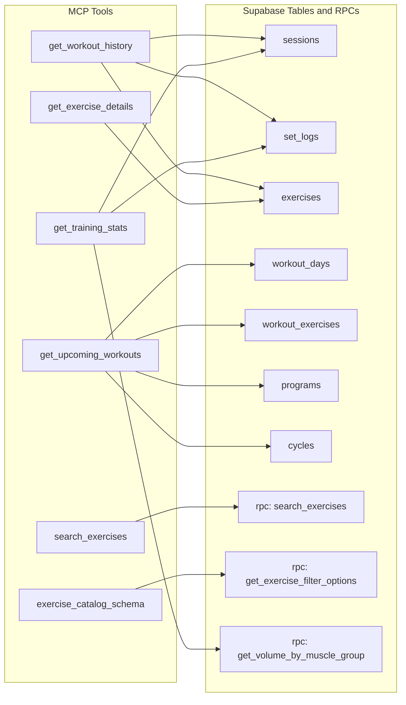
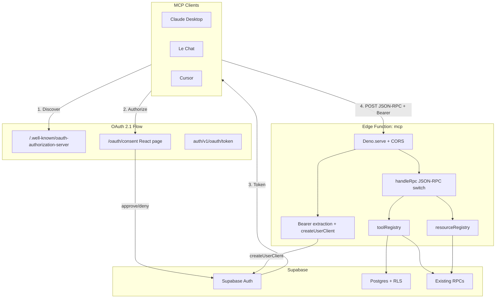

# Tech Plan — MCP-First Architecture (#231)

> **Implementation status**: Phase 1 is implemented. This document has been updated to reflect what was actually built, including architectural pivots made during implementation.

## Architectural Approach

### Key Decisions

| Decision | Choice | Rationale |
|---|---|---|
| **HTTP layer** | Plain `Deno.serve` with manual CORS + JSON-RPC routing | **Pivoted from Hono.** The MCP function only handles POST (JSON-RPC), OPTIONS (CORS), and DELETE (session close). A full HTTP framework added dependency weight and cold start latency for no benefit. |
| **MCP protocol** | Hand-rolled JSON-RPC 2.0 handler | **Pivoted from `@modelcontextprotocol/sdk`.** The SDK's `McpServer` + `WebStandardStreamableHTTPServerTransport` pulled in heavy dependencies and added complexity for what is a thin JSON-RPC dispatcher. A ~120-line `handleRpc` switch handles `initialize`, `tools/list`, `tools/call`, `resources/list`, `resources/read` directly. |
| **Input validation** | Plain JSON Schema objects on tool definitions | **Pivoted from Zod.** Without the MCP SDK there's no `registerTool()` expecting Zod schemas. Tool `inputSchema` is declared as plain JSON Schema — sufficient for MCP client introspection and lighter at runtime. |
| **Tool registration** | Registry pattern: tools are plain objects with `handler` functions, collected in an array | Each tool exports a `ToolDefinition` object. `toolRegistry.list()` strips handlers to expose schemas; `toolRegistry.get(name)` dispatches calls. Same pattern for resources. |
| **Auth** | **Supabase OAuth 2.1 + PKCE** with consent page | Unchanged from plan. MCP clients (Claude Desktop, Le Chat) expect OAuth discovery + authorization flow. |
| **Data access** | Reuse existing RPCs + direct Supabase client queries | Unchanged. All through `createUserClient(authHeader)` for RLS. |
| **Tool output format** | Structured text via shared `lib/format.ts` | Unchanged. LLM-friendly narrative summaries. |
| **Function JWT verification** | `verify_jwt = false` in `config.toml` | Unchanged. OAuth 2.1 tokens validated through RLS. |
| **Anti-spam constraint** | `get_exercise_details` accepts UUID only; `search_exercises` conditionally returns IDs | **Added during implementation.** LLMs were spamming `get_exercise_details` for every search result. Structural fix: IDs are only exposed on single-match results, forcing the agent to disambiguate with the user first. |
| **OAuth type safety** | Typed wrapper module (`src/lib/supabase-oauth.ts`) | **Added during implementation.** `supabase.auth.oauth.*` methods aren't typed in `@supabase/auth-js` yet. A wrapper module isolates the single `any` cast from consumer code. |

### Critical Constraints

**OAuth 2.1 is the critical path.** Unlike a simple Bearer-token function, OAuth 2.1 requires: (1) enabling `[auth.oauth_server]` in `config.toml` + Supabase dashboard, (2) building a `/oauth/consent` route in the React app with approve/deny UI, (3) enabling dynamic client registration for MCP clients to self-register. Without this, Claude Desktop and Le Chat cannot connect.

**Consent page is a frontend feature.** The consent page lives at `Site URL + authorization_url_path` — for us `https://gymlogic.me/oauth/consent`. It uses `supabase.auth.oauth.getAuthorizationDetails()`, `.approveAuthorization()`, and `.denyAuthorization()` via a typed wrapper (`src/lib/supabase-oauth.ts`) since these methods aren't yet typed in `@supabase/auth-js@2.103.3`.

**Edge Function cold start is minimal.** By dropping Hono, MCP SDK, and Zod, the function has zero npm dependencies — only `esm.sh/@supabase/supabase-js@2`. Cold start is well under the `< 3s p95` target.

**Supabase client import pattern.** The MCP function uses `esm.sh/@supabase/supabase-js@2`, consistent with other Edge Functions. No `npm:` prefix imports needed since we dropped the SDK.

**RLS applies to all tool queries.** Every query goes through `createUserClient(authHeader)` — the user can only see their own data. Tool outputs handle "no data" gracefully (new user, no sessions yet, no active program).

---

## Data Model

No new tables. The MCP server reads from existing tables via RLS-scoped queries.



### Tool-to-Query Mapping

| Tool | Data source | Notes |
|---|---|---|
| `get_workout_history` | Direct: `sessions` + `set_logs` + `exercises` join | Filter by date range, optional exercise IDs. Group by session, include exercise names and PR flags. |
| `search_exercises` | RPC: `search_exercises` (pg_trgm + unaccent) | Pass-through with MCP-friendly output formatting. Existing RPC handles fuzzy French/English search. |
| `get_training_stats` | RPC: `get_volume_by_muscle_group` + direct: `sessions`, `set_logs` | Combine volume breakdown, session count, PR detection. Period-scoped. |
| `get_upcoming_workouts` | Direct: `programs` → `cycles` → `workout_days` → `workout_exercises` → `exercises` | Find active program/cycle, determine next workout day, list exercises with prescriptions. |
| `get_exercise_details` | Direct: `exercises` by UUID | Single row, full metadata including instructions JSONB, media URLs. UUID-only to prevent agent spamming. |
| `exercise_catalog_schema` | RPC: `get_exercise_filter_options` | Muscle groups, equipment types, difficulty levels. Static reference data exposed as MCP Resource. |

---

## Component Architecture

### Layer Overview



### Files & Responsibilities

| File | Purpose |
|---|---|
| `supabase/functions/mcp/index.ts` | `Deno.serve` entry, CORS, JSON-RPC 2.0 dispatcher (`handleRpc` switch), batch request support |
| `supabase/functions/mcp/tools/registry.ts` | `ToolDefinition` interface, tool array, `toolRegistry.list()` / `.get()` |
| `supabase/functions/mcp/tools/searchExercises.ts` | Tool: wrap `search_exercises` RPC, fuzzy FR/EN search, conditional ID exposure |
| `supabase/functions/mcp/tools/getExerciseDetails.ts` | Tool: exercise by UUID only (anti-spam), full metadata including instructions and media |
| `supabase/functions/mcp/tools/getWorkoutHistory.ts` | Tool: query sessions + sets, format as structured text |
| `supabase/functions/mcp/tools/getTrainingStats.ts` | Tool: combine `get_volume_by_muscle_group` RPC + PR queries |
| `supabase/functions/mcp/tools/getUpcomingWorkouts.ts` | Tool: active program → current cycle → workout days → exercises |
| `supabase/functions/mcp/resources/registry.ts` | `ResourceDefinition` interface, resource array, `resourceRegistry.list()` / `.get()` |
| `supabase/functions/mcp/resources/exerciseCatalogSchema.ts` | Resource: muscle groups, equipment types, difficulty levels taxonomy |
| `supabase/functions/mcp/lib/supabaseClient.ts` | `createUserClient(authHeader)` — creates RLS-scoped Supabase client from Bearer token |
| `supabase/functions/mcp/lib/format.ts` | Shared formatters: `formatDate`, `formatWeight`, `formatDuration`, `formatSessionSummary`, `formatStatsSummary`, `formatWorkoutDay` |
| `src/pages/OAuthConsentPage.tsx` | OAuth consent screen: client info, scopes, approve/deny |
| `src/lib/supabase-oauth.ts` | Typed wrapper for untyped `supabase.auth.oauth.*` methods |
| `src/router/` (edited) | Added `/oauth/consent` route |

### Component Responsibilities

**`mcp/index.ts`**
- Plain `Deno.serve` — no framework
- Manual CORS headers (same pattern as other Edge Functions)
- JSON-RPC 2.0 dispatcher: `handleRpc(method, params, id, authHeader)` switch on `initialize`, `notifications/initialized`, `tools/list`, `tools/call`, `resources/list`, `resources/read`
- Batch request support (JSON-RPC array)
- `ok()` / `fail()` helpers for JSON-RPC response formatting

**Tool handler pattern** (each file exports a `ToolDefinition` object)
- `name`, `description`, `inputSchema` (plain JSON Schema) for MCP discovery
- `handler(args, supabase)` — receives parsed arguments and an RLS-scoped Supabase client (or `null` if unauthenticated)
- Returns `{ content: [{ type: "text", text }], isError?: boolean }`
- Tool descriptions serve as agent documentation — they include usage instructions and constraints

**Anti-spam pattern** (`search_exercises` + `get_exercise_details`)
- `search_exercises` only includes `exercise_id` in results when there's a **single match**
- `get_exercise_details` only accepts `exercise_id` (UUID) — no name-based lookup
- This forces the agent to disambiguate with the user before fetching details, preventing bulk tool-call loops

**`lib/supabaseClient.ts`**
- Accepts full `Authorization` header string
- Returns Supabase client scoped to the user's JWT via RLS

**`lib/format.ts`**
- `formatDate(iso)` → locale-aware date + relative ("4 days ago")
- `formatWeight(kg)` → always kg (app stores kg-only)
- `formatDuration(seconds)` → human-readable duration
- `formatSessionSummary(session, sets)` → structured text block per session
- `formatStatsSummary(volume, prs)` → period summary with key metrics
- `formatWorkoutDay(day, exercises)` → day name + exercise prescriptions

**`OAuthConsentPage.tsx`**
- Reads `authorization_id` from `useSearchParams()`
- If no active Supabase session → redirect to `/login`
- Uses `supabaseOAuth` wrapper from `src/lib/supabase-oauth.ts` (typed, no `any` in consumer)
- If already consented → auto-redirect (Supabase returns `redirect_to`)
- Renders: shadcn Card with GymLogic branding, client name, scope list (i18n FR/EN), approve/deny buttons
- i18n: keys in `common` namespace for consent page strings

### Failure Mode Analysis

| Failure | Behavior |
|---|---|
| Invalid/expired Bearer token | `createUserClient` + query returns auth error. Tool returns MCP error: "Authentication required — please reconnect." |
| User has no sessions | `get_workout_history` returns: "No workout sessions found for this period. Start logging workouts in the app!" |
| No active program | `get_upcoming_workouts` returns: "No active program found. Create one in the Workout Builder." |
| Exercise not found by ID/name | `get_exercise_details` returns MCP error: "Exercise not found. Try search_exercises to find the right one." |
| Edge Function cold start > 3s | MCP clients handle retries. Monitor via Supabase logs. If persistent, evaluate lazy-loading tool modules. |
| OAuth discovery unreachable | Supabase Auth infra issue — outside our control. MCP clients show connection error. |
| User denies consent | `denyAuthorization()` → MCP client gets standard `access_denied` OAuth error. |
| Dynamic client registration disabled | MCP clients that require it fail to connect. Ensure enabled in dashboard + config. |
| RPC returns unexpected shape | Defensive parsing in tool handlers. Log anomaly, return "Unable to retrieve data — please try again." |
| `get_training_stats` query too slow | Split into focused sub-tools if needed (volume, PRs, frequency as separate tools). |

---

## Config Changes

**`supabase/config.toml`** — add:

```toml
[auth.oauth_server]
enabled = true
authorization_url_path = "/oauth/consent"
allow_dynamic_registration = true

[functions.mcp]
verify_jwt = false
```

**Supabase Dashboard** (manual steps):
- Authentication → OAuth Server → Enable OAuth 2.1
- Set authorization URL path to `/oauth/consent`
- Enable dynamic client registration

---

## Implementation Sequence (as executed)

| Ticket | Work | Status |
|---|---|---|
| **T61** | Scaffold `mcp/index.ts` with `Deno.serve` + JSON-RPC handler + `search_exercises` tool + `lib/supabaseClient.ts` | Done |
| **T62** | `get_exercise_details` tool (UUID-only, anti-spam) + `exercise_catalog_schema` resource + resource registry | Done |
| **T63** | `get_workout_history`, `get_training_stats`, `get_upcoming_workouts` tools + `lib/format.ts` shared formatters | Done |
| **T64** | OAuth 2.1 config (`config.toml` + dashboard) + `OAuthConsentPage.tsx` + route + i18n + `lib/supabase-oauth.ts` typed wrapper | Done |
| **T65** | E2E validation with Claude Desktop + Le Chat via OAuth | Pending (post-merge) |

### Pivots from original plan

| Planned | Actual | Reason |
|---|---|---|
| Hono HTTP framework | Plain `Deno.serve` | Only one route (POST). Framework was unnecessary weight. |
| `@modelcontextprotocol/sdk` McpServer | Hand-rolled JSON-RPC 2.0 switch (~120 LOC) | SDK brought heavy deps for what is a thin dispatcher. |
| Zod input schemas | Plain JSON Schema objects | No SDK means no `registerTool()` expecting Zod. JSON Schema is sufficient for MCP client introspection. |
| `get_exercise_details` accepts ID or name | UUID only | LLMs were spamming the tool for every search result. Structural constraint forces disambiguation. |
| Module augmentation for OAuth types | Wrapper module `lib/supabase-oauth.ts` | `declare module` augmentation conflicted across `@supabase/auth-js` versions in CI. |

---

## References

- [Epic Brief — MCP-First Architecture (#231)](./Epic_Brief_—_MCP-First_Architecture_#231.md)
- [Supabase BYO MCP guide](https://supabase.com/docs/guides/getting-started/byo-mcp)
- [Supabase OAuth 2.1 — Getting Started](https://supabase.com/docs/guides/auth/oauth-server/getting-started)
- [Supabase MCP Authentication](https://supabase.com/docs/guides/auth/oauth-server/mcp-authentication)
- [MCP TypeScript SDK](https://github.com/modelcontextprotocol/typescript-sdk)
- [GitHub Issue #231](https://github.com/PierreTsia/workout-app/issues/231)
