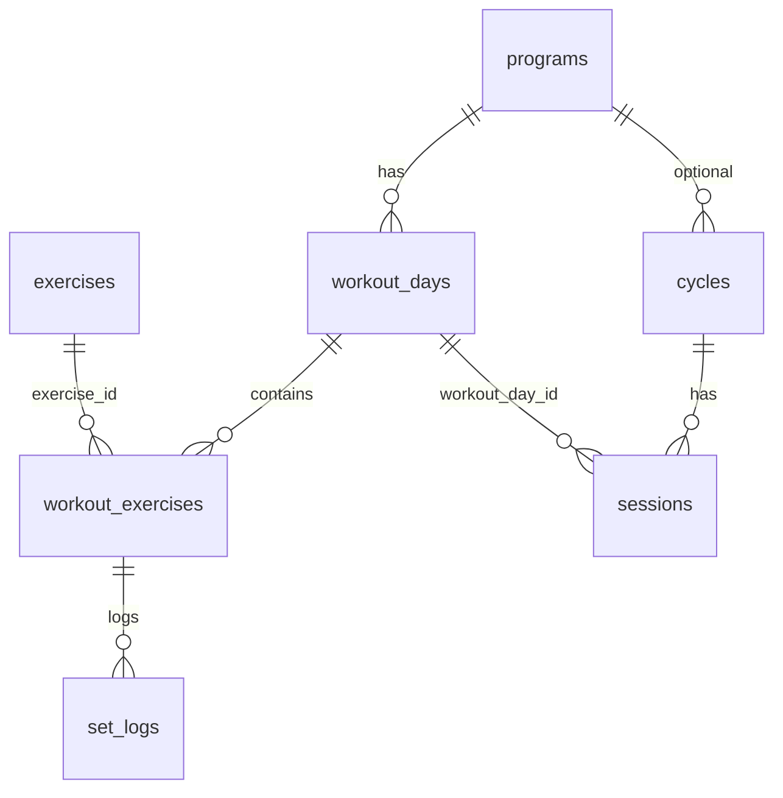
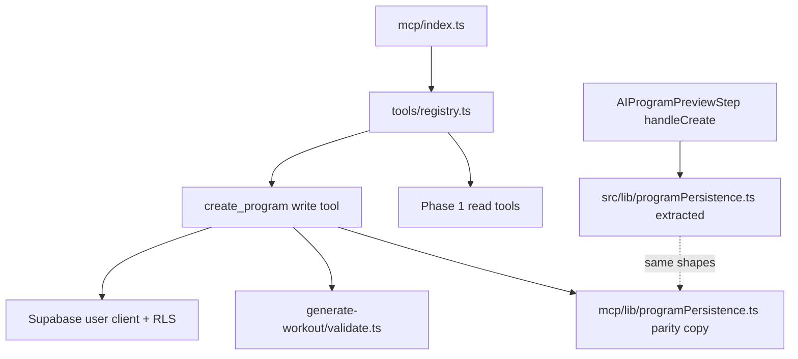

# Tech Plan — MCP-First Architecture (#231) Agent → Save → Gym

This plan **supersedes the earlier framing** of “Phase 2 domain tools + Phase 3 writes” as co-equal goals. The **definition of done** is the closed loop the product cares about:

1. User asks their **external agent** to analyze training data (already: Phase 1 read tools).
2. Agent proposes a **program** (or edits) using conversational reasoning — **expertise lives in the agent**, not in a suite of MCP coaching micro-tools.
3. User confirms; agent calls MCP **writes** that persist the same rows the app would create.
4. User opens **Gymlogic**; the program is **active and trainable** (same `programs` / `workout_days` / `workout_exercises` path as today).

Epic “Phase 2” items (`suggest_progression`, `calculate_1rm`, standalone `get_muscle_balance_report`, etc.) are **deferred** unless they unblock this flow. **Catalog integrity** (valid `exercise_id`s, repair optional) stays in scope as part of **write dry-runs**, not as a separate “coaching API.”

Scope still tracks [#231](https://github.com/PierreTsia/workout-app/issues/231); delivery extends `file:supabase/functions/mcp/` and, where noted, **`file:src/lib/`** for a **pure row-builder** consumed by the React app so MCP and UI do not drift.

**Product constraint:** The **classic in-app SaaS experience** stays the default. MCP (reads and future writes) is **additive** — we do not break or regress flows for users who never connect an agent. Refactors made to support MCP (e.g. shared `programPersistence`) must be **behavior-preserving** for existing UI and tests.

---

## Architectural Approach

**Single MCP Edge Function** (`file:supabase/functions/mcp/index.ts`), tools registered in `file:supabase/functions/mcp/tools/registry.ts`. **RLS** remains the security boundary; **`dry_run` defaults to `true`** so the standard agent pattern is validate → user nod → apply.

**Row parity:** Program creation in the app is implemented in `file:src/components/create-program/AIProgramPreviewStep.tsx` (`handleCreate`): deactivate other active programs → `programs` insert with **`is_active: true`** → per-day `workout_days` → `workout_exercises` inserts with a **fixed set of columns** (snapshots, rep ranges, duration fields, `max_weight_reached`, etc.). MCP **`create_program`** (name TBD: `create_program`, `save_program`, etc.) must produce **the same insert payloads** or users get subtle breakage at the gym.

**Shared builder (strongly recommended in this PR):**

- Extract a **pure** module, e.g. `file:src/lib/programPersistence.ts`, exporting functions such as `buildWorkoutExerciseInsertRows(...)` that map `(Exercise | catalog row, sets, reps, restSeconds, sortOrder) → row object` matching what `AIProgramPreviewStep` builds today.
- Refactor `AIProgramPreviewStep` to use that module (behavior unchanged).
- **MCP:** Deno cannot depend on `file:src/` in deploy; **v1** copy the same logic into `file:supabase/functions/mcp/lib/programPersistence.ts` (or import only if the bundler proves viable — treat copy as default) and add **parity tests**: shared golden fixtures (JSON) asserted from both Vitest and Deno test, or one fixture file under `supabase/functions/mcp/test-fixtures/` consumed by both runners.
- **Follow-up:** a `packages/*` workspace package if a third consumer appears — not required to ship the loop.

**Versioning:** bump `SERVER_INFO.version` in `file:supabase/functions/mcp/index.ts` (e.g. `0.1.0` → `0.2.0`) when write tools ship; **additive** tools/parameters only.

---

### Key Decisions

| Decision | Choice | Rationale |
| --- | --- | --- |
| North-star capability | **`create_program` write tool** (multi-day, mirrors `handleCreate`) | Directly implements “save in my profile, actionable in the app.” |
| Activation | **Match UI:** deactivate other `programs.is_active`, insert new program **`is_active: true`**, set Jotai atoms are client-only — DB active flag is what other devices pick up after refetch | Same behavior as `file:src/components/create-program/AIProgramPreviewStep.tsx` (`handleCreate`, deactivate-then-insert-active program). |
| Standalone Phase 2 tools | **Deferred** (`calculate_1rm`, `suggest_progression`, `get_muscle_balance_report`, public `validate_workout_plan`) | Agent handles reasoning; read stats/history/catalog suffice. |
| Catalog validation | **Inside `create_program` dry_run** (and any other write that accepts exercise IDs): reuse `validateAndRepair` from `file:supabase/functions/generate-workout/validate.ts` where it fits single-day ID lists; for multi-day programs, validate **per day** or flatten then repair with clear semantics in the tool description | Integrity without shipping a separate “coaching” tool. |
| `validateAndRepair` randomness | **Document** in tool description; optional later: deterministic backfill | No silent change to `generate-workout` in this PR. |
| Write guardrails | **`dry_run` default `true`**; **`dry_run: false`** performs commits; strongly discourage apply without a prior dry_run in descriptions | No OAuth substitute for per-mutation intent. |
| Secondary writes | **`log_set` / session edits** — after `create_program` works end-to-end; schema parity with `file:src/lib/syncService.ts` | Smaller surface once program path is proven. |

### Critical Constraints

- **SaaS parity:** No intentional breaking changes to in-app flows to ship MCP; agent features are optional on top.
- **RLS:** `createUserClient` + user JWT only (`file:supabase/functions/mcp/lib/supabaseClient.ts`).
- **Naming:** DB tables are **`programs`**, **`workout_days`**, **`workout_exercises`**, **`sessions`**, **`set_logs`** — not a generic `workout_sessions` alias; align docs and tools with migrations under `file:supabase/migrations/`.
- **Functional style:** new/edited TypeScript follows `file:.cursor/rules/prefer-functional-style.mdc`.

---

## Data Model

End-to-end program persistence (already the app model):

### Table Notes

| Entity | Role in “agent → gym” |
| --- | --- |
| `programs` | One row per saved program; **`is_active: true`** makes it the one the user trains when they start from the library flow (see `AIProgramPreviewStep`). |
| `workout_days` | Ordered days; `program_id`, `label`, `emoji`, `sort_order`. |
| `workout_exercises` | Prescription + snapshots; **must** match the shape built in `AIProgramPreviewStep` so `WorkoutPage` / progression / set logging behave. |
| `cycles` / `sessions` | Created when user **starts** a session from the app — MCP does not need to create these for “program saved”; optional later tool to “start session” is out of scope unless requested. |

---

## Component Architecture

### Layer Overview

### New / Touched Files (indicative)

| File | Purpose |
| --- | --- |
| `src/lib/programPersistence.ts` | **New** — pure builders for `workout_exercises` rows (+ helpers for day/program defaults). |
| `src/components/create-program/AIProgramPreviewStep.tsx` | **Refactor** — call `programPersistence` instead of inline row mapping. |
| `supabase/functions/mcp/lib/programPersistence.ts` | **New** — Deno-side copy (or shared import if proven) + parity with `src/lib`. |
| `supabase/functions/mcp/tools/createProgram.ts` | **New** — MCP tool: input schema for `name`, `days: [{ label, exercise_ids: [] }]` or richer structure; dry_run returns resolved rows + validation summary. |
| `supabase/functions/mcp/tools/registry.ts` | Register `create_program`; add secondary tools when ready. |

### `create_program` tool (behavior sketch)

- **Input (conceptual):** program `name`; ordered `days`, each with `label` and list of **`exercise_id`** (UUID) plus optional overrides (sets, reps, rest) — start strict (minimal overrides) to reduce schema explosion; extend additively later.
- **Dry run:** resolve each ID against `exercises` (RLS); run validation/repair per day if spec allows; return **exact insert payloads** (programs, workout_days, workout_exercises) and warnings (`repaired`, unknown IDs dropped, etc.).
- **Apply:** same validation; then run the **same sequence as `handleCreate`** (deactivate others → insert program → days → exercises). Return `program_id` and day IDs.
- **Optional follow-up tools:** `replace_day_exercises`, `append_program_day` — only if product needs incremental edits without full replace.

### Failure Mode Analysis

| Failure | Behavior |
| --- | --- |
| Unknown `exercise_id` | Dry run fails or returns repaired list — **document** whether repair is automatic on apply or hard-fail. |
| RLS denies catalog row | Treat as “not found” for that user; do not leak existence. |
| Partial apply (program inserted, day fails) | Use transactional RPC **or** document best-effort + manual cleanup; prefer **DB transaction** (single RPC) if multi-step inserts become a reliability issue — flag as implementation spike. |
| Client stale `activeProgramId` | Server `is_active` is source of truth; app refetch fixes; mention in MCP success message for the user. |

---

## Tool Surface (target after this PR)

**Minimum viable loop**

| Name | Type | Notes |
| --- | --- | --- |
| *(existing five read tools)* | Read | unchanged |
| `create_program` | Write | **Primary**; dry_run / apply |
| `exercise_catalog_schema` | Resource | unchanged |

**Discovery:** 6 tools + 1 resource (until secondary writes land).

**Deferred (epic Phase 2 style, re-open only if product demands)**

- `calculate_1rm`, `suggest_progression`, `get_muscle_balance_report`, standalone `validate_workout_plan`
- `log_set`, `add_exercise_to_session`, quick single-day `create_workout` — **after** `create_program` E2E is green

---

## Implementation Order

1. **Extract** `file:src/lib/programPersistence.ts` + refactor `AIProgramPreviewStep` (no behavior change; run existing flows manually).
2. **Port + parity tests** for MCP `programPersistence` + fixture alignment.
3. **`create_program`**: dry_run path, then apply path; wire `validateAndRepair` where single flat ID list applies; multi-day validation spec in tool description.
4. **Manual E2E** — extend `file:docs/mcp-connect/*.md`: agent analyzes → proposes days + IDs → dry_run → apply → open app → start workout from new program.
5. **Semver + tool descriptions** — bump server version; describe dry_run/apply clearly for LLMs.

---

## Out of Scope (this PR)

- Deprecating `generate-workout` / `generate-program` (Phase 4).
- New OAuth scopes.
- Service-role / admin tools.
- Standalone “coaching” MCP tools unless they unblock writes.

---

## References

- `file:docs/Epic_Brief_—_MCP-First_Architecture_#231.md`
- `file:src/components/create-program/AIProgramPreviewStep.tsx`
- `file:supabase/functions/mcp/index.ts`
- `file:supabase/functions/generate-workout/validate.ts`
- GitHub issue [#231](https://github.com/PierreTsia/workout-app/issues/231)
