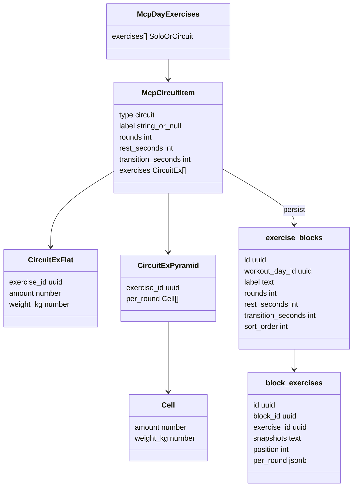
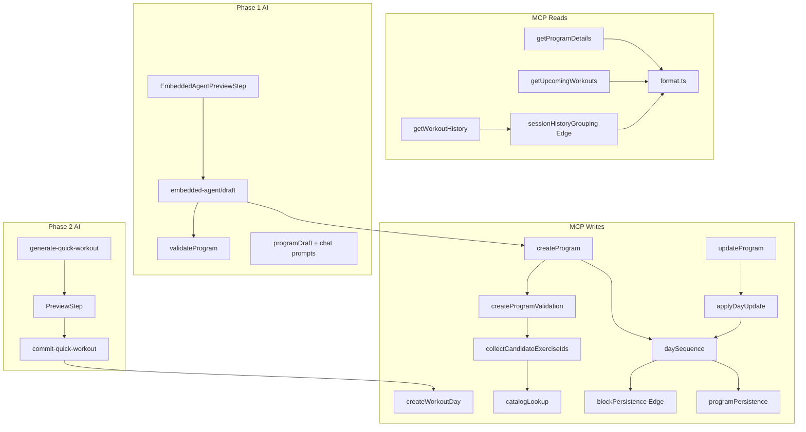

# Tech Plan — MCP & AI Circuits

## Architectural Approach

Pas de migration schéma : `exercise_blocks` / `block_exercises` existent. Le travail est un **contrat MCP additif** (ADR 0011) + ports Edge des builders/grouping in-app + enseignement des LLMs draft/QW.

Pattern établi : `file:supabase/functions/mcp/lib/programPersistence.ts` est un port Deno de la logique web — on fait pareil pour les blocks (`blockPersistence` Edge) et pour `sessionHistoryGrouping`. Zéro import `src/` depuis Deno.

Ordre de build forcé par les dépendances :
1. Parse + validate + persist (writes) — sans ça les reads echo-ready et le draft sont du vent
2. Reads + formatters (details JSON fence, upcoming, history groupé)
3. Skill / mcp-connect docs
4. Program draft LLM + prompts + preview Embedded Agent
5. Phase 2 Quick Workout reshape

### Key Decisions

| Decision | Choice | Rationale |
|---|---|---|
| Wire surface | 3ᵉ variant `type: "circuit"` dans `exercises[]` | ADR 0011 |
| Parse interne | `ParsedDayItem` avec `kind: "circuit"` (à côté de `bare` / `object`) | Aligné discriminant existant |
| Persistence Edge | Port `mcp/lib/blockPersistence.ts` + helpers `perRound` | Miroir `programPersistence` |
| Day replace | DELETE `workout_exercises` **puis** `exercise_blocks` (CASCADE children), puis INSERT sequence | Corrige l'orphaning ; séquentiel per-day comme aujourd'hui |
| Mid-persist after wipe | **Accepter** le même risque que les solos (pas de RPC v1) ; documenter + tests | Atomicité per-day déjà le modèle `update_program` |
| sort_order | Index 0..n-1 dans `exercises[]` (solos + circuits) | **Unified Day Sequence** |
| Echo-ready details | Markdown + fenced ` ```json ` payload patch-shaped | Additif ; round-trip pyramides |
| Skill round-trip rule | Pour `update_program`, repartir du **bloc JSON** de `get_program_details`, pas du markdown seul | Évite drift pyramides / transition |
| Wipe atomicity | Séquentiel dans `applyDayUpdate` / `daySequence` (pas de RPC) | Même modèle partial-success per-day |
| Draft LLM | Schema + `validateProgram` mixtes ; map → MCP | Pas de post-processeur qui invente des Circuits |
| Preview EA | `rendered` MCP Circuit-aware + PreviewBody args mixtes ; copy **items** (solos + circuits) | Stories 16–18 ; compteur honnête |
| History MCP | Port logique `groupSessionHistory` ; select `block_exercise_id` ; circuits avant solos | Pas de CCT/PB ; aligné UI |
| QW | Phase 2 : day-items contract | ADR 0011 |
| Validators | Garder `validateProgram` ≠ `createProgramValidation` | Jobs distincts ; étendre les deux |
| Rollout | Ungated | Revert prompts si qualité pourrie |

### Critical Constraints

**Wipe actuel est dangereux.** `file:supabase/functions/mcp/lib/applyDayUpdate.ts` DELETE seulement `workout_exercises`. Ship Circuit writes sans wipe blocks = Circuits fantômes après update.

**`collectCandidateExerciseIds`** (`file:supabase/functions/mcp/lib/exerciseConversion.ts`) ne lit que top-level `.exercise_id` — sans descente nested, catalog miss → échec persist / IDs Circuit ignorés.

**`validateProgram`** (`file:supabase/functions/_shared/programDraft.ts`) assume listes UUID plates + unicité globale — casse complexes (même exo 2× dans un Circuit) et ne compte pas un Circuit comme 1 slot.

**`last_preview` / Preview.** `buildLastPreview` stocke `args` + `rendered[]` lines depuis dry_run MCP (`file:supabase/functions/embedded-agent/draft.ts`). Il faut : (1) `create_program` dry_run émette des lines Circuit (compact/expand ADR 0011), (2) `DraftArgs.exercises` accepte des objects circuit, (3) `file:src/components/embedded-agent/EmbeddedAgentPreviewStep.tsx` rende/compte correctement — aujourd'hui `sum(exercises.length)` + i18n “exercises” ; basculer vers **items** avec breakdown solos/circuits.

**Caps.** Program 40 items/jour ; QW / `create_workout_day` 20 ; Circuit = 1 item ; nested 2–8 ; rounds [1,10] ; rest/transition [0,600] ; amount reps [1,50] / duration [5,600] ; weight_kg [0,500].

**Naming.** Wire/docs/skill : "Circuit" ; tables/code : block. Jamais "block" dans tool descriptions user-facing.

**Deux schemas LLM draft** (Gemini + Groq dans `file:supabase/functions/_shared/programGemini.ts` / `programGroq.ts`) doivent rester en lockstep — tests de parity schema.

---

## Data Model

Pas de nouvelles tables. Mapping wire → DB :



### Table Notes

- Wire `weight_kg` → DB cell `weight` à la frontière persist.
- Flat path → `per_round` length=`rounds` (propagate, défauts `file:src/lib/blockPersistence.ts`).
- `per_round.length === rounds` : invariant app (pas de CHECK DB) — validator MCP l'enforce.
- Solo `workout_exercises` inchangé (progression columns).
- Day DELETE (`update_program` remove day) : CASCADE existant sur blocks OK.
- Reject : champs solo (`sets`, `reps`, per-exo `rest_seconds`) sur Circuit ; flat + `per_round` simultanés.

### Parsed types (Edge)

```ts
type ParsedDayItem =
  | { kind: "bare"; exerciseId: string }
  | {
      kind: "object"
      exerciseId: string
      sets: number
      reps: string
      weightKg: number
      restSeconds: number
      targetDurationSeconds: number | null
    }
  | {
      kind: "circuit"
      label: string | null
      rounds: number
      restSeconds: number
      transitionSeconds: number
      exercises: ParsedCircuitExercise[]
    }

type ParsedCircuitExercise =
  | { mode: "flat"; exerciseId: string; amount: number; weightKg: number }
  | {
      mode: "per_round"
      exerciseId: string
      perRound: { amount: number; weightKg: number }[]
    }
```

Rename conceptuel : aujourd'hui `ParsedExercise` → élargir en `ParsedDayItem` (ou union étendue sous le même export pour limiter le churn d'imports).

---

## Component Architecture

### Layer Overview



### New Files & Responsibilities

| File | Purpose |
|---|---|
| `file:supabase/functions/mcp/lib/blockPersistence.ts` | Defaults Builder, build `exercise_blocks` + `block_exercises` insert rows, `weight_kg`→`weight`, propagate flat→`per_round` |
| `file:supabase/functions/mcp/lib/daySequence.ts` | Wipe solos+blocks d'un jour, insert **Unified Day Sequence** (sort_order = index) — partagé create_* + `applyDayUpdate` |
| `file:supabase/functions/mcp/lib/sessionHistoryGrouping.ts` | Port Deno de `file:src/lib/sessionHistoryGrouping.ts` (circuits avant solos, round-major) |
| `file:supabase/functions/mcp/lib/blockPersistence_test.ts` (et cousins) | Deno tests TDD — parity avec defaults web |
| Extensions in-place | `createProgramValidation.ts`, `exerciseConversion.ts`, `format.ts`, trois write tools, trois read tools, tool `inputSchema` oneOf |
| Draft / prompts | `_shared/programDraft.ts`, `programGemini.ts`, `programGroq.ts`, `embedded-agent/draft.ts`, `prompt/onboarding.ts`, `prompt/additional-program.ts` |
| Preview PWA | `file:src/components/embedded-agent/EmbeddedAgentPreviewStep.tsx` (+ i18n items breakdown) |
| Docs | `file:skills/gymlogic-mcp/SKILL.md`, `file:docs/mcp-connect/*` |
| Phase 2 | `generate-quick-workout/*`, `file:src/components/generator/PreviewStep.tsx`, `file:src/lib/quickWorkout.ts`, `commit-quick-workout` |

### Component Responsibilities

**`createProgramValidation` (étendu)**
- Discriminate `type === "circuit"` avant parse solo-object (sinon échec “missing exercise_id”).
- Reject solo fields on circuit ; reject flat+`per_round` ; defaults rounds/rest/transition/label ; bounds ADR 0011.
- Post-catalog : `amount` selon `measurement_type` ; bodyweight `weight_kg=0`.
- Cap jour : un Circuit = 1 slot (40 / 20).

**`collectCandidateExerciseIds`**
- Descendre dans `exercises[]` des **MCP Circuit Items**.

**`daySequence` / `applyDayUpdate`**
- Preflight : tous les IDs (solos + nested) ∈ catalog — **jamais DELETE si reinsert impossible**.
- DELETE `workout_exercises` WHERE day ; DELETE `exercise_blocks` WHERE day.
- INSERT solos via `buildWorkoutExerciseInsertRowsForDay` ; blocks via `blockPersistence` ; `sort_order` = index dans le tableau validé.

**`format.ts`**
- Preview Circuit adaptatif (compact si flat homogène ; expand round-par-round si pyramide).
- `get_program_details` : markdown humain + fence JSON echo-ready (`days` avec `id`/`label`/`exercises` mixtes UUID|solo object|circuit).
- Upcoming : Circuits dans le rendu jour.
- History : format round-major post-grouping.

**Read tools**
- Details / upcoming : embed `exercise_blocks(..., block_exercises(..., exercises(name, name_en)))`, merge avec solos par `sort_order`.
- History : select `block_exercise_id` (+ meta join) ; orphan → solo fallback.

**Program draft (Phase 1)**
- Schemas Gemini/Groq : day items mixtes.
- `validateProgram` : repair-aware circuits ; **pas** d'unicité globale à l'intérieur d'un Circuit ; slot counting.
- `draft.ts` : map → MCP `exercises[]` (plus seulement `string[]`).
- Prompts chat : onboarding conservateur ; additional-program proactif (patterns).
- `buildProgramPrompt` : règles Circuit + frozen prescription disclaimer une fois.
- Preview : rendered lines Circuit + i18n items (Y solos, Z circuits).

**Skill / docs**
- Shape wire, when-to-propose, never “block”, progression mention×1, **round-trip via JSON fence**.
- Example prompts FR/EN (finisher, pyramide, update echo).

**Phase 2 Quick Workout**
- Remplacer contrat `exerciseIds[]` par day-items (solos prescrits + Circuits).
- `validateAndRepair`, PreviewStep cards Circuit, map → `create_workout_day`.
- Prompts : quand émettre un Circuit (conditioning / explicit).

### Failure Mode Analysis

| Failure | Behavior |
|---|---|
| Agent envoie `sets`/`reps` dans Circuit | Reject structuré (pointe shape natif) |
| flat + `per_round` | Reject |
| `per_round.length !== rounds` | Reject |
| Catalog miss nested ID | Fail **before** DELETE — jour intact |
| INSERT fails after DELETE | Jour partiellement vide — accepté v1 (status quo solos) ; create_* garde compensating delete day |
| Agent update depuis markdown seul | Drift — mitigé par règle skill JSON fence |
| `validateProgram` strip duplicate IDs in circuit | Complexe cassé — tests dédiés anti-régression |
| Preview “N exercises” trompeur | i18n items + breakdown |
| Block deleted, logs orphelins | Solo fallback en history MCP (comme app) |
| Schema Gemini ≠ Groq | Tests parity ; CI rouge |

---

## Suggested ticket cut (informal — `split-tickets` fera le découpage final)

**Phase 1**
1. Circuit parse/validate + `collectCandidateExerciseIds` + unit tests
2. `blockPersistence` Edge + `daySequence` ; wire `create_program` + `create_workout_day`
3. `update_program` / `applyDayUpdate` via `daySequence`
4. Formatters dry_run adaptatifs (create + update)
5. `get_program_details` (markdown + JSON fence) + `get_upcoming_workouts`
6. `get_workout_history` grouping
7. Skill + tool descriptions + mcp-connect examples (+ règle JSON fence)
8. Draft schema + `validateProgram` + draft map + prompts (onboarding/additional)
9. `EmbeddedAgentPreviewStep` / `last_preview` Circuit-aware (items copy)

**Phase 2**
10. QW contract + `validateAndRepair`
11. PreviewStep + commit path
12. QW prompts

---

## References

- Epic : `file:docs/Epic_Brief_—_MCP_&_AI_Circuits.md`
- ADR : `file:docs/adr/0011-mcp-circuit-items-in-exercises-array.md` (supersedes MCP deferral in ADR 0007 §Decision.4)
- Glossary : **MCP Circuit Item**, **Exercise Block**, **Unified Day Sequence** — `file:docs/CONTEXT.md`
- Issue : [#452](https://github.com/PierreTsia/workout-app/issues/452)
- In-app references : `file:src/lib/blockPersistence.ts`, `file:src/lib/sessionHistoryGrouping.ts`, `file:src/hooks/useBlockMutations.ts`
- MCP today : `file:supabase/functions/mcp/lib/createProgramValidation.ts`, `applyDayUpdate.ts`, `programPersistence.ts`, `format.ts`
