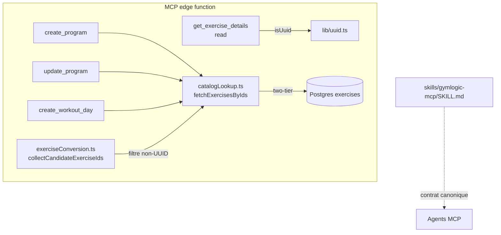

# Tech Plan — MCP UUID Guard (#288)

## Architectural Approach

### Key Decisions

| Decision | Choice | Rationale |
|---|---|---|
| Two-tier location | Dans `fetchExercisesByIds` lui-même, pas dans les callers | Chokepoint partagé : un seul endroit à garder. Les 3 callers actuels pré-filtrent déjà via `collectCandidateExerciseIds` (`file:supabase/functions/mcp/lib/exerciseConversion.ts:41`), donc le two-tier est de la **défense-en-profondeur** contre tout futur caller qui bypasserait les validateurs |
| Ordre du check | Valider **tous** les ids avant la requête `IN (...)` | Fail-fast : un id malformé ne coûte pas un aller-retour Postgres ; pas de fetch partiel |
| Message malformed (write) | `"<id>" is not a valid UUID. Do not invent ids — re-run search_exercises (or resolve_exercises by name) and pick a returned id.` | Wording aligné sur le chemin read (contrat de l'issue #288) ; la liste des ids malformés rejoint le message existant |
| Message catalog-miss (write) | `Unknown or inaccessible exercise_id(s): …` inchangé | Contrat déjà documenté dans SKILL.md edge-cases ; tout changement casserait les agents qui le pattern-match |
| Read path refactor | Importer `isUuid` de `file:supabase/functions/mcp/lib/uuid.ts`, supprimer le `UUID_RE` local (`getExerciseDetails.ts:76`) | Contrat UUID défini en un seul endroit ; comportement inchangé (même regex de forme) |
| Strict v4 | Non — on garde le shape-check | Out of scope du brief ; le doc-comment de `uuid.ts` documente déjà le renforcement éventuel |
| SKILL.md | Nouvelle entrée anti-pattern dédiée (recherche vide → abandonner / demander, jamais de placeholder) + exemple du mauvais pattern, dans la table « Edge cases » + règle explicite | La règle générique ligne ~630 et les deux messages existants ne couvrent pas l'amorce de l'incident (recherche vide → fabrication) |
| Tests | `catalogLookup.test.ts` (vitest, fake supabase) pour le two-tier ; nouveau `getExerciseDetails_test.ts` (style Deno black-box de `createWorkoutDay_test.ts`) pour la non-régression read | Deux styles existants du repo : lib → vitest, handlers → Deno asserts via registry. Fixtures-only, sans réseau ni clé |

### Critical Constraints

- **Ne pas modifier** le message read-path existant `Invalid exercise_id format: "<id>". Expected a UUID — use resolve_exercises (by name) or search_exercises (browse) to find it.` — le test de non-régression (T252) le fige verbatim.
- `collectCandidateExerciseIds` filtre les non-UUID **avant** le fetch (`exerciseConversion.ts:41`) : avec le two-tier, le flux existant « id malformé → `Invalid UUID at days[...]` (validateur) » reste le chemin nominal des write-tools. Le two-tier de `fetchExercisesByIds` ne doit pas court-circuiter ce comportement — il ne s'active que si un id malformé lui parvient directement.
- `createWorkoutDay_test.ts:680` assert que le message d'invalidité vient du validateur partagé — ne doit pas casser.
- Les imports handler Deno (`https://esm.sh/…`, `https://deno.land/std@0.224.0/assert`) suivent le style des tests handler existants ; les imports lib restent relatifs (vitest).
- SKILL.md est le contrat canonique consommé par tous les agents : wording validé dans l'Epic Brief (abandonner / demander, jamais de placeholder), pas d'invention au-delà.
- Pas de migration Supabase, pas de nouveau tool MCP, pas de changement de schéma d'input.

---

## Data Model

Aucun changement de schéma. Aucune nouvelle table, colonne ni RPC. Le garde-fou est purement serveur-edge (validation d'input) + documentation.

---

## Component Architecture

### Layer Overview

### New Files & Responsibilities

| File | Purpose |
|---|---|
| `file:supabase/functions/mcp/tools/getExerciseDetails_test.ts` | Nouveau — black-box handler tests (style Deno, via registry) : id absent, id malformé (message figé), valid-miss, happy path |
| `file:supabase/functions/mcp/lib/catalogLookup.ts` | Modifié — two-tier : ids malformés → message actionnable avant le `IN (...)` ; valid-miss inchangé |
| `file:supabase/functions/mcp/lib/catalogLookup.test.ts` | Modifié — cas malformed (aucun call `.in()`), cas mixte (malformed + valide), valid-miss non-régressé |
| `file:supabase/functions/mcp/tools/getExerciseDetails.ts` | Modifié — import `isUuid`, suppression du `UUID_RE` local, comportement inchangé |
| `file:skills/gymlogic-mcp/SKILL.md` | Modifié — entrée edge-case anti-pattern + règle explicite |

### Component Responsibilities

**`fetchExercisesByIds`**
- Reçoit `ids: string[]` ; si `!isUuid(id)` pour un id → retour immédiat `{ data: [], error: "<id>" is not a valid UUID. Do not invent ids — re-run search_exercises (or resolve_exercises by name) and pick a returned id. }` (ids malformés listés, sans fetch)
- Sinon comportement actuel inchangé (miss générique)

**`getExerciseDetails`**
- Identique au comportement mergé (#543), validation via `isUuid` partagé

### Failure Mode Analysis

| Failure | Behavior |
|---|---|
| Id malformé passé directement à `fetchExercisesByIds` (caller futur non filtré) | Rejet en amont, message actionnable, zéro requête Postgres |
| Id malformé dans un write-tool actuel | Chemin nominal inchangé : filtré par `collectCandidateExerciseIds`, attrapé par `validateDayExercises` → `Invalid UUID at days[...]` |
| Id UUID valide mais absent / non visible (RLS) | Message miss générique inchangé, documenté SKILL.md |
| Regex uuid divergente (régression) | Impossible par construction : plus qu'une seule définition (`lib/uuid.ts`), tests des deux côtés |

---

## Découpage en tickets (TDD)

| Ticket | Tranche | Type |
|---|---|---|
| T251 | `fetchExercisesByIds` two-tier + cas vitest (red → green) | Code + tests |
| T252 | Refactor `getExerciseDetails` → `isUuid` + `getExerciseDetails_test.ts` non-régression (red → green) | Code + tests |
| T253 | SKILL.md anti-pattern + exemple mauvais pattern | Docs |
| (suivi) | Re-validation HITL Iris (prompt cardio) — hors dev, à planifier PM | HITL |

T251 et T252 sont indépendants (branches parallèles possibles) ; T253 est purement docs.

---

## References

- Epic Brief : `file:docs/Epic_Brief_—_MCP_UUID_Guard_#288.md` (version corrigée, PR #546)
- Issue #288 — acceptance raffinée (relecture corrigée 2026-09-28)
- Garde-fou read mergé dans PR #543 (`getExerciseDetails.ts:123-128`)
- Incident : HITL Epic C #280, prompt 3 (21:56:17), PR #285
