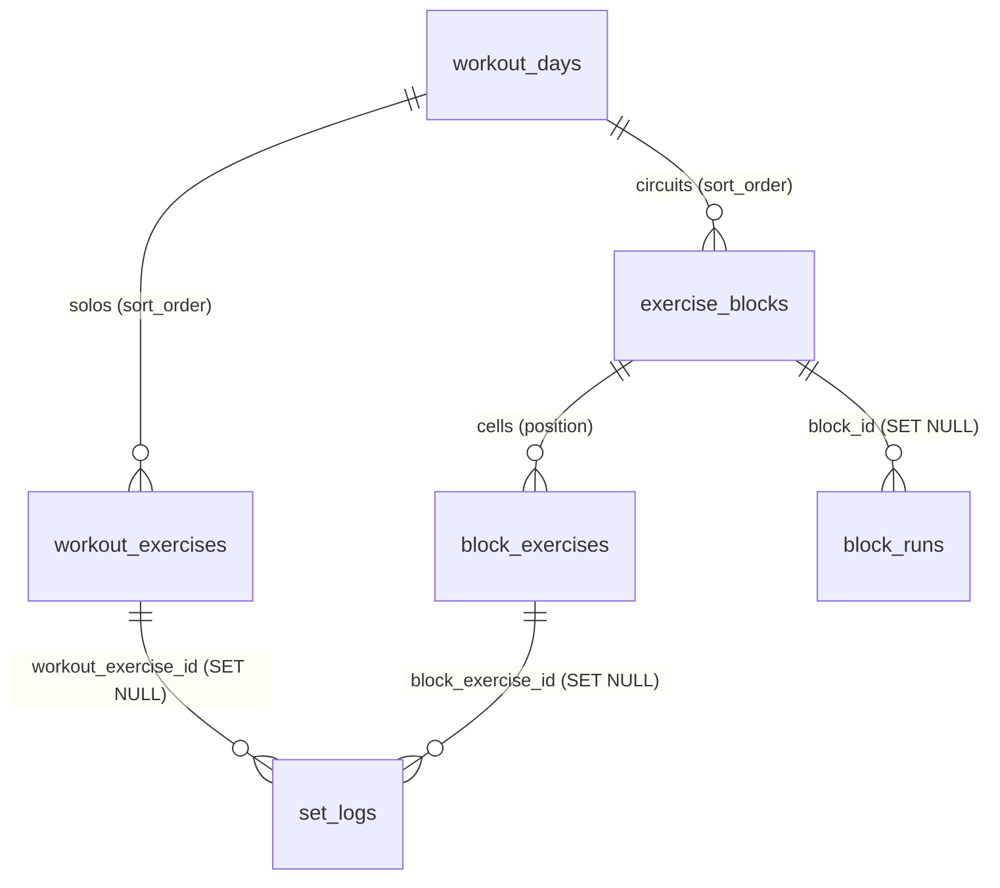
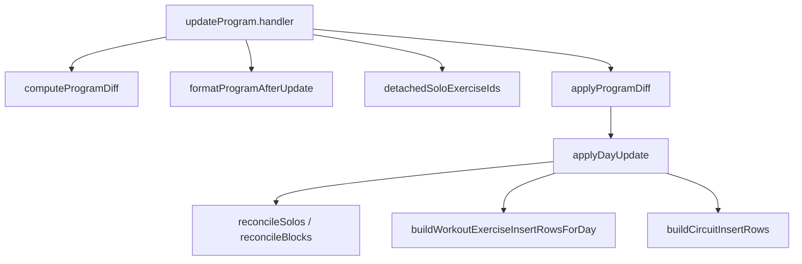

# Tech Plan — MCP `update_program` preserves Exercise Slot identity

## Architectural Approach

### Key Decisions

| Decision | Choice | Rationale |
|---|---|---|
| Apply strategy | **In-place reconciliation** replaces wipe + reinsert | Preserves `workout_exercises.id` / `exercise_blocks.id`, so `set_logs.workout_exercise_id` and `block_runs.block_id` stay attached |
| Solo matching | Greedy by `exercise_id`, order of appearance | Deterministic; a swap (different `exercise_id`) is a new slot by construction (#463) |
| Block matching | By `benchmark_circuit_id` first, else by order | A named Circuit keeps identity across reorder; a generic Circuit falls back to positional identity |
| Nested block cells | Reconcile `block_exercises` in place too | `set_logs.block_exercise_id` is `ON DELETE SET NULL`; wiping cells would detach circuit history |
| Public contract | Unchanged — no ids exposed | Reconciliation is server-side; `exercises[]` and the `dry_run` shape stay compatible |
| Detachment signal | Informative `dry_run` warning, no extra gate | Consent already exists (echoed payload / **Preview Token**); a swap is an expected reset |
| Weight change | `UPDATE` in place bumps `template_updated_at` | Opens the **Manual Override Window** → engine anchors on the new template then progresses (desired) |

### Critical Constraints

- `file:supabase/functions/mcp/lib/applyDayUpdate.ts` is the only apply path for
  an UPDATE day; `file:supabase/functions/mcp/lib/updateProgramApply.ts` calls it.
  INSERT days keep using `insertDaySequence` (fresh day, nothing to reconcile).
- `file:supabase/functions/mcp/lib/daySequence.ts`'s `wipeDaySequence` becomes
  dead once reconciliation lands — delete it.
- The `workout_exercises.template_updated_at` trigger fires `BEFORE UPDATE OF
  reps, weight, sets, target_duration_seconds` and only bumps on a real change
  (ADR 0006). An in-place `UPDATE` with identical values is a no-op for the
  window; a weight change opens it.
- The `dry_run` warning needs the current day's solo `exercise_id`s. The
  existing `PROGRAM_SELECT` already embeds `workout_exercises(exercise_id, …)`,
  so no extra query is needed for solos. Blocks are not in the snapshot; block
  detachment is not warned in v1 (documented in ADR 0030).
- `AppliedDayOp` keeps the string `"exercises_replaced"` for wire compatibility
  even though the operation is now a reconciliation.

---

## Data Model

No schema change. The reconciliation reads and writes existing tables.

### Table Notes

- `workout_exercises.id` is the **Exercise Slot** identity (ADR 0012). Preserving
  it is the whole point: `set_logs.workout_exercise_id` is `ON DELETE SET NULL`,
  so a delete detaches **Last Performance**.
- `exercise_blocks.id` is the `block_id` identity used by **Circuit Completion
  Time** / **Block Run** / PB. `block_exercises.id` is the `block_exercise_id`
  identity used by `set_logs.log_slot`.

---

## Component Architecture

### Layer Overview

### New Files & Responsibilities

| File | Purpose |
|---|---|
| `file:supabase/functions/mcp/lib/slotReconciliation.ts` | Pure matching: `reconcileSolos`, `reconcileBlocks`, `detachedSoloExerciseIds` |
| `file:supabase/functions/mcp/lib/slotReconciliation.test.ts` | Unit tests for the matching rules |
| `file:docs/adr/0030-update-program-slot-reconciliation.md` | The decision record |

### Component Responsibilities

**`slotReconciliation.ts`**
- `reconcileSolos(existing, items)` — greedy match by `exercise_id`; returns
  `{ matched, inserted, deleted }` with the incoming array index as `sortOrder`.
- `reconcileBlocks(existing, items)` — benchmark-identity pass then order pass.
- `detachedSoloExerciseIds(existingExerciseIds, items)` — the deleted
  `exercise_id`s, for the `dry_run` warning.

**`applyDayUpdate.ts`**
- Pre-flight catalog check (unchanged).
- Fetch existing solos + blocks for the day, plan, then execute
  `UPDATE` / `INSERT` / `DELETE` per table. Blocks reconcile their cells in place.

**`updateProgram.ts`**
- `dry_run` appends one warning per detached solo, named from `catalogById`.

### Failure Mode Analysis

| Failure | Behavior |
|---|---|
| Catalog miss on an incoming item | Abort before any fetch/write (unchanged) |
| Existing-row fetch fails | Return `{ ok: false, error }`; no write |
| A solo `UPDATE` fails | Return the error; partial-success report at the day level |
| Duplicate `exercise_id` in a day | Greedy match pairs them in order; surplus is inserted/deleted |
| Same exercise in a solo and a Circuit | Solos and blocks are matched in separate namespaces |

---

## i18n contract

No new user-facing UI strings. The `dry_run` warning is agent-facing French
copy, consistent with the existing active-cycle warning
(`formatActiveCycleWarning`). One new formatter:

**Namespace:** MCP `warnings[]` (not i18n)

| Key | EN | FR | Why this wording |
|---|---|---|---|
| `formatSlotDetachmentWarning` | — | `Historique détaché : « {name} » est retiré ou remplacé — sa progression repart de la prescription du template.` | Names the movement, states the consequence; avoids internal jargon ("slot") |
