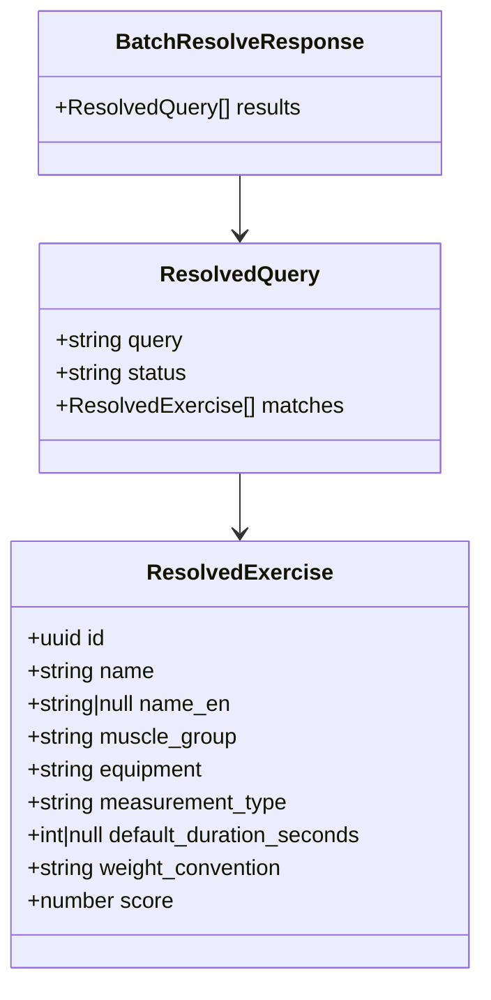
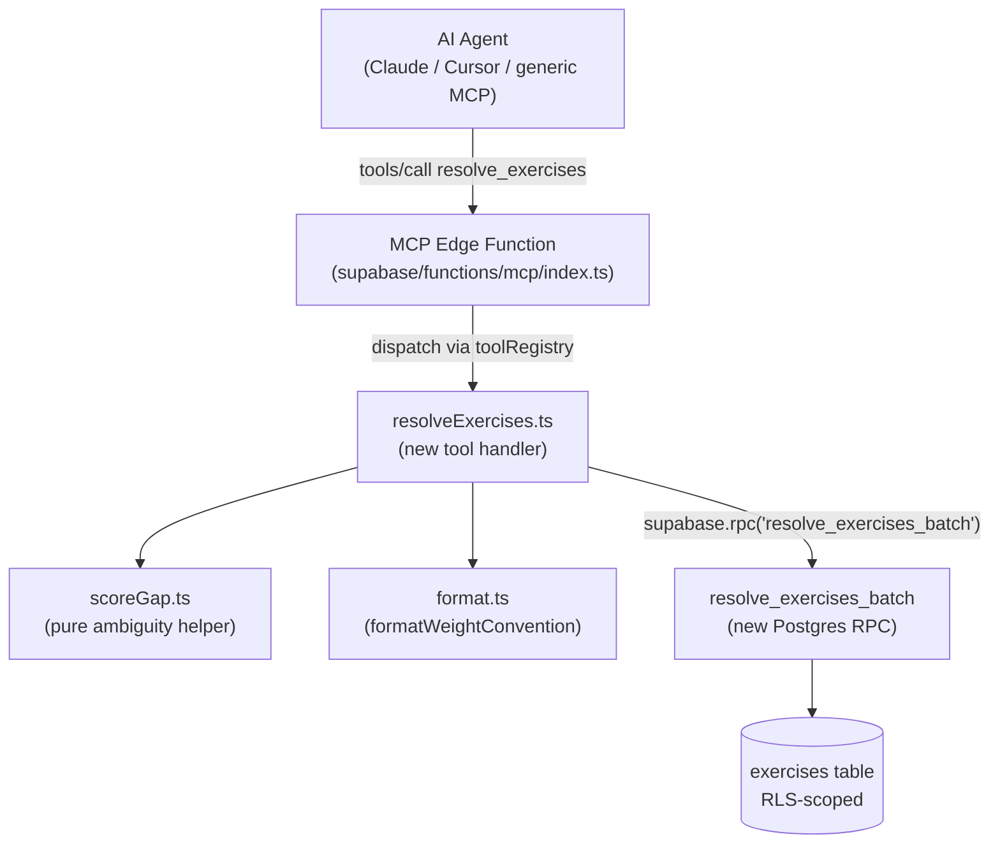

# Tech Plan — MCP — Batch Exercise Resolution #310

## Architectural Approach

### Key Decisions

| Decision | Choice | Rationale |
|---|---|---|
| Tool name | `resolve_exercises` | Conveys intent (name → UUID resolution); avoids confusion with existing `search_exercises` |
| Input shape | `{ queries: string[] }` only — no per-query filters in v1 | Real agent traces (issue #310 screenshot) show context-embedding in the name string itself; adding optional fields later is non-breaking |
| Postgres execution | New `resolve_exercises_batch(queries text[])` RPC; single round-trip; PL/pgSQL FOR loop returning ranked rows tagged by `query_idx` | 1 round-trip vs N; reuses `pg_trgm`/`unaccent` infra; PL/pgSQL more readable than `unnest LATERAL` for this shape; perf difference negligible at scale |
| Score-gap threshold | `0.10` between top-1 and top-2 similarity scores (substring-rank-0 ties naturally fall under this rule — identical scores → gap=0 → ambiguous). Read at runtime from env var `MCP_AMBIGUITY_GAP` with fallback to `0.10`. | Catches dominant ambiguity case (substring collisions like "leg press"); env-var hook lets us tune from production traces without redeploying the function |
| Top-K | 3 (top-1 always; top-2/3 only attached when `ambiguous: true`) | Enough alternates for agent to surface to user without payload bloat |
| Bundled metadata | Each result includes `weight_convention`, `measurement_type`, `default_duration_seconds` | Eliminates N × `get_exercise_details` calls before `create_program`. `weight_convention` derived in Edge Function via existing `formatWeightConvention()` — single source of truth |
| Tool coexistence | Keep `search_exercises` in MCP toolkit | Browse-by-filter is a legitimate intent; non-breaking; agents steered via tool descriptions + SKILL.md |
| Server version | `0.4.0` → `0.5.0` | Additive (new tool, no breaking change to existing tools) |
| Max batch size | 50 queries | Comfortable buffer above realistic program-build (~12 names per call); DoS guardrail |
| Per-query result shape | Single `status` field with values `"matched"` \| `"ambiguous"` \| `"no_match"` \| `"empty_query"` (no separate `ambiguous` boolean) | One source of truth for the agent to switch on; avoids the agent reading two fields to derive one decision |
| Empty/whitespace queries | Per-query `{ status: "empty_query", matches: [] }` | Uniform response shape — every input query gets a result row |
| Score-gap helper location | Separate `file:supabase/functions/mcp/lib/scoreGap.ts` + dedicated tests | Tiny pure function but isolation lets us unit-test edge cases (0.099 / 0.10 / 0.101) without supabase mocks |

### Critical Constraints

1. **RLS / SECURITY INVOKER**: the new RPC must mirror the existing `file:supabase/migrations/20260326120000_search_exercises.sql` auth pattern (`SECURITY INVOKER` + `GRANT EXECUTE ... TO authenticated`). Without it, real users get 403s. The existing `exercises` table RLS scopes the query to the calling user automatically — no extra logic needed in the function.
2. **Diacritic / unicode normalization**: must use `extensions.unaccent(lower(...))` on BOTH query input and the indexed columns, matching the existing search RPC. Inconsistency here would produce different match sets for "épaules" vs "epaules" between the two tools.
3. **Tool registry contract**: the new handler must implement `ToolDefinition` from `file:supabase/functions/mcp/tools/registry.ts` and be added to the `tools` array. The dispatch in `file:supabase/functions/mcp/index.ts` (`tools/call` case) is generic — no changes needed there beyond the registry append.
4. **`weight_convention` source of truth**: derived via `formatWeightConvention(equipment)` in `file:supabase/functions/mcp/lib/format.ts`. NEVER duplicate this mapping in SQL — equipment-to-convention rules can shift (e.g. when issue #281 lands weighted bodyweight) and the TS layer must remain canonical.
5. **SKILL.md / description coherence**: all four updates (`resolve_exercises` desc, `search_exercises` desc revision, `create_program` desc edit, SKILL.md) must ship in the same PR. Mismatched guidance is worse than no change — the agent will pick a random path.
6. **MCP version bump**: `SERVER_INFO.version` in `file:supabase/functions/mcp/index.ts` plus a `CHANGELOG.md` entry. The protocol version (`PROTOCOL_VERSION = "2025-03-26"`) does NOT change — that's the MCP spec version.
7. **Ranking-clause duplication accepted, with mandatory cross-reference comments**: the new RPC's `WHERE`/`ORDER BY` mirrors the existing `search_exercises` RPC's clauses. Not extracted to a shared SQL helper because the two tools may legitimately diverge over time (resolve cares about top-match quality; search cares about list completeness). **Both migration files MUST carry an inline `-- See also: <other migration filename>` comment near the ranking clause** so anyone tuning one side consciously evaluates the impact on the other (without this, the next person to touch `search_exercises` ranking will silently miss `resolve_exercises_batch`).
8. **Not designed for bulk catalog operations**: the 50-query batch cap is a per-call MCP-tool guardrail aimed at agent flows. For catalog migrations, seeding scripts, or admin tooling that needs to resolve hundreds or thousands of names, use direct DB access (raw `search_exercises` RPC in a loop, or a dedicated admin endpoint) — do NOT chain `resolve_exercises` calls. Documented so the limitation isn't mistaken for a system-wide constraint.

---

## Data Model

No new tables, no new columns. Pure RPC + tool layer addition.

### Response shape (JSON returned in the tool's text content)



### New Postgres RPC

```sql
-- supabase/migrations/YYYYMMDDhhmmss_resolve_exercises_batch.sql

CREATE OR REPLACE FUNCTION resolve_exercises_batch(
  queries text[]
)
RETURNS TABLE (
  query_idx int,
  query_text text,
  exercise_id uuid,
  name text,
  name_en text,
  muscle_group text,
  equipment text,
  measurement_type text,
  default_duration_seconds int,
  score real
)
LANGUAGE plpgsql STABLE SECURITY INVOKER
AS $$
DECLARE
  q_raw text;
  q_norm text;
  qi int;
BEGIN
  IF queries IS NULL OR array_length(queries, 1) IS NULL THEN
    RETURN;
  END IF;

  FOR qi IN 1..array_length(queries, 1) LOOP
    q_raw := queries[qi];
    q_norm := trim(lower(extensions.unaccent(coalesce(q_raw, ''))));

    -- Empty/whitespace queries return zero rows for this query_idx;
    -- the Edge Function maps absence + reason "empty_query".
    IF length(q_norm) = 0 THEN
      CONTINUE;
    END IF;

    RETURN QUERY
      SELECT
        qi - 1 AS query_idx,
        q_raw AS query_text,
        e.id AS exercise_id,
        e.name,
        e.name_en,
        e.muscle_group,
        e.equipment,
        e.measurement_type::text,
        e.default_duration_seconds,
        GREATEST(
          similarity(extensions.unaccent(lower(e.name)), q_norm),
          similarity(extensions.unaccent(lower(coalesce(e.name_en, ''))), q_norm)
        )::real AS score
      FROM exercises e
      WHERE
        extensions.unaccent(lower(e.name)) ILIKE '%' || q_norm || '%'
        OR extensions.unaccent(lower(coalesce(e.name_en, ''))) ILIKE '%' || q_norm || '%'
        OR similarity(extensions.unaccent(lower(e.name)), q_norm) > 0.15
        OR similarity(extensions.unaccent(lower(coalesce(e.name_en, ''))), q_norm) > 0.15
      ORDER BY
        CASE
          WHEN extensions.unaccent(lower(e.name)) ILIKE '%' || q_norm || '%' THEN 0
          WHEN extensions.unaccent(lower(coalesce(e.name_en, ''))) ILIKE '%' || q_norm || '%' THEN 1
          ELSE 2
        END,
        GREATEST(
          similarity(extensions.unaccent(lower(e.name)), q_norm),
          similarity(extensions.unaccent(lower(coalesce(e.name_en, ''))), q_norm)
        ) DESC,
        e.name,
        e.id
      LIMIT 3;
  END LOOP;
END;
$$;

GRANT EXECUTE ON FUNCTION public.resolve_exercises_batch(text[]) TO authenticated;
```

### Table Notes

- **No `rank` column in the RPC output** — substring vs similarity ordering is encoded in the row order (deterministic via `LIMIT 3` after `ORDER BY`); the Edge Function reads rows in result order. Adding an explicit rank column is 4 bytes per row of payload bloat for no agent-visible benefit.
- **`measurement_type::text` cast** — the column is constrained text in `exercises`; cast to plain text in the result so the consumer doesn't need to know about the underlying type.
- **`score::real`** — keeps the field 32-bit for transport; `pg_trgm` similarity is float in [0, 1], no precision loss in 24-bit mantissa.
- **Empty-query handling lives in PL/pgSQL** — the `CONTINUE` branch produces zero rows for that `query_idx`. The Edge Function detects "no rows for this index" and decides whether it's `no_match` (input had real text) or `empty_query` (input was blank).
- **No score normalization across queries** — `pg_trgm` similarity is per-query; comparing scores across different queries is meaningless. The `ambiguous` flag operates strictly within a single query's results, never across.

---

## Component Architecture

### Layer Overview



### New Files & Responsibilities

| File | Purpose |
|---|---|
| `supabase/functions/mcp/tools/resolveExercises.ts` | New tool handler: validate input, call RPC, apply score-gap rule per query, bundle `weight_convention`, format JSON response |
| `supabase/functions/mcp/tools/resolveExercises.test.ts` | Vitest unit tests with fake supabase client (mirror `file:supabase/functions/mcp/lib/catalogLookup.test.ts` pattern). MUST cover at minimum: happy path single match, ambiguous-with-alternates, no-match, empty-query in batch, all-empty batch, batch-size cap exceeded, RPC error propagation, no-auth, status field for each branch (`matched` / `ambiguous` / `no_match` / `empty_query`), `weight_convention` bundling, AND **a dedicated test where the fake RPC returns rows in non-input order** (e.g. queries `["a", "b", "c"]` get rows tagged with `query_idx` `[2, 0, 1]`) — verifies the Edge Function groups by tagged column, not row position |
| `supabase/functions/mcp/lib/scoreGap.ts` | Pure helper: `isAmbiguous(matches: {score: number}[]): boolean` + `getAmbiguityGap()` (env-driven, defaults to `0.10`). Extracted for unit testing without supabase mocks. Exports `DEFAULT_AMBIGUITY_GAP = 0.10`. |
| `supabase/functions/mcp/lib/scoreGap.test.ts` | Vitest unit tests for threshold rule (default gap=0.10, edge cases at 0.099 / 0.10 / 0.101, single-match, zero-match, three-way tie, NaN defensive) PLUS env-var override path (valid value, invalid value, out-of-range value, missing var). |
| `supabase/migrations/YYYYMMDDhhmmss_resolve_exercises_batch.sql` | New Postgres RPC + GRANT |

### Modified Files

| File | Change |
|---|---|
| `supabase/functions/mcp/tools/registry.ts` | Register new tool in the `tools` array |
| `supabase/functions/mcp/tools/searchExercises.ts` | Update `description`: explicit "use `resolve_exercises` instead if you already know the names" steering |
| `supabase/functions/mcp/tools/createProgram.ts` | Update `TOOL_DESCRIPTION`: drop "Call `get_exercise_details` first to confirm the convention" line; replace with reference to `resolve_exercises` returning the convention |
| `supabase/functions/mcp/index.ts` | Bump `SERVER_INFO.version` from `"0.4.0"` to `"0.5.0"` |
| `skills/gymlogic-mcp/SKILL.md` | Add "Catalog tools — which one when" decision table near top; update Pattern 3, Pattern 4, both `update_program` worked examples to use `resolve_exercises`; update tool-reference table to include new tool (10 tools total); revise the `LEGACY_MIGRATION_ERROR_MESSAGE` reference if it still mentions `get_exercise_details` for convention guidance |
| `CHANGELOG.md` | v0.5.0 entry — new tool + perf description |

### Component Responsibilities

**`resolveExercises.ts`** (new tool handler)
- Validates `args.queries`: must be non-empty array, length ≤ 50, every element is string (else returns `isError: true` with explicit message)
- Calls `supabase.rpc("resolve_exercises_batch", { queries })` once
- Groups returned rows by `query_idx`
- For each input query index 0..N-1:
  - Determine `status`:
    - empty/whitespace input → `"empty_query"` (zero matches)
    - real input, RPC returned 0 rows → `"no_match"` (zero matches)
    - real input, RPC returned ≥ 1 row, `isAmbiguous(matches)` true → `"ambiguous"` (top-1, top-2, top-3 attached)
    - real input, RPC returned ≥ 1 row, `isAmbiguous(matches)` false → `"matched"` (top-1 attached only)
  - Map each match row to `ResolvedExercise` with `weight_convention: formatWeightConvention(row.equipment)`
- **Result grouping is `query_idx`-tagged, not row-position-tagged** — the RPC returns rows with an explicit `query_idx int` column; Edge Function groups by that column. Robust to any Postgres reordering / parallelization. Covered by an explicit unit test (see test file responsibilities below).
- Returns `{content: [{type: "text", text: JSON.stringify(response, null, 2)}]}`
- Auth: standard pattern from existing tools (early return on `!supabase` with `"Authentication required..."` text)

**`scoreGap.ts`** (pure helper)
- `isAmbiguous(matches: ScoredMatch[]): boolean` — returns true when `matches.length >= 2 && matches[0].score - matches[1].score < getAmbiguityGap()`
- `getAmbiguityGap(): number` — reads env var `MCP_AMBIGUITY_GAP` via `Deno.env.get(...)`, parses with `parseFloat`, validates as finite number in `(0, 1]`, falls back to `DEFAULT_AMBIGUITY_GAP = 0.10` on any of (unset, NaN, out-of-range). Cached after first read (env doesn't change mid-process).
- No supabase, no I/O beyond the env var read — pure-enough for clean unit tests (env var monkey-patched in test setup)
- `DEFAULT_AMBIGUITY_GAP = 0.10` exported for tests
- NaN-safe (NaN comparisons are false → never returns true on bad data → defaults to top-1-only behavior, no crash)
- Includes a `// TUNING:` comment block describing what to look for in production traces (false-ambiguous rate, false-confident pick rate) and how to adjust the env var.

**`resolve_exercises_batch`** (new Postgres RPC)
- `LANGUAGE plpgsql STABLE SECURITY INVOKER`
- Iterates query array via PL/pgSQL FOR loop; per query: normalize, skip empties, RETURN QUERY ranked top-3
- Reuses the same ranking expression as the existing `search_exercises` RPC (substring rank then similarity desc)
- Inherits RLS from the `exercises` table (scoped to authenticated user)

### Failure Mode Analysis

| Failure | Behavior |
|---|---|
| `queries` missing or not an array | Tool returns `isError: true` with text: `"queries must be a non-empty array of strings"` |
| `queries.length > 50` | Tool returns `isError: true` with text: `"queries exceeds max batch size of 50 (got N)"` |
| `queries.length === 0` | Tool returns `isError: true` (same message as missing) |
| Single empty/whitespace query in batch | That entry: `{query: "", status: "empty_query", matches: []}`; siblings unaffected |
| Single query matches zero exercises | That entry: `{query, status: "no_match", matches: []}`; siblings unaffected |
| All queries match zero exercises | Response: 100% `status: "no_match"` rows. Batch is still success (200, no `isError`) — agent reads and decides next move |
| RPC error (Postgres down, function permission missing) | Tool returns `isError: true` with the error message verbatim. Agent surfaces to user. |
| No auth (`!supabase`) | Standard `"Authentication required — please provide a valid Bearer token."` |
| Two queries with identical text | Each gets its own result row independently — no dedup across queries (agent's payload, agent's choice) |
| Catalog has zero exercises (fresh DB seed missing) | All queries → `no_match`; agent surfaces "no exercises found in catalog" gracefully |
| Agent sends 50 single-character queries (e.g. `["a", "b", ...]`) | Each returns ambiguous matches (substring collisions); response payload up to 50 × 3 rows = 150 rows. Bounded. |
| Score field is `NaN` (defensive — shouldn't happen from PG `real`) | `isAmbiguous` returns false (NaN comparisons are false) → tool emits top-1 only with `status: "matched"`. No crash. |
| Catalog row with unknown `equipment` value | `formatWeightConvention` falls back to `"total"` and logs a warning (existing behavior). Tool response still well-formed. |
| Two adjacent matches with identical raw scores but different substring ranks | Score gap = 0 → `status: "ambiguous"` → both surfaced as alternates. Acceptable: ranking is recorded by row order; the agent gets to disambiguate. |
| RPC returns rows in non-input order (Postgres parallelization or planner choice) | Edge Function groups by explicit `query_idx` column on each row, not row position. Robust by design. Covered by a dedicated unit test in `resolveExercises.test.ts`. |
| Agent passes a non-string element (e.g. `[123, "bench"]`) | Caught in input validation: `isError: true` with `"queries[N] must be a string"` |
