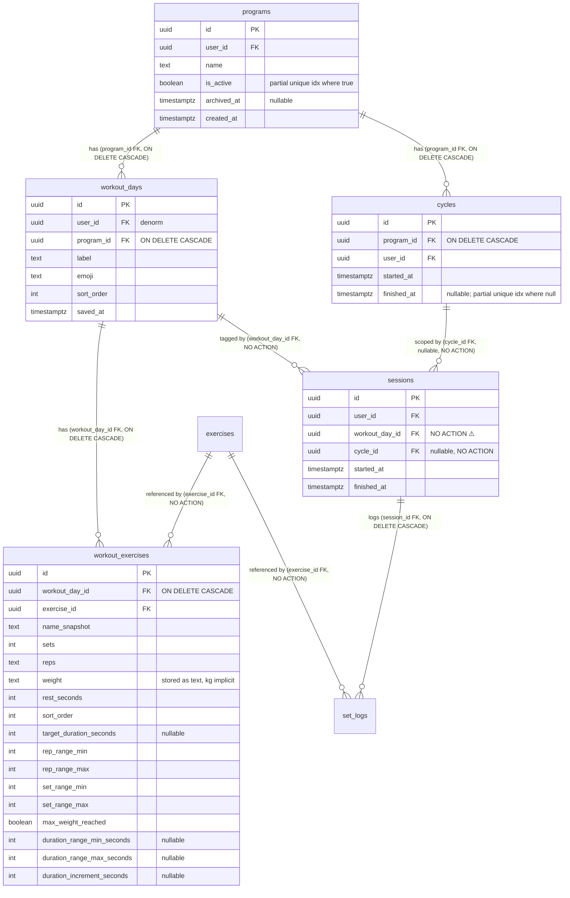
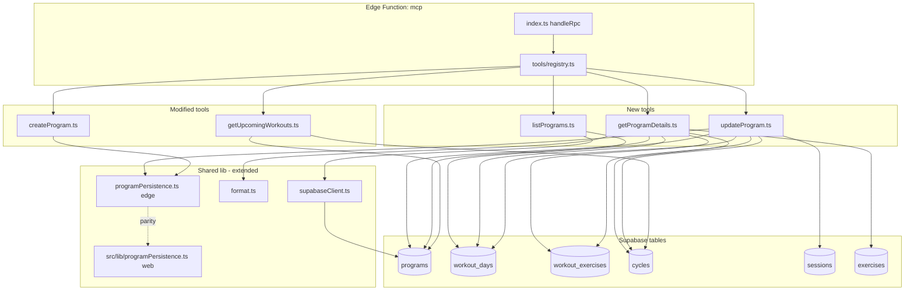

# Tech Plan — MCP — Read & Edit Programs (#276)

## Architectural Approach

### Key Decisions

| Decision | Choice | Rationale |
|---|---|---|
| **`update_program` input format** | Declarative full-structure with optional IDs (PUT-style, identity-preserving) | Single call covers all mutations (rename / add-remove-reorder days / swap exo / prescription). Domain ops would bloat the registry by 5-7 tools. JSON Patch paths are LLM-fragile. |
| **Day identity** | Preserved via optional `id` per day in input | `sessions.workout_day_id REFERENCES workout_days(id)` (no `ON DELETE` clause = `NO ACTION`). Reusing day IDs across updates avoids cascading FK violations. |
| **Exercise-slot identity** | NOT preserved — wipe+reinsert all `workout_exercises` per affected day | `workout_exercises` has no historical FK (`set_logs.exercise_id` references the catalog, not `workout_exercise_id`). Simpler than tracking slot IDs, zero impact on history. |
| **`create_program` extension shape** | `exercises: (string \| { exercise_id, sets?, reps?, weight_kg?, rest_seconds? })[]` union | Backwards compatible (strings keep current default behavior), forward compatible (objects allow explicit prescription). Same shape used in `update_program`. |
| **Legacy string form** | Applies current defaults (`3 sets × 10 reps × 90s rest`, weight `"0"`) in both `create_program` and `update_program` | Consistent semantics, lenient adoption. Legacy clients keep working unchanged. |
| **Weight semantics** | Implicit per-equipment convention (no new field) | Per-hand for `dumbbell`/`kettlebell`, total otherwise. Matches `set_logs.weight_logged` storage convention. Tool description + SKILL.md spell it out for zero-shot agents. |
| **Atomicity** | Compensating rollback (track applied mutations, undo on error) | Same pattern as existing `createProgram.ts`. Supabase JS client doesn't expose multi-statement transactions, and an RPC wrapper would add deployment friction. |
| **Mid-cycle policy** | Allow update; append warning to response when `cycles WHERE program_id=X AND finished_at IS NULL` exists | Brief decision (allow_with_warning). Warning text names the active cycle, its `started_at`, and explicit "this affects your remaining workouts in this cycle". |
| **Delete-day-with-sessions policy** | Pre-check; fail with explicit message before any write | Schema migration (cascade or `SET NULL` on `sessions.workout_day_id`) is out of scope per Epic Brief. The user gets a clear path forward (rename / repurpose). |
| **Destructive-edit safety** | `dry_run: true` is default; dry_run output lists every removed day with `{id, label, session_count, has_sessions}` so the agent / user can spot accidents before applying | Mitigates "agent forgets a day's `id` → server treats it as removal" without breaking the declarative model. |
| **`list_programs` archive filter** | Default excludes `archived_at IS NOT NULL`; opt-in flag `include_archived: bool` | Archived programs are noise for the typical "what programs do I have?" prompt. |
| **`get_program_details` access** | UUID-only (`program_id` required) | Mirrors anti-spam pattern from `get_exercise_details`. Forces the agent to disambiguate via `list_programs` first. |
| **Exposed IDs in read tools** | `program_id` in all three reads; `workout_day_id` in `get_program_details`; `active_cycle_id` in `get_program_details` and `get_upcoming_workouts` | Without `workout_day_id`, the agent cannot preserve day identity in `update_program`. `active_cycle_id` is +1 line, makes mid-cycle context richer for the warning. |
| **`is_active` toggling** | Out of scope for `update_program` (read-only on this surface) | Toggling active program belongs to a future `set_active_program` tool. The partial unique index `programs_active_unique` enforces single-active globally — accidentally setting active here would conflict with `create_program`'s deactivate-then-activate dance. |
| **Code reuse** | Extend `programPersistence.ts` (Edge + web mirror) to accept explicit prescription | The auxiliary fields (`rep_range_min/max`, `set_range_min/max`, `target_duration_seconds`, `max_weight_reached`, `duration_*`) are already computed there. Single source of truth across MCP tool, web AI generation flow, and any future write surface. |

### Critical Constraints

**FK from `sessions.workout_day_id` to `workout_days.id` has no `ON DELETE` clause** (`file:supabase/migrations/20240101000004_create_sessions.sql`). Effective behavior is `NO ACTION` (RESTRICT). Removing a `workout_day` that has any linked session — even one completed cycle — throws a Postgres FK violation. `update_program` MUST pre-check before issuing a DELETE and return a structured error: `Cannot remove day "X" — it has N logged sessions. Rename or repurpose it instead.`

**`workout_exercises` is free.** No historical FK references it (`set_logs.exercise_id` points to the catalog, not to a `workout_exercise_id`). Wiping and re-inserting all rows for a given `workout_day_id` is safe. This is what makes the "no slot IDs in input" simplification viable.

**`programs.is_active` partial unique index** (`file:supabase/migrations/20260314000002_create_programs.sql:18-19`) enforces "at most 1 active program per user". `update_program` MUST NOT modify `is_active`; the field is read-only on this surface.

**`programPersistence.ts` lives in two places**: `file:supabase/functions/mcp/lib/programPersistence.ts` (Edge runtime, Deno) and `file:src/lib/programPersistence.ts` (web client, Vite/Node). The Edge file's header explicitly says "keep in sync". Any extension to accept explicit prescription must land in BOTH and pass `npx vitest run src/lib/programPersistence.test.ts` plus `deno test supabase/functions/mcp/lib/programPersistence_test.ts`.

**`workout_exercises.weight` is `TEXT NOT NULL DEFAULT '0'`** — string, not numeric. Cast `weight_kg: number` to `String(weight_kg)` on insert. `formatWorkoutDay` already handles this on the read path (`Number(ex.weight)` parse). `get_program_details` parses back to a number for the structured output (`weight_kg`).

**RLS scoping** stays unchanged. All queries flow through `createUserClient(authHeader)` (`file:supabase/functions/mcp/lib/supabaseClient.ts`). `programs` / `workout_days` / `workout_exercises` all have `auth.uid() = user_id` (or denormalized equivalent) policies. The agent only sees and modifies programs it owns. Bogus `day.id` values in `update_program` input that point to another user's day are filtered by RLS at load time and treated as "new day to create" (the bogus client-supplied id is ignored, server assigns a fresh UUID).

**`workout_days.user_id` is NOT NULL and denormalized**. Inserts of new days in `update_program` must populate `user_id` from `auth.getUser()`. The same value is used in `createProgram.ts` today.

**Cold start neutrality**: 3 new tools + 2 modified add ~600 LOC to the function bundle. With zero npm dependencies (per the established MCP function pattern), p95 cold start stays well under the 3s target documented in the MCP-First Tech Plan.

---

## Data Model

No new tables, no new columns. The epic operates entirely within the existing schema.



### Table Notes

- **`programs.is_active`**: enforced single-true via partial unique index. Read-only from `update_program`; only `create_program` and a future `set_active_program` toggle it.
- **`workout_days` deletion**: cascades down to `workout_exercises` cleanly. The hazard is upstream — `sessions.workout_day_id` has no `ON DELETE`, so any logged session on a day blocks its deletion. `update_program` pre-checks before issuing DELETE.
- **`workout_exercises`**: completely safe to wipe-and-reinsert per day. No historical references.
- **`cycles.finished_at IS NULL`** is the active-cycle signal. Used by mid-cycle warning logic.
- **`set_logs.exercise_id`** points to the catalog directly — that's why mutating `workout_exercises` is history-safe.

### Tool input/output shapes (TypeScript)

```ts
// list_programs
type ListProgramsInput = {
  include_archived?: boolean // default false
}

type ListProgramsOutput = {
  programs: Array<{
    program_id: string
    name: string
    is_active: boolean
    archived_at: string | null
    day_count: number
    created_at: string
  }>
}

// get_program_details
type GetProgramDetailsInput = {
  program_id: string // UUID required
}

type GetProgramDetailsOutput = {
  program_id: string
  name: string
  is_active: boolean
  archived_at: string | null
  active_cycle_id: string | null
  days: Array<{
    workout_day_id: string
    label: string
    emoji: string
    sort_order: number
    exercises: Array<{
      exercise_id: string
      name_snapshot: string
      sets: number
      reps: string
      weight_kg: number // parsed from text
      rest_seconds: number
      target_duration_seconds: number | null
      sort_order: number
      equipment: string // joined from exercises catalog for weight-convention disambiguation
    }>
  }>
}

// update_program
type UpdateProgramInput = {
  program_id: string
  name?: string
  days: Array<{
    id?: string // workout_day_id; absent = new day to create
    label: string
    exercises: Array<
      | string // exercise_id UUID; defaults applied
      | {
          exercise_id: string
          sets?: number
          reps?: string
          weight_kg?: number // implicit per-equipment convention
          rest_seconds?: number
        }
    >
  }>
  dry_run?: boolean // default true
}

type UpdateProgramOutput = {
  dry_run: boolean
  program_id: string
  diff: {
    renamed: { from: string; to: string } | null
    days_added: Array<{ label: string }>
    days_removed: Array<{ id: string; label: string; session_count: number }>
    days_renamed: Array<{ id: string; from: string; to: string }>
    days_reordered: boolean
    exercises_total_after: number
  }
  warning?: string // mid-cycle warning if applicable
}

// create_program (extended)
type CreateProgramInput = {
  name: string
  days: Array<{
    label: string
    // New: union form (string defaults to legacy behavior)
    exercises?: Array<
      | string
      | {
          exercise_id: string
          sets?: number
          reps?: string
          weight_kg?: number
          rest_seconds?: number
        }
    >
    // Legacy: still accepted for backward compat
    exercise_ids?: string[]
  }>
  dry_run?: boolean
}
```

---

## Component Architecture

### Layer Overview



### New Files & Responsibilities

| File | Purpose |
|---|---|
| `supabase/functions/mcp/tools/listPrograms.ts` | Tool: returns `programs` rows for the authenticated user with `day_count` aggregate. Filters `archived_at` by default. |
| `supabase/functions/mcp/tools/getProgramDetails.ts` | Tool: returns the full structure of one program by UUID. Joins `programs` → `workout_days` → `workout_exercises` → `exercises` (for `equipment`). Includes `active_cycle_id`. |
| `supabase/functions/mcp/tools/updateProgram.ts` | Tool: declarative diff-and-apply. Pre-checks delete-day safety, computes diff, emits dry_run preview, applies with compensating rollback, appends mid-cycle warning. |
| `supabase/functions/mcp/tools/listPrograms_test.ts` | Deno tests: empty account, archived filter, multiple programs ordering. |
| `supabase/functions/mcp/tools/getProgramDetails_test.ts` | Deno tests: not-found (404), no cycle, with cycle, multi-day program shape, equipment join. |
| `supabase/functions/mcp/tools/updateProgram_test.ts` | Deno tests: rename, add/remove/reorder days, swap exo, prescription change, mid-cycle warning, FK error on remove-with-sessions, dry_run output shape, rollback on failure. |

### Modified Files & Responsibilities

| File | Change |
|---|---|
| `supabase/functions/mcp/tools/registry.ts` | Register `listPrograms`, `getProgramDetails`, `updateProgram`. |
| `supabase/functions/mcp/tools/createProgram.ts` | Accept union exercise input (`string \| { exercise_id, sets?, reps?, weight_kg?, rest_seconds? }`). Keep current defaults when fields are omitted. Wire through extended `programPersistence.ts`. Backwards-compat: `exercise_ids: string[]` still accepted. |
| `supabase/functions/mcp/tools/getUpcomingWorkouts.ts` | Add `program_id` and `active_cycle_id` to the response payload (in the structured text header). |
| `supabase/functions/mcp/lib/programPersistence.ts` | Extend `GeneratedExerciseForProgram` with optional explicit `weight` (string) and overridden `restSeconds`. `buildWorkoutExerciseInsertRow` reads them when present, falls back to defaults otherwise. Range fields anchor on the given `sets`/`reps`. |
| `src/lib/programPersistence.ts` | Mirror Edge changes for parity. Run `npx vitest run src/lib/programPersistence.test.ts`. |
| `supabase/functions/mcp/lib/programPersistence_test.ts` | Add cases for explicit `weight_kg` and `rest_seconds` overrides. |
| `skills/gymlogic-mcp/SKILL.md` | Add 3 new tools to "Tool reference" table; document write-ops weight convention; add "list → read → propose → dry_run → apply" pattern; remove L188 stale entry; bump tool count "six tools" → "nine tools". |
| `docs/mcp-connect/openclaw.md` | Add at least one example prompt that exercises `update_program` (e.g. "remplace RDL par soulevé de terre conventionnel et bump bench à 4×8 @ 80kg"). |

### Component Responsibilities

**`listPrograms.ts`**
- Single query: `programs` filtered by user (RLS) and `archived_at IS NULL` unless `include_archived: true`.
- One batched aggregate query for `day_count` per program (group-by on `workout_days.program_id`).
- Output: structured text via a shared formatter (e.g. `formatProgramSummary` in `lib/format.ts`) listing each program with name, active flag, day count, created date, plus the `program_id` (so the agent has the handle).

**`getProgramDetails.ts`**
- Validate `program_id` is a UUID (regex from `createProgram.ts`).
- Fetch program (return MCP error if not found / not accessible — RLS handles ownership).
- Sequential queries (mirrors `getUpcomingWorkouts.ts` pattern):
  1. `workout_days` for the program, ordered by `sort_order`
  2. `workout_exercises` joined with `exercises` (for `equipment`), filtered by `workout_day_id IN (...)`, ordered by `sort_order`
  3. Active cycle: `cycles WHERE program_id = X AND finished_at IS NULL` → first row
- Output: structured text + JSON payload. Each day section includes `workout_day_id` and is rendered via `formatWorkoutDay` from `lib/format.ts`. The header line includes `program_id` and (if present) `active_cycle_id`.

**`updateProgram.ts`** (the meat)
1. **Validate input shape**: `program_id` UUID, `days` non-empty, every exercise has a UUID `exercise_id`, every prescription number ≥ 0. Bail with structured error on any invalid input.
2. **Load current state**:
   - `programs` row by id (RLS + ownership check; abort if not found).
   - `workout_days` ordered by `sort_order`.
   - All `workout_exercises` for those days.
3. **Compute diff**:
   - **Days to update**: input days with `id` matching an existing day (after RLS filter). Compare `label` and `sort_order` (sort_order = input array position). Always wipe-and-reinsert their `workout_exercises`.
   - **Days to add**: input days without `id`, OR with an `id` that doesn't match any current row (treat as new).
   - **Days to remove**: existing days whose IDs aren't in the input.
4. **Pre-flight check**: for days-to-remove, query `SELECT workout_day_id, COUNT(*) FROM sessions WHERE workout_day_id IN (...) GROUP BY workout_day_id`. If any has session_count > 0, return MCP error listing each blocking day with its label and count; abort before any write.
5. **Cycle check**: load active cycle (one query); used for warning only, not blocking.
6. **Resolve all referenced `exercise_id`s** from input via single `IN ()` query on `exercises`. Fail if any unknown (existing pattern from `createProgram.ts`).
7. **Dry run path**: build the structured diff payload (per the `UpdateProgramOutput` type — including `days_removed: Array<{ id, label, session_count }>`) and return without writing. The `session_count` is fetched even though it's known to be 0 (we already pre-checked) — kept in the response so the agent can confirm to the user.
8. **Apply path** (compensating rollback):
   - Track `appliedMutations`: program name change, days inserted, days deleted (with their pre-state), workout_exercises deleted (with rows for re-INSERT).
   - Update `programs.name` if changed.
   - Days to remove: DELETE workout_days (cascades workout_exercises automatically).
   - Days to update: UPDATE label/sort_order; DELETE workout_exercises for that day; INSERT fresh ones via `programPersistence.ts`.
   - Days to add: INSERT workout_days (with `user_id` from `auth.getUser()`, `program_id`, `sort_order`, default emoji); INSERT workout_exercises.
   - On any error: roll back applied mutations in reverse order — re-INSERT removed days + their exercises, DELETE inserted ones, restore name.
9. **Mid-cycle warning**: if active cycle exists, append: `⚠️ Active cycle (started YYYY-MM-DD) — these changes apply to your remaining workouts in this cycle.`
10. **Success response**: structured diff payload + warning when applicable.

**`programPersistence.ts` extension**
- `GeneratedExerciseForProgram` gains optional explicit fields:
  ```ts
  export interface GeneratedExerciseForProgram {
    exercise: CatalogExerciseForProgram
    sets: number
    reps: string
    restSeconds: number
    isCompound: boolean
    weight?: string // NEW: optional explicit weight; falls back to "0"
  }
  ```
- `buildWorkoutExerciseInsertRow`: if `weight` is provided, write it; else keep `"0"` default. Range fields keep formula `repsNum ± 2` and `sets ± 1/+2`. Behavior unchanged when `weight` is omitted.
- Web mirror (`src/lib/programPersistence.ts`) updated identically; both test suites extended with explicit-prescription cases.

### Failure Mode Analysis

| Failure | Behavior |
|---|---|
| `update_program` removes a day with linked sessions | Pre-check fails. Tool returns: `Cannot remove day "Lundi — Lower" — it has 3 logged sessions. Rename or repurpose it instead. To physically remove it, archive the program first.` Abort before any write. |
| `update_program` mid-cycle (cycle active, no day removed) | Apply succeeds. Response carries warning naming the cycle's `started_at` and explicit "affects remaining workouts in this cycle". |
| `update_program` with a day `id` belonging to another user (or invalid UUID) | RLS filters it out at load. The day appears as "not in current state" → server treats it as a new day → INSERTs with that user's UUID, server-assigned id. Document this in the tool description. |
| `update_program` agent forgot a day's `id` (typo / context truncation) | Server interprets as removal. Mitigated by `dry_run: true` default + `days_removed` list with full labels and session counts in the dry-run output. The agent is documented to re-confirm with the user before applying when the dry-run lists removals. |
| `update_program` references unknown `exercise_id` UUIDs | Same handling as `createProgram.ts`: error `Unknown or inaccessible exercise_id(s): ...`, no writes. |
| `update_program` apply fails partway (network blip mid-INSERT) | Compensating rollback in `catch`: re-INSERT removed days + their exercises, DELETE inserted days, restore program name. Return error + rollback status to the agent. |
| `update_program` concurrent in-app edit by user | Last write wins. No optimistic locking in v1. The agent's diff was based on stale state — net effect: in-app edits since the read may be overwritten. Documented as a known limitation in the tool description. |
| `update_program` rollback itself fails (network down during compensate) | Best effort. Same risk profile as `createProgram.ts` today. Logged via Edge Function logs; user can manually fix in-app. |
| `list_programs` on user with no programs | Returns empty list with helpful message: `No programs yet. Create one with create_program.` |
| `get_program_details` on archived program | Returns the full structure with `archived_at` populated. Agent should warn the user before editing. |
| `get_program_details` on a program ID owned by someone else / not found | RLS returns no row → tool returns `Program not found or inaccessible.` |
| `create_program` extended with `weight_kg` for a `bodyweight` exercise | Stored as-is. `equipment === "bodyweight"` already triggers `max_weight_reached: true` in `programPersistence.ts`. Agents are documented to pass `0` or omit; non-zero is accepted but cosmetic. |
| `create_program` with mixed `string` + object exercises | Both supported per the union type. String → defaults; object → explicit values where given, defaults elsewhere. |
| `getUpcomingWorkouts` on user with no active cycle | Already returns `No active training cycle` — unchanged. New: when there IS a cycle, response now carries `program_id` and `active_cycle_id` in its header so the agent can chain. |
| Programs with > 14 days or > 40 exos per day passed to `update_program` | Reject with same limits as `create_program` (`MAX_DAYS = 14`, `MAX_EXERCISES_PER_DAY = 40`). |

---

## Implementation Sequence (proposed tickets)

| Ticket | Work | Dependencies |
|---|---|---|
| **T1** | `programPersistence.ts` extension (Edge + web mirror) + tests for explicit weight / rest overrides | None |
| **T2** | `createProgram.ts` accepts union exercise input + tests | T1 |
| **T3** | `listPrograms.ts` tool + tests + registry wire-up | None |
| **T4** | `getProgramDetails.ts` tool + tests + registry wire-up | None |
| **T5** | `getUpcomingWorkouts.ts` exposes `program_id` + `active_cycle_id` | None |
| **T6** | `updateProgram.ts` tool + tests + registry wire-up (heaviest) | T1, T4 |
| **T7** | `skills/gymlogic-mcp/SKILL.md` update (new tools, weight convention for writes, L188 removal, 9-tool count) | T2-T6 |
| **T8** | `docs/mcp-connect/openclaw.md` example prompt + E2E validation with OpenClaw / Iris and one of Claude Desktop / Le Chat | T2-T7 |

T1, T3, T4, T5 can run in parallel. T2 depends on T1. T6 depends on T1 and T4. T7-T8 are sequential at the end.

---

## References

- [Epic Brief — MCP — Read & Edit Programs (#276)](./Epic_Brief_—_MCP_—_Read_&_Edit_Programs_#276.md)
- [Tech Plan — MCP-First Architecture (#231)](./Tech_Plan_—_MCP-First_Architecture_#231.md)
- [GitHub Issue #276](https://github.com/PierreTsia/workout-app/issues/276)
- [GitHub Issue #263 — per-side weight ambiguity (closed)](https://github.com/PierreTsia/workout-app/issues/263)
