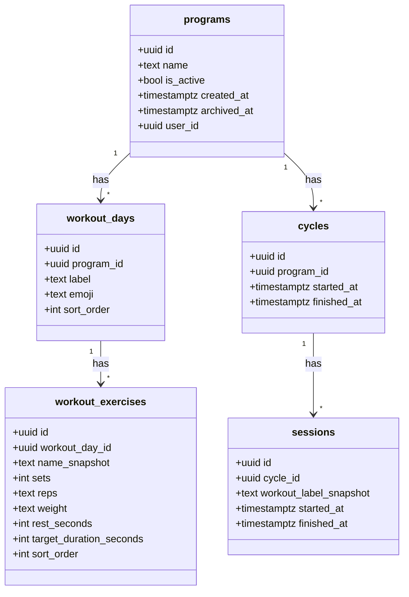
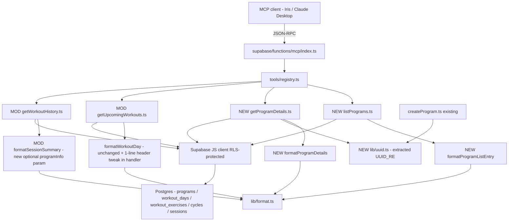

# Tech Plan — MCP — Read Programs (#276)

## Architectural Approach

### Key Decisions

| Decision | Choice | Rationale |
|---|---|---|
| Tool surface | 2 new handlers (`listPrograms.ts`, `getProgramDetails.ts`) + in-place extension of `getUpcomingWorkouts.ts` & `getWorkoutHistory.ts` | Mirrors the convention of the 6 existing tools (1 file per handler in `tools/`); registry stays declarative |
| Data fetching strategy | Single round-trip per tool via Supabase JS nested selects (`select("*, workout_days(count), cycles(id)")`) | Avoids latency × N, keeps handler logic linear; aggregate count + has_active_cycle derived in one query |
| **Spike before handler dev** | Pre-implement a 30-min validation: write a throwaway query against a local Supabase that returns `programs` + `workout_days(count)` + `cycles(id)` filtered to active-only, verify the JS-side shape, lock the exact filter syntax in the ticket | The Supabase JS nested filter syntax (`!inner` modifier vs `.filter("cycles.finished_at", "is", null)` vs `.is(...)` on a join) is the highest-uncertainty technical assumption in this plan. Validating upfront avoids shipping a silent `has_active_cycle` bug |
| UUID format in markdown | Full UUID (36 chars), wrapped in italics as `*(id: a3f0c4e5-...-def012345678)*` on every day & exercise line | Zero ambiguity, agent can cite directly into the future `update_program(id)` call without further parsing |
| Tag injection point | Pure formatters in `lib/format.ts` (handlers stay agnostic to states like `archived`, `empty program`) | Keeps formatters fully unit-testable; handlers do data, formatters do presentation |
| Formatter coupling | `formatProgramDetails` and `formatWorkoutDay` stay **separate** — accept ~10 lines of exercise-line duplication | Independence > DRY here. Coupling them would mean a change to `formatProgramDetails` could regress `getUpcomingWorkouts` |
| `formatSessionSummary` extension | Add optional param `programInfo?: { id: string; name: string }` | Backwards compatible (other callers unaffected); avoids a parallel wrapper function |
| UUID validation in `getProgramDetails` | Extract `UUID_RE` from `file:supabase/functions/mcp/tools/createProgram.ts` into a shared `file:supabase/functions/mcp/lib/uuid.ts`, reuse in both | Single source of truth; avoids duplicating the regex; keeps validation early so a malformed input never hits Supabase |
| Test framework | Vitest with `*.test.ts` naming (matches `pat.test.ts`, `jwt.test.ts`, `authLogic.test.ts`) | Existing convention, no new tooling, runs in `npm test` |
| Test scope | Pure formatters only — no handler unit tests | Handlers are thin wrappers around Supabase queries; mocking would be high-noise/low-signal. Handler validation is manual via Iris + Claude Desktop per the Epic Brief |
| Migration | None | All required fields exist; aggregates derived via JS-side mapping of nested select results |
| Data inconsistency case (`is_active=false` AND `has_active_cycle=true`) | Treated as impossible; render normally without warning | Schema doesn't enforce this invariant but it shouldn't occur in practice. Adding a warning would clutter every response for an edge that may never hit |

### Critical Constraints

- **Supabase JS nested aggregate quirk** : `programs.select("*, workout_days(count)")` returns the count as a one-element array `[{ count: N }]` — not as a scalar. The handler MUST map `row.workout_days?.[0]?.count ?? 0`. Forgetting this returns `null` or an array reference, both of which the formatter would render as garbage. Encoded explicitly in unit tests on the formatter input shape.
- **`cycles` LEFT JOIN behavior** : `cycles(id)` filtered to active-only may return an empty array OR null depending on the exact Supabase JS filter syntax used (subject of the Spike). The handler MUST derive `has_active_cycle: (row.cycles ?? []).length > 0`, never `row.cycles !== null`.
- **`archived_at IS NULL` filter on `list_programs`** : MUST be present whenever `include_archived` is false (the default). Postgres handles WHERE-then-ORDER-BY ordering automatically, so the position in the Supabase chain doesn't matter — but **forgetting the `.is("archived_at", null)` call entirely is a real bug** that would surface archived programs by default. Tested explicitly.
- **`get_workout_history` sessions without cycle** : legacy data may have `session.cycle_id IS NULL`. The nested select `sessions(cycle:cycles(program:programs(id, name)))` returns `null` chains in that case. The handler MUST treat `programInfo` as optional and pass `undefined` to the formatter — which then omits the program annotation rather than rendering `*(program: null)*`.
- **No coupling with shipped tools** : extension of `get_upcoming_workouts` and `get_workout_history` adds presentation-only output, no behavioral change. The 4 sample prompts in production must keep returning identical functional content (only the visible text gains the `*(id: ...)*` annotation).
- **Edge Function = Deno** : nested selects use the same Supabase JS API as the React app, but imports are URL-based (`https://esm.sh/@supabase/supabase-js@2.103.3`). New shared lib `lib/uuid.ts` must use `.ts` extension in imports for Deno compat, like the rest of the MCP folder.

---

## Data Model

No schema changes. The epic reads from existing tables and joins them via the Supabase JS client.



### Table Notes

- **`programs.archived_at`** : nullable `timestamptz` — a non-null value means soft-archived. Default behavior of `list_programs` filters these out unless `include_archived: true`.
- **`programs.is_active`** : a boolean enforced by app logic to be true on at most one row per user. Read-only here; not toggled by Epic A.
- **`cycles.finished_at`** : nullable. `IS NULL` ⇒ cycle is active. Used to derive `has_active_cycle` per program.
- **No `program_id` on `sessions` directly** : history → program lookup goes `sessions → cycles → programs`. Handled via nested Supabase select in `get_workout_history`.
- **`workout_exercises.weight`** : stored as text, not numeric. Existing convention — preserved as-is for read; only formatted for display via `formatWorkoutDay` (and the new `formatProgramDetails`). The per-equipment weight convention discussion (#263) belongs to Epic B / C, not here.

---

## Component Architecture

### Layer Overview



### New Files & Responsibilities

| File | Purpose |
|---|---|
| `file:supabase/functions/mcp/tools/listPrograms.ts` | Handler for `list_programs`. Reads `programs` + nested `workout_days(count)` + `cycles(id)` filtered on `archived_at` and `include_archived` arg. Maps rows → list of entries via `formatProgramListEntry`. |
| `file:supabase/functions/mcp/tools/getProgramDetails.ts` | Handler for `get_program_details`. Validates input UUID via `lib/uuid.ts`. Reads `programs` + nested `workout_days(*, workout_exercises(*))`. Returns 404-style error on miss. Renders via `formatProgramDetails`. |
| `file:supabase/functions/mcp/lib/uuid.ts` | Shared UUID validation. Exports `UUID_RE`, `isUuid(s: string): boolean`. Created by extracting from `createProgram.ts`. |
| `file:supabase/functions/mcp/lib/format.test.ts` | Vitest suite covering `formatProgramListEntry`, `formatProgramDetails`, and the new `programInfo` branch of `formatSessionSummary`. |
| `file:docs/mcp-connect/example-prompts.md` | Copy-paste system prompts for Claude Desktop & other MCP clients. Includes 2 example flows minimum: "Review my draft program", "Compare two programs side by side". |

### Modified Files & Responsibilities

| File | Change |
|---|---|
| `file:supabase/functions/mcp/lib/format.ts` | Add `formatProgramListEntry(entry)` and `formatProgramDetails(program, days, exercisesByDay)`. Extend `formatSessionSummary(session, sets, programInfo?)` with new optional 3rd arg. |
| `file:supabase/functions/mcp/tools/getUpcomingWorkouts.ts` | One-line tweak in the markdown header: `## Upcoming Workouts — ${program.name} *(id: ${program.id})*`. No behavior change. |
| `file:supabase/functions/mcp/tools/getWorkoutHistory.ts` | Extend the Supabase select to nest `cycle:cycles(program:programs(id, name))`. Pass derived `programInfo` to `formatSessionSummary` for each session. |
| `file:supabase/functions/mcp/tools/createProgram.ts` | Replace local `UUID_RE` and `isUuid()` with import from `lib/uuid.ts`. No behavior change. |
| `file:supabase/functions/mcp/tools/registry.ts` | Import the 2 new tools and push them into the `tools` array. |
| `file:skills/gymlogic-mcp/SKILL.md` | Add the 2 new tools to the roster. Add a "Discovery flow" section. Annotate L188 with the forward-looking note about Epic C. |

### Component Responsibilities

**`listPrograms.ts` handler**
- Reads `args.include_archived: boolean` (default `false`).
- Builds query: `supabase.from("programs").select("id, name, is_active, created_at, archived_at, workout_days(count), cycles(id)")` with `.is("archived_at", null)` when `!include_archived`, the active-cycle filter on `cycles.finished_at` (exact syntax locked by the Spike), and `.order("is_active", { ascending: false }).order("created_at", { ascending: false })`.
- Maps each row to `{ id, name, is_active, day_count: row.workout_days?.[0]?.count ?? 0, created_at, has_active_cycle: (row.cycles ?? []).length > 0, archived_at }`.
- Delegates rendering to `formatProgramListEntry` per row, joins entries into a single markdown response.
- Empty list → returns `"Aucun programme. Crée-en un dans le builder pour commencer."` (consistent with existing tool messaging).
- Error path → `isError: true` with the supabase error message prefixed by `Error fetching programs:`.

**`getProgramDetails.ts` handler**
- Reads `args.program_id: string` (required).
- Validates via `isUuid()` from `lib/uuid.ts`. Invalid → `isError: true` with `"Invalid program_id format (expected UUID)."`.
- Builds query: `supabase.from("programs").select("id, name, archived_at, workout_days(id, label, emoji, sort_order, workout_exercises(id, name_snapshot, sets, reps, weight, rest_seconds, target_duration_seconds, sort_order))").eq("id", program_id).maybeSingle()`.
- Empty result → `isError: true` with `"Program not found or you don't have access."` (deliberately uniform message, no 404/403 distinction).
- Sorts `workout_days` by `sort_order` and `workout_exercises` within each day by `sort_order` defensively (Postgres order on nested may not be guaranteed).
- Delegates rendering to `formatProgramDetails(program, days, exercisesByDay)`.

**`lib/uuid.ts`**
- Pure module. Exports `UUID_RE = /^[0-9a-f]{8}-[0-9a-f]{4}-[0-9a-f]{4}-[0-9a-f]{4}-[0-9a-f]{12}$/i` and `isUuid(s: string): boolean`.
- Imported by `getProgramDetails.ts` (new), `createProgram.ts` (refactor), and any future tool that takes UUID args (Epic C will reuse).

**`formatProgramListEntry`** *(new in `lib/format.ts`)*
- Pure function. Signature: `(entry: { id, name, is_active, day_count, created_at, has_active_cycle, archived_at }) => string`.
- Returns one markdown line per program, e.g.:
  - `**Mai 2026 v2** *(id: a3f0c4e5-...-678)* — 6 days, created 2026-05-01 (active, cycle in progress)`
  - `**Avril 2026** *(id: ...)* — 4 days, created 2026-04-01 (archived)`
- Suffix logic: `(active, cycle in progress)` / `(active)` / `(draft)` / `(archived)` based on flags.

**`formatProgramDetails`** *(new in `lib/format.ts`)*
- Pure function. Signature: `(program: { id, name, archived_at }, days: Array<{ id, label, emoji, ... }>, exercisesByDay: Map<string, Array<{ id, name_snapshot, sets, reps, weight, rest_seconds, target_duration_seconds }>>) => string`.
- Returns:
  ```
  ## **{name}** *(id: {full uuid})* {(archived)?}

  ### {emoji} {label} *(id: {day uuid})*
    - **{name_snapshot}** *(id: {ex uuid})*: {sets} × {reps} reps @ {weight} kg (rest {rest_seconds}s)
    - ...
  ```
- For an empty program (0 days): replaces the day blocks with a single line `_(empty program — no days defined)_`.
- **Does NOT call `formatWorkoutDay`** — the exercise line is duplicated (~10 lines) intentionally to keep the two formatters independent.

**`formatSessionSummary`** *(modified in `lib/format.ts`)*
- New 3rd optional param `programInfo?: { id: string; name: string }`.
- When provided, the date line becomes: `### {workout_label_snapshot} — {date} *(program: {name}, id: {id})*`.
- When omitted, behavior is identical to today (no regression for any other caller — there are none currently outside `getWorkoutHistory`).

### Failure Mode Analysis

| Failure | Behavior |
|---|---|
| `list_programs` on an account with 0 programs | Returns success response with text `"Aucun programme. Crée-en un dans le builder pour commencer."` Not an error. |
| `list_programs` while Supabase is down | `isError: true` with `Error fetching programs: <supabase message>`. Same pattern as existing tools. |
| `get_program_details` with malformed UUID (e.g. `"abc"`) | `isError: true` with `"Invalid program_id format (expected UUID)."` — caught by `isUuid()` before query. |
| `get_program_details` with valid-format UUID that doesn't exist or isn't owned by the user | `isError: true` with `"Program not found or you don't have access."` — RLS empty + `maybeSingle()`. Uniform message. |
| `get_program_details` on a program with 0 days (created in builder, never populated) | Success response. Header rendered normally; body shows `_(empty program — no days defined)_`. |
| `get_program_details` on an archived program | Success response. Header includes `(archived)` tag after the program name. |
| `get_workout_history` with sessions whose `cycle_id IS NULL` (legacy data) | Success response. Affected sessions render without the `*(program: ...)*` annotation; other sessions (with cycles) include it. No null leak in markdown. |
| Programme `is_active = true` AND `archived_at IS NOT NULL` | Excluded from default `list_programs` results. Visible only with `include_archived: true`, where it appears with `(archived)` suffix despite `is_active` being true. |
| Programme `is_active = false` AND `has_active_cycle = true` (data inconsistency) | Rendered normally. Treated as impossible — schema invariant should hold in practice. No warning, no special handling. |
| Supabase nested aggregate returns `count: 0` for an empty program in `list_programs` | Mapped to `day_count: 0` via `?? 0`. Not null. Tested explicitly. |
| Spike fails (Supabase nested filter syntax doesn't work as expected) | Fall back to the alternative explored in the spike: separate the cycle check into a second query (programs + cycles independently, joined in JS). Document the actual syntax in the ticket. |
| MCP client (Claude Desktop) renders italic markdown literally instead of italicizing | Caught at manual validation step (Q10 of Epic Brief). No preventive workaround. |
