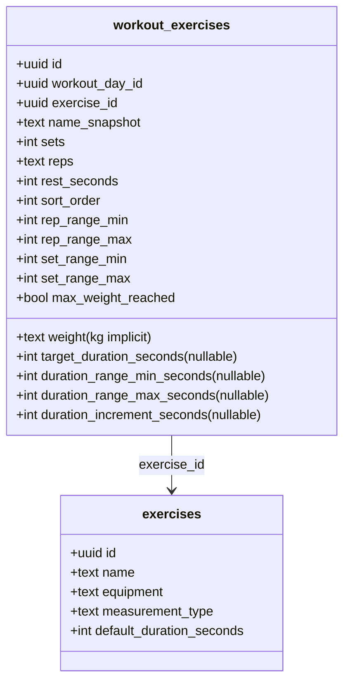
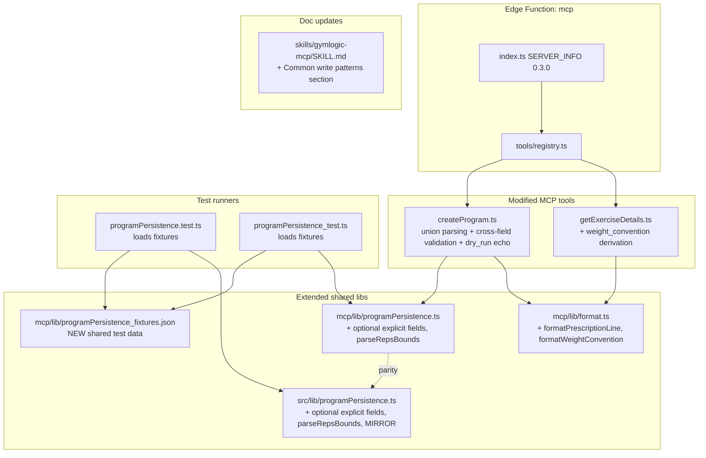

# Tech Plan — MCP — create_program Prescription (#276)

## Architectural Approach

### Key Decisions

| Decision | Choice | Rationale |
|---|---|---|
| **Input schema shape** | Union via JSON Schema `oneOf`: `exercises: (string | { exercise_id, sets, reps, weight_kg, rest_seconds, target_duration_seconds? })[]`. **Drop** `exercise_ids: string[]` entirely | Breaking change is cheap now (<2 months prod, near-zero usage); permanent dual-shape would be permanent debt. Union is well-supported JSON Schema, agents discover both forms via `tools/list`. |
| **Object form completeness** | All-or-nothing: bare `string` uses defaults; object MUST include `sets`, `reps`, `weight_kg`, `rest_seconds`. `target_duration_seconds` required iff exercise is duration-mode | Avoids "agent emits half a prescription, user thinks it's complete". String shorthand still allows the lazy "just add this exo with defaults" path. |
| **Range field semantics** | Frozen on explicit values for non-bodyweight (linear/double progression as agent specified); auto-derived for bodyweight regardless | Linear progression (`"8"` → `8/8`) is a valid training schema. Double progression (`"8-12"` → `8/12`) maps cleanly to existing engine. Bodyweight has special `max_weight_reached: true` semantics that depend on auto-derived ranges to enable progression at all. |
| **`reps` accepted formats** | `/^\d+$/` or `/^\d+-\d+$/`. Reject `"AMRAP"`, `"MAX"`, `"failure"`, `"5+"` | Aligns with the in-app builder placeholder `"ex. 8-12"`. Keywords break the progression engine (`parseInt(NaN)`); reject explicitly with clear error. |
| **Cross-field validation** | Reject `weight_kg`/`reps` on duration exercises; reject `target_duration_seconds` on reps exercises; reject `weight_kg > 0` on bodyweight | Each rejection cites the catalog `equipment` / `measurement_type` field that triggered it. Prevents silent semantic corruption. |
| **`weight_convention` field** | Derived in `getExerciseDetails.ts` handler from `equipment`. No DB column, no migration. Values: `"per_hand"` for `dumbbell`/`kettlebell`, `"bodyweight"` for `bodyweight`, `"total"` for the rest | Single source of truth in code; trivial to update if a new equipment type is added. Pure derivation = no risk of stale denormalization. Fallback for unknown equipment = `"total"` (most common bucket) with a server-side warning log. |
| **Dry_run preview echo** | Each prescribed exercise rendered with the resolved convention (e.g. *"4 × 10 × 25 kg per hand (50 kg total per rep)"*). New helper `formatPrescriptionLine` in `lib/format.ts` | Forces the propose-confirm-act handshake on the user side: they see the resolved total before saying "go". |
| **Server version** | `SERVER_INFO.version`: `"0.2.0"` → `"0.3.0"` | Pre-1.0 minor bump tolerates breaking per semver. Major bump deferred until Epic C ships and the contract is fully stable. |
| **`programPersistence.ts` extension** | Add optional fields to `GeneratedExerciseForProgram`: `repRangeMin?`, `repRangeMax?`, `setRangeMin?`, `setRangeMax?`, `weight?`, `targetDurationSeconds?`, `durationRangeMinSeconds?`, `durationRangeMaxSeconds?`. Persistence derives only the undefined ones | Web AI flow (`AIProgramPreviewStep.handleCreate`) continues to pass the existing fields → all optional fields undefined → existing auto-derivation kicks in. Zero behavior change for the web caller. |
| **`parseRepsBounds` helper signature** | Returns `{ min: number, max: number }` only (no `current` field) | The DB has no `current_reps` column — `current` would die after a format string. Keep the helper minimal and aligned with what's actually stored. |
| **Edge/web parity mechanism** | Shared JSON fixture file `supabase/functions/mcp/lib/programPersistence_fixtures.json`. Vitest and Deno test both load it and assert the same expected outputs | Detects drift automatically at PR time. Coupling cost = low (just a JSON file); benefit = high (the real bug class is undetected divergence). |
| **Validation order** | Handler-side, in this order: (1) shape parsing, (2) per-field bounds, (3) reps regex, (4) catalog fetch, (5) cross-field rules requiring catalog, (6) build rows | Mirrors existing `createProgram.ts` ordering. Cross-field validation needs catalog (for `equipment`/`measurement_type`), so it follows the fetch step. |
| **Backwards-incompat error message** | Detect legacy `exercise_ids` key; return error with both new shape examples and `0.3.0` minimum version string | Self-documenting migration: agent reads error, fixes call site without external doc lookup. |
| **`SKILL.md` updates** | Surgical patches to the existing `create_program` row in the tool roster + new section "Common write patterns" with 4-5 worked examples (linear, double progression, mixed reps/duration day, dumbbell, bodyweight rejection) | Per Epic Brief decision — surgical for known sections, additive for new patterns to maximize zero-shot value. |
| **Validation bounds (new)** | `sets`: 1-10. `reps` numeric: 1-50. `weight_kg`: 0-500. `rest_seconds`: 0-600. `target_duration_seconds`: 5-600. `MAX_DAYS = 14`, `MAX_EXERCISES_PER_DAY = 40` preserved | Bounds picked to cover 99% legit use + reject obvious typos (e.g. weight in lbs misread as kg, rest of 1 day, etc.). Errors name the field, the offending value, and the bound. |

### Critical Constraints

**`programPersistence.ts` lives in two places** — `file:supabase/functions/mcp/lib/programPersistence.ts` (Edge / Deno) and `file:src/lib/programPersistence.ts` (web / Vite). The Edge file's header explicitly says "keep in sync". Any extension MUST land in BOTH and pass `npx vitest run src/lib/programPersistence.test.ts` plus `deno test supabase/functions/mcp/lib/programPersistence_test.ts`. The new shared JSON fixture file enforces parity automatically.

**`workout_exercises.weight` is `TEXT NOT NULL DEFAULT '0'`** — string, not numeric. Cast `weight_kg: number` to `String(weight_kg)` on insert. Existing convention preserved.

**`workout_exercises.reps` is `TEXT`** — accepts `"8"`, `"8-12"`, etc. Range syntax `"8-12"` is stored as-is and parsed downstream. The current `parseInt(ge.reps, 10)` call in `programPersistence.ts:70` truncates `"8-12"` to `8` — but for the freeze path we need to parse BOTH bounds. New helper `parseRepsBounds(reps: string): { min: number; max: number }` handles this: `"8"` → `{min: 8, max: 8}`; `"8-12"` → `{min: 8, max: 12}`; non-matching → `{min: 8, max: 12}` (legacy fallback).

**Bodyweight + `max_weight_reached: true` interaction** — `programPersistence.ts:88` forces `max_weight_reached: true` for `equipment === "bodyweight"`. With the bodyweight exception (always auto-derive ranges), the engine has REPS_UP and SETS_UP available but WEIGHT_UP blocked → double progression to PLATEAU. This is the desired behavior; no change to the bodyweight semantics in this PR.

**Progression engine handles `min === max` correctly** — verified during grilling: with `rep_range: 8/8, set_range: 4/4` and `max_weight_reached: false`, the engine triggers WEIGHT_UP every successful session (linear progression mode). **Open assumption** — covered by the new fixture cases but not exercised live yet.

**RLS scoping unchanged** — all queries continue through `createUserClient(authHeader)` (`file:supabase/functions/mcp/lib/supabaseClient.ts`). `programs` / `workout_days` / `workout_exercises` policies untouched.

**`AIProgramPreviewStep.handleCreate` is the canary for web parity** — it calls `buildWorkoutExerciseInsertRowsForDay(insertedDay.id, day.exercises)` directly with `GeneratedExercise[]`. After Epic B, the type extension adds optional fields; the existing call site passes none of them → behavior identical. **The existing `programPersistence.test.ts` cases must continue passing without modification** to confirm web non-regression.

**Cold start neutrality** — extension adds ~150 LOC + 1 fixture file. Bundle size impact negligible. p95 cold start unaffected.

---

## Data Model

No new tables, no new columns, no migration. The epic operates entirely on existing schema.



### Tool input/output shapes (TypeScript)

```ts
// create_program (extended) — replaces the v0.2 shape
type CreateProgramInput = {
  name: string
  days: Array<{
    label: string
    exercises: Array<
      | string                                    // bare UUID = legacy defaults
      | {
          exercise_id: string
          sets: number                            // required, 1-10
          reps: string                            // required, /^\d+$/ or /^\d+-\d+$/, 1-50
          weight_kg: number                       // required, 0-500 (rejected if equipment===bodyweight && >0)
          rest_seconds: number                    // required, 0-600
          target_duration_seconds?: number        // required if measurement_type==='duration', rejected otherwise; 5-600
        }
    >
  }>
  dry_run?: boolean // default true
}

type CreateProgramDryRunOutput = {
  dry_run: true
  program: { name: string; is_active: true; template_id: null }
  days: Array<{
    sort_order: number
    label: string
    emoji: string
    workout_exercises: Array<{
      // ... full insert payload (sans workout_day_id)
    }>
    rendered: Array<string> // human-readable echo, one line per exercise
                            // e.g. "DB Curl — 4 × 8-12 × 15 kg per hand (30 kg total per rep) — 90s rest"
  }>
  note: string
}

type CreateProgramApplyOutput = {
  dry_run: false
  program_id: string
  workout_day_ids: string[]
  message: string
}

// get_exercise_details (extended) — additive, no breaking change
// Returns markdown string with a new line:
// "**Weight convention:** per_hand (per dumbbell)"  /  "total (full bar / stack)"  /  "bodyweight (no external load)"

// Internal: programPersistence.ts extended type
interface GeneratedExerciseForProgram {
  exercise: CatalogExerciseForProgram
  sets: number
  reps: string
  restSeconds: number
  isCompound: boolean
  // NEW — all optional, web AI flow continues to pass none of these:
  weight?: string                  // explicit weight, falls back to "0"
  targetDurationSeconds?: number   // explicit duration, falls back to catalog default
  repRangeMin?: number             // explicit freeze, falls back to autoderiv
  repRangeMax?: number
  setRangeMin?: number
  setRangeMax?: number
  durationRangeMinSeconds?: number // explicit freeze, falls back to autoderiv
  durationRangeMaxSeconds?: number
}
```

---

## Component Architecture

### Layer Overview



### New Files & Responsibilities

| File | Purpose |
|---|---|
| `supabase/functions/mcp/lib/programPersistence_fixtures.json` | Single source of truth for `programPersistence` test cases. Array of `{ name, input: { exercise_props, sets, reps, restSeconds, weight?, targetDurationSeconds?, repRangeMin?, repRangeMax?, setRangeMin?, setRangeMax? }, expected_row: {...} }`. Loaded by both Vitest and Deno test. |

### Modified Files & Responsibilities

| File | Change |
|---|---|
| `supabase/functions/mcp/index.ts` | Bump `SERVER_INFO.version`: `"0.2.0"` → `"0.3.0"` |
| `supabase/functions/mcp/tools/createProgram.ts` | Drop `exercise_ids` validation. Add union parsing (string \| object). Add per-field bounds validation. Add reps regex parsing via new `parseRepsBounds` helper. Add cross-field rules after catalog fetch (bodyweight+weight, duration+reps, target_duration+reps mutual exclusion). Build the extended `GeneratedExerciseForProgram` with explicit fields when object form provided. Render `dry_run` output with `formatPrescriptionLine` per exercise. Emit migration error when `exercise_ids` key detected at top level. Tool description rewritten end-to-end with examples. |
| `supabase/functions/mcp/tools/getExerciseDetails.ts` | Add `weight_convention` line in the markdown output: *"**Weight convention:** per_hand (per dumbbell)"* / *"total (full bar / stack)"* / *"bodyweight (no external load)"*. Derived from `equipment` via `formatWeightConvention(equipment)` from `lib/format.ts`. |
| `supabase/functions/mcp/lib/programPersistence.ts` | Extend `GeneratedExerciseForProgram` with the optional explicit fields. `buildWorkoutExerciseInsertRow` reads them and falls back to derivation when undefined. Add `parseRepsBounds(reps: string): { min, max }` helper (also exported for tests and `createProgram` handler). |
| `src/lib/programPersistence.ts` | Mirror Edge changes (same type extension, same fallback logic, same `parseRepsBounds`). Run `npx vitest run src/lib/programPersistence.test.ts` to confirm parity. |
| `supabase/functions/mcp/lib/programPersistence_test.ts` | Refactor existing 3 cases to load from the shared fixture. Add cases for: linear freeze, double-progression range, bodyweight auto-derive ignores explicit ranges, duration with explicit target_duration_seconds, reps regex bounds. |
| `src/lib/programPersistence.test.ts` | Same refactor: existing 6 cases load from fixture. New cases shared with the Deno suite. |
| `supabase/functions/mcp/lib/format.ts` | Add `formatPrescriptionLine(catalogExercise, prescription, convention): string` and `formatWeightConvention(equipment): "per_hand" \| "total" \| "bodyweight"` helpers. Used by both `createProgram` (dry_run echo) and `getExerciseDetails` (markdown line). Unknown equipment falls back to `"total"` with a `console.warn`. |
| `skills/gymlogic-mcp/SKILL.md` | Surgical patch to the `create_program` tool roster row (new shape mention). New section "Common write patterns" with ≥4 worked examples (linear, double progression, mixed reps/duration day, dumbbell weight, bodyweight rejection). |

### Component Responsibilities

**`createProgram.ts` (the meat)**

1. **Auth guard** — unchanged.
2. **Input shape parse** — top-level `name`, `days`, `dry_run`. Detect legacy `exercise_ids` at any day level → return migration error with new shape examples + `"server version 0.3.0 required"`.
3. **Per-day shape parse** — `label` non-empty, `exercises` array non-empty, max 40 entries.
4. **Per-exercise shape normalization** — for each entry, detect string vs object. If object, validate all required fields present (`sets`, `reps`, `weight_kg`, `rest_seconds`). If `target_duration_seconds` present, store it for cross-field validation later.
5. **Per-field bounds validation** — `sets` ∈ [1, 10], `weight_kg` ∈ [0, 500], `rest_seconds` ∈ [0, 600], `target_duration_seconds` ∈ [5, 600].
6. **`reps` regex validation** — `/^\d+$/` or `/^\d+-\d+$/`. Bounds: each integer ∈ [1, 50]; if range, min ≤ max. Reject otherwise with structured error.
7. **Fetch catalog** — single `IN (...)` query, same as today. Returns `equipment`, `measurement_type`, `default_duration_seconds`.
8. **Cross-field validation** (requires catalog):
   - For each object-form exercise: if `equipment === "bodyweight"` AND `weight_kg > 0` → reject with link to #281.
   - If `measurement_type === "duration"` AND object form has `weight_kg > 0` OR `reps !== "0"` → reject (use `target_duration_seconds` instead).
   - If `measurement_type === "reps"` AND `target_duration_seconds` provided → reject (use `reps` instead).
   - If `measurement_type === "duration"` AND object form AND `target_duration_seconds` not provided → reject (required for duration).
9. **Build `GeneratedExerciseForProgram`** — for object form, populate the optional explicit fields from the prescription (with `parseRepsBounds` for `reps` → `repRangeMin/Max`). For string form, leave optional fields undefined → defaults apply.
10. **Dry_run path** — call `buildWorkoutExerciseInsertRowsForDay`, then for each row build a human-readable line via `formatPrescriptionLine(catalogExercise, row, weightConvention)`. Return JSON payload + `rendered` array per day.
11. **Apply path** — same compensating-rollback logic as today. No changes.

**`programPersistence.ts` extension (Edge + web)**

- `parseRepsBounds(reps: string): { min: number; max: number }`:
  - `/^\d+$/` → `{ min: parsed, max: parsed }` (linear freeze)
  - `/^\d+-\d+$/` → `{ min: minParsed, max: maxParsed }` (range freeze)
  - else → `{ min: 8, max: 12 }` (legacy fallback, matches current `parseInt(NaN)` behavior)
- `buildWorkoutExerciseInsertRow(workoutDayId, ge, sortOrder)`:
  - `weight: ge.weight ?? "0"` (string)
  - `target_duration_seconds: ge.targetDurationSeconds ?? (isDuration ? defaultSec : null)`
  - **Bodyweight branch**: if `isBodyweight`, derive `rep_range_min/max` and `set_range_min/max` from `ge.sets` + `parseRepsBounds(ge.reps)` IGNORING `ge.repRangeMin/Max/setRangeMin/Max`. Same for `duration_range_min/max_seconds`.
  - **Non-bodyweight branch with explicit ranges**: if `ge.repRangeMin != null`, use `ge.repRangeMin/Max/setRangeMin/Max/durationRangeMin/MaxSeconds` directly.
  - **Default branch**: existing auto-derivation formula.

**`getExerciseDetails.ts` extension**

- Add `**Weight convention:** {formatWeightConvention(equipment)}` line in the meta block.
- One-line change in `formatExercise`. No handler logic change.

**`format.ts` new helpers**

- `formatWeightConvention(equipment: string): "per_hand" | "total" | "bodyweight"` — pure function:
  - `dumbbell`, `kettlebell` → `"per_hand"`
  - `bodyweight` → `"bodyweight"`
  - Anything else → `"total"` + `console.warn` if not in the known list (`barbell`, `machine`, `cable`, `ez_bar`, `plate-loaded`)
- `formatPrescriptionLine(exerciseName, sets, reps, weightKg, restSeconds, targetDurationSeconds, weightConvention): string` — produces the dry_run echo line. Examples:
  - `"DB Curl — 4 × 8-12 × 15 kg per hand (30 kg total per rep) — 90s rest"`
  - `"Bench Press — 4 × 8 × 80 kg total — 120s rest"`
  - `"Push-up — 4 × 12 (bodyweight) — 60s rest"`
  - `"Plank — 4 × 45s (duration) — 60s rest"`

### Failure Mode Analysis

| Failure | Behavior |
|---|---|
| Agent calls with legacy `exercise_ids: [...]` shape | Detect at parse step, return error: *"`exercise_ids` is no longer supported in v0.3.0. Use `exercises: ['uuid', ...]` for defaults or `exercises: [{ exercise_id, sets, reps, weight_kg, rest_seconds }, ...]` for explicit prescription. See SKILL.md 'Common write patterns'."* No DB writes. |
| Agent passes object form missing required field (e.g. omits `rest_seconds`) | Reject before catalog fetch: *"days[2].exercises[1] is in object form — required fields: sets, reps, weight_kg, rest_seconds. Missing: rest_seconds. Use bare UUID string for defaults instead."* |
| Agent passes `reps: "AMRAP"` | Reject at regex step: *"days[0].exercises[3].reps must match `/^\d+$/` or `/^\d+-\d+$/`. Got: 'AMRAP'. For lazy paths use bare UUID string instead of object form."* |
| Agent passes `reps: "5-3"` (max < min) | Reject: *"days[0].exercises[2].reps range invalid: max (3) < min (5). Got: '5-3'."* |
| Agent passes `weight_kg: 25` for `equipment === "bodyweight"` | Reject after catalog fetch: *"days[1].exercises[0] (Push-up) is bodyweight — weight_kg > 0 not supported in v0.3.0. Weighted bodyweight tracked in #281. Pass weight_kg: 0 or use bare UUID."* |
| Agent passes `reps: "8"` for `measurement_type === "duration"` | Reject: *"days[2].exercises[1] (Plank) is a duration exercise — reps not allowed; use target_duration_seconds instead."* |
| Agent passes `target_duration_seconds: 30` for reps exercise | Reject: *"days[0].exercises[2] (Bench Press) is a reps exercise — target_duration_seconds not allowed; use reps instead."* |
| Agent passes object form for duration without `target_duration_seconds` | Reject: *"days[2].exercises[0] (Plank) is duration — object form requires target_duration_seconds. Use bare UUID for catalog default."* |
| `weight_kg: 1000` (bound exceeded) | Reject: *"days[0].exercises[1].weight_kg = 1000 exceeds max 500. (Did you confuse lbs with kg? — divide by 2.205)"* |
| `sets: 0` | Reject: *"days[0].exercises[2].sets = 0; min 1, max 10."* |
| `rest_seconds: -5` | Reject: *"days[0].exercises[1].rest_seconds = -5; must be ≥ 0, max 600."* |
| Mixed string + object exercises in same day | Both forms accepted independently. String → defaults; object → explicit. Test fixture covers this. |
| Catalog `equipment` value unknown (e.g. typo, new equipment type added later) | `formatWeightConvention` falls back to `"total"` + `console.warn` for observability. Tool description warns the agent to verify if `weight_convention === "total"` for an unfamiliar equipment value. |
| Bodyweight + explicit prescription `reps: "8"` | Object form accepted. Bodyweight branch in persistence ignores `repRangeMin/Max` and auto-derives `6/10`. `weight_kg` MUST be 0 (else previous failure mode triggers). |
| Concurrent `is_active` toggle during apply | Same risk as today — last write wins. No new mitigation needed. |
| Apply path fails partway (network blip mid-INSERT) | Existing compensating rollback in `createProgram.ts` already handles this. No changes. |
| Edge runs `programPersistence` v0.3.0, web still on v0.2.0 (deploy lag) | Web AI flow doesn't use the new fields → behavior identical. The reverse (Edge stale, web new) doesn't trigger because web doesn't push any new fields. |
| Fixture file added but not loaded by one runner (test wiring bug) | CI catches: missing assertion fails the suite. Fixture loader path is constant + literal in both test files. |
| Fixture case missing for a new `programPersistence` behavior | PR description checklist: *"any new behavior in programPersistence requires a fixture case"*. Reviewer enforces. |
| AIProgramPreviewStep build breaks because new optional fields change inference | Verified mitigation: all new fields are strict `T | undefined`. Existing call sites pass none of them → identical row output. Existing Vitest cases are unchanged in expected output. |

---

## Implementation Sequence (proposed checklist for the PR)

1. **Bump `SERVER_INFO.version`** in `index.ts` to `"0.3.0"`.
2. **Add `parseRepsBounds` + extend `GeneratedExerciseForProgram`** in BOTH `programPersistence.ts` files.
3. **Update `buildWorkoutExerciseInsertRow` branches** (bodyweight, explicit, default) in BOTH files.
4. **Create `programPersistence_fixtures.json`** with the existing 6 web cases + the new behavior cases.
5. **Refactor both test files** to load from the fixture. Confirm both runners green with no behavior change for the legacy cases.
6. **Add `formatWeightConvention` + `formatPrescriptionLine`** in `lib/format.ts`.
7. **Extend `getExerciseDetails.ts`** with the convention line. Single-line markdown patch + helper call.
8. **Rewrite `createProgram.ts` validation block** end-to-end: legacy detection, union parsing, per-field bounds, regex, catalog fetch, cross-field rules, build, dry_run echo. Apply path unchanged structurally.
9. **Rewrite `createProgram.ts` tool description** with the new shape, the regex rules, the cross-field rules, and a reference to `get_exercise_details.weight_convention`.
10. **Update `SKILL.md`** — surgical patch to the `create_program` row + new "Common write patterns" section.
11. **Manual E2E** — at least 2 prompts (one linear, one double progression) executed via Iris (primary) and Claude Desktop. Capture the dry_run echo + final DB diff in the PR description.

---

## Out of Scope (this PR)

- `update_program` — Epic C, tracked in [#280](https://github.com/PierreTsia/workout-app/issues/280).
- Weighted bodyweight exercises (weighted dips, pullups, weight-vest) — tracked in [#281](https://github.com/PierreTsia/workout-app/issues/281).
- Schema migrations or new DB columns.
- Allowing the agent to pass `set_range_min/max` or `rep_range_min/max` directly.
- Per-set prescription overrides.
- Weight unit conversion (lbs/kg) — all values are kg by convention.
- Backfill / migration of existing programs.
- Deprecation period — pure breaking with a clear migration error message.
- Modifying the in-app web AI generation flow.

---

## References

- Epic Brief: `file:docs/Epic_Brief_—_MCP_—_create_program_Prescription_#276.md`
- Parent Tech Plan: `file:docs/Tech_Plan_—_MCP-First_Architecture_#231_Phase_2_and_3.md`
- Combined predecessor (Epic A+B+C reference): `file:docs/done/Tech_Plan_—_MCP_—_Read_&_Edit_Programs_#276.md`
- Issue #276 (parent), #280 (Epic C), #281 (weighted bodyweight)
- Existing handler: `file:supabase/functions/mcp/tools/createProgram.ts`
- Persistence (Edge): `file:supabase/functions/mcp/lib/programPersistence.ts`
- Persistence (web mirror): `file:src/lib/programPersistence.ts`
- Web AI flow caller: `file:src/components/create-program/AIProgramPreviewStep.tsx`
- Progression engine: `file:src/lib/progression.ts`
- Skill (write convention to be updated): `file:skills/gymlogic-mcp/SKILL.md`
