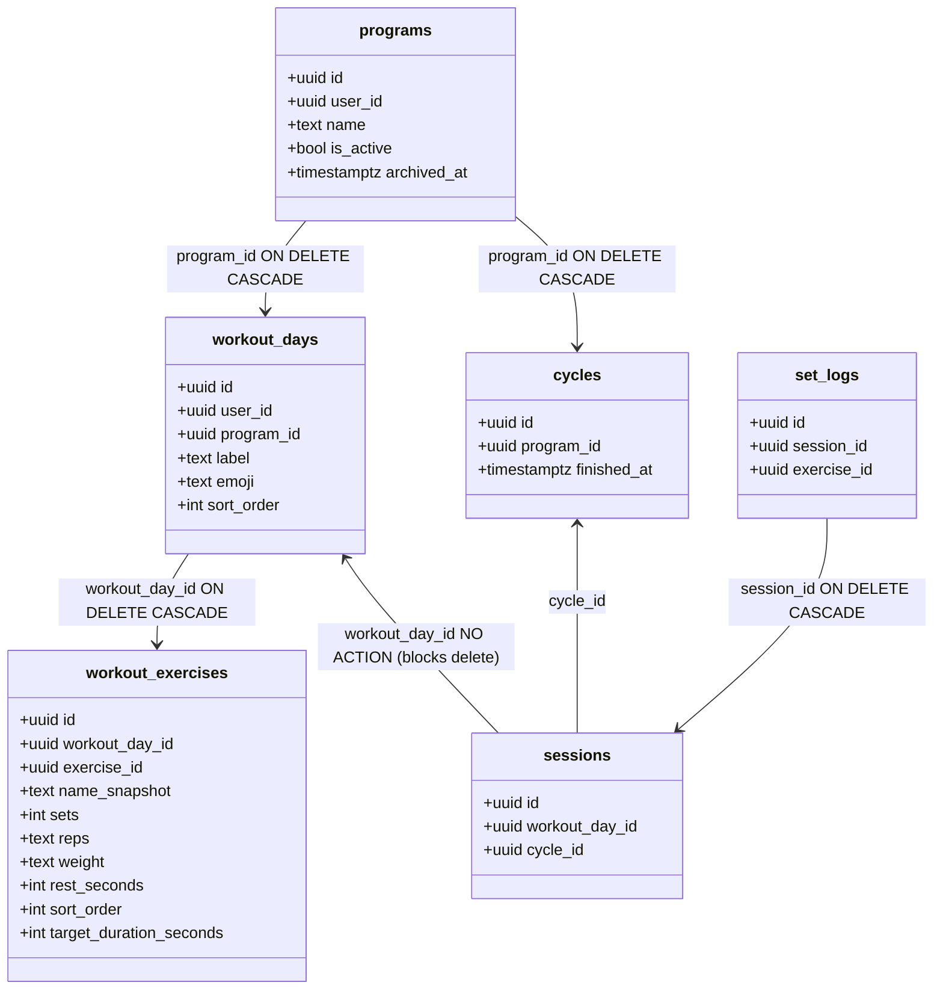
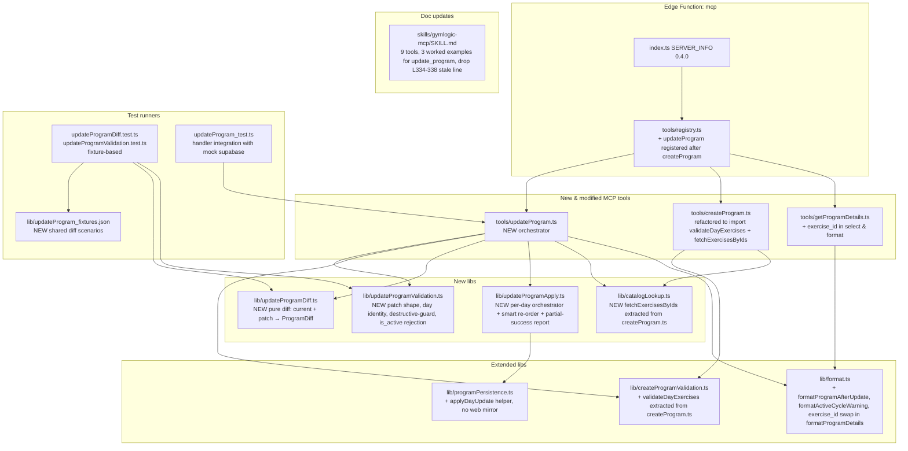

# Tech Plan — MCP — update_program (#280)

## Architectural Approach

### Key Decisions


| Decision                          | Choice                                                                                                                                                                                                                                                                                                                                                                                                                                                                                                          | Rationale                                                                                                                                                                                                                                |
| --------------------------------- | --------------------------------------------------------------------------------------------------------------------------------------------------------------------------------------------------------------------------------------------------------------------------------------------------------------------------------------------------------------------------------------------------------------------------------------------------------------------------------------------------------------- | ---------------------------------------------------------------------------------------------------------------------------------------------------------------------------------------------------------------------------------------- |
| **Patch shape**                   | PATCH at top-level (`name?`, `days?`, `dry_run?`, `confirm?`), declarative full-list inside `days` when supplied. `days: []` rejected.                                                                                                                                                                                                                                                                                                                                                                          | Allows trivial rename without re-sending day structure; declarative inside `days` keeps diff calculation deterministic and dry_run preview unambiguous.                                                                                  |
| **Day identity semantics**        | Optional `id` on each day input. Present + matches → UPDATE. Absent → INSERT. Existing day not in payload → DELETE (FK pre-check first). Position in `days[]` array → `sort_order`. Duplicate `id`s rejected at validation.                                                                                                                                                                                                                                                                                     | Stable `workout_days.id` already preserved by Postgres `gen_random_uuid()`. Implicit position-as-sort_order mirrors `create_program` and avoids exposing `sort_order` to the agent.                                                      |
| **Exercise prescription shape**   | Strict mirror of `create_program` (Epic B union): bare-string UUID → defaults; object form requires ALL prescription fields. Reuse `parseExerciseInput`, `validateExerciseCrossFields`, `parseRepsBounds`, `BOUNDS` from `createProgramValidation.ts` as-is.                                                                                                                                                                                                                                                    | Symmetry with create reduces surface and bugs; agent already has the per-day current state via `get_program_details` so re-sending the full day is acceptable verbosity.                                                                 |
| **Validation extraction**         | New helper `validateDayExercises(rawExercises, dayLabel, catalogById) → { ok: true, parsed } | { ok: false, error }` extracted from `createProgram.ts`. Both create + update import it. Existing primitives (`parseExerciseInput`, etc.) unchanged.                                                                                                                                                                                                                                                             | Plumbing around the per-exercise primitives (loop + accumulate errors + structured output) was duplicated by Epic B; Epic C extracts now to prevent drift. Mini-refactor of create handler in scope, no behavior change.                 |
| **Catalog lookup extraction**     | `fetchExercisesByIds` (currently private in `createProgram.ts:99-121`) extracted into new `lib/catalogLookup.ts`. Both create + update import it. Bundled with the validation extraction (same refactor ticket T2).                                                                                                                                                                                                                                                                                             | Same drift-prevention rationale as `validateDayExercises`; the function is non-trivial and lives at the catalog/validation boundary.                                                                                                     |
| **Diff module**                   | Pure function `lib/updateProgramDiff.ts`: `computeProgramDiff(currentProgram, parsedPatch) → ProgramDiff`. Returns `{ name_change, days_to_insert, days_to_update, days_to_delete, days_unchanged }`.                                                                                                                                                                                                                                                                                                           | The diff is the central piece of Epic C — extracting it isolates complexity, makes it trivially testable, and produces a structured result that both dry_run renderer and apply orchestrator consume.                                    |
| **Execution strategy**            | Per-day wipe-and-reinsert of `workout_exercises` rows for every day present in the patch (whether INSERT or UPDATE). Days absent from the patch are not touched.                                                                                                                                                                                                                                                                                                                                                | Safe because nothing references `workout_exercises.id` (`set_logs.exercise_id` points at `exercises`, verified). Mirror of `create_program` insert path — reuses `buildWorkoutExerciseInsertRowsForDay`.                                 |
| **Apply order**                   | Default order: name change → deletes → updates → inserts. **Smart re-order escape hatch**: if applying deletes-first would transit through a 0-days state for the program (i.e. `current.days.length - days_to_delete.length + 0 === 0` when at least one insert is also planned), inverse the order to inserts-first → deletes-last.                                                                                                                                                                           | Default order is simplest and protects against sort_order collisions. The escape hatch handles the pathological case "drain to 0, then refill" without ever leaving the program in an empty intermediate state on failure.               |
| **Atomicity**                     | Per-day atomic, no cross-day rollback. All validation passes BEFORE any DB write to minimize mid-flight failure causes (only transient infra issues should land here). Partial-success report on apply failure.                                                                                                                                                                                                                                                                                                 | Acted in grilling: cross-day transactional safety would require Postgres RPC migration, not justified for MVP. Documented limitation in tool description.                                                                                |
| **Partial-success report**        | Apply response includes `applied_days[]` (with each day's ops), `failed_at: { day_label, error } | null`, `remaining_days[]`, and a `message` field that **explicitly explains the retry path**: *"To retry, submit a new patch containing only the remaining_days (with their `id`s) plus any corrections; applied_days are already up to date and should be omitted from `days[]` (or included with their existing `id` to be left unchanged)."*                                                              | Without explicit retry guidance, the agent must figure out itself that omitting an already-applied day from `days[]` would re-DELETE it. Subtle invariant — surfaced in the message.                                                     |
| **Dry_run output**                | Full result (program-as-it-will-be) + auxiliary sections: `removed_days[]` (with `id, label, session_count, blocking`), `added_days[]`, `warnings[]` (mid-cycle), `errors[]` (FK violations). Non-empty `errors[]` returns `isError: true` and blocks apply.                                                                                                                                                                                                                                                    | Acted in grilling: full-result for symmetry with create, auxiliary diff for the issue's "removed days with session_count" requirement.                                                                                                   |
| `**confirm: true` requirement**   | Required when `dry_run: false` AND patch removes ≥1 day. Otherwise rejected with explicit error stating count of removed days.                                                                                                                                                                                                                                                                                                                                                                                  | Acted in grilling: friction proportional to destructiveness. Benign edits stay 1-call.                                                                                                                                                   |
| **Active-cycle warning**          | Plain string in `warnings[]` (both dry_run and apply): *"Cycle actif depuis YYYY-MM-DD — cette modification affecte vos workouts restants dans ce cycle."* Single query: `cycles WHERE program_id=X AND finished_at IS NULL`.                                                                                                                                                                                                                                                                                   | Acted in grilling: simple string is sufficient for both human readability and agent parsing. Structured shape can be added later without breaking.                                                                                       |
| **FK pre-check**                  | Single batched query: `SELECT workout_day_id, count(*) FROM sessions WHERE workout_day_id IN (<ids_to_delete>) GROUP BY workout_day_id`. Block with structured error when `count > 0` for any candidate.                                                                                                                                                                                                                                                                                                        | One round-trip regardless of N days to delete. Trivial to implement vs N queries.                                                                                                                                                        |
| `**get_program_details` change**  | Replace `workout_exercises.id` (slot id) with `exercise_id` (catalog UUID) in markdown format. Single line patched in `format.ts:268`, single field added to `select` in `getProgramDetails.ts:69`. T1 of the epic.                                                                                                                                                                                                                                                                                             | Slot id is consumed nowhere downstream (verified via repo grep at T1). Without `exercise_id` exposure, agent must `search_exercises` for every preserved exercise — fragile (name collisions, accents).                                  |
| **Server version bump**           | `SERVER_INFO.version`: `"0.3.x"` → `"0.4.0"` (additive minor)                                                                                                                                                                                                                                                                                                                                                                                                                                                   | New tool + read-side `exercise_id` exposure. The slot_id swap is technically markdown-breaking but markdown is informal output; agents should not string-match opaque IDs.                                                               |
| `**SKILL.md` updates**            | Bump tool count 8 → 9. Add `update_program` row to roster with 3 worked examples (rename only, add day, swap exercise + revise prescription). Drop legacy *"single-day editing is out of scope"* line at L334-338.                                                                                                                                                                                                                                                                                              | Per Epic Brief; agent loads SKILL.md as zero-shot context.                                                                                                                                                                               |
| `**is_active` field rejection**   | If patch contains `is_active` at top level, reject with explicit error pointing to future `set_active_program` tool — not a generic "unknown field".                                                                                                                                                                                                                                                                                                                                                            | The DB has a partial unique index `programs_active_unique` that would conflict with create-time activation. Explicit error message guides agents away from the dead-end.                                                                 |
| **Validation order**              | Handler-side, in this order: (1) auth + program ownership check, (2) top-level patch shape (`program_id` UUID, `name?` non-empty, `days?` array, `is_active` rejection), (3) per-day shape + day identity rules (id in current set, no duplicates), (4) reuse `validateDayExercises` for per-day exercises (with catalog fetch interleaved), (5) compute diff, (6) FK pre-check on `days_to_delete`, (7) destructive-guard (`confirm` flag), (8) build apply plan. Apply only when dry_run=false AND no errors. | Mirrors `createProgram.ts` ordering. Catalog fetch happens once for all exercise_ids across all days in the patch (single `IN (...)` query via the new shared helper). Ownership check first guards against confusing downstream errors. |
| **No web mirror for new helpers** | `lib/updateProgramDiff.ts`, `lib/updateProgramValidation.ts`, `lib/updateProgramApply.ts`, and the new `applyDayUpdate` helper live ONLY in `supabase/functions/mcp/lib/`. No `src/lib/` mirror.                                                                                                                                                                                                                                                                                                                | `update_program` is strictly MCP-only; no web caller. The existing `programPersistence.ts` mirror remains untouched.                                                                                                                     |


### Critical Constraints

**RLS scoping is the security backbone** — `programs` policy is `FOR ALL USING (auth.uid() = user_id)` (`file:supabase/migrations/20260314000002_create_programs.sql:12-16`); `workout_days` policy is identical (`file:supabase/migrations/20240101000002_create_workout_days.sql:12-13`). Handler uses `createUserClient(authHeader)` (`file:supabase/functions/mcp/lib/supabaseClient.ts`) — any UPDATE / DELETE / INSERT for a row not owned by the caller silently no-ops (PostgREST returns 0 rows affected, no error). The handler MUST check the initial program SELECT returns `data !== null` and return *"Program not found or you don't have access."* (mirror `file:supabase/functions/mcp/tools/getProgramDetails.ts:81-85`).

`**workout_days.user_id` is `NOT NULL` and FK to `auth.users`** (`file:supabase/migrations/20240101000002_create_workout_days.sql:3`). For each new day INSERT, the handler must pass `user_id` — fetched once via `supabase.auth.getUser()` at the top of the handler. `create_program` already does this (`file:supabase/functions/mcp/tools/createProgram.ts:418-420`).

`**workout_days.program_id` is `NOT NULL ON DELETE CASCADE**` (`file:supabase/migrations/20260314000008_add_program_id_to_workout_days.sql:3-4`). Programs deletion would cascade to days — irrelevant to `update_program` but means we can never end up with orphan days from a partial apply.

`**sessions.workout_day_id` is `REFERENCES workout_days(id)` with NO `ON DELETE` clause** (`file:supabase/migrations/20240101000004_create_sessions.sql:4`). Effective behavior is `NO ACTION` — Postgres refuses to delete a `workout_days` row while a session points at it. The pre-check handles this ergonomically; the DB constraint is the safety net if the pre-check is ever bypassed.

`**set_logs.exercise_id` references `exercises(id)`, NOT `workout_exercises(id)`** (`file:supabase/migrations/20240101000005_create_set_logs.sql:4`). This is THE invariant that makes wipe-and-reinsert safe: deleting/reinserting `workout_exercises` rows breaks no FK from set_logs. **If this ever changes**, Epic C's execution strategy is invalidated.

`**workout_exercises.exercise_id` is `NOT NULL REFERENCES exercises(id)`** (`file:supabase/migrations/20240101000003_create_workout_exercises.sql:4`). Each INSERT must reference a valid catalog id — the catalog fetch step covers this.

`**workout_exercises.name_snapshot` must be re-fetched from catalog at INSERT time**, even for "preserved" exercises in an UPDATE day. If the catalog name changed since the program was created, the new snapshot reflects the current name. Same convention as `create_program` (`file:supabase/functions/mcp/tools/createProgram.ts:43-46`).

`**weight` is `TEXT NOT NULL DEFAULT '0'`** in `workout_exercises` — string, not numeric. Cast `weight_kg: number` to `String(weight_kg)` on INSERT. Reused as-is from `programPersistence.ts`.

`**is_active` toggling is explicitly excluded** from the input schema. The partial unique index `programs_active_unique` on `(user_id) WHERE is_active = true` (`file:supabase/migrations/20260314000002_create_programs.sql:18-19`) would conflict with create-time activation logic; out of scope per Epic Brief. Handler returns a specific error pointing at the future `set_active_program` tool when an agent passes `is_active` in the patch (rather than a generic "unknown field").

**Validation order matters for security** — the program ownership check (step 1) must happen BEFORE validating day identities (step 3). Otherwise an agent passing a day `id` from another user's program gets a confusing "unknown day id" error instead of "program not found". Cleaner UX + tighter security signal.

`**createProgramValidation.ts` is shared, not renamed** — `update_program` imports as-is. New helpers `validateDayExercises` (extracted from `createProgram.ts`) and `fetchExercisesByIds` (extracted into `lib/catalogLookup.ts`) are added to the shared surface. Cohabitation acceptable — names are imperfect but rename is yak-shaving.

**Apply order escape hatch invariant**: when computing the plan, if `current.days.length - days_to_delete.length === 0` AND `days_to_insert.length > 0`, the apply plan is reversed: inserts go first (creating new days), then deletes. This guarantees the program is never observably empty mid-flight (even if the apply fails after some deletes, the new days have already landed). For all other patterns, default delete → update → insert order applies.

**Cold start neutrality** — new tool + new modules add ~700 LOC + 1 fixture file. Bundle size impact negligible. No new external dependencies.

---

## Data Model

No schema changes, no new tables, no new columns, no migration. Epic C operates entirely on existing schema.




### Tool input/output shapes (TypeScript)

```ts
// update_program input
type UpdateProgramInput = {
  program_id: string                              // required, UUID
  name?: string                                   // optional rename, non-empty when present
  days?: Array<{
    id?: string                                   // present → UPDATE; absent → INSERT
    label: string                                 // required, non-empty
    emoji?: string                                // optional, defaults to current value if id provided
    exercises: Array<                             // required, non-empty (≥1 per day invariant)
      | string                                    // bare UUID = legacy defaults (3×10 @ 0kg, 90s rest)
      | {
          exercise_id: string
          sets: number                            // 1-10
          reps: string                            // /^\d+$/ or /^\d+-\d+$/, 1-50
          weight_kg: number                       // 0-500 (rejected if equipment===bodyweight && >0)
          rest_seconds: number                    // 0-600
          target_duration_seconds?: number        // required iff measurement_type==='duration'; 5-600
        }
    >
  }>
  dry_run?: boolean                               // default true
  confirm?: boolean                               // default false; required when patch removes ≥1 day
}

// computeProgramDiff output (lib/updateProgramDiff.ts)
type ProgramDiff = {
  program_id: string
  name_change: { from: string; to: string } | null
  days_to_insert: Array<{
    label: string
    emoji?: string
    sort_order: number                            // position in patch.days
    parsed_exercises: ParsedExercise[]            // already validated
  }>
  days_to_update: Array<{
    id: string
    current: { label: string; emoji: string; sort_order: number }
    label: string                                 // possibly unchanged
    emoji: string                                 // resolved (kept current if not provided)
    sort_order: number                            // possibly unchanged
    parsed_exercises: ParsedExercise[]
  }>
  days_to_delete: Array<{
    id: string
    label: string
    session_count: number                         // populated after FK pre-check
    blocking: boolean                             // true iff session_count > 0
  }>
  days_unchanged: Array<{ id: string; label: string }>
  apply_order: "default" | "insert_first"        // smart re-order flag (set by post-diff orchestrator)
}

// dry_run output
type UpdateProgramDryRunOutput = {
  dry_run: true
  program: {                                      // full state as it will be after apply
    id: string
    name: string
    workout_days: Array<{
      id: string | null                           // null for new days (no id yet)
      label: string
      emoji: string
      sort_order: number
      workout_exercises: Array<{
        exercise_id: string
        name_snapshot: string                     // resolved from catalog
        sets: number
        reps: string
        weight: string
        rest_seconds: number
        target_duration_seconds: number | null
        sort_order: number
      }>
    }>
  }
  rendered: string                                // human-readable markdown using formatProgramAfterUpdate
  removed_days: Array<{ id: string; label: string; session_count: number; blocking: boolean }>
  added_days: Array<{ label: string }>
  warnings: string[]                              // mid-cycle warning string when applicable
  errors: Array<{ day_label: string; error: string }>  // FK violations etc.
  note: string                                    // "Dry-run — set dry_run: false to apply (and confirm: true if removing days)."
}

// apply output (success or partial)
type UpdateProgramApplyOutput = {
  dry_run: false
  program_id: string
  applied_days: Array<{
    id: string                                    // workout_days.id (or null for an insert that succeeded — id captured from RETURNING)
    label: string
    ops: Array<"meta_changed" | "exercises_replaced" | "inserted" | "deleted">
  }>
  failed_at: { day_label: string; error: string } | null  // null on full success
  remaining_days: Array<{ label: string; intent: "delete" | "update" | "insert" }>
  warnings: string[]                              // mid-cycle warning
  message: string                                 // includes explicit retry guidance on partial success
}
```

---

## Component Architecture

### Layer Overview




### New Files & Responsibilities


| File                                                         | Purpose                                                                                                                                                                                                                                                                                                                                                                                                |
| ------------------------------------------------------------ | ------------------------------------------------------------------------------------------------------------------------------------------------------------------------------------------------------------------------------------------------------------------------------------------------------------------------------------------------------------------------------------------------------ |
| `supabase/functions/mcp/tools/updateProgram.ts`              | The handler. Orchestrates: auth → fetch current program (RLS-protected) → parse patch shape → validate day identities → catalog fetch (via `catalogLookup`) → call `validateDayExercises` per day → call `computeProgramDiff` → FK pre-check on delete candidates → enforce `confirm` for destructive patches → render dry_run output OR call `applyProgramDiff`. Tool definition + handler. ~250 LOC. |
| `supabase/functions/mcp/lib/updateProgramDiff.ts`            | Pure function `computeProgramDiff(currentProgram: CurrentProgramSnapshot, parsedPatch: ParsedPatch): ProgramDiff`. Zero side effects, zero external calls. Decides what changed, how, and computes the `apply_order` flag based on the smart-reorder invariant. ~140 LOC.                                                                                                                              |
| `supabase/functions/mcp/lib/updateProgramValidation.ts`      | `parsePatchShape(rawArgs)` (top-level shape, `is_active` rejection). `validateDayIdentities(days, currentDayIds)` (no duplicates, all provided ids exist). `requireConfirmForDestructive(diff, confirm)` (destructive-guard). All return `{ ok: true, value } | { ok: false, error }`. ~180 LOC.                                                                                                       |
| `supabase/functions/mcp/lib/updateProgramApply.ts`           | `applyProgramDiff(supabase, diff, catalogById, userId): Promise<ApplyResult>` — orchestrates per the diff's `apply_order` flag. Tracks `applied_days[]`, returns `failed_at` and `remaining_days[]` on first failure. Builds the partial-success message with explicit retry guidance. ~200 LOC.                                                                                                       |
| `supabase/functions/mcp/lib/catalogLookup.ts`                | `fetchExercisesByIds(supabase, ids): Promise<{ data: CatalogExerciseForProgram[]; error: string | null }>` — extracted from `createProgram.ts:99-121`. Single `IN (...)` query, error message names missing ids. ~30 LOC.                                                                                                                                                                              |
| `supabase/functions/mcp/lib/updateProgram_fixtures.json`     | Diff scenarios: rename only, add day, remove day clean, remove day blocked, swap exercise, mixed (add + remove + update), reorder, no-op patch, smart-reorder pathological case (drain to 0 + refill), edge cases. Loaded by `updateProgramDiff.test.ts`.                                                                                                                                              |
| `supabase/functions/mcp/lib/updateProgramDiff.test.ts`       | Vitest. Loads `updateProgram_fixtures.json` and asserts diff output matches expected for each scenario. Pure function = pure tests.                                                                                                                                                                                                                                                                    |
| `supabase/functions/mcp/lib/updateProgramValidation.test.ts` | Vitest. Patch shape failures, day identity duplicates, unknown ids, destructive-guard with confirm omitted/present, `is_active` rejection.                                                                                                                                                                                                                                                             |
| `supabase/functions/mcp/tools/updateProgram_test.ts`         | Deno test. Handler integration with a fake supabase client (in-memory state, RLS simulated by user_id filter). Scenarios: rename success, add day success, remove day with sessions blocked, mid-cycle warning present, partial success when fake supabase errors at day 2, full success, dry_run returns 0 writes, smart-reorder applied for drain-to-0+refill.                                       |


### Modified Files & Responsibilities


| File                                                                 | Change                                                                                                                                                                                                                                                                                                                                                                                                                           |
| -------------------------------------------------------------------- | -------------------------------------------------------------------------------------------------------------------------------------------------------------------------------------------------------------------------------------------------------------------------------------------------------------------------------------------------------------------------------------------------------------------------------- |
| `supabase/functions/mcp/index.ts`                                    | Bump `SERVER_INFO.version`: `"0.3.x"` → `"0.4.0"`.                                                                                                                                                                                                                                                                                                                                                                               |
| `supabase/functions/mcp/tools/registry.ts`                           | Import `updateProgram`, append after `createProgram` in the `tools` array (becomes 9-element).                                                                                                                                                                                                                                                                                                                                   |
| `supabase/functions/mcp/tools/createProgram.ts`                      | Refactor: extract the per-day exercise validation loop (currently inline lines ~280-330) into `validateDayExercises` (new helper in `createProgramValidation.ts`). Replace inline `fetchExercisesByIds` (lines 99-121) with import from `lib/catalogLookup.ts`. Call sites reduced. NO behavior change — existing tests must pass unchanged.                                                                                     |
| `supabase/functions/mcp/lib/createProgramValidation.ts`              | Add new exported helper `validateDayExercises(rawExercises, dayLabel, catalogById): { ok: true, parsed: ParsedExercise[] } | { ok: false, error: string }`. Wraps the loop: per-exercise `parseExerciseInput` → catalog lookup (passed in by caller) → `validateExerciseCrossFields`. Catalog is passed in (caller batches the fetch).                                                                                           |
| `supabase/functions/mcp/tools/getProgramDetails.ts`                  | Extend `select`: add `exercise_id` to the inner `workout_exercises(...)` projection (line 69). Extend `WorkoutExerciseRow` type with `exercise_id: string`. Extend the mapping at line 95-99 to forward `exercise_id` to the format helper.                                                                                                                                                                                      |
| `supabase/functions/mcp/lib/format.ts`                               | Update `ProgramDetailsExercise` type: add `exercise_id: string`. Update `formatProgramDetails` line 268: render `*(exercise_id: ${ex.exercise_id})*` instead of `*(id: ${ex.id})*`. Add `formatProgramAfterUpdate(diff, currentProgram, catalogById): string` helper for dry_run rendering. Add `formatActiveCycleWarning(cycle: { started_at: string }): string` for the warning text.                                          |
| `supabase/functions/mcp/lib/programPersistence.ts`                   | Add `applyDayUpdate(supabase, dayId, parsedExercises, catalogById, userId)` helper: DELETE existing `workout_exercises` rows for that day, then INSERT new ones via `buildWorkoutExerciseInsertRowsForDay`. Returns `{ ok: true, inserted_count } | { ok: false, error }`. Edge-only, no web mirror.                                                                                                                             |
| `supabase/functions/mcp/tools/getProgramDetails.test.ts` (if exists) | Update assertion strings: `exercise_id` instead of slot `id` in markdown.                                                                                                                                                                                                                                                                                                                                                        |
| `skills/gymlogic-mcp/SKILL.md`                                       | Bump tool count 8 → 9 in the roster. Add `update_program` row with: brief description, input shape examples, when-to-use guidance. New "Common write patterns" sub-section with 3 worked examples: (a) rename only `{ program_id, name: "PPL v2" }`, (b) add a day to existing 3-day split, (c) swap an exercise + revise prescription on a single day. Drop the legacy line at L334-338 *"single-day editing is out of scope"*. |


### Component Responsibilities

`**tools/updateProgram.ts` (the handler — orchestration only)**

1. **Auth guard** — same pattern as existing handlers; bail with *"Authentication required..."* if `supabase` is null.
2. **Fetch user_id** — `await supabase.auth.getUser()`. Required for new day INSERTs.
3. **Parse patch shape** — `parsePatchShape(args)` (top-level fields, `is_active` rejection). Bail on shape error.
4. **Fetch current program** — `select("id, name, workout_days(id, label, emoji, sort_order, workout_exercises(exercise_id, name_snapshot, sets, reps, weight, rest_seconds, target_duration_seconds, sort_order))")` filtered by `program_id`. RLS does the ownership check. If `data === null` → *"Program not found or you don't have access."*
5. **Validate day identities** — `validateDayIdentities(parsedPatch.days, currentDayIds)`. Catches unknown ids and duplicates BEFORE any expensive catalog fetch.
6. **Catalog fetch (batched)** — collect every `exercise_id` referenced across all days, single call to `fetchExercisesByIds(supabase, ids)`.
7. **Validate per-day exercises** — for each day in `parsedPatch.days`, call `validateDayExercises(rawExercises, dayLabel, catalogById)`. Accumulate errors; bail if any.
8. **Compute diff** — `computeProgramDiff(currentProgram, parsedPatch)`. Pure. Sets `apply_order` flag.
9. **FK pre-check (batched)** — single `select workout_day_id, count(*) from sessions where workout_day_id in (<delete_candidates>) group by workout_day_id`. Annotate `diff.days_to_delete` entries with `session_count` and `blocking`.
10. **Active cycle check** — `select started_at from cycles where program_id = X and finished_at is null limit 1`. If row exists, build warning string for `warnings[]`.
11. **Build dry_run errors** — collect blocking days into `errors[]`. If non-empty AND we're in dry_run, return preview with `isError: true` so agent doesn't try to apply.
12. **Branch on `dry_run*`*:
  - **dry_run=true (default)**: render preview output (full program-after, removed/added sections, warnings, errors, note) via `formatProgramAfterUpdate`. Return.
    - **dry_run=false**:
      - Destructive-guard: if `diff.days_to_delete.length > 0` AND `confirm !== true` → return error.
      - Blocking errors: if `errors.length > 0` → return error (FK violation reported earlier).
      - Call `applyProgramDiff(supabase, diff, catalogById, userId)`. Return apply output (with `applied_days`, `failed_at`, `remaining_days`, `warnings`, retry-aware `message`).

`**lib/updateProgramDiff.ts` (the brain)**

```ts
export function computeProgramDiff(
  current: CurrentProgramSnapshot,
  patch: ParsedPatch,
): ProgramDiff
```

- `name_change`: `current.name !== patch.name` ? `{ from, to }` : `null`. (When `patch.name === undefined`, treat as no change.)
- If `patch.days === undefined`: all `days_to_*` empty, `days_unchanged = current.days`.
- Else: iterate `patch.days`. For each entry:
  - `id` provided + matches a current day → `days_to_update` (record current as `current` for diff visibility, resolve `emoji` to provided-or-current).
  - `id` absent → `days_to_insert` with `sort_order = position-in-patch`.
- `days_to_delete = current.days.filter(d => !patch.days.some(p => p.id === d.id))`.
- `days_unchanged`: empty when `patch.days` provided (because every patch day → update or insert). When `patch.days` undefined, all current days.
- `apply_order`: `"insert_first"` iff `current.days.length - days_to_delete.length === 0` AND `days_to_insert.length > 0`. Otherwise `"default"`.

`**lib/updateProgramValidation.ts**`

- `parsePatchShape(args)`:
  - `program_id`: required, must be UUID (`isUuid`).
  - `**is_active` field at top level**: explicit rejection with custom message: *"`is_active` is not editable via update_program. Use the dedicated `set_active_program` tool (coming soon)."* Surfaced before the generic "unknown field" check.
  - `name`: optional. If present, must be non-empty trimmed string.
  - `days`: optional. If present, must be array, length ≥1 and ≤14. Each element: `label` non-empty string, `emoji?` string, `id?` UUID, `exercises` array length 1-40.
  - `dry_run`: optional boolean, default `true`.
  - `confirm`: optional boolean, default `false`.
- `validateDayIdentities(patchDays, currentDayIds)`:
  - For each `patchDays[i].id` provided: must be in `currentDayIds`. Error message names the offending position and suggests *"omit the id to create a new day"*.
  - No two patchDays share the same `id`. Error names both positions.
- `requireConfirmForDestructive(diff, confirm)`:
  - If `diff.days_to_delete.length > 0` AND `confirm !== true` → error: *"Patch removes N day(s): X, Y, Z. Pass `confirm: true` along with `dry_run: false` to apply, or revise the payload to keep these days."*

`**lib/updateProgramApply.ts`**

- `applyProgramDiff(supabase, diff, catalogById, userId): Promise<ApplyResult>`:
  - **Step 0**: if `diff.name_change`: `update programs set name = ... where id = ...`. On error, return `{ applied: [], failed_at: { day_label: '<program name>', error }, remaining: [...all days] }`.
  - **Compute apply plan** based on `diff.apply_order`:
    - `"default"`: `[deletes, updates, inserts]` (concat in this order).
    - `"insert_first"`: `[inserts, deletes, updates]`.
  - **Per-day loop**: for each `op` in plan:
    - `delete`: DELETE workout_exercises (for safety, even though CASCADE would handle), DELETE workout_day. Add `{ id, label, ops: ["deleted"] }` to `applied[]` on success.
    - `update`: UPDATE workout_days set label/emoji/sort_order, then `applyDayUpdate(supabase, day.id, parsed, catalogById, userId)`. Add `{ id, label, ops: ["meta_changed", "exercises_replaced"] }` (or just one of them if only one changed). On error, return.
    - `insert`: INSERT workout_day (returning id), then INSERT workout_exercises via `buildWorkoutExerciseInsertRowsForDay`. Add `{ id, label, ops: ["inserted"] }`.
    - On any error: return `{ applied, failed_at: { day_label, error }, remaining: <unprocessed ops as { label, intent }> }`.
  - **Build message** on partial success: explicitly include the retry guidance: *"Updated N days. Failed at day '**'. M days remaining. To retry, submit a new patch containing only the remaining_days (with their `id`s) plus any corrections; applied_days are already up to date and should be omitted from `days[]` (or included with their existing `id` to be left unchanged)."*
  - On full success: `{ applied, failed_at: null, remaining: [], message: "Updated <total> days." }`.

`**lib/programPersistence.ts` extension**

```ts
export async function applyDayUpdate(
  supabase: SupabaseClient,
  dayId: string,
  parsedExercises: ParsedExercise[],
  catalogById: Map<string, CatalogExerciseForProgram>,
  userId: string,
): Promise<{ ok: true } | { ok: false; error: string }>
```

- DELETE `workout_exercises WHERE workout_day_id = dayId` (RLS scopes to user).
- Build rows via `buildWorkoutExerciseInsertRowsForDay(dayId, parsedExercises.map(p => geFromParsed(p, catalogById.get(...))), userId)`.
- INSERT.
- Return result.

`**lib/catalogLookup.ts` (new shared module)**

```ts
export async function fetchExercisesByIds(
  supabase: SupabaseClient,
  ids: string[],
): Promise<{ data: CatalogExerciseForProgram[]; error: string | null }>
```

- Direct lift from `createProgram.ts:99-121`. Single `IN (...)` query, error message names missing ids.

`**tools/getProgramDetails.ts` extension**

- Single line patched in `select`: add `exercise_id` to the projection.
- Single line patched in `WorkoutExerciseRow` type.
- Forward `exercise_id` through the mapping at line 95-99 (no logic change).
- Markdown rendering changes in `format.ts` (see below).

`**lib/format.ts` changes**

- `ProgramDetailsExercise` type: add `exercise_id: string`.
- `formatProgramDetails` line 268: change from `*(id: ${ex.id})*` to `*(exercise_id: ${ex.exercise_id})*`. The slot `id` field stays in the type (defensive) but is no longer rendered.
- New helper `formatProgramAfterUpdate(diff, currentProgram, catalogById): string` — renders the dry_run "what it will look like" markdown section. Reuses `formatPrescriptionLine` per exercise.
- New helper `formatActiveCycleWarning(cycle: { started_at: string }): string` — returns the localized French warning string.

### Failure Mode Analysis


| Failure                                                                                                     | Behavior                                                                                                                                                                                                                                                                                                                                  |
| ----------------------------------------------------------------------------------------------------------- | ----------------------------------------------------------------------------------------------------------------------------------------------------------------------------------------------------------------------------------------------------------------------------------------------------------------------------------------- |
| `program_id` not a UUID                                                                                     | `parsePatchShape` rejects: *"Invalid program_id format (expected UUID)."* No DB queries.                                                                                                                                                                                                                                                  |
| `program_id` valid but program doesn't exist or doesn't belong to user                                      | Initial SELECT returns null (RLS filters out non-owned rows). Handler returns *"Program not found or you don't have access."*                                                                                                                                                                                                             |
| Patch contains `is_active: true` at top level                                                               | `parsePatchShape` rejects with specific error: *"`is_active` is not editable via update_program. Use the dedicated `set_active_program` tool (coming soon)."*                                                                                                                                                                             |
| `name: ""` (empty after trim)                                                                               | `parsePatchShape` rejects: *"`name` must be a non-empty string when provided."*                                                                                                                                                                                                                                                           |
| `days: []` (empty array)                                                                                    | `parsePatchShape` rejects: *"`days` must be a non-empty array when provided. Omit the field entirely to leave days unchanged, or pass at least one day."*                                                                                                                                                                                 |
| Day with `exercises: []`                                                                                    | `validateDayExercises` rejects: *"days[i].exercises must be a non-empty array (≥1 exercise per day)."*                                                                                                                                                                                                                                    |
| Day `id` doesn't match any current day                                                                      | `validateDayIdentities` rejects: *"days[i].id '**' is not a day of program **. Omit the id to create a new day, or check the id."*                                                                                                                                                                                                        |
| Same day `id` appears twice in `days[]`                                                                     | `validateDayIdentities` rejects: *"days[i] and days[j] both reference id '**'. Each day id may appear at most once in the patch."*                                                                                                                                                                                                        |
| Day `label` missing or empty                                                                                | `parsePatchShape` rejects: *"days[i].label must be a non-empty string."*                                                                                                                                                                                                                                                                  |
| Patch removes a day that has logged sessions                                                                | FK pre-check populates `session_count > 0`, dry_run output includes structured error in `errors[]`, apply rejected before any write: *"Cannot remove day '**' — it has N logged sessions. Rename or repurpose it instead, or remove the corresponding entries from the patch and resubmit."* (Same message in dry_run preview AND apply.) |
| Patch removes a day, agent calls `dry_run: false` without `confirm: true`                                   | Apply rejected: *"Patch removes 1 day(s): 'Cardio'. Pass `confirm: true` along with `dry_run: false` to apply, or revise the payload."* No DB writes.                                                                                                                                                                                     |
| Patch drains to 0 days then re-adds new days (e.g. complete program restructure)                            | `apply_order: "insert_first"` set by diff. Apply does inserts before deletes — program is never observably empty. If insert fails partway, the original days are still present. If deletes fail later, the new days are present + the old days that failed to delete. Failure report makes the partial state explicit.                    |
| Mid-cycle update (active cycle exists for this program)                                                     | `warnings[]` contains: *"Cycle actif depuis YYYY-MM-DD — cette modification affecte vos workouts restants dans ce cycle."* Both dry_run and apply. Warning is informational, does NOT block.                                                                                                                                              |
| Apply: program rename SQL fails (transient)                                                                 | Return early: `applied = []`, `failed_at = { day_label: '<program-rename>', error }`, `remaining = [...diff.days_to_*]`.                                                                                                                                                                                                                  |
| Apply: day 2 of 4 fails mid-flight (DB connection blip)                                                     | Days 1 succeeded. `applied = [day1_summary]`, `failed_at = { day_label: 'day2', error }`, `remaining = [day3, day4]`. Message includes explicit retry guidance.                                                                                                                                                                           |
| Concurrent edit during apply (user changes day 2 in-app while agent applies)                                | Last-write-wins. Documented limitation in tool description. No detection.                                                                                                                                                                                                                                                                 |
| Catalog fetch returns fewer rows than requested (some `exercise_id` invalid)                                | `fetchExercisesByIds` returns error: *"Unknown or inaccessible exercise_id(s): **."* No DB writes.                                                                                                                                                                                                                                        |
| Cross-field validation fails (e.g. `weight_kg: 25` for `Push-up` bodyweight)                                | `validateExerciseCrossFields` rejects: *"days[i].exercises[j] (**) is bodyweight — weight_kg > 0 not supported. See #281 for weighted-bodyweight tracking."* (Same as create_program; reused as-is.)                                                                                                                                      |
| Patch with `days` containing all currently-existing day ids + same data + no new days                       | Diff: `days_to_update = current.days`, `days_to_insert = []`, `days_to_delete = []`. Apply wipes-and-reinserts every day's exercises (idempotent, no-op-equivalent). Acceptable.                                                                                                                                                          |
| Patch with `name` unchanged + `days` undefined                                                              | `name_change = null`, `days_to_*` all empty. Handler returns success message *"No changes to apply."* — short-circuits before any DB writes (in both dry_run and apply).                                                                                                                                                                  |
| Patch with `id` provided but matching day already has the requested `label`/`emoji` AND identical exercises | `days_to_update` populated (we're in the patch), but the apply will still wipe-and-reinsert exercises (per design — idempotent, simple). Acceptable noise.                                                                                                                                                                                |
| Patch tries to insert a 15th day (exceeds `MAX_DAYS = 14`)                                                  | `parsePatchShape` rejects with the existing bound: *"days: too many entries (max 14)."*                                                                                                                                                                                                                                                   |
| Slot id no longer in markdown breaks an agent that string-matched it                                        | Markdown contract is informal; agents should not parse opaque IDs. If a real consumer surfaces, add back as `slot_id: X, exercise_id: Y`. T1's acceptance criterion includes a repo grep to confirm no consumer.                                                                                                                          |
| `getProgramDetails` test asserting on old markdown string fails after T1                                    | Update assertion as part of T1. Required.                                                                                                                                                                                                                                                                                                 |
| `createProgram.ts` behavior changes after T2 refactor                                                       | Existing `createProgramValidation.test.ts` cases must pass unchanged AND existing `getProgramDetails.test.ts`-equivalent cases must pass unchanged. Required acceptance criterion of T2.                                                                                                                                                  |
| Web caller of `programPersistence.applyDayUpdate` would be a regression                                     | None planned — `applyDayUpdate` lives in `supabase/functions/mcp/lib/`, not in `src/lib/`. Web doesn't see it.                                                                                                                                                                                                                            |


---

## Implementation Sequence (proposed checklist for the epic)

1. **T1 — `get_program_details` exposes `exercise_id`** (S, AFK, no deps). Replaces slot id in markdown. Updates type, select, format, tests. Verifies no downstream consumer of slot id via repo grep.
2. **T2 — Extract `validateDayExercises` + `fetchExercisesByIds`** (S/M, AFK, no deps). Pure refactor of `createProgram.ts`. New `lib/catalogLookup.ts` + new helper in `createProgramValidation.ts`. Existing `createProgram.ts` tests must pass unchanged.
3. **T3 — `updateProgramDiff.ts` + fixtures + tests** (M, AFK, no infra deps). Pure function, full TDD red-green-refactor. Lands the brain of Epic C in isolation.
4. **T4 — `updateProgramValidation.ts` + tests** (S, AFK, no deps). Patch shape, day identity, destructive-guard, `is_active` rejection.
5. **T5 — `updateProgramApply.ts` + tests** (M, AFK, deps T2 + T3). Per-day orchestration with mock supabase. Smart re-order. Partial-success report with explicit retry message.
6. **T6 — `tools/updateProgram.ts` handler + integration test** (M, AFK, deps T3 + T4 + T5). Wires everything together. Registry update + version bump.
7. **T7 — `SKILL.md` patch** (S, HITL — needs human review of agent UX wording). Bumps tool count, drops L334-338 line, adds `update_program` row + 3 worked examples. Manual E2E with Iris validates the 3 examples.

---

## Out of Scope (this epic)

- `is_active` toggling on this surface — future `set_active_program` tool.
- Optimistic locking / concurrent-edit detection.
- Schema migrations or `ON DELETE CASCADE` on `sessions.workout_day_id`.
- `force_delete: true` override for days with sessions.
- Cross-day rollback / compensating snapshot.
- Renaming `createProgramValidation.ts` → `programValidation.ts`.
- Optional / partial prescription fields (object-form merge with existing).
- Web/UI changes.
- Bulk-edit primitives (e.g. *"+5 kg on every weight"*).
- Migration / backfill.

---

## References

- Epic Brief: `file:docs/Epic_Brief_—_MCP_—_update_program_#280.md`
- Predecessor Tech Plan (Epic B): `file:docs/Tech_Plan_—_MCP_—_create_program_Prescription_#276.md`
- Combined original Tech Plan (legacy B+C): `file:docs/done/Tech_Plan_—_MCP_—_Read_&_Edit_Programs_#276.md`
- Issue #280 (Epic C), #276 (parent), #277 (Epic A delivery)
- Existing read tool to extend: `file:supabase/functions/mcp/tools/getProgramDetails.ts`
- Existing write tool to mirror: `file:supabase/functions/mcp/tools/createProgram.ts`
- Validation primitives (post-Epic-B): `file:supabase/functions/mcp/lib/createProgramValidation.ts`
- Persistence helpers: `file:supabase/functions/mcp/lib/programPersistence.ts`
- Format helpers: `file:supabase/functions/mcp/lib/format.ts`
- Registry: `file:supabase/functions/mcp/tools/registry.ts`
- RLS policies: `file:supabase/migrations/20260314000002_create_programs.sql`, `file:supabase/migrations/20240101000002_create_workout_days.sql`
- FK constraints: `file:supabase/migrations/20240101000004_create_sessions.sql`, `file:supabase/migrations/20240101000005_create_set_logs.sql`
- Skill (to update): `file:skills/gymlogic-mcp/SKILL.md`

