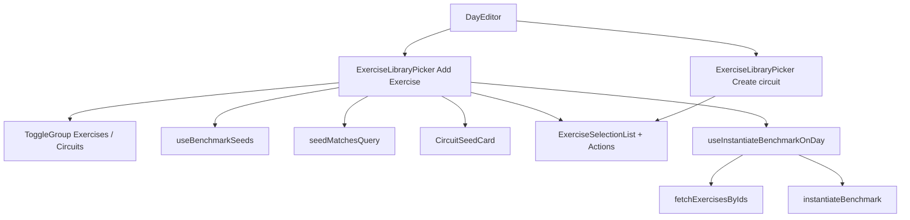

# Tech Plan — Meet Cindy (#393)

> Implements `file:docs/Epic_Brief_—_Meet_Cindy_#393.md`. Glossary: `file:docs/CONTEXT.md` (**Meet Cindy**, **Benchmark Circuit**, **Circuit Fork**, **Unified Day Sequence**). ADR `file:docs/adr/0016-meet-cindy-builder-seed-drop.md`. Does not amend ADR 0015. No schema.

## Architectural Approach

### Key Decisions

| Decision | Choice | Rationale |
|---|---|---|
| Surface | Kind toggle on **Add Exercise** picker only (`onInstantiateSeed` present) | **Create circuit** stays jetable authoring; inferring from `!onCreateBlock` is a footgun if a third caller appears |
| Kind chrome | shadcn `ToggleGroup` (`file:src/components/ui/toggle-group.tsx`) | Already used for AMRAP/Tours in `BlockEditor`; prefer-shadcn |
| Default kind | Always **Exercises** on open; reset on close | Brief: do not remember last tab |
| Circuits list | `useBenchmarkSeeds`: `owner_id IS NULL` | RLS also returns own forks; filter in the query, not in the UI |
| Search punch-through | Pin matching cards **above** muscle groups; kind stays Exercises | Mixed queries can show both; auto-switch hides exercise hits |
| Match | Normalize lowercase; query **≥ 2** chars; slug/alias **prefix** OR tagline **includes** | `c` stays exercise-only; `ci` / `ho` / `holland` pin Cindy |
| Card | Name (capitalized slug) + `AmrapLabel` / rounds + localized tagline | No Info, no movement list, no checkbox |
| Write | New `useInstantiateBenchmarkOnDay` | Different noun from `useCreateBlock` (`buildBlockInsertRows`, jetable) |
| Primitive | Reuse `instantiateBenchmark` + two-step insert + invalidate `["exercise-blocks", dayId]` + `["workout-days"]` | Same keys as `useCreateBlock`; catalog JSONB wins |
| Exercises for snapshots | `fetchExercisesByIds` (`file:src/lib/fetchExercisesByIds.ts`) | Shared lib; do not copy QW’s private Map helper |
| QW fetch | Leave `fetchCatalogPreviewRows` alone | Different query (seeds **+** forks); dedup later |
| Errors | `onMutationStateChange("error")` + sonner toast; sheet stays open | Brief story 11; no queued offline write |
| Success | Close picker only after insert succeeds | Failed Meet must not look like it landed |
| i18n tagline | `isEnglish(i18n.language) ? tagline_en ?? tagline_fr : tagline_fr ?? tagline_en` | Same as `BenchmarkStoryHeader` / `PreviewCircuitCard` |
| One slice | Picker + search + persist in one PR | Epic Brief ticket_shape |

### Critical Constraints

- **`ExerciseLibraryPicker` is an `Exercise[]` pipeline** (`file:src/components/builder/ExerciseLibraryPicker.tsx`): paginated RPC → group by `muscle_group` → checkboxes → `useAddExercisesToDay` / `onCreateBlock`. A **Benchmark Circuit** has none of those axes. Share the Dialog/Drawer **shell** (search input, kind toggle). Fork the **body and confirm**. Do not stuff seeds into `useExerciseSelection`.
- **Two picker mounts in `DayEditor`** (`file:src/components/builder/DayEditor.tsx`). Pass `onInstantiateSeed` only to the Add Exercise instance. The Create circuit instance (`onCreateBlock={handleCreateBlock}`) must not render the kind toggle.
- **`useCreateBlock` must not grow a catalog branch.** Jetable defaults (`rounds: 3`, `label: null`, no FK) vs seed snapshot (`rounds: 1`, label from slug, FK set) are incompatible confirm semantics.
- **Two-step insert is not transactional** — same wart as `useCreateBlock`: block row can orphan if `block_exercises` fails. Accepted; do not add an RPC for this epic.
- **Builder is online.** Mutations hit Supabase directly. Offline tap throws → toast, sheet stays. Do not queue.
- **Never hardcode 5-10-15.** Card and persist read `benchmark_circuits` via `parseCatalogPreviewRow` / `instantiateBenchmark`.
- **Pre-session `SwapExerciseSheet` and `/library` are not this picker.** Do not import the kind toggle there.
- **Pencil / T196 untouched.** `BlockCard` after insert is the existing component.

---

## Data Model

No new tables. No migrations.

```mermaid
classDiagram
  class benchmark_circuits {
    uuid id
    text slug
    uuid owner_id "NULL = GymLogic seed"
    text[] aliases
    text tagline_fr
    text tagline_en
    jsonb rx
  }
  class exercise_blocks {
    uuid workout_day_id
    uuid benchmark_circuit_id
    int sort_order
  }
  class block_exercises {
    uuid block_id
    uuid exercise_id
    jsonb per_round
  }
  benchmark_circuits ||--o{ exercise_blocks : instantiate
  exercise_blocks ||--o{ block_exercises : snapshot Rx
```

### Table Notes

- **Read:** `SELECT id, slug, aliases, rx, tagline_fr, tagline_en FROM benchmark_circuits WHERE owner_id IS NULL`. Parse with existing `parseCatalogPreviewRow` (`file:src/lib/previewCatalogCircuit.ts`). Drop rows that fail parse (corrupt Rx) rather than rendering a broken card.
- **Write:** identical to `useCreateBlock` insert sequence, rows built by `instantiateBenchmark` (`file:src/lib/instantiateBenchmark.ts`). `sort_order` = `max(dayItems.sort_order) + 1` (same as `handleCreateBlock`).
- **Identity:** `exercise_blocks.benchmark_circuit_id` = seed `id`. History / GO snapshot already shipped (#398).

---

## Component Architecture

### Layer Overview



### New Files & Responsibilities

| File | Purpose |
|---|---|
| `file:src/hooks/useBenchmarkSeeds.ts` | React Query: GymLogic seeds, `queryKey: ["benchmark-seeds"]`, enabled when picker open |
| `file:src/hooks/useBenchmarkSeeds.test.ts` | Filter `owner_id IS NULL`; parse; ignore unparsable rows |
| `file:src/hooks/useInstantiateBenchmarkOnDay.ts` | Auth → fetch exercises → instantiate → insert block + cells → invalidate |
| `file:src/hooks/useInstantiateBenchmarkOnDay.test.ts` | FK stamped, Rx copied, missing `exercise_id` throws **before** insert, invalidate keys |
| `file:src/lib/seedSearch.ts` | Pure `seedMatchesQuery(row, query)` |
| `file:src/lib/seedSearch.test.ts` | ≥2 chars, prefix slug/alias, includes tagline, case-fold, `c` no match, `holland` match |
| `file:src/components/builder/CircuitSeedCard.tsx` | WOD card: label, `AmrapLabel` or rounds, tagline via `isEnglish` |
| `file:src/components/builder/CircuitSeedCard.test.tsx` | Role/name; tap calls `onSelect`; EN/FR tagline |
| `file:src/components/builder/ExerciseLibraryPicker.test.tsx` | Extend: kind hidden in block mode; Circuits empty/error; pin-above on search; tap instantiate |

### Modified Files

| File | Change |
|---|---|
| `file:src/components/builder/ExerciseLibraryPicker.tsx` | Optional `onInstantiateSeed`; kind state; pin region; hide muscle filters on Circuits |
| `file:src/components/builder/DayEditor.tsx` | Wire mutation + `existingMaxSortOrder`; toast on throw |
| `file:src/locales/en/builder.json` / `fr/builder.json` | `kindExercises`, `kindCircuits`, empty/error copy, instantiate error toast |

### Component Responsibilities

**`ExerciseLibraryPicker`**
- Owns kind (`"exercises" | "circuits"`), reset on close.
- Renders `ToggleGroup` only if `onInstantiateSeed` is passed.
- **Exercises + empty query:** current list, no cards.
- **Exercises + query:** `seeds.filter(seedMatchesQuery)` pinned above `CommandGroup`s; exercise list unchanged below; filters still apply to exercises only.
- **Circuits:** hide `ExerciseFilterPanel`; list all seeds (or filtered by same query); empty/error copy; never hide the kind toggle.
- Footer: existing Apply / Create circuit CTAs only in Exercises kind (Circuits has no checkbox confirm).
- Tap card → `onInstantiateSeed(row)` (parent or picker-local mutation). Reco: mutation lives in the picker (it already owns `useAddExercisesToDay`) **or** DayEditor passes a callback. Prefer **picker-local hook** + `dayId` + `existingMaxSortOrder` props — mirrors solos. DayEditor only supplies `existingMaxSortOrder` from `dayItems`.

**`CircuitSeedCard`**
- Button/card, not a checkbox `CommandItem` pretending to be an exercise.
- Accessible name = seed label (e.g. “Cindy”).
- Disabled + spinner while that id is pending.

**`useInstantiateBenchmarkOnDay`**
- Input: `{ dayId, catalog: CatalogPreviewRow, existingMaxSortOrder }`.
- `fetchExercisesByIds` with `id, name, muscle_group, emoji`.
- Map → `instantiateBenchmark`.
- Insert sequence copy of `useCreateBlock` (not a shared helper this slice — two-step is 15 lines; extract if a third caller appears).
- Throw `"Not authenticated"` / instantiate errors / Supabase errors.

**`useBenchmarkSeeds`**
- Do not return forks. Do not bake locale into the hook.

### Failure Mode Analysis

| Failure | Behavior |
|---|---|
| Seed fetch error | Circuits kind still visible; error copy; Exercises kind works |
| Zero seeds (migration missing) | Circuits empty copy; toggle stays |
| Unparsable Rx row | Omitted from the list (no crash) |
| Query `"c"` | No pin; exercise search as today |
| Query `"cindy"` / `"holland"` on Exercises | Cindy card above groups; kind stays Exercises |
| Tap offline / network error | Toast + `onMutationStateChange("error")`; sheet open; no row |
| Missing `exercise_id` in catalog Map | Throw before `exercise_blocks` insert; toast; no half-Cindy |
| `block_exercises` insert fails after block insert | Orphan block (accepted; same as Create circuit) |
| Create circuit picker | No toggle, no cards, no `useBenchmarkSeeds` fetch |
| Double tap | Second click ignored while `isPending` for that seed id |

---

## Ticket cut (one PR, still testable slices)

Keep a single implementation PR as locked. Vertical order for TDD inside it:

1. `seedMatchesQuery` (pure).
2. `useBenchmarkSeeds` + `useInstantiateBenchmarkOnDay`.
3. `CircuitSeedCard`.
4. Picker kind + Circuits body + search pin.
5. DayEditor wiring + i18n + toast.
