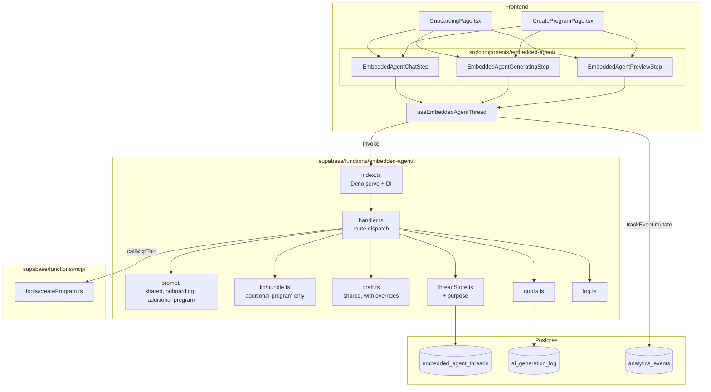

# Tech Plan — Migrate Create Program AI to Embedded Agent + MCP (#343)

## Architectural Approach

### Key Decisions

| Decision | Choice | Rationale |
|---|---|---|
| Multi-flow dispatch | Single Edge function (`embedded-agent`), `purpose` field on every action body (`open`/`send`/`draft`/`reject`/`commit`/`abandon`) | Lowest-churn extension. Hook binds `purpose` at construction; server resolves thread via `(user_id, purpose)`. Defaults to `'onboarding'` when absent — back-compat with the live client until both pages ship. |
| Per-purpose strategy | Branch inside each dep helper, NOT a Strategy class | Only 2 flows in v1. A `PromptStrategy` interface is premature abstraction debt; switch statements survive contact with reality better. Revisit if a 3rd `purpose` shows up. |
| Thread schema migration | Single migration adds 5 columns + relaxes the partial unique index | `purpose` (`NOT NULL DEFAULT 'onboarding'` + CHECK), `change_motivation` (nullable + CHECK), `bundle_context` (JSONB nullable), `validator_rejection_count` (`NOT NULL DEFAULT 0`), `pending_constraint_overrides` (JSONB nullable — validated overrides from latest accepted ready signal, consumed at /draft). Existing rows auto-backfill to `purpose='onboarding'` — zero data risk. |
| Partial unique index | `(user_id, purpose) WHERE status IN ('open','preview_ready')` | Replaces today's `(user_id) WHERE …`. A user can hold one active onboarding thread AND one active additional-program thread simultaneously without index collision. |
| Bundle capture | Captured ONCE at `/open` for `purpose='additional_program'`, persisted in `embedded_agent_threads.bundle_context` JSONB | Cheaper than per-`/send` refetch + deterministic across the conversation. Immutable for the thread's lifetime; abandon + restart to refresh. |
| Bundle builder location | `supabase/functions/embedded-agent/lib/bundle.ts` (function-local) | Single caller in v1. Rule of three: promote to `_shared/` when `analytics-snapshot` or another tool needs the same shape. |
| Prompt module shape | `prompt/{shared,onboarding,additional-program}.ts` folder | Shared bits (locale instruction, ready-signal regex, parser core) collapse to `shared.ts`; per-flow scope rules + ready-signal payload shapes live in flow files. Handler dispatches via `purpose`. |
| Ready signal — additional-program | `READY_FOR_PROGRAM_DRAFT: {"v":1,"ready":true,"summary":"…","motivation":"<vocab>","constraint_overrides":{"daysPerWeek":3}}` | `v: 1` is the forward-compat anchor (parser branches on payload version if multi-version transcripts coexist). `motivation` is required and validated against the vocabulary; `constraint_overrides` is optional. Validator rejects on missing/invalid `motivation` OR out-of-bounds override values → treats as `ready: false`, increments `validator_rejection_count`. Unknown override keys (forward-compat for v2) are silently dropped — NOT a rejection cause. |
| `constraint_overrides` stash | (β) `pending_constraint_overrides JSONB` column. Written at /send when validator accepts a signal with overrides; consumed (set to NULL) at /draft; cleared at /reject. | Race-free: /draft never re-parses the transcript, always reads what /send validated. The transcript stays the audit trail; the row holds the effective values. Originally proposed (α) re-parse, flipped after grilling — race risk when user sends a follow-up message between ready signal and CTA click (latest assistant message may no longer contain a signal). |
| Constraint override resolution | Profile-derived constraints + ready-signal overrides merged in `runProgramDraftStep` | Onboarding's `runProgramDraftStep` uses profile only; the additional-program branch passes optional `constraintOverrides` arg, merged with profile-derived defaults (overrides win), then re-runs `getEquipmentValues` + `getExerciseBounds`. Same validator. ~10 lines of merge logic; couples the flows in one function but avoids ~130 lines of duplicated catalog/validate/MCP glue. |
| Draft step shape | Shared `runProgramDraftStep` with optional `constraintOverrides` arg | Decouple only if override logic grows beyond simple merging. |
| Validator rejection observability | New `validator_rejection_count INT NOT NULL DEFAULT 0` column on thread + new `embedded_agent_motivation_classification_failed` event | Splits "model bluffed" from "user genuinely picked `other`" in analytics. Server increments the column; client fires the event from `useSendMessage.onSuccess` based on a `validator_rejection?: { reason }` field in the response. |
| Quota policy | Shared lanes (`embedded_chat: 40`, `embedded_draft` bumped `3 → 10`), no new lanes | Decision locked in Epic Brief. Cap bump lives in `_shared/aiQuota.ts:QUOTA_REGULAR_BY_SOURCE` map (introduced by #342). |
| Component relocation | Hard move `src/components/onboarding/EmbeddedAgent{Chat,Preview,Generating}Step.tsx` → `src/components/embedded-agent/` in one PR | Both call sites land in this epic. Aliased re-exports add noise; tests + imports update atomically. |
| Component prop API | Add `purpose: 'onboarding' \| 'additional_program'` + `i18nNamespace: 'onboarding' \| 'create-program'` props | `purpose` drives the hook calls; `i18nNamespace` lets the component lookup copy keys without owning the namespace string. Existing onboarding behavior is the `purpose='onboarding'` branch (no behavioral change). |
| Hook API change | Add `purpose` as a required arg to each `useThread`/`useSendMessage`/`useGenerateDraft`/`useRejectPreview`/`useCommitPreview`/`useAbandonThread`. Cache key becomes `['embedded-agent', 'thread', purpose]` | Avoids a factory pattern. Onboarding and additional-program have isolated React Query caches; no cross-contamination. |
| `CreateProgramPage` step flow | `path-choice` → `ai-chat` → `ai-generating` → `ai-preview` → home (AI path only) | Replaces `ai-constraints` step (deleted). `template-choice` + `blank` paths unchanged. Thread `.status` drives chat ↔ preview transitions; `ai-generating` is a transient UI state during the `/draft` mutation, not a thread status. |
| Commit-event ownership | Client-side (`useCommitPreview.onSuccess` fires `embedded_agent_preview_committed`) | Matches existing `embedded_agent_*` event ownership pattern (all current events fire from React). Server keeps the audit trail via `embedded_agent_threads.committed_at` + `program_id`. |
| Server-rendered validator events | Server returns `validator_rejection` on `/send` response when rejection happens; client fires `embedded_agent_motivation_classification_failed` | Keeps event ownership on the client. Server-side increment of `validator_rejection_count` is the source of truth; the event is for funnel analytics. |
| Resume UX | Silent resume (rehydrate transcript + scroll to bottom; no modal) | Matches onboarding's current pattern. Stale threads auto-abandon at 7d via the existing lazy sweep; users can manually abandon via the existing chat UI affordance. |
| Feature flag | None — ship behind the existing AI path on `/library/programs/create` | Rollback = revert the PR. Aligns with how onboarding shipped. |
| E2E mock strategy | `page.route('**/embedded-agent', ...)` interception with hand-coded thread transitions | Proven by `file:e2e/quick-workout-ai.spec.ts`. No Gemini token burn. Same fixture pattern. |
| Onboarding regression gate | `file:e2e/onboarding.spec.ts` must remain green after the prompt-folder + component-relocation refactors | Non-negotiable green gate per the Epic Brief. CI fails the PR if it breaks. |
| Legacy code deletion sequencing | `useAIGenerateProgram` + `AIProgramPreviewStep` + `AIConstraintStep` (the AI branch only) deleted in the cutover PR of this epic. `supabase/functions/generate-program/` deletion is sequenced with #342 — last-one-out turns off the lights. **Coupling removed upfront via T0** (see Critical Constraints): `_shared/programDraft.ts` extraction lands before either epic's bulk work, so deletion of `generate-program/` is a pure file removal at sequencing time. |

---

### Critical Constraints

- **`embedded-agent/index.ts` deps are onboarding-coded today** — `loadProfile`, `runDraftStep`, `buildDeterministicSummary`, every system-prompt path assumes onboarding semantics. The refactor must thread `purpose` through `EmbeddedAgentDeps` without breaking the existing onboarding contract. The handler's `getActiveThread(userId)` call sites (in `/send`, `/draft`, `/reject`, `/commit`, `/abandon`) all become `getActiveThread(userId, purpose)`. Five call sites — no silent miss.
- **Backward-compat is short-lived but real**: between the schema migration deploy and the client deploy, the live onboarding client will send action bodies *without* `purpose`. Handler must default to `'onboarding'` when absent. Document this default and *delete the default* in the cleanup ticket once both flows are live and the cookie-burn period is over (suggestion: 7d post-deploy).
- **`generate-program` import coupling is broken upfront via a T0 preliminary refactor** (NOT deferred to "whichever epic ships second"). `file:supabase/functions/embedded-agent/draft.ts:25-26` imports `buildProgramPrompt`, `capCatalog`, `getEquipmentValues`, `getExerciseBounds`, types (`CatalogExercise`, `ProgramConstraints`, `RecentExercise`, `UserProfile`) from `generate-program/prompt.ts`, and `validateProgram` from `generate-program/validate.ts`. T0 extracts these to `supabase/functions/_shared/programDraft.ts` (single module — both modules' surface is small enough not to warrant splitting). Imports update in `embedded-agent/draft.ts` and `generate-program/index.ts` simultaneously. Mechanical ~30-minute refactor; lands before either epic's bulk work to remove the cross-epic fragility. Post-T0, `generate-program/` is independently deletable by whichever of #342/#343 ships last with zero coordination cost.
- **`AIConstraintStep` deletion is per-branch, not whole-file**: today it's used only by the AI path in `CreateProgramPage`. The component file is deleted entirely in this epic since no other caller exists. Verify with `rg "AIConstraintStep"` before deletion lands.
- **`runProgramDraftStep` is shared between onboarding and additional-program** with the additional-program branch passing `constraintOverrides` through. The `no_catalog` / `empty_program` failure modes are identical across flows — no per-purpose branching in the validation layer. **Risk**: an aggressive `constraint_overrides.equipmentCategory` (e.g. `'bodyweight'` when profile says `'gym'`) shrinks the catalog dramatically and trips `no_catalog` or `empty_program`. Surface this in the failure-mode table.
- **`bundle_context` immutability is a real product constraint, not just an impl detail**: if the user updates their profile in another tab mid-conversation, the bundle is stale. Document the boundary clearly in the system prompt copy (the user shouldn't be told the bundle is locked, but the agent shouldn't claim to "have your latest profile" — neutral phrasing).
- **`validator_rejection_count` survives the 90d transcript purge** because it's row-level metadata, not in `messages` JSONB. Acceptable — non-PII. Mention in the runbook.
- **`embedded_agent_preview_committed` is a NEW event** (callsite for this epic is `useCommitPreview.onSuccess`). The legacy `program_created` event continues to fire from the onboarding/post-onboarding boundary in `OnboardingPage`; that boundary doesn't apply to the additional-program flow. Search-and-verify: `rg "program_created"` confirms `program_created` is fired from the legacy `AIProgramPreviewStep` (`file:src/components/create-program/AIProgramPreviewStep.tsx`) — this firing site is deleted with the component, so `program_created` will only continue to fire from onboarding. Funnel queries for additional-program use `embedded_agent_preview_committed`.
- **i18n key namespacing**: per-page namespaces (`onboarding`, `create-program`) keep the v1 diff tight. Cross-flow shared strings (quota errors, "ready to draft", etc.) are *duplicated* in v1 — extracted to an `embedded-agent` namespace in a follow-up if duplication grates. This is intentional; cross-namespace extraction is the kind of low-stakes refactor that grows from a real second consumer, not a hypothetical one.

---

## Data Model

### Migration

```sql
-- supabase/migrations/<ts>_embedded_agent_threads_multi_purpose.sql
-- See docs/adr/0004-embedded-agent-thread-purpose-column.md.

alter table embedded_agent_threads
  add column purpose text not null default 'onboarding'
    check (purpose in ('onboarding','additional_program')),
  add column change_motivation text
    check (change_motivation is null or change_motivation in (
      'variety','plateau','injury','priority_shift',
      'equipment_change','return_from_break','other'
    )),
  add column bundle_context jsonb,
  add column validator_rejection_count int not null default 0,
  -- Validated overrides from the latest accepted ready signal.
  -- Written at /send (validator-accepted), consumed (set to NULL)
  -- at /draft, cleared at /reject. Race-free vs re-parsing the
  -- transcript at /draft time (latest assistant message may not
  -- contain a signal if user sent a follow-up after readying).
  add column pending_constraint_overrides jsonb;

-- Existing rows backfill to purpose='onboarding' via the DEFAULT.
-- change_motivation, bundle_context, pending_constraint_overrides
-- stay NULL on legacy rows. validator_rejection_count starts at 0
-- for everyone.

-- Relax the active-thread uniqueness constraint to allow one active
-- thread per (user, purpose) — not one per user globally.
drop index embedded_agent_threads_one_active_per_user;

create unique index embedded_agent_threads_one_active_per_purpose
  on embedded_agent_threads (user_id, purpose)
  where status in ('open','preview_ready');

-- Lookup index for per-user, per-purpose reads (handler resolves the
-- active thread on every action). Same shape as the dropped index but
-- includes purpose to avoid a bitmap-or on the partial unique index.
create index idx_embedded_agent_threads_user_purpose_status
  on embedded_agent_threads (user_id, purpose, status);

-- The pre-existing idx_embedded_agent_threads_user_status stays (used
-- by the 90d retention sweep keyed on user_id + status='abandoned').
```

### `bundle_context` JSONB shape

Captured once at `/open` for `purpose='additional_program'`; immutable for the thread's lifetime.

```typescript
interface AdditionalProgramBundle {
  v: 1                          // schema version; bump on breaking change
  captured_at: string           // ISO timestamp at thread open
  profile: {
    goal: string
    experience: string
    equipment: string
    training_days_per_week: number
    session_duration_minutes: number
    age: number | null
    weight_kg: number | null
    gender: string | null
  }
  active_program: {
    id: string
    name: string
    days: Array<{
      label: string
      exercise_count: number
      muscle_groups: string[]   // unique, sorted, max 5
    }>
  } | null                      // null when user has no active program (Brief locked behavior)
  recent_stats: {
    window_days: 28
    total_sessions: number
    sessions_per_week: number   // total_sessions / 4, rounded to 1 decimal
    top_muscle_groups: string[] // top 5 by set count, descending
    avg_session_duration_minutes: number | null  // null when 0 sessions in window
  }
}
```

**Size estimate**: ~1.2–1.8 KB JSON, ~400–550 tokens at Gemini's tokenization. **Hard ceiling enforced in the builder**: `JSON.stringify(bundle).length > 8192 → throw BundleSizeExceeded`. Rationale: 8 KB leaves ~6× headroom over today's expected size; any future addition (e.g. `exercise_history: lastNSessions`) that breaches the ceiling fails fast in tests rather than silently inflating prompt tokens in production. Adjust the ceiling when a deliberate change requires it, not as a workaround.

### Ready-signal payload — additional-program

```text
READY_FOR_PROGRAM_DRAFT: {
  "v": 1,
  "ready": true,
  "summary": "<one-sentence recap>",
  "motivation": "plateau",
  "constraint_overrides": {       // optional
    "daysPerWeek": 3,
    "duration": 45,
    "equipmentCategory": "dumbbells",
    "goal": "strength"
  }
}
```

Validator behavior for overrides:

| Field | Type | Bounds | On out-of-bounds value |
|---|---|---|---|
| `daysPerWeek` | int | 1–7 | **Reject the entire signal** (`rejection_reason: 'invalid_override'`) |
| `duration` | int | 30–120 | **Reject** |
| `equipmentCategory` | enum | `'bodyweight' \| 'dumbbells' \| 'full-gym'` | **Reject** |
| `goal` | enum | `'strength' \| 'hypertrophy' \| 'endurance' \| 'general_fitness'` | **Reject** |
| `experience` | — | not overrideable in v1 | Silently dropped (treated as unknown key) |

**Unknown keys** (any field not in the validator's known set) are silently dropped — this is the forward-compat path for adding new override fields in v2 without breaking v1 parsers.

**Out-of-bounds known fields** are validator rejections — symmetric with missing/invalid `motivation`. Rationale: an out-of-bounds value is the model bluffing (e.g. `daysPerWeek: 14` when the prompt taught 1–7). Silently dropping caused a UX mismatch (agent confirms in chat, draft uses profile default). Rejection forces the model to re-emit a valid signal; the user-facing chat stays consistent with the eventual draft.

**Two distinct UX-mismatch failure modes** worth naming explicitly:

| Mode | Cause | Detection | Mitigation |
|---|---|---|---|
| (a) Out-of-bounds override | Model emits `{daysPerWeek: 14}`; user discussed "7 days" with agent | Server-side validator | Reject the signal → `validator_rejection: { reason: 'invalid_override', field: 'daysPerWeek' }` → agent re-emits |
| (b) Implicit override (model agrees in chat, omits payload field) | Model says "yes, 7 days/week" in free text but doesn't include `daysPerWeek` in `constraint_overrides`; profile wins at /draft | NOT detectable server-side (requires chat-semantic parsing) | Prompt-only: system prompt teaches "the signal payload is authoritative — anything you agree to in chat MUST be reflected in `constraint_overrides`". Documented as a known v1 risk. |

**Source of truth for overrides between /send and /draft**: the `embedded_agent_threads.pending_constraint_overrides` JSONB column. Written at /send when the validator accepts a signal carrying overrides; consumed (set to NULL) at /draft once applied to `runProgramDraftStep`; cleared at /reject. The `v: 1` field is the forward-compat anchor: bump on any breaking change to the payload schema; the parser branches on `v` if multi-version transcripts coexist.

### Wire shapes — Edge function action bodies (new fields in bold)

| Action | Body | Response |
|---|---|---|
| `open` | `{ action: 'open', locale, `**`purpose`**` }` | `{ thread_id, status, `**`purpose`**`, resumed, messages, last_preview, `**`bundle_summary?`**` }` |
| `send` | `{ action: 'send', locale, content, `**`purpose`**` }` | `{ assistant: { content, ts }, ready_for_draft, `**`validator_rejection?: { reason }`**` }` |
| `draft` | `{ action: 'draft', locale, trigger, `**`purpose`**` }` | `{ status: 'preview_ready', preview, trigger }` |
| `reject` | `{ action: 'reject', `**`purpose`**` }` | `{ ok: true, status: 'open' }` |
| `commit` | `{ action: 'commit', confirm: true, `**`purpose`**` }` | `{ program_id }` |
| `abandon` | `{ action: 'abandon', `**`purpose`**` }` | `{ ok: true }` |

`bundle_summary` on `/open` for `purpose='additional_program'` is a small derived projection (e.g. `{ active_program_name?, sessions_per_week, top_muscle_group? }`) for the chat UI to optionally render as a header chip. The full bundle never leaves the server.

### Analytics events

| Event | Status | Payload fields added by #343 | Fired from |
|---|---|---|---|
| `embedded_agent_message_sent` | Existing | `purpose` | Client (`useSendMessage.onSuccess`) |
| `embedded_agent_draft_triggered` | Existing | `purpose` | Client (`useGenerateDraft.onSuccess`) |
| `embedded_agent_preview_rejected` | Existing | `purpose` | Client (`useRejectPreview.onSuccess`) |
| `embedded_agent_preview_committed` | **NEW** | `{ thread_id, program_id, purpose, motivation?, locale }` | Client (`useCommitPreview.onSuccess`) |
| `embedded_agent_motivation_classification_failed` | **NEW** | `{ thread_id, purpose: 'additional_program', rejection_reason: 'missing' \| 'invalid_value' \| 'malformed_json' \| 'invalid_override', field?: string, locale }` | Client (reads `validator_rejection` from `/send` response). `field` is populated only for `invalid_override` rejections so funnel queries can identify which override field is most-often bluffed. |
| `program_created` | Existing | (no change) | Client (legacy `AIProgramPreviewStep` callsite — deleted in this epic; remaining callsite is onboarding's `OnboardingPage`) |

`ai_generation_log` is intentionally NOT touched. The `purpose` lives on `embedded_agent_threads`; analytics events carry it for funnel queries. Joining `ai_generation_log` to `embedded_agent_threads` for per-purpose quota cost analysis is a SQL-time concern, not a schema-time one.

---

## Component Architecture

### Layer Overview



### New Files & Responsibilities

| File | Purpose |
|---|---|
| `supabase/functions/_shared/programDraft.ts` | **T0 preliminary refactor** — extracts `buildProgramPrompt`, `capCatalog`, `getEquipmentValues`, `getExerciseBounds`, `validateProgram` + types from `generate-program/{prompt,validate}.ts` so `embedded-agent/draft.ts` no longer cross-imports a sibling Edge function. Decouples #342 and #343 from `generate-program/`'s lifecycle. |
| `supabase/migrations/<ts>_embedded_agent_threads_multi_purpose.sql` | Adds 5 columns (`purpose`, `change_motivation`, `bundle_context`, `validator_rejection_count`, `pending_constraint_overrides`) + relaxes partial unique index; backfills legacy rows to `purpose='onboarding'`. |
| `supabase/functions/embedded-agent/lib/bundle.ts` | `buildAdditionalProgramBundle({ supabase, userId })` → `AdditionalProgramBundle`. Reads `user_profiles`, `programs` (active), aggregates 28d session stats from workout history. |
| `supabase/functions/embedded-agent/prompt/shared.ts` | `LOCALE_INSTRUCTION` table, `READY_SIGNAL_LINE` regex, `parseReadySignalCore(content)` → `{ ready, payload, cleanContent }` returning raw payload for per-flow validators. |
| `supabase/functions/embedded-agent/prompt/onboarding.ts` | `buildSystemPrompt`, `parseReadySignal` for onboarding (current behavior, moved). |
| `supabase/functions/embedded-agent/prompt/additional-program.ts` | `buildSystemPrompt` with motivation gate + bundle context injection; `parseReadySignal` requires `motivation`, parses optional `constraint_overrides`. |
| `supabase/functions/embedded-agent/prompt/index.ts` | Dispatch helpers: `buildSystemPromptFor(purpose, …)`, `parseReadySignalFor(purpose, content)`. |
| `src/components/embedded-agent/EmbeddedAgentChatStep.tsx` | Relocated from `src/components/onboarding/`. New props: `purpose`, `i18nNamespace`. |
| `src/components/embedded-agent/EmbeddedAgentGeneratingStep.tsx` | Relocated. New props as above. |
| `src/components/embedded-agent/EmbeddedAgentPreviewStep.tsx` | Relocated. New props as above. |
| `src/components/embedded-agent/__tests__/*` | Relocated tests + new tests for the `purpose='additional_program'` rendering branch. |
| `e2e/create-program-ai.spec.ts` | New Playwright E2E exercising path-choice → ai-chat → ai-generating → ai-preview → home, with Embedded Agent + MCP mocked. Parallel to `e2e/quick-workout-ai.spec.ts`. |

### Modified Files

| File | Modification |
|---|---|
| `supabase/functions/embedded-agent/threadStore.ts` | `getActiveThread(supabase, userId, purpose)`, `getOrCreateActiveThread(supabase, userId, locale, purpose)`; new helpers `setBundle(thread, bundle)`, `incrementValidatorRejection(thread)`, `setChangeMotivation(thread, motivation)`, `setPendingConstraintOverrides(thread, overrides \| null)`, `consumePendingOverrides(thread)`. |
| `supabase/functions/embedded-agent/handler.ts` | All 6 action handlers thread `purpose` through; `/open` for `additional_program` builds + persists bundle; `/send` dispatches per-flow prompt builder + validator and writes `pending_constraint_overrides` on accept; `/draft` reads `pending_constraint_overrides` (no transcript re-parse) and clears on success; `/reject` clears pending overrides alongside `last_preview`. |
| `supabase/functions/embedded-agent/index.ts` | DI wiring: add `purpose`-aware factories for `loadPromptContext`, `buildSystemPrompt`, `parseReadySignal`, `runDraftStep`; pass `purpose` into the Deps. |
| `supabase/functions/embedded-agent/draft.ts` | `runProgramDraftStep` accepts optional `constraintOverrides` arg; merges with profile-derived constraints (overrides win). No new failure modes. **Imports flip from `../generate-program/{prompt,validate}.ts` → `../_shared/programDraft.ts`** (post-T0). |
| `supabase/functions/generate-program/index.ts` | **T0 import flip only** — `buildProgramPrompt`, `capCatalog`, etc. now imported from `../_shared/programDraft.ts`. No behavior change. Function survives until the second-to-ship epic cleans it up. |
| `supabase/functions/embedded-agent/log.ts` | `LogEvent` shape adds optional `purpose` tag. Existing log lines include `purpose` for `additional_program` requests. |
| `supabase/functions/_shared/aiQuota.ts` | `QUOTA_REGULAR_BY_SOURCE.embedded_draft: 3 → 10`. (#342 introduces the per-source map; this is a one-line bump.) |
| `src/hooks/useEmbeddedAgentThread.ts` | Each hook takes `purpose` as a required first arg; cache key becomes `['embedded-agent', 'thread', purpose]`; `useSendMessage` fires `embedded_agent_motivation_classification_failed` when response carries `validator_rejection`. |
| `src/pages/OnboardingPage.tsx` | Imports `EmbeddedAgent*Step` from `embedded-agent/`; passes `purpose='onboarding'`, `i18nNamespace='onboarding'`. No behavioral change. |
| `src/pages/CreateProgramPage.tsx` | AI path replaced: `path-choice` → `ai-chat` → `ai-generating` → `ai-preview` → home. `ai-constraints` step deleted. Uses relocated components with `purpose='additional_program'`. |
| `src/locales/{en,fr}/create-program.json` | New chat/preview/quota strings under `create-program.embedded_agent.*`. |

### Deleted Files

| File | Reason |
|---|---|
| `src/components/create-program/AIConstraintStep.tsx` | No other caller; deleted with the legacy AI branch. |
| `src/components/create-program/AIProgramPreviewStep.tsx` | Replaced by relocated `EmbeddedAgentPreviewStep`. |
| `src/hooks/useAIGenerateProgram.ts` | Closed-loop AI generation replaced by Embedded Agent + MCP `create_program`. |
| Tests for the above | Deleted with their files. |
| `supabase/functions/generate-program/` | **Conditional**: deleted by whichever of #342/#343 ships last. Owned by the cutover ticket in the second epic. |
| `src/components/onboarding/EmbeddedAgent{Chat,Preview,Generating}Step.tsx` | Moved to `src/components/embedded-agent/`. Same content, parameterized. |

### Component Responsibilities

**`EmbeddedAgentChatStep` (relocated)**
- Renders the chat surface (messages list, input box, send button, abandon link).
- Consumes `useThread(purpose, locale)` + `useSendMessage(purpose)` + `useAbandonThread(purpose)`.
- Looks up i18n strings via `useTranslation(props.i18nNamespace + '.embedded_agent.chat')`.
- Renders an optional header chip from `thread.bundle_summary` when `purpose === 'additional_program'` (e.g. "Active: PPL Hypertrophy · 4 sessions/wk").
- Reacts to `ready_for_draft: true` by enabling the "Generate my plan" CTA visual; clicking fires `useGenerateDraft({ trigger: 'user_cta', purpose, locale })`.

**`EmbeddedAgentGeneratingStep` (relocated)**
- Transient loading screen during the `/draft` mutation. No behavior change beyond accepting `purpose` + `i18nNamespace` props for copy lookup.
- Distinguishes between `quota` (turn/draft/program), `model_failure`, `mcp_failed` errors via `EmbeddedAgentError.kind`; renders flow-specific retry copy.

**`EmbeddedAgentPreviewStep` (relocated)**
- Renders `thread.last_preview` (rendered echo lines per day or args-only fallback).
- "Confirm" → `useCommitPreview(purpose)`. On success: optimistic atom set, query invalidations, navigate to home; fires `embedded_agent_preview_committed` event with `{ thread_id, program_id, purpose, motivation, locale }`.
- "Regenerate" → `useRejectPreview(purpose)` → returns to chat (thread.status flips to `open`).
- "Commit failed" branch: stays on preview, shows retry button (last_preview is still server-side).

**`prompt/additional-program.ts::buildSystemPrompt`**
- Composes: locale instruction, scope rules (additional-program flavored — "the user already has a profile and an active program, your job is to learn WHY they want a new program, then propose"), motivation gate rule (mandatory before ready signal), ready-signal rule (with the extended payload), bundle context injection (profile + active program + recent stats), constraint override teaching rule.
- The motivation gate copy explicitly enumerates the 7 vocabulary values + when each applies.
- **Signal-payload-authority rule**: explicit instruction that the ready signal's `constraint_overrides` is the ONLY authoritative source for constraint changes — anything the agent agrees to in free-text chat MUST be reflected in the payload, or it will not affect the draft.
- **Override bounds disclosure**: explicit `daysPerWeek: 1–7`, `duration: 30–120` (minutes), enum lists for `equipmentCategory` + `goal`. Reduces out-of-bounds emissions vs leaving the model to guess.
- Returns the composed system prompt string.

**`prompt/additional-program.ts::parseReadySignal`**
- Calls `parseReadySignalCore` to extract the payload + cleanContent.
- If `ready === true`:
  - Validates `motivation` ∈ vocab. If missing/invalid, returns `{ ready: false, cleanContent, validatorRejection: { reason: 'missing' | 'invalid_value' | 'malformed_json' } }`.
  - Parses optional `constraint_overrides`. For each known field with an out-of-bounds value: returns `{ ready: false, cleanContent, validatorRejection: { reason: 'invalid_override', field } }`. Unknown keys are dropped (forward-compat).
  - On full success: returns `{ ready: true, cleanContent, motivation, constraintOverrides }`.
- Always strips the signal line from `cleanContent` (never leaks raw JSON to UI).
- Increments + analytics events are caller responsibilities.

**`lib/bundle.ts::buildAdditionalProgramBundle`**
- Reads `user_profiles` (full row).
- Reads the user's single `programs` row where `is_active = true` (LEFT join nothing — null is OK).
- Reads aggregated session stats from the workout history table(s) over the last 28d. Concrete query lives in this file; uses service-role client for cross-table reads.
- Composes `AdditionalProgramBundle`.
- **Size guard**: `JSON.stringify(bundle).length > 8192 → throw BundleSizeExceeded`. Failure surfaces in the unit test suite (fixture-driven), preventing prompt-token bloat regressions at code-review time rather than at runtime.
- Returns the bundle. NO persistence — that's the handler's job.
- **Failure modes**: if `user_profiles` is missing, throws `ProfileMissing`. If size guard trips, throws `BundleSizeExceeded`. The handler maps the former to a 409 `profile_missing` and the latter to a 500 `internal` with a structured log line (this is a bug surfaced in prod, not a user-facing error class).

**`handler.ts::handleOpen` (extended)**
- After `getOrCreateActiveThread(userId, locale, purpose)`:
  - If `purpose === 'additional_program'` AND `thread.bundle_context === null` (fresh or never-set): call `buildAdditionalProgramBundle`, persist via `setBundle(thread, bundle)`.
  - If `bundle_context` is already set (resumed thread): re-use as-is.
- Returns `bundle_summary` projection in the response payload for the chat UI's header chip.

**`handler.ts::handleSend` (extended)**
- After `getActiveThread(userId, purpose)`:
  - Load prompt context: `purpose === 'onboarding'` → `loadProfile()`; `purpose === 'additional_program'` → `thread.bundle_context` (treat null as a 409 — bundle should have been written at /open).
  - Build system prompt via `buildSystemPromptFor(purpose, locale, context)`.
  - Call model.
  - Validate ready signal via `parseReadySignalFor(purpose, content)`.
  - If `validatorRejection` present: increment `validator_rejection_count` via `incrementValidatorRejection(thread)`; return `validator_rejection: { reason, field? }` in the response.
  - Otherwise: if `purpose === 'additional_program'` AND `ready === true`:
    - Persist `motivation` to `change_motivation` if not already set (subsequent ready signals don't overwrite — the first classification is the canonical one).
    - **Persist `constraintOverrides` to `pending_constraint_overrides`** (overwrite on each accepted signal — latest accepted wins). If the latest signal has no overrides, write `NULL` to clear any stale value from a previous accepted signal.

**`handler.ts::handleDraft` (extended)**
- `getActiveThread(userId, purpose)`.
- If `purpose === 'additional_program'`: read `thread.pending_constraint_overrides` (already validated at /send time). NO transcript re-parse.
- Call `runProgramDraftStep` with `constraintOverrides` arg.
- On `runProgramDraftStep` success (before MCP call): clear `pending_constraint_overrides` to NULL via `consumePendingOverrides(thread)`. Idempotent — re-running /draft after a transient MCP failure picks up profile defaults (the overrides have been consumed; the agent must re-emit to re-apply).
- Rest unchanged.

**`handler.ts::handleReject` (extended)**
- Existing: flip status to `open`, clear `last_preview`.
- Add: clear `pending_constraint_overrides` to NULL. The user explicitly rejected the draft; any pending overrides from the rejected attempt are stale.

---

### Failure Mode Analysis

| Failure | Behavior |
|---|---|
| `purpose` missing from action body | Handler defaults to `'onboarding'` (back-compat). Log a `warn` with `error_kind: 'missing_purpose_default_applied'`. Delete the default in the cleanup ticket. |
| `purpose` outside vocabulary | 400 `invalid_purpose`. Defensive — UI never sends bad values. |
| Concurrent `/open` from onboarding + additional-program tabs | Both succeed; the partial unique index keys on `(user_id, purpose)`, so both tabs get distinct active threads. |
| Concurrent `/open` from two additional-program tabs | Same as today's onboarding behavior — `23505` unique violation caught in `getOrCreateActiveThread`, re-fetch winning row, return `resumed: true` to the loser. |
| `bundle_context = NULL` on `/send` for additional-program | 409 `bundle_missing`. Should be impossible (handler writes on /open) — log as `error_kind: 'internal'`. UI surfaces "Session expired, please restart" + abandon CTA. |
| `user_profiles` missing on `/open` for additional-program | `buildAdditionalProgramBundle` throws → handler returns 409 `profile_missing`. UI redirects to onboarding. (Realistically unreachable: user must have completed onboarding to land on `/library/programs/create`.) |
| No active program (user's program is empty/abandoned) | `bundle.active_program === null`. Prompt's bundle injection renders "No active program" in EN/FR. Agent's greeting adapts (no claim of "your current program"). |
| Model emits ready signal without `motivation` | Validator rejects → `validator_rejection: { reason: 'missing' }` in response → increment column + fire event. UI doesn't show a special state; chat continues, agent gets next turn to re-classify. |
| Model emits `motivation: "other"` after first classification attempt | Allowed. Signal accepted, motivation persisted as `"other"`. Analytics distinguishes via `validator_rejection_count > 0` vs `= 0` (model gave up vs user genuinely has no specific reason). |
| Model emits `constraint_overrides.daysPerWeek: 14` | Validator rejects the entire signal → `validator_rejection: { reason: 'invalid_override', field: 'daysPerWeek' }`. `validator_rejection_count` increments; agent gets to re-emit. UX stays consistent: no draft is generated until the agent emits in-bounds values. |
| Model agrees in chat ("yes, 7 days/week") but omits `daysPerWeek` from the signal payload | NOT detectable server-side. /draft uses profile-derived constraints (e.g. 4 days). User sees a mismatch in the preview. **Mitigation**: system prompt rule teaches "signal payload is authoritative; anything you agree to in chat MUST be reflected in `constraint_overrides`". Documented v1 risk; revisit if analytics show frequent mismatch reports. |
| Model emits `constraint_overrides.equipmentCategory: "dumbbells"` when profile says `"gym"` | Override accepted. Catalog query reduces to dumbbells-only exercises. If the catalog shrinks past the validator's exercise bounds for the chosen `daysPerWeek`, `runProgramDraftStep` returns `empty_program` → 502 `draft_failed`. UI surfaces "Couldn't generate with those settings, please try different preferences". |
| `embedded_chat` quota exhausted mid-chat | 429 `turn_quota_exceeded`. UI shows quota banner; user can wait or abandon. Same as onboarding. |
| `embedded_draft` quota exhausted on /draft | 429 `draft_quota_exceeded`. UI shows quota banner. Bumped cap (10/24h) makes this rare in practice. |
| `program` quota exhausted on /draft | 429 `program_quota_exceeded`. UI shows "monthly limit reached" copy. Cross-source (5/30d shared with #342 and #295). |
| MCP `create_program` fails on /commit | 502 `commit_failed`. Thread stays at `preview_ready`; user retries. If MCP keeps failing, user can /reject and re-chat. |
| Bundle becomes stale (user updates profile mid-conversation) | Bundle stays as captured at /open. Documented constraint; abandon + restart to refresh. v2 follow-up: explicit refresh affordance if analytics show users hit this. |
| Onboarding E2E regresses after prompt-folder refactor | CI fails the PR. Non-negotiable. The refactor is reverted/fixed before merge. |
| Onboarding client deployed without `purpose` field on a stale tab | Handler defaults to `'onboarding'` (graceful). No user-visible error. |
| Validator rejection on a wrong-status thread (e.g. preview_ready) | Shouldn't happen — `/send` already 409s on `preview_ready` for the same reason. Validator only runs when /send returns a normal assistant turn. |
| 90d retention purge clears `messages` while `validator_rejection_count > 0` | Counter survives (metadata, not transcript). Analytics queries by counter continue to work. |
| Multi-flow `program_created` event collision | `program_created` only fires from `OnboardingPage` post-cutover. No additional-program emission. Funnel queries use `embedded_agent_preview_committed` for additional-program. |
| Resume of an additional-program thread after model schema drift | The `v: 1` in the signal payload anchors the parser. A v=2 deployment would branch on `payload.v` to pick the right parser; legacy v=1 transcripts continue to draft successfully. |

---

### Rollback Procedure

The cutover PR (the one that swaps `CreateProgramPage`'s AI branch from legacy `useAIGenerateProgram` + `AIProgramPreviewStep` to `EmbeddedAgent{Chat,Generating,Preview}Step`) is the **single revert point**. Earlier T0/T1+ tickets (helper extraction, schema migration, prompt-folder refactor) are forward-compatible by construction and stay deployed on rollback.

**Steps (~5 minutes):**

1. **Revert the cutover PR** on `main` via `gh pr revert <pr-number>` (or `git revert <merge-sha> -m 1` + push). CI re-runs against the reverted tree; merge once green.
2. **Redeploy frontend** — the legacy `AIConstraintStep` + `AIProgramPreviewStep` + `useAIGenerateProgram` come back with the revert; no separate restoration needed.
3. **Edge function**: `embedded-agent` redeploys with the cutover revert (Supabase CLI). The reverted `handler.ts` still accepts `purpose='additional_program'` requests (the schema migration stays in place), it just no longer has a client sending them.
4. **Migration stays in place** — `purpose`, `change_motivation`, `bundle_context`, `validator_rejection_count`, `pending_constraint_overrides` are nullable or defaulted; nothing depends on them post-revert. Migration rollback would require a separate `DROP COLUMN` migration; not warranted unless we abandon the epic entirely.
5. **Verify**: `e2e/onboarding.spec.ts` green (regression gate); legacy AI path at `/library/programs/create` reachable; smoke-test create-from-AI on staging account.

**What rollback does NOT undo:**

- The T0 `_shared/programDraft.ts` extraction. `generate-program/index.ts` and `embedded-agent/draft.ts` keep importing from `_shared/`. Safe — extraction is pure refactor.
- The prompt-folder split (`prompt/{shared,onboarding,additional-program}.ts`). Onboarding still works against the new folder structure; the regression gate (`e2e/onboarding.spec.ts`) verifies this.
- Schema migration (above).

**Partial rollback (e.g. additional-program flow broken but onboarding fine)**: revert only the `CreateProgramPage` changes (front-end-only revert). The Edge function `purpose='additional_program'` code paths become dead but inert. Cleanup ticket in the next sprint.

**Rollback cost summary**: < 1 hour wall-clock (revert PR + CI + deploy + verify). Schema stays — no DB downtime, no data loss.

---

### Rejected alternatives

| Rejected | Why |
|---|---|
| Forking `embedded-agent` into `embedded-agent-onboarding` + `embedded-agent-additional-program` | Doubles the Deno deploy surface, doubles the cold-start cost, splits the quota helpers, multiplies the maintenance burden. The function is ~200 lines of orchestration; branching internally is much cheaper. |
| `Strategy` class pattern with `OnboardingStrategy` / `AdditionalProgramStrategy` implementing a `PromptStrategy` interface | Premature abstraction. 2 flows justify switch statements. |
| (α) Re-parse from the latest assistant message at /draft time | Originally proposed (smallest schema), flipped to (β) `pending_constraint_overrides JSONB` after grilling. Race risk: user can send a follow-up message between ready signal acceptance and CTA click; the latest assistant message at /draft time may not contain a signal at all. The persisted column closes this gap at the cost of one nullable JSONB. |
| Forking `runProgramDraftStep` per purpose | ~130 lines of duplicated catalog/validate/MCP glue on day one. Shared with optional `constraintOverrides` arg is ~10 lines of merge logic. Decouple only if override logic outgrows simple merging. |
| Extracting `_shared/programDraftCore.ts` upfront | Most refactor effort, lowest long-term duplication — but no second consumer exists yet (rule of three). Defer until a third caller materializes. |
| `useEmbeddedAgentThread` factory returning a bound object | More refactor for marginal ergonomic gain. Adding `purpose` to each existing hook is a smaller diff. |
| Server-side analytics writes | The codebase has zero server-side `analytics_events` writers today. Building that infra for one event is overkill. Client-side, like everything else. |
| Per-flow Edge function quota source values (`embedded_chat_onboarding`, `embedded_chat_additional_program`) | Defeats the point of shared lanes. The Brief locked shared lanes; respect it. Per-purpose cost analysis happens via SQL joining `ai_generation_log` to `embedded_agent_threads`. |
| Feature flag | No A/B test planned; rollback = revert the PR. |
| Aliased re-exports for the component relocation | Adds noise. Hard move + atomic test updates is the cleanest diff. |

---

## References

- Epic Brief: `docs/Epic_Brief_—_Migrate_Create_Program_AI_to_Embedded_Agent_#343.md`
- ADR 0003 — Additional Program Creation Shape: `docs/adr/0003-additional-program-creation-shape.md`
- ADR 0004 — Embedded Agent Thread Purpose Column: `docs/adr/0004-embedded-agent-thread-purpose-column.md`
- Companion Tech Plan (#342): `docs/Tech_Plan_—_Quick_Workout_AI_to_Embedded_Agent_+_MCP_#342.md`
- Onboarding Phase B Tech Plan (#295): `docs/Tech_Plan_—_Onboarding_—_MCP-First_and_Embedded_Agent_#295_Phase_B.md`
- CONTEXT glossary: `docs/CONTEXT.md`
