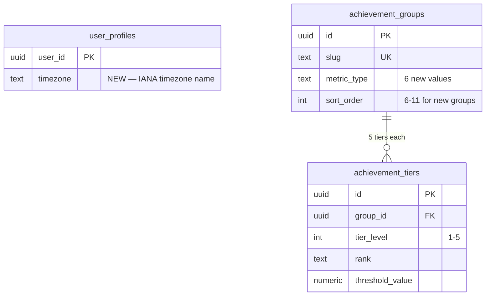
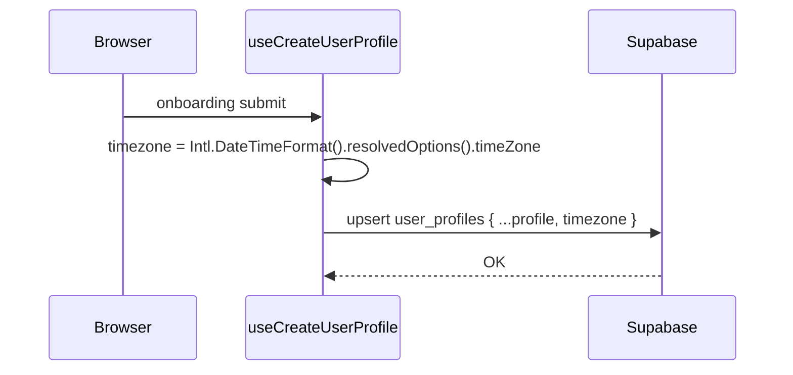

# Tech Plan — New Achievement Tracks (#218)

## Architectural Approach

### Key Decisions

| Decision | Choice | Rationale |
|---|---|---|
| **RPC extension strategy** | Add 6 new `UNION ALL` branches to the `metrics` CTE in both RPCs | Same pattern as existing 5 metrics. No new RPCs, no new tables. The `eligible` / `granted` CTE pattern consumes any `metric_type` generically — adding a new branch is the only change. |
| **Streak computation** | Window-function gap detection (`ROW_NUMBER` trick) inside the CTE | Outputs a single `numeric` value (longest streak) — fits the existing `metrics` contract. No schema change needed. |
| **Leg Day join** | JOIN `set_logs` → `exercises` on `exercise_id`, filter on all 5 lower-body groups | The only way to access `muscle_group`. All 5 leg groups included: `Quadriceps`, `Ischios`, `Fessiers`, `Adducteurs`, `Mollets`. `exercises` table is small (< 1000 rows, likely cached). No new index needed — `exercise_id` FK on `set_logs` is already indexed. |
| **Marathoner qualifying floor** | Hardcoded 5,000 kg per session in the CTE | A design constant, not a tier threshold. Tiers count *how many* heavy sessions. If the floor needs tuning, a single value changes in the migration. |
| **Early Bird timezone** | New `timezone text` column on `user_profiles` + `AT TIME ZONE` in CTE | Postgres handles IANA timezone names natively. Backfill existing FR users with `'Europe/Paris'`. New users: silent browser capture via `Intl.DateTimeFormat().resolvedOptions().timeZone`. |
| **Timezone capture** | In `file:src/hooks/useCreateUserProfile.ts` upsert payload | Zero UX friction — no form field. Captured at profile creation (onboarding). Falls back to `'UTC'` if null. |
| **Migration approach** | Single migration: seed data + RPC replacement + timezone column + backfill | All changes are additive. Existing `user_achievements` rows are untouched — only new groups/tiers are inserted. RPCs are replaced with expanded `metrics` CTE. |
| **Retroactive grant** | Re-run `check_and_grant_achievements` for all users post-migration | Same idempotent RPC. Existing badges unaffected (`ON CONFLICT DO NOTHING`). New tracks evaluated against historical data. |
| **i18n** | Extend existing `achievements` namespace with 6 new group entries | Follows established pattern: `groups.*`, `groupDescriptions.*`, `thresholdHint.*`. |
| **PR strategy** | Single PR: migration + i18n + timezone capture | Low surface area — no UI components changed. The accordion already renders N groups dynamically. |

### Critical Constraints

**RPC replacement is atomic.** Both `check_and_grant_achievements` and `get_badge_status` are replaced via `CREATE OR REPLACE FUNCTION`. The new versions include all 11 metric branches (5 existing + 6 new). If the migration fails mid-way, the old RPCs remain intact. No partial state.

**`user_sessions` CTE is shared.** All 11 metric branches read from the same `user_sessions` CTE. Postgres materializes it once — no redundant `sessions` scans. Adding 6 branches does NOT multiply the session table reads.

**CTE performance at 11 branches.** With 5→11 `UNION ALL` branches in `metrics`, query planning cost grows linearly but each branch is independently optimized:
- **Use `EXISTS` over `JOIN` where possible.** Branches that only need to check a condition (e.g. `total_prs`, `pr_streak` checking for `was_pr = true` in `set_logs`) use `EXISTS (SELECT 1 ...)` subqueries — cheaper than materializing a full JOIN result.
- **Branches that read columns from the joined table** (`leg_day` → `exercises.muscle_group`, `total_volume` / `marathoner` → `set_logs.weight_logged`) legitimately need `JOIN`. No way around it.
- **`user_profiles` for Early Bird** is a single-row PK lookup — negligible. But to avoid repeating it if future branches also need profile data, we could extract it to a top-level CTE (not blocking for this PR).
- **Validate with `EXPLAIN ANALYZE`** on a user with 200+ sessions. Target: < 200ms total. If any branch dominates, it can be extracted to a separate CTE that runs conditionally.

**Exercises JOIN cost.** The `leg_day` metric requires a JOIN to `exercises`. This is a small table (< 1000 rows, fits in shared_buffers). The JOIN is through `set_logs.exercise_id` which already has an FK index. No new index needed.

**Existing `sort_order` values.** Current groups use `sort_order` 1–5. New groups use 6–11. If future reordering is needed, UPDATE is trivial — `sort_order` is only used in the `ORDER BY` of `get_badge_status`.

**`reps_logged` safe cast.** The `^\d+$` regex guard from the rebalance migration (`file:supabase/migrations/20260403000001_rebalance_thresholds_and_replace_rhythm.sql`) is preserved in the `total_volume_kg` and `marathoner` branches. No risk of cast failure.

---

## Data Model

### ER Diagram (additions only)



No new tables. The additions are:
- 6 rows in `achievement_groups`
- 30 rows in `achievement_tiers`
- 1 column on `user_profiles`

### Migration: Timezone Column + Backfill

```sql
-- Add timezone column to user_profiles
ALTER TABLE user_profiles ADD COLUMN timezone text DEFAULT 'Europe/Paris';

-- Backfill existing users (all FR)
UPDATE user_profiles SET timezone = 'Europe/Paris' WHERE timezone IS NULL;
```

### Migration: Seed New Achievement Groups

```sql
INSERT INTO achievement_groups (slug, name_fr, name_en, description_fr, description_en, metric_type, sort_order)
VALUES
  ('quick_sessions', 'Quick & Dirty',       'Quick & Dirty',       'Séances rapides (sans programme)',              'Quick sessions (no program)',                   'quick_sessions',  6),
  ('leg_day',        'Leg Day',              'Leg Day',             'Séries ciblant les jambes (5 groupes)',          'Sets targeting leg muscles (5 groups)',          'leg_day',         7),
  ('streak_king',    'Streak King',          'Streak King',         'Plus longue série de semaines consécutives',    'Longest streak of consecutive weeks',           'streak_king',     8),
  ('marathoner',     'Le Marathonien',       'The Marathoner',      'Séances avec un volume total ≥ 5 000 kg',      'Sessions with total volume ≥ 5,000 kg',         'marathoner',      9),
  ('pr_streak',      'Série de Records',     'PR Streak',           'Plus longue série de séances avec au moins 1 PR','Longest streak of sessions with at least 1 PR','pr_streak',       10),
  ('early_bird',     'Early Bird',           'Early Bird',          'Séances terminées avant 8h',                    'Sessions finished before 8 AM',                 'early_bird',     11);
```

### Migration: Seed New Achievement Tiers

```sql
-- Quick & Dirty
WITH g AS (SELECT id FROM achievement_groups WHERE slug = 'quick_sessions')
INSERT INTO achievement_tiers (group_id, tier_level, rank, title_fr, title_en, threshold_value)
VALUES
  ((SELECT id FROM g), 1, 'bronze',   'Pas d''excuse',       'No Excuses',          5),
  ((SELECT id FROM g), 2, 'silver',   'Franc-tireur',        'Lone Wolf',           20),
  ((SELECT id FROM g), 3, 'gold',     'Électron libre',      'Free Radical',        60),
  ((SELECT id FROM g), 4, 'platinum', 'Hors Programme',      'Off Script',          150),
  ((SELECT id FROM g), 5, 'diamond',  'L''Incontrôlable',    'The Uncontrollable',  400);

-- Leg Day Survivor
WITH g AS (SELECT id FROM achievement_groups WHERE slug = 'leg_day')
INSERT INTO achievement_tiers (group_id, tier_level, rank, title_fr, title_en, threshold_value)
VALUES
  ((SELECT id FROM g), 1, 'bronze',   'Rescapé du squat',    'Squat Survivor',      50),
  ((SELECT id FROM g), 2, 'silver',   'Anti-chicken legs',   'Anti-Chicken Legs',   200),
  ((SELECT id FROM g), 3, 'gold',     'Roi du Rack',         'Rack Royalty',        500),
  ((SELECT id FROM g), 4, 'platinum', 'Pilier de fonte',     'Iron Pillar',         1200),
  ((SELECT id FROM g), 5, 'diamond',  'Titan des cuisses',   'Thigh Titan',         3000);

-- Streak King
WITH g AS (SELECT id FROM achievement_groups WHERE slug = 'streak_king')
INSERT INTO achievement_tiers (group_id, tier_level, rank, title_fr, title_en, threshold_value)
VALUES
  ((SELECT id FROM g), 1, 'bronze',   'Trois de suite',      'Three in a Row',      3),
  ((SELECT id FROM g), 2, 'silver',   'Deux mois d''acier',  'Steel Streak',        8),
  ((SELECT id FROM g), 3, 'gold',     'Trimestre de fer',    'Iron Quarter',        12),
  ((SELECT id FROM g), 4, 'platinum', 'Inarrêtable',         'Unstoppable',         26),
  ((SELECT id FROM g), 5, 'diamond',  'La Chaîne Éternelle', 'The Eternal Chain',   52);

-- Le Marathonien
WITH g AS (SELECT id FROM achievement_groups WHERE slug = 'marathoner')
INSERT INTO achievement_tiers (group_id, tier_level, rank, title_fr, title_en, threshold_value)
VALUES
  ((SELECT id FROM g), 1, 'bronze',   'Séance lourde',       'Heavy Hitter',        5),
  ((SELECT id FROM g), 2, 'silver',   'Tonnage garanti',     'Tonnage Guaranteed',  20),
  ((SELECT id FROM g), 3, 'gold',     'Broyeur de barres',   'Bar Crusher',         60),
  ((SELECT id FROM g), 4, 'platinum', 'Usine à volume',      'Volume Factory',      150),
  ((SELECT id FROM g), 5, 'diamond',  'Le Marathonien',      'The Marathoner',      400);

-- La Série Ininterrompue (PR Streak)
WITH g AS (SELECT id FROM achievement_groups WHERE slug = 'pr_streak')
INSERT INTO achievement_tiers (group_id, tier_level, rank, title_fr, title_en, threshold_value)
VALUES
  ((SELECT id FROM g), 1, 'bronze',   'Trois d''affilée',    'Flash Fire',          3),
  ((SELECT id FROM g), 2, 'silver',   'En feu',              'On Fire',             5),
  ((SELECT id FROM g), 3, 'gold',     'Enchaînement parfait','Perfect Run',         10),
  ((SELECT id FROM g), 4, 'platinum', 'Fléau des plateaux',  'Plateau Slayer',      20),
  ((SELECT id FROM g), 5, 'diamond',  'Le Phénomène',         'The Phenomenon',      40);

-- Early Bird
WITH g AS (SELECT id FROM achievement_groups WHERE slug = 'early_bird')
INSERT INTO achievement_tiers (group_id, tier_level, rank, title_fr, title_en, threshold_value)
VALUES
  ((SELECT id FROM g), 1, 'bronze',   'Lève-tôt',                    'Early Riser',              5),
  ((SELECT id FROM g), 2, 'silver',   'Coq du matin',                'Morning Rooster',          20),
  ((SELECT id FROM g), 3, 'gold',     'Guerrier de l''aube',         'Dawn Warrior',             60),
  ((SELECT id FROM g), 4, 'platinum', 'Premier au rack',             'First at the Rack',        150),
  ((SELECT id FROM g), 5, 'diamond',  'Le Soleil se lève pour toi',  'The Sun Rises for You',    400);
```

### Table Notes

- **`achievement_groups.metric_type`** — 6 new values: `quick_sessions`, `leg_day`, `streak_king`, `marathoner`, `pr_streak`, `early_bird`. Each maps 1:1 to a CTE alias in both RPCs.
- **`user_profiles.timezone`** — nullable `text`. Stores IANA timezone names (e.g. `'Europe/Paris'`, `'America/New_York'`). Backfilled to `'Europe/Paris'` for all existing users. New users get it from browser detection. Used only by the `early_bird` CTE.
- **Marathoner qualifying floor** — the 5,000 kg threshold is NOT in the schema. It's hardcoded in the CTE as a design constant. Changing it requires a migration that replaces the RPC function body.

---

## RPC Definitions

Both RPCs are replaced via `CREATE OR REPLACE FUNCTION`. The full function bodies are shown below. Changes from the current version (`file:supabase/migrations/20260403000001_rebalance_thresholds_and_replace_rhythm.sql`) are limited to the `metrics` CTE — 6 new `UNION ALL` branches are appended. Everything else (auth guard, `user_sessions`, `eligible`, `granted`, return query) is identical.

### New Metric CTE Branches

These 6 branches are appended to the existing `metrics` CTE in both RPCs:

```sql
    -- === NEW TRACKS (#218) ===

    -- Quick & Dirty: sessions without a program day
    UNION ALL
    SELECT 'quick_sessions', COUNT(*)::numeric
      FROM user_sessions us
      WHERE us.workout_day_id IS NULL

    -- Leg Day Survivor: sets targeting leg muscle groups
    UNION ALL
    SELECT 'leg_day', COUNT(*)::numeric
      FROM set_logs sl
      JOIN user_sessions us ON us.id = sl.session_id
      JOIN exercises e ON e.id = sl.exercise_id
      WHERE e.muscle_group IN ('Quadriceps', 'Ischios', 'Fessiers', 'Adducteurs', 'Mollets')

    -- Streak King: longest consecutive-week streak
    UNION ALL
    SELECT 'streak_king', COALESCE(MAX(streak_len), 0)::numeric
      FROM (
        SELECT COUNT(*) AS streak_len
        FROM (
          SELECT wk,
                 wk - (ROW_NUMBER() OVER (ORDER BY wk))::bigint AS grp
          FROM (
            SELECT DISTINCT
              (EXTRACT(EPOCH FROM date_trunc('week', us.finished_at))::bigint / 604800) AS wk
            FROM user_sessions us
          ) distinct_weeks
        ) grouped
        GROUP BY grp
      ) streaks

    -- Le Marathonien: sessions with total volume >= 5000 kg
    UNION ALL
    SELECT 'marathoner', COUNT(*)::numeric
      FROM (
        SELECT us.id
        FROM set_logs sl
        JOIN user_sessions us ON us.id = sl.session_id
        WHERE sl.reps_logged IS NOT NULL
          AND sl.reps_logged ~ '^\d+$'
        GROUP BY us.id
        HAVING SUM(sl.weight_logged * sl.reps_logged::int) >= 5000
      ) heavy_sessions

    -- La Série Ininterrompue: longest consecutive-session PR streak
    -- Key: rank ALL sessions first, then filter to PR ones, so gaps are visible
    UNION ALL
    SELECT 'pr_streak', COALESCE(MAX(streak_len), 0)::numeric
      FROM (
        SELECT COUNT(*) AS streak_len
        FROM (
          SELECT session_ord,
                 session_ord - ROW_NUMBER() OVER (ORDER BY session_ord) AS grp
          FROM (
            SELECT us.id,
                   ROW_NUMBER() OVER (ORDER BY us.finished_at) AS session_ord,
                   EXISTS (
                     SELECT 1 FROM set_logs sl
                     WHERE sl.session_id = us.id AND sl.was_pr = true
                   ) AS has_pr
            FROM user_sessions us
          ) all_sessions
          WHERE has_pr
        ) grouped
        GROUP BY grp
      ) streaks

    -- Early Bird: sessions finished before 8 AM local time
    UNION ALL
    SELECT 'early_bird', COUNT(*)::numeric
      FROM user_sessions us
      JOIN user_profiles up ON up.user_id = p_user_id
      WHERE EXTRACT(HOUR FROM us.finished_at AT TIME ZONE COALESCE(up.timezone, 'UTC')) < 8
```

### Full `check_and_grant_achievements` (replacement)

```sql
CREATE OR REPLACE FUNCTION check_and_grant_achievements(p_user_id uuid)
RETURNS TABLE (
  tier_id uuid, group_slug text, rank text,
  title_en text, title_fr text, icon_asset_url text
)
LANGUAGE plpgsql
SECURITY DEFINER
SET search_path = public
AS $$
#variable_conflict use_column
BEGIN
  IF auth.uid() IS NOT NULL AND auth.uid() <> p_user_id THEN
    RAISE EXCEPTION 'access denied: cannot grant achievements for another user'
      USING ERRCODE = 'insufficient_privilege';
  END IF;

  RETURN QUERY
  WITH user_sessions AS (
    SELECT s.id, s.workout_day_id, s.finished_at
    FROM sessions s
    WHERE s.user_id = p_user_id AND s.finished_at IS NOT NULL
  ),
  metrics AS (
    -- === EXISTING TRACKS ===
    SELECT 'session_count' AS metric_type, COUNT(*)::numeric AS value
      FROM user_sessions

    UNION ALL
    SELECT 'total_volume_kg',
           COALESCE(SUM(sl.weight_logged * sl.reps_logged::int), 0)
      FROM set_logs sl
      JOIN user_sessions us ON us.id = sl.session_id
      WHERE sl.reps_logged IS NOT NULL
        AND sl.reps_logged ~ '^\d+$'

    UNION ALL
    SELECT 'pr_count', COUNT(*)::numeric
      FROM set_logs sl
      JOIN user_sessions us ON us.id = sl.session_id
      WHERE sl.was_pr = true

    UNION ALL
    SELECT 'unique_exercises', COUNT(DISTINCT sl.exercise_id)::numeric
      FROM set_logs sl
      JOIN user_sessions us ON us.id = sl.session_id

    UNION ALL
    SELECT 'active_weeks', COUNT(*)::numeric
      FROM (
        SELECT date_trunc('week', us.finished_at) AS wk
        FROM user_sessions us
        GROUP BY date_trunc('week', us.finished_at)
        HAVING COUNT(*) >= 3
      ) AS weeks_with_3plus

    -- === NEW TRACKS (#218) ===

    UNION ALL
    SELECT 'quick_sessions', COUNT(*)::numeric
      FROM user_sessions us
      WHERE us.workout_day_id IS NULL

    UNION ALL
    SELECT 'leg_day', COUNT(*)::numeric
      FROM set_logs sl
      JOIN user_sessions us ON us.id = sl.session_id
      JOIN exercises e ON e.id = sl.exercise_id
      WHERE e.muscle_group IN ('Quadriceps', 'Ischios', 'Fessiers', 'Adducteurs', 'Mollets')

    UNION ALL
    SELECT 'streak_king', COALESCE(MAX(streak_len), 0)::numeric
      FROM (
        SELECT COUNT(*) AS streak_len
        FROM (
          SELECT wk,
                 wk - (ROW_NUMBER() OVER (ORDER BY wk))::bigint AS grp
          FROM (
            SELECT DISTINCT
              (EXTRACT(EPOCH FROM date_trunc('week', us.finished_at))::bigint / 604800) AS wk
            FROM user_sessions us
          ) distinct_weeks
        ) grouped
        GROUP BY grp
      ) streaks

    UNION ALL
    SELECT 'marathoner', COUNT(*)::numeric
      FROM (
        SELECT us.id
        FROM set_logs sl
        JOIN user_sessions us ON us.id = sl.session_id
        WHERE sl.reps_logged IS NOT NULL
          AND sl.reps_logged ~ '^\d+$'
        GROUP BY us.id
        HAVING SUM(sl.weight_logged * sl.reps_logged::int) >= 5000
      ) heavy_sessions

    UNION ALL
    SELECT 'pr_streak', COALESCE(MAX(streak_len), 0)::numeric
      FROM (
        SELECT COUNT(*) AS streak_len
        FROM (
          SELECT session_ord,
                 session_ord - ROW_NUMBER() OVER (ORDER BY session_ord) AS grp
          FROM (
            SELECT us.id,
                   ROW_NUMBER() OVER (ORDER BY us.finished_at) AS session_ord,
                   EXISTS (
                     SELECT 1 FROM set_logs sl
                     WHERE sl.session_id = us.id AND sl.was_pr = true
                   ) AS has_pr
            FROM user_sessions us
          ) all_sessions
          WHERE has_pr
        ) grouped
        GROUP BY grp
      ) streaks

    UNION ALL
    SELECT 'early_bird', COUNT(*)::numeric
      FROM user_sessions us
      JOIN user_profiles up ON up.user_id = p_user_id
      WHERE EXTRACT(HOUR FROM us.finished_at AT TIME ZONE COALESCE(up.timezone, 'UTC')) < 8
  ),
  eligible AS (
    SELECT at.id, ag.slug, at.rank AS r,
           at.title_en, at.title_fr, at.icon_asset_url
    FROM metrics m
    JOIN achievement_groups ag ON ag.metric_type = m.metric_type
    JOIN achievement_tiers at ON at.group_id = ag.id
    WHERE at.threshold_value <= m.value
      AND NOT EXISTS (
        SELECT 1 FROM user_achievements ua
        WHERE ua.user_id = p_user_id AND ua.tier_id = at.id
      )
  ),
  granted AS (
    INSERT INTO user_achievements (user_id, tier_id)
    SELECT p_user_id, e.id FROM eligible e
    ON CONFLICT (user_id, tier_id) DO NOTHING
    RETURNING user_achievements.tier_id
  )
  SELECT e.id, e.slug, e.r, e.title_en, e.title_fr, e.icon_asset_url
  FROM eligible e
  JOIN granted g ON g.tier_id = e.id;
END;
$$;
```

### Full `get_badge_status` (replacement)

```sql
CREATE OR REPLACE FUNCTION get_badge_status(p_user_id uuid)
RETURNS TABLE (
  group_id uuid, group_slug text, group_name_en text, group_name_fr text,
  tier_id uuid, tier_level int, rank text,
  title_en text, title_fr text,
  threshold_value numeric, icon_asset_url text,
  is_unlocked boolean, granted_at timestamptz,
  current_value numeric, progress_pct numeric
)
LANGUAGE plpgsql
STABLE
SECURITY DEFINER
SET search_path = public
AS $$
#variable_conflict use_column
BEGIN
  IF auth.uid() IS NOT NULL AND auth.uid() <> p_user_id THEN
    RAISE EXCEPTION 'access denied: cannot read badge status for another user'
      USING ERRCODE = 'insufficient_privilege';
  END IF;

  RETURN QUERY
  WITH user_sessions AS (
    SELECT s.id, s.workout_day_id, s.finished_at
    FROM sessions s
    WHERE s.user_id = p_user_id AND s.finished_at IS NOT NULL
  ),
  metrics AS (
    -- === EXISTING TRACKS ===
    SELECT 'session_count' AS metric_type, COUNT(*)::numeric AS value
      FROM user_sessions

    UNION ALL
    SELECT 'total_volume_kg',
           COALESCE(SUM(sl.weight_logged * sl.reps_logged::int), 0)
      FROM set_logs sl
      JOIN user_sessions us ON us.id = sl.session_id
      WHERE sl.reps_logged IS NOT NULL
        AND sl.reps_logged ~ '^\d+$'

    UNION ALL
    SELECT 'pr_count', COUNT(*)::numeric
      FROM set_logs sl
      JOIN user_sessions us ON us.id = sl.session_id
      WHERE sl.was_pr = true

    UNION ALL
    SELECT 'unique_exercises', COUNT(DISTINCT sl.exercise_id)::numeric
      FROM set_logs sl
      JOIN user_sessions us ON us.id = sl.session_id

    UNION ALL
    SELECT 'active_weeks', COUNT(*)::numeric
      FROM (
        SELECT date_trunc('week', us.finished_at) AS wk
        FROM user_sessions us
        GROUP BY date_trunc('week', us.finished_at)
        HAVING COUNT(*) >= 3
      ) AS weeks_with_3plus

    -- === NEW TRACKS (#218) ===

    UNION ALL
    SELECT 'quick_sessions', COUNT(*)::numeric
      FROM user_sessions us
      WHERE us.workout_day_id IS NULL

    UNION ALL
    SELECT 'leg_day', COUNT(*)::numeric
      FROM set_logs sl
      JOIN user_sessions us ON us.id = sl.session_id
      JOIN exercises e ON e.id = sl.exercise_id
      WHERE e.muscle_group IN ('Quadriceps', 'Ischios', 'Fessiers', 'Adducteurs', 'Mollets')

    UNION ALL
    SELECT 'streak_king', COALESCE(MAX(streak_len), 0)::numeric
      FROM (
        SELECT COUNT(*) AS streak_len
        FROM (
          SELECT wk,
                 wk - (ROW_NUMBER() OVER (ORDER BY wk))::bigint AS grp
          FROM (
            SELECT DISTINCT
              (EXTRACT(EPOCH FROM date_trunc('week', us.finished_at))::bigint / 604800) AS wk
            FROM user_sessions us
          ) distinct_weeks
        ) grouped
        GROUP BY grp
      ) streaks

    UNION ALL
    SELECT 'marathoner', COUNT(*)::numeric
      FROM (
        SELECT us.id
        FROM set_logs sl
        JOIN user_sessions us ON us.id = sl.session_id
        WHERE sl.reps_logged IS NOT NULL
          AND sl.reps_logged ~ '^\d+$'
        GROUP BY us.id
        HAVING SUM(sl.weight_logged * sl.reps_logged::int) >= 5000
      ) heavy_sessions

    UNION ALL
    SELECT 'pr_streak', COALESCE(MAX(streak_len), 0)::numeric
      FROM (
        SELECT COUNT(*) AS streak_len
        FROM (
          SELECT session_ord,
                 session_ord - ROW_NUMBER() OVER (ORDER BY session_ord) AS grp
          FROM (
            SELECT us.id,
                   ROW_NUMBER() OVER (ORDER BY us.finished_at) AS session_ord,
                   EXISTS (
                     SELECT 1 FROM set_logs sl
                     WHERE sl.session_id = us.id AND sl.was_pr = true
                   ) AS has_pr
            FROM user_sessions us
          ) all_sessions
          WHERE has_pr
        ) grouped
        GROUP BY grp
      ) streaks

    UNION ALL
    SELECT 'early_bird', COUNT(*)::numeric
      FROM user_sessions us
      JOIN user_profiles up ON up.user_id = p_user_id
      WHERE EXTRACT(HOUR FROM us.finished_at AT TIME ZONE COALESCE(up.timezone, 'UTC')) < 8
  )
  SELECT
    ag.id, ag.slug, ag.name_en, ag.name_fr,
    at.id, at.tier_level, at.rank,
    at.title_en, at.title_fr,
    at.threshold_value, at.icon_asset_url,
    (ua.id IS NOT NULL), ua.granted_at,
    COALESCE(m.value, 0),
    LEAST(COALESCE(m.value, 0) / NULLIF(at.threshold_value, 0) * 100, 100)
  FROM achievement_groups ag
  JOIN achievement_tiers at ON at.group_id = ag.id
  LEFT JOIN user_achievements ua ON ua.tier_id = at.id AND ua.user_id = p_user_id
  LEFT JOIN metrics m ON m.metric_type = ag.metric_type
  ORDER BY ag.sort_order, at.tier_level;
END;
$$;
```

---

## Component Architecture

### Layer Overview

```mermaid
graph TD
    Migration["SQL Migration"]
    Migration --> SeedGroups["INSERT 6 achievement_groups"]
    Migration --> SeedTiers["INSERT 30 achievement_tiers"]
    Migration --> TimezoneCol["ALTER user_profiles ADD timezone"]
    Migration --> TimezoneBackfill["UPDATE timezone = Europe/Paris"]
    Migration --> ReplaceRPC1["CREATE OR REPLACE check_and_grant"]
    Migration --> ReplaceRPC2["CREATE OR REPLACE get_badge_status"]

    Frontend["Frontend Changes"]
    Frontend --> i18nEN["achievements.json EN — 6 new group entries"]
    Frontend --> i18nFR["achievements.json FR — 6 new group entries"]
    Frontend --> TZCapture["useCreateUserProfile — add timezone to upsert"]
    Frontend --> TypeUpdate["UserProfile type — add timezone field"]
```



### New Files

| File | Purpose |
|---|---|
| `supabase/migrations/2026XXXXXXXXXX_new_achievement_tracks.sql` | Single migration: timezone column, backfill, 6 groups, 30 tiers, both RPCs replaced |

### Modified Files

| File | Change |
|---|---|
| `file:src/locales/en/achievements.json` | Add 6 entries each to `groups`, `groupDescriptions`, `thresholdHint` |
| `file:src/locales/fr/achievements.json` | French equivalents |
| `file:src/hooks/useCreateUserProfile.ts` | Add `timezone: Intl.DateTimeFormat().resolvedOptions().timeZone` to upsert payload |
| `file:src/types/onboarding.ts` | Add `timezone: string \| null` to `UserProfile` interface |

### i18n Additions

**English (`achievements.json`):**

```json
{
  "groups": {
    "quick_sessions": "Quick & Dirty",
    "leg_day": "Leg Day",
    "streak_king": "Streak King",
    "marathoner": "The Marathoner",
    "pr_streak": "PR Streak",
    "early_bird": "Early Bird"
  },
  "groupDescriptions": {
    "quick_sessions": "Quick sessions (no program)",
    "leg_day": "Sets targeting leg muscles",
    "streak_king": "Longest streak of consecutive weeks",
    "marathoner": "Sessions with total volume ≥ 5,000 kg",
    "pr_streak": "Longest streak of sessions with a PR",
    "early_bird": "Sessions finished before 8 AM"
  },
  "thresholdHint": {
    "quick_sessions": "Complete {{target}} quick sessions",
    "leg_day": "Log {{target}} leg sets",
    "streak_king": "Train {{target}} weeks in a row",
    "marathoner": "Complete {{target}} heavy sessions (≥ 5,000 kg)",
    "pr_streak": "Set PRs in {{target}} sessions in a row",
    "early_bird": "Finish {{target}} sessions before 8 AM"
  }
}
```

**French (`achievements.json`):**

```json
{
  "groups": {
    "quick_sessions": "Quick & Dirty",
    "leg_day": "Leg Day",
    "streak_king": "Streak King",
    "marathoner": "Le Marathonien",
    "pr_streak": "Série de Records",
    "early_bird": "Early Bird"
  },
  "groupDescriptions": {
    "quick_sessions": "Séances rapides (sans programme)",
    "leg_day": "Séries ciblant les jambes",
    "streak_king": "Plus longue série de semaines consécutives",
    "marathoner": "Séances avec un volume total ≥ 5 000 kg",
    "pr_streak": "Plus longue série de séances avec au moins 1 PR",
    "early_bird": "Séances terminées avant 8h"
  },
  "thresholdHint": {
    "quick_sessions": "Terminer {{target}} séances rapides",
    "leg_day": "Enregistrer {{target}} séries jambes",
    "streak_king": "S'entraîner {{target}} semaines d'affilée",
    "marathoner": "Compléter {{target}} séances lourdes (≥ 5 000 kg)",
    "pr_streak": "Battre des records dans {{target}} séances d'affilée",
    "early_bird": "Terminer {{target}} séances avant 8h"
  }
}
```

### Frontend Component Impact

**Zero new components.** The accordion UI (`file:src/components/achievements/AchievementAccordion.tsx`) renders groups dynamically from `get_badge_status` RPC output. Adding 6 new groups = 6 more `AccordionItem` instances — no code change, just more data rows.

`BadgeIcon`, `BadgeDetailDrawer`, `BadgeShowcase`, `AchievementUnlockOverlay` — all work generically on `BadgeStatusRow` data. No changes needed.

### Timezone Capture Flow



No form field. No user interaction. `Intl.DateTimeFormat` is supported in all modern browsers and returns a valid IANA timezone name.

---

## Failure Mode Analysis

| Failure | Behavior |
|---|---|
| `exercises` table missing a `muscle_group` value for a logged exercise | `leg_day` CTE uses INNER JOIN — orphaned `exercise_id` rows are silently excluded. No crash. |
| `user_profiles.timezone` is NULL for a user | `COALESCE(up.timezone, 'UTC')` fallback. Sessions evaluated against UTC. Slightly inaccurate for Early Bird but never crashes. |
| User has 0 sessions | All metric branches return 0. No tiers granted. `COALESCE(MAX(...), 0)` handles empty streak aggregates. |
| Streak King with only 1 qualifying week | `MAX(streak_len)` = 1. Below Bronze threshold (3). No badge granted. Correct. |
| Two sessions with identical `finished_at` timestamps | `DENSE_RANK` in PR Streak handles ties — both get the same rank. `DISTINCT` in Streak King deduplicates weeks. No double-counting. |
| Marathoner with only duration-based sets in a session | `reps_logged IS NULL` excluded. Session volume = 0. Below 5,000 kg floor. Not counted. Correct. |
| Migration fails mid-execution | `CREATE OR REPLACE FUNCTION` is atomic per statement. If seed INSERTs fail, RPCs still have old bodies. No partial state — retry the migration. |
| `Intl.DateTimeFormat` unavailable (very old browser) | `timezone` field will be `undefined` → Supabase stores NULL → CTE uses `'UTC'` fallback. Graceful degradation. |

---

## Testing

### RPC Tests (SQL-level)

| Test | Scenarios |
|---|---|
| `quick_sessions` metric | User with 3 quick + 2 program sessions → metric = 3. User with 0 quick → metric = 0. |
| `leg_day` metric | 10 sets on Quadriceps + 5 on Biceps + 3 on Mollets → metric = 13. All 5 lower-body groups count (Quadriceps, Ischios, Fessiers, Adducteurs, Mollets). Sets on Biceps → NOT counted. |
| `streak_king` metric | Sessions in weeks 1,2,3,5,6 → longest streak = 3 (weeks 1-3). Single session → streak = 1. No sessions → streak = 0. |
| `marathoner` metric | Session A: 6000 kg volume, Session B: 3000 kg → metric = 1 (only A qualifies). Duration-only session → excluded from volume. |
| `pr_streak` metric | Sessions [PR, PR, no-PR, PR, PR, PR] → longest streak = 3 (last three). Zero PRs → streak = 0. |
| `early_bird` metric | Session at 6 AM Paris time → counted. Session at 9 AM → not counted. Session at 7:59 AM → counted. Session at 8:00 AM → NOT counted (`< 8`). |
| Idempotency | Grant twice → second call returns empty, no duplicates in `user_achievements`. |
| Auth guard | `auth.uid() != p_user_id` → `insufficient_privilege` exception. |

### Frontend Tests

| Test file | Change |
|---|---|
| `file:src/hooks/useCreateUserProfile.ts` (new test or extend) | Verify `timezone` is included in the upsert payload. |
| `file:src/components/SideDrawer.test.tsx` | No change needed — `SideDrawer` reads from `useBadgeStatus` which returns new groups dynamically. |
| `file:src/pages/AchievementsPage.test.tsx` | No change needed — mocked `useBadgeStatus` can include new group slugs for coverage. |

### Manual Verification

- Run `EXPLAIN ANALYZE` on both RPCs for a user with 200+ sessions to verify < 200ms execution
- Visual check: accordion shows 11 groups with correct names, descriptions, and progress bars
- Retroactive grant: verify existing users get badges for historically qualifying tracks

---

## Deployment & Migration

### Migration Sequence

1. Apply migration: timezone column + backfill + seed groups/tiers + replace RPCs
2. Run retroactive grant: `SELECT check_and_grant_achievements(user_id) FROM user_profiles`
3. Deploy frontend: i18n strings + timezone capture in `useCreateUserProfile`

### Retroactive Grant Notes

- The retroactive grant uses the same idempotent RPC. Existing badges are unaffected (`ON CONFLICT DO NOTHING`).
- **No `user_achievements` wipe.** Unlike the rebalance migration (#20260403000001), this migration does NOT delete existing achievements. Thresholds for existing tracks are unchanged. Only new tracks are evaluated.
- **Early Bird retroactive accuracy:** Existing sessions are evaluated using the backfilled `'Europe/Paris'` timezone. For current FR users this is correct. If non-FR users existed, their early-bird retroactive grant might be inaccurate — acceptable given the all-FR user base.

### Silent Rollout (no toast flood)

The migration-time retroactive grant inserts rows into `user_achievements`. Because `AchievementRealtimeProvider` subscribes to **all** `INSERT` events on that table, those retroactive rows would trigger toast popups — potentially dozens per user.

**Solution: boot-time gate in `AchievementRealtimeProvider`.**

Store a `subscriptionStartedAt` timestamp when the Realtime channel is established. In the `postgres_changes` callback, compare `payload.new.granted_at` against that timestamp. If `granted_at < subscriptionStartedAt`, the badge was granted before this session — skip the toast push silently.

```typescript
// Inside AchievementRealtimeProvider useEffect
const subscriptionStartedAt = new Date().toISOString()

const channel = supabase
  .channel("achievements")
  .on("postgres_changes", { /* ... */ }, (payload) => {
    const grantedAt = payload.new.granted_at as string
    if (grantedAt < subscriptionStartedAt) return // retroactive — silent

    // ... existing enrichment + pushAchievementsToQueue logic
  })
  .subscribe()
```

This means:
- Retroactive badges from the migration appear silently in the accordion grid
- Badges earned during a live session still trigger the overlay + chime
- No schema changes, no migration complexity, purely a frontend guard
- The `<` comparison works on ISO 8601 strings (lexicographic ordering = chronological)

---

## Badge Asset System

### Architecture Recap

Badges are composited at render time from two layers (established in #129):
- **Frame (rank layer)** — pure CSS. 5 classes (`badge-frame-bronze` through `badge-frame-diamond`) already exist in `file:src/styles/globals.css`.
- **Icon (group × rank layer)** — AI-generated transparent PNGs. Just the central icon on a transparent background, overlaid on the CSS frame.

No CSS changes needed — the existing 5 rank frames apply to all groups. Only 30 new icon PNGs are needed.

### Icon Matrix (group × rank)

| | Bronze | Silver | Gold | Platinum | Diamond |
|---|---|---|---|---|---|
| **Quick & Dirty** | Single lightning bolt + dumbbell | Crossed lightning bolts + "no plan" torn paper | Renegade skull with barbell horns | Chaos star made of gym equipment | Phoenix rising from a shattered program sheet |
| **Leg Day Survivor** | Single squat rack, simple | Loaded barbell across shoulders, sweat drops | Greek column legs supporting a massive barbell | Robotic leg exoskeleton with hydraulic pistons | Colossus legs straddling a mountain range |
| **Streak King** | Short chain of 3 links | Iron chain with a crown pendant | Throne made of interlocking chain links | Infinite chain forming a Möbius strip, glowing | Diamond-studded eternal chain with a royal crown, radiating energy |
| **Le Marathonien** | Small weight plate with "5T" engraved | Stacked plates on a reinforced dolly | Atlas carrying a massive barbell globe, sweat and determination | Industrial crane lifting a mountain of plates | Nuclear reactor core made of weight plates, radiating shockwaves |
| **PR Streak** | Single flame | Trail of flames in a row | Meteor shower of flaming arrows | Volcanic eruption with PR markers flying out | Supernova explosion with "PR" branded into the shockwave |
| **Early Bird** | Simple sunrise over a dumbbell | Rooster standing on a barbell at dawn | Eagle soaring over a gym at golden hour | Phoenix with sun-ray wings descending on a squat rack | Solar deity made of pure light, barbell scepter, gym-temple backdrop |

### AI Prompt Template

Icons are generated **without any frame/border** — just the subject on a transparent background. Same template as #129:

```
"[ICON_DESCRIPTION], [STYLE_LEVEL] style, centered composition,
transparent background, game UI icon asset, no border, no frame,
no text, high detail, 512×512 PNG"
```

`STYLE_LEVEL` escalates with rank: `minimalist` → `bold` → `dramatic` → `luxurious` → `epic`.

### Prompt Table — Quick & Dirty

| Rank | Prompt |
|---|---|
| Bronze | "a single lightning bolt striking a small dumbbell, minimalist style" |
| Silver | "crossed lightning bolts over a torn workout plan sheet, bold style" |
| Gold | "a renegade skull with barbell horns and chain necklace, dramatic style" |
| Platinum | "a chaos star assembled from dumbbells, kettlebells and barbells, intricate and ornate, luxurious style" |
| Diamond | "a phoenix rising from flames consuming a shattered workout program, radiating energy and freedom, epic style" |

### Prompt Table — Leg Day Survivor

| Rank | Prompt |
|---|---|
| Bronze | "a simple squat rack with a light barbell, minimalist style" |
| Silver | "a heavy loaded barbell resting across broad shoulders, sweat drops flying, bold style" |
| Gold | "two Greek marble column legs supporting a massive barbell overhead, dramatic style" |
| Platinum | "a robotic leg exoskeleton with hydraulic pistons and glowing joints, luxurious style" |
| Diamond | "colossal titan legs straddling a mountain range, barbell balanced across the peaks, radiating power, epic style" |

### Prompt Table — Streak King

| Rank | Prompt |
|---|---|
| Bronze | "three simple chain links connected together, minimalist style" |
| Silver | "an iron chain with a small crown pendant hanging from the center link, bold style" |
| Gold | "a throne constructed entirely from interlocking chain links, dramatic style" |
| Platinum | "an infinite chain forming a glowing Möbius strip, iridescent shimmer on the links, luxurious style" |
| Diamond | "a diamond-studded eternal chain spiraling upward with a royal crown at the apex, radiating light and energy, epic style" |

### Prompt Table — Le Marathonien

| Rank | Prompt |
|---|---|
| Bronze | "a single weight plate with '5T' engraved on it, minimalist style" |
| Silver | "stacked weight plates on a reinforced industrial dolly, bold style" |
| Gold | "Atlas carrying a massive barbell-shaped globe, straining with determination, dramatic style" |
| Platinum | "an industrial crane hoisting a mountain of weight plates, steam and sparks, luxurious style" |
| Diamond | "a nuclear reactor core assembled from weight plates, radiating concentric shockwaves of pure energy, epic style" |

### Prompt Table — La Série Ininterrompue (PR Streak)

| Rank | Prompt |
|---|---|
| Bronze | "a single bright flame, minimalist style" |
| Silver | "a trail of flames burning in a straight line, bold style" |
| Gold | "a meteor shower of flaming arrows raining down on a target, dramatic style" |
| Platinum | "a volcanic eruption with PR markers and trophy fragments erupting from the crater, luxurious style" |
| Diamond | "a supernova explosion with 'PR' branded into the expanding shockwave, stars forming around it, epic style" |

### Prompt Table — Early Bird

| Rank | Prompt |
|---|---|
| Bronze | "a simple sunrise peeking over a single dumbbell on the horizon, minimalist style" |
| Silver | "a rooster standing proudly on a barbell at dawn, first light behind it, bold style" |
| Gold | "an eagle soaring over a gym building at golden hour, rays of light streaming through, dramatic style" |
| Platinum | "a phoenix with sun-ray wings descending upon a squat rack, golden light and ornate feather details, luxurious style" |
| Diamond | "a solar deity figure made of pure light wielding a barbell scepter, standing atop a gym-temple with dawn breaking behind, epic style" |

### Generation Process

1. **Tool:** Use the same AI image generation tool as #129 (Midjourney, DALL-E, or Cursor's `GenerateImage` tool for quick iterations)
2. **Batch by rank, not by group:** Generate all 6 Bronze icons first (consistent `minimalist` feel), then all Silver, etc. This ensures visual cohesion within each rank tier.
3. **Post-processing:** Remove any residual background artifacts. Ensure transparency. Resize to 512×512 if needed.
4. **Upload:** Supabase Storage `badge-icons` bucket, path: `{group_slug}/{rank}.png` (e.g. `quick_sessions/bronze.png`)
5. **Seed update:** Follow-up migration: `UPDATE achievement_tiers SET icon_asset_url = '...'` for each of the 30 tiers.

### CSS Frame Reuse

No new CSS needed. The existing rank frame classes work for any group:

```tsx
<div className={cn("badge-frame", `badge-frame-${rank}`)}>
  
</div>
```

The CSS custom properties (`--badge-hue`, `--badge-sat`, `--badge-glow`) defined per rank in `file:src/styles/globals.css` automatically style the frame, overlay glow, and particle effects for all 11 groups.

---

## References

- Epic Brief: `file:docs/Epic_Brief_—_New_Achievement_Tracks_#218.md`
- Issue: #218
- Current RPCs (source of truth): `file:supabase/migrations/20260403000001_rebalance_thresholds_and_replace_rhythm.sql`
- Seed data format: `file:supabase/migrations/20260401000006_seed_achievement_data.sql`
- Onboarding hook: `file:src/hooks/useCreateUserProfile.ts`
- UserProfile type: `file:src/types/onboarding.ts`
- i18n EN: `file:src/locales/en/achievements.json`
- i18n FR: `file:src/locales/fr/achievements.json`
- Muscle taxonomy: `file:src/lib/trainingBalance.ts`
