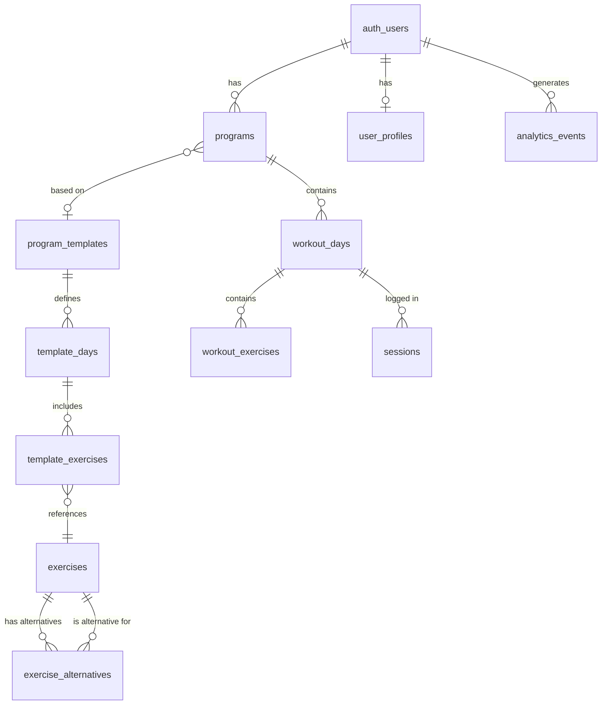
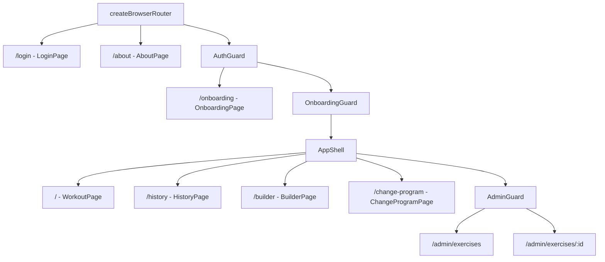
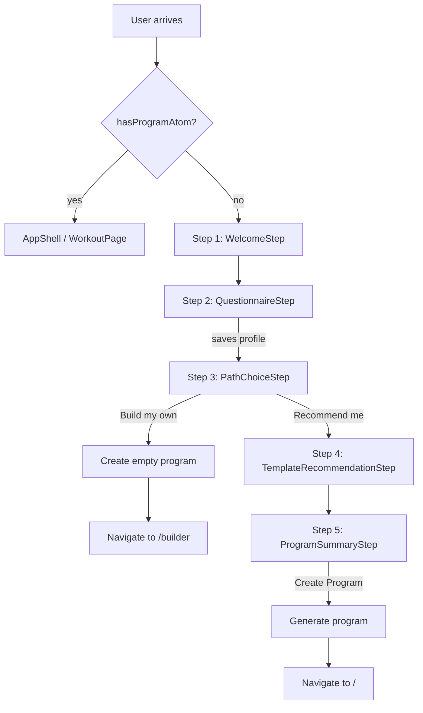

# Tech Plan — Onboarding & Program Generation

## Architectural Approach

### Key Decisions

| Decision | Choice | Rationale |
|---|---|---|
| Onboarding signal | `programs` row existence, checked at auth time via Jotai atom (`hasProgramAtom`) | Mirrors the `isAdmin` / `isAdminLoading` pattern in `file:src/lib/supabase.ts`. No extra column, no redundancy — the existence of a programs row IS the completion signal. |
| Route protection | `OnboardingGuard` wrapper between `AuthGuard` and `AppShell` | Separates concerns. `AuthGuard` handles auth, `OnboardingGuard` handles onboarding. `/onboarding` route sits outside this guard to avoid redirect loops. |
| Onboarding page placement | `/onboarding` outside `AppShell` (full-screen), `/change-program` inside `AppShell` | Onboarding is a dedicated experience — no hamburger menu, no session timer. Program switching is an in-app action — keeps nav context. |
| Wizard state | Local React state in page component | Each step gets data via props and calls `onNext(data)`. Simple, no atom pollution. React Hook Form + Zod for the questionnaire step only. |
| Template storage | Supabase tables, seeded via migration SQL | Extensible — add templates via migration, no code change. Queryable from admin if ever needed. |
| Template seed references | Name-based CTE lookups in seed SQL | Exercise UUIDs differ between prod and local Supabase (CI/E2E). Name-based lookups work everywhere. |
| Recommendation engine | Client-side pure function | 5 templates — zero reason to push to Postgres. Easily unit-testable, no network round trip for ranking. |
| Program generation | Client-side sequential inserts (same as `useBootstrapProgram`) | Consistent with established pattern. Not transactional, but retryable. |
| `workout_days.program_id` | NOT NULL FK | Clean slate, no real users. Every day belongs to a program. |

### Critical Constraints

- **`useWorkoutDays` is the critical refactor point.** Currently filters by `user_id` only (`file:src/hooks/useWorkoutDays.ts`). Must add `program_id` filter. Every downstream consumer (`WorkoutPage`, `DaySelector`, `DayList`, `DayEditor`, `syncService.resolveSessionMeta`) inherits this change automatically since they receive days as data.

- **`useBuilderMutations.useCreateDay`** (`file:src/hooks/useBuilderMutations.ts`) inserts `workout_days` with `user_id`. Must also include `program_id` from the active program. Other mutations (update, delete, reorder) don't need changes — they operate on existing day IDs.

- **`syncService.resolveSessionMeta`** (`file:src/lib/syncService.ts` line 137) reads `workout-days` from the React Query cache by key `["workout-days", userId]`. The query key will change to include `programId` — this cache lookup must be updated.

- **RLS on `programs`:** `user_id = auth.uid()` for all operations. RLS on `workout_days` stays as-is (already scoped by `user_id`), but the `program_id` FK provides an additional grouping constraint.

- **`/onboarding` must be outside `OnboardingGuard`** but inside `AuthGuard`. Otherwise: no auth → redirect to login; no program → redirect to onboarding; onboarding requires auth → works. If onboarding were inside `OnboardingGuard` → infinite redirect.

---

## Data Model

### ER Diagram



### New Tables

**`programs`**

```sql
CREATE TABLE programs (
  id uuid PRIMARY KEY DEFAULT gen_random_uuid(),
  user_id uuid NOT NULL REFERENCES auth.users(id) ON DELETE CASCADE,
  template_id uuid REFERENCES program_templates(id),
  is_active boolean NOT NULL DEFAULT true,
  created_at timestamptz NOT NULL DEFAULT now()
);

ALTER TABLE programs ENABLE ROW LEVEL SECURITY;
CREATE POLICY "Users manage own programs" ON programs
  FOR ALL USING (auth.uid() = user_id) WITH CHECK (auth.uid() = user_id);

CREATE UNIQUE INDEX programs_active_unique
  ON programs (user_id) WHERE is_active = true;
```

The unique partial index ensures at most one active program per user.

**`user_profiles`**

```sql
CREATE TABLE user_profiles (
  user_id uuid PRIMARY KEY REFERENCES auth.users(id) ON DELETE CASCADE,
  age integer,
  weight_kg numeric,
  goal text NOT NULL CHECK (goal IN ('strength', 'hypertrophy', 'endurance', 'general_fitness')),
  experience text NOT NULL CHECK (experience IN ('beginner', 'intermediate', 'advanced')),
  equipment text NOT NULL CHECK (equipment IN ('home', 'gym', 'minimal')),
  training_days_per_week integer NOT NULL CHECK (training_days_per_week BETWEEN 2 AND 6),
  session_duration_minutes integer NOT NULL CHECK (session_duration_minutes IN (30, 45, 60, 90)),
  created_at timestamptz NOT NULL DEFAULT now()
);

ALTER TABLE user_profiles ENABLE ROW LEVEL SECURITY;
CREATE POLICY "Users manage own profile" ON user_profiles
  FOR ALL USING (auth.uid() = user_id) WITH CHECK (auth.uid() = user_id);
```

**`program_templates`** (read-only for regular users, seeded by migration)

```sql
CREATE TABLE program_templates (
  id uuid PRIMARY KEY DEFAULT gen_random_uuid(),
  name text NOT NULL UNIQUE,
  description text,
  min_days integer NOT NULL,
  max_days integer NOT NULL,
  primary_goal text NOT NULL,
  experience_tags text[] NOT NULL DEFAULT '{}',
  created_at timestamptz NOT NULL DEFAULT now()
);

ALTER TABLE program_templates ENABLE ROW LEVEL SECURITY;
CREATE POLICY "Templates are readable by all authenticated users" ON program_templates
  FOR SELECT USING (auth.role() = 'authenticated');
```

**`template_days`**

```sql
CREATE TABLE template_days (
  id uuid PRIMARY KEY DEFAULT gen_random_uuid(),
  template_id uuid NOT NULL REFERENCES program_templates(id) ON DELETE CASCADE,
  day_label text NOT NULL,
  day_number integer NOT NULL,
  muscle_focus text,
  sort_order integer NOT NULL DEFAULT 0
);

ALTER TABLE template_days ENABLE ROW LEVEL SECURITY;
CREATE POLICY "Template days readable by authenticated" ON template_days
  FOR SELECT USING (auth.role() = 'authenticated');
```

**`template_exercises`**

```sql
CREATE TABLE template_exercises (
  id uuid PRIMARY KEY DEFAULT gen_random_uuid(),
  template_day_id uuid NOT NULL REFERENCES template_days(id) ON DELETE CASCADE,
  exercise_id uuid NOT NULL REFERENCES exercises(id),
  sets integer NOT NULL DEFAULT 3,
  rep_range text NOT NULL,
  rest_seconds integer NOT NULL DEFAULT 90,
  sort_order integer NOT NULL DEFAULT 0
);

ALTER TABLE template_exercises ENABLE ROW LEVEL SECURITY;
CREATE POLICY "Template exercises readable by authenticated" ON template_exercises
  FOR SELECT USING (auth.role() = 'authenticated');
```

**`exercise_alternatives`**

```sql
CREATE TABLE exercise_alternatives (
  id uuid PRIMARY KEY DEFAULT gen_random_uuid(),
  exercise_id uuid NOT NULL REFERENCES exercises(id),
  alternative_exercise_id uuid NOT NULL REFERENCES exercises(id),
  equipment_context text NOT NULL CHECK (equipment_context IN ('home', 'minimal')),
  UNIQUE(exercise_id, equipment_context)
);

ALTER TABLE exercise_alternatives ENABLE ROW LEVEL SECURITY;
CREATE POLICY "Alternatives readable by authenticated" ON exercise_alternatives
  FOR SELECT USING (auth.role() = 'authenticated');
```

**`analytics_events`**

```sql
CREATE TABLE analytics_events (
  id uuid PRIMARY KEY DEFAULT gen_random_uuid(),
  event_type text NOT NULL,
  user_id uuid REFERENCES auth.users(id) ON DELETE SET NULL,
  payload jsonb,
  created_at timestamptz NOT NULL DEFAULT now()
);

ALTER TABLE analytics_events ENABLE ROW LEVEL SECURITY;
CREATE POLICY "Users can insert own events" ON analytics_events
  FOR INSERT WITH CHECK (auth.uid() = user_id);
```

### Modified Table

**`workout_days`** — add `program_id` FK:

```sql
ALTER TABLE workout_days
  ADD COLUMN program_id uuid NOT NULL REFERENCES programs(id) ON DELETE CASCADE;
```

### TypeScript Types

New file `file:src/types/onboarding.ts`:

```typescript
export type UserGoal = 'strength' | 'hypertrophy' | 'endurance' | 'general_fitness'
export type UserExperience = 'beginner' | 'intermediate' | 'advanced'
export type UserEquipment = 'home' | 'gym' | 'minimal'

export interface UserProfile {
  user_id: string
  age: number | null
  weight_kg: number | null
  goal: UserGoal
  experience: UserExperience
  equipment: UserEquipment
  training_days_per_week: number
  session_duration_minutes: number
  created_at: string
}

export interface ProgramTemplate {
  id: string
  name: string
  description: string | null
  min_days: number
  max_days: number
  primary_goal: string
  experience_tags: string[]
  template_days: TemplateDay[]
}

export interface TemplateDay {
  id: string
  template_id: string
  day_label: string
  day_number: number
  muscle_focus: string | null
  sort_order: number
  template_exercises: TemplateExercise[]
}

export interface TemplateExercise {
  id: string
  template_day_id: string
  exercise_id: string
  sets: number
  rep_range: string
  rest_seconds: number
  sort_order: number
  exercise?: Exercise
}

export interface Program {
  id: string
  user_id: string
  template_id: string | null
  is_active: boolean
  created_at: string
}

export interface ExerciseAlternative {
  exercise_id: string
  alternative_exercise_id: string
  equipment_context: 'home' | 'minimal'
}
```

Add to `file:src/types/database.ts` — add `program_id` to `WorkoutDay`:

```typescript
export interface WorkoutDay {
  // ... existing fields
  program_id: string
}
```

---

## Component Architecture

### Route Structure



Router config change in `file:src/router/index.tsx`:

```typescript
export const router = createBrowserRouter([
  { path: "/login", element: <LoginPage />, errorElement: <RouteErrorFallback /> },
  { path: "/about", element: <AboutPage />, errorElement: <RouteErrorFallback /> },
  {
    element: <AuthGuard />,
    errorElement: <RouteErrorFallback />,
    children: [
      { path: "/onboarding", element: <OnboardingPage /> },
      {
        element: <OnboardingGuard />,
        children: [
          {
            element: <AppShell />,
            children: [
              { path: "/", element: <WorkoutPage /> },
              { path: "/history", element: <HistoryPage /> },
              { path: "/builder", element: <BuilderPage /> },
              { path: "/change-program", element: <ChangeProgramPage /> },
              {
                element: <AdminGuard />,
                children: [
                  { path: "/admin/exercises", element: <AdminExercisesPage /> },
                  { path: "/admin/exercises/:id", element: <AdminExerciseEditPage /> },
                ],
              },
            ],
          },
        ],
      },
    ],
  },
])
```

### Wizard Step Flow



### New Files & Responsibilities

| File | Purpose |
|---|---|
| `src/router/OnboardingGuard.tsx` | Reads `hasProgramAtom`. If false → `Navigate to="/onboarding"`. If loading → null. If true → `Outlet`. |
| `src/pages/OnboardingPage.tsx` | Full-screen wizard (Steps 1-5). Holds local state: `step`, `profileData`, `selectedTemplate`. Orchestrates step transitions. |
| `src/pages/ChangeProgramPage.tsx` | In-app wizard (Steps 3-5). Reuses step components. Phase 3. |
| `src/components/onboarding/WelcomeStep.tsx` | Static welcome screen. Props: `onNext()`. |
| `src/components/onboarding/QuestionnaireStep.tsx` | React Hook Form + Zod. Collects all profile fields. Props: `onNext(profileData)`. Respects `weightUnitAtom` for weight input. |
| `src/components/onboarding/PathChoiceStep.tsx` | Two cards: guided vs self-directed. Props: `onGuided()`, `onSelfDirected()`. |
| `src/components/onboarding/TemplateRecommendationStep.tsx` | Fetches templates via `useTemplates()`, ranks via `rankTemplates()`, displays ranked list. Props: `profile`, `onSelect(template)`, `onSkip()`. |
| `src/components/onboarding/ProgramSummaryStep.tsx` | Previews generated days and exercises. Props: `template`, `profile`, `onConfirm()`, `onBack()`. |
| `src/components/onboarding/schema.ts` | Zod schema for questionnaire validation. |
| `src/hooks/useActiveProgram.ts` | React Query: `programs WHERE user_id AND is_active = true`. Query key: `["active-program", userId]`. |
| `src/hooks/useTemplates.ts` | React Query: `program_templates` with nested `template_days(template_exercises(exercise:exercises(*)))`. Returns full template tree. |
| `src/hooks/useCreateUserProfile.ts` | Mutation: `INSERT INTO user_profiles`. Upsert pattern (ON CONFLICT DO UPDATE) for re-onboarding. |
| `src/hooks/useGenerateProgram.ts` | Mutation: creates `programs` row, deactivates old program, creates `workout_days` + `workout_exercises`. Invalidates `["workout-days"]` and `["active-program"]` caches. Sets `hasProgramAtom = true`. |
| `src/hooks/useExerciseAlternatives.ts` | React Query: fetches `exercise_alternatives`. Used by program generation for swap resolution. |
| `src/lib/recommendTemplates.ts` | Pure function: `(templates, profile) => rankedTemplates[]`. Filter by frequency, rank by goal match, tiebreak by experience. |
| `src/lib/generateProgram.ts` | Pure logic for adapting sets/reps by experience. Used by `useGenerateProgram`. |
| `src/types/onboarding.ts` | TypeScript interfaces for all new entities. |
| `src/locales/en/onboarding.json` | English strings for wizard. |
| `src/locales/fr/onboarding.json` | French strings for wizard. |

### Modified Files

| File | Change |
|---|---|
| `file:src/store/atoms.ts` | Add `hasProgramAtom` (boolean) and `hasProgramLoadingAtom` (boolean). |
| `file:src/lib/supabase.ts` | At auth time, query `programs` for active program. Set `hasProgramAtom` and `hasProgramLoadingAtom`. Pattern identical to `checkAdminStatus()`. |
| `file:src/hooks/useWorkoutDays.ts` | Accept `programId` param (from `useActiveProgram`). Add `.eq("program_id", programId)` filter. Update query key to `["workout-days", userId, programId]`. |
| `file:src/hooks/useBuilderMutations.ts` | `useCreateDay`: accept `programId`, include in INSERT. Other mutations unchanged. |
| `file:src/lib/syncService.ts` | Update `resolveSessionMeta` cache key lookup from `["workout-days", userId]` to `["workout-days", userId, programId]` — read programId from the active program atom. |
| `file:src/router/index.tsx` | Add `OnboardingGuard` wrapper, `/onboarding` route, `/change-program` route (Phase 3). |
| `file:src/pages/WorkoutPage.tsx` | Remove `useBootstrapProgram` import and usage. New empty state: purposeful UI with link to builder. |
| `file:src/components/SideDrawer.tsx` | Add "Change Program" nav link to `/change-program`. Phase 3. |
| `file:src/types/database.ts` | Add `program_id: string` to `WorkoutDay`. |
| `file:src/lib/i18n.ts` | Add `"onboarding"` to namespace list. |

### Deleted Files

| File | Phase |
|---|---|
| `file:src/hooks/useBootstrapProgram.ts` | Phase 2 — replaced by `useGenerateProgram` + onboarding redirect. |

### Component Responsibilities

**`OnboardingGuard`**
- Reads `hasProgramAtom` and `hasProgramLoadingAtom` from Jotai
- Loading → returns `null` (blank screen, same as `AuthGuard` / `AdminGuard`)
- No program → `<Navigate to="/onboarding" replace />`
- Has program → `<Outlet />`

**`OnboardingPage`**
- Local state: `{ step: number, profileData: Partial<UserProfile>, selectedTemplate: ProgramTemplate | null }`
- Renders current step component based on `step`
- Step transitions: each step calls `onNext(data)` which updates state and increments step
- Self-directed path: calls `useGenerateProgram` with no template, then navigates to `/builder`
- Guided completion: calls `useGenerateProgram` with selected template, then navigates to `/`
- Full-screen layout, no AppShell — custom minimal header with app logo only

**`QuestionnaireStep`**
- Uses React Hook Form with Zod schema
- Weight input: reads `weightUnitAtom`, displays in user's preferred unit, converts to kg on submit
- All fields on a single scrollable form (not one-field-per-screen)
- Validation: all required fields must be filled before "Next"

**`TemplateRecommendationStep`**
- Calls `useTemplates()` to fetch all templates
- Passes templates + profile to `rankTemplates()` pure function
- Renders ranked cards: template name, description, days/week range, primary goal badge
- Top pick gets a "Recommended" badge
- User taps a card to select → `onSelect(template)`
- Small "skip" link at bottom → `onSkip()` (creates empty program)

**`ProgramSummaryStep`**
- Takes selected template + profile
- Previews: for each template_day, shows day label, muscle focus, exercise list with adapted sets/reps
- Read-only in v1 — no inline editing. After creation, a success message directs users to the builder for customization.
- "Create Program" button at bottom → `onConfirm()`
- "Back" button → `onBack()`
- **Future evolution:** add light inline editing (remove/swap exercises) before confirming. Deferred to keep wizard scope tight — the builder already handles full CRUD.

**`rankTemplates(templates, profile)`** (`file:src/lib/recommendTemplates.ts`)
- Filter: `profile.training_days_per_week` must be within `[template.min_days, template.max_days]`
- Score: +10 for goal match, +5 for experience match
- Sort descending by score
- Returns all matching templates (not just top 1)

**`useGenerateProgram`** (`file:src/hooks/useGenerateProgram.ts`)
- Input: `{ templateId: string | null, profile: UserProfile }`
- Steps:
  1. Set any existing active program to `is_active = false`
  2. Insert new `programs` row (`template_id`, `user_id`, `is_active = true`)
  3. If `templateId` is not null (guided path):
     - Fetch template with days and exercises
     - Fetch exercise alternatives for user's equipment
     - For each template_day: insert `workout_day` (with `program_id`)
     - For each template_exercise: resolve swap if needed, adapt sets/reps, insert `workout_exercise`
  4. Invalidate `["workout-days"]`, `["active-program"]` query caches
  5. Set `hasProgramAtom = true`
- If `templateId` is null (self-directed): only steps 1-2 and 4-5 (empty program)

### Failure Mode Analysis

| Failure | Behavior |
|---|---|
| Auth check for programs fails (network error) | `hasProgramLoadingAtom` stays true → blank screen. User refreshes to retry. Same as existing admin check behavior. |
| Questionnaire submit fails | Toast error, user stays on questionnaire step. Data preserved in form state. |
| Program generation partially fails (days created, exercises fail) | Toast error. User has a partial program visible in builder. Can retry from wizard or fix manually. |
| User navigates away mid-wizard | No data saved until explicit actions (profile save, program creation). Safe to abandon. |
| Two tabs open: one completes onboarding | Other tab still has stale `hasProgramAtom = false`. On next navigation, `OnboardingGuard` redirects to `/onboarding`. Wizard detects existing program and redirects to `/`. |
| User deletes all programs via builder | Not possible in current builder (no "delete program" action). If we add it later, `hasProgramAtom` would need refresh. |
| Template seed references a non-existent exercise name | Migration fails. CI catches this in E2E setup (local Supabase runs all migrations). |
| Exercise alternative doesn't exist for an exercise | Best-effort: original exercise is kept. User can swap in builder. |

---

## Implementation Order

### Phase 1 — Schema Foundation + Query Refactor

1. Migration: `create_programs` (table + RLS + unique partial index)
2. Migration: `create_user_profiles` (table + RLS)
3. Migration: `create_program_templates` + `create_template_days` + `create_template_exercises` (tables + RLS)
4. Migration: `create_exercise_alternatives` (table + RLS + unique constraint)
5. Migration: `create_analytics_events` (table + RLS)
6. Migration: `add_program_id_to_workout_days` (ALTER TABLE + NOT NULL)
7. TypeScript types: `file:src/types/onboarding.ts`, update `file:src/types/database.ts`
8. New atoms: `hasProgramAtom`, `hasProgramLoadingAtom` in `file:src/store/atoms.ts`
9. Auth-time check: add `checkProgramStatus()` in `file:src/lib/supabase.ts`
10. `useActiveProgram` hook
11. Refactor `useWorkoutDays`: accept `programId`, update filter and query key
12. Refactor `useBuilderMutations.useCreateDay`: accept and include `program_id`
13. Refactor `syncService.resolveSessionMeta`: update cache key lookup
14. `OnboardingGuard` component
15. Route structure update in `file:src/router/index.tsx` (add guard + `/onboarding` placeholder)
16. WorkoutPage: new empty state, remove `useBootstrapProgram` usage
17. Tests: update existing tests for workout-days query key changes

### Phase 2 — Templates + Onboarding Wizard + Program Generation

1. Migration: seed 5 program templates (name-based exercise lookups)
2. Migration: seed exercise_alternatives swap table
3. `useTemplates` hook (fetch templates with nested days/exercises)
4. `useExerciseAlternatives` hook
5. `rankTemplates` pure function + unit tests
6. `useCreateUserProfile` hook
7. `useGenerateProgram` hook (program creation + day/exercise generation + swap resolution)
8. Zod schema for questionnaire (`file:src/components/onboarding/schema.ts`)
9. `WelcomeStep` component
10. `QuestionnaireStep` component (React Hook Form + weight unit conversion)
11. `PathChoiceStep` component
12. `TemplateRecommendationStep` component
13. `ProgramSummaryStep` component
14. `OnboardingPage` (orchestrates all steps)
15. Wire onboarding redirect on first login
16. Delete `file:src/hooks/useBootstrapProgram.ts`
17. i18n: `onboarding` namespace (EN + FR)

### Phase 3 — Polish + Switching + Analytics

1. `ChangeProgramPage` (reuses steps 3-5)
2. `/change-program` route in `file:src/router/index.tsx`
3. "Change Program" link in `file:src/components/SideDrawer.tsx`
4. Analytics event utility hook (`useTrackEvent`)
5. Instrument wizard steps with analytics events
6. i18n review and polish
7. Edge cases: profile editing, re-onboarding detection

---

## References

- Epic Brief: `file:docs/Epic_Brief_—_Onboarding_&_Program_Generation.md`
- GitHub Issue: [#3](https://github.com/PierreTsia/workout-app/issues/3)
- Existing patterns: `file:src/hooks/useBootstrapProgram.ts` (program generation), `file:src/lib/supabase.ts` (auth-time checks), `file:src/router/AuthGuard.tsx` (route guards)
