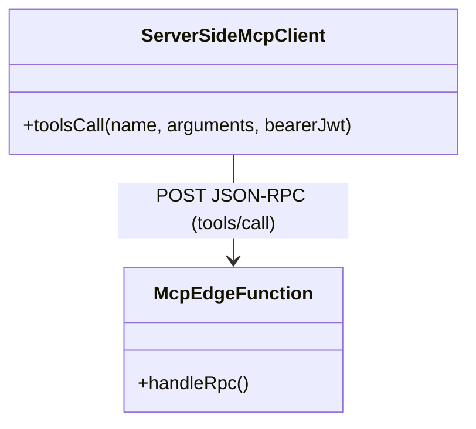
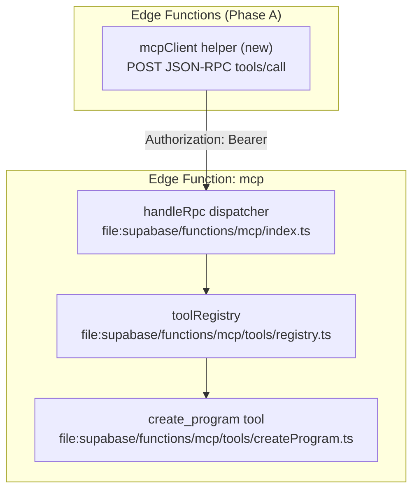

# Tech Plan — Onboarding — MCP-first foundation (Phase A, #295)

## Architectural Approach

### Key Decisions

| Decision | Choice | Rationale |
|---|---|---|
| MCP server implementation | Reuse existing hand-rolled JSON-RPC + registries | Stable, minimal deps, already documented and shipped (`file:supabase/functions/mcp/index.ts`, `file:supabase/functions/mcp/tools/registry.ts`, `file:docs/done/Tech_Plan_—_MCP-First_Architecture_#231.md`) |
| First-party (server-side) MCP caller | Add a tiny JSON-RPC client helper in Edge Functions | There is no MCP client helper in `src/`; Phase B needs a canonical way to call `tools/call` |
| Auth to MCP | Forward the user Supabase access token as `Authorization: Bearer <token>` | Matches MCP auth posture: non-PAT tokens are passed through and used for RLS (`file:supabase/functions/mcp/lib/authLogic.ts`) |
| Program persistence contract | Use MCP `create_program` only | Canonical validated write path with `dry_run` preview and strict validation (`file:supabase/functions/mcp/tools/createProgram.ts`) |
| Phase A→B cutover mechanism | Build-time env flag (`VITE_*`) | v1 simplicity; accepts redeploy for flips (Epic Brief cutover section). Preview/branch deploys can set a different flag value than production, enabling safe beta on preview URLs |

### Critical Constraints

Phase A is “plumbing-first”: we must be able to call MCP tools from server-side code without impacting the onboarding funnel.

- **Never call MCP with service-role credentials**: calling `create_program` with privileged tokens risks cross-user corruption; it must always be a user-scoped Bearer token and rely on RLS.
- **MCP endpoint requires Bearer header**: missing `Authorization: Bearer …` is rejected at the HTTP boundary (`file:supabase/functions/mcp/index.ts`).
- **Transport is POST JSON-RPC only**: no SSE/streamable HTTP required for first-party calls.
- **Legacy AI onboarding path stays default until Phase B flag**: today AI path persists in `file:src/components/create-program/AIProgramPreviewStep.tsx`; Phase A must not break this.

---

## Data Model

No database schema changes required for Phase A.

### Table Notes

- None.

---

## Component Architecture

### Layer Overview

### New Files & Responsibilities

| File | Purpose |
|---|---|
| `file:supabase/functions/_shared/mcpClient.ts` | Tiny JSON-RPC client for MCP `tools/call` with structured error mapping |
| `file:supabase/functions/_shared/mcpClient.test.ts` (optional) | Unit tests for request/response envelopes |

### Component Responsibilities

`**mcpClient.ts**`
- Build JSON-RPC envelope for `tools/call` and attach Bearer token
- Parse JSON-RPC errors vs tool-level `isError`
- Return a normalized result type used by Phase B orchestrator

### Failure Mode Analysis (if applicable)

| Failure | Behavior |
|---|---|
| Missing/invalid Bearer token | MCP returns 401 + `WWW-Authenticate`; caller surfaces structured auth failure |
| Tool validation error | Tool returns `isError`; caller returns non-retryable error kind |
| Network timeout | Caller returns retryable error kind; Phase B decides UX |
| JSON-RPC protocol error | Caller returns structured rpc error with code/message for logs |
