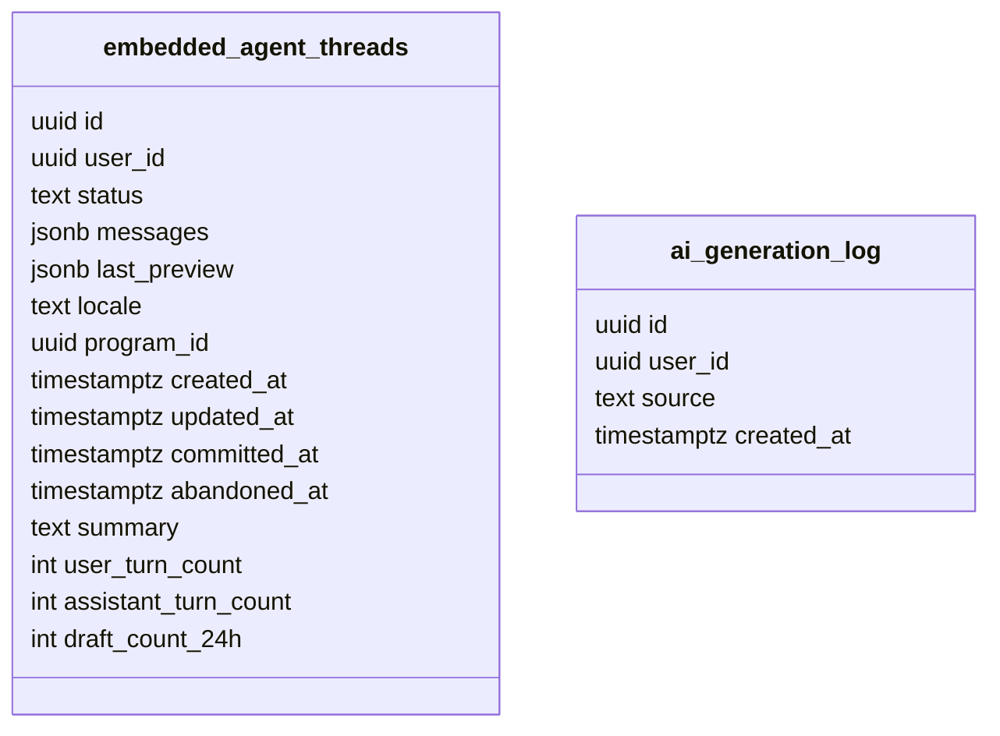
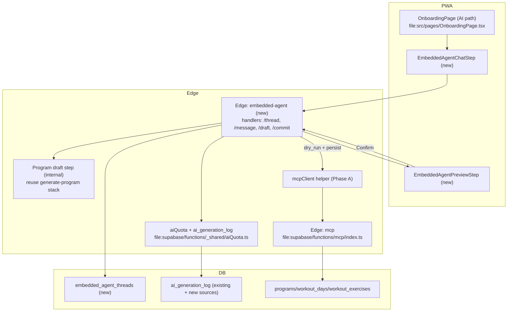

# Tech Plan — Onboarding — Embedded Agent onboarding (Phase B, #295)

## Architectural Approach

### Key Decisions

| Decision | Choice | Rationale |
|---|---|---|
| UX scope | AI path only; onboarding form stays; chat additive | Locked in `file:docs/CONTEXT.md` + Epic Brief |
| Edge function shape | **Hybrid**: one Edge function with multiple handlers/routes | Shared code, fewer deploy units; still clear boundaries for auth/quota/draft/commit |
| Thread persistence | New `embedded_agent_threads` table + RLS + partial unique index | Resume + quota + single active onboarding attempt |
| Thread storage strategy | **Hybrid**: raw while active; on `committed` purge raw, keep deterministic summary | Privacy-first without extra model calls |
| Quota/logging | **log_everything**: log every billable call (turn + draft), failures count | Protects hosted key; avoids “retry loophole” |
| v1 quota numbers | **Balanced**: 40 assistant turns / hour; 3 drafts / 24h; drafts consume existing `program` quota (5/30d) | Usable but bounded; tunable post-launch |
| Draft triggers | (A) machine-readable ready signal OR (B) cap OR (C) user CTA | Prevents indefinite waiting; user agency |
| Persistence | MCP `create_program` with `dry_run` preview + explicit confirm | Single write contract + commit gate |
| Streaming | No token streaming in v1 | No SSE infra today; ship safer. Preserve a seam for follow-up |

### Critical Constraints

- **Legacy AI onboarding persists client-side today** (`file:src/components/create-program/AIProgramPreviewStep.tsx`); Phase B must converge persistence on MCP `create_program` to avoid drift and duplicated semantics.
- **Quota is server-side** and runs before model calls; client-trusted caps are unacceptable for a GymLogic-hosted key.
- **Privacy is blocking for GA**: policy + in-app disclosure must land before default-on rollout (Epic Brief story 22).
- **JWT trust posture**: prefer `supabase.auth.getUser()` in new Edge handlers; avoid “decode-only” identity where possible.

---

## Data Model



### Table Notes

- **RLS**: `user_id = auth.uid()` for read/write.
- **FK**: `user_id → auth.users(id) ON DELETE CASCADE` to guarantee immediate erase on account deletion.
- **Partial unique index**: at most one active onboarding thread per user where `status IN ('open', 'preview_ready')`.
- **Active-thread UX**: DB uniqueness is enforced, but user flow should not be “error-driven”. Implement `getOrCreateActiveThread(user_id)`:
  - If an active thread exists, **resume it** and return `resumed: true` (no silent reject).
  - If the user explicitly wants to restart, provide a **Restart** action that first marks the active thread `abandoned` (with `abandoned_at`) and then creates a new thread.
- **Hybrid transcript**:
  - While active (`open`, `preview_ready`): `messages` stores raw transcript (role/content/timestamp minimal fields).
  - On commit (`committed`): compute deterministic `summary`, set `messages` to `null`/empty, keep `program_id` + timestamps and optional `last_preview`.
- **Deterministic summary**: generated without an extra model call (no tokens). Build from structured onboarding form constraints + a small whitelist of extracted chat signals (e.g. injury flags) and store in `summary`.
- **Retention**:
  - Lazy cleanup in Edge: when loading/updating a thread, if `committed_at`/`abandoned_at` older than 90d → clear `messages` (if any) or delete per policy.
- **Staleness**:
  - Lazy, server-side only: on thread touch, if `updated_at` older than 7d → set `abandoned`.
  - If `updated_at` is old but < 7d (e.g. 6d), **resume** normally; optionally show a “resumed conversation” banner in UI and allow Restart.

---

## Component Architecture

### Layer Overview



### New Files & Responsibilities

| File | Purpose |
|---|---|
| `file:supabase/functions/embedded-agent/index.ts` | Router with `/thread`, `/message`, `/draft`, `/commit` handlers |
| `file:supabase/functions/embedded-agent/threadStore.ts` | Thread CRUD, append, lifecycle transitions, purge-on-commit, lazy retention |
| `file:supabase/functions/embedded-agent/quota.ts` | Enforce v1 caps and **log_everything** to `ai_generation_log` |
| `file:supabase/functions/embedded-agent/prompt.ts` | System prompt + locale instruction + ready-signal schema |
| `file:supabase/functions/embedded-agent/draft.ts` | Program draft step using `generate-program` internals + thread context |
| `file:src/components/onboarding/EmbeddedAgentChatStep.tsx` | shadcn/ui chat UI; typing state + phase statuses; Generate CTA |
| `file:src/components/onboarding/EmbeddedAgentPreviewStep.tsx` | Preview UI from `last_preview` + confirm/regenerate |
| `file:supabase/migrations/*_embedded_agent_threads.sql` | DDL + RLS + partial unique + FK cascade |
| `file:supabase/migrations/*_ai_generation_log_sources_embedded_agent.sql` | Extend `source` CHECK + index for embedded sources |

### Component Responsibilities

`**EmbeddedAgentChatStep (PWA)**`
- Uses shadcn/ui building blocks (Input/Button/ScrollArea/Card/Skeleton)
- Shows immediate “assistant thinking” bubble (no token streaming)
- Shows deterministic phase statuses (read answers / draft / validate / preview)
- Offers “Generate my plan” CTA any time after form is completed

`**embedded-agent Edge function**`
- Auth: `supabase.auth.getUser()` to resolve `user_id`
- `/thread`: load active thread (or create) via `getOrCreateActiveThread`; lazy staleness abandon (7d) and resume banner metadata
- `/message`:
  - Persist user msg
  - Enforce **turns/hour** cap (40/h)
  - Call model for assistant msg (log to `ai_generation_log` even on failure)
  - Persist assistant msg only when response is final (non-streaming v1)
  - Detect ready-signal (machine-readable)
  - If ready → return `{ ready_for_draft: true }`
- `/draft`:
  - Enforce **draft/day** cap (3/24h) and existing **program** quota (5/30d)
  - Run Program draft step (log billable calls)
  - Call MCP `create_program` with `dry_run:true` and store `last_preview`
  - Transition to `preview_ready`
- `last_preview` size guard:
  - Store the **minimal** `create_program` arguments needed for commit gate (name + days + prescription objects) and optional rendered lines.
  - Enforce an Edge-side max JSON size (implementation constant) before writing `last_preview`; if exceeded, store only arguments and re-render preview client-side.
- `/commit`:
  - Requires explicit user confirmation
  - Call MCP `create_program` with `dry_run:false` using `last_preview` payload
  - Set `committed`, store deterministic `summary`, purge raw transcript

`**Program draft step (internal)**`
- Reuse `file:supabase/functions/generate-program/*` prompt/validate/catalog fetch
- Expand context: onboarding form constraints + thread transcript + locale
- Return draft structure that maps into MCP `create_program` arguments

### Failure Mode Analysis (if applicable)

| Failure | Behavior |
|---|---|
| Quota exceeded (turns/hour) | Friendly UI; user can wait or switch path |
| Quota exceeded (drafts/day) | Friendly UI; retry later; after 2 failures offer Template/Blank escape |
| Quota exceeded (program 5/30d) | Friendly UI; suggest Template/Blank; explain in non-technical copy |
| Model invalid ready-signal | Treat as normal message; cap + CTA avoids indefinite waiting |
| Draft validation failure | Friendly regenerate; log structured error; counts toward quota if billable |
| MCP dry_run failure | Friendly regenerate; after 2 consecutive failures offer Template/Blank |
| Commit failure | Keep `preview_ready` so user can retry commit without losing preview |

---

## Streaming follow-up (non-blocking)

V1 ships without token streaming. To keep streaming additive later:

- Add a new SSE endpoint (or fetch streaming) for `/message`.
- Keep DB writes **final-only**: do **not** persist partial assistant chunks in `embedded_agent_threads`; only persist the assistant message once a **final** event is emitted.
- Client renders partial text in-memory while streaming; on `final`, replace with the persisted message and store it.
- Quota/logging remains per provider call (already covered by `log_everything`).
```
