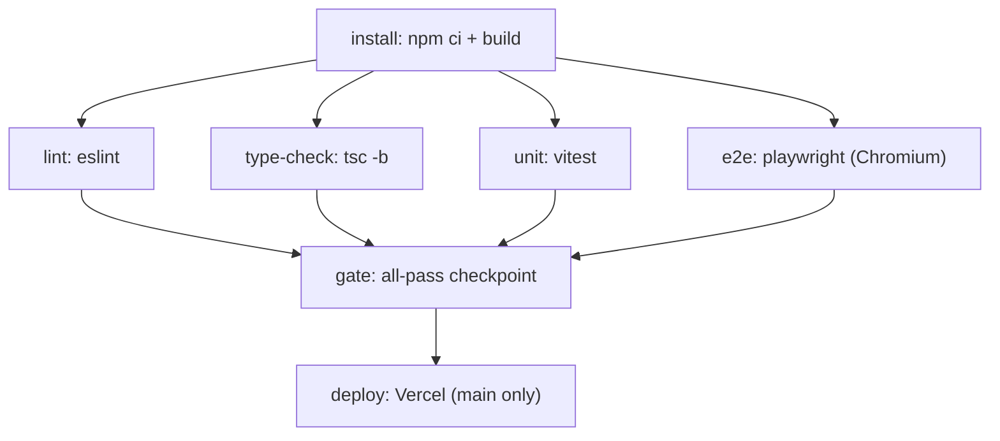

# Tech Plan — Optimize CI Pipeline

## Architectural Approach

### Key Decisions

| Decision | Choice | Rationale |
|---|---|---|
| Job dependency graph | Parallel after single `install` job | `lint`, `type-check`, `unit`, `e2e` have no inter-dependencies; running them sequentially wasted ~3 minutes |
| Dependency sharing | Upload/download artifact (`node_modules` + `dist`) | Eliminates 3 redundant `npm ci` invocations (~30s each). npm cache only caches tarballs, not the installed tree |
| Browser coverage | Chromium only | Personal project — cross-browser E2E across 3 engines tripled test time with no practical benefit |
| Playwright parallelism | Keep serial (`workers: 1`) | Only 4 test files sharing a single Supabase instance; parallel execution risks data conflicts. Revisit later |
| Playwright browser caching | `actions/cache` keyed on `package-lock.json` hash | `playwright install --with-deps` downloads ~300MB of browsers; caching avoids this on every run |
| Deploy gating | `gate` job with `needs: [lint, type-check, unit, e2e]` | All quality checks must pass before deploy, but they run in parallel to minimize wall-clock time |

### Critical Constraints

The E2E job depends on Supabase via Docker (`supabase start`). GitHub Actions has no built-in cache for Docker images pulled by third-party CLIs, so the Supabase cold start (~30-40s) remains an irreducible floor for the E2E job. This makes E2E the long pole regardless of other optimizations.

The `webServer` block in `file:playwright.config.ts` runs `npm run build && npx vite preview`, which performs a full `tsc -b && vite build`. Since the `install` job already runs the build and uploads `dist/` as an artifact, the E2E job restores both `node_modules/` and `dist/`, so the webServer only needs to run `npx vite preview`.

Artifact upload/download adds ~10-15s of overhead (zip, transfer, unzip). For a `node_modules` of ~200-400MB this is still faster than a fresh `npm ci`, but if it ever becomes a bottleneck, falling back to per-job `npm ci` with npm cache is trivial.

---

## Data Model

No data model changes — this is a CI/infrastructure optimization.

---

## Component Architecture

### Layer Overview

### New Files & Responsibilities

| File | Purpose |
|---|---|
| `file:.github/workflows/ci.yml` | Rewritten — parallel jobs, artifact sharing, Playwright cache, gate job |
| `file:playwright.config.ts` | Simplified — Chromium + unauthenticated projects only |

### Component Responsibilities

**`install` job**
- Checks out code, sets up Node with npm cache
- Runs `npm ci` and `npm run build` (produces `node_modules/` and `dist/`)
- Uploads both as a single artifact with 1-day retention

**`lint` / `type-check` / `unit` jobs**
- Download artifact, restore `node_modules/`
- Run their respective command (`eslint .`, `tsc -b`, `vitest run`)
- No `npm ci`, no build

**`e2e` job**
- Downloads artifact, restores `node_modules/` and `dist/`
- Caches Playwright browsers at `~/.cache/ms-playwright`
- Installs Playwright browsers only on cache miss
- Starts Supabase, resets DB, runs `npx playwright test`

**`gate` job**
- No-op job that depends on all four quality jobs
- Single convergence point for the deploy job

**`deploy` job**
- Only runs on `main` push after `gate` passes
- Unchanged Vercel deployment

### Failure Mode Analysis

| Failure | Behavior |
|---|---|
| Artifact upload fails | All downstream jobs fail immediately — visible in GH Actions UI |
| Playwright cache miss | Falls back to `playwright install --with-deps` — slower but correct |
| Supabase start fails | E2E job fails; does not block lint/type-check/unit (they run independently) |
| Single quality job fails | `gate` job fails → deploy is blocked, but other quality jobs still complete (useful for seeing all failures at once) |
| Artifact size too large | If `node_modules` exceeds GH Actions limits (10GB), fall back to per-job `npm ci` with npm cache |
