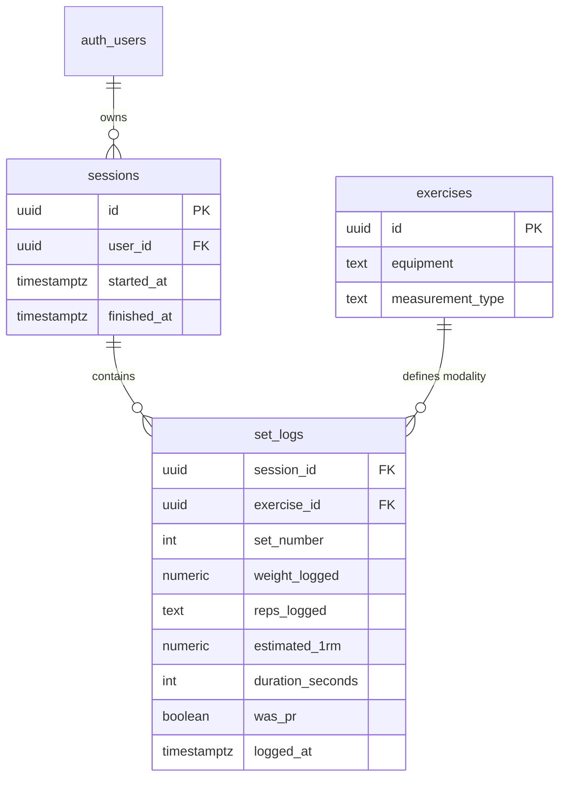
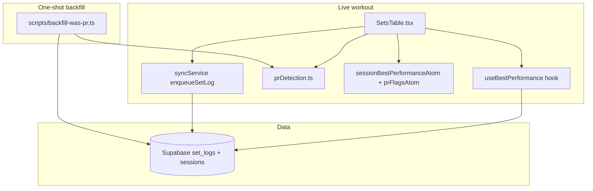

# Tech Plan — PR Detection Overhaul #175

## Architectural Approach

### Key Decisions

| Decision | Choice | Rationale |
|---|---|---|
| PR scoring source of truth | Pure module `file:src/lib/prDetection.ts` (modal classification + numeric score per set) | One algorithm for live workout + tests; avoids drift between UI and backfill |
| Live workout historical query | Replace `useBest1RM` with `useBestPerformance` returning `{ bestValue, hasPriorSession, modality, isFetched }` | `hasPriorSession` needs `currentSessionId` + join to `sessions`; historical **best excludes `currentSessionId`** to prevent double-counting when mid-session rows sync early |
| First-session baseline | `hasPriorSession = false` for every set in the **first finished session** (by `sessions.started_at`) that contains `(user, exercise)` | Matches Epic Brief; implemented via SQL `EXISTS` / distinct session count, not “first N sets” |
| Bodyweight PR metric | `exercises.equipment === "bodyweight"` → compare **reps only** (ignore `weight_logged` for score) | Added weight on pull-ups is not total load; Epley on small added kg is misleading |
| Weighted PR metric | All other rep-based rows → **Epley 1RM** from `weight_logged` + `reps_logged` | Unchanged from today; reuse `file:src/lib/epley.ts` |
| Duration PR metric | `measurement_type === "duration"` → compare **`duration_seconds`** | Aligns with stored column; weight on duration row is logged but out of scope for V1 score (Epic) |
| Race on query loading | **Prefetch** `useBestPerformance` when the active workout session starts and when the user lands on an exercise (`queryClient.prefetchQuery`). If still `!isFetched` at tap time, **do not** mark `wasPr: true` (conservative: avoids false positives; may rare false negative) | Removes `best1RMReady &&` gate that today drops real PRs; prefetch shrinks the window |
| Offline / unsynced prior session | Prior finished session may exist only in the local queue — DB says `hasPriorSession === false` | Accept rare **false negative** (no PR) for v1; optional later: scan pending queue for other `sessionId`s with same exercise (stretch) |
| Atom rename | `sessionBest1RMAtom` → `sessionBestPerformanceAtom` (or keep name, widen semantics) | Value is modality-specific “best score this session” keyed by `exercise_id` |
| Backfill delivery | **`tsx` script** `file:scripts/backfill-was-pr.ts` using `prDetection.ts` + service role; migration only **deletes** `record_hunter` `user_achievements` and documents runbook | Epic asked for SQL migration; **pure SQL window backfill across three modalities is error-prone**. Script shares TS truth; migration stays small. If ops require SQL-only, add PL/pgSQL duplicate in a follow-up (explicit non-goal for v1) |
| Post-backfill achievements | `DELETE` `user_achievements` for tiers in `record_hunter` only; then `SELECT check_and_grant_achievements(id) FROM auth.users` (or per-user in script) | Leaves other tracks untouched |

### Critical Constraints

**`set_logs` uniqueness.** Upsert uses `onConflict: "session_id,exercise_id,set_number"` in `file:src/lib/syncService.ts`. Backfill only **updates** `was_pr` and does not change natural keys.

**Chronological ordering for backfill.** Order by `set_logs.logged_at` (timestamptz). Tie-break by `(session_id, set_number)` if needed for stability.

**`sessions.finished_at` IS NOT NULL.** Only sets from finished sessions participate in history (matches achievement and analytics semantics). Unfinished sessions should not contribute to “prior session” detection; backfill should filter `JOIN sessions s ON s.id = sl.session_id WHERE s.finished_at IS NOT NULL`.

**First-session identification.** For each `(user_id, exercise_id)` from `set_logs` ∩ finished sessions: `first_session_id` = `session_id` of the row with minimum `logged_at` (or minimum `sessions.started_at` — Tech choice: **min(`sessions.started_at`)** among sessions that have a log for that pair, so reordering within session does not change baseline session). Epic says “earliest session that contains that exercise” — use **`MIN(s.started_at)`** then pick that session’s `id` if multiple sessions share the same start (unlikely).

**Orphan `exercise_id`.** `LEFT JOIN exercises`. Fallback: `measurement_type` null → treat as `'reps'`; `equipment` null → treat as weighted Epley path (conservative: do not use bodyweight reps path without evidence).

**RLS.** Backfill script uses **service role**. Client hook continues with authenticated user (existing RLS).

**Auth RPC.** `check_and_grant_achievements` enforces `auth.uid()`; running it for all users from SQL editor uses **postgres role** / `SECURITY DEFINER` with null `auth.uid()` — verify existing migration allows service path (see `file:supabase/migrations/20260401000009_rpc_auth_guard.sql`).

---

## Data Model

No new tables. `set_logs.was_pr` remains the persisted flag; `estimated_1rm`, `duration_seconds`, `reps_logged`, `weight_logged` stay as today.

### Modality → score function

| Modality | Condition | Score for set row | PR when |
|---|---|---|---|
| Duration | `measurement_type = 'duration'` | `duration_seconds` (null → 0) | `score > runningBest` and not first-session baseline |
| Bodyweight reps | `measurement_type != 'duration'` AND `equipment = 'bodyweight'` | `parseInt(reps_logged)` | same |
| Weighted reps | else | `computeEpley1RM(weight_logged, reps)` | same |

**First-session baseline:** for row `R`, if `R.session_id` equals `first_session_id(user, exercise)`, then `was_pr = false` (no comparison needed for PR true).

**Subsequent sessions:** iterate in global chronological order per `(user_id, exercise_id)`; `runningBest` = max score of all prior rows (excluding baseline session rows from PR eligibility — baseline rows still update implicit “history” for… actually baseline sets should still set running best for future sessions).  

**Clarification:** Baseline session sets **contribute to `runningBest`** for later sessions but **never** get `was_pr = true`. Session 2 set beats max(session1 scores) → PR.

---

## Component Architecture

### Layer Overview

### New / changed files

| File | Purpose |
|---|---|
| `file:src/lib/prDetection.ts` | `getPrModality(exercise)`, `scoreSetRow(row, exercise)`, `computeWasPr({...})` — pure, unit-tested |
| `file:src/hooks/useBestPerformance.ts` | Replaces `useBest1RM`; queryKey includes `exerciseId`, `currentSessionId`, `measurement_type`, `equipment` |
| `file:src/hooks/useBest1RM.ts` | Remove or thin re-export if something else needs 1RM-only later (currently only SetsTable) |
| `file:src/components/workout/SetsTable.tsx` | Branch PR logic by modality; duration `enqueueSetLog` includes `wasPr`; integrate prefetch |
| `file:src/lib/syncService.ts` | `SetLogPayloadDuration.wasPr`; `processSetLog` writes `was_pr` for duration |
| `file:src/store/atoms.ts` | Rename / document `sessionBestPerformanceAtom` |
| `file:src/pages/WorkoutPage.tsx` | Reset renamed atom; prefetch hook on session start (optional helper) |
| `file:src/lib/supabase.ts` | Clear renamed atom on logout |
| `file:scripts/backfill-was-pr.ts` | Paginated read → recompute → batch update `was_pr` |
| `file:supabase/migrations/YYYYMMDD_pr_backfill_record_hunter_reset.sql` | DELETE `user_achievements` for `record_hunter`; comment runbook |

### Component responsibilities

**`prDetection.ts`**
- Single place for “is this row a PR given ordered history context” used in tests and backfill script.

**`useBestPerformance`**
- Fetches all relevant `set_logs` for `exercise_id` **where `session_id <> currentSessionId`** (and session finished).
- Computes `bestValue` via same modality rules as `prDetection`.
- `hasPriorSession`: `EXISTS` finished session with this exercise **before** current session’s `started_at`, excluding current session (SQL detail in implementation).

**`SetsTable`**
- On rep completion: `runningBest = max(historicalBest, sessionBest[exerciseId])`; `wasPr` = `hasPriorSession && score > runningBest` with strict `>` (ties are not PRs).
- On duration completion: same pattern with duration score.
- Updates `sessionBest` atom with same score type as modality.

### Failure Mode Analysis

| Failure | Behavior |
|---|---|
| `useBestPerformance` still loading after prefetch | If `!isFetched` at tap, **never** set `wasPr: true` (conservative). If `isFetched` and first session, `hasPriorSession === false` → no PR. |
| Offline, prior session not synced | `hasPriorSession` may be false while user is actually on session 2+ | Rare false negative (no PR flash); acceptable v1 per Epic handoff |
| Exercise deleted (`LEFT JOIN` null) | Fallback to weighted reps path | May mis-classify old bodyweight if equipment was bodyweight — low incidence |
| Backfill script interrupted | Re-run idempotent: recompute all from scratch | Script should use transactions per batch or full table rewrite |
| `check_and_grant_achievements` batch for all users | Use migration SQL as superuser or documented SQL Editor snippet | Verify `auth.uid()` null path |

---

## Implementation order (suggested tickets)

1. **`prDetection.ts` + unit tests** — no UI.
2. **`useBestPerformance` + tests** — Supabase mock; replace `useBest1RM` import in SetsTable.
3. **`SetsTable` rep path** — first-session gate + modality + atom; fix race via prefetch from WorkoutPage.
4. **`SetsTable` duration path + syncService`** — add `wasPr` to payload and DB write.
5. **Atom rename + all imports** (WorkoutPage, supabase logout, tests).
6. **Migration** — DELETE record_hunter achievements only.
7. **`backfill-was-pr.ts`** — run locally/staging, then prod; then SQL to re-grant `check_and_grant_achievements` for all users.
8. **E2E / manual QA** — bodyweight, duration, weighted, first session vs second.

---

## Deferred / out of scope

- Pure-SQL backfill duplicate (only if ops block Node script).
- Hybrid weighted bodyweight score (Epic).
- Per-rep-range PRs.
- Showing “baseline session” UX copy.

When you're ready, say **split into tickets** to generate `docs/T{n}_—_*.md` files from this plan.
