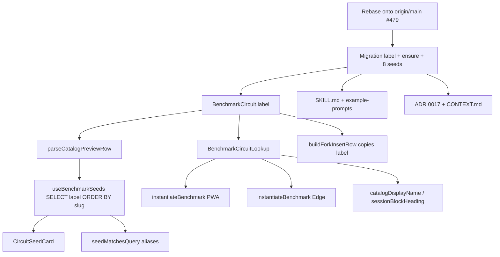

# Tech Plan — Pantheon (#480)

## Architectural Approach

### Key Decisions

| Decision | Choice | Rationale |
|---|---|---|
| Seed shape | Cindy JSONB plat, `mode: amrap`, `weight: 0`, 3 stations | `instantiateBenchmark` force `rounds: 1` ; `block_runs` est AMRAP-only |
| Nom affiché | Colonne `benchmark_circuits.label` (`Zeus ⚡`) ; slug ASCII inchangé | `catalogDisplayName(slug)` Title-Case ne peut pas porter d’emoji |
| Nullability | `label text NOT NULL` après backfill Cindy + 8 INSERT | Seeds et forks ont toujours un nom affichable |
| Écriture seeds | 1 migration SQL, `SELECT name INTO STRICT`, même usine que Cindy | Pas de YAML/CMS ; l’id d’exo est résolu **à migrate time** par env |
| Catalog local | `INSERT … ON CONFLICT (name) DO NOTHING` des noms FR du roster **avant** les INTO STRICT | `seed.sql` n’a pas Burpee/Dead bug/… ; prod les a déjà (MCP) → no-op |
| Fork | Copie `label` (comme tagline/story) | Row privée sans slug ; le heading fork ne doit pas retomber sur Title Case |
| Picker order | `useBenchmarkSeeds` `ORDER BY slug` | 9 cards stables ; tests non flaky |
| QW coerce | **Zéro** touche à `CINDY_SEED_KEYS` | Brief story 19 |
| Picker discovery | Aucun code de découverte ; liste déjà `owner_id IS NULL` | Après rebase sur #479 |
| Search accents | Aliases (`arès`, …) ; **pas** `normalizeForSearch` | `normalizeBenchmarkKey` = trim+lower ; NFD changerait le resolve MCP |
| Twins | PWA + Edge `instantiateBenchmark` / lookup **lockstep** | Label jour dérivé du catalog, pas du slug |
| Docs | ADR 0017 + patch `CONTEXT.md` + skill / `example-prompts.md` | Zeus n’est plus le jumeau Tours |

### Critical Constraints

- **Rebase d’abord.** `feat/480/pantheon-benchmark-seeds` a été coupée **avant** `origin/main` `51016b4` (Meet Cindy #479). `CircuitSeedCard`, `useBenchmarkSeeds`, `seedSearch` n’existent pas sur HEAD actuel. Implémenter sans rebase = réécrire le picker.
- **Twins.** `file:src/lib/instantiateBenchmark.ts` et `file:supabase/functions/mcp/lib/instantiateBenchmark.ts` (plus `circuitFromCatalog` / `seedLabelFromSlug` dans `file:supabase/functions/mcp/lib/createProgramValidation.ts`). Oublier l’Edge = MCP droppe encore « Zeus » sans ⚡.
- **UUIDs d’exo ≠ stables cross-env.** Le JSONB est écrit à migrate time. L’ensure-stub local et la row prod peuvent avoir des ids différents — c’est voulu. Ce qui doit matcher, c’est `exercises.name`.
- **TSV dumps sont stale.** Source de vérité = `resolve_exercises` prod **au moment du SQL**. Noms grillés à confirmer 1:1 (`Burpee` vs `Burpees`, `Bear walk` vs `Bear walk 2`, …). Écart → on aligne le `WHERE name =` sur le catalog. On ne change le mouvement que s’il n’existe **pas du tout** en prod (ensure-stub d’un nom absent de prod **créerait** un exo système vide — interdit).
- **QW hydrate.** `fetchCatalogPreviewRows` / `generatedCircuitFromCatalog` (`file:src/lib/previewCatalogCircuit.ts`) Title-Case encore le slug. Oublier `label` dans le SELECT = preview QW sans emoji. Toucher le **select + seedLabel**, pas `file:supabase/functions/generate-quick-workout/replaceCatalogCircuits.ts`.
- **Pas de codegen.** Après migrate, hand-edit `file:src/types/database.ts` (`BenchmarkCircuit`).
- **Cindy byte-identical** sauf `label = 'Cindy'`. Pas de rewrite tagline/story/reference/Rx.

---

## Data Model

```mermaid
classDiagram
  class benchmark_circuits {
    uuid id PK
    text slug
    uuid owner_id
    uuid forked_from
    text[] aliases
    text label
    text tagline_fr
    text tagline_en
    text story_fr
    text story_en
    jsonb reference
    jsonb rx
    timestamptz created_at
  }
  class exercise_blocks {
    uuid id PK
    text label
    uuid benchmark_circuit_id FK
  }
  class block_runs {
    uuid benchmark_circuit_id FK
  }
  benchmark_circuits ||--o{ exercise_blocks : instantiate
  benchmark_circuits ||--o{ block_runs : "GO snapshot"
  benchmark_circuits ||--o{ benchmark_circuits : forked_from
```

### Table Notes

- **`label text NOT NULL`** après backfill. CHECK slug XOR owner inchangé (ADR 0015). Pas de `label_fr` / `label_en`.
- **`rx` JSONB** inchangé : `{ mode, cap_seconds, exercises: [{ exercise_id, amount, weight }] }`. `cap_seconds` 1200 (Olympiens) ou 600 (Héros). Pas de `per_round`.
- **Ensure block** (même migration, avant les STRICT) : `INSERT INTO exercises (name, muscle_group, emoji, is_system, equipment, name_en) … ON CONFLICT (name) DO NOTHING` pour chaque FR name du roster. Stubs minimaux, destinés au `db reset` local. Prod = no-op **ssi** le name existe déjà.
- **Fork insert** (`file:src/lib/circuitFork.ts` `buildForkInsertRow`) : `label: source.label`. Le select fork catalog inclut `label`. Obligatoire une fois NOT NULL.
- **History copy** (`file:src/hooks/useBenchmarkCompletionHistory.ts`) : SELECT `label` ; `sessionBlockHeading` / `BlockHistorySheet` préfèrent `label` au Title Case slug.
- Roster, aliases, stories, amounts : `file:docs/Epic_Brief_—_Pantheon_#480.md` (canonical). Une Rx différente = une autre row.

Migration (ordre dans un seul fichier) :

1. `ALTER TABLE benchmark_circuits ADD COLUMN label text;`
2. Ensure-stubs `ON CONFLICT (name) DO NOTHING`
3. `UPDATE benchmark_circuits SET label = 'Cindy' WHERE slug = 'cindy';`
4. 8× `INSERT` (slug, label, aliases, taglines, stories, `reference` NULL, rx via `INTO STRICT`)
5. `ALTER COLUMN label SET NOT NULL`

---

## Component Architecture

### Layer Overview



### New Files & Responsibilities

| File | Purpose |
|---|---|
| `supabase/migrations/YYYYMMDDHHMMSS_pantheon_benchmark_seeds.sql` | `label` + ensure + Cindy backfill + 8 INSERT + NOT NULL |
| `docs/adr/0017-pantheon-amrap-seeds-and-label.md` | Vague AMRAP-only ; `label` ; Tours catalog différé |
| `docs/Tech_Plan_—_Pantheon_#480.md` | ce plan |
| **Pas** de nouveau module TS | on étend les twins existants |

### Component Responsibilities

**`catalogDisplayName` / heading** (`file:src/lib/resolveBenchmark.ts`)
- Préfère `label` trimé s’il est non vide ; sinon Title Case slug (tests / rows sans label le temps du backfill).
- Callers : `CircuitSeedCard`, `sessionBlockHeading`, `BlockHistorySheet`, instantiate `seedLabel`.

**`instantiateBenchmark` (PWA + Edge)**
- `block.label = catalog.label` (plus `seedLabel(slug)`).
- `BenchmarkCircuitLookup` gagne `label: string`.
- Tests : Cindy → `'Cindy'` ; Zeus → `'Zeus ⚡'`.

**`CircuitSeedCard`** (`file:src/components/builder/CircuitSeedCard.tsx`)
- `aria-label` / titre = `seed.label`.
- Lucide `Layers` **reste** (l’emoji est dans le nom).
- Tagline inchangée (Display Locale).

**`useBenchmarkSeeds`** (`file:src/hooks/useBenchmarkSeeds.ts`)
- SELECT ajoute `label`. `parseCatalogPreviewRow` exige un `label` string (drop la row si parse fail — déjà le contrat Rx).
- `ORDER BY slug`.

**`seedMatchesQuery`** (`file:src/lib/seedSearch.ts`)
- Inchangé. Aliases accentués dans l’INSERT. Tests : `arès` → Ares, `force` → Ares **et** Theseus, `hercule` → Heracles.

**`circuitFork`** (`file:src/lib/circuitFork.ts`)
- Copie `label`. Test : fork Cindy a `label: 'Cindy'`, slug null.

**MCP / skill**
- Resolve déjà générique (`file:src/lib/resolveBenchmark.ts` + Edge twin).
- `file:skills/gymlogic-mcp/SKILL.md` + `file:docs/mcp-connect/example-prompts.md` : lister les 8 slugs ; unknown → error ; un exemple `benchmark_slug: "zeus"` à côté de cindy. Pas de 5-10-15 Zeus.

**QW**
- `replaceCatalogCircuits` **interdit**. Select preview + `generatedCircuitFromCatalog` : lire `label`.

**Glossary**
- `file:docs/CONTEXT.md` : Zeus n’est plus le Tours twin. **Olympien** / **Héros** = casts éditoriaux (pas de colonne). **Specialty** = tagline unique par colonne de matrice.

### Failure Mode Analysis

| Failure | Behavior |
|---|---|
| Nom FR absent en local | Ensure-stub insère une row minimale ; STRICT passe |
| Nom FR absent en **prod** | Ensure **créerait** un exo système vide → **interdit**. `resolve_exercises` avant d’écrire le SQL ; si `no_match`, errata brief (swap lookup) ou vrai ajout catalog, pas un stub prod |
| Rx `exercise_id` manquant à instantiate | Déjà throw + toast #393 ; inchangé |
| Fork sans `label` alors que NOT NULL | Insert fork échoue — d’où copie obligatoire + test |
| Twins Edge oubliés | MCP instancie `label: "Zeus"` ; PWA `Zeus ⚡` — test Edge `assertEquals(block.label, "Zeus ⚡")` |
| `db reset` sans ensure | STRICT échoue |
| QW « une zeus » | Snowflake, **accepté** |
| Search `arès` sans alias | Pas de match — aliases dans l’INSERT |
| TSV vs prod | On ignore le TSV |

---

## Implementation sequence

1. Rebase `feat/480/pantheon-benchmark-seeds` onto `origin/main` (#479).
2. Batch `resolve_exercises` prod → lock exact `exercises.name` strings.
3. Migration (label + ensure + 8 seeds + NOT NULL) + `BenchmarkCircuit` type.
4. Lookup / instantiate twins / parse / picker / history / fork.
5. Tests (Cindy fixtures verts ; Zeus label ; search matrix ; fork copie label).
6. ADR 0017 + `CONTEXT.md` + skill / example-prompts.
7. Confirm `rg CINDY_SEED_KEYS` / `replaceCatalogCircuits` unmodified.
