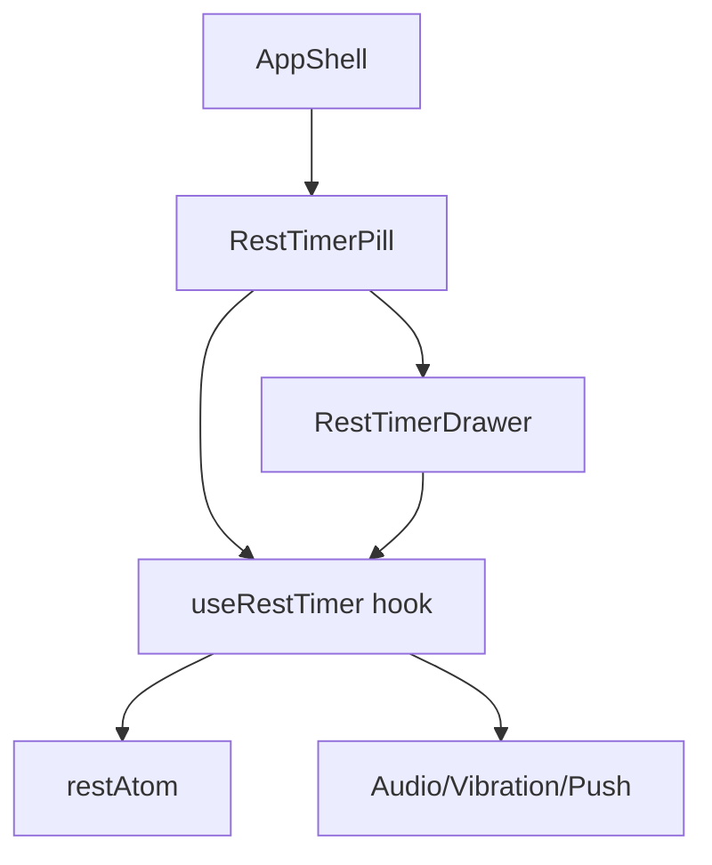

# Tech Plan — Persistent Timer & Navigation Access

## Architectural Approach

### Key Decisions

| Decision | Choice | Rationale |
|---|---|---|
| Rest timer UI | Floating pill + Vaul drawer | Non-blocking, matches existing patterns (RirDrawer), swipe-to-dismiss |
| Pill location | Rendered in `AppShell`, fixed bottom-right | App-wide visibility, avoids content overlap, thumb-friendly |
| Pause/resume | Extend `restAtom` with `pausedAt` + `accumulatedPause` | Same pattern as `sessionAtom`, already proven |
| Admin route hiding | `useLocation().pathname.startsWith('/admin')` | Simple, no new state, direct from React Router |
| RestTimerOverlay | Delete entirely | Replaced by drawer; no dual rendering risk |
| Pill interaction | Tap = open drawer; pause button on pill | Quick access to pause without opening drawer |
| Pill content | Icon + time + mini progress arc | Rich feedback at a glance |

### Critical Constraints

- **Z-index layering**: pill at `z-40`, drawers at `z-50`. Pill stays below drawers but above page content.
- **restAtom migration**: existing localStorage may have old shape (no `pausedAt`). Read must fallback safely.
- **Notifications**: audio beeps + vibration + push notification must fire from the new components. Moved from `file:src/components/workout/RestTimerOverlay.tsx`.
- **RirDrawer overlap**: when RirDrawer opens (set completion), rest timer may be running. Both can coexist — RirDrawer is z-50, pill is z-40, no conflict.

---

## Data Model

### restAtom Extension

Current shape in `file:src/store/atoms.ts`:

```typescript
{
  startedAt: number
  durationSeconds: number
} | null
```

New shape:

```typescript
{
  startedAt: number
  durationSeconds: number
  pausedAt: number | null
  accumulatedPause: number
} | null
```

**Migration**: on read, if `pausedAt` is undefined, treat as `null`. If `accumulatedPause` is undefined, treat as `0`.

### Derived Values

```typescript
function getEffectiveRemaining(rest: RestState, now: number): number {
  if (!rest) return 0
  const elapsed = rest.pausedAt
    ? (rest.pausedAt - rest.startedAt - rest.accumulatedPause) / 1000
    : (now - rest.startedAt - rest.accumulatedPause) / 1000
  return Math.max(0, rest.durationSeconds - elapsed)
}
```

---

## Component Architecture

### Layer Overview



### New Files & Responsibilities

| File | Purpose |
|---|---|
| `file:src/components/RestTimerPill.tsx` | Floating pill: icon, time, mini progress arc, pause button. Opens drawer on tap. |
| `file:src/components/RestTimerDrawer.tsx` | Full drawer: large progress circle, skip button, pause/resume toggle. |
| `file:src/hooks/useRestTimer.ts` | Encapsulates timer logic: remaining time, pause/resume, skip, notifications. |

### Files to Modify

| File | Change |
|---|---|
| `file:src/store/atoms.ts` | Extend `restAtom` type with `pausedAt`, `accumulatedPause` |
| `file:src/components/AppShell.tsx` | Import and render `RestTimerPill` |
| `file:src/pages/WorkoutPage.tsx` | Remove `RestTimerOverlay` import and render |
| `file:src/components/workout/SetsTable.tsx` | Update `setRest()` calls to include new fields (default `pausedAt: null, accumulatedPause: 0`) |
| `file:src/locales/en/workout.json` | Add `restTimer.pause`, `restTimer.resume` keys |
| `file:src/locales/fr/workout.json` | Add French translations |

### Files to Delete

| File | Reason |
|---|---|
| `file:src/components/workout/RestTimerOverlay.tsx` | Replaced by RestTimerPill + RestTimerDrawer |

### Component Responsibilities

**`RestTimerPill`**
- Reads `restAtom` via `useRestTimer` hook
- Renders only when `restAtom !== null`
- Hidden on admin routes (`useLocation`)
- Fixed position: `bottom-4 right-4 z-40`
- Shows: icon (⏱), remaining time (mm:ss), mini SVG arc progress
- Pause button: toggles `pausedAt` via hook
- Tap anywhere else: sets drawer open state to true
- Controlled drawer: `<RestTimerDrawer open={drawerOpen} onOpenChange={setDrawerOpen} />`

**`RestTimerDrawer`**
- Vaul drawer with full controls
- Large SVG progress circle (reuse design from old overlay)
- Remaining time in large font
- Skip button: calls `setRest(null)`
- Pause/Resume button: toggles pause state
- Closes on swipe down or explicit close

**`useRestTimer`**
- Manages interval for countdown (250ms tick, same as old overlay)
- Calculates remaining time accounting for pause
- Fires audio beeps at 10s warning and 0s finish
- Fires vibration and push notification at finish
- Exposes: `remaining`, `progress`, `isPaused`, `pause()`, `resume()`, `skip()`
- Auto-clears `restAtom` after finish notification (1.2s delay, same as old)

---

## Failure Mode Analysis

| Failure | Behavior |
|---|---|
| User navigates away during countdown | Pill follows (app-wide). Timer continues. Notifications fire even on other pages. |
| User pauses, navigates, returns | `pausedAt` persisted in localStorage. Time frozen correctly on return. |
| Timer finishes while drawer is open | Beeps play, drawer auto-closes after 1.2s via `setRest(null)`. |
| Old `restAtom` shape in localStorage | Migration fallback: `pausedAt ?? null`, `accumulatedPause ?? 0`. |
| User opens RirDrawer while rest timer running | Both coexist. RirDrawer at z-50, pill at z-40. No overlap. |
| User on admin page when timer finishes | Pill hidden, but notifications still fire (audio/vibration). User hears beep. |
| Rapid pause/resume spam | Debounce not needed — state updates are idempotent. |

---

## Implementation Sequence

### Phase 1: Data Model & Hook
1. Extend `restAtom` type in `file:src/store/atoms.ts`
2. Create `file:src/hooks/useRestTimer.ts` with timer logic and notifications
3. Add i18n keys for pause/resume

### Phase 2: Components
4. Create `file:src/components/RestTimerPill.tsx`
5. Create `file:src/components/RestTimerDrawer.tsx`
6. Render `RestTimerPill` in `file:src/components/AppShell.tsx`

### Phase 3: Cleanup & Integration
7. Update `file:src/components/workout/SetsTable.tsx` to pass new `restAtom` fields
8. Remove `RestTimerOverlay` from `file:src/pages/WorkoutPage.tsx`
9. Delete `file:src/components/workout/RestTimerOverlay.tsx`

### Phase 4: Testing
10. Unit tests for `useRestTimer` (pause, resume, notifications)
11. Unit tests for `RestTimerPill` (renders when active, hidden on admin)
12. E2E: complete set → timer appears → navigate → timer persists → tap → drawer opens
