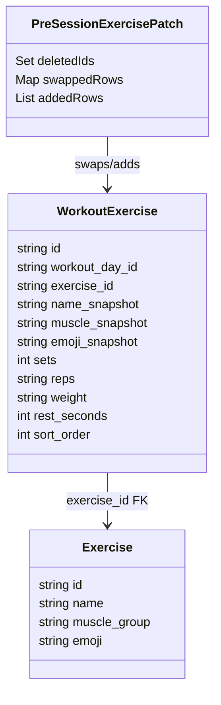
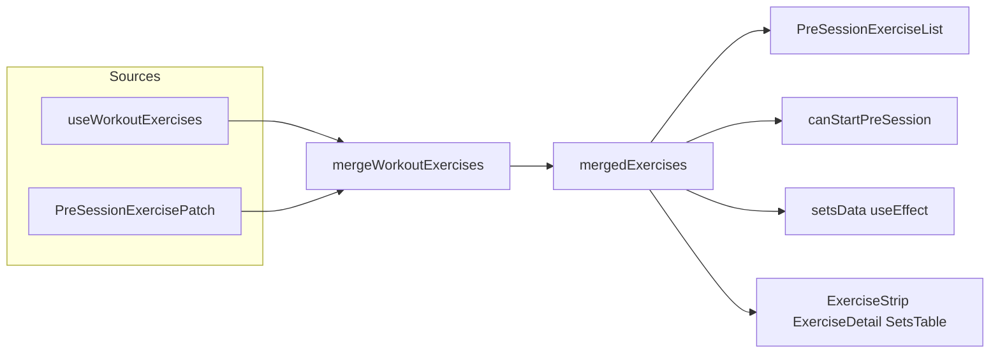
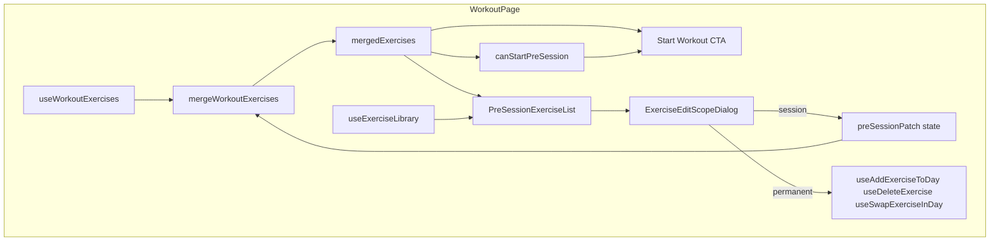

# Tech Plan — Pre-session Exercise Editing

Epic Brief: [docs/Epic_Brief_—_Pre-session_Exercise_Editing.md](Epic_Brief_—_Pre-session_Exercise_Editing.md). GitHub: [issue #83](https://github.com/PierreTsia/workout-app/issues/83). Training cycles context: [issue #81](https://github.com/PierreTsia/workout-app/issues/81), `file:src/hooks/useCycle.ts`, `file:src/pages/WorkoutPage.tsx` (`isDayDoneInCycle`).

---

## Architectural Approach

### Key Decisions

| Decision | Choice | Rationale |
|---|---|---|
| Single list for pre-session + active session | `WorkoutExercise[]` **merged** from query + local overrides | [`SetsTable`](src/components/workout/SetsTable.tsx) keys `session.setsData` by `exercise.id` (`workout_exercises.id`). [`enqueueSetLog`](src/lib/syncService.ts) uses `exercise.exercise_id`. Keeping one shape avoids refactors in strip, detail, PR flags, and sync. |
| Session-only state location | React `useState` / `useReducer` on `WorkoutPage`, not Jotai persist | Overrides are ephemeral (brief: clear on day change, after new session, reload). Avoids `atomWithStorage` migration and accidental cross-tab bleed. |
| Override representation | **Structured patch**: deleted ids, session-added rows, row replacements for swap | Pure `mergeWorkoutExercises(base, patch)` is testable and avoids duplicating full list on each edit. |
| Session swap identity | **Keep** `workout_exercises.id`, change `exercise_id` + snapshots + `weight` | Preserves `setsData[exercise.id]` across swap; logs get the correct `exercise_id` for the new movement. |
| Session add identity | **`crypto.randomUUID()`** for synthetic `WorkoutExercise.id` | No DB row; stable id for whole session; `workout_day_id` = current day. |
| Permanent swap | New mutation `useSwapExerciseInDay` → `UPDATE workout_exercises` | No insert/delete; preserves `sort_order`, `sets`, `reps`, `rest_seconds` per brief; weight + identity fields updated. |
| Swap/add target validation | **Authoritative** check that `exercise_id` exists (and is allowed) before committing `workout_exercises` | Client cache (`useExerciseLibrary`) can be stale; user may confirm long after opening the picker. Prefer DB-enforced safety (FK on `exercises`, optional RPC/`SELECT` guard, or trigger) **and** a clear client error path; optionally verify in `mutationFn` with a cheap `exercises` fetch so failures are user-visible, not silent PostgREST errors. |
| Permanent list mutations + cache | **Optimistic updates** for `useSwapExerciseInDay` and `useDeleteExercise` | Invalidate-only + refetch leaves a window where rapid follow-up actions see a **hybrid** list. Use TanStack Query `onMutate` / optimistic `setQueryData` on `["workout-exercises", dayId]` with rollback in `onError`; keep invalidation for eventual consistency. Apply the same pattern to permanent **add** when touching that mutation. |
| Weight after swap | Reuse **`set_logs`** “last weight per exercise” logic ([`useLastWeights`](src/hooks/useLastWeights.ts)); else `weight: "0"` | Matches epic: never carry replaced exercise load; hydrate from user history for the **new** `exercise_id` when it exists. |
| Full exercise pool | `useExerciseLibrary` — single `useQuery`, long `staleTime` | ~600 rows; no pagination in MVP; aligns with [`ExerciseAddPicker`](src/components/generator/ExerciseAddPicker.tsx) / [`ExerciseSwapPicker`](src/components/generator/ExerciseSwapPicker.tsx) `pool` prop. |
| Start CTA guard | `canStartPreSession(exercises)` in `file:src/lib/` | Brief: ≥1 exercise and **≥1 set per exercise**; prevents empty `SetsTable` and broken volume/timer behavior. |
| Editable pre-session UI | `PreSessionExerciseList` + `ExerciseEditScopeDialog` | Keeps [`ExerciseListPreview`](src/components/workout/ExerciseListPreview.tsx) as presentational or reuses its row styling inside the new list. |
| Edit visibility | **`!isDayDoneInCycle`** only | Completed-in-cycle days stay read-only (epic); same gate as sticky **Start** in `file:src/pages/WorkoutPage.tsx`. |
| i18n | Namespace **`workout`** | Home workout screen already uses `useTranslation("workout")`. |
| PR split (recommended) | **PR A**: `mergeWorkoutExercises`, `canStartPreSession`, `useExerciseLibrary`, `useSwapExerciseInDay`, shared last-weight helper, unit tests. **PR B**: `PreSessionExerciseList`, scope dialog, `WorkoutPage` wiring, i18n, integration tests. | Separates data layer + mutations from UI risk; PR A shippable with no user-visible change if behind a flag (optional) or merged only with PR B. |

### Critical Constraints

**`setsData` coupling** — `file:src/pages/WorkoutPage.tsx` initializes `setsData` in a `useEffect` keyed on `exercises` ([`WorkoutExercise[]`](src/types/database.ts)). After this work, that effect must run against **`mergedExercises`**, not raw query data. When an exercise is **session-deleted**, prune `setsData` keys for removed `workout_exercises.id` values when applying the patch or on **Start** to avoid orphaned keys.

**Synthetic ids for session-only adds** — `set_logs` and sessions only care about `exercise_id` at write time. Synthetic `WorkoutExercise.id` values must never be sent to Supabase as FKs; they exist only in memory until the user chooses **Apply permanently** (then a real row exists).

**Preview id mismatch** — `file:src/lib/sessionSummary.ts` [`templateToPreviewItems`](src/lib/sessionSummary.ts) uses `exercise.id` (row id); [`summarizeSessionLogs`](src/lib/sessionSummary.ts) builds items with `id` = `exercise_id`. Pre-session **editing** applies only when the list is template-driven (`!isDayDoneInCycle`). Do not attach edit actions to the “completed day / last session” preview path.

**Permanent = template for all future rotations** — Same semantics as Builder: `workout_exercises` rows are the user’s program. No migration to session-scoped templates. Historical `sessions` / `set_logs` unchanged. Mid-cycle, “last session” card data may reflect **past** work while the template list shows **new** exercises after a permanent edit — acceptable; avoid copy that implies past reps were erased.

**Progression keyed by `exercise_id`** — After a permanent swap, old performances for that day slot remain under the **previous** exercise in `set_logs`. Charts and “progression” for the **new** exercise only include sessions logged with that `exercise_id`. UI copy (scope dialog) should state this so users do not interpret it as missing data (see epic: Squat → Hack squat example).

**Offline** — Permanent mutations require network; use mutation `onError` + toast (pattern elsewhere in app). Session-only overrides work offline until reload.

**Stale exercise catalog** — The picker shows whatever was last loaded into `["exercise-library"]` (long `staleTime`). An `exercise_id` can disappear from the live catalog (admin delete, migration, future soft-archive) **after** the user opened the sheet. Do not assume “we picked from the list, so the id is valid.” Enforce validity on write and surface a recoverable error (refresh library, pick another exercise).

**Accessibility** — Row actions via `DropdownMenu` with visible trigger or explicit icon buttons + keyboard focus order; scope dialog uses `AlertDialog` / `Dialog` with labelled choices (epic assumption #9).

---

## Data Model

No new Postgres tables or columns for MVP: permanent swap is an `UPDATE` on `file:supabase/migrations/20240101000003_create_workout_exercises.sql` (existing `workout_exercises`).

### TypeScript: `WorkoutExercise` (unchanged)

```typescript
// file:src/types/database.ts — existing
export interface WorkoutExercise {
  id: string
  workout_day_id: string
  exercise_id: string
  name_snapshot: string
  muscle_snapshot: string
  emoji_snapshot: string
  sets: number
  reps: string
  weight: string
  rest_seconds: number
  sort_order: number
}
```

### TypeScript: session-only patch (new)

```typescript
// file:src/types/preSessionOverrides.ts (suggested location)

/** Ephemeral edits before Start; cleared per epic lifecycle. */
export interface PreSessionExercisePatch {
  /** workout_exercises.id to hide from merged list (session-only delete). */
  deletedIds: ReadonlySet<string>
  /** workout_exercises.id → full row replacement (session-only swap). Same id, new exercise_id/snapshots/weight/... */
  swappedRows: ReadonlyMap<string, WorkoutExercise>
  /** Appended rows; each id is synthetic (crypto.randomUUID()). */
  addedRows: WorkoutExercise[]
}
```

### Merge algorithm

```typescript
// file:src/lib/mergeWorkoutExercises.ts
export function mergeWorkoutExercises(
  base: WorkoutExercise[],
  patch: PreSessionExercisePatch,
): WorkoutExercise[] {
  const out: WorkoutExercise[] = []
  for (const row of base) {
    if (patch.deletedIds.has(row.id)) continue
    out.push(patch.swappedRows.get(row.id) ?? row)
  }
  out.push(...patch.addedRows)
  out.sort((a, b) => a.sort_order - b.sort_order)
  return out
}
```

### Weight resolution helper

Shared query shape as `useLastWeights` (latest `weight_logged` per `exercise_id` from `set_logs`). Extract e.g. `fetchLastWeightsForExerciseIds(supabase, ids: string[]): Promise<Record<string, number>>` used by:

- existing hook (optional refactor), and
- swap/add flows when computing template `weight: String(kg)` or `"0"`.

### classDiagram



### Flow: merged list



### Table Notes

- **`workout_exercises.weight`** is a string in app types (historical); keep consistency when writing after swap.
- **`set_logs.exercise_id`** must match the movement the user actually performed; session swap updates `WorkoutExercise.exercise_id` **before** start, so logging stays correct.

---

## Component Architecture

### Layer Overview



### New Files & Responsibilities

| File | Purpose |
|---|---|
| `file:src/types/preSessionOverrides.ts` | `PreSessionExercisePatch` + `emptyPreSessionPatch()` factory |
| `file:src/lib/mergeWorkoutExercises.ts` | Pure merge; export for tests |
| `file:src/lib/mergeWorkoutExercises.test.ts` | Unit tests: delete, swap, add, sort_order |
| `file:src/lib/canStartPreSession.ts` | `exercises.length > 0 && exercises.every(e => e.sets >= 1)` (+ tighten reps if needed) |
| `file:src/lib/canStartPreSession.test.ts` | Empty list, zero sets, valid path |
| `file:src/lib/lastWeightsFromSetLogs.ts` | Shared async fetch of last weight per exercise id (optional extract from `useLastWeights`) |
| `file:src/hooks/useExerciseLibrary.ts` | `useQuery` all `exercises`, key `["exercise-library"]`, long `staleTime` |
| `file:src/hooks/useBuilderMutations.ts` (extend) | Export `useSwapExerciseInDay` mutation |
| `file:src/components/workout/ExerciseEditScopeDialog.tsx` | Two explicit choices + accessibility labels |
| `file:src/components/workout/PreSessionExerciseList.tsx` | Rows, swap/add pickers host, delete, wires to scope dialog |

### Modified Files

| File | Change |
|---|---|
| `file:src/pages/WorkoutPage.tsx` | Hold `preSessionPatch`; compute `mergedExercises`; drive preview + `useEffect` setsData + active session from `mergedExercises`; clear patch on day change, after permanent success for day, `handleNewSession`; disable Start when `!canStartPreSession(mergedExercises)` and show helper text |
| `file:src/hooks/useLastWeights.ts` | Optional: delegate `queryFn` to `lastWeightsFromSetLogs` to avoid drift with swap weight resolution |

### Component Responsibilities

**`mergeWorkoutExercises`**
- Deterministic sort by `sort_order`
- No I/O

**`canStartPreSession`**
- Single source for Start button `disabled` and inline message

**`useExerciseLibrary`**
- `enabled: !!user` (auth)
- `select("*")`, order e.g. `muscle_group`, `name`

**`useSwapExerciseInDay`**
- Variables: `{ rowId, dayId, exercise: Exercise, weight: string }` where `weight` already resolved on caller, or mutation calls shared fetch inside `mutationFn` before `update`
- **Before `update`:** ensure target `exercise_id` still exists in `exercises` (and matches any future “active” rule). Minimum: rely on FK + map DB error to toast; better: explicit `SELECT id FROM exercises WHERE id = …` in `mutationFn` or a small Supabase RPC that validates then updates so the client never depends on stale picker state alone.
- `update` on `workout_exercises`: `exercise_id`, `name_snapshot`, `muscle_snapshot`, `emoji_snapshot`, `weight`; leave `sets`, `reps`, `rest_seconds`, `sort_order` unchanged
- **Cache:** optimistic `setQueryData` for `["workout-exercises", dayId]` (merge updated row into list); `onError` restore previous snapshot; still `invalidateQueries` on settle if desired for parity with server truth
- `onSuccess`: parent clears `preSessionPatch` for that day (invalidation alone is insufficient for fast UX — see Key Decisions)

**`useDeleteExercise` (permanent delete from day)**
- Same optimistic remove-from-list pattern for `["workout-exercises", dayId]` with rollback on failure, so strip/preview does not briefly show old ∪ new during refetch

**`useAddExerciseToDay` (permanent add)**
- Recommended: optimistic append (or placeholder row) + rollback; validate `exercise_id` the same way as swap before insert

**`ExerciseEditScopeDialog`**
- Props: `open`, `onOpenChange`, `title`, `description`, `onSessionOnly`, `onPermanent`
- Copy states that permanent updates **the day for all future rotations**, not past sessions (epic)

**`PreSessionExerciseList`**
- Props: `items: WorkoutExercise[]` (merged), `readOnly: boolean`, `library: Exercise[]`, callbacks into parent for opening scope dialog with pending action `{ kind: 'swap' \| 'delete' \| 'add', ... }`
- Embeds `ExerciseSwapPicker` / `ExerciseAddPicker` when inline; uses `workout` + `generator` namespaces where pickers already depend on `generator` keys (or duplicate minimal keys in `workout` — prefer reusing `generator` for picker strings to avoid churn)

**`WorkoutPage`**
- When `isDayDoneInCycle`, render existing read-only preview path (no `PreSessionExerciseList` actions)
- When `!isDayDoneInCycle`, render `PreSessionExerciseList` with `mergedExercises`
- On carousel day change (`file:src/components/workout/WorkoutDayCarousel.tsx` updates `session.currentDayId`), reset `preSessionPatch` to empty

### Failure Mode Analysis

| Failure | Behavior |
|---|---|
| Permanent mutation network error | Toast / inline error; keep dialog open or allow retry; do not clear patch until success |
| Target `exercise_id` invalid / removed from catalog | Abort with user-visible error; optional `invalidateQueries` on `exercise-library`; do not write a row that violates FK or leaves ambiguous snapshots |
| Rapid permanent swap/delete before refetch completes | Optimistic cache updates prevent hybrid UI; rollback clears bad optimistic state |
| User reloads mid override | Patch lost; acceptable per epic |
| `mergedExercises` has `sets === 0` on any row | Start disabled; show message pointing to Builder or future template repair |
| Session-only add then permanent add of same exercise | User may duplicate until refresh; pickers exclude `currentExerciseIds` from **merged** list `exercise_id` set |
| Swap to same `exercise_id` as another row on day | Exclude in picker; if slipped through, reject in handler |
| `useExerciseLibrary` slow on cold cache | Loading state on pickers; skeleton or spinner inside picker panel |
| Synthetic id collision | Practically impossible with UUID v4; assert uniqueness in dev merge if needed |

---

## Suggested implementation order

1. `lastWeightsFromSetLogs` + `useSwapExerciseInDay` (target validation + optimistic cache) + tests for merge/guard; extend `useDeleteExercise` / `useAddExerciseToDay` with the same cache pattern where they touch `workout-exercises`.
2. `useExerciseLibrary`.
3. `WorkoutPage` merged list + `canStartPreSession` on Start + patch lifecycle.
4. `ExerciseEditScopeDialog` + `PreSessionExerciseList` + i18n.
5. Manual QA: cycle completed day (no edits), session-only swap then start (logs `exercise_id`), permanent swap (DB + invalidate), offline permanent error.

When ready, say **split into tickets** to break into PR-sized tasks.
