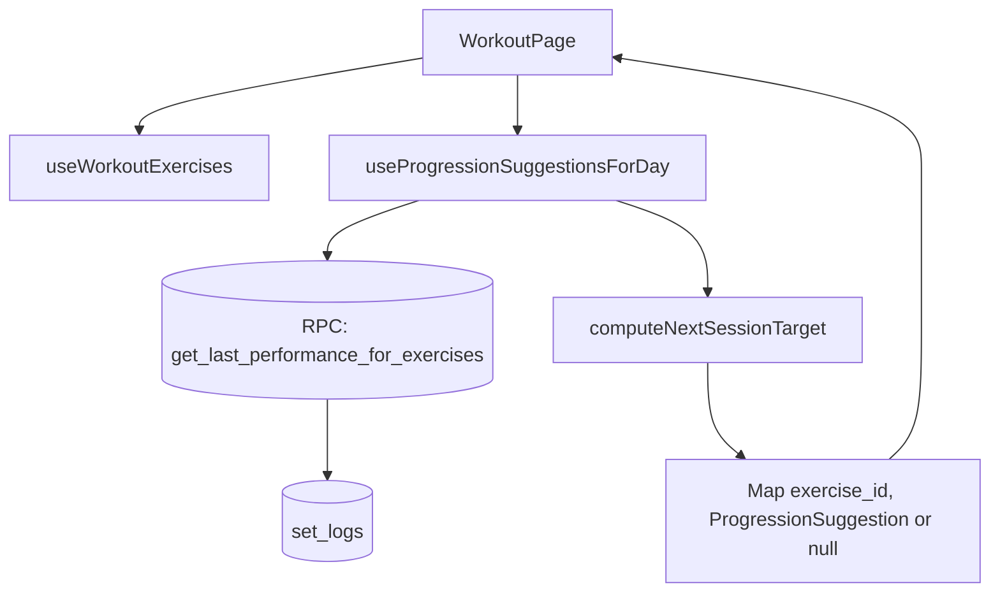
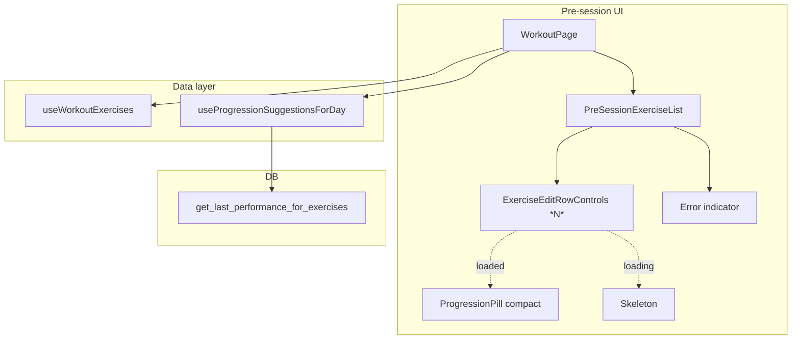

# Tech Plan — Pre-session Progression Display

> Issue: [#371 — fix(workout): pre-session list shows stale template weight](https://github.com/PierreTsia/workout-app/issues/371). Grilling notes: glossary section `Progression engine` in `docs/CONTEXT.md`. Architectural ADR: `docs/adr/0005-batch-progression-suggestions-per-day.md`.

## Architectural Approach

The pre-session row currently displays **Template Prescription** (`workout_exercises.weight/reps/sets`), which silently drifts from the engine-prescribed value the moment a `Last Performance` exists. Once the user taps **Start**, `SetsTable` jumps to the **Progression Suggestion**, exposing the gap.

We close the gap by computing the **Progression Suggestion** for every visible pre-session row and rendering it inline, with a compact `ProgressionPill` carrying the rule-specific rationale. Computation is **batched per workout day** via a new Postgres RPC + aggregator hook (per ADR 0005). Rows render immediately with static fields; only the value+pill slot shows a skeleton until suggestions resolve.

### Key Decisions

| Decision | Choice | Rationale |
|---|---|---|
| Source of truth for pre-session row values | **Progression Suggestion** from the engine, fallback to **Template Prescription** when the suggestion is `null` (no **Last Performance**) | Eliminates the misleading template values; matches in-session behavior. |
| Suggestion fetch shape | **Postgres RPC** `get_last_performance_for_exercises(uuid[])` | One round-trip per visible day instead of N (ADR 0005). Mirrors 7+ existing `get_*` RPCs. |
| Aggregator hook | **`useProgressionSuggestionsForDay(dayId, exercises)`** in `src/hooks/`, TanStack Query | Cache keyed on `(dayId, exercise_ids[])`; dedupe + refetch-on-invalidate gratis. |
| Per-row loading UX | **Skeleton in pill+weight slot only**; rest of the row renders immediately | Avoids blocking the screen on the new query. Driven by `useQuery`'s `isLoading` (cache-warm = no skeleton). |
| Indicator visual | **Compact `ProgressionPill` variant** (icon-only, popover unchanged) | Single source of truth for rule → icon → color mapping. New prop `compact?: boolean`. |
| Indicator scope | **All `Progression Rule` values** (auto-applied + `HOLD_*` + `PLATEAU`) | Consistency with in-session UX; HOLD pills carry useful pre-session context. |
| Volume axes covered | **All four** (reps / weight / sets / duration) | Bug is "row ignores engine", not "weight is wrong" (grilling Q1). |
| Pill placement | **Inline with weight** in the row subtitle: `3 × 10 · 57 kg [↑]` | Couples the pill to the value it justifies. |
| Surface scope | **`PreSessionExerciseList` only**. `ExerciseListPreview` (done-in-cycle) untouched. | Done days display actual logged perfs; predictions there would conflict with reality. |
| RPC error UX | **Subtle text indicator** at the top of the list ("Suggestions indisponibles, valeurs par défaut affichées") + silent fallback to template per row | Transparent without blocking; the session can still start. |
| Helper refactor | **Extract `buildPrescription` from `useProgressionSuggestion` into `src/lib/progression.ts`** | Both hooks (per-exercise + batched) consume it; pure-function tests are simpler than hook tests. |
| New DB index | **`idx_set_logs_exercise_logged_at` on `(exercise_id, logged_at DESC)`** in the same migration | Without it, the RPC's `DISTINCT ON` triggers a `set_logs` full scan. |

### Critical Constraints

**RLS preservation.** The new RPC runs as `SECURITY INVOKER` (PostgreSQL default). The existing `set_logs` policy (`auth.uid = sessions.user_id`) applies transparently. No `SECURITY DEFINER` shortcut. Migration test: invoke as a non-owning user → 0 rows.

**No mutation of `Template Prescription`.** This plan **does not write to `workout_exercises`**. The deferred deload / return-from-injury edge case (manual Builder edit of `weight` ignored when `Last Performance` is non-null) stays as-is. Documented in `docs/CONTEXT.md` under **Template Prescription**.

**Cache invalidation on session finish.** When the user finishes a session via `handleFinish` in `file:src/pages/WorkoutPage.tsx`, the new query namespace must be invalidated so swiping to another day reflects the freshly-logged perf. Hook into the existing invalidation cluster alongside `workout-exercises` and `cycle-progress`.

**Carousel `shouldFetch` parity.** The new hook respects the same gating as `useWorkoutExercises` (active slide ± 1). When the slide is off-screen: `enabled: false` to avoid burning quota on suggestions the user won't see.

**`useProgressionSuggestion` stays.** The per-exercise hook keeps its current shape for `ExerciseDetail` in-session usage. We don't unify the two paths — they have different lifecycles (per-row stateful subscription vs. per-day batch). Both consume the extracted `buildPrescription` helper.

---

## Data Model

### New RPC

```sql
-- supabase/migrations/{ts}_create_get_last_performance_for_exercises.sql

CREATE INDEX IF NOT EXISTS idx_set_logs_exercise_logged_at
  ON set_logs (exercise_id, logged_at DESC);

CREATE OR REPLACE FUNCTION get_last_performance_for_exercises(
  p_exercise_ids uuid[]
)
RETURNS TABLE (
  exercise_id uuid,
  session_id uuid,
  set_number integer,
  reps_logged text,
  weight_logged numeric,
  rir integer,
  duration_seconds integer,
  logged_at timestamptz
)
LANGUAGE sql
STABLE
SECURITY INVOKER
SET search_path = public
AS $$
  WITH latest_session_per_exercise AS (
    SELECT DISTINCT ON (sl.exercise_id)
      sl.exercise_id,
      sl.session_id
    FROM set_logs sl
    WHERE sl.exercise_id = ANY(p_exercise_ids)
    ORDER BY sl.exercise_id, sl.logged_at DESC
  )
  SELECT
    sl.exercise_id,
    sl.session_id,
    sl.set_number,
    sl.reps_logged,
    sl.weight_logged,
    sl.rir,
    sl.duration_seconds,
    sl.logged_at
  FROM set_logs sl
  JOIN latest_session_per_exercise lsp
    ON sl.exercise_id = lsp.exercise_id
    AND sl.session_id = lsp.session_id
  ORDER BY sl.exercise_id, sl.set_number;
$$;
```

### Table Notes

- `DISTINCT ON (exercise_id) ORDER BY exercise_id, logged_at DESC` extracts the latest `(exercise_id, session_id)` per exercise; the JOIN-back fetches all set_logs of that session. Result size: up to N × ~5 rows where N = exercises in the day.
- The composite index `(exercise_id, logged_at DESC)` is critical for `DISTINCT ON`; otherwise it becomes a full scan + sort on a table that grows with every session.
- No new TypeScript types. RPC rows map cleanly onto `SetPerformance[]` (already defined in `file:src/lib/progression.ts`) once grouped by `exercise_id`.

### Data flow



---

## Component Architecture

### Layer Overview



### New Files & Responsibilities

| File | Purpose |
|---|---|
| `supabase/migrations/{ts}_create_get_last_performance_for_exercises.sql` | New RPC + composite index. `SECURITY INVOKER`. |
| `src/hooks/useProgressionSuggestionsForDay.ts` | Batched hook. Inputs: `dayId: string \| null`, `exercises: WorkoutExercise[]`, options (`enabled`, catalog/equipment lookups). Output: `{ data: Map<string, ProgressionSuggestion \| null>, isLoading, error }`. |
| `src/hooks/useProgressionSuggestionsForDay.test.ts` | Empty exercises → noop. Partial coverage (some IDs no perf) → null entries. `HOLD_INCOMPLETE` / `WEIGHT_UP` / `PLATEAU`. Cache key reactivity on swap. RPC error path. |

### Modified Files & Responsibilities

| File | Change |
|---|---|
| `src/lib/progression.ts` | Extract pure helper `buildPrescription(exercise, lastPerformance, options)` returning `ProgressionPrescription`. Inputs: `WorkoutExercise`, `SetPerformance[] \| null`, `{ measurementType, equipment, catalogExercise }`. |
| `src/lib/progression.test.ts` | Add tests for `buildPrescription`: bootstrap from template (no last perf); inferred reps from last perf when template reps are non-numeric; duration vs reps volume branch; weight increment resolution. |
| `src/hooks/useProgressionSuggestion.ts` | Refactor to call extracted `buildPrescription`. Behavior unchanged; tests stay green. |
| `src/components/workout/ProgressionPill.tsx` | Add prop `compact?: boolean`. When `true`: render Badge with icon only, no label. Min-size class on Badge to ensure tap target ≥ 44px on mobile (`className="h-9 w-9 p-0"` or equivalent — concrete sizing in PR). Popover content unchanged. `aria-label` populated from the rule's `reasonKey`. |
| `src/components/workout/ProgressionPill.test.tsx` | Tests for compact mode: icon present, no label text, `aria-label` correct, popover content matches default. |
| `src/components/workout/PreSessionExerciseList.tsx` | New props: `suggestionsByExerciseId: Map<string, ProgressionSuggestion \| null>`, `suggestionsLoading: boolean`, `suggestionsError: Error \| null`. Render subtle error indicator at top when `suggestionsError != null`. Pass suggestion + loading flag down to each row. |
| `src/components/workout/ExerciseEditRowControls.tsx` | New props: `suggestion: ProgressionSuggestion \| null \| undefined`, `suggestionLoading: boolean`. Subtitle line conditionally renders `<Skeleton />` (loading) / engine values + compact pill (loaded with suggestion) / template fallback (loaded but null). |
| `src/components/workout/ExerciseEditRowControls.test.tsx` | Loading → skeleton. Null → fallback to template, no pill. `WEIGHT_UP` → engine values + green pill. `HOLD_NEAR_FAILURE` → `currentWeight` + amber pill. |
| `src/pages/WorkoutPage.tsx` | Wire `useProgressionSuggestionsForDay(currentDayId, exercises, { enabled: !isDayDoneInCycle })`. Pass results as props to `PreSessionExerciseList`. Add `queryClient.invalidateQueries({ queryKey: ["progression-suggestions-for-day"] })` in `handleFinish` alongside existing invalidations. |
| `src/locales/en/workout.json`, `src/locales/fr/workout.json` | Add `progression.loadingAria`, `progression.suggestionsUnavailable`. Reuse existing `progression.*` keys for the popover content. |

### Component Responsibilities (the non-obvious bits)

**`useProgressionSuggestionsForDay`**
- Disabled when `dayId == null`, `exercises.length === 0`, auth user absent, or caller passes `enabled: false` (carousel off-screen slides).
- Query key: `["progression-suggestions-for-day", dayId, exercises.map(e => e.exercise_id).sort().join(",")]`. `staleTime: 30_000` matches `useLastSessionDetail`.
- `queryFn`:
  1. `supabase.rpc("get_last_performance_for_exercises", { p_exercise_ids })`.
  2. Group rows by `exercise_id` → `Map<string, RawRow[]>`.
  3. For each `WorkoutExercise`, build a `SetPerformance[]` from the raw rows (split reps vs duration via `duration_seconds != null`, parse `reps_logged`).
  4. Call `buildPrescription(exercise, performance, { equipment, catalogExercise, measurementType })`.
  5. `computeNextSessionTarget(prescription, performance)` → `ProgressionSuggestion | null`.
  6. Return `Map<exercise_id, suggestion>`.
- Output is `useQuery`'s shape directly: `{ data: Map<...>, isLoading, error }`.

**`ExerciseEditRowControls` (modified)**
- Subtitle line:
  - `suggestionLoading` (initial fetch only — `isLoading`, not `isFetching`) → `<Skeleton className="h-3 w-24" aria-label={t("progression.loadingAria")} />` in place of the value text.
  - `suggestion != null` → render values from `suggestion`: `${suggestion.sets} × ${formatVolume(suggestion)}{suggestion.weight > 0 && \` · ${formatWeight(suggestion.weight)}\`}` followed by `<ProgressionPill compact suggestion={suggestion} />`.
  - `suggestion === null` → fallback to current rendering using `ex.weight/reps/sets`, no pill.
- Other behaviors (swap menu, delete, swap inline panel) unchanged.

**`ProgressionPill` compact mode**
- `compact === true`: omit the text label inside the Badge, keep the `Icon`. Tap target sized via `className`. Popover behavior identical to the default variant.
- `aria-label` always populated from `t(suggestion.reasonKey)` so SR users get the rule reason on the trigger.

### Failure Mode Analysis

| Failure | Behavior |
|---|---|
| RPC returns 0 rows for a given exercise (no last perf) | Map entry = `null`. Row falls back to **Template Prescription**. No pill. |
| RPC returns 0 rows for the entire array (brand-new program) | Map empty. All rows fall back to template. No pill anywhere. |
| RPC error (network, 5xx, RLS bug) | Hook exposes `error`. Rows fall back to template silently. `PreSessionExerciseList` renders a subtle text indicator at the top: *"Suggestions indisponibles, valeurs par défaut affichées"*. Session can still start. |
| User swaps exercise A → B mid-pre-session | `exercises[]` changes → query key changes → refetch. New row briefly shows skeleton, then suggestion. |
| Exercises load before suggestions (cold cache, the typical case) | Rows render immediately with name/emoji/sets count (static fields from `exercises[]`); skeleton in value+pill slot until the RPC resolves. **No screen-blocking.** |
| User finishes session → swipes to another day with overlapping exercises | `handleFinish` invalidates `["progression-suggestions-for-day"]` → newly visible day refetches. Suggestion reflects freshly-logged perf. |
| Cached suggestions stale > 30s | `staleTime: 30s` aligns with `useLastSessionDetail`. Beyond that: refetch on focus (TanStack default). |
| Carousel renders 3 visible days simultaneously | 3 RPC calls in parallel. Acceptable per ADR 0005 (was ~24 with the per-row alternative). |
| Compact pill tap target on mobile | `ProgressionPill.test.tsx` asserts dimensions ≥ 44×44 px in compact mode. |
| `set_logs.exercise_id` references a deleted exercise | The FK has no `ON DELETE` clause; orphans theoretically possible. Filter is `exercise_id IN (?)` from `workout_exercises.exercise_id` (same target). Practical orphan path requires deleting an exercise still referenced by a workout_exercise — not user-reachable today. |
| Two visible days share an exercise | TanStack Query doesn't dedupe across different `dayId` keys → same `set_logs` fetched twice. Acceptable; future optimization could key on `exercise_ids[]` directly. |
| `isLoading` flicker on cache-warm remount | We use `isLoading` (initial fetch only), not `isFetching` (refetch). Cache-warm visits skip the skeleton entirely. |

---

## Out of Scope (re-stated)

- Deload / return-from-injury override (manual Builder edit of `weight` ignored when `Last Performance` is non-null) — pre-existing limitation, separate epic.
- Suggestion enrichment of `ExerciseListPreview` (done-in-cycle days) — days are done; actual logged perfs are the truth there.
- Suggestions on `WorkoutDayCard` (carousel cards) — cards don't display weights.
- Unifying `useProgressionSuggestion` (per-exercise) and `useProgressionSuggestionsForDay` (batched) — kept separate because their lifecycles differ.

---

## References

- Issue #371: [fix(workout): pre-session list shows stale template weight](https://github.com/PierreTsia/workout-app/issues/371)
- ADR 0005: `docs/adr/0005-batch-progression-suggestions-per-day.md`
- Glossary: `docs/CONTEXT.md` — section `## Progression engine` (terms: **Progression Rule**, **Progression Suggestion**, **Template Prescription**, **Last Performance**)
- Engine: `file:src/lib/progression.ts`, `file:src/hooks/useProgressionSuggestion.ts`, `file:src/hooks/useLastSessionDetail.ts`
- UI surfaces: `file:src/components/workout/PreSessionExerciseList.tsx`, `file:src/components/workout/ExerciseEditRowControls.tsx`, `file:src/components/workout/ProgressionPill.tsx`, `file:src/pages/WorkoutPage.tsx`
- `set_logs` schema: `file:supabase/migrations/20240101000005_create_set_logs.sql`
