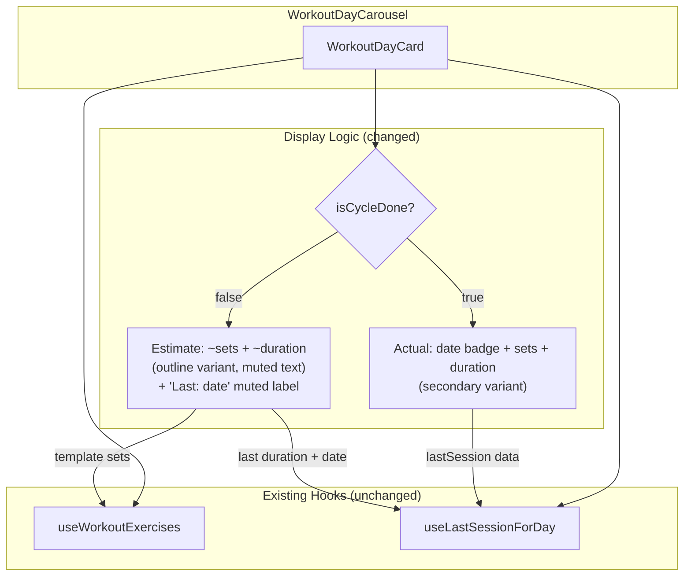

# Tech Plan — Premature Session Stats & Labels

## Architectural Approach

### Key Decisions

| Decision | Choice | Rationale |
|---|---|---|
| Display logic pivot | Split on existing `isCycleDone` prop in `WorkoutDayCard` | No new hook or query needed. `isCycleDone` already tells us whether the day has a finished session in the current cycle — that's the "plan vs reality" boundary. |
| Estimated sets source | `exercises.reduce((sum, ex) => sum + ex.sets, 0)` from template | Direct from `workout_exercises.sets` — the user's planned set count. |
| Estimated duration source | `formatDuration(lastSession.started_at, lastSession.finished_at)` from most recent past session | Same exercises/structure → similar duration. Far better than rest-time arithmetic. Hidden when no past session exists (no data to estimate from). |
| Date badge on idle | "Last: {relativeDate}" in muted text, hidden if never done | Preserves useful "when did I last do this?" context while eliminating the ambiguous "Aujourd'hui" on unstarted days. |
| Estimate label style | Tilde prefix (`~24 sets`, `~58 min`) + `outline` badge variant | Lightweight visual shorthand. `outline` badge variant already exists in shadcn/ui — no new CSS. |
| `useLastSessionForDay` scoping | No changes — stays unscoped | `isCycleDone` handles the display context. The hook still returns the most recent session for both "Last: {date}" info on idle days and actual stats on done days. |
| Scope boundary | Carousel `WorkoutDayCard` only | SessionSummary (post-finish) and History already show actual data by definition. The bug only manifests in the pre-session carousel. |

### Critical Constraints

**`WorkoutDayCard` is the only file with substantive logic changes.** The card receives `isCycleDone` from `WorkoutDayCarousel` → `completedSet.has(day.id)`. This prop is already wired correctly — it comes from `useCycleProgress` which queries sessions scoped to the active cycle.

**`ExerciseListPreview` in `WorkoutPage` already differentiates correctly** — it uses `templateToPreviewItems(exercises)` for idle days and `summarizeSessionLogs(sessionLogs, exercises)` for done days (lines 87-92 of `file:src/pages/WorkoutPage.tsx`). The card badges need to follow this same pattern.

**The `exercises` data is only fetched when `shouldFetch` is true** (active slide ± 1). Estimated stats computation depends on `exercises` being loaded — same guard as the existing exercise count badge.

---

## Data Model

No data model changes. No migrations. All required data already exists:

- `workout_exercises.sets` → template set count per exercise (for estimated total sets)
- `sessions.total_sets_done` → actual set count from finished session
- `sessions.started_at` / `finished_at` → actual duration (also used as estimated duration for idle days with a past session)

---

## Component Architecture

### Layer Overview



### Modified Files & Responsibilities

| File | Change | Purpose |
|---|---|---|
| `file:src/components/workout/WorkoutDayCard.tsx` | Major | Split badge rendering on `isCycleDone`: actual stats for done days, estimated stats for idle days. Context-aware date badge. |
| `file:src/locales/en/workout.json` | Minor | Add `estimatedSets`, `estimatedDuration`, `lastSession` i18n keys |
| `file:src/locales/fr/workout.json` | Minor | Add `estimatedSets`, `estimatedDuration`, `lastSession` i18n keys |

### `WorkoutDayCard` — Detailed Changes

**New derived value:**

```typescript
const estimatedTotalSets = useMemo(
  () => exercises?.reduce((sum, ex) => sum + ex.sets, 0) ?? 0,
  [exercises],
)
```

**Date badge area (currently lines 44-51 of `file:src/components/workout/WorkoutDayCard.tsx`):**

Current behavior: always shows `formatRelativeDate(lastSession.finished_at)` when `lastSession` exists.

New behavior:

| State | Renders |
|---|---|
| `isCycleDone` + `lastSession` | `<Badge variant="secondary">` with `formatRelativeDate(lastSession.finished_at)` — actual session date ("Aujourd'hui", "Hier", etc.) |
| `!isCycleDone` + `lastSession` | `<span className="text-muted-foreground">` with `t("lastSession", { date: formatRelativeDate(...) })` — e.g. "Last: Yesterday" / "Dernier : Hier" |
| `!isCycleDone` + no `lastSession` | Empty `<span />` — no date info available |

**Stats badges area (currently lines 77-91):**

Current behavior: exercise count (template) + sets (lastSession) + duration (lastSession), all `secondary` variant.

New behavior:

| State | Exercise count | Sets | Duration |
|---|---|---|---|
| `isCycleDone` + `lastSession` | `secondary` — `exercises.length` | `secondary` — `lastSession.total_sets_done` | `secondary` — `formatDuration(started_at, finished_at)` |
| `!isCycleDone` + `lastSession` | `outline` muted — `exercises.length` | `outline` muted — `~{estimatedTotalSets}` | `outline` muted — `~{formatDuration(lastSession.started_at, lastSession.finished_at)}` |
| `!isCycleDone` + no `lastSession` | `outline` muted — `exercises.length` | `outline` muted — `~{estimatedTotalSets}` | Hidden (no data to estimate from) |

### i18n Keys

| Key | EN | FR |
|---|---|---|
| `estimatedSets_one` | `~{{count}} set` | `~{{count}} série` |
| `estimatedSets_other` | `~{{count}} sets` | `~{{count}} séries` |
| `estimatedDuration` | `~{{duration}}` | `~{{duration}}` |
| `lastSession` | `Last: {{date}}` | `Dernier : {{date}}` |

### Failure Mode Analysis

| Failure | Behavior |
|---|---|
| `exercises` still loading | No badges shown at all (guarded by `{exercises && ...}`) — same as current behavior |
| `lastSession` is null + idle day | No date badge, exercise count + estimated sets in outline variant, no duration badge |
| `lastSession` is null + done day | Shouldn't happen (day can't be done without a session). Defensive: skip sets/duration badges, show exercise count only |
| Day completed today in current cycle | `formatRelativeDate` correctly shows "Aujourd'hui"/"Today" — now accurate because `isCycleDone` guarantees it's a real session |
| User resets a day (sets `cycle_id = NULL`) | `isCycleDone` flips to false → card switches to estimate view. Session still exists unscoped, so `lastSession` returns it for "Last: {date}" + estimated duration |
| No active cycle at all (pre-first-session) | All days idle → all show estimated stats. `lastSession` may exist from pre-cycle history |
| Template changed since last session (exercises added/removed) | Estimated sets reflect current template (accurate). Estimated duration reflects last session's duration (stale but reasonable). Tilde prefix signals approximation. |
| Very old last session (6+ months) | "Last: 26 weeks ago" — wordy but correct. Could clamp to absolute date in a follow-up if needed. |
