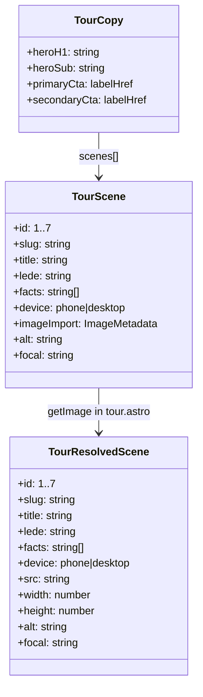
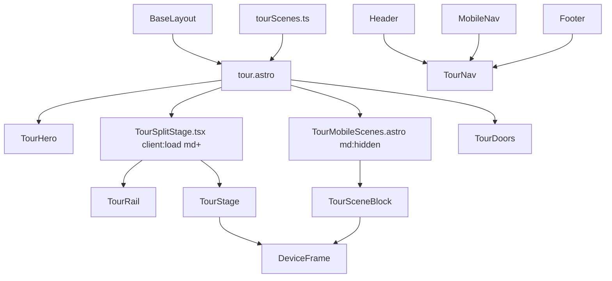

# Tech Plan — Product Tour (/tour) #466

## Architectural Approach

### Key Decisions

| Decision | Choice | Rationale |
|---|---|---|
| Surface | `file:web/src/pages/tour.astro` on docs mini-site | Epic + ADR 0013; static Astro, no PWA |
| Nav | Add **Tour** to Header, MobileNav, Footer | Discoverability without homepage redesign |
| Scene source of truth | `file:web/src/lib/tourScenes.ts` | Banked copy/metadata in one typed module |
| Desktop UX | Sticky pin + `7 × (100vh - header)` beats + IntersectionObserver + click rail | Kick-ass product-film scroll; matches Stitch chrome lock |
| Mobile UX | Linear Astro stack of the same 7 scenes | Width too tight for sticky split; less JS on phones |
| Interactivity | React island `TourSplitStage` (`client:load`) **desktop only** (`md+`) | Greenfield motion; keep phones on static HTML |
| Motion | CSS crossfade + Ken Burns `transform-origin` per scene; no Framer/GSAP | Epic: 2–3 intentional motions; zero new deps |
| Reduced motion | No pin theater; rail click and/or linear access to all 7 | Story 12 |
| Images | `astro:assets` under `src/assets/screenshots/tour/` | Existing FeatureImageCard / Screenshot pattern |
| Placeholders → captures | Distinct placeholder files first; swap when Prime Mover ready | Ship without blocking on photo safari |
| Captures | Manual checklist (not Playwright CI in v1) | Enough for 7 staged shots |
| Dual doors | Buttons only, no closer headline | Epic LGTM |
| Image → island bridge | Resolve with `getImage()` in `.astro`; pass URLs/dims into React | Avoid awkward `ImageMetadata` through islands |
| Design law | `file:web/DESIGN.md` / `file:web/src/styles/global.css` | No second skin |

### Critical Constraints

- Sticky stage must clear sticky `Header` (`file:web/src/components/Header.astro`). Introduce a shared CSS variable (e.g. `--header-h`) updated by the existing header scroll script (or a measured constant) so `top` / pin math stay aligned.
- Scroll track must **not** become an empty Stitch-style void: beats are intentional spacers *inside* a pin container whose sticky children always paint rail + stage.
- Scene 05 needs a reserved stage aspect so phone → desktop chrome does not layout-shift.
- Nav is duplicated in three files — Tour link must touch `file:web/src/components/Header.astro`, `file:web/src/components/MobileNav.tsx`, and `file:web/src/components/Footer.astro`.
- Site is `docs.gymlogic.me` static (`file:web/astro.config.mjs`); CTAs: `https://gymlogic.me` and `/connect/claude`.
- Glossary (**Product Tour**, **Tour Split Stage**) + ADR 0013 already filed — do not reopen Tour vs homepage.
- No reusable IntersectionObserver utilities in-repo — greenfield for Tour motion.

---

## Data Model

No database. Content is a static typed catalog consumed by Astro and the desktop island.

### Table Notes

- **Banked titles / ledes** live in `tourScenes.ts` exactly as in the Epic Brief (no paraphrase drift).
- `facts`: short supporting lines under the active lede (scene 02: last performance, rest timer, RIR — max 3).
- `focal`: CSS `transform-origin` for Ken Burns (e.g. `"70% 40%"`).
- `device`: `phone` for scenes 1–4, 6–7; `desktop` for scene 5 (BYOA window).
- Placeholders are real image files under `src/assets/screenshots/tour/` (distinct per scene). Captures replace the same paths or imports without changing the public component API.
- `tour.astro` calls `getImage()` (or equivalent) and passes **resolved** `TourResolvedScene[]` into `TourSplitStage` so the island stays serializable.

---

## Component Architecture

### Layer Overview

### New Files & Responsibilities

| File | Purpose |
|---|---|
| `file:web/src/pages/tour.astro` | Page shell, SEO/OG, `getImage` resolution, compose sections |
| `file:web/src/lib/tourScenes.ts` | Banked copy + image imports + focal/device metadata |
| `file:web/src/components/tour/TourHero.astro` | H1 + sub |
| `file:web/src/components/tour/TourDoors.astro` | Dual CTAs (no headline) |
| `file:web/src/components/tour/TourMobileScenes.astro` | Linear 01–07 below `md` |
| `file:web/src/components/tour/TourSplitStage.tsx` | Desktop sticky pin + IO + rail/stage |
| `file:web/src/components/tour/DeviceFrame.tsx` | Phone vs desktop chrome + image |
| `file:web/src/assets/screenshots/tour/*` | Seven distinct stills (placeholders → captures) |
| Capture checklist | Manual Prime Mover steps (ticket appendix or `docs/` note) |

**Nav-only edits:** `file:web/src/components/Header.astro`, `file:web/src/components/MobileNav.tsx`, `file:web/src/components/Footer.astro`.

### Component Responsibilities

**`tour.astro`**
- Wraps `BaseLayout` with Tour title/description/optional OG
- Imports `tourScenes`, resolves images, passes props to island
- Renders `TourHero`, desktop `TourSplitStage` (`client:load`, `hidden md:block` wrapper), `TourMobileScenes` (`md:hidden`), `TourDoors`
- Keeps mobile linear HTML in the document for no-JS / SEO

**`TourHero.astro`**
- Banked H1: “What GymLogic actually does”
- Banked sub; optional muted “Scroll the tour →” on desktop only

**`TourSplitStage.tsx`**
- Pin container height ≈ `7 × (100vh - var(--header-h))`
- Sticky panel: `top: var(--header-h)`; CSS grid ~40% rail / ~60% stage
- Beat sentinels observed via `IntersectionObserver` → `activeIndex`
- Click rail → programmatic `scrollTo` corresponding beat
- Stage: stacked scenes with opacity/scale crossfade; active Ken Burns using `focal`
- Progress cue `NN / 07`
- `prefers-reduced-motion: reduce` → disable pin/KB; click rail still switches stage (or jump-links into mobile block)

**`TourRail` (inside island)**
- Lists 01–07; inactive muted; active teal bar + title + lede + up to 3 facts

**`TourStage` + `DeviceFrame`**
- Fixed stage aspect; `phone` vs `desktop` chrome; image `object-cover` with focal zoom class
- Scene 05 desktop window letterboxed inside the same stage box

**`TourMobileScenes.astro`**
- Stacked sections with anchors `#tour-01` … `#tour-07`; DeviceFrame or Astro `Image` per scene; no IO

**`TourDoors.astro`**
- Primary: Open the app → `https://gymlogic.me`
- Secondary outline: Connect your agent → `/connect/claude`
- No sellsy headline

### Kick-ass scroll sketch

1. Outer `.tour-pin` with `height: calc(7 * (100vh - var(--header-h)))`.
2. Inner `.tour-sticky` `position: sticky; top: var(--header-h); height: calc(100vh - var(--header-h));` grid 40/60.
3. Beat markers positioned along the pin for IO root margins tuned so one scene is active at a time.
4. Stage layers transition opacity/transform; active layer runs a subtle Ken Burns keyed to `focal`.
5. Rail expands only the active lede/facts so sticky height stays stable (prefer swap content in a fixed block, not growing the sticky panel unboundedly).

### Failure Mode Analysis

| Failure | Behavior |
|---|---|
| JS / hydration fail | Mobile linear Astro content remains; desktop island may be empty — include a `noscript` note or ensure critical copy exists in mobile block always in DOM |
| `IntersectionObserver` edge glitches | Click rail remains authoritative; debounce index updates |
| Reduced motion | No scroll theater; all scenes reachable via rail click |
| Missing image import | `astro build` fails — do not ship broken paths |
| Header overlap | Sticky `top` / pin math use `--header-h` |
| Scene 05 aspect jump | Stage box fixed aspect; letterbox desktop chrome |
| Mid-scroll rail click | Programmatic scroll to beat; avoid fighting smooth-scroll races |
| Placeholder looks fake | Distinct per-scene crops only; replace with Prime Mover captures before calling the epic “visually done” if demos demand it |

---

## Capture pipeline (manual, in-epic)

Source of truth: `file:web/src/lib/tourScenes.ts` — **6 scenes × 3 shots**. Full checklist + restage runbook: `file:docs/T181_—_Prime_Mover_captures_asset_swap.md`.

| Scene | Device | Shots (3 each) |
|---|---|---|
| 1 Start with a program | Phone | AI draft · build yourself · Quick Workout |
| 2 Train the session | Phone | Sets table · RIR · last performance |
| 3 Progress on purpose | Phone | Add weight · hold · plateau |
| 4 Bring your own agent | Desktop | MCP chat · tools · result in app (`05*` filenames) |
| 5 Know the movement | Phone | Library · detail+instructions · video (`06*`) |
| 6 See yourself over time | Phone | Heatmap · Strength Balance · achievements (`07*`) |

Account: **Prime Mover** on **hosted** Supabase (EN / dark / kg). Seed: `npm run seed:prime-mover`. Captures use Playwright session injection (Google-only UI).

---

## References

- Epic Brief `file:docs/Epic_Brief_—_Product_Tour_(tour)_#466.md`
- ADR `file:docs/adr/0013-product-tour-separate-from-homepage.md`
- `file:web/DESIGN.md`
- `file:web/stitch/PRODUCT_TOUR_REGEN_PROMPT.md`
- GitHub [#466](https://github.com/PierreTsia/workout-app/issues/466)
