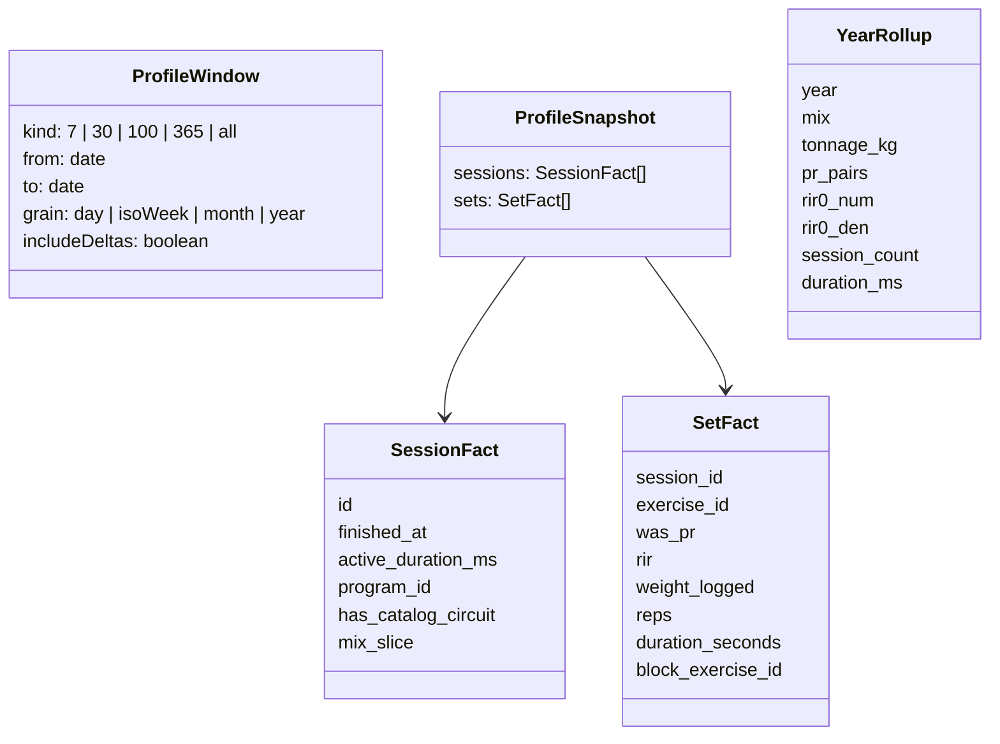
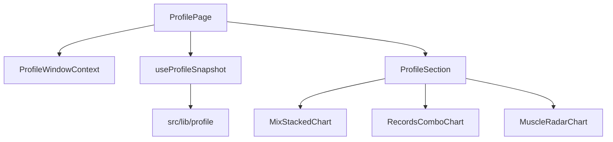

# Tech Plan — Profil first-class dashboard #512

## Architectural Approach

Two compute paths, **one view-model**. Charts never fetch. Blocks never own SQL.

```
Window 7 / 30 / 100 / 365  →  skinny snapshot (sessions + sets) → src/lib/profile/* → VM
Window all-time            →  SQL year rollups                   → same VM shapes, deltas omitted
```

T0 paints the same VMs from fixtures. Wiring replaces the adapter, not the fold.

First paint prefetches **200d** (covers 7 / 30 / 100 + prior). Toggle **1 an** fetches 730d. **Toujours** hits the rollup RPC. Récurrents slice the **same window** as the rest of the fold.

### Key Decisions

| Decision | Choice | Rationale |
|---|---|---|
| Algos | Pure TS in `file:src/lib/profile/` on a snapshot | Same test style as `amrapScore` / `trainingBalance`; glossary in git |
| All-time | Separate rollup RPC, **no vs-préc.** | A lifetime has no equal prior; no `set_logs` dump since first session |
| Prefetch | **200d** first paint; **730d** on 1 an; rollup on Toujours | Default visit stays cheap |
| Grain | 7=day, 30=ISO week, 100=ISO week, 365=month, all-time=year | 52 Mix bars on a phone is not a chart |
| Charts | Dumb Recharts atoms inside `ChartContainer` | T-1 proves Mix stacked, dual `YAxis`, `RadarChart` |
| Shell | `ProfileSection` = Card + title + skeleton / error / empty / children | Copy `BalanceTab`, not `StatsDashboard` `"–"` |
| Window | React context on `ProfilePage`, not Jotai | Jotai = auth; react-query = data |
| Récurrents | Same window as the fold | HITL: a block that ignores the cran is a second product |
| Équilibre all-time | New unbounded volume RPC (same 13 axes, 1 / 0.5 credits) | `get_volume_by_muscle_group` clamps `p_days` at 365 |
| Rythme skip-vs-plan | **Out of v1** | “Dominates” unquantified; presence rings are the story |
| First paint | Snapshot + `get_badge_status` + volume×2 (unbounded on all-time) + circuit ledger. Not 1 RT per block | Epic constraint |
| Circuit `was_pr` | Finish path uses `prDetection`; backfill existing rows | Records unit is `was_pr`, not a second type |

### Critical Constraints

- Do **not** bind pulse **Session time** to `get_training_activity_by_day.minutes` (`file:src/hooks/useTrainingActivityByDay.ts`). Rythme `session_count` by local day comes from the snapshot. Fallback for null `active_duration_ms` matches `get_cycle_stats`.
- Do **not** bind Records to `get_cycle_stats.pr_count` (set-level, drops duration).
- Do **not** bind Circuit PBs to `useBenchmarkCompletionHistory` last-8 `isPb`.
- Do **not** `SUM` radar `total_volume_kg` for **Tonnage**.
- `sessions` has **no `program_id`**. Mix / hop join `workout_days.program_id` + `exercise_blocks.benchmark_circuit_id`.
- History **Équilibre** stays 30d body-map (`file:src/components/history/BalanceTab.tsx`). Profil must not import that tab.
- Gate T0 with existing `file:src/components/admin/AdminOnly.tsx` + `file:src/router/AdminGuard.tsx`. Do not invent a second admin flag.
- Five-value `ToggleGroup` (`file:src/components/ui/toggle-group.tsx`) wraps on mobile. Copy: 7j / 30j / 100j / 1 an / Toujours.
- All-time pulse / Mix / Records / Tonnage / Équilibre score delta: **no vs-préc. pills**.
- Bounded Équilibre keeps `get_volume_by_muscle_group(p_days, p_offset_days)`. All-time uses the unbounded twin. Do **not** raise History’s 365 clamp.
- Dual-axis combo: if Recharts 3 + `file:src/components/ui/chart.tsx` fails T-1, escape hatch is custom SVG (canvas already did). Do not block T0 fold.
- Drawer identity card stays on `/account` (`file:src/components/SideDrawer.tsx`). New **Profil** row is first-category, same rank as History.
- T226 is **done**: `file:src/lib/blockSetLog.ts` uses `file:src/lib/prDetection.ts`. Records (T229) may wire Circuit stations. Historical rows still need `scripts/backfill-was-pr.ts --apply` before T236.

---

## Data Model

No new tables. New RPCs + TS view-models.



### Table Notes

**`get_profile_snapshot(p_from date, p_to date, p_tz text)`**  
`{ sessions, sets }` for finished sessions in `[from, to]`. Session rows include `program_id` (from `workout_days`, nullable) and `has_catalog_circuit`. Sets: columns listed above only. SECURITY INVOKER, `user_id = auth.uid()`. Client prefetches 200d (or 730d for 1 an) and slices in TS.

**`get_profile_all_time_rollups(p_tz text)`**  
Year buckets since first finished session. Mix precedence **identical** to `mixSlice()` in TS (shared fixture vectors in tests). No prior-period fields.

**`get_volume_by_muscle_group_all_time(p_user_id uuid)`**  
Same muscle JSON as today’s RPC, no day clamp. Do not change History’s 30d function (`file:src/hooks/useVolumeDistribution.ts`).

**`get_profile_circuit_ledger()`**  
All complete catalog `block_runs` for the user (fingerprint, started_at, score inputs). Career PB is computed in TS against this list — not `RUN_LIMIT 8`.

Existing: `get_badge_status`; `get_volume_by_muscle_group(days, offset)` for 7 / 30 / 100 / 365.

View-models in `file:src/lib/profile/types.ts`. Each exposes `status: 'ok' | 'empty'` from **Profil not-enough-data**. Deltas are `null` when `includeDeltas === false`.

---

## Component Architecture

### Layer Overview



### New Files & Responsibilities

| File | Purpose |
|---|---|
| `file:src/pages/ProfilePage.tsx` | Toggle, context, block stack, admin empty/loading switch |
| `file:src/components/profile/ProfileSection.tsx` | Card: title, skeleton, error, empty, children |
| `file:src/components/profile/charts/MixStackedChart.tsx` | Stacked bar |
| `file:src/components/profile/charts/RecordsComboChart.tsx` | `ComposedChart` + dual `YAxis` |
| `file:src/components/profile/charts/MuscleRadarChart.tsx` | `RadarChart` 13 axes, solid + dashed |
| `file:src/components/profile/*Block.tsx` | One block per act: VM → Section + chart/stats |
| `file:src/lib/profile/*.ts` | Glossary algos + `notEnoughData` |
| `file:src/hooks/useProfileSnapshot.ts` | 200d vs 730d vs all-time rollup keys |
| `file:src/locales/{en,fr}/profile.json` | Copy deck |
| `file:supabase/migrations/*profile_snapshot*.sql` | Snapshot, rollup, unbounded volume, circuit ledger |
| `file:src/lib/blockSetLog.ts` | `was_pr` via `prDetection` (existing file) |

### Component Responsibilities

**ProfilePage**
- Owns window state (`kind` 7 / 30 / 100 / 365 / all) and `ProfileWindowContext`.
- Prefetch policy lives here via `useProfileSnapshot`, not per block.
- Admin empty/loading switch (T0) swaps the adapter: fixtures vs live VMs. Same fold either way.
- Renders the three acts in Epic Brief order (Mix + Rythme above Records).

**ProfileWindowContext**
- `{ kind, from, to, grain, includeDeltas, tz }`. `includeDeltas === false` when `kind === 'all'`.
- Not a Jotai atom.

**ProfileSection**
- Presentation contract only: title, `Skeleton`, error slot, empty slot, children.
- Copy `BalanceTab`’s loading/error/empty split. No `"–"` placeholders.

**Chart atoms** (`MixStackedChart`, `RecordsComboChart`, `MuscleRadarChart`)
- Props: `categories` + `series` (and radar axes). No hooks, no i18n of product names that stay English (RIR, PR, AMRAP).
- Must render inside `ChartContainer`. Dual-axis: left = PR bars, right = RIR 0 rate. No green/red encoding.

**useProfileSnapshot**
- Query keys: bounded 200d, bounded 730d, all-time rollup.
- Blocks derive VMs with `useMemo` from the snapshot (+ volume RPC, badges, circuit ledger). They do not each `useQuery` the session list.

**lib/profile**
- Glossary SSOT: `mixSlice`, tonnage, rir0, regulars (current window), tenure, hop, prPairs, circuitPbs, `notEnoughData`.
- Vitest + shared Mix vectors consumed by the SQL rollup tests.

**Admin gate**
- Until the last ticket: drawer row behind `AdminOnly`, route behind `AdminGuard` (same pattern as other admin surfaces). Ungate removes those two call sites only.

### Failure Mode Analysis

| Failure | Behavior |
|---|---|
| Snapshot RPC error | Windowed sections error; Hero/Succès may still render from profile/badges |
| All-time rollup error | All-time blocks error; 30d uses cached 200d snapshot |
| `< 3` sessions in 7d | Équilibre empty; Tonnage may `ok` |
| 0 declared RIR in bucket | Bars ok; no line point |
| 0 loaded sets | Tonnage empty |
| Legacy Circuit `was_pr` false | Records omit until backfill; new finishes correct |
| Non-admin `/profile` | Signed-in AppShell route (T236). `/_profile-charts` still `AdminGuard` |
| 365 grain bug | Test: `categories.length <= 13` on 1 an Mix |

---

## Delivery status (2026-08-21)

Orchestrator SSOT. Do not re-grill. Do not treat an open T237 file as a gate — it is in `docs/done/`.

| Ticket | Mode | Status |
|---|---|---|
| T224 chart atoms | AFK | **done** — `file:docs/done/T224_—_Profil_chart_atoms.md` |
| T225 T0 shell | AFK | **done** — `file:docs/done/T225_—_Profil_T0_shell_fixtures.md` |
| T226 Circuit `was_pr` | AFK | **done** — write path + tests + backfill script. Prod `--apply` before T236. Hard dep of T229, **not** of T227 |
| T237 mocked-fold HITL | HITL | **passed 2026-08-21** — `file:docs/done/T237_—_HITL_T0_mocked_fold.md` + #512 comment. Gate lifted |
| **T227** snapshot + pulse | AFK | **done** `16b1b07` — RPC not applied to remote yet |
| **T233** circuit ledger | AFK | **done** `4ab19b1` — RPC not applied to remote yet |
| T228 Mix + Rythme | AFK | **done** `ca218b3` |
| T229 Records + RIR | AFK | **done** `dfa7ee1` |
| T230 Équilibre + Tonnage | AFK | **done** `5c7d55b` |
| T231 Hero tenure + hop | AFK | **done** `9159733` |
| T232 Regulars follow window | AFK | **done** `3a1966c` |
| T234 all-time rollups | AFK | **done** `6b2c836` — RPC not applied to remote yet |
| T235 copy-deck canvas | AFK | leftover editorial. **Not a gate** |
| T236 ungate | HITL | **done** — `file:docs/done/T236_—_Ungate_Profil.md` |

**Frontier:** none for #512. T235 leftover editorial. Prod still needs snapshot / ledger / all-time RPCs + optional `was_pr` backfill before merge.

### Parked (not a ticket, not a derail)

- **`ProfileSection` error slot** is a one-liner (`profile.error`). Honest, but thin. A retry / why-it-failed line is nice-to-have after ungate. Do not block T228–T236 on it. Today Pulse shows it when `get_profile_snapshot` is missing on the remote.

### Delivery order (original spine, for history)

1. T-1 chart atoms (fixtures) — done
2. T0 `/profile` shell — done
3. `was_pr` on Circuit stations — done (prod backfill still open)
4. Snapshot RPC + wire pulse — **next (T227)**; Mix/Rythme = T228 after
5. Wire Records + RIR (T229, after T227)
6. Wire Équilibre + Tonnage (T230)
7. Wire Regulars, Succès, tenure, hop (T232 / T231)
8. Circuit ledger + PBs (T233, parallel with T227)
9. All-time rollups + unbounded volume
10. Docs leftover: copy-deck canvas (T235)
11. Ungate `isAdmin` wrappers
