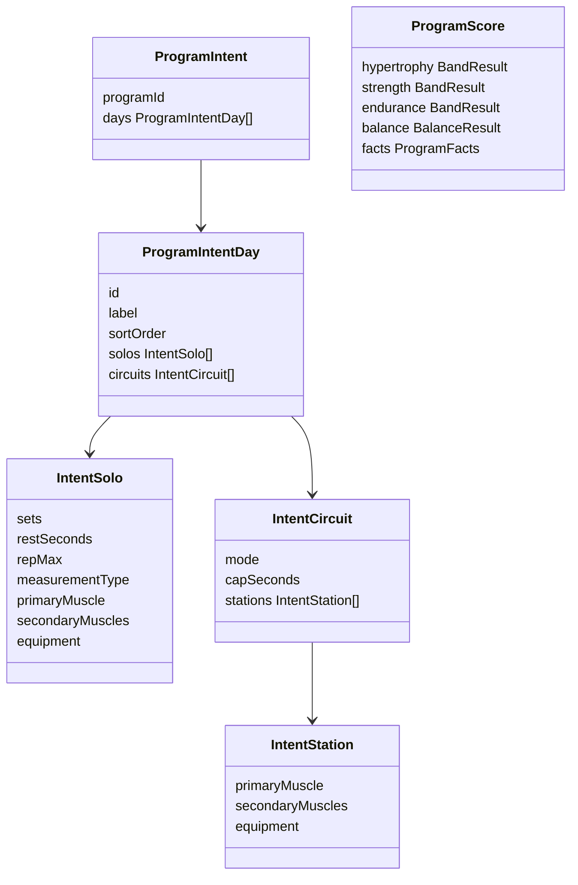
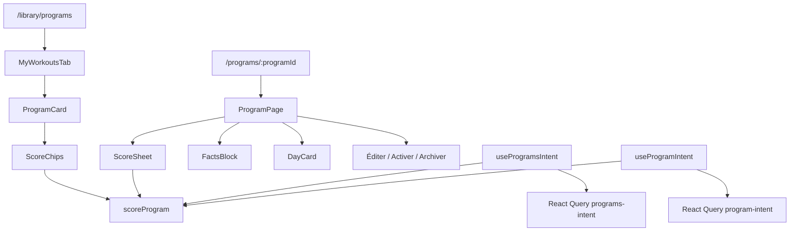

# Tech Plan — Program Identity + Scoring (#504)

> Implements `file:docs/Epic_Brief_—_Program_Identity_+_Scoring_#504.md`. Glossary: `file:docs/CONTEXT.md` (**Program Page**, **Program Identity v1**, **Goal Track**, **Program Balance**, **Program Facts**, **Circuit in Program Scores**, **Program Score Rubric**, **Program Score Copy**). ADR to write: `/programs/:id` + published rubric. Live Builder banner is [#519](https://github.com/PierreTsia/workout-app/issues/519) — same scorer, not this PR.

---

## Architectural Approach

### Key Decisions

| Decision | Choice | Rationale |
|---|---|---|
| Scorer | Pure function in `src/lib/programScore/` | Same module for #519. Golden tests without Postgres. No migration. |
| Intent payload | One batched `workout_days` query (`program_id IN (…)`) + `SLIM_EXERCISE_SELECT` | List cards need the week. N+1 per card is silly at 2–10 programs. `LABEL` embed lacks `secondary_muscles` / `measurement_type`. |
| Balance math | Reuse `computeBalanceScore` + `MUSCLE_TAXONOMY` | Formula already published. New work is the *intent vector*, not a second CV. |
| Reps | `parseTargetRepRange` then `rep_range_max` | Already the read-path helper (`file:src/lib/rirSuggestion.ts`). Do not invent a third parser. |
| Route | `/programs/:programId` under `AppShell`, sibling of `/builder/:programId` | Locked. Not `/library/programs/:id`. Sheet dies. |
| List chrome | Whole card navigates except Edit / Activate / Archive | « Détails » disappears. |
| Read links | Profil badge + “see program” Home → `/programs/:id` | Edit stays `/builder/:id`. |
| i18n | New `program` namespace | Score copy is a product surface. `library` keeps activate/archive chrome. |
| **Program Balance** UI | EN Balance / FR **Répartition** | **Équilibre** is Profil / executed. |
| **Goal Track** UI | Muscle growth / Strength / Endurance — FR Prise de masse / Force / Endurance | Never print “Goal Track”. |
| Schema | None | Scores are derived. Do not add columns to `programs`. |
| Gate | All users | Not admin-first. Real data, real week. |

### Critical Constraints

**Do not score `set_logs`.** The scorer reads days + **Template Prescription** + catalog embed only. **Équilibre** / `get_volume_by_muscle_group` stay on Profil.

**`LABEL_EXERCISE_SELECT` is the wrong embed.** `file:src/components/library/ProgramDetailSheet.tsx` uses it today. Intent load must use `SLIM_EXERCISE_SELECT` (`file:src/lib/exerciseSelects.ts`) for `secondary_muscles` and `measurement_type`.

**Invalidate the intent cache from every Builder write.** Today `useActivateProgram` does not invalidate `["program", id]` / `["program-detail", id]`. New keys `["program-intent", id]` and `["programs-intent", userId]` must be invalidated from day/exercise/block mutations and from `useCreateProgram` / `useArchiveProgram` / `useUpdateProgramName`. Miss this and the card lies after Éditer.

**`computeBalanceScore` does not apply 1 / 0.5.** That credit lives in the accumulator (solos: `sets × 1` primary, `sets × 0.5` per taxonomy secondary; **Circuit** station: `1` / `0.5` *once per block*). Then pass the 13-vector in.

**Unknown muscles are dropped**, not invented. `muscle_snapshot` outside `MUSCLE_TAXONOMY` does not get a 14th axis. Prefer live `exercise.muscle_group` with snapshot fallback.

**AMRAP is never a set count.** `file:src/lib/programScore` must not multiply `rounds` or guess rounds from `cap_seconds`.

**Copy law.** Values in `program.json` follow `file:.cursor/skills/microcopy/SKILL.md` + **Program Score Copy**. Keys may say `goalTrack`. Values may not.

**Supabase in tests.** Any page that imports the client needs `vi.mock("@/lib/supabase", …)`. Scorer unit tests import no client.

---

## Data Model

No new tables. Derived document:

### Table Notes

`ProgramScore` is the return of `scoreProgram(intent)`. Bands are `'empty' | 'short' | 'ok' | 'high'`. `empty` is not `short`. **Program Balance** is `{ kind: 'empty' } | { kind: 'score', value: 0–100 }` — empty only when there are 0 days and 0 items; a Circuit-only week *has* a number.

Threshold constants live next to the scorer (`bands.ts`) and are imported by tests + rubric copy keys (numbers in copy must match constants — ticket test).

Equipment mix buckets (credits, same grain as Balance):

| Bucket | Slugs |
|---|---|
| `free` | barbell, dumbbell, ez_bar, kettlebell |
| `machine` | machine, cable |
| `bodyweight` | bodyweight |
| `other` | band, bench, other, unknown |

---

## Component Architecture

### Layer Overview

### New Files & Responsibilities

| File | Purpose |
|---|---|
| `src/lib/programScore/types.ts` | Intent + score types |
| `src/lib/programScore/bands.ts` | Published thresholds (single source) |
| `src/lib/programScore/toIntent.ts` | Map slim query rows → `ProgramIntent` |
| `src/lib/programScore/scoreProgram.ts` | Pure scorer |
| `src/lib/programScore/scoreProgram.test.ts` | Golden fixtures: empty, 1-day, PPL-shaped, 5×5-shaped, Cindy-only |
| `src/hooks/useProgramIntent.ts` | `["program-intent", id]` — one program, slim embed |
| `src/hooks/useProgramsIntent.ts` | `["programs-intent", userId]` — batch `IN` for visible programs |
| `src/pages/ProgramPage.tsx` | Route page: load / 404 / offline-empty / sheet |
| `src/components/program/ProgramScoreChips.tsx` | 3 bands + Balance 0–100 (card) |
| `src/components/program/ProgramScoreSheet.tsx` | Page: sentence + tap example per track + Balance |
| `src/components/program/ProgramFactsBlock.tsx` | Days / sets / circuits / mix |
| `src/locales/en/program.json` | EN contract |
| `src/locales/fr/program.json` | FR contract |
| `docs/adr/0020-program-identity-and-score-rubric.md` | Route + published claim |

### Component Responsibilities

`**scoreProgram**`
- Input: `ProgramIntent`. Output: `ProgramScore`. No I/O, no i18n.
- Hypertrophy / strength / endurance / Balance / Facts per CONTEXT. Circuits per **Circuit in Program Scores**.

`**useProgramIntent` / `useProgramsIntent**`
- Fetch + `toIntent` + `scoreProgram`. Page uses the single-id hook (and hydrates from the batch cache when coming from the list if the ids overlap — same select shape, `setQueryData` for each id after batch).
- Invalidate helpers exported; wired into existing mutation `onSuccess`s.

`**ProgramPage**`
- `useParams` UUID gate → not-found (pattern: `file:src/pages/library/ExerciseLibraryExercisePage.tsx`).
- `useProgram` + `useProgramIntent`. Cached week scores offline; no cache → empty/offline, never fake bands.
- Back → `/library/programs`. Éditer → `/builder/:id` with `state.from`. Activate / archive reuse existing hooks + `ActivateConfirmDialog`.
- Days: reuse `file:src/components/library/DayCard.tsx` (read-only). Extract `toDayCardItems` from the dying sheet.

`**ProgramCard**`
- Card body / title is a `Link` to `/programs/:id`. Action row stays buttons (stopPropagation). Drop `onDetails` / `details` key usage.
- Renders `ProgramScoreChips` + fact line from `useProgramsIntent` map. Missing intent (still loading) → chips skeleton, not `short`.

`**MyWorkoutsTab**`
- Delete `detailProgram` / `ProgramDetailSheet`. Delete the sheet file once call sites are 0.

`**Router**`
- Lazy `ProgramPage` next to `BuilderPage` in `file:src/router/index.tsx`.

### Failure Mode Analysis

| Failure | Behavior |
|---|---|
| Invalid / foreign `programId` | Not-found + link to Library. No `ok` bands |
| Query error | Error string (`program.loadError`). No scores |
| Offline, cache hit | Render scores from cache |
| Offline, cache miss | Empty/offline copy. No fabricated band |
| 0 days / 0 items | Facts 0; all scores `empty`; CTA Éditer |
| Circuit-only week | Endurance + Balance show; hypertrophy volume + strength `empty` |
| Muscle slug outside taxonomy | Ignored |
| Session active + Activate | Existing dialog / disabled — unchanged |
| Builder saved, user hits back | Intent queries stale unless mutations invalidate — treat as a ship bug |

---

## i18n contract

**Namespace:** `program` (register in `file:src/lib/i18n.ts` and `file:src/test/utils.tsx`).

`library.details` becomes unused on the card; leave the key (other surfaces may still use it) or delete in the same ticket if grep is clean.

HITL copy pass may tighten sentences; tickets must not invent synonyms for the track names.

| Key | EN | FR | Why this wording |
|---|---|---|---|
| `track.hypertrophy` | Muscle growth | Prise de masse | terms.md — not “Hypertrophy” naked |
| `track.strength` | Strength | Force | Already in the product |
| `track.endurance` | Endurance | Endurance | Same word both langs |
| `track.balance` | Balance | Répartition | Not Équilibre |
| `band.short` | Low | Faible | Band, not a moral fail |
| `band.ok` | On target | Dans le viseur | Pedagogical, not “OK” |
| `band.high` | High | Élevé | |
| `rubric.hypertrophy` | On target means most muscles you programmed hit 8–20 sets and 2–3 days this week. | Dans le viseur : la plupart des muscles que tu as mis dans la semaine ont 8–20 séries et 2–3 jours. | Rule sentence; numbers = `bands.ts` |
| `rubric.strength` | On target means 20–40% of your sets are 6 reps or fewer, with rest of 150 seconds or more. | Dans le viseur : 20–40 % des séries font 6 reps ou moins, avec 150 secondes de repos ou plus. | |
| `rubric.endurance` | On target means one Circuit, or enough short-rest high-rep sets. | Dans le viseur : un Circuit, ou assez de séries à reps hautes et repos court. | Circuit named; AMRAP not naked |
| `rubric.balance` | A number from how evenly this week hits the muscle list. Not last month’s sessions. | Un nombre : à quel point cette semaine touche les muscles de façon égale. Pas tes séances d’hier. | Splits from Équilibre |
| `example.hypertrophy` | {{muscle}}: {{sets}} sets · {{days}} days → {{band}} | {{muscle}} : {{sets}} séries · {{days}} j → {{band}} | Worked example on tap |
| `facts.line` | {{days}} days · {{sets}} sets · {{circuits}} circuits | {{days}} j · {{sets}} séries · {{circuits}} circuits | Card + page |
| `facts.mix.free` | Free weights | Charges libres | Bucket, not “gym” |
| `facts.mix.machine` | Machines | Machines | |
| `facts.mix.bodyweight` | Bodyweight | Poids du corps | |
| `facts.mix.other` | Other | Autre | |
| `empty.scores` | Add a day to see what this program is for. | Ajoute un jour pour voir à quoi sert ce programme. | empty ≠ short; one wink |
| `notFound` | This program isn’t here. | Ce programme n’est pas là. | Same pattern as exercise 404 |
| `notFoundBack` | Back to programs | Retour aux programmes | |
| `loadError` | We couldn’t load this program. | On n’a pas pu charger ce programme. | *We* / on — our failure |
| `offline` | Scores will show when this week is already on the phone. | Les scores s’affichent si la semaine est déjà sur le téléphone. | Cache rule, no jargon |
| `edit` | Edit | Éditer | Button 1 word |
| `pageTitle` | Program | Programme | Header |

Reuse `library.editProgram` / `activate` / `archive` on the page actions — do not duplicate.

---

## Ticket-sized slices (for split-tickets)

1. Scorer + golden tests + `bands.ts`
2. Intent hooks (slim batch + single) + mutation invalidation
3. Route + **Program Page** (404, empty, DayCard, actions)
4. Cards: chips + fact line; kill sheet; card `Link`
5. Retarget Profil / Home read links
6. `program` i18n + HITL copy pass
7. ADR 0020
