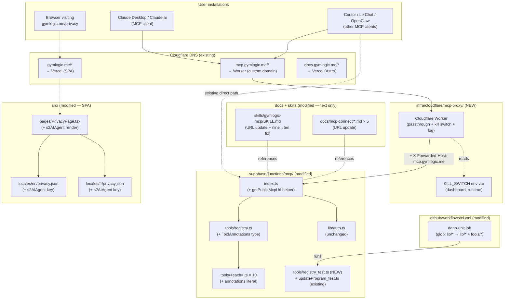

# Tech Plan — Publish MCP + Skill to Anthropic Directory (#296)

## Architectural Approach

### Key Decisions

| Decision | Choice | Rationale |
|---|---|---|
| Tool annotation shape | **Nested `annotations: ToolAnnotations` field on `ToolDefinition`, with `title: string` required and `readOnlyHint`/`destructiveHint`/`idempotentHint` optional booleans** | Spec-conformant per MCP `2025-03-26`; required `title` makes "added a tool, forgot the title" a TS error at the same line you're already editing. Decided in grilling Q1. |
| Hint scope | **`title` + `readOnlyHint`/`destructiveHint` + `idempotentHint`. `openWorldHint` skipped.** | Captures the genuine `create_program` (non-idempotent) vs `update_program` (idempotent) split. `openWorldHint` is uniformly false for our closed-world tools — explicit-everywhere is noise. Decided in grilling Q2. |
| Annotation placement | **Inline at each tool's call site** | Locality; TS catches missing `title` at the same line you're editing. No central map, no constructor helper (premature DRY). Decided in grilling Q3. |
| Annotation matrix | 8 reads (`readOnlyHint: true`, `idempotentHint: true`); `create_program` (`destructiveHint: true`, `idempotentHint: false`); `update_program` (`destructiveHint: true`, `idempotentHint: true`) | Per Q2 grilling table. `resolve_exercises` included (issue body's table omitted it). |
| Registry test | **One file `tools/registry_test.ts` with two property assertions** (every tool has `annotations.title` via `toolRegistry.list()`; no tool claims both `readOnlyHint` and `destructiveHint`) | TS already enforces `title: string` shape; runtime test catches the (a) `list()` regression where annotations get stripped, and (b) coherence invariant TS can't see. Decided in grilling Q4. |
| **CI scope extension** | **Update `deno-unit` glob in `file:.github/workflows/ci.yml` (line 76) from `supabase/functions/mcp/lib/*_test.ts` to also cover `supabase/functions/mcp/tools/*_test.ts`** | `tools/updateProgram_test.ts` already exists but **does not run in CI today** — silent gap. Fix lands as part of A1.4 since we're already adding `tools/registry_test.ts`. |
| Public URL strategy | **Cloudflare Worker proxy at `mcp.gymlogic.me`, OAuth stays on Supabase Auth, both URLs alive forever** | Per ADR 0001. |
| Worker source location | **Monorepo subfolder `infra/cloudflare/mcp-proxy/`** | Worker ↔ function contract is genuinely coupled (header rewriting); colocation > cross-repo coordination. Decided in grilling Q7. |
| Worker shape | **Passthrough + kill switch + minimal logging** (~50 LOC) | Kill switch is cheap insurance for a sticky public URL; minimal logging gives debug visibility. Decided in grilling Q8. |
| Kill switch granularity | **`KILL_SWITCH=true` blocks POST only**; `.well-known/*` GETs and OPTIONS pass through | Killing OAuth metadata mid-flow strands users; killing only MCP RPC is the safe granularity. Decided in grilling Q8 follow-up. |
| **Worker→function header convention** | **`X-Forwarded-Host`** | Industry-standard header name; Cloudflare doesn't strip user-provided ones. Switch to a custom `X-MCP-Forwarded-Host` only if smoke test reveals stripping. |
| **Worker env var management** | **`KILL_SWITCH` set as a runtime variable via Cloudflare dashboard, NOT in `wrangler.toml`** | Flippable in seconds via dashboard; `wrangler.toml` `[vars]` would require a redeploy to flip — defeats the kill switch purpose. `wrangler.toml` only declares the var is expected. |
| Function-side change | **Helper `getPublicMcpUrl(req: Request, supabaseUrl: string): string` extracted into `file:supabase/functions/mcp/lib/publicUrl.ts`**, imported by `index.ts`; reads `X-Forwarded-Host` header, falls back to `${supabaseUrl}/functions/v1/mcp` | Per-request derivation; works whether request comes via Worker (forwarded host present) or direct (Supabase URL). Living in `lib/` matches the existing pattern (`auth.ts`, `format.ts`, `jwt.ts`) and falls inside the existing CI `deno-unit` glob. Pure function (env var passed as param) — trivial to test. |
| **`getPublicMcpUrl` test coverage** | **Helper extracted to `file:supabase/functions/mcp/lib/publicUrl.ts`; tested in `lib/publicUrl_test.ts` with two cases (with/without `X-Forwarded-Host`)** | Initial decision (skip the unit test) was wrong: the helper is the load-bearing primitive of the entire URL strategy, and a future refactor without re-running the smoke test would silently break direct-Supabase-URL users. Two-case test is ~15 LOC. Manual smoke test stays as defense in depth. |
| **Worker testing strategy** | **Vanilla `vitest` in `infra/cloudflare/mcp-proxy/`** with `Request`/`Response` mocks; **`worker-unit` CI job** conditional on `infra/cloudflare/**` changes (mirrors the existing `web-type-check` paths-filter pattern) | The Worker is the public-facing entry point; a CI gate against future passthrough/kill-switch regressions costs ~25 lines of YAML. `@cloudflare/vitest-pool-workers` still rejected — vanilla vitest with `Request`/`Response` mocks is sufficient at this size. |
| Cloudflare deployment binding | **Custom Domain in `wrangler.toml`** (`routes = [{ pattern = "mcp.gymlogic.me/*", custom_domain = true }]`) | Modern Cloudflare way; auto-provisions TLS. Worker Routes (older, manual SSL) rejected. |
| Migration smoke test | **Manual `curl + diff` against both URLs before merge**; kill switch as rollback lever | Per Q10 grilling — solo-dev tempo, no real users to protect. Automated diff test is nice-to-have, not blocking. |
| Backward compat for Supabase URL | **Supabase URL stays alive forever; not blocked, deprecated, or sunset** | Per ADR 0001 + grilling Q9. |
| **Privacy policy update strategy** | **Add a dedicated paragraph to existing `PrivacyPage.tsx`** under section s2, naming MCP and the major clients (Claude, Cursor, Le Chat); update s3 to list MCP/Claude as a data flow path; bump `lastUpdated`. **No new component, no new route, no new section.** | The existing privacy page already covers the 6 Anthropic-required points; MCP/AI-agent disclosure is the only gap. |
| Privacy i18n keys | **One new key per locale: `s2AIAgent`** (in both `file:src/locales/en/privacy.json` and `file:src/locales/fr/privacy.json`) | Matches existing `s2*` naming convention. |
| Docs URL update scope | **All five `docs/mcp-connect/*.md` files + `skills/gymlogic-mcp/SKILL.md`** in this PR | Per ADR 0001 follow-ups + grilling Q9. The skill 9-vs-10 inconsistency (line 13 vs 66) gets fixed in the same commit. |
| **PR commit sequencing** | **5 commits, logically separable, each independently revertable**: (1) annotations + CI, (2) `getPublicMcpUrl` function helper, (3) Worker package, (4) docs URL sweep, (5) privacy policy | Smaller commits = clearer PR review surface; if one piece breaks, revert the offending commit not the whole PR. |
| Tracks deferred to follow-up tickets | **A6 (test account), A7 (branding), A8 (allowed link URIs), A9 (connector form submission), B1-B3 (plugin packaging + validation + submission), D1 (MCP Inspector pass), D2 (submission tracking), D3 (post-approval doc update)** | Each is independent enough to ticket separately and unblocked by THIS PR landing. |

### Critical Constraints

**The function's `.well-known/oauth-protected-resource` response is the single load-bearing endpoint.** It declares the resource URL Claude binds against during OAuth and the auth servers it should visit. Currently hardcoded to `${SUPABASE_URL}/functions/v1/mcp` (`file:supabase/functions/mcp/index.ts:94-99`). Under Option A of grilling Q6, this becomes per-request: read `X-Forwarded-Host` (set by the Worker), fall back to `SUPABASE_URL`-derived. Critical: the fallback path must work for **direct** requests to the Supabase URL — existing users still hit it.

**The `WWW-Authenticate` header in 401 responses follows the same dual-path logic.** Hardcoded today (`file:supabase/functions/mcp/index.ts:87`). When a user hits the function unauthenticated via the Worker, the header must point at `mcp.gymlogic.me/.well-known/oauth-protected-resource` — otherwise Claude follows the metadata link to the Supabase URL and the `mcp.gymlogic.me` branding is lost mid-handshake.

**The CI `deno-unit` glob in `file:.github/workflows/ci.yml` (line 76) only covers `supabase/functions/mcp/lib/*_test.ts`.** `supabase/functions/mcp/tools/updateProgram_test.ts` exists but does NOT run in CI today. The `registry_test.ts` we add as part of A1.4 would inherit the same blind spot. Fix the glob in the same commit that adds `registry_test.ts`. The glob update widens the test surface; verify locally that `tools/updateProgram_test.ts` and `tools/registry_test.ts` both pass under `deno test` before pushing.

**The kill switch's POST-only blocking logic must inspect HTTP method, NOT request path or body.** Inspecting body would require buffering the entire JSON-RPC payload (defeats streaming behavior); inspecting path would block legitimate `.well-known/*` requests if they accidentally got POSTed. Method-based is the cleanest discriminant.

**Cloudflare custom-domain TLS provisioning takes 5-15 minutes on first deploy.** The Worker's first `wrangler deploy` will succeed but `mcp.gymlogic.me` will return TLS errors until Cloudflare's edge provisions the cert. Plan for it in the deploy session — don't try this in the last 10 minutes before a meeting.

**The `infra/cloudflare/mcp-proxy/` package has its own `package-lock.json` and `node_modules`.** It's an isolated package; the root `package.json` does NOT depend on it. Adding `infra/cloudflare/` to the SPA build would be wrong (it's not part of the SPA). The Worker's CI/deploy lifecycle is separate (deferred per Q10 grilling — no automated deploy in this PR; manual `wrangler deploy` from the maintainer's machine).

**The `npm run build` workspace rule** (`file:.cursor/rules/build-sandbox-caveat.mdc`) applies: any verification of the SPA build (after privacy policy changes) requires `required_permissions: ["all"]`. For type-checking only, prefer `npx tsc --noEmit` (works in sandbox).

**The skill update collision risk with #302's `claude-desktop.md` sync** is real but manageable: this PR ships first; #302 picks up the new URL on rebase. If #302 ships first (unlikely given dependency direction — A4 of #298 depends on this for the URL), the conflict is a 1-line resolution. Tag the #302 implementer when this PR opens.

**The privacy policy is served by the SPA at `https://www.gymlogic.me/privacy`** (apex `gymlogic.me/privacy` 307-redirects to `www`; both URLs functionally work, `www` is canonical). Anthropic submission form fills `https://www.gymlogic.me/privacy` as the privacy URL — this URL works **today** with the existing page, but the content gap (no MCP mention) means the URL is "live but technically incomplete" until A4 lands. Sequencing: ship A4 in this PR so the URL is content-complete the moment it's submitted in A9. **Note**: the canonical apex-vs-www split is opposite of typical SaaS (most apps use apex-canonical post-2020); migrating to apex-canonical is a separate ticket and out of scope for #296.

**The `npm run lint` and `tsc -b` jobs in CI cover `src/**` (SPA root) but NOT the Worker subfolder.** Adding `infra/cloudflare/mcp-proxy/` won't break root lint/type-check (excluded by tsconfig). Worker has its own `tsconfig.json` + types. Worker code does NOT compile via the root `tsc -b`; verified by leaving it out of the root tsconfig's `references`/`include`.

**ADR 0001 is the single source of truth for the proxy + URL + OAuth issuer decisions.** When implementing, reference the ADR in commit messages and PR description; do NOT re-derive the trade-offs in code comments. Code comments may say *"see ADR 0001"* and reference the file path.

---

## Data Model

#296 has no persistent data model changes (no DB migrations, no schema work). The "data model" here is type definitions, runtime contracts, and configuration shapes.

### 1. `ToolDefinition` shape (modified)

```ts
// supabase/functions/mcp/tools/registry.ts

/** MCP-spec tool annotations (2025-03-26) */
export interface ToolAnnotations {
  /** Human-readable label shown in client UI (e.g. Claude Desktop tool list) */
  title: string
  /** True if the tool only reads data, never writes */
  readOnlyHint?: boolean
  /** True if the tool may delete or replace user data */
  destructiveHint?: boolean
  /** True if calling the tool multiple times with same args is safe */
  idempotentHint?: boolean
}

export interface ToolDefinition {
  name: string
  description: string
  annotations: ToolAnnotations  // NEW: required field
  inputSchema: { ... }           // unchanged
  handler: (...) => Promise<...> // unchanged
}
```

**Notes:**

- `annotations` is **required** at the type level. Every existing tool gets an `annotations: { title, ... }` literal added; new tools must declare one or TS fails. No optional escape.
- `title` is **required** within `ToolAnnotations`. Forces a meaningful label at compile time.
- `openWorldHint` is **omitted** from the type intentionally (closed-world tools; explicit-everywhere is noise).

### 2. Per-tool annotation matrix

| Tool | `name` | `title` | `readOnlyHint` | `destructiveHint` | `idempotentHint` |
|---|---|---|---|---|---|
| `searchExercises` | `search_exercises` | "Search exercise catalog" | `true` | — | `true` |
| `resolveExercises` | `resolve_exercises` | "Resolve exercise names to catalog ids" | `true` | — | `true` |
| `getExerciseDetails` | `get_exercise_details` | "Get exercise details" | `true` | — | `true` |
| `getWorkoutHistory` | `get_workout_history` | "Get workout history" | `true` | — | `true` |
| `getTrainingStats` | `get_training_stats` | "Get training stats" | `true` | — | `true` |
| `getUpcomingWorkouts` | `get_upcoming_workouts` | "Get upcoming workouts" | `true` | — | `true` |
| `listPrograms` | `list_programs` | "List training programs" | `true` | — | `true` |
| `getProgramDetails` | `get_program_details` | "Get program details" | `true` | — | `true` |
| `createProgram` | `create_program` | "Create or replace active program" | — | `true` | `false` |
| `updateProgram` | `update_program` | "Update existing program (preserves history)" | — | `true` | `true` |

**Notes:**

- "—" means the field is omitted (not `false`). Optional-and-omitted is the canonical "unspecified" state per MCP spec.
- `update_program`'s `idempotentHint: true` reflects PATCH-by-id semantics (same patch + same id = same end state, no row duplication).
- `create_program`'s `idempotentHint: false` reflects "creates a new row + deactivates previous active each call" — repeated calls produce different end states.

### 3. Cloudflare Worker env shape

```ts
// infra/cloudflare/mcp-proxy/src/index.ts
interface Env {
  /** Upstream Supabase function URL (set in wrangler.toml [vars]) */
  UPSTREAM_URL: string
  /** Kill switch (set via Cloudflare dashboard, NOT wrangler.toml) */
  KILL_SWITCH?: string
}
```

**Notes:**

- `UPSTREAM_URL` is the **MCP Edge Function URL** (`https://favusepjqwpcroiolvaz.supabase.co`). Declared in `wrangler.toml [vars]` because it's deploy-time stable.
- `KILL_SWITCH` is **NOT** in `wrangler.toml`. Set via Cloudflare dashboard → Settings → Variables. Read at runtime via `env.KILL_SWITCH === "true"`. Default behavior (var unset or != "true") is normal proxying.

### 4. `.well-known/oauth-protected-resource` response shape (clarified)

```ts
// Same shape as today, but resource is now per-request
{
  resource: getPublicMcpUrl(req),                       // CHANGED: was hardcoded MCP_URL
  authorization_servers: [`${SUPABASE_URL}/auth/v1`],   // unchanged
  scopes_supported: [],                                 // unchanged
  bearer_methods_supported: ["header"],                 // unchanged
}
```

```ts
// New helper in supabase/functions/mcp/lib/publicUrl.ts
export function getPublicMcpUrl(req: Request, supabaseUrl: string): string {
  const forwardedHost = req.headers.get("X-Forwarded-Host")
  if (forwardedHost) {
    return `https://${forwardedHost}/functions/v1/mcp`
  }
  return `${supabaseUrl}/functions/v1/mcp`
}
```

Pure function — `supabaseUrl` is passed as a parameter rather than read from `Deno.env` inside, so tests don't need env-var setup. `index.ts` passes `Deno.env.get("SUPABASE_URL")!` at the call site.

### 5. Privacy policy locale shape (modified)

Both `file:src/locales/en/privacy.json` and `file:src/locales/fr/privacy.json` gain ONE new key:

```jsonc
{
  // existing keys ...
  "s2AIAgent": "AI agent integrations (Claude, Cursor, Le Chat, etc.): when you connect GymLogic via OAuth or a Personal Access Token, the agent reads your training data on your behalf. Writes (program creation/updates) require your explicit confirmation in-chat before execution.",
  // ...
}
```

`s3Body` ("Where your data is processed") is updated to list MCP/agent providers as a flow path:

```jsonc
"s3Body": "Your data is stored in Supabase (database, auth, file storage). AI generation requests are sent to Google Gemini. AI agent integrations are routed through Cloudflare and Supabase, with the agent's provider (Anthropic, OpenAI, Mistral, etc.) processing only the prompt and response. The app is hosted on Vercel. These are the only sub-processors. We do not sell or share your data with anyone else."
```

`PrivacyPage.tsx` renders the new key alongside existing s2 keys (one new `<p>{t("s2AIAgent")}</p>` line).

---

## Component Architecture

### Layer Overview



### New Files & Responsibilities

| File | Purpose |
|---|---|
| `infra/cloudflare/mcp-proxy/wrangler.toml` | **New** — Worker config: `name`, `main`, `compatibility_date`, custom domain binding (`routes = [{ pattern = "mcp.gymlogic.me/*", custom_domain = true }]`), `[vars] UPSTREAM_URL` set to the Supabase URL. `KILL_SWITCH` deliberately NOT declared here (set in dashboard at runtime). |
| `infra/cloudflare/mcp-proxy/package.json` | **New** — Worker package. Dev deps: `wrangler` (latest), `@cloudflare/workers-types`, `vitest`, `typescript`. Scripts: `dev` (wrangler dev), `deploy` (wrangler deploy), `test` (vitest run). No runtime deps. |
| `infra/cloudflare/mcp-proxy/tsconfig.json` | **New** — `target: "ES2022"`, `module: "ES2022"`, `moduleResolution: "bundler"`, `types: ["@cloudflare/workers-types"]`, `strict: true`. Excludes the SPA's tsconfig hierarchy. |
| `infra/cloudflare/mcp-proxy/src/index.ts` | **New** — fetch handler. ~50 LOC: parses incoming request, checks `env.KILL_SWITCH === "true"` for POSTs (returns 503 if killed), constructs upstream URL preserving path/query, sets `X-Forwarded-Host` header, fetches upstream, streams response back. Emits one `console.log` per request. |
| `infra/cloudflare/mcp-proxy/src/index.test.ts` | **New** — `vitest` against `Request`/`Response` mocks. Cases: passthrough preserves method/path/query, `X-Forwarded-Host` is added correctly, kill switch blocks POST when `KILL_SWITCH=true`, kill switch does NOT block GET to `.well-known/*` even when set, errors from upstream propagate as-is. |
| `infra/cloudflare/mcp-proxy/.gitignore` | **New** — `node_modules/`, `.wrangler/`, `dist/`, `.dev.vars`. |
| `supabase/functions/mcp/lib/publicUrl.ts` | **New** — extracted helper `getPublicMcpUrl(req, supabaseUrl)` (~5 LOC). Pure function: returns `https://${X-Forwarded-Host}/functions/v1/mcp` if header present, else `${supabaseUrl}/functions/v1/mcp`. Imported by `index.ts`. |
| `supabase/functions/mcp/lib/publicUrl_test.ts` | **New** — Deno test. Two cases: (a) `Request` with `X-Forwarded-Host: mcp.gymlogic.me` → returns `https://mcp.gymlogic.me/functions/v1/mcp`; (b) `Request` without the header → returns `${supabaseUrl}/functions/v1/mcp` fallback. ~15 LOC. Covered by existing CI `deno-unit` glob (`lib/*_test.ts`). |
| `supabase/functions/mcp/tools/registry_test.ts` | **New** — Deno test (matches Deno test convention `_test.ts`). Two property assertions: `every tool exposes annotations.title via toolRegistry.list()`; `no tool claims both readOnlyHint and destructiveHint`. ~25 LOC. |

### Modified Files

| File | Modification |
|---|---|
| `file:supabase/functions/mcp/tools/registry.ts` | Add `ToolAnnotations` interface (4 fields: `title`, `readOnlyHint?`, `destructiveHint?`, `idempotentHint?`). Add `annotations: ToolAnnotations` (required) to `ToolDefinition`. No change to `tools[]` array or `toolRegistry` export shape (`list()` already spreads `...schema`, which now includes `annotations`). |
| `file:supabase/functions/mcp/tools/searchExercises.ts` | Add `annotations: { title: "Search exercise catalog", readOnlyHint: true, idempotentHint: true }` to the `searchExercises` literal. |
| `file:supabase/functions/mcp/tools/resolveExercises.ts` | Add `annotations: { title: "Resolve exercise names to catalog ids", readOnlyHint: true, idempotentHint: true }`. |
| `file:supabase/functions/mcp/tools/getExerciseDetails.ts` | Add `annotations: { title: "Get exercise details", readOnlyHint: true, idempotentHint: true }`. |
| `file:supabase/functions/mcp/tools/getWorkoutHistory.ts` | Add `annotations: { title: "Get workout history", readOnlyHint: true, idempotentHint: true }`. |
| `file:supabase/functions/mcp/tools/getTrainingStats.ts` | Add `annotations: { title: "Get training stats", readOnlyHint: true, idempotentHint: true }`. |
| `file:supabase/functions/mcp/tools/getUpcomingWorkouts.ts` | Add `annotations: { title: "Get upcoming workouts", readOnlyHint: true, idempotentHint: true }`. |
| `file:supabase/functions/mcp/tools/listPrograms.ts` | Add `annotations: { title: "List training programs", readOnlyHint: true, idempotentHint: true }`. |
| `file:supabase/functions/mcp/tools/getProgramDetails.ts` | Add `annotations: { title: "Get program details", readOnlyHint: true, idempotentHint: true }`. |
| `file:supabase/functions/mcp/tools/createProgram.ts` | Add `annotations: { title: "Create or replace active program", destructiveHint: true, idempotentHint: false }`. |
| `file:supabase/functions/mcp/tools/updateProgram.ts` | Add `annotations: { title: "Update existing program (preserves history)", destructiveHint: true, idempotentHint: true }`. |
| `file:supabase/functions/mcp/index.ts` | Import `getPublicMcpUrl` from `./lib/publicUrl.ts`. Replace `MCP_URL` constant uses in (1) `RESOURCE_METADATA_URL` computation (now per-request via `getPublicMcpUrl(req, SUPABASE_URL)`), (2) `WWW_AUTHENTICATE` header (now per-request), (3) `.well-known/oauth-protected-resource` `resource` field. Two of these are computed at module-load today; they move into the request handler. Net diff: ~5 LOC removed (old hardcoded constants), ~3 LOC added (import + 3 call sites). |
| `file:.github/workflows/ci.yml` | **Four changes**: (1) Update `deno-unit` job's command from `deno test "supabase/functions/mcp/lib/*_test.ts" --allow-env` to `deno test "supabase/functions/mcp/lib/*_test.ts" "supabase/functions/mcp/tools/*_test.ts" --allow-env` (Deno accepts multiple paths). (2) Extend the `changes` job's `paths-filter` with a `worker` output matching `infra/cloudflare/**`. (3) Add a new `worker-unit` job conditional on `needs.changes.outputs.worker == 'true'` running `cd infra/cloudflare/mcp-proxy && npm ci && npm test`. (4) Rename `web-checks-passed` to `subproject-checks-passed`, add `worker-unit` to its `needs:`, and extend the body to verify both `web-*` and `worker-*` results follow the success-or-skipped pattern. **Branch protection**: after the rename, update the required check from `web-checks-passed` to `subproject-checks-passed`. |
| `file:skills/gymlogic-mcp/SKILL.md` | **Three lines to fix** (verified by `rg -i "nine\s+(tool\|read)" skills/`): Line 13 ("**nine tools** (seven reads, two writes)" → "**ten tools** (eight reads, two writes)"); Line 60 ("All **nine** tools 401 if no auth context" → "All **ten** tools 401 if no auth context"); Line 57 (URL: `https://favusepjqwpcroiolvaz.supabase.co/functions/v1/mcp` → `https://mcp.gymlogic.me/functions/v1/mcp`). Line 66 ("Ten tools total — eight reads, two writes") is already correct. |
| `file:docs/mcp-connect/claude-desktop.md` | URL update: `*.supabase.co/functions/v1/mcp` → `mcp.gymlogic.me/functions/v1/mcp`. Verify `mcp-remote` config example URLs are also updated. |
| `file:docs/mcp-connect/cursor.md` | URL update (same pattern). |
| `file:docs/mcp-connect/le-chat.md` | URL update (same pattern). |
| `file:docs/mcp-connect/openclaw.md` | URL update (same pattern). |
| `file:docs/mcp-connect/example-prompts.md` | URL update if any URL appears (verify; likely none, but check). |
| `file:src/locales/en/privacy.json` | Add `s2AIAgent` key (verbatim per Data Model section 5). Bump `lastUpdated` to "Last updated: May 2026". |
| `file:src/locales/fr/privacy.json` | Add `s2AIAgent` key (FR translation of the same content). Bump `lastUpdated` accordingly. |
| `file:src/pages/PrivacyPage.tsx` | Add one line after the existing `s2*` rendering block: `<p>{t("s2AIAgent")}</p>`. Update `s3Body` rendering if structure changes (probably not — same `<p>{t("s3Body")}</p>` works). |

### Component Responsibilities

**Cloudflare Worker (`infra/cloudflare/mcp-proxy/src/index.ts`)**

```ts
export default {
  async fetch(req: Request, env: Env): Promise<Response> {
    // Kill switch — POST only, lets metadata GETs through
    if (env.KILL_SWITCH === "true" && req.method === "POST") {
      return new Response("Service temporarily unavailable", {
        status: 503,
        headers: { "Retry-After": "60" },
      })
    }

    // Construct upstream URL (preserve path + query, replace host)
    const incomingUrl = new URL(req.url)
    const upstreamBase = new URL(env.UPSTREAM_URL)
    const upstreamUrl = new URL(`${incomingUrl.pathname}${incomingUrl.search}`, upstreamBase)

    // Forward request, stamping X-Forwarded-Host so the function can rewrite .well-known
    const headers = new Headers(req.headers)
    headers.set("X-Forwarded-Host", incomingUrl.host)

    const upstreamResponse = await fetch(upstreamUrl, {
      method: req.method,
      headers,
      body: req.body,
    })

    console.log(JSON.stringify({
      method: req.method,
      path: incomingUrl.pathname,
      status: upstreamResponse.status,
    }))

    return upstreamResponse
  },
} satisfies ExportedHandler<Env>
```

- **Single-responsibility**: the Worker exists to (a) brand the URL, (b) stamp `X-Forwarded-Host`, (c) provide a kill switch. No business logic.
- **Path preservation**: the Custom Domain binds to `mcp.gymlogic.me/*`; incoming `pathname` is the full path including `/functions/v1/mcp/...`. The upstream URL is constructed with the same `pathname` against the upstream base — full pass-through.
- **Body streaming**: `Request.body` and `Response.body` are streams natively; passing `req.body` to `fetch()` and returning the response works without manual buffering.
- **Header forwarding**: `Authorization`, `Origin`, `Accept`, `Content-Type` etc. are forwarded by default via `new Headers(req.headers)`. Cloudflare strips a few hop-by-hop headers automatically.
- **CORS**: the upstream function already sets `Access-Control-Allow-Origin: *` etc. (`file:supabase/functions/mcp/index.ts:6-11`). The Worker doesn't need to add CORS headers — the upstream's response carries them.

**Function helper `getPublicMcpUrl(req, supabaseUrl)` (`supabase/functions/mcp/lib/publicUrl.ts`)**

```ts
export function getPublicMcpUrl(req: Request, supabaseUrl: string): string {
  const forwardedHost = req.headers.get("X-Forwarded-Host")
  if (forwardedHost) {
    return `https://${forwardedHost}/functions/v1/mcp`
  }
  return `${supabaseUrl}/functions/v1/mcp`
}
```

- **Pure function**: takes `supabaseUrl` as a parameter rather than reading `Deno.env.get("SUPABASE_URL")!` inline. Trivial to test (no env-var setup required); `index.ts` passes `Deno.env.get("SUPABASE_URL")!` at the call site.
- **Path 1** (Worker-routed request): `X-Forwarded-Host: mcp.gymlogic.me` → returns `https://mcp.gymlogic.me/functions/v1/mcp`.
- **Path 2** (direct Supabase URL request): no `X-Forwarded-Host` → returns `https://favusepjqwpcroiolvaz.supabase.co/functions/v1/mcp` (the legacy URL existing users hit).
- **Used in**: (1) the `resource` field of `.well-known/oauth-protected-resource` response, (2) the `resource_metadata` URL in the `WWW-Authenticate` header on 401 responses.
- **Not used for**: `.well-known/oauth-authorization-server` (that proxies Supabase's AS metadata which already points at `*.supabase.co/auth/v1` — out of scope per ADR 0001 Option A).
- **Unit-tested in `lib/publicUrl_test.ts`** with two cases (with/without `X-Forwarded-Host`); manual smoke test stays as defense in depth.

**`registry_test.ts`** (Deno test)

```ts
import { toolRegistry } from "./registry.ts"

Deno.test("registry: every tool exposes annotations.title via list()", () => {
  for (const tool of toolRegistry.list()) {
    if (!tool.annotations || typeof tool.annotations.title !== "string" || tool.annotations.title.length === 0) {
      throw new Error(`${tool.name} has missing or empty annotations.title`)
    }
  }
})

Deno.test("registry: no tool claims both readOnlyHint and destructiveHint", () => {
  for (const tool of toolRegistry.list()) {
    const a = tool.annotations
    if (a?.readOnlyHint && a?.destructiveHint) {
      throw new Error(`${tool.name} cannot be both readOnly and destructive — pick one`)
    }
  }
})
```

- **Property-style**: catches future regressions without restating the matrix in code (which would be tautology).
- **No mocks**: pure exercise of the registry's `list()` output.

**Privacy policy update**

- `s2AIAgent` (new key) renders as one `<p>` inside the existing s2 section. No structural change.
- `s3Body` (existing key) gets revised text but the rendering doesn't change.
- `lastUpdated` bumps to "May 2026" (FR/EN).
- The section ordering and React rendering logic are unchanged — pure content edit.

### Failure Mode Analysis

| Failure | Behavior |
|---|---|
| **Cloudflare TLS provisioning takes 15+ min on first deploy** | First `wrangler deploy` returns success, but `https://mcp.gymlogic.me/...` returns TLS handshake errors until cert provisions. **Detection**: `curl -v https://mcp.gymlogic.me/functions/v1/mcp -X OPTIONS` returns SSL error. **Resolution**: wait. **Mitigation**: schedule deploy during a no-stress window. |
| **Worker deploys but custom-domain binding fails silently** | Worker is live but `mcp.gymlogic.me` returns 522 / 1014 / generic Cloudflare error. **Detection**: dashboard shows "Custom Domain: error" on the Worker. **Resolution**: re-bind via dashboard or `wrangler` CLI; verify zone ownership. |
| **`X-Forwarded-Host` header dropped in transit** (Cloudflare strips it, or upstream filters it) | Function falls back to `SUPABASE_URL`-derived public URL even when called via Worker. Claude sees the Supabase URL in `.well-known/oauth-protected-resource.resource` — branding regression but functionally OK. **Detection**: smoke test (`curl https://mcp.gymlogic.me/functions/v1/mcp/.well-known/oauth-protected-resource`) returns `resource: *.supabase.co/...` instead of `mcp.gymlogic.me/...`. **Resolution**: switch to a custom header name like `X-MCP-Forwarded-Host` (rename in both Worker and function). |
| **`getPublicMcpUrl` fallback returns wrong URL on direct Supabase access** | E.g. typo: `https://${forwardedHost}` (correct) vs `https:/${forwardedHost}` (typo). **Detection**: (a) `lib/publicUrl_test.ts` covers both branches (with/without `X-Forwarded-Host`), running in CI `deno-unit` job; (b) manual smoke test as defense in depth. **Resolution**: ship the fix. |
| **`.well-known/oauth-authorization-server` proxy fails** (existing code, not changed by this PR) | Falls back to 502 per `file:supabase/functions/mcp/index.ts:111-114`. Not a new failure mode but worth verifying it still works post-deploy. |
| **Kill switch flipped accidentally in dashboard** | All POSTs return 503; OAuth flow still works (metadata GETs unaffected); MCP RPC dies. **Detection**: any tool call returns 503 in Claude. **Resolution**: flip `KILL_SWITCH` back to anything other than `"true"` in dashboard; takes < 60s to propagate. |
| **Worker exceeds free tier (100k requests/day)** | Cloudflare returns 1015 (rate limited). **Detection**: dashboard analytics show ramp toward limit. **Resolution**: upgrade to Workers Paid ($5/mo for 10M requests). **Mitigation**: log-based monitoring at the maintainer level; not realistic at current usage. |
| **Worker test (`vitest`) doesn't catch a real-world Cloudflare runtime quirk** | E.g. `Headers` mutation after fetch. **Detection**: `wrangler dev` smoke test catches it locally; if not, prod deploy + `curl` smoke catches it. **Mitigation**: vanilla vitest is a coarse net; the deploy-time smoke is the real gate. |
| **`registry_test.ts` test runs locally but not in CI** | Pre-CI-glob-update: silent regression risk. **Detection**: code review (catch the missing `tools/*_test.ts` glob entry in `ci.yml`). **Resolution**: fix the glob in the same commit. |
| **Annotation type change breaks an existing tool's TS compilation** | New required `title: string` makes any tool literal without it fail. **Detection**: `tsc -b` (or `deno check` for Deno files) catches it pre-commit. **Resolution**: add `annotations` to the offending tool. **Expected**: this fires for ALL 10 tools on the first commit before annotations are added; sequencing matters (modify `registry.ts` + add annotations atomically — not sequentially). |
| **`tools/list` MCP response loses annotations after refactor** | Future engineer changes `tools.map(({ handler: _, ...schema }) => schema)` to drop more fields. **Detection**: `registry_test.ts` first assertion fails — `annotations` missing from `list()` output. **Mitigation**: the test exists for this. |
| **Two tools claim both readOnly and destructive** | Future tool author sets both flags by mistake. **Detection**: `registry_test.ts` second assertion fails. **Mitigation**: the test exists for this. |
| **Cloudflare Worker outage** | `mcp.gymlogic.me` returns 5xx; new installs blocked. Existing Supabase-URL installs unaffected (kept alive per ADR 0001). **Detection**: `curl` smoke or user reports. **Resolution**: verify Cloudflare status, redeploy, or temporarily remove DNS binding. **Mitigation**: kill switch only kills POST; the Worker itself failing has no automatic fallback — accept this risk per current scale. |
| **Existing user's PAT works against `mcp.gymlogic.me` but breaks against Supabase URL** (or vice versa) | Function PAT verification reads from the same DB regardless of which URL the request came in on; PATs should work on both. **Detection**: smoke test with same PAT against both URLs returning identical `tools/list`. **Risk**: low; PATs aren't URL-bound. |
| **OAuth dynamic client registration registers a Claude client at `*.supabase.co`** when user connected via `mcp.gymlogic.me` | Per ADR 0001 — this is intentional. Claude's redirect URI gets registered with Supabase Auth; the user's consent screen lives at `gymlogic.me/oauth/consent`. The user sees `gymlogic.me` brand but a `supabase.co` issuer. Acceptable per "partial domain match" decision. **Detection**: manually inspect the OAuth flow in browser dev tools. **Resolution**: ADR sequel if Anthropic reviewer rejects. |
| **`docs/mcp-connect/*.md` URL update misses a file** | Some user pasting from a stale doc still gets the Supabase URL. Functionally works (URL stays alive), but brand promotion regression. **Detection**: `grep -r "favusepjqwpcroiolvaz" docs/` after edits returns 0 results (excluding ADR 0001 which intentionally references it). **Mitigation**: include this grep in the implementation checklist. |
| **Skill update conflicts with #302's MDX sync** | If #302 ships first, our `claude-desktop.md` URL change conflicts with their MDX-source sync. **Detection**: rebase merge conflict. **Resolution**: 1-line resolution. **Mitigation**: this PR ships first per dependency direction. |
| **Privacy policy update breaks the existing `PrivacyPage.test.tsx`** | The test (file:src/pages/PrivacyPage.test.tsx) might assert specific section count or text. **Detection**: `npm run test` catches it. **Resolution**: update the test to match new section content. |
| **i18n key added to en/ but missed in fr/ (or vice versa)** | Page renders empty string in the other locale. **Detection**: visual smoke OR `npm run test` if there's an i18n-completeness check. **Mitigation**: edit both locale files in the same commit. |
| **`s2AIAgent` content too long, breaks page layout on mobile** | Visual regression. **Detection**: visual smoke on mobile viewport. **Resolution**: trim the copy or break into multiple `<p>` blocks. |

---

## Implementation Notes

Breadcrumbs for the implementer (probably future-me):

- **Commit sequencing — 5 commits, in this order:**
  1. `feat(mcp): add Tool Annotations to all 10 tools` — modifies `registry.ts` (type) atomically with all 10 tool files (annotations); adds `tools/registry_test.ts`; updates `ci.yml` glob. **Critical**: type change + annotation addition must be in the same commit so TS compiles between commits.
  2. `feat(mcp): extract getPublicMcpUrl helper to lib/publicUrl.ts` — adds `supabase/functions/mcp/lib/publicUrl.ts` (5 LOC pure helper, takes `supabaseUrl` as a param) and `lib/publicUrl_test.ts` (2 cases: with/without `X-Forwarded-Host`). Modifies `index.ts` to import the helper and use it in `.well-known/oauth-protected-resource.resource` field and `WWW-Authenticate` header. Tests run in the existing CI `deno-unit` job (covered by the existing `lib/*_test.ts` glob — no glob extension needed for THIS commit; the glob extension lands in commit 1 for `tools/registry_test.ts`).
  3. `feat(infra): Cloudflare Worker proxy at mcp.gymlogic.me` — adds `infra/cloudflare/mcp-proxy/{wrangler.toml,package.json,tsconfig.json,src/index.ts,src/index.test.ts,.gitignore}` AND extends `.github/workflows/ci.yml` with: (a) `worker` output in the `changes` `paths-filter` job, (b) new `worker-unit` job conditional on `needs.changes.outputs.worker == 'true'` running `cd infra/cloudflare/mcp-proxy && npm ci && npm test`, (c) renames `web-checks-passed` to `subproject-checks-passed` and extends its `needs:` array to include `worker-unit` (also update the body verification to check both `web-*` and `worker-*` results). **Worker is not deployed in this commit** — that happens manually post-merge. **Branch protection note**: after the rename, update branch protection rules to require `subproject-checks-passed` instead of `web-checks-passed`.
  4. `docs: switch MCP user-facing docs to mcp.gymlogic.me` — updates `skills/gymlogic-mcp/SKILL.md` (URL on line 57; nine→ten on lines 13 AND 60) and all `docs/mcp-connect/*.md` files. **Sanity checks** (run after commit, both should be clean): (a) `rg "favusepjqwpcroiolvaz" docs/ skills/` returns only the ADR 0001 hit (intentional glossary reference); (b) `rg -i "nine\s+(tool\|read)" skills/` returns 0 hits.
  5. `feat(privacy): document MCP / AI agent integrations` — adds `s2AIAgent` to both locale JSONs, updates `s3Body`, bumps `lastUpdated`, renders the new key in `PrivacyPage.tsx`. Update `PrivacyPage.test.tsx` if it asserts on rendered content.

- **Worker `wrangler.toml` template:**

  ```toml
  name = "gymlogic-mcp-proxy"
  main = "src/index.ts"
  compatibility_date = "2025-01-01"

  [[routes]]
  pattern = "mcp.gymlogic.me/*"
  custom_domain = true

  [vars]
  UPSTREAM_URL = "https://favusepjqwpcroiolvaz.supabase.co"
  ```

  Do NOT add `KILL_SWITCH` here — set it via Cloudflare dashboard at runtime.

- **First Worker deploy (post-merge):**
  1. `cd infra/cloudflare/mcp-proxy && npm install`
  2. `npx wrangler login` (one-time, opens browser)
  3. `npx wrangler deploy`
  4. **Wait 5-15 minutes** for Cloudflare TLS cert provisioning on `mcp.gymlogic.me`.
  5. Smoke: `curl https://mcp.gymlogic.me/functions/v1/mcp -X OPTIONS -i` should return 204 with CORS headers.
  6. End-to-end: re-install GymLogic in your Claude Desktop pointing at `mcp.gymlogic.me`; verify OAuth flow completes; call `search_exercises` with a known query.
  7. If any step fails: flip `KILL_SWITCH=true` in Cloudflare dashboard (kills POST but lets OAuth metadata stay alive); investigate; redeploy.

- **Annotation type addition order**: modify `registry.ts` to add `annotations: ToolAnnotations` (required) AND in the same edit add `annotations` to all 10 tool literals. Don't make `annotations` optional first then tighten — atomic is cleaner. TypeScript catches every offending tool literal in one `tsc -b` run.

- **CI glob extension**: Deno's CLI accepts multiple paths/patterns. Update `ci.yml` line 76:

  ```yaml
  - run: deno test "supabase/functions/mcp/lib/*_test.ts" "supabase/functions/mcp/tools/*_test.ts" --allow-env
  ```

  Verify locally before pushing: same command should pass under local `deno test`.

- **Privacy policy translation discipline**: if you don't speak French fluently, the FR translation of `s2AIAgent` is the riskiest part. Acceptable practices: (a) write English first, machine-translate to French, edit lightly; (b) ask the author of the existing French copy (the maintainer) to review. Do not ship FR auto-translated without a human pass.

- **Smoke test before merge** (PR review checklist):

  ```bash
  # 1. Verify .well-known/oauth-protected-resource resource field reflects each URL
  for url in \
    "https://favusepjqwpcroiolvaz.supabase.co/functions/v1/mcp" \
    "https://mcp.gymlogic.me/functions/v1/mcp"; do
    echo "=== $url ==="
    curl -s "$url/.well-known/oauth-protected-resource" | jq '.resource'
  done
  # Expected:
  #   "https://favusepjqwpcroiolvaz.supabase.co/functions/v1/mcp"
  #   "https://mcp.gymlogic.me/functions/v1/mcp"

  # 2. tools/list returns identical (modulo annotations) shape on both URLs
  for url in \
    "https://favusepjqwpcroiolvaz.supabase.co/functions/v1/mcp" \
    "https://mcp.gymlogic.me/functions/v1/mcp"; do
    echo "=== $url ==="
    curl -s -X POST "$url" \
      -H "Authorization: Bearer $TEST_PAT" \
      -H "Content-Type: application/json" \
      -d '{"jsonrpc":"2.0","id":1,"method":"tools/list"}' | jq '.result.tools | map({name, annotations})'
  done
  # Expected: identical output on both URLs.
  ```

  This is the de-facto unit test for `getPublicMcpUrl(req)`'s two code paths.

- **Skill update grep sanity** (after commit 4):

  ```bash
  grep -rn "favusepjqwpcroiolvaz" docs/ skills/ src/ web/ infra/
  # Expected: ONE hit, in docs/adr/0001-mcp-public-url-and-oauth-issuer.md (intentional glossary reference). Nothing else.
  ```

- **#302 coordination**: when this PR opens, leave a comment on #302 referencing the URL change so the #302 implementer doesn't ship a stale URL in their MDX. Specifically: `docs/Tech_Plan_—_A4_Connect_Claude_#302.md` line 525 hardcodes the Supabase URL and needs updating on rebase.

- **Deferred ticket scope** (for `/split-tickets` later):
  - **A6 — Test account preparation**: 1 hour. Create demo account, log workouts, generate PAT, document in a private internal file.
  - **A7 — Branding assets**: overlap with #302's screenshots. Coordinate.
  - **A8 — Allowed Link URIs**: 5 minutes. Field in the submission form.
  - **A9 — Connector submission**: 30 minutes. Fill form at `clau.de/mcp-directory-submission`.
  - **B1 — Plugin packaging research**: 2-4 hours. Read Anthropic plugin docs, decide repo structure, package skill.
  - **B2 — `claude plugin validate`**: 30 minutes assuming B1 is correct.
  - **B3 — Plugin submission**: 30 minutes.
  - **D1 — MCP Inspector pass**: 1 hour. Run inspector against test account's PAT for all 10 tools.
  - **D2 — Submission tracking**: ongoing, reactive. Email `mcp-review@anthropic.com` if stalled.
  - **D3 — Post-approval doc update**: small ticket, opens after Anthropic approval.

- **Observability for the Worker post-deploy**: the Cloudflare dashboard's "Workers → gymlogic-mcp-proxy → Logs" tab streams the `console.log` JSON lines for 7 days on free tier. Sample after deploy to confirm requests are flowing and the kill switch hasn't been flipped accidentally.

- **Workspace rule reminder**: `npm run build` requires `required_permissions: ["all"]` (per `file:.cursor/rules/build-sandbox-caveat.mdc`). For type-check only on root SPA changes (privacy policy commit), prefer `npx tsc --noEmit`.

---

## References

- This issue: #296
- Epic Brief: `file:docs/Epic_Brief_—_Publish_MCP_+_Skill_to_Anthropic_Directory_#296.md`
- Load-bearing ADR: `file:docs/adr/0001-mcp-public-url-and-oauth-issuer.md`
- Glossary: `file:docs/CONTEXT.md` (MCP section: Tool Annotation, MCP Public URL, MCP Edge Function URL)
- Code anchors:
  - `file:supabase/functions/mcp/tools/registry.ts` (ToolDefinition + registry)
  - `file:supabase/functions/mcp/index.ts` (function entry, `.well-known` endpoints, WWW-Authenticate)
  - `file:supabase/functions/mcp/lib/auth.ts` (PAT + OAuth resolver — unchanged)
  - `file:src/pages/PrivacyPage.tsx` + `file:src/locales/en/privacy.json` + `file:src/locales/fr/privacy.json`
  - `file:.github/workflows/ci.yml` (deno-unit job at line 69, glob at line 76)
- Related epics:
  - #298 — Bootstrap Astro Mini-Site (parent of #302)
  - #302 — A4 Connect Claude page (`file:docs/Tech_Plan_—_A4_Connect_Claude_#302.md` — depends on this PR for URL)
  - #295 — Post-onboarding "Connect Claude" badge (depends on this epic shipping)
  - #310 — `resolve_exercises` batch tool (the 10th tool annotated here)
- Anthropic docs:
  - Submission form: https://clau.de/mcp-directory-submission
  - Review criteria: https://claude.com/docs/connectors/building/review-criteria
  - Plugin form: https://claude.com/plugins/submit
  - MCP spec — Tools: https://modelcontextprotocol.io/specification/2025-03-26/server/tools
- Workspace rules:
  - `file:.cursor/rules/docs-format.mdc` (Tech Plan template)
  - `file:.cursor/rules/build-sandbox-caveat.mdc` (build commands need `required_permissions: ["all"]`)
  - `file:.cursor/rules/no-commit-without-permission.mdc`
  - `file:.cursor/rules/prefer-functional-style.mdc` (used in tool implementations)
- Cloudflare docs:
  - Workers Custom Domains: https://developers.cloudflare.com/workers/configuration/routing/custom-domains/
  - Wrangler reference: https://developers.cloudflare.com/workers/wrangler/configuration/
