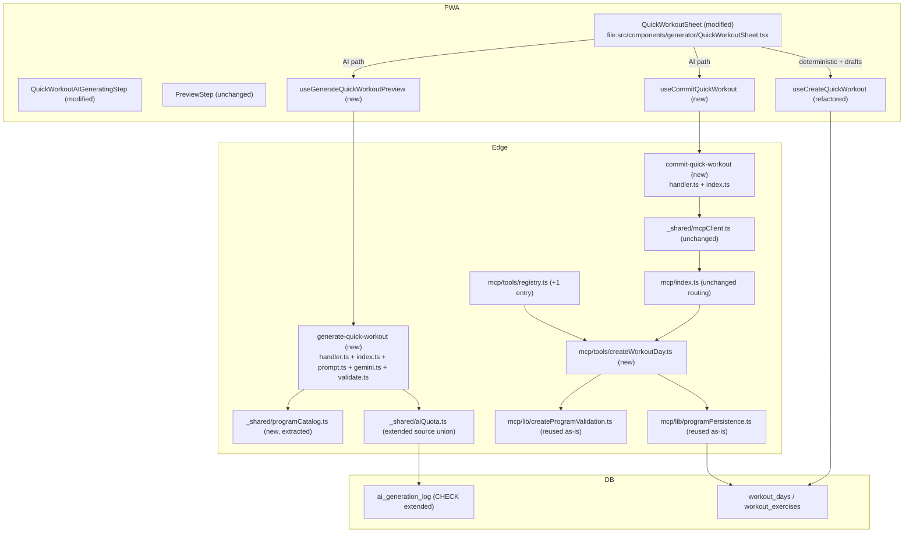

# Tech Plan — Quick Workout AI to Embedded Agent + MCP (#342)

## Architectural Approach

### Key Decisions

| Decision | Choice | Rationale |
|---|---|---|
| Edge function shape | **Two thin functions**: `generate-quick-workout` (preview) and `commit-quick-workout` (write) | Locked in ADR 0002. Preview is idempotent (GET-like), commit is mutator (POST). Different observability + retry patterns. |
| Module pattern per function | `index.ts` (Deno.serve + DI wiring) + `handler.ts` (pure, testable) | Mirrors `embedded-agent`'s split (`file:supabase/functions/embedded-agent/handler.ts`); Vitest exercises the handler without Deno. |
| AI generation reuse | Move `prompt.ts` / `gemini.ts` / `validate.ts` from `generate-workout/` into `generate-quick-workout/` | The legacy function dies in the same PR; no parallel maintenance window needed. |
| New MCP tool | `create_workout_day` in `mcp/tools/createWorkoutDay.ts`, `destructiveHint: false` | Locked in ADR 0002. `create_program` deactivates active programs (`file:supabase/functions/mcp/tools/createProgram.ts:430-443`); unsuitable for daily ad-hoc workouts. |
| Tool internals | Direct reuse of `validateDayExercises` + `buildWorkoutExerciseInsertRowsForDay` (Edge port) | Both helpers are already day-scoped; no extraction refactor needed. |
| `dry_run` output parity | Full rendered output (per-row echo lines) on parity with `create_program` | External MCP Clients (Claude Desktop, etc.) rely on the dry_run review pattern. `extractRenderedFromMcpResult` already parses this shape. |
| Catalog/profile/history | Extract to `_shared/programCatalog.ts`; migrate **`embedded-agent` + `generate-quick-workout` only** | Rule of three (third caller). `generate-program` stays on its inline copy until #343 retires it — smaller diff, lower risk. The TODO at `file:supabase/functions/embedded-agent/index.ts:178-180` is satisfied. |
| Quota source | New value `'quick_workout'` | Locked in ADR 0002. Reserves `embedded_*` for chat-shaped flows. |
| Quota cap (regular) | **10/30d** (bumped from legacy `workout`'s 5/30d) | Quick Workout AI is positioned as a **daily** generator post-migration, not the legacy nice-to-have. 5/30 saturates in 5 days; 10/30 doubles headroom while staying bounded. Whitelisted cap stays at 5/24h. |
| Quota cap mechanism | Introduce a per-source `QUOTA_REGULAR_BY_SOURCE` map in `_shared/aiQuota.ts` | Today's `QUOTA_REGULAR = 5` is a shared constant across all sources (`file:supabase/functions/_shared/aiQuota.ts:10`); bumping `quick_workout` requires per-source caps. `program` and `workout` stay at 5; `quick_workout` ships at 10. |
| Quota gate | Server-side, before any LLM call, in `generate-quick-workout/handler.ts` | Same posture as `_shared/aiQuota.checkQuota`; protects the hosted Gemini key. |
| MCP RPC client | Reuse `_shared/mcpClient.ts#callMcpTool` | Already proven in `embedded-agent`. JSON-RPC + Bearer auth. |
| Web row construction | Refactor `useCreateQuickWorkout` to call `src/lib/programPersistence.ts#buildWorkoutExerciseInsertRowsForDay` | Eliminates shape-parity drift by construction; deterministic + AI paths share the same row builder. |
| Idempotency on Start | Client-side only (mutation `isPending` disables button) | No real double-submit risk; matches today's `useCreateQuickWorkout` posture. |
| `dry_run` from Edge → MCP | Skip — `commit-quick-workout` calls `create_workout_day` with `dry_run: false` directly | PWA already has `PreviewStep` for review. `dry_run: true` is reserved for External MCP Clients. |
| E2E mocking | Playwright `page.route('**/generate-quick-workout', ...)` interception | LLM never called, no token burn. Establishes the pattern for future AI E2E. |

---

### Critical Constraints

- **`generate-program` deletion is conditional on #343** (see Epic Brief Sequencing section). If #343 ships first, deletion moves there; if #342 ships first, deletion stays as a tail-end cleanup in this epic. Plan accordingly when generating tickets.
- **Equipment allowlist parity**: `file:supabase/functions/generate-workout/index.ts` enforces `equipmentCategories ⊆ {bodyweight, dumbbells, full-gym}` AND rejects `full-gym + others`. The new function MUST keep this validation byte-identical — `EQUIPMENT_CATEGORY_MAP` in `prompt.ts` only knows these three keys; passing anything else yields an empty catalog query.
- **`useCreateQuickWorkout` survives** for the deterministic Start path and for save-as-draft (Brief Story 9). After the row-construction refactor, both hooks emit byte-equivalent rows for the same `GeneratedWorkout` input — the shape-parity test becomes a regression check, not a "do they match today" check.
- **Auth dualism in MCP**: `file:supabase/functions/mcp/lib/authLogic.ts:80-82` already accepts both PATs and session JWTs. `commit-quick-workout` uses session JWT; External MCP Clients use PATs. No auth surface change.
- **`PreviewStep` editing semantics**: users can rename, swap, add/remove exercises, change sets/reps, and shuffle order BEFORE Start. The `commit-quick-workout` payload reflects the post-edit state, NOT the LLM's original output. This is why the preview/commit split is mandatory.
- **`AIGenerationSource` is a TS union AND a SQL CHECK constraint** — both must be updated atomically. The migration goes first; the type union is updated in `_shared/aiQuota.ts` in the same PR.
- **`generate-program` keeps its inline catalog/profile/history helpers** during this epic. The `_shared/programCatalog.ts` extraction is opt-in; we don't refactor `generate-program` here. Justified by #343's pending deletion of that function.

---

## Data Model

No DDL beyond a CHECK constraint extension. The "data model" here is really the **wire shapes** for the new endpoints and tool.

### Migration

```sql
-- supabase/migrations/<ts>_quick_workout_quota_source.sql
alter table ai_generation_log
  drop constraint chk_ai_generation_log_source;

alter table ai_generation_log
  add constraint chk_ai_generation_log_source
  check (source in ('program','workout','embedded_chat','embedded_draft','quick_workout'));
```

Mirrors `file:supabase/migrations/20260508155714_ai_generation_log_sources_embedded_agent.sql` exactly. `'workout'` stays in the CHECK for legacy rows from the soon-to-die `generate-workout` function. We don't backfill — historical rows keep their source attribution.

### `create_workout_day` MCP tool — input schema

```typescript
{
  name: "create_workout_day",
  description: "Create a single ad-hoc workout day not tied to a program...",
  annotations: {
    title: "Create Workout Day",
    destructiveHint: false,        // does NOT deactivate any active program
    idempotentHint: false,         // creates a new row each call
  },
  inputSchema: {
    type: "object",
    required: ["label", "exercises"],
    properties: {
      label: { type: "string", minLength: 1, maxLength: 100 },
      exercises: {
        type: "array",
        minItems: 1,
        maxItems: 20,
        items: {
          oneOf: [
            { type: "string", description: "Bare UUID; defaults applied" },
            {
              type: "object",
              required: ["exercise_id","sets","reps","weight_kg","rest_seconds"],
              properties: { /* same shape as create_program's exercise object */ }
            }
          ]
        }
      },
      dry_run: { type: "boolean", default: false }
    }
  }
}
```

**Field naming rationale**: `label` matches both the `workout_days` DB column AND `create_program.days[].label` — agents that already speak `create_program` use the same vocabulary. Top-level `name` exists in `create_program` for the multi-day program; that concept doesn't apply here.

**`emoji` is intentionally NOT in the input schema.** The MCP tool hardcodes `emoji: "⚡"` server-side. Quick Workout has a fixed visual identity (the lightning bolt), and v1 keeps the surface tight. If External MCP Clients ask to customize ("Cardio Day 🏃", "Recovery 🧘"), expose `emoji?` as optional in v2 — trivial 5-line addition, zero client churn.

### `create_workout_day` — output (success, `dry_run: false`)

```json
{ "workout_day_id": "<uuid>", "exercises_count": 5 }
```

### `create_workout_day` — output (`dry_run: true`)

```json
{
  "rendered": ["Bench Press — 4 × 8 × 80 kg total — 120s rest", "Plank — 3 × 60s — 60s rest"],
  "dry_run": true,
  "note": "workout_day_id omitted; server assigns UUID on insert. Re-call with dry_run: false to persist."
}
```

Same envelope shape as `create_program`'s rendered output, scoped to a single day. Per-row rendering reuses the inline loop pattern from `createProgram.ts:314-347` (extract a `renderExerciseRow` helper if duplication grates; low-risk implementation detail).

### `generate-quick-workout` — request/response

Request: `{ duration, equipmentCategories, muscleGroups, focusAreas?, locale }` (unchanged from today's `generate-workout`).
Response: `{ exerciseIds: string[], rationale: string }` (unchanged contract).
Quota source changes from `"workout"` to `"quick_workout"`.

### `commit-quick-workout` — request/response

Request (mirrors the MCP tool shape — no field translation in the Edge function, the client speaks the same vocabulary):
```typescript
{
  label: string;                       // post-edit display name (1..100 chars)
  exercises: Array<                    // post-edit ordered prescription
    | string                           // bare UUID (defaults applied server-side)
    | {
        exercise_id: string;
        sets: number;
        reps: string;
        weight_kg: number;
        rest_seconds: number;
        target_duration_seconds?: number;
      }
  >;
}
```

Response: `{ workout_day_id: string }` on success; `{ error: "commit_failed", kind: "rpc_error"|"tool_error"|"transport_error", message? }` on MCP failure.

**No `label`-translation layer in the Edge function.** The client hook (`useCommitQuickWorkout`) builds the payload with `label` directly (the field name is shared by the PWA, the Edge function, and the MCP tool). The PWA's `GeneratedWorkout.name` field is mapped to `label` at the call site — same translation that already happens today in `useCreateQuickWorkout.ts:25` (`label: workout.name`).

### MCP URL resolution

Both `commit-quick-workout` and any future Edge function that calls MCP server-side use the **same `resolveMcpUrl()` helper** as `embedded-agent` (`file:supabase/functions/embedded-agent/index.ts:244-252`). Resolution order: `Deno.env.get("MCP_URL")` (explicit override for staging/local) → `${SUPABASE_URL}/functions/v1/mcp` (default project URL) → throw if neither is set.

This is the **internal Supabase function-to-function URL**, not the public Cloudflare-fronted `https://mcp.gymlogic.me/functions/v1/mcp`. Rationale: lower latency (no CDN hop), better reliability (no dependency on public DNS / Cloudflare uptime), identical auth (Bearer JWT works on both). External MCP Clients keep using the public URL — that's their concern, not ours.

**Extract to `_shared/mcpClient.ts`** as part of this PR (third caller satisfies rule-of-three; today the helper is duplicated only inside `embedded-agent/index.ts`).

---

## Component Architecture

### Layer Overview



### New Files & Responsibilities

| File | Purpose |
|---|---|
| `file:supabase/migrations/<ts>_quick_workout_quota_source.sql` | Extend `chk_ai_generation_log_source` to include `'quick_workout'`. |
| `file:supabase/functions/_shared/programCatalog.ts` | Extracted `fetchCatalog` / `fetchProfile` / `fetchRecentHistory`. Adopted by `embedded-agent` and `generate-quick-workout`; `generate-program` stays on its inline copy. |
| `file:supabase/functions/generate-quick-workout/index.ts` | Deno.serve wrapper, CORS, DI wiring (creates user/service clients, resolves env, calls handler). |
| `file:supabase/functions/generate-quick-workout/handler.ts` | Pure handler with deps interface: auth → input validation → quota check → catalog/profile/history fetch → prompt build → Gemini call → validate-and-repair → log billable call. |
| `file:supabase/functions/generate-quick-workout/prompt.ts` | Moved verbatim from `generate-workout/`. |
| `file:supabase/functions/generate-quick-workout/gemini.ts` | Moved verbatim from `generate-workout/`. |
| `file:supabase/functions/generate-quick-workout/validate.ts` | Moved verbatim from `generate-workout/`. |
| `file:supabase/functions/commit-quick-workout/index.ts` | Deno.serve wrapper + DI wiring. |
| `file:supabase/functions/commit-quick-workout/handler.ts` | Validate input shape, call `callMcpTool({toolName:"create_workout_day", ...})`, map MCP errors to wire codes, return `{workout_day_id}`. |
| `file:supabase/functions/mcp/tools/createWorkoutDay.ts` | New MCP tool. Auth → fetch catalog by exercise IDs → `validateDayExercises` → `buildWorkoutExerciseInsertRowsForDay` → insert `workout_days` (`program_id: NULL`) + `workout_exercises`. Full `dry_run` rendered output. ~150 LoC. |
| `file:src/hooks/useGenerateQuickWorkoutPreview.ts` | Replaces `useAIGenerateWorkout`. Calls `generate-quick-workout`, hydrates `exerciseIds` against the local exercise pool, returns `GeneratedWorkout`. |
| `file:src/hooks/useCommitQuickWorkout.ts` | New mutation. Posts post-edit `{label, exercises[]}` to `commit-quick-workout` (mapping `GeneratedWorkout.name → label` at the call site, same translation as `useCreateQuickWorkout.ts:25`). Returns `{workout_day_id}` and invalidates upcoming-workouts query keys. |

### Modified Files

| File | Modification |
|---|---|
| `file:supabase/functions/_shared/aiQuota.ts` | (1) Extend `AIGenerationSource` union with `"quick_workout"`. (2) Replace the shared `QUOTA_REGULAR = 5` constant with a per-source `QUOTA_REGULAR_BY_SOURCE: Record<AIGenerationSource, number>` map (`program: 5, workout: 5, embedded_chat: 40, embedded_draft: 3, quick_workout: 10`); `checkQuota` reads the cap by source. Whitelisted cap stays a single shared `5`. Existing callers (`generate-program`, `embedded-agent`'s `enforceProgramQuota`) get the same `5` they had before — no behavior change for them. |
| `file:supabase/functions/embedded-agent/index.ts` | Replace local `fetchCatalog` / `fetchProgramProfile` / `fetchRecentHistory` with imports from `_shared/programCatalog.ts`. |
| `file:supabase/functions/mcp/tools/registry.ts` | Add `createWorkoutDay` entry. |
| `file:src/hooks/useCreateQuickWorkout.ts` | Replace inline row construction (lines 34-60) with `buildWorkoutExerciseInsertRowsForDay` from `src/lib/programPersistence.ts`. |
| `file:src/components/generator/QuickWorkoutSheet.tsx` | Track `generationSource: "ai"\|"deterministic"`. AI path uses `useCommitQuickWorkout` on Start; deterministic path and save-as-draft keep `useCreateQuickWorkout`. |
| `file:src/components/generator/QuickWorkoutAIGeneratingStep.tsx` | Wire `useGenerateQuickWorkoutPreview` instead of `useAIGenerateWorkout`. Error/retry/fallback UI unchanged. |
| `file:skills/gymlogic-mcp/SKILL.md` | Document `create_workout_day` for External MCP Clients (Claude Desktop, Cursor, etc.). See "Skill update scope" below. |

### Deleted Files

| File | Reason |
|---|---|
| `file:supabase/functions/generate-workout/` (whole folder) | Replaced by `generate-quick-workout/`. |
| `file:src/hooks/useAIGenerateWorkout.ts` | Replaced by `useGenerateQuickWorkoutPreview`. |
| `file:supabase/functions/generate-program/` | **Conditional**: only if #343 has not shipped (see Brief Sequencing). Otherwise stays — its deletion belongs to #343. |

### Component Responsibilities

**`generate-quick-workout/handler.ts`**
- Deps interface: `{ getUser, checkQuota, fetchCatalog, fetchProfile, fetchRecentHistory, callGemini, logBillableCall, log }`.
- Order of operations: auth → input validation (equipment allowlist, duration enum, muscle groups) → quota check → catalog/profile/history fetch → `buildPrompt` → `callGemini` → `validateAndRepair` → log billable call → return `{exerciseIds, rationale}`.
- **log_everything**: `logBillableCall(userId, "quick_workout")` runs in `finally` so model failures still credit quota.
- No DB writes other than the billable log row.

**`commit-quick-workout/handler.ts`**
- Deps interface: `{ getUser, callMcp, log }`. No quota — the LLM call already paid.
- Defensive shape check on `body.exercises[]` (array, length 1..20, each entry is string OR object with required fields). Bad shapes → 400 with structured error before MCP touches anything.
- Calls `callMcpTool({ mcpUrl: resolveMcpUrl(), userAccessToken, toolName: "create_workout_day", arguments: { label, exercises, dry_run: false } })`.
- Maps MCP errors to wire codes: `rpc_error` / `tool_error` / `transport_error` → 502 with `kind`. RLS denial bubbles up as `tool_error`.
- Parses `workout_day_id` from MCP success response (defensive: returns 502 on missing field, same pattern as `embedded-agent/handler.ts:347-364`).

**`mcp/tools/createWorkoutDay.ts`**
- Same skeleton as `createProgram.ts` minus the program-level concerns:
  1. Auth via `authLogic` (PAT or session JWT, identical handling).
  2. Validate input shape: `label` (string, 1..100 chars), `exercises[]` (1..20 entries).
  3. Collect distinct UUIDs from `exercises[]` (bare or `.exercise_id`).
  4. `fetchExercisesByIds(supabase, ids)` → catalog map.
  5. `validateDayExercises(rawExercises, args.label, catalogMap)` → returns `ParsedExercise[]` or first error (the label doubles as the validation locator prefix).
  6. If `dry_run: true`: build `rendered` lines (per-row echo, parity with `createProgram.ts:314-347`) and return without writing.
  7. Otherwise: insert one `workout_days` row with `program_id: NULL`, `label: args.label`, `sort_order: 0`, `emoji: "⚡"`, `saved_at: NULL` (live workout, not a draft).
  8. Build rows via `buildWorkoutExerciseInsertRowsForDay(workoutDay.id, generatedExercises)` and bulk-insert.
  9. Return `{ workout_day_id, exercises_count }`.
- **No deactivate-active-program logic**. This is the entire reason the new tool exists.

**`useGenerateQuickWorkoutPreview` (PWA)**
- React Query mutation hook, same shape as today's `useAIGenerateWorkout`.
- POSTs to `${SUPABASE_URL}/functions/v1/generate-quick-workout` with session JWT.
- On success, hydrates `exerciseIds` against the local `exercises` query (same logic as `useAIGenerateWorkout.ts:80-103`).
- Returns `GeneratedWorkout` (with full `Exercise` objects) so `PreviewStep` doesn't need a second fetch.

**`useCommitQuickWorkout` (PWA)**
- React Query mutation hook.
- POSTs to `${SUPABASE_URL}/functions/v1/commit-quick-workout` with session JWT.
- On success, returns `{ workout_day_id }` and invalidates the same query keys as `useCreateQuickWorkout` (upcoming workouts, sessions).
- Error mapping: surface `kind` to toast copy (`rpc_error` → "Server error, retry"; `tool_error` → "Workout couldn't be saved"; `transport_error` → "Network issue").

**`QuickWorkoutSheet` (modified)**
- Adds `const [generationSource, setGenerationSource] = useState<"ai"|"deterministic">("deterministic")`.
- Set to `"ai"` when entering `AIGeneratingStep`; reset to `"deterministic"` on regenerate-as-deterministic fallback.
- `handleStart` branches:
  - `generationSource === "ai"` → `commitQuickWorkout.mutate({label: workout.name, exercises: workoutToMcpExercises(workout)})`.
  - `generationSource === "deterministic"` → existing `createQuickWorkout.mutate(workout)` path.
- `handleSaveAsDraft` always uses `createQuickWorkout` (drafts skip MCP entirely — Brief Story 9).
- `workoutToMcpExercises` is a small util mapping a hydrated `GeneratedExercise[]` to the MCP wire shape (object form with all fields). Lives in `src/lib/quickWorkout.ts` or co-located.

### Skill update scope (`skills/gymlogic-mcp/SKILL.md`)

The MCP skill is the source of truth that External MCP Clients read to learn the GymLogic tool surface. A new tool that isn't documented there is effectively invisible to Claude Desktop / Cursor / Le Chat. Required edits:

- **Tool counts**: bump "ten tools" → "eleven tools" and "eight reads, two writes" → "eight reads, three writes" in the intro and the section header.
- **Trigger section**: add Quick Workout intent examples in FR and EN — e.g. *"crée-moi une séance d'aujourd'hui"*, *"I want a quick workout for today, just one session"*. Make explicit that this is **not** a multi-day program request.
- **Intent → tool table**: new row for `create_workout_day`. The Notes column must contrast clearly with `create_program`: single ad-hoc day, **does NOT deactivate any active program**, max 20 exercises, `program_id: NULL`.
- **`create_program` row**: lightly amend so a future agent knows when NOT to use it — *"For a single ad-hoc workout that should not replace the user's active program, use `create_workout_day` instead."*
- **New conversation pattern** (likely Pattern 5 — Quick ad-hoc workout): worked example showing `resolve_exercises` → `create_workout_day` with `dry_run: true` → echo `rendered` → `dry_run: false`. Call out that the user's **active program stays active** — this is the headline differentiator from `create_program`.
- **Parameter format conventions**: add `create_workout_day` limits (max 20 exercises, name 1..100 chars).
- **Propose-confirm-act handshake**: no change — already applies to any write tool ("any future logging tools" wording at line 112 already covers it). Add a one-line confirmation: *"applies to `create_workout_day` too — same field-drop failure mode."*
- **Edge cases table**: add a row for *"User wants a one-off session (today's workout) without replacing their program"* → `create_workout_day` (NEVER `create_program` for this — that would deactivate their cycle).

The skill update lands in the same PR as the MCP tool implementation. It is **NOT** an after-the-fact documentation chore — agents read the skill, not the source code, so a missing entry means the tool stays unused by External Clients on day one.

### Failure Mode Analysis

| Failure | Behavior |
|---|---|
| Quota exceeded (`quick_workout` 10/30d regular, 5/24h whitelisted) | `generate-quick-workout` returns 429 with `{error:"quota_exceeded", limit, used}`. `AIGeneratingStep` shows the existing quota error UI (already wired for the legacy `quota_exceeded` shape). |
| Gemini timeout / error | `generate-quick-workout` returns 502; `logBillableCall` already fired in `finally`. UI shows existing fallback behavior in `AIGeneratingStep`. |
| Gemini returns invalid JSON / fewer IDs than target | `validateAndRepair` backfills from the catalog (existing logic). UI gets a valid `GeneratedWorkout`; user sees the same flow. |
| User edits past 20 exercises in `PreviewStep` | Client-side input cap (Brief story 11). Backstop: `create_workout_day` rejects `exercises.length > 20` with structured error. |
| User edits an exercise to an invalid UUID | `validateDayExercises` returns parse error; `commit-quick-workout` surfaces as `tool_error`. UI shows "save failed" toast; user can retry. |
| User clicks Start twice | Mutation `isPending` disables the button. Server has no idempotency key; if a race slips through, two `workout_days` rows get created. **Accepted risk** — same posture as today's `useCreateQuickWorkout`. |
| MCP transport error | `commit-quick-workout` returns 502 `kind:"transport_error"`. UI shows retry; preview state preserved. |
| Network failure on commit | Mutation surface returns error to `PreviewStep`; user retries. Preview is held in client state — no data loss. |
| RLS denial on commit (token tampering) | MCP tool returns auth error; `commit-quick-workout` returns 401/403. UI shows "session expired, please re-login". |
| #343 ships first and deletes `generate-program` | Our extracted `_shared/programCatalog.ts` survives. `generate-program` was never migrated to use it (intentional), so its deletion is a clean removal. |
| Equipment allowlist violation | `generate-quick-workout` returns 400 (parity with today's `generate-workout`). Identical UI behavior. |
| External MCP Client uses `dry_run: true` | Returns full `rendered` echo (parity with `create_program`). Client previews, then re-calls with `dry_run: false`. |

---

## Test Strategy

| Layer | Tool | What |
|---|---|---|
| Unit (Edge handler) | Vitest (TS) + Deno (parity for hot helpers) | `generate-quick-workout/handler.ts` and `commit-quick-workout/handler.ts` with deps mocked. Quota gate before model call. log_everything on model failure. |
| Unit (MCP tool) | Vitest (TS) | `createWorkoutDay` happy path, `dry_run: true` rendering, validation rejections, RLS-style denied insert (mocked). |
| Unit (PWA hooks) | Vitest + React Testing Library | `useGenerateQuickWorkoutPreview` hydration, `useCommitQuickWorkout` error mapping, `useCreateQuickWorkout` row-shape after refactor. |
| **Shape parity (mandatory)** | Vitest | Same `GeneratedWorkout` input → both write paths produce equivalent rows. **Compared fields**: all 19 columns of `workout_exercises` (deep-equal); on `workout_days`, only the prescription-relevant fields: `label`, `emoji`, `sort_order`, `program_id` (both `null`). **Excluded fields**: `id`, `user_id`, `created_at`, and `saved_at` (the latter is the *intentional* difference — `useCreateQuickWorkout` for drafts sets it, `create_workout_day` always leaves it `NULL`). After the row-construction refactor in `useCreateQuickWorkout`, this is a regression check against future drift, not a "do they match today" probe. |
| **E2E happy path (mandatory)** | Playwright | Open Quick Workout → AI tab → fill constraints → `page.route('**/generate-quick-workout', ...)` returns deterministic stub → preview renders → edit one set → Start → assert workout in upcoming list. **Gemini never called.** |
| Auth dualism | Vitest | `commit-quick-workout` accepts session JWT; `mcp/tools/createWorkoutDay` works with both PAT and session JWT (calls into `authLogic`). |

The Playwright E2E establishes a reusable interception pattern for future AI flows — Phase B currently has no equivalent.

---

## Sequencing & Migration

The feature ships as **one PR for behavior** plus follow-up cleanup, paced by #343:

1. **Schema migration** lands first (extends CHECK constraint). Backwards-compatible — old `'workout'` rows still pass.
2. **Edge functions + MCP tool + PWA hooks** land together. Old `generate-workout` Edge function stays deployed but unreferenced; UI exclusively hits the new endpoints.
3. **Old `generate-workout/` Edge function deleted** in the same PR (no traffic after step 2).
4. **`useAIGenerateWorkout.ts` deleted** in the same PR.
5. **`generate-program/` deletion** is conditional on #343 (see Brief Sequencing). Either #343 owns it or it lands as the final cleanup commit here.

Rollback: revert the PR. The CHECK constraint is forward-compatible (new value is added, never removed pre-rollback) so a revert is a single `git revert` away.
