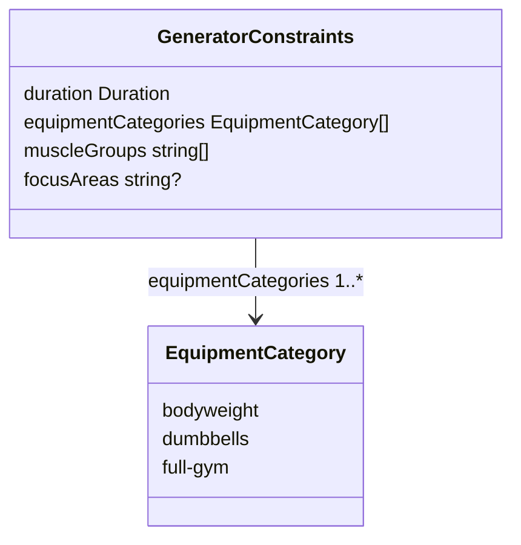
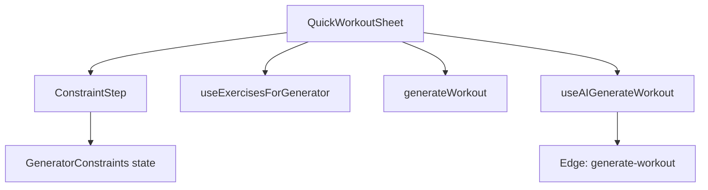

# Tech Plan — Quick Workout: Multi-select Equipment & Custom AI Prompt

## Architectural Approach

Replace the single `equipmentCategory` field with a **normalized equipment selection** that encodes the epic’s exclusive–full-gym rule, derive a **deduplicated union of DB `equipment` values** everywhere filtering happens (React Query hook, deterministic `generateWorkout`, Edge catalog query), and add **`focusAreas`** end-to-end for the AI path with a **shared 500-character** contract validated on clients and both Edge functions.

No database migrations: `exercises.equipment` and RPC usage stay as today; only TypeScript shapes and API bodies change.

### Key Decisions

| Decision | Choice | Rationale |
|---|---|---|
| Equipment shape in `GeneratorConstraints` | `equipmentCategories: EquipmentCategory[]` with invariants (see Data Model) | Matches UI toggles, serializes cleanly to JSON, one mental model for UI + API |
| Union of DB values | Single helper `getEquipmentValuesForCategories(categories: EquipmentCategory[]): string[]` (client + duplicate in `generate-workout` prompt module) | Keeps `file:src/lib/generatorConfig.ts` maps as source of truth per category; server rebuilds union from validated categories |
| API body for `generate-workout` | `equipmentCategories: string[]` (+ existing `duration`, `muscleGroups`) instead of `equipmentCategory` | Explicit multi-select; server validates allowed sets and rejects `full-gym` mixed with others |
| `focusAreas` | Optional `string`; trim; max 500; omit from JSON when empty | Same contract as `file:supabase/functions/generate-program/index.ts`; avoids empty prompt lines |
| Shared max length | `500` in `file:src/lib/aiFocusAreas.ts` (new) + same numeric constant in `file:supabase/functions/_shared/aiFocusAreas.ts` (new) | Vite and Deno don’t share a single TS build; duplicate constant with one comment pointing to the other |
| Quick Generate vs `focusAreas` | Store `focusAreas` on constraints for UI continuity; **ignore** for `generateWorkout` | Epic: optional text is for AI; deterministic path unchanged |
| Fallback (thin pool) | Preserve current idea: if `exerciseCount` not met and selection is **not** bodyweight-only, widen pool by including `bodyweight` equipment where muscle filter allows; set `hasFallback` | For `bodyweight` + `dumbbells`, widening is usually redundant; for `dumbbells` only, behavior matches today |

### Critical Constraints

- **`file:src/types/generator.ts`** — `GeneratorConstraints` gains `equipmentCategories` and optional `focusAreas`. All call sites that assumed `equipmentCategory` must be updated (`QuickWorkoutSheet`, `ConstraintStep`, tests, `useExercisesForGenerator`, `generateWorkout`, `useAIGenerateWorkout`, Edge `generate-workout`).

- **`file:src/hooks/useExercisesForGenerator.ts`** — Query key must include a **stable** encoding of equipment (e.g. sorted `equipmentCategories` joined). The query uses `.in("equipment", equipmentValues)` with the **union** array.

- **`file:supabase/functions/generate-workout/index.ts`** — Parse `equipmentCategories` (array), validate, compute `equipmentValues` via shared logic, reject bad payloads with **400**. Parse `focusAreas` with trim + length; pass into `buildPrompt`. Remove reliance on single `equipmentCategory` in the request body.

- **`file:supabase/functions/generate-workout/prompt.ts`** — `buildPrompt` constraints type gains optional `focusAreas`; equipment line should describe the **human-readable** selection (e.g. `Full gym` or `Bodyweight + Dumbbells`) plus mirror program copy for `focusAreas` when present.

- **`file:supabase/functions/generate-program/index.ts`** — After parsing, clamp/reject `focusAreas` longer than 500 chars (same as client Zod) so older clients can’t bypass.

- **`file:src/components/create-program/schema.ts`** — `.max(500)` on optional `focusAreas` after trim (Zod preprocess or refine).

- **Parity of equipment maps** — `EQUIPMENT_CATEGORY_MAP` in `file:src/lib/generatorConfig.ts` and `file:supabase/functions/generate-workout/prompt.ts` must stay aligned when editing equipment lists (already true today; multi-select increases the need for care).

---

## Data Model



**Invariants (enforced in UI + validated on Edge):**

1. `equipmentCategories.length >= 1`.
2. If `"full-gym"` is present, it **must be the only** element (equivalent to today’s default “everything in the full-gym list”).
3. Otherwise only `"bodyweight"` and/or `"dumbbells"` may appear (any non-empty subset).

**Derived data (not stored):** `equipmentValues: string[]` = sorted unique union of `EQUIPMENT_CATEGORY_MAP[c]` for each `c` in `equipmentCategories`.

**Default constraints** (e.g. `QuickWorkoutSheet`): `equipmentCategories: ["full-gym"]`, `muscleGroups: ["full-body"]`, `focusAreas: undefined` or `""`.

TypeScript sketch:

```ts
// file:src/types/generator.ts (conceptual)
export interface GeneratorConstraints {
  duration: Duration
  equipmentCategories: EquipmentCategory[]
  muscleGroups: string[]
  focusAreas?: string
}
```

### Table Notes

- **`focusAreas`:** Optional; for product copy and analytics parity, treat “missing” and “empty after trim” the same everywhere.
- **No new tables** or Supabase migrations for this epic.

---

## Component Architecture

### Layer Overview



### New Files & Responsibilities

| File | Purpose |
|---|---|
| `file:src/lib/aiFocusAreas.ts` | Export `AI_FOCUS_AREAS_MAX_LENGTH`, `trimFocusAreas(input: string \| undefined): string \| undefined` |
| `file:src/lib/equipmentSelection.ts` | Export `getEquipmentValuesForCategories`, `toggleEquipmentCategory` / UI helpers, invariant validators for tests |
| `file:supabase/functions/_shared/aiFocusAreas.ts` | Duplicate `AI_FOCUS_AREAS_MAX_LENGTH` + trim/validate for Deno |

### Component Responsibilities

**`ConstraintStep`**

- Render equipment as **three toggles** with exclusive full-gym behavior: selecting `full-gym` sets `equipmentCategories` to `["full-gym"]`; selecting bodyweight or dumbbells removes `full-gym` and toggles membership in the limited set; never leave zero categories selected (if the user deselects the last limited pill, restore `["full-gym"]` or keep one selected — mirror the muscle-group “can’t be empty” pattern).
- Render optional **textarea or `Input`** for `focusAreas` with `maxLength={500}` and helper text; mirror FR/EN strings to program’s tone (`focusAreas` / `focusAreasPlaceholder`-style keys under `generator` namespace).
- Do not block Quick Generate on `focusAreas` length beyond HTML/maxLength if Zod runs on submit — prefer validating on **AI** button only or soft validation for both buttons (trim + length toast).

**`QuickWorkoutSheet`**

- Default state uses `equipmentCategories: ["full-gym"]`.
- Passes `constraints` into `useExercisesForGenerator(constraints.muscleGroups, constraints.equipmentCategories)`.

**`useExercisesForGenerator`**

- Signature: `(muscleGroups, equipmentCategories: EquipmentCategory[] | null)`; derive `equipmentValues` via `getEquipmentValuesForCategories`; `enabled` when `equipmentCategories?.length`.

**`generateWorkout`**

- Input: `GeneratorConstraints` with `equipmentCategories`; build pool from union of `equipment` values; **fallback** branch: if pool too small and selection is not bodyweight-only limited mode, widen with bodyweight (see Key Decisions). Update `buildName` to print compact equipment label (e.g. `Gym`, `Bodyweight + Dumbbells`, `Dumbbells`).

**`useAIGenerateWorkout`**

- Invoke body: `duration`, `muscleGroups`, `equipmentCategories`, optional `focusAreas` (omit if empty after trim).
- Optionally append equipment label to generated workout `name` for clarity (non-blocking polish).

**Edge `generate-workout`**

- Validate body; build catalog with `fetchCatalog(supabase, equipmentValues, ...)`; inject `focusAreas` into `buildPrompt`.

### Failure Mode Analysis

| Failure | Behavior |
|---|---|
| Invalid `equipmentCategories` on Edge (mixed full-gym + other, empty array, unknown string) | **400** with clear error; client should never send if UI is correct |
| `focusAreas` > 500 after trim on Edge | **400**; client Zod should prevent in normal use |
| Catalog empty after filters | **404** `"No exercises match the given filters"` — unchanged |
| AI returns IDs not in pool | Existing fetch-by-id path in `useAIGenerateWorkout` — unchanged |
| User offline | AI button already disabled via `navigator.onLine` — unchanged |

---

## Testing & rollout

- Update **`file:src/components/generator/ConstraintStep.test.tsx`** and **`file:src/lib/generateWorkout.test.ts`** for multi-select and name/fallback cases.
- Update **`file:src/hooks/useAIGenerateWorkout.test.tsx`** invoke body snapshot.
- Update **`file:supabase/functions/generate-workout/prompt.test.ts`** and **`validate.test.ts`** for new fields.
- Add unit tests for **`getEquipmentValuesForCategories`** and invariant helpers.

---

## Deferred / follow-ups

- **Single shared equipment map** between Vite app and Deno (monorepo package or codegen) — out of scope; keep manual parity.
- **Rename `focusAreas` to a workout-specific name** — unnecessary while epic locks parity with program AI.

When you are ready, say **split into tickets** to continue.
