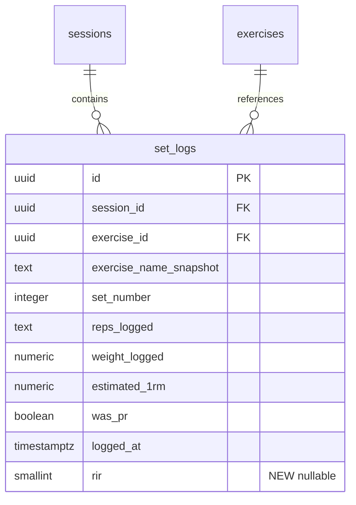
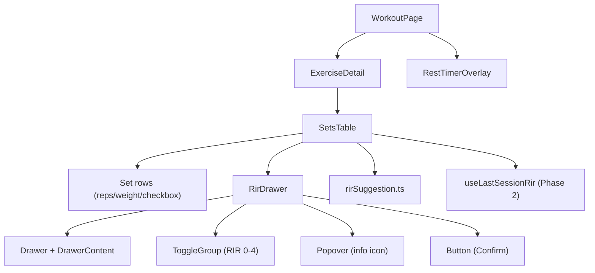
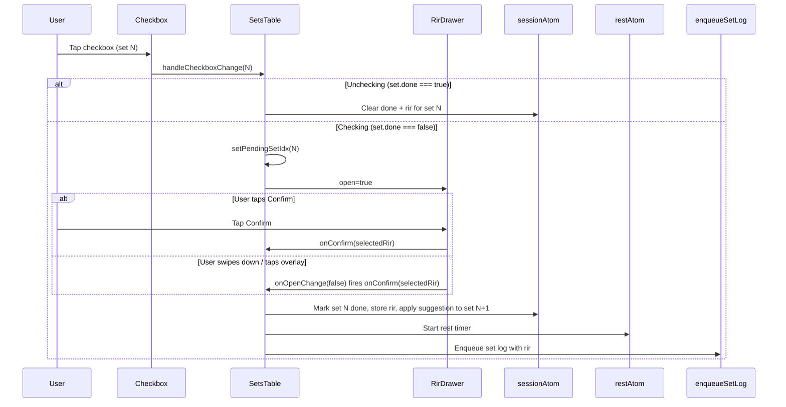

# Tech Plan — RIR Tracking & Auto-Suggestion for Load Progression

## Architectural Approach

### Key Decisions

| Decision | Choice | Rationale |
|---|---|---|
| RIR bottom sheet | shadcn **Drawer** (vaul) — `npx shadcn add drawer` | Swipe-to-dismiss and drag handle are critical on a mobile workout app. Sheet (side=bottom) lacks touch gestures. Drawer is still a shadcn component. |
| RIR selector | **ToggleGroup** (`type="single"`) with 5 `ToggleGroupItem`s | Already installed. `data-[state=on]` handles selected styling. Color per item via Tailwind class overrides — no new UI component. |
| Info tooltip | **Popover** (click-triggered) | Already installed. Better than Tooltip on mobile (hover doesn't exist on touch). |
| Confirm button | shadcn **Button** | Already installed. |
| Dismiss behavior | Dismiss = confirm with default RIR (2) | The Drawer is not a confirmation gate — it's an optional effort annotation. The set is always completed once the checkbox is tapped. No "cancel" path. |
| Pending set state | Local `useState` in SetsTable | The "pending RIR" state is ephemeral (lives only while the Drawer is open). No reason to persist or share globally. No new Jotai atom needed. |
| RIR storage | Nullable `smallint` column on existing `set_logs` | Minimal schema change. No new table. RLS inherited from session-based policy. |
| Suggestion engine | Two pure functions in `file:src/lib/rirSuggestion.ts` | Zero React deps, fully unit-testable. Intra-session reads local state; cross-session reads via TanStack Query hook. |
| Weight increments | Absolute: 2.5 kg / 5 lbs | No percentages. Practical and predictable at all weight levels. |

### Critical Constraints

- **`toggleDone()` is the critical refactor point.** Currently in `file:src/components/workout/SetsTable.tsx`, it does set marking, 1RM computation, PR detection, rest timer start, and sync log enqueue — all synchronously inside a `setSession()` updater. The new flow splits this into two phases: (1) open Drawer, (2) on confirm/dismiss, run the existing logic with RIR injected. Side effects (`setRest`, `enqueueSetLog`) remain inside the `setSession()` updater, preserving the existing pattern.

- **z-index overlap:** Both the Drawer and `RestTimerOverlay` use `z-50`. When the Drawer confirms and the rest timer starts, the timer overlay covers the full viewport, visually masking the Drawer's closing animation. No conflict because the timer is opaque (`bg-background/95`).

- **`atomWithStorage` backward compat:** `sessionAtom.setsData` items gain an optional `rir` field. Old persisted sessions (localStorage) won't have it — `rir` will be `undefined`. The optional type (`rir?: number`) handles this with no migration.

- **Offline sync queue:** Old queued `SetLogPayload` items (without `rir`) will insert `null` in Supabase via `processSetLog`. The column is nullable, so this is safe. `processSetLog` must map `undefined` to `null` explicitly.

- **Existing tests:** `file:src/components/workout/SetsTable.test.tsx` currently checks the checkbox and expects `enqueueSetLog` to be called. With the new flow, the checkbox opens the Drawer — `enqueueSetLog` fires only after RIR confirm. Tests must be updated to simulate the full flow.

---

## Data Model

### Schema Change

Single migration — add `rir` column to `set_logs`:

```sql
ALTER TABLE set_logs ADD COLUMN rir smallint;
```

No backfill, no default. Existing rows get `NULL`. Values: 0 (Maximum), 1 (Very Hard), 2 (Hard), 3 (Moderate), 4 (Easy / "4+"). The column inherits the existing RLS policy on `set_logs`.

### ER Diagram (affected area)



### TypeScript Type Changes

**`SetLog`** in `file:src/types/database.ts` — add `rir`:

```typescript
export interface SetLog {
  // ... existing fields ...
  rir: number | null
}
```

**`SetLogPayload`** in `file:src/lib/syncService.ts` — add optional `rir`:

```typescript
export interface SetLogPayload {
  // ... existing fields ...
  rir?: number
}
```

**`SessionState.setsData`** in `file:src/store/atoms.ts` — extend item shape:

```typescript
setsData: Record<string, Array<{ reps: string; weight: string; done: boolean; rir?: number }>>
```

### processSetLog Mapping

In `file:src/lib/syncService.ts`, `processSetLog` adds one field to the Supabase insert:

```typescript
rir: p.rir ?? null,
```

---

## Component Architecture

### Layer Overview



### New Files and Responsibilities

| File | Purpose |
|---|---|
| `file:src/components/ui/drawer.tsx` | shadcn Drawer component (installed via `npx shadcn add drawer`) |
| `file:src/components/workout/RirDrawer.tsx` | Domain component: Drawer + ToggleGroup + Popover + Button composed into the RIR bottom sheet |
| `file:src/lib/rirSuggestion.ts` | Pure functions: `computeIntraSessionSuggestion()`, `computeCrossSessionSuggestion()` |
| `file:src/lib/rirSuggestion.test.ts` | Unit tests for both suggestion functions |
| `file:src/hooks/useLastSessionRir.ts` | TanStack Query hook: fetches most recent session's RIR data for a given exercise (Phase 2) |
| `supabase/migrations/YYYYMMDD_add_rir_to_set_logs.sql` | `ALTER TABLE set_logs ADD COLUMN rir smallint;` |

### Modified Files

| File | Change |
|---|---|
| `file:src/components/workout/SetsTable.tsx` | Refactor `toggleDone()` into two-phase flow; render `RirDrawer`; apply suggestions to next set |
| `file:src/lib/syncService.ts` | Extend `SetLogPayload` with `rir`; add `rir` to `processSetLog` insert |
| `file:src/types/database.ts` | Add `rir: number \| null` to `SetLog` |
| `file:src/store/atoms.ts` | Extend setsData item type with `rir?: number` |
| `src/locales/en/workout.json` | Add RIR-related i18n keys |
| `src/locales/fr/workout.json` | Add RIR-related i18n keys |
| `file:src/components/workout/SetsTable.test.tsx` | Update tests for new two-phase flow |

### Component Responsibilities

**`RirDrawer`**

- Props: `open: boolean`, `setInfo: { setNumber: number; reps: string; weight: string; unit: string } | null`, `onConfirm: (rir: number) => void`
- Renders a vaul `Drawer` with `open` / `onOpenChange` (controlled)
- Contains a `ToggleGroup` with 5 items (values "0"-"4"), default selected "2"
- Local `useState` for `selectedRir`, reset to 2 when `open` transitions to true
- Context line: `"#N set: {reps} x {weight} {unit}"`
- Popover with info icon: short RIR explanation text
- Dynamic label: computed from `selectedRir` (e.g., "2 more reps", "At failure")
- Confirm button calls `onConfirm(selectedRir)`
- On dismiss (swipe/overlay): `onOpenChange(false)` fires `onConfirm(selectedRir)` — always completes the set

**`SetsTable` (refactored)**

- New local state: `pendingSetIdx: number | null`
- `handleCheckboxChange(idx)`:
  - If unchecking (`set.done === true`): revert immediately, clear `rir` from setsData
  - If checking: set `pendingSetIdx = idx`, opening the Drawer
- `confirmRir(rir: number)`:
  - Guard: return if `pendingSetIdx === null`
  - Run the existing `toggleDone` logic for the pending set, injecting `rir` into:
    - `setsData[exercise.id][idx].rir = rir`
    - `enqueueSetLog({ ...payload, rir })`
  - **Apply intra-session suggestion** to set N+1 (if it exists and isn't done): call `computeIntraSessionSuggestion()`, update N+1's `weight` and `reps` in setsData
  - Start rest timer, compute 1RM, PR check (same as current logic)
  - Set `pendingSetIdx = null`
- Drawer rendered at the bottom: `<RirDrawer open={pendingSetIdx !== null} setInfo={...} onConfirm={confirmRir} />`

**`computeIntraSessionSuggestion(prevRir, prevWeight, prevReps, unit)`**

- Input: RIR value (0-4), current weight (display units as number), current reps (string), unit ('kg' | 'lbs')
- Output: `{ weight: number; reps: string }`
- Logic:
  - `increment = unit === 'kg' ? 2.5 : 5`
  - RIR 0 → `{ weight: max(increment, prevWeight - increment), reps: prevReps }`
  - RIR 1-3 → `{ weight: prevWeight, reps: prevReps }`
  - RIR 4 → `{ weight: prevWeight + increment, reps: prevReps }`
- Floor at one increment (never suggest 0 or negative weight)

**`computeCrossSessionSuggestion(lastSessionSets, toDisplay, unit)` (Phase 2)**

- Input: array of `{ weight_logged: number (kg), reps_logged: string, rir: number }`, display converter, unit
- Output: `{ weight: string; reps: string } | null`
- Logic:
  - Filter sets with non-null RIR; return null if none
  - Compute average RIR across sets
  - Use first set's weight/reps as baseline
  - Avg RIR < 1.5 → same weight; 1.5-2.5 → +1 increment; > 2.5 → +2 increments
  - Convert baseline weight from kg to display units via `toDisplay`

**`useLastSessionRir(exerciseId)` (Phase 2)**

- TanStack Query hook, key: `['last-session-rir', exerciseId, userId]`
- Fetches `set_logs` with RIR data from the most recent *completed* session for the given exercise
- `staleTime: 5 * 60 * 1000` (5 min) — this data doesn't change within a workout
- Used by SetsTable to apply cross-session suggestions when initializing set rows

### Drawer Layout Spec

```
+-----------------------------+
|        === (drag handle)    |
|                             |
|  Reps in Reserve       (i)  |  <- DrawerTitle + Popover
|  #1 set: 12 x 32.5 kg      |  <- DrawerDescription
|                             |
|      2 more reps            |  <- dynamic label (from selectedRir)
|                             |
|  [4+] [3]  [2]  [1]  [0]   |  <- ToggleGroup
|  Easy Mod  Hard VH   Max   |  <- labels below each item
|                             |
|              [ Confirm ]    |  <- Button in DrawerFooter
+-----------------------------+
```

ToggleGroupItem styling (Tailwind class overrides per item, circular shape):

- Each item: `h-12 w-12 rounded-full border-2`
- Value 0 (red): `border-red-500 text-red-400 data-[state=on]:bg-red-500 data-[state=on]:text-white`
- Value 1 (orange): `border-orange-500 text-orange-400 data-[state=on]:bg-orange-500 data-[state=on]:text-white`
- Value 2 (yellow): `border-yellow-500 text-yellow-400 data-[state=on]:bg-yellow-500 data-[state=on]:text-white`
- Value 3 (green): `border-green-500 text-green-400 data-[state=on]:bg-green-500 data-[state=on]:text-white`
- Value 4 (blue): `border-blue-500 text-blue-400 data-[state=on]:bg-blue-500 data-[state=on]:text-white`

Labels (Maximum, Very Hard, Hard, Moderate, Easy) rendered as `span`s below each item — not inside the ToggleGroupItem.

### Set Completion Flow (Refactored)



### Failure Mode Analysis

| Failure | Behavior |
|---|---|
| User checks set → Drawer opens → app crashes / navigates away | `pendingSetIdx` in local state is lost. Set was never marked done. On return, checkbox is unchecked. User retries normally. |
| Old `SetLogPayload` in offline queue (no `rir` field) | `processSetLog` maps `p.rir ?? null` → inserts `NULL`. Column is nullable. Safe. |
| User unchecks a set that had RIR logged | `rir` is cleared from setsData. If already synced to Supabase, the set_log row still has the old RIR. No retroactive update — acceptable because unchecking is rare and the data is still directionally correct. |
| RestTimerOverlay appears while Drawer is still animating closed | Both at z-50. Rest timer is full-screen opaque (`bg-background/95`), visually covers the Drawer. No glitch. |
| First-ever exercise with no RIR history (Phase 2) | `useLastSessionRir` returns null. No cross-session suggestion applied. Set rows initialized with template defaults. Normal behavior. |
| `setsData` loaded from localStorage without `rir` field | `rir?: number` is optional. Missing field → `undefined`. All code handles `undefined` as "no RIR logged." |
| Suggestion produces weight < minimum increment | Floor at one increment (2.5 kg / 5 lbs). Never suggest 0 or negative. |

---

## i18n Keys

Added to `src/locales/{en,fr}/workout.json`:

| Key | EN | FR |
|---|---|---|
| `rir.title` | Reps in Reserve | Répétitions en réserve |
| `rir.description` | How many more reps could you have done? | Combien de répétitions aurais-tu encore pu faire ? |
| `rir.confirm` | Confirm | Valider |
| `rir.infoText` | RIR measures how many reps you had left before failure. It helps the app suggest weight adjustments. | Le RIR mesure combien de répétitions il vous restait avant l'échec. Il aide l'app à suggérer des ajustements de charge. |
| `rir.label.0` | Maximum | Maximum |
| `rir.label.1` | Very Hard | Très difficile |
| `rir.label.2` | Hard | Difficile |
| `rir.label.3` | Moderate | Modéré |
| `rir.label.4` | Easy | Facile |
| `rir.moreReps_zero` | At failure | À l'échec |
| `rir.moreReps_one` | {{count}} more rep | {{count}} répétition de plus |
| `rir.moreReps_other` | {{count}} more reps | {{count}} répétitions de plus |
