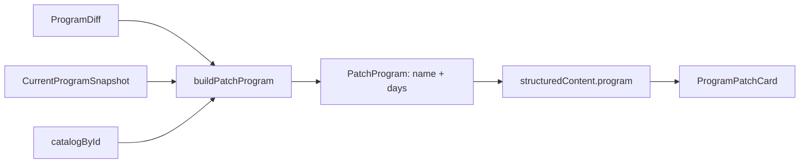
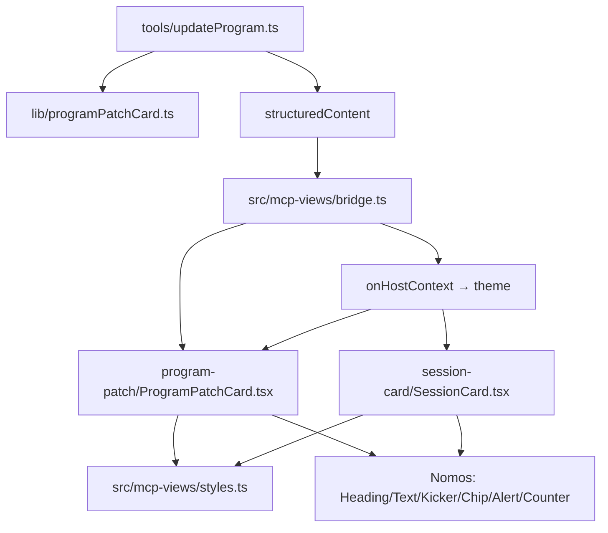

# Tech Plan — Refinement design des cartes MCP

## Architectural Approach

### Key Decisions

| Décision | Choix | Rationale |
|---|---|---|
| Source des `days[]` | Module **pur** `supabase/functions/mcp/lib/programPatchCard.ts` : `diff` + `currentProgram` + `catalogById` (déjà en scope handler) | zéro requête, zéro changement du contrat `ProgramDiff` |
| Placement du payload | `program` + `locale` **uniquement dans `structuredContent`** | additivité maximale ; `payload` / `content[].text` (contexte modèle) et `rendered` inchangés |
| Détection de changement | Comparer `currentProgram.days[].workout_exercises` ↔ `diff.days_to_update[].parsed_exercises`, appariement par **`exercise_id`** (glouton, par ordre d'apparition), champ par champ | réutilise `reconcileSolos` (`file:supabase/functions/mcp/lib/slotReconciliation.ts`) ; l'« avant » est reconstruit sans toucher `ProgramDiff` |
| Grain d'annotation | **Exercice** : liste des champs changés (`sets`/`reps`/`weight`/`rest`), copie composée côté vue | l'i18n se reconstruit depuis les champs typés, pas depuis le markdown EN-only |
| Exercices retirés d'un jour | **Non annotés** dans la carte (v1) ; couverts par les `warnings` de détachement | périmètre borné, pas de bruit visuel |
| Nom du programme | `program.name` = `diff.name_change?.to ?? currentProgram.name` | la maquette affiche le nom en `Heading` |
| Circuits | **Ligne compacte** (label + mode `AMRAP 20 min` / `N tours` + nombre d'exercices), pas de structure per-round | périmètre borné, réutilise le vocabulaire Session Card |
| Changement de contrat | **Additif** + argument optionnel `locale` | contrat MCP public ⇒ **ADR 0031** + tests |
| Composants | Nomos `Chip tone` / `Alert tone` / `Counter` / `Kicker` / `Separator` | première adoption ; le lint impose la surface publique Nomos |
| Style | `src/mcp-views/styles.ts` partagé | fin de la duplication `panel` / `muted` |
| Thème | `onHostContext({ theme })` → `data-theme` (repli `dark`) | la carte suit l'hôte |
| Locale | `resolveCardLocale(args.locale, profile.locale)` (existant) | miroir exact de `render_session_card` |

### Critical Constraints

`formatProgramAfterUpdate` (`file:supabase/functions/mcp/lib/format.ts:603`) rend **tous** les jours finaux (updates + inserts + unchanged, triés par `sort_order`, deletes exclus) : le payload structuré **doit** refléter le même ensemble et le même ordre, sinon carte et `rendered` divergent.

`CurrentProgramSnapshotExercise.weight` est un **`string`** (`file:supabase/functions/mcp/lib/updateProgramTypes.ts:13-22`) et `reps` peut être une plage (`"8-12"`) : la comparaison doit **normaliser** (trim, numérique) pour éviter de fausser « changé ».

`ParsedExercise` a trois formes : `bare` (UUID seul, défauts `3×10@0`), `object`, `circuit` (`file:supabase/functions/mcp/lib/createProgramValidation.ts:51-75`). Un `bare` **ne doit pas** être signalé « changé » (absence de prescription ≠ modification).

`resolveCardLocale` (`file:supabase/functions/mcp/lib/sessionCard.ts:110`) est la primitive de locale : `args.locale → user_profiles.locale → "en"`. On la réutilise, sans la dupliquer.

L'arch test `file:src/test/mcpProgramPatch.arch.test.ts:73-80` interdit tout `.insert(` / `.update(` / `.from(` / `fetch(` dans `src/mcp-views/**` — le restyle reste présentationnel. Rebrancher `onHostContext` ne touche pas `bridge.ts` (déjà exposé `:82`).

`view:check` échoue si `*.generated.ts` n'est pas rebuild — dans la même PR.

Le test Deno `file:supabase/functions/mcp/tools/updateProgram_test.ts` lit `content[0].text` : tout ajout dans `payload` le casserait ⇒ on n'ajoute **rien** à `payload`.

---

## Data Model

```ts
// supabase/functions/mcp/lib/programPatchCard.ts (nouveau)
export type PatchLocale = "en" | "fr"
export type PatchChangeField = "sets" | "reps" | "weight" | "rest"

export type PatchSoloExercise = {
  kind: "solo"
  name: string
  sets: number
  reps: string            // "10" ou une plage "8-12"
  weightKg: number
  restSeconds: number
  targetDurationSeconds: number | null
  isNew: boolean                        // exercice d'un jour inséré
  change: PatchChangeField[] | null     // null = inchangé / non comparable
}

export type PatchCircuitExercise = {
  kind: "circuit"
  label: string           // "Cindy" (Benchmark) ou "Circuit"
  mode: "amrap" | "rounds"
  capSeconds: number | null
  rounds: number | null
  exerciseCount: number
  isNew: boolean
}

export type PatchExercise = PatchSoloExercise | PatchCircuitExercise

export type PatchDay = { label: string; emoji: string; exercises: PatchExercise[] }

export type PatchProgram = { name: string; days: PatchDay[] }
```

Ajout à `structuredContent` (`file:supabase/functions/mcp/tools/updateProgram.ts:409-416`) :

```ts
const locale = resolveCardLocale(args.locale, profileLocale)

return {
  content: [{ type: "text", text: JSON.stringify(payload, null, 2) }],
  structuredContent: {
    status: "preview",
    ...payload,                 // rendered, removed_days, added_days, warnings… inchangés
    locale,
    program: buildPatchProgram(diff, currentProgram, catalogById),
    ...(preview_token ? { preview_token } : {}),
  },
}
```

Côté vue, `ProgramPatchPayload` (`file:src/mcp-views/program-patch/types.ts`) gagne `locale?: "en" | "fr"` et `program?: PatchProgram` — **optionnels**, donc rétrocompatibles.



### Table Notes

- `change` est calculé **par exercice apparié** : on compare `sets`, `reps` (normalisé), `weight` (string → nombre), `rest_seconds`. Une valeur absente d'un côté n'est pas une modification.
- Un exercice d'un **jour inséré** porte `isNew: true, change: null` (tout est nouveau, pas « modifié »).
- Un exercice d'un **jour inchangé** porte `change: null`.
- Les solos appariés par `exercise_id` (glouton, par ordre d'apparition) ; un `bare` parsed est traité `change: null`.
- `days_to_delete` n'apparaît jamais dans `program.days` (il vit dans `removed_days`).

---

## Component Architecture

### Layer Overview



### New Files & Responsibilities

| File | Purpose |
|---|---|
| `file:supabase/functions/mcp/lib/programPatchCard.ts` | Fonction pure : `diff` + `current` + `catalog` → `PatchProgram` ; détection des champs changés |
| `file:supabase/functions/mcp/lib/programPatchCard.test.ts` | Vitest unitaire du builder |
| `file:src/mcp-views/styles.ts` | `panel` + styles layout partagés par les 2 cartes |
| `file:docs/adr/0031-decision-card-structured-program.md` | Contrat public additif (payload structuré + `locale`) |

### Component Responsibilities

**`buildPatchProgram(diff, current, catalog)`** — pure, sans I/O. Mappe `days_to_update` / `days_to_insert` / `days_unchanged` (exclut `days_to_delete`), trie par `sort_order`. Nom = `diff.name_change?.to ?? current.name`. Pour un jour modifié : apparie solos `current`↔`parsed` (`exercise_id`, glouton), calcule `change` (champs distincts normalisés) ; `isNew` = aucun solos existant apparié ; inchangé → `change: null`. Circuits → `kind: "circuit"` compact.

**`updateProgram`** — résout `locale` (`resolveCardLocale`), ajoute `program` + `locale` au seul `structuredContent`. `payload` / `rendered` intacts.

**`ProgramPatchCard.tsx`** — `Kicker`(title) → `Heading`(program.name) → `Badge` statut → `Chip tone="danger"` retraits / `Chip tone="success"` ajouts → `Alert tone="warning"` warnings → jours (`Kicker` emoji+label) → lignes (`Text` nom + `Text size="caption"` prescription muted + annotation `change`) → `Button` Apply. États `applying` / `applied` / `error` conservés. Repli sur `rendered`/message si `program` absent.

**`SessionCard.tsx`** — remplace les styles inline par `Heading` / `Text` / `Kicker` / `Separator` / `Counter` ; supprime la `ProgressBar` `/10000` ; badge PR inchangé.

**`entry.tsx` (les 2)** — passent `onHostContext` → `theme` en state → `data-theme` ; la Decision Card lit `payload.locale` (fin du `navigator.language`).

**`styles.ts`** — exporte `panel` (et tout style layout partagé), importé par les deux cartes.

### Failure Mode Analysis

| Failure | Behavior |
|---|---|
| Jour id de `days_to_update` absent de `currentProgram` | pas d'annotation, exercices `change:null` (carte dégradée, jamais fausse) |
| Poids `"80"` vs `80` / reps `"8-12"` vs `"10"` | comparaison normalisée ; jamais de faux « changé » |
| `bare` exercise (UUID seul) | traité inchangé, pas d'annotation |
| Hôte non-MCP-Apps | pas de carte ; `update_program{dry_run:false}` reste le chemin (non-régression) |
| `preview_token` absent | bouton Apply désactivé (SSR / fallback) |
| Hôte n'envoie jamais `host-context` | repli `data-theme="dark"` |
| `program` absent (hôte ancien, résultat hors preview) | carte retombe sur `rendered` / `message` |
| `view:check` | CI rouge si artefacts non rebuild |

---

## i18n contract

**Namespace :** `program.mcpView` (+ réemplois)
**Surfaces :** Decision Card (tranche 2). La Session Card n'ajoute **aucune** chaîne (réemplois existants).

| Key | EN | FR | Why this wording |
|---|---|---|---|
| `mcpView.statusPreview` | To approve | À approuver | badge statut, sec, non-alarmiste |
| `mcpView.consentNote` | Nothing is written until you approve it. | Rien n'est écrit avant ta validation. | « clic = consentement », factuel, tu |
| `mcpView.changedSets` | Sets changed | Séries modifiées | annotation ligne (terme glossary **Set**) |
| `mcpView.changedReps` | Reps changed | Reps modifiées | **Reps** |
| `mcpView.changedWeight` | Weight changed | Poids modifié | **Weight / Poids** |
| `mcpView.changedRest` | Rest changed | Repos modifié | **Rest / Repos** |
| `mcpView.reps` | reps | reps | unité prescription (loanword autorisé FR) |
| `mcpView.rest` | rest | repos | unité prescription |
| `mcpView.circuitExercises_one` | {{count}} exercise | {{count}} exercice | ligne Circuit compacte |
| `mcpView.circuitExercises_other` | {{count}} exercises | {{count}} exercices | pluriel |

**Réemplois (aucune nouvelle clé) :** `mcpView.title/apply/applying/applied/error/removedDays_*/addedDays_*` ; `history:circuit.fallbackLabel`, `history:circuit.rounds_*`, `builder:amrapGloss` (**AMRAP jamais nu** : badge `AMRAP 20 min` + gloss) ; `history:sets` (« sets » / « séries »).

### Rejected
- `"Cette modification ne prendra effet qu'après votre approbation"` (maquette) → **vous** + calque → `consentNote` en **tu**.
- Clé `changed` générique `"{{fields}} modifié"` → accord pluriel fragile → une clé par champ.

### Open
- Aucun terme hors glossaire. **Reps** garde la forme courte (loanword toléré, glossary `Reps / répétitions`).

---

## Tests

Ordre rouge→vert (TDD) :

1. `file:supabase/functions/mcp/lib/programPatchCard.test.ts` (vitest) — **en premier** : change detection (`sets`/`reps`/`weight`/`rest`, normalisation plage/poids), `isNew`, circuits, deletes exclus, ordre identique à `rendered`, `bare` non annoté.
2. `file:supabase/functions/mcp/tools/updateProgram_test.ts` (deno) — `structuredContent.program.days` + `locale` présents ; `content[0].text` **inchangé** (additivité prouvée).
3. `file:src/test/mcpProgramPatch.arch.test.ts` — contrat : `program` consommé par la vue, pas de chemin d'écriture, artefact contient les composants. Session Card : `Counter` présent, `ProgressBar` absent.
4. `npm run build:view` + `view:check` verts ; `file:src/locales/locales.test.ts` (parité EN/FR) vert ; `npm test` + `npm run lint` verts.

---

## Stress-Test List

1. **Appariement** : `exercise_id` (glouton, par ordre d'apparition) — un jour réordonné à ids dupliqués peut créer de faux « changé » ; accepté comme heuristique.
2. **Plages/format** : `weight` string, `reps` `"8-12"` → normalisation obligatoire sinon faux positifs.
3. **`bare`** : défauts `3×10@0` ≠ modification → skip annotation.
4. **Cap unités** : cap AMRAP en secondes côté données → formater `20 min`, jamais `1200`.
5. **Additivité** : ajout uniquement dans `structuredContent`, jamais `payload` (sinon Deno rouge).
6. **Première adoption Nomos** `Chip`/`Alert`/`Counter`/`Kicker` : `Alert.title` requis, `Chip` sans `variant` — vérifier au rendu réel.
7. **Thème** : light non testé aujourd'hui → state testé, défaut dark.
8. **Exercices supprimés dans un jour modifié** : non annotés (v1) — couverts par les `warnings`.

## Références

- Epic Brief `file:docs/Epic_Brief_—_Refinement_design_des_cartes_MCP.md` · issue [#651](https://github.com/PierreTsia/workout-app/issues/651) · epic [#643](https://github.com/PierreTsia/workout-app/issues/643)
- ADR `file:docs/adr/0027-agentic-view-contract.md`, `file:docs/adr/0028-view-intention-and-consent-token.md`, **ADR 0031** (à écrire)
- `file:src/mcp-views/**`, `file:scripts/build-mcp-view.mjs`, `file:supabase/functions/mcp/lib/format.ts:603`, `file:supabase/functions/mcp/lib/sessionCard.ts:110`, `file:supabase/functions/mcp/lib/slotReconciliation.ts`
