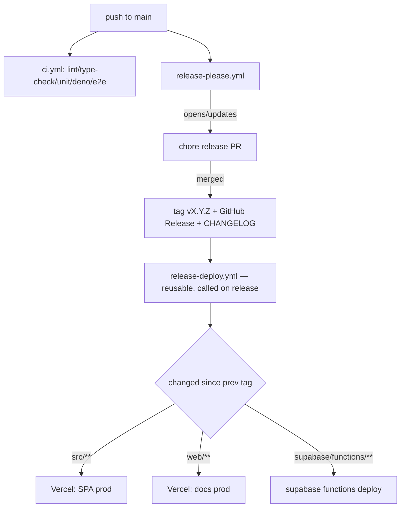

# Tech Plan — Release Mechanism

## Architectural Approach

### Key Decisions

| Decision | Choice | Rationale |
|---|---|---|
| Tool | **release-please** (`googleapis/release-please-action@v4`) | Owns version + changelog + tag + GitHub Release from Conventional Commits; a doc PR creates no release PR by construction (ADR 0025). |
| Trigger | Merge the standing release PR (`gh`/GitHub) + `workflow_dispatch` | Deliberate, batched, scriptable by an agent. |
| Version source | root `package.json`, tag `vX.Y.Z` | One number; release-please's `node` strategy bumps it. |
| MCP contract version | `SERVER_INFO.version` bumped in the **same** release PR via `extra-files` (generic updater + `// x-release-please-version` annotation) | The agent-facing number must equal the released one. |
| Deploy trigger | `release-deploy.yml` is a **reusable** workflow (`workflow_call`) invoked by the release workflow when it creates a release — the single deploy path — plus `workflow_dispatch` for a manual tag | A release made with the default `GITHUB_TOKEN` does **not** trigger `on: release`, so the deploy is called directly; keeping a single path avoids a double-deploy once a PAT is added. |
| Deploy scope | **Path-gated vs the nearest tagged ancestor** (SPA / `web/**` / `supabase/functions/**`; **all** functions when `_shared/**` changes) | No redundant SPA redeploy (PWA cache), no needless docs/function deploys, and `_shared` fan-out redeploys its consumers. |
| Edge Functions deploy | `supabase functions deploy <changed>` with `SUPABASE_ACCESS_TOKEN` | A release ships app **and** MCP together. |
| Baseline | manual `v1.0.0` tag at the bootstrap commit | History starts from a known prod point; manifest seeded at `1.0.0`. |
| Worker proxy | untouched | Stable upstream proxy, not a versioned artefact. |

### Critical Constraints

- **release-please needs a starting point.** No tag exists; set `bootstrap-sha` to the setup commit (`f8ceb14`) so the first release PR does not dig through the whole history.
- **The generic updater needs an annotation.** `supabase/functions/mcp/index.ts`'s `SERVER_INFO.version` line must carry `// x-release-please-version` for release-please to rewrite it.
- **`SUPABASE_ACCESS_TOKEN` is a CI secret** (value only a human can set) → HITL item; the workflow must **no-op cleanly** when the secret is absent or the deploy is skipped.
- **The produced release PR must not itself trigger a release loop.** release-please's own commits are `chore(release):` → excluded.
- **`GITHUB_TOKEN` does not trigger workflows.** release-please creates the release with the default token, so an `on: release: published` trigger would never fire — the release workflow calls `release-deploy.yml` as a **reusable workflow** instead. There is deliberately no `on: release` trigger, which would double-deploy every release once a PAT is used.
- **`_shared/**` fan-out.** `embedded-agent`, `generate-quick-workout`, `mcp`, … bundle `supabase/functions/_shared`; a `_shared`-only change must redeploy **every** deployable function, not just the changed dirs.
- **`package.json` / `package-lock.json` are not SPA triggers.** release-please rewrites their version fields in the release commit, so treating them as SPA paths would make `spa` always true.
- **Baseline consistency.** Seeding `v1.0.0` requires `package.json`, `package-lock.json` and `SERVER_INFO.version` all at `1.0.0` **before** the tag, or `tag == package.json == SERVER_INFO.version` is false from day one.
- `ci.yml` currently owns the SPA/deploy-web prod jobs. They must **move** to the release workflow; the **preview** deploy for `web/**` on PRs stays in `ci.yml`.
- Moving prod deploy off `main` push means the deploy jobs' `needs`/`if` in `ci.yml` disappear — the `gate`/`subproject-checks-passed` structure stays for PR checks.

---

## Data Model

No database changes. Config/data shapes:

**`release-please-config.json`**
```json
{
  "$schema": "https://raw.githubusercontent.com/googleapis/release-please/main/schemas/config.json",
  "release-type": "node",
  "bootstrap-sha": "f8ceb144324a28093fd6d0556a44039e85ab6cc8",
  "packages": {
    ".": {
      "release-type": "node",
      "changelog-path": "CHANGELOG.md",
      "include-component-in-tag": false,
      "extra-files": [
        { "type": "generic", "path": "supabase/functions/mcp/index.ts" }
      ]
    }
  },
  "changelog-sections": [
    { "type": "feat", "section": "Features" },
    { "type": "fix", "section": "Bug Fixes" },
    { "type": "perf", "section": "Performance" },
    { "type": "revert", "section": "Reverts" },
    { "type": "deps", "section": "Dependencies", "hidden": true },
    { "type": "docs", "section": "Documentation", "hidden": true },
    { "type": "chore", "section": "Miscellaneous", "hidden": true },
    { "type": "ci", "section": "CI", "hidden": true },
    { "type": "test", "section": "Tests", "hidden": true },
    { "type": "build", "section": "Build", "hidden": true }
  ]
}
```

**`.release-please-manifest.json`**
```json
{ ".": "1.0.0" }
```

**`supabase/functions/mcp/index.ts`** (annotation only)
```ts
const SERVER_INFO = { name: "gymlogic", version: "1.0.0" } // x-release-please-version
```

### Table Notes

- `include-component-in-tag: false` → tags are plain `v1.2.3`, not `gymlogic-v1.2.3`.
- `hidden: true` sections keep `docs`/`chore`/`ci`/`test`/deps out of the user-facing notes while still being parsed.
- `bump-minor-pre-major` is irrelevant post-`1.0.0` (breaking → major by default).

---

## Component Architecture

### Layer Overview



### New Files & Responsibilities

| File | Purpose |
|---|---|
| `release-please-config.json` | release-please config, changelog sections, `extra-files` for `SERVER_INFO`. |
| `.release-please-manifest.json` | current released version (`1.0.0`). |
| `.github/workflows/release-please.yml` | runs release-please on `main` push + `workflow_dispatch`; opens/updates the release PR, cuts the release on merge. |
| `.github/workflows/release-deploy.yml` | Reusable (`workflow_call`, invoked by the release workflow) + `workflow_dispatch`: compute changed paths vs the nearest tagged ancestor, then deploy SPA / docs / changed Supabase functions. |
| `CHANGELOG.md` | seeded "1.0.0 — Initial release"; maintained by release-please. |

### Modified Files

| File | Change |
|---|---|
| `supabase/functions/mcp/index.ts` | add `// x-release-please-version` to the `SERVER_INFO.version` line. |
| `.github/workflows/ci.yml` | remove `deploy` + `deploy-web` prod jobs (keep `preview-deploy-web`, `changes`, PR checks). |
| `AGENTS.md` | "Release" section: how to cut one, the deploy matrix, the baseline. |

### Component Responsibilities

**`release-please.yml`**
- `on: push: branches: [main]` + `workflow_dispatch`; `permissions: contents: write, pull-requests: write`.
- Invokes the action with `config-file`/`manifest-file`; the action does everything else.

**`release-deploy.yml`**
- `on: workflow_call` (input `tag`) — the single path, called by `release-please.yml` when it creates a release — plus `workflow_dispatch` (input `tag`) for a manual tag.
- Step "resolve targets": `fetch-depth: 0`; `TAG = inputs.tag` (falling back to the latest tag via `git describe` when empty); `PREV =` nearest tagged ancestor of `TAG`; `changed = git diff --name-only PREV..TAG` (all files when there is no previous tag = first release).
- Jobs `deploy-spa`, `deploy-web`, `deploy-functions`, each `if:` on its target flag. `deploy-functions` is a no-op-with-warning when `SUPABASE_ACCESS_TOKEN` is unset — never a hard failure on a release that changes no function.

### Failure Mode Analysis

| Failure | Behavior |
|---|---|
| No previous tag (first release) | Deploy all targets. |
| Release created with the default `GITHUB_TOKEN` | No `on: release` trigger exists; the release workflow invokes `release-deploy.yml` as a reusable workflow instead. |
| `SUPABASE_ACCESS_TOKEN` unset | `deploy-functions` skips with a warning annotation; the rest of the release still deploys. |
| Vercel token missing/expired | That deploy job fails; the release/tag already exist, so re-run the workflow (`workflow_dispatch` with `tag`). |
| release PR stale | Merge it; release-please recomputes against the latest `main`. |
| A `feat!` lands but never a release | No prod change — by design. |

---

## i18n contract

Omitted — no user-facing strings.

## Delivery sequence (tickets)

1. **T260** — release-please config + workflow + `SERVER_INFO` annotation + `CHANGELOG.md` seed.
2. **T261** — `release-deploy.yml` (path-gated) + remove prod deploy jobs from `ci.yml`.
3. **T262** — docs (`AGENTS.md` Release section, README pointer).
4. **T263 (HITL)** — set `SUPABASE_ACCESS_TOKEN` secret, seed `.release-please-manifest.json` baseline, cut the baseline `v1.0.0` tag, verify a first dry release PR appears.
