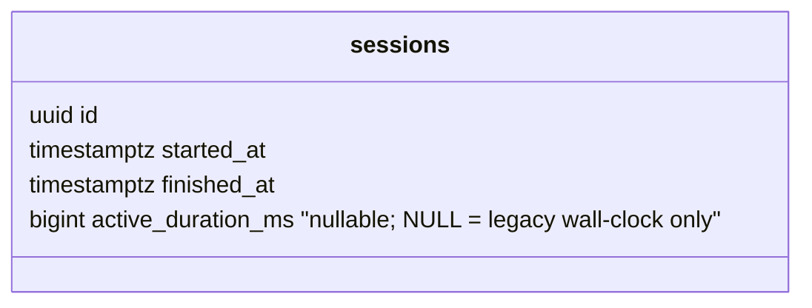
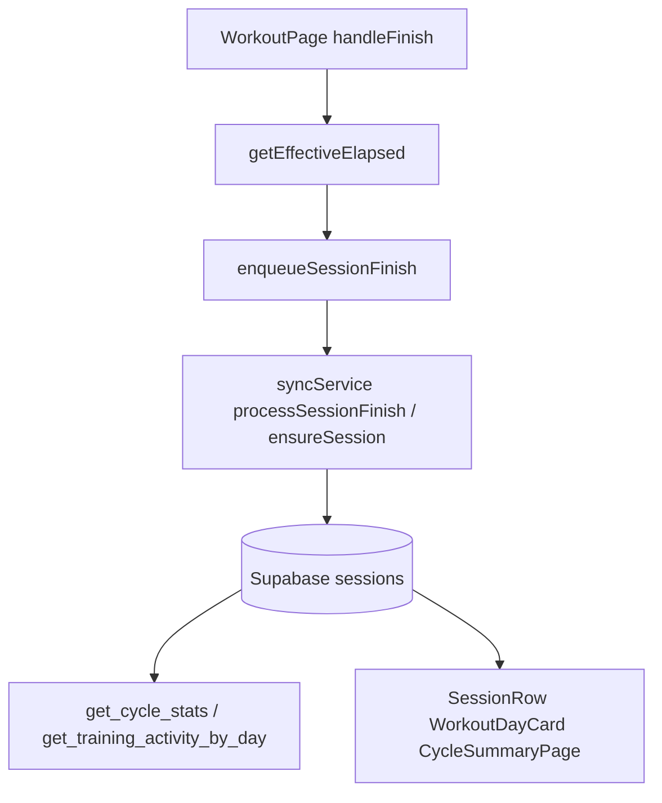

# Tech Plan — Session Duration Excludes Pause

## Architectural Approach

Persist **active (non-paused) training time** at session completion so history, cycle stats, and training-activity aggregates match the behavior already used in the live workout UI (`getEffectiveElapsed` in `file:src/lib/session.ts`). Wall-clock `started_at` / `finished_at` remain the source of truth for *when* the session happened; a new numeric column stores *how long* the user was actively training, excluding pause intervals.

### Key Decisions

| Decision | Choice | Rationale |
|---|---|---|
| Where to derive active duration | Reuse `getEffectiveElapsed(session, finishedAt)` at `handleFinish` | Same formula as `file:src/components/workout/SessionSummary.tsx` and `file:src/components/SessionTimerChip.tsx`; avoids duplicating pause math. |
| Storage shape | New nullable column `sessions.active_duration_ms` (bigint) | One value per session; no interval table; matches existing “single row per session” model. `NULL` means “legacy row — no measured active duration.” |
| Legacy / backfill | No backfill of pause data | Pauses were never stored historically; `NULL` rows keep using wall-clock `finished_at - started_at` for display and SQL `COALESCE`. |
| SQL aggregates | Update `get_cycle_stats` and `get_training_activity_by_day` to sum `COALESCE(active_duration_ms, EXTRACT(EPOCH FROM (finished_at - started_at))::bigint * 1000)` (with `GREATEST(0, …)` where minutes are derived) | Keeps dashboards consistent without double-counting once new data exists. |
| Client display | Pass `active_duration_ms` through selects; use `formatDurationMs` when present, else fall back to ISO diff | Centralizes formatting in `file:src/lib/formatters.ts` (`formatDurationMs`) for ms-based duration. |

### Critical Constraints

- **Offline queue**: `SessionFinishPayload` in `file:src/lib/syncService.ts` must include `activeDurationMs` (or equivalent) so a drain after going offline still persists the value computed at finish time. Fingerprint for `session_finish` is `realId|session_finish` only — adding a field does not change dedupe semantics.
- **Type parity**: Regenerate or extend `file:src/types/database.ts` `Session` after migration.
- **Tests**: `file:src/lib/syncService.test.ts` payloads and upsert expectations; `file:src/lib/sessionRowDuration.ts` / callers may split into “ms from DB” vs “legacy ISO pair”; existing `file:src/lib/session.test.ts` already covers `getEffectiveElapsed` — add an integration-style test that finish payload matches paused scenarios if feasible.
- **Supabase RLS**: New column is on `sessions`; existing policies apply; no policy change expected unless a new view is introduced.

---

## Data Model

### Table Notes

- **`active_duration_ms`**: Non-negative milliseconds of active training for that session. Set only when the client finishes a session (same moment as `finished_at`). If the client never sent the column (old app versions), it stays `NULL` and consumers use wall-clock duration.
- **Why not only “subtract in SQL”**: Pause boundaries are not stored server-side today; the client already maintains `pausedAt` + `accumulatedPause` in `file:src/store/atoms.ts`. Persisting the computed ms at finish is the minimal server-visible fix.

---

## Component Architecture

### Layer Overview

### New Files & Responsibilities

| File | Purpose |
|---|---|
| New migration `supabase/migrations/*_sessions_active_duration_ms.sql` | `ALTER TABLE sessions ADD COLUMN active_duration_ms bigint NULL;` optional `CHECK (active_duration_ms IS NULL OR active_duration_ms >= 0)`; replace RPC definitions that sum session duration. |

*(No new TS modules strictly required if helpers stay inline — optional small helper `getSessionDisplayDurationMs(sessionRow)` in `file:src/lib/sessionRowDuration.ts` or next to formatters.)*

### Component Responsibilities

**`WorkoutPage` (`handleFinish`)**

- Before `enqueueSessionFinish`, compute `activeDurationMs = Math.max(0, Math.round(getEffectiveElapsed(session, Date.now())))` (or use the same `finishedAt` variable passed into the payload for consistency).
- Pass into `SessionFinishPayload`.

**`syncService`**

- Extend payload and both upsert paths (`ensureSession` with finish item, `processSessionFinish`) to write `active_duration_ms`.

**History / cards**

- `file:src/components/history/SessionRow.tsx`: prefer `active_duration_ms` when selecting from API.
- `file:src/hooks/useLastSessionForDay.ts`: extend `select` to include `active_duration_ms`.

**SQL**

- `file:supabase/migrations/20260320130000_create_get_cycle_stats.sql` (replace via new migration): duration sum uses COALESCE with interval fallback.
- `file:supabase/migrations/20260323120000_get_training_activity_by_day.sql` (replace): minutes sum uses active ms when present.

### Failure Mode Analysis

| Failure | Behavior |
|---|---|
| Old client writes session without `active_duration_ms` | Column `NULL`; UI and RPCs fall back to `finished_at - started_at` (current behavior). |
| Clock skew / negative delta | Clamp with `GREATEST(0, …)` on persist and in SQL sums. |
| Finish while paused | `getEffectiveElapsed` already subtracts current pause via `pausedAt` and `accumulatedPause` (`file:src/lib/session.ts`). |
| Partial upsert before finish | Mid-session rows have no `finished_at`; `active_duration_ms` stays unset until finish upsert. |

---

## Implementation checklist (for tickets)

1. Migration: add column; replace `get_cycle_stats` and `get_training_activity_by_day` with COALESCE logic.
2. Types: `Session` + any RPC return types if typed manually.
3. `SessionFinishPayload` + `WorkoutPage` + `syncService` upserts.
4. Queries selecting session rows for duration display: include `active_duration_ms`, branch display helper.
5. Tests: sync service, session row formatting, optional RPC test if project tests SQL.

---

## References

- GitHub issue: https://github.com/PierreTsia/workout-app/issues/124
- Existing pause-aware elapsed: `file:src/lib/session.ts`, `file:src/components/SessionTimerChip.tsx`
