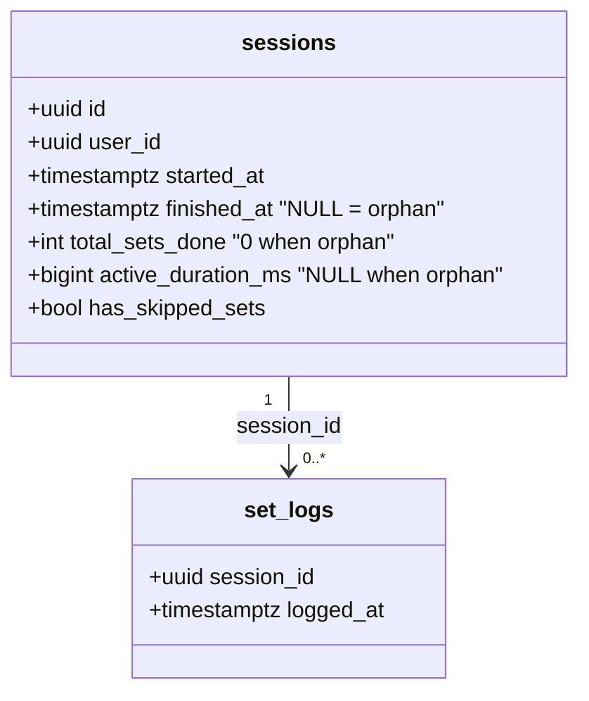
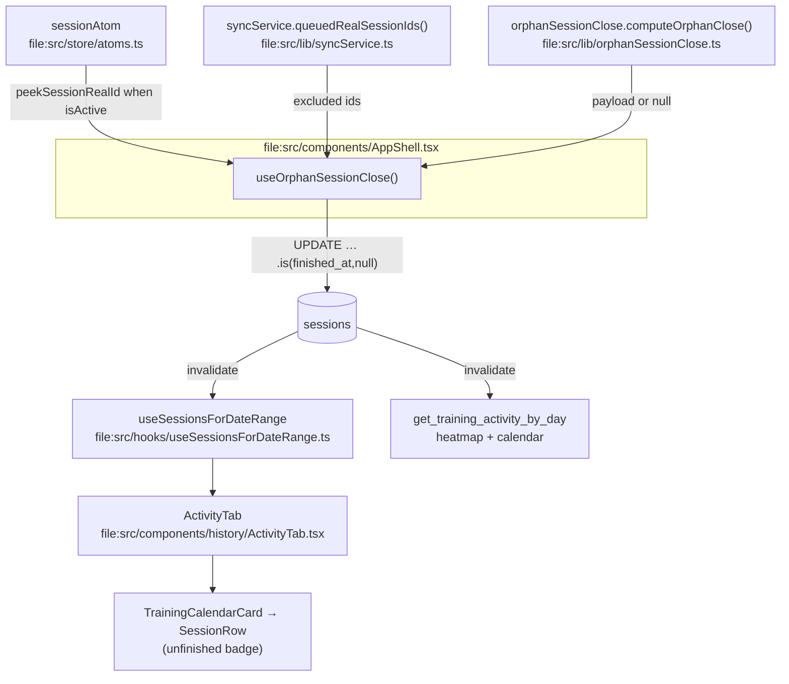

# Tech Plan — Session Orphan Self-Heal (#568)

> Implements `file:docs/../..` — issue `PierreTsia/workout-app#568` (serves as the Epic Brief: context, three slices, backfill, acceptance criteria). Glossary: `file:docs/CONTEXT.md` (**Session**). ADR to write: `file:docs/adr/0024-session-orphan-self-heal.md`.

---

## Architectural Approach

### Key Decisions

| Decision | Choice | Rationale |
|---|---|---|
| Close threshold | Ceiling of **12 h** on the last `set_logs.logged_at`, constant `ORPHAN_SESSION_THRESHOLD_MS` in `file:src/lib/orphanSessionClose.ts` | The `sessions` row carries no planned duration, and prod closes 0–1 min after the last set. 12 h is far beyond any live session and still catches the 16 h overnight orphan. The issue offered "planned duration + margin **or** a 12 h ceiling"; the ceiling is the only one the data supports. |
| `finished_at` written | Last set's `logged_at`, **never `now()`** | A close at boot must not invent a timestamp hours after the fact; the last set is the real end. |
| Close guard | Exclude the active local session **and** any `realSessionId` still present in the offline queue | `ensureSession` cannot clear `finished_at`, but a queued `session_finish` draining later **would** overwrite it with `now()`. The queue is the only writer that can fight us; we must not race it. |
| Idempotence | `UPDATE … .is("finished_at", null)` on `sessions` | Second run touches 0 rows; a session already closed (by the user or the backfill) is never re-touched. Mirrors `file:src/hooks/useFinishCycle.ts:25`, but **without** its `now()`. |
| Mount point | `file:src/components/AppShell.tsx`, next to `useSessionOrientationGuard()` | AppShell is the authenticated layout, mounted once, where auth is already resolved and where `sessionAtom` and the queue are readable. "At app open" ≠ route-scoped (`WorkoutPage`). |
| Visibility — day detail | Remove the `.not("finished_at","is",null)` in `file:src/hooks/useSessionsForDateRange.ts:23`, replace the filter in `file:src/components/history/ActivityTab.tsx:91` with `sessionsForDay()` bucketing on `finished_at ?? started_at` | The issue named `ActivityTab`; the data never arrives because the SQL filter drops it first. Both must change. The client has no per-session last set (no join), so it falls back to `started_at` for an orphan; after the auto-close `finished_at` is the last set anyway. |
| Visibility — heatmap/calendar | Modify RPC `get_training_activity_by_day` to bucket on `COALESCE(finished_at, started_at)` and include any session with sets | Chosen scope "complete": an orphan must reach the heatmap and the calendar dots too, not only the day list. Same key as the client, so a dotted day always has a matching day-list row. |
| Orphan day key | `finished_at ?? started_at` — **same key on the client and in the RPC** | The client cannot see a session's last set without a join, so both sides agree on start for an unfinished session. After the auto-close `finished_at` is the last set anyway, so the mismatch window is < 12 h. |
| Achievement replay | **None.** The close/backfill never calls `check_and_grant_achievements` | Issue invariant: the backfill makes sessions visible, it does not re-credit PRs or badges. |
| Backfill delivery | One-shot **SQL migration**, `WHERE finished_at IS NULL` | Product path (`supabase db push`), no service-role key, idempotent, no app logic to replay. A script is only justified when recomputing PR logic. |
| Mail to the 2 users | Deferred — details frozen after the fix ships | Issue §4: needs a send channel and a product decision. Out of the code slices. |
| ADR | `file:docs/adr/0024-session-orphan-self-heal.md` | The threshold, the last-set rule, the non-reconstructible fields and the no-re-grant promise are surprising enough to lock. |

### Critical Constraints

**Never fight the offline queue.** The auto-close writes directly to `sessions` (it does not `enqueueSessionFinish`, per the issue). The only danger is a `session_finish` item already in the queue: when the drain runs `processSessionFinish` (`file:src/lib/syncService.ts:918`), it upserts `finished_at` with `now()` and would overwrite the auto value. Guard: skip any session whose `realSessionId` is still in the queue (new helper `queuedRealSessionIds()`). Without it, do not ship.

**The active local session is not identified by DB id.** The queue maps `local-${startedAt}` to a UUID (`file:src/lib/syncService.ts:274-291`). The guard must read `peekSessionRealId()` when `sessionAtom.isActive`, not compare against the atom's session.

**Partial-path upsert is safe, finish-path is not.** `ensureSession` (`file:src/lib/syncService.ts:818-829`) never sends `finished_at`, so a concurrent partial sync cannot resurrect an open row — good. Only the finish path is dangerous, hence the queue guard above.

**Changing the RPC reaches other surfaces.** `get_training_activity_by_day` (`file:supabase/migrations/20260323120000_get_training_activity_by_day.sql`) is `SECURITY INVOKER`, user-scoped, and feeds the Profile heatmap and calendar outside History. Bucketing open sessions changes what "a training day" means there too. The `minutes` column currently uses `finished_at - started_at`; an orphan must use `COALESCE(finished_at, max logged_at) - started_at`.

**An active session may now appear in the heatmap.** With the RPC change, a session the user is doing right now has set logs and counts. The RPC cannot tell "live" from "abandoned". This is accepted (it is not silent either), and the auto-close makes it a finished row within 12 h.

**StrictMode symmetry.** `file:src/main.tsx` wraps in `StrictMode`: the hook mounts twice in dev. A once-per-mount ref plus the idempotent UPDATE absorb it; a test asserts 2 mounts ≠ 2 updates.

**RLS + `TZ=UTC`.** The orphan query relies on the existing user-scoped RLS on `sessions`; tests run `TZ=UTC` (`file:package.json`).

**Not reconstructible.** `has_skipped_sets` is only ever computed at finish from local state (`file:src/lib/sessionFinishStats.ts:83-91`), which is long gone for an orphan ⇒ always `false`, possibly wrong. `was_pr` was never computed for these sets ⇒ April records stay absent. Both are accepted and recorded in the ADR.

---

## Data Model

No new tables, no new columns, no localStorage keys. The change writes three existing nullable columns on `public.sessions` plus `has_skipped_sets`.



### Table Notes

- `active_duration_ms` and `has_skipped_sets` already exist (`file:supabase/migrations/20260324140000_sessions_active_duration_ms.sql`); the close and the backfill only fill them.
- The close payload is exactly `{ finished_at: max(logged_at), total_sets_done: count(set_logs), active_duration_ms: max(logged_at) − min(logged_at), has_skipped_sets: false }`.
- Backfill targets the 5 UUIDs from the issue, joined to `set_logs`, `WHERE finished_at IS NULL`.

```sql
WITH targets AS (
  SELECT unnest(ARRAY[
    '5cd0147d-bad2-49fa-868d-a82aa980faf4','a065f749-be1e-448c-8c65-7ad42811d427',
    'b6fa8e06-d6ea-428f-859a-26b1afa9b58a','6295d25b-7031-4b46-be54-734b7288bf60',
    '7bcda24a-7542-4646-b325-b71fa143fc9b'
  ]::uuid[]) AS id
),
agg AS (
  SELECT t.id,
         MAX(sl.logged_at) AS finished_at,
         COUNT(sl.id)      AS total_sets_done,
         (EXTRACT(EPOCH FROM (MAX(sl.logged_at) - MIN(sl.logged_at))) * 1000)::bigint AS active_duration_ms
  FROM targets t JOIN set_logs sl ON sl.session_id = t.id
  GROUP BY t.id
)
UPDATE sessions s
SET finished_at = a.finished_at,
    total_sets_done = a.total_sets_done,
    active_duration_ms = GREATEST(0, a.active_duration_ms),
    has_skipped_sets = false
FROM agg a
WHERE s.id = a.id AND s.finished_at IS NULL;
```

---

## Component Architecture



### New Files & Responsibilities

| File | Purpose |
|---|---|
| `src/lib/orphanSessionClose.ts` | **exists (untracked)** — pure `computeOrphanClose(logs, nowMs, threshold)` + `ORPHAN_SESSION_THRESHOLD_MS`. Keep as-is. |
| `src/lib/orphanSessionClose.test.ts` | **exists (untracked)** — unit tests for the pure calc. Keep, extend if needed. |
| `src/hooks/useOrphanSessionClose.ts` | **new** — query open sessions, apply guards, run the idempotent UPDATE once per mount, invalidate caches. |
| `src/hooks/useOrphanSessionClose.test.ts` | **new** — integration tests (payload, no-now, idempotence, guards). |
| `src/lib/syncService.ts` | edit — add `queuedRealSessionIds(): Set<string>` (read-only). |
| `src/components/AppShell.tsx` | edit — call the hook once. |
| `src/hooks/useSessionsForDateRange.ts` | edit — drop the `finished_at` filter, widen bounds to last-set. |
| `src/lib/daySessions.ts` | **new** — `sessionsForDay(sessions, key, tz)`, buckets on `finished_at ?? started_at`. |
| `src/lib/daySessions.test.ts` | **new** — reproduction test: an unfinished session is kept, not hidden. |
| `src/components/history/ActivityTab.tsx` | edit — remove the `finished_at` filter, bucket on last set. |
| `src/components/history/SessionRow.tsx` | edit — render the "unfinished" badge when `!finished_at`. |
| `supabase/migrations/*_close_orphan_sessions_backfill.sql` | **new** — one-shot backfill. |
| `supabase/migrations/*_get_training_activity_by_day_open_sessions.sql` | **new** — RPC redefinition (COALESCE on last set). |
| `docs/adr/0024-session-orphan-self-heal.md` | **new** — decision record. |
| `docs/Tech_Plan_—_Session_Orphan_Self-Heal_#568.md` | this file. |

### Component Responsibilities

**`useOrphanSessionClose()`** — no args (optional `{ enabled }`), side effects only.
- `useQuery`: `supabase.from("sessions").select("id, started_at, set_logs(logged_at)").is("finished_at", null)`, enabled on user.
- On data: build the exclusion set = `{peekSessionRealId(activeSession)} ∪ queuedRealSessionIds()`; for each remaining row run `computeOrphanClose`, and for non-null payloads fire the guard-aware UPDATE.
- UPDATE: `finished_at`, `total_sets_done`, `active_duration_ms`, `has_skipped_sets:false`, `.eq("id", id).is("finished_at", null)`.
- `onSuccess`: invalidate `["sessions-date-range"]`, `["training-activity-by-day"]` (same keys `drainQueueOnce` invalidates, `file:src/lib/syncService.ts:707-715`).
- Once per mount via ref; all eligible orphans handled in one pass.

**`queuedRealSessionIds()`** — returns `new Set(getQueue(userId).map(i => i.realSessionId))`; empty set when no user. Read-only.

**`SessionRow`** — add `{!s.finished_at && <Badge variant="secondary">{t("unfinishedBadge")}</Badge>}` next to the existing Quick badge. Duration helper already accepts a null `finished_at`.

### Failure Mode Analysis

| Failure | Behavior |
|---|---|
| A live session is open in another tab | Its realId is in the queue (its sets are enqueued) ⇒ excluded. If the queue is empty but the session is active, the atom guard excludes it. |
| A queued `session_finish` drains after the auto-close | Impossible: the id is in `queuedRealSessionIds` at decision time ⇒ skipped. |
| `computeOrphanClose` sees unparseable timestamps | Returns `null` ⇒ no write. |
| Two app mounts in StrictMode | Ref + `.is("finished_at", null)` ⇒ at most one effective UPDATE. |
| Postgres offline at boot | Query fails silently (react-query error, no throw); retried on next mount. |
| Backfill UUID not found in env | Join empty ⇒ no-op, 0 rows. Verify affected count after push. |
| RPC change regresses Profile stats | Accepted scope decision; verify Profile heatmap/totals after migration. |

---

## Delivery Pipeline (issue §"Avant de coder" + user direction)

1. **Reproduce** — a failing test (or a scripted row) proving an orphan is invisible in History: a session with `set_logs` and `finished_at null` that `ActivityTab` drops. Green when fixed.
2. **Fix in code** — Slice 1 (auto-close hook) + Slice 2 (visibility + RPC). Unit + integration + render tests.
3. **QA** — manual pass: create an orphan older than 12 h in a branch DB, open the app, confirm auto-close, History row visible with the badge, heatmap/calendar dot.
4. **Migration** — backfill the 5 prod rows via `supabase db push`, then run the acceptance query `select id from public.sessions where finished_at is null;` ⇒ 0 rows, and confirm no new `user_achievements` rows.
5. **Mail** — to the 2 affected users; channel and copy **frozen after** steps 1–4.

---

## i18n contract

**Namespace:** `history`
**Surfaces:** `SessionRow` (badge in the day list under the calendar)

| Key | EN | FR | Why this wording |
|---|---|---|---|
| `unfinishedBadge` | Not finished | Non terminée | Factual, three words, matches **Session** (feminine in FR). Marks the row without explaining the bug to the user. |

### Open

A transactional-email wording (step 5) is **not** contracted here — it lands once the send channel is chosen.

---

## Stress-Test List

1. **Queue race** — if `queuedRealSessionIds` is computed before the drain empties the queue but the UPDATE fires after, we're still safe because we skip those ids entirely (we never enqueue a competing `session_finish`).
2. **RPC scope creep** — if bucketing open sessions is unwanted on Profile, the escape hatch is to gate the RPC change behind "has sets AND (finished_at IS NOT NULL OR last set < threshold)" — a one-line `WHERE`, revertible without touching the client.
3. **Day-key coupling** — ActivityTab day key and the RPC bucket must agree (both `finished_at ?? started_at`). Enforced by a shared convention and tested on the same fixture; if they diverge, a session shows in the day list but not the heatmap (or the reverse).
4. **Migration escape hatch** — if a UUID is wrong, the CTE simply skips it; re-running with the corrected id is safe because of `WHERE finished_at IS NULL`.
5. **Issue inconsistency** — the issue says the problem is `ActivityTab`'s filter; the code shows the SQL filter drops the row first. Intentional: we fix both.

---

## i18n / Docs

- 1 new key (`history.unfinishedBadge`, EN+FR).
- ADR 0024 records: 12 h ceiling, last-set rule, `has_skipped_sets:false`, `was_pr` not recomputed, no achievement re-grant, queue guard, visibility scope, and the absence of Sentry evidence (retained reading: user never tapped Terminer).
