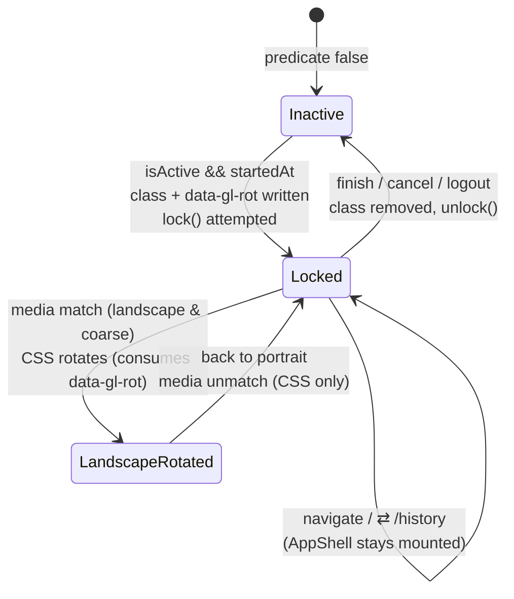
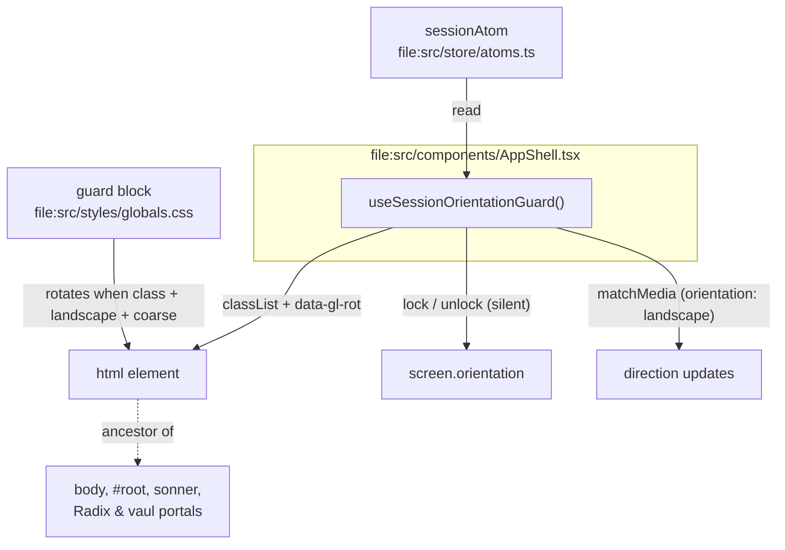

# Tech Plan — Session Portrait Guard (#501)

> Implements `file:docs/Epic_Brief_—_Session_Portrait_Guard_#501.md`. Glossary: `file:docs/CONTEXT.md` (**Session**, **Eyes-off Feedback**, **Duration Set Timer**). ADR to write: `file:docs/adr/0022-session-orientation-policy.md`. HITL direction-lock: prevent, simplest, session-scoped — no Floor HUD, no manifest change.

---

## Architectural Approach

### Key Decisions

| Decision | Choice | Rationale |
|---|---|---|
| Guard source of truth | `sessionAtom.isActive && session.startedAt != null` | Already the app's "session exists" predicate (`file:src/components/workout/SessionTimerChip.tsx:81`, `file:src/lib/cancelSession.ts:92`). True during pause (pause only writes `pausedAt`), false the moment `handleFinish` flips `isActive` (`file:src/pages/WorkoutPage.tsx:894`). |
| Mount point | `AppShell` (`file:src/components/AppShell.tsx`) | AppShell survives `WorkoutPage` unmounts (sibling routes under the layout, `file:src/router/index.tsx:173`), the atom is route-independent, and AppShell already hosts session chrome (**SessionTimerChip**). |
| OS lock | Best-effort `screen.orientation.lock("portrait")` / `unlock()` inside the same hook | Works on installed Android PWAs (issue #501 constraint note). Failure posture mirrors `file:src/hooks/useKeepScreenAwake.ts`: try/catch, silent. |
| iOS / no-lock fallback | Rotate the whole `<html>` back to a portrait visual when: guard class **and** `(orientation: landscape)` **and** `(pointer: coarse)` | One transform on the root element covers everything: `#root` content, the in-tree sonner toaster (no portal), and all Radix / vaul portals (children of `<body>`). This is the issue's "rotate overlay" tactic — the portrait layout renders upright, zero reflow of `WorkoutPage`. |
| Rotation direction | `data-gl-rot="-90" \| "90"` on `<html>`, driven by `screen.orientation.angle` (fallback `window.orientation`, then default `-90`) | Handles `landscape-primary` vs `landscape-secondary` so content-up points at the device's current top edge. |
| Viewport-unit conflict | Under the guard, override `.h-dvh` / `.min-h-dvh` to `height: 100%` / `min-height: 100%` + `body { height: 100% }` | `100dvh` still measures the *real* (landscape) viewport and would leave the shell half-empty inside the rotated box. Inside an active session the only viewport-height consumer is `file:src/components/AppShell.tsx:29` (`h-dvh`). Tailwind v4 utilities live in `@layer utilities`; a plain unlayered rule outranks them without `!important`. |
| Desktop | `(pointer: coarse)` gate on every rotated rule | Wide monitors never rotate; a desktop session is untouched. |
| Manifest | **Untouched** — no `orientation` field | The epic is Session-scoped; #501 explicitly forbids the manifest quick win. |
| Where the code lives | One hook (`useSessionOrientationGuard`) + one CSS block + one ADR | "Simplest implem": no context provider, no new atoms, no i18n, no schema. |
| i18n | No new user-facing strings | The fallback is layout, not copy. |
| ADR | `docs/adr/0022-session-orientation-policy.md` | Orientation policy is surprising (iOS vs Android diverges); issue #501 calls for an ADR once the fork is picked. |

### Critical Constraints

**Do not transform `<body>` yourself.** vaul drawers (`file:src/components/ui/drawer.tsx`, used by `RirDrawer` / `RestTimerDrawer`) set an inline `transform` on `<body>` while open (`shouldScaleBackground`). An inline body transform *composes* inside an `<html>` transform — but if we also styled a body rotation, the inline style would silently kill it. Root transform only.

**CSS must be unlayered.** Tailwind v4 puts utilities in `@layer utilities` (`file:src/styles/globals.css:1`); unlayered rules win regardless of specificity. Write the guard block as plain CSS in the same style as the existing achievement rules (`file:src/styles/globals.css:266-412`) — no `@layer`, no `!important`.

**Coexistence with the theme script.** `file:index.html:62-98` mutates `documentElement.classList` at boot. The hook only adds/removes its own class names (`gl-session-orientation-guard`, attribute `data-gl-rot`) — never `className` assignment, never touching `dark`/`light`.

**StrictMode symmetry.** `file:src/main.tsx:93` wraps in `StrictMode` — effects run twice in dev. Lock/unlock and class add/remove must be idempotent with symmetric cleanup (same pattern as `useKeepScreenAwake`).

**Silent failure is a feature.** `lock()` is `undefined` on iOS Safari and rejects on platforms requiring fullscreen. Both paths must produce zero console noise and zero thrown errors (`file:src/hooks/useKeepScreenAwake.test.ts:99-109` shows the unhandled-rejection test pattern).

**No behavior change outside an active session.** Every rotated CSS rule sits behind all three gates: guard class + landscape media + coarse pointer. Predicate false ⇒ class absent ⇒ stylesheet inert.

**Supabase in tests.** AppShell tests already exist (`file:src/components/AppShell.test.tsx`) — follow its mocking; the new hook test imports no client.

---

## Data Model

No schema, no localStorage keys, no atoms. The only state is runtime DOM on `<html>`:

```text
document.documentElement
├── classList: … dark | light | gl-session-orientation-guard?   ← set iff predicate
└── data-gl-rot: "-90" | "90"                                   ← set while active (T248 AC4); CSS consumes it only in landscape
```

Lifecycle (single owner: the hook in AppShell):



---

## Component Architecture



| File | Change | Responsibility |
|---|---|---|
| `src/hooks/useSessionOrientationGuard.ts` | **new** | Read predicate; add/remove `<html>` class; maintain `data-gl-rot` on orientation change; best-effort lock/unlock; silent failure. |
| `src/hooks/useSessionOrientationGuard.test.ts` | **new** | Unit tests (see Testing). |
| `src/components/AppShell.tsx` | edit | Call the hook once (one line). |
| `src/components/AppShell.test.tsx` | edit | Integration: session active ⇒ class present; inactive ⇒ absent. |
| `src/styles/globals.css` | edit | One plain-CSS block: landscape + coarse + `.gl-session-orientation-guard` ⇒ html swap/rotate, body/#root percentage-height chain, `.h-dvh`/`.min-h-dvh` overrides, vh→vw remaps for session-reachable vh utilities. |
| `docs/adr/0022-session-orientation-policy.md` | **new** | Context / Decision / Consequences / Alternatives (Floor HUD, manifest, overlay nudge, freeze-without-rotate). |
| `docs/CONTEXT.md` | edit | One glossary term: **Session Orientation Guard**. |
| `docs/Epic_Brief_—_Session_Portrait_Guard_#501.md` | done | Brief. |

**Hook contract:**

```ts
// no args, no return — side effects only, mirrors useKeepScreenAwake
export function useSessionOrientationGuard(): void
```

- Activation: `sessionAtom.isActive && session.startedAt != null`.
- On activate: add class; attempt `screen.orientation.lock("portrait")` (guarded by `typeof …?.lock === "function"`, `.catch(() => {})` + try/catch); write `data-gl-rot` (unconditionally while active — the landscape media query is the consumer's gate).
- On orientation change (while active): rewrite `data-gl-rot` from `screen.orientation.angle` (`> 0 … < 180` ⇒ `-90`, else `90`; fallback `window.orientation`, default `-90`).
- On deactivate / unmount: remove class + attribute; `screen.orientation.unlock()` in try/catch.

**CSS contract (sketch — plain CSS inside `src/styles/globals.css`):**

```css
@media (orientation: landscape) and (pointer: coarse) {
  html.gl-session-orientation-guard {
    width: 100vh;
    height: 100vw;
    background: #0f0f13; /* theme var */
    transform-origin: top left;
  }
  html.gl-session-orientation-guard[data-gl-rot="-90"] {
    transform: translateY(100vh) rotate(-90deg);
  }
  html.gl-session-orientation-guard[data-gl-rot="90"] {
    transform: translateX(100vw) rotate(90deg);
  }
  html.gl-session-orientation-guard body { height: 100%; }
  html.gl-session-orientation-guard #root { height: 100%; }
  html.gl-session-orientation-guard .h-dvh { height: 100%; }
  html.gl-session-orientation-guard .min-h-dvh { min-height: 100%; }
}
```

Geometry: html box is swapped to portrait dimensions (width `100vh`, height `100vw`) then rotated ±90° about the top-left corner with the matching translation, so it exactly covers the landscape viewport with a portrait-shaped layout. `position: fixed` descendants re-anchor to the transformed html (portrait box) automatically; portals inherit it because they live under `<html>`.

---

## Failure Mode Analysis

| # | Scenario | Behavior |
|---|---|---|
| 1 | `screen.orientation.lock` undefined (iOS Safari) | Type check skips silently; CSS layer is the whole defense. |
| 2 | `lock()` rejects (desktop Chrome without fullscreen, policy) | `.catch(() => {})`; CSS layer still applies on coarse devices. |
| 3 | Phone rotates to landscape mid-set | Media query engages live; `data-gl-rot` refreshed by the orientation-change listener. No React re-render needed for the CSS to apply. |
| 4 | Phone returns to portrait | Media query exits; transform gone; class stays (harmless — gates inert). |
| 5 | Session finishes / is cancelled / logout (`clearUserState`) | Predicate flips false ⇒ class removed, `unlock()`. Landscape allowed again (summary and rest of app untouched). |
| 6 | Athlete navigates `→ /history` mid-session | `WorkoutPage` unmounts; AppShell keeps the guard — correct, the session is still live. |
| 7 | Desktop session on a wide monitor | `(pointer: coarse)` never matches ⇒ zero visual change; lock attempt silent. |
| 8 | vaul drawer open (RIR, rest timer) while rotated | vaul's inline `body` scale composes inside the html transform; drawer content stays inside the rotated portrait box. Accepted cosmetic risk: drawer scale animation may read slightly odd. |
| 9 | StrictMode double effect | Additive classList operations + symmetric cleanup ⇒ idempotent. |
| 10 | Orientation angle unavailable (`screen.orientation` missing) | Fallback chain `window.orientation` → default `-90`. Worst case: content upside-down in landscape until the athlete returns to portrait (Android installed PWAs are usually locked anyway). |
| 11 | `QuickWorkoutSheet` `max-h-[90dvh]` (`file:src/components/generator/QuickWorkoutSheet.tsx:195`) under rotation | Guard block remaps it to `90vw` (= rotated box height); same remap covers the other session-reachable vh utilities (`max-h-[75/80/85/90/92vh]`, `h-[75/80vh]`, `min-h-screen`). |
| 12 | iOS keyboard opens over a rotated view (rare mid-session) | visualViewport quirks unowned by CSS rotation. Accepted: no text input is central to the training beat. |
| 13 | White flash at rotation edges / antialiasing | `background` set on the swapped html box (theme `#0f0f13`). |

---

## i18n Contract

**No new user-facing strings.** The guard is layout + platform API only — nothing to translate, no microcopy pass.

---

## Testing

Vitest + RTL, patterns from `file:src/hooks/useKeepScreenAwake.test.ts` (`renderHook`/`act`/`waitFor` from `@testing-library/react`, `vi.stubGlobal`, `vi.unstubAllGlobals`). No existing test touches `screen` — establish the stub:

| Case | Assertion |
|---|---|
| Predicate false (initial) | No class on `<html>`; `lock` never called. |
| Predicate true | Class present; exactly one `screen.orientation.lock("portrait")` attempt. |
| `lock` rejects | No unhandled rejection, no throw. |
| `lock` undefined | No throw. |
| Deactivate / unmount | Class removed; `unlock()` called. |
| Orientation change while active | `data-gl-rot` follows `screen.orientation.angle` (`45`/`90` ⇒ `-90`, `-90`/`270` ⇒ `90`). |
| AppShell integration | `getDefaultStore().set(sessionAtom, {…isActive: true, startedAt})` ⇒ class present on render; reset ⇒ absent. |

Commands: `npm test` (vitest run), `npm run lint`, `npm run build` (tsc -b). E2E landscape emulation is out — Playwright config is desktop-Chrome-only (`file:playwright.config.ts`); visual verification of the rotation is a manual HITL pass on a real phone (called out in the PR).

---

## ADR Summary (`0022-session-orientation-policy.md`)

- **Status:** Accepted · **Date:** 2026-09-24 · **Decided in:** HITL direction-lock on [#501](https://github.com/PierreTsia/workout-app/issues/501).
- **Context:** phone-on-the-floor rotates the PWA mid-**Session**; iOS ignores every lock API; issue forbids the manifest quick win.
- **Decision:** (1) v1 is **Prevent**, not Floor HUD. (2) Scope = active **Session** only. (3) Android installed PWAs get `screen.orientation.lock`; everything else gets a landscape⇒rotate CSS fallback on coarse pointers. (4) Manifest stays without `orientation`. (5) **Eyes-off Feedback** stays the eyes-off story — no duplication.
- **Alternatives:** Floor HUD (other fork, needs its own grill); manifest `orientation: portrait` (app-wide, iOS no-op); full-viewport freeze without rotate (portrait content taller than landscape viewport ⇒ crop, unusable); designed nudge overlay (works, but shows nothing useful while the phone rests mid-set — rotate keeps the whole session UI upright instead).
