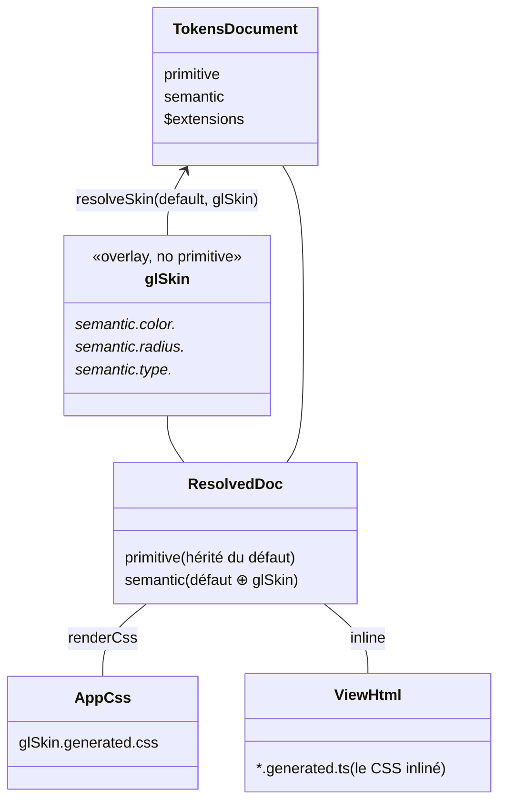
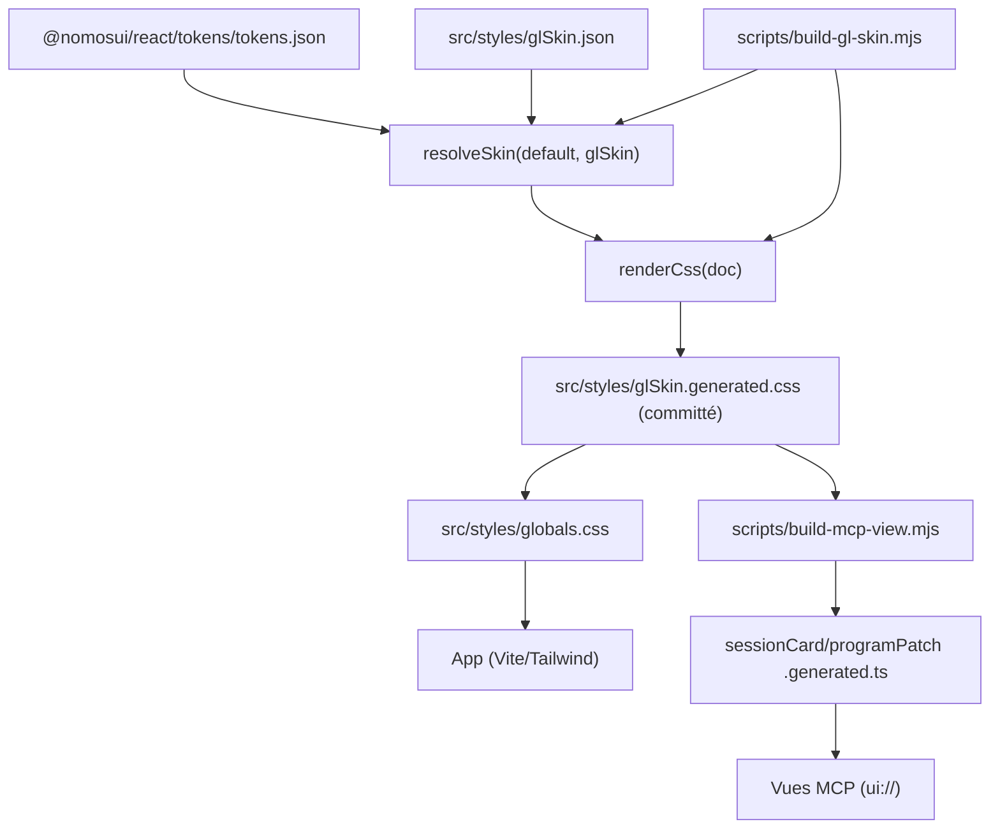

# Tech Plan — Skin GL nommé, partagé app et vues MCP (#683)

## Architectural Approach

Un **skin GL nommé** (`glSkin`) est un overlay sémantique DTCG possédé par GL, fusionné sur le défaut du cœur par `resolveSkin(default, glSkin)` (contrat Nomos ADR 0022). Cet overlay est la **source unique** dont dérivent deux rendus :

1. **le CSS de l'app** — `renderCss(resolveSkin(default, glSkin))`, produit par un script et **committé** comme artefact, importé par `file:src/styles/globals.css` ;
2. **le CSS des vues MCP** — le **même** fichier artefact, inliné par `file:scripts/build-mcp-view.mjs`.

Le `@theme` legacy couleur de `globals.css` est retiré : le raccord Tailwind vient désormais de `@nomosui/react/tokens/theme.css` (déjà importé), qui mappe les mêmes noms (`--color-primary`, `--color-border`…) depuis `--nomos-color-*`. Comme la valeur résolue de `glSkin` est **identique** aux valeurs legacy actuelles, l'opération est **value-preserving** : aucun changement visuel app, mais la parité app↔vues cesse d'être une coïncidence.

### Key Decisions

| Décision | Choix | Rationale |
|---|---|---|
| Contenu du skin | Overlay DTCG **littéral** (pas d'alias `{primitive…}`) pour `color.*` (statuts inclus), `radius.*`, `type.*` | GL possède son identité ; `resolveSkin` interdit de porter `primitive`, et un alias re-couplerait au défaut du cœur (contredit le but). |
| Format du skin | JSON DTCG `file:src/styles/glSkin.json` | Lu par deux scripts Node (ESM) et par un test vitest ; aucun transpileur requis. |
| Dérivation app | Script `file:scripts/build-gl-skin.mjs` → `file:src/styles/glSkin.generated.css` committé + `glSkin:check` | Même régime que `view:check` (ADR 0027 §5) : la dérive échoue en CI, pas en prod. |
| Import app | `globals.css` importe `./glSkin.generated.css` **au lieu de** `@nomosui/react/tokens/tokens.generated.css` | Une seule source de valeurs ; `theme.css` reste le raccord. |
| `@theme` legacy | Retirer le **mapping couleur** ; **conserver** un `@theme` minimal GL (animations + keyframes) et un bloc GL `--heatmap-*` | Les animations (`animate-accordion-*`, `animate-success-flash`) sont générées par Tailwind depuis `@theme` et sont utilisées ; la rampe heatmap n'est pas un slot sémantique Nomos. |
| Migration usages | `hsl(var(--primary\|muted\|border))` → `hsl(var(--nomos-color-…))` dans les fichiers concernés | Sans cela, retirer les valeurs legacy casse ces composants. |
| Vues | `build-mcp-view.mjs` inline `glSkin.generated.css` | La vue et l'app lisent le même octet de source. |
| Modes | On s'appuie sur le mécanisme Nomos (`.dark`/`.light`/`[data-theme]` + `prefers-color-scheme`) | L'app boot déjà sur `.dark`/`.light` (`file:index.html`, `file:src/lib/themeStorage.ts`) et les vues sur `data-theme` — compatible sans changement. |
| Version Nomos | Pin `@nomosui/react` (0.9.0 dans `package.json`), qui exporte `resolveSkin`, `renderCss`, `TokensDocument` (Nomos ADR 0025) | Surface publique seule, aucun import `dist/…`. |

### Critical Constraints

- **`resolveSkin` est bruyant par construction.** Un slot inconnu lève (`unknown slot`), un overlay portant `primitive` lève. Le build échoue donc sur une faute de frappe — à exploiter comme filet.
- **Ordre d'import CSS.** `globals.css` importe `tailwindcss`, puis l'artefact skin, puis `theme.css`, puis `tw-animate-css`. Le mapping couleur de `theme.css` doit gagner sur tout résidu ; le `@theme` minimal GL ne doit **pas** redéclarer de slot couleur (sinon on ré-introduit une seconde couche).
- **Animations couplées au `@theme`.** `--animate-accordion-down/up` et `--animate-success-flash` + leurs `@keyframes` vivent aujourd'hui dans le `@theme` legacy et sont générées par Tailwind. Les déplacer hors `@theme` perdrait les utilités `animate-*` : ils restent dans un `@theme` réduit à ces seules entrées GL.
- **`html` et guard d'orientation** (`file:src/styles/globals.css:267`, `:433-483`) lisent `hsl(var(--background))` : migration obligatoire vers `--nomos-color-background`.
- **`--heatmap-*` reste GL.** 7 stops light + 7 dark, sans équivalent sémantique Nomos : conservés dans un bloc GL `:root` / `.light` (le dark actuel sert de défaut). `file:src/components/history/TrainingHeatmap.tsx` continue de lire `var(--heatmap-N)`.
- **Artefact vue dépendant.** `view:check` compare un HTML qui contient désormais `glSkin.generated.css` ; regénérer le skin sans regénérer les vues rend `view:check` rouge. La CI doit exécuter `glSkin:check` **avant** `view:check`.
- **Fallback `dark` des vues** : inchangé (`file:src/mcp-views/*/entry.tsx`), piloté par `data-theme` de l'hôte.

---

## Data Model

Le « modèle » est le document de tokens et ses deux rendus.

### Table Notes

- **`glSkin`** ne porte que des **valeurs littérales** par mode : `{ "$value": { "dark": "174 100% 39%", "light": "174 100% 35%" } }`. Les groupes couverts : `color` (fond, surfaces, primaire/secondaire, muted, accent, destructive, border/input/ring, brand, status-*), `radius` (`pill`/`control`/`field`/`chip`), `type` (`family.sans`, `weight.regular|medium|strong`, `size.*`, `leading.*`). Les groupes non-identitaires (`z`, `motion`, `space`) restent hérités du défaut.
- **Valeurs** identiques aux valeurs legacy actuelles de `globals.css` (teal `174 100% 39%` dark / `174 100% 35%` light, surfaces `240 7% 8%`…), garantissant l'absence de régression visuelle.
- **Artefact app** : `renderCss` produit `@layer base { :root {…} @media (prefers-color-scheme: light)… .dark,.light,[data-theme]… }` — le même format que `tokens.generated.css` aujourd'hui.
- **Bloc GL `--heatmap-*`** : rampe non-sémantique, posée dans `globals.css` (hors skin) car `resolveSkin` refuserait un slot inconnu.

---

## Component Architecture

### New Files & Responsibilities

| File | Purpose |
|---|---|
| `file:src/styles/glSkin.json` | Overlay DTCG des slots d'identité GL (color/radius/type), valeurs littérales par mode |
| `file:scripts/build-gl-skin.mjs` | Lit le défaut + `glSkin`, `renderCss(resolveSkin(...))`, écrit `glSkin.generated.css` ; `--check` = non-dérive |
| `file:src/styles/glSkin.generated.css` | Artefact committé, importé par `globals.css` et inliné par le build des vues |
| `file:src/test/glSkin.arch.test.ts` | Prouve la source partagée, l'absence de `@theme` couleur legacy, le pin GL, et le câblage CI |

### Modified Files

| File | Change |
|---|---|
| `file:src/styles/globals.css` | Import de `./glSkin.generated.css` ; retrait du mapping couleur legacy `@theme` + blocs HSL `:root/.dark/.light` ; conservation `@theme` minimal animations + bloc GL heatmap + guard (migré `--nomos-color-background`) |
| `file:scripts/build-mcp-view.mjs` | `TOKENS_CSS` lit `glSkin.generated.css` au lieu de `@nomosui/react/tokens/tokens.generated.css` |
| `file:package.json` | Script `glSkin:check` |
| `file:.github/workflows/ci.yml` | Exécute `glSkin:check` avant `view:check` |
| `file:src/components/RestTimerDrawer.tsx`, `file:src/components/workout/CountdownRing.tsx`, `file:src/components/workout/ExerciseHistoryTrendChart.tsx`, `file:src/components/body-map/bodyMapColors.ts`, `file:src/components/body-map/BodyMap.tsx`, `file:src/components/history/ExerciseChart.tsx` | `hsl(var(--primary\|muted\|border))` → `hsl(var(--nomos-color-…))` |
| `file:supabase/functions/mcp/resources/views/*.generated.ts` | Régénérés (contenu CSS identique en valeurs, source changée) |
| `file:docs/adr/0027-agentic-view-contract.md` §6 | Dégradé → tenu |
| `file:docs/CONTEXT.md` | Terme **Skin GL** |

### Component Responsibilities

**`scripts/build-gl-skin.mjs`**
- Importe `resolveSkin`, `renderCss` depuis `@nomosui/react` et lit `@nomosui/react/tokens/tokens.json` (défaut) + `src/styles/glSkin.json`.
- Écrit l'artefact avec l'en-tête `Generated … do not edit by hand. Replay: npm run glSkin`.
- `--check` : compare au fichier committé, `exit 1` si dérive (calque `build-mcp-view.mjs`).

**`globals.css` (après)**
- `@import './glSkin.generated.css'` ; `@import '@nomosui/react/tokens/theme.css'`.
- `@theme` minimal : `--animate-accordion-down/up`, `--animate-success-flash` + `@keyframes` associées (GL-only, non couvertes par Nomos).
- Bloc GL `:root` (dark) / `.light` : `--heatmap-0..6`.
- `html { background-color: hsl(var(--nomos-color-background)) }`, guard d'orientation migré.

**`build-mcp-view.mjs`**
- `TOKENS_CSS = readFileSync(path.join(ROOT, 'src/styles/glSkin.generated.css'))`.
- Le reste inchangé : `view.css` (utilitaires compilés) + markup SSR + bundle IIFE.

### Failure Mode Analysis

| Failure | Behavior |
|---|---|
| Faute de frappe dans un slot `glSkin` | `resolveSkin` lève au build (`unknown slot`) → `glSkin:check`/`build:view` échouent, jamais de blanc silencieux |
| `glSkin` porte un `primitive` | `resolveSkin` lève (`a skin does not carry a primitive`) |
| Skin régénéré, vues non regénérées | `view:check` rouge en CI (les vues inlinent l'artefact) |
| Slot couleur oublié dans la migration | `grep` + arch test des usages directs ; utilité Tailwind encore résolue par `theme.css` sinon |
| App boot sans classe de mode | Nomos `@media (prefers-color-scheme)` + `:root` défaut dark → repli identique à aujourd'hui |
| `@theme` minimal redéclare une couleur | Arch test : `globals.css` ne doit contenir aucun `--color-*` legacy |

---

## i18n contract

Aucune nouvelle chaîne utilisateur. L'epic est purement CSS/tokens/build : pas de clé i18n ajoutée ni modifiée.
